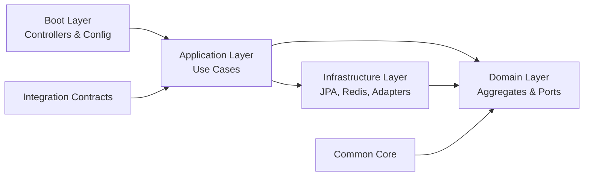
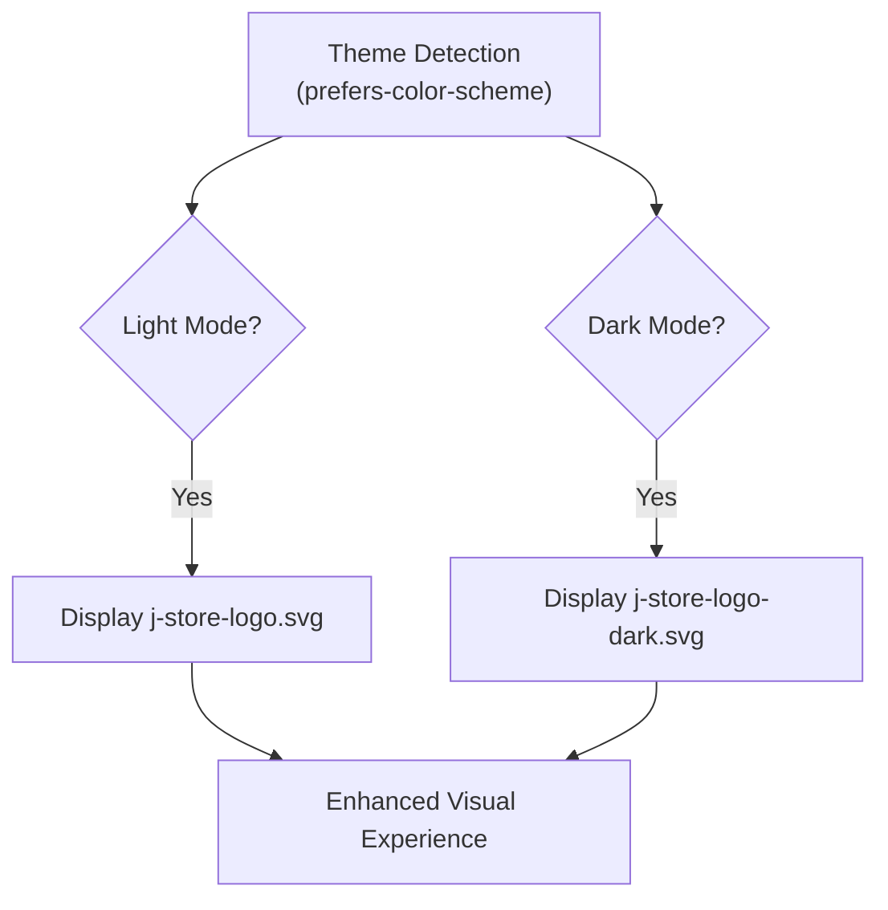
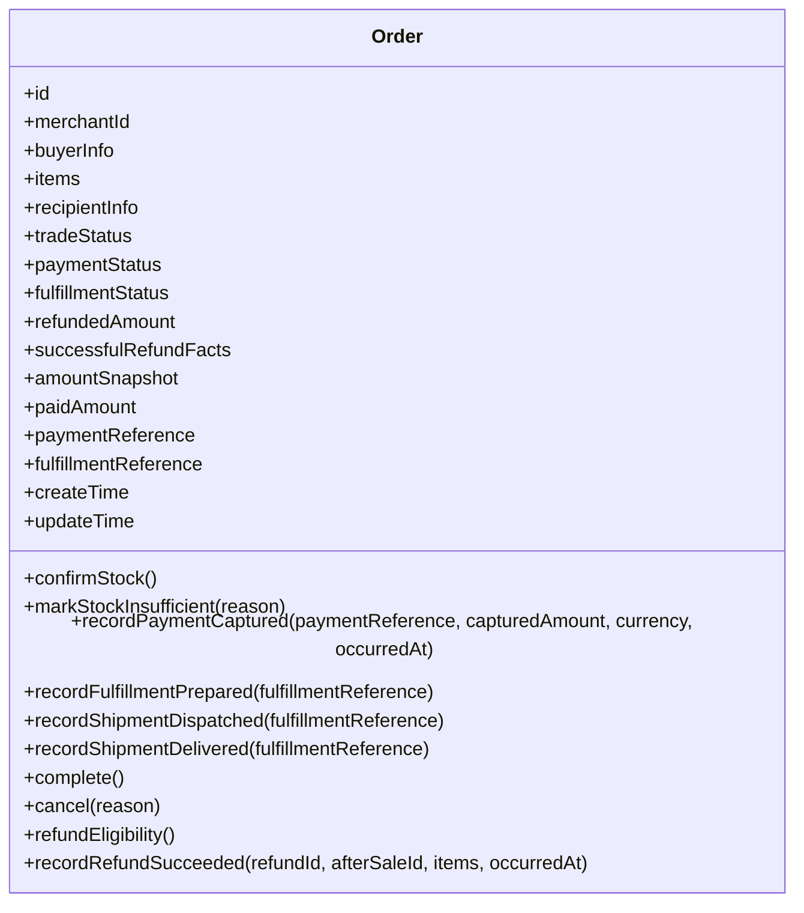
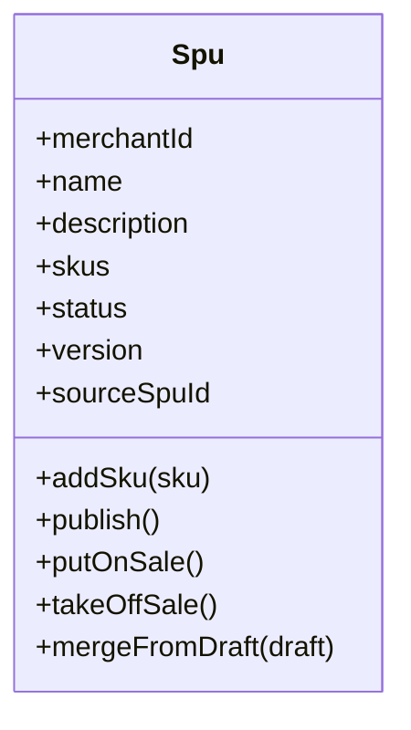
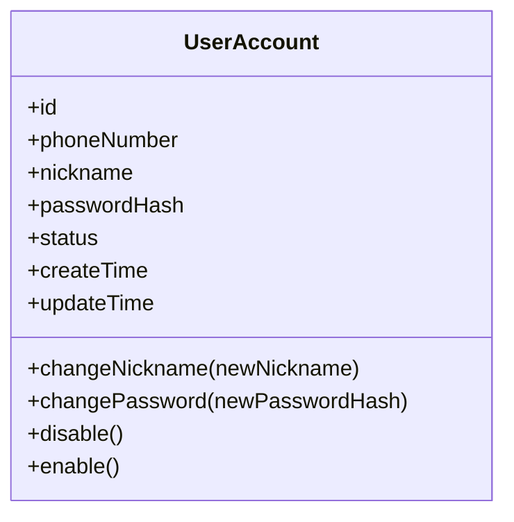
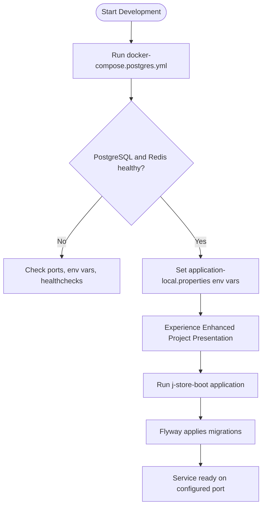
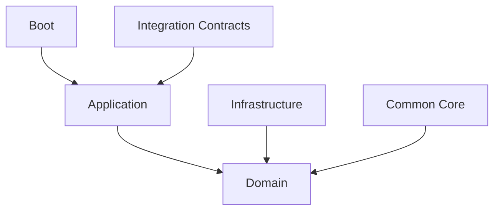

# Project Overview

<cite>
**Referenced Files in This Document**
- [settings.gradle.kts](file://settings.gradle.kts)
- [build.gradle.kts](file://build.gradle.kts)
- [gradle.properties](file://gradle.properties)
- [libs.versions.toml](file://gradle/libs.versions.toml)
- [docker-compose.postgres.yml](file://docker-compose.postgres.yml)
- [project-overview.md](file://docs/project-overview.md)
- [README.md](file://README.md)
- [JStoreOrderBootApplication.kt](file://j-store-boot/src/main/kotlin/JStoreOrderBootApplication.kt)
- [application.properties](file://j-store-boot/src/main/resources/application.properties)
- [application-local.properties](file://j-store-boot/src/main/resources/application-local.properties)
- [Order.kt](file://j-store-order-domain/src/main/kotlin/com/jstore/order/domain/order/Order.kt)
- [Spu.kt](file://j-store-goods-domain/src/main/kotlin/com/jstore/goods/domain/commodity/Spu.kt)
- [UserAccount.kt](file://j-store-user-domain/src/main/kotlin/com/jstore/user/domain/useraccount/UserAccount.kt)
</cite>

## Update Summary
**Changes Made**
- Updated Introduction section to reflect professional project branding and responsive README integration
- Added new section documenting the professional logo system with SVG/PNG assets and light/dark theme support
- Enhanced Getting Started section with updated repository presentation information
- Updated Conclusion to reflect enhanced project presentation capabilities

## Table of Contents
1. Introduction
2. Project Structure
3. Core Components
4. Architecture Overview
5. Detailed Component Analysis
6. Dependency Analysis
7. Performance Considerations
8. Troubleshooting Guide
9. Conclusion

## Introduction
J-Store is a Kotlin and Spring Boot e-commerce backend that implements Domain-Driven Design (DDD) through a modular, multi-module Gradle architecture. It organizes business capabilities into bounded contexts such as Order Management, Goods Catalog, User Authentication, Payment Processing, Fulfillment, and Accounting. The platform leverages modern tooling including Kotlin 2.3.0, Spring Boot 3.5.16, PostgreSQL, Redis, and Gradle Kotlin DSL for dependency management and build orchestration.

The project emphasizes clear architectural boundaries, testability, and operational robustness. It includes an integrated Outbox-based event infrastructure to ensure reliable cross-context communication and supports local development with Docker Compose for PostgreSQL and Redis. The repository features a professional project presentation system with responsive logo assets supporting both light and dark themes, enhancing the developer experience across different environments.

## Project Structure
J-Store uses a layered, context-oriented module layout:
- Common modules provide shared domain primitives, logging, utilities, and Spring integrations.
- Each bounded context is split into domain, application, infrastructure, and boot layers.
- A root boot module wires together the runtime, migrations, and cross-context integration points.

```mermaid
graph TB
subgraph "Common"
common_core["j-store-common-core"]
common_spring["j-store-common-spring"]
contracts["j-store-integration-contracts"]
end
subgraph "Order Context"
order_domain["j-store-order-domain"]
order_app["j-store-order-application"]
order_infra["j-store-order-infrastructure"]
order_boot["j-store-order-boot"]
end
subgraph "Goods Context"
goods_api["j-store-goods-api"]
goods_domain["j-store-goods-domain"]
goods_app["j-store-goods-application"]
goods_infra["j-store-goods-infrastructure"]
goods_boot["j-store-goods-boot"]
end
subgraph "User Context"
user_domain["j-store-user-domain"]
user_app["j-store-user-application"]
user_infra["j-store-user-infrastructure"]
user_boot["j-store-user-boot"]
end
subgraph "Payment Context"
payment_domain["j-store-payment-domain"]
payment_app["j-store-payment-application"]
payment_infra["j-store-payment-infrastructure"]
payment_boot["j-store-payment-boot"]
end
subgraph "Fulfillment Context"
fulfillment_domain["j-store-fulfillment-domain"]
fulfillment_app["j-store-fulfillment-application"]
fulfillment_infra["j-store-fulfillment-infrastructure"]
fulfillment_boot["j-store-fulfillment-boot"]
end
subgraph "Accounting Context"
accounting_domain["j-store-accounting-domain"]
accounting_app["j-store-accounting-application"]
accounting_infra["j-store-accounting-infrastructure"]
accounting_boot["j-store-accounting-boot"]
end
root_boot["j-store-boot"]
admin_boot["j-store-admin-boot"]
root_boot --> order_boot
root_boot --> goods_boot
root_boot --> user_boot
root_boot --> payment_boot
root_boot --> fulfillment_boot
root_boot --> accounting_boot
order_app --> order_domain
order_infra --> order_domain
order_boot --> order_app
order_boot --> order_infra
goods_app --> goods_domain
goods_infra --> goods_domain
goods_boot --> goods_app
goods_boot --> goods_infra
user_app --> user_domain
user_infra --> user_domain
user_boot --> user_app
user_boot --> user_infra
payment_app --> payment_domain
payment_infra --> payment_domain
payment_boot --> payment_app
payment_boot --> payment_infra
fulfillment_app --> fulfillment_domain
fulfillment_infra --> fulfillment_domain
fulfillment_boot --> fulfillment_app
fulfillment_boot --> fulfillment_infra
accounting_app --> accounting_domain
accounting_infra --> accounting_domain
accounting_boot --> accounting_app
accounting_boot --> accounting_infra
contracts --> order_app
contracts --> payment_app
contracts --> fulfillment_app
contracts --> accounting_app
common_core --> order_domain
common_core --> goods_domain
common_core --> user_domain
common_core --> payment_domain
common_core --> fulfillment_domain
common_core --> accounting_domain
common_spring --> order_infra
common_spring --> goods_infra
common_spring --> user_infra
common_spring --> payment_infra
common_spring --> fulfillment_infra
common_spring --> accounting_infra
```

**Diagram sources**
- [settings.gradle.kts](file://settings.gradle.kts)
- [project-overview.md](file://docs/project-overview.md)

**Section sources**
- [settings.gradle.kts](file://settings.gradle.kts)
- [project-overview.md](file://docs/project-overview.md)

## Core Components
- Common Core: Shared domain primitives, identifiers, Result types, error definitions, logging, and utility classes without Spring dependencies.
- Common Spring: Spring and JPA integrations, domain event listener registration, transactional outbox support, and messaging transport abstractions.
- Integration Contracts: Versioned cross-context command/event contracts used by application layers to coordinate bounded contexts.
- Bounded Contexts: Each context follows the same four-layer pattern:
  - Domain: Pure domain models, repositories, and ACL ports.
  - Application: Use cases and orchestrators; no framework coupling.
  - Infrastructure: JPA entities, repositories, external adapters, and persistence details.
  - Boot: Spring configuration, controllers, and transactional use-case decorators.

Key entry points:
- Root application class initializes Spring Boot features like JPA auditing, scheduling, and configuration properties.
- Local profiles configure database, Redis, JWT, and Outbox behavior for development.

**Updated** Enhanced project presentation with professional logo system supporting responsive design and theme-aware rendering.

**Section sources**
- [project-overview.md](file://docs/project-overview.md)
- [README.md](file://README.md)
- [JStoreOrderBootApplication.kt](file://j-store-boot/src/main/kotlin/JStoreOrderBootApplication.kt)
- [application.properties](file://j-store-boot/src/main/resources/application.properties)
- [application-local.properties](file://j-store-boot/src/main/resources/application-local.properties)

## Architecture Overview
J-Store enforces DDD layering and bounded context isolation:
- Dependencies flow from interface/boot down to application, then domain, and finally common-core.
- Infrastructure depends on domain interfaces and provides concrete implementations.
- Cross-context coordination uses versioned integration contracts and event-driven patterns via Outbox.

**Diagram sources**
- [project-overview.md](file://docs/project-overview.md)

## Detailed Component Analysis

### Professional Logo System and Project Presentation
The project now features a professional logo system with responsive design capabilities. The README.md integrates SVG logo assets with automatic light/dark theme detection using HTML `<picture>` elements and CSS media queries. This enhancement improves the visual presentation of the project across different GitHub themes and development environments.

The logo system includes:
- SVG format logos for scalability and crisp rendering at any size
- Dark mode optimized variants for better contrast in dark themes
- Responsive design that automatically switches between light and dark logos based on user preferences
- Consistent branding across all project documentation and presentations

**Diagram sources**
- [README.md](file://README.md)

**Section sources**
- [README.md](file://README.md)

### Order Management Context
The Order aggregate encapsulates trade, payment, fulfillment, and refund facts with explicit state transitions and validation rules. It exposes methods for stock confirmation, payment capture recording, fulfillment lifecycle updates, cancellation, and refund eligibility/projection.

**Diagram sources**
- [Order.kt](file://j-store-order-domain/src/main/kotlin/com/jstore/order/domain/order/Order.kt)

**Section sources**
- [Order.kt](file://j-store-order-domain/src/main/kotlin/com/jstore/order/domain/order/Order.kt)

### Goods Catalog Context
The SPU aggregate manages product metadata, SKU composition, and lifecycle states (draft, off-sale, on-sale). It supports adding SKUs, publishing, putting on sale, taking off sale, and merging draft changes into live versions.

**Diagram sources**
- [Spu.kt](file://j-store-goods-domain/src/main/kotlin/com/jstore/goods/domain/commodity/Spu.kt)

**Section sources**
- [Spu.kt](file://j-store-goods-domain/src/main/kotlin/com/jstore/goods/domain/commodity/Spu.kt)

### User Authentication Context
The UserAccount aggregate encapsulates account lifecycle behaviors such as nickname changes, password updates, and status toggling. It integrates with token providers and stores for authentication flows.

**Diagram sources**
- [UserAccount.kt](file://j-store-user-domain/src/main/kotlin/com/jstore/user/domain/useraccount/UserAccount.kt)

**Section sources**
- [UserAccount.kt](file://j-store-user-domain/src/main/kotlin/com/jstore/user/domain/useraccount/UserAccount.kt)

### Technology Stack and Build Configuration
- Kotlin 2.3.0 and Java 25 toolchain.
- Spring Boot 3.5.16 with Spring Data JPA, Web, Devtools, and configuration processor.
- PostgreSQL driver and Flyway for schema migrations.
- Redis client and Redisson for caching and distributed locks.
- JSON serialization with Jackson and Kotlin module.
- Security libraries including JJWT and Spring Security Crypto.
- Testing stack: JUnit 5, Kotest, Mockito, and Spring Boot Test.

Build and dependency management:
- Centralized versions in libs.versions.toml.
- Gradle Kotlin DSL with Spotless formatting and CycloneDX BOM generation.
- JVM args and worker settings tuned for performance.

**Section sources**
- [libs.versions.toml](file://gradle/libs.versions.toml)
- [build.gradle.kts](file://build.gradle.kts)
- [gradle.properties](file://gradle.properties)

### Getting Started and Development Environment Setup
- Start local PostgreSQL and Redis using Docker Compose.
- Configure environment variables for database URL, credentials, Redis host/port/password/database, and JWT secret.
- Run the application with the local profile to enable Flyway migrations and Outbox mode.

The enhanced project presentation includes professional branding with responsive logo assets that automatically adapt to light and dark themes, improving the overall developer experience when exploring the repository.

**Diagram sources**
- [docker-compose.postgres.yml](file://docker-compose.postgres.yml)
- [application-local.properties](file://j-store-boot/src/main/resources/application-local.properties)
- [application.properties](file://j-store-boot/src/main/resources/application.properties)
- [README.md](file://README.md)

**Section sources**
- [docker-compose.postgres.yml](file://docker-compose.postgres.yml)
- [application-local.properties](file://j-store-boot/src/main/resources/application-local.properties)
- [application.properties](file://j-store-boot/src/main/resources/application.properties)
- [README.md](file://README.md)

### Common Gradle Commands
- Run all tests: ./gradlew test
- Run specific module tests: ./gradlew :j-store-order-domain:test :j-store-order-application:test
- Build the main application jar: ./gradlew :j-store-boot:bootJar
- Additional commands are listed in the project overview documentation.

**Section sources**
- [project-overview.md](file://docs/project-overview.md)

## Dependency Analysis
Dependency direction adheres to DDD constraints:
- boot/interface -> application -> domain -> common-core
- infrastructure -> domain
- integration contracts used by application layers for cross-context coordination

**Diagram sources**
- [project-overview.md](file://docs/project-overview.md)

**Section sources**
- [project-overview.md](file://docs/project-overview.md)

## Performance Considerations
- Connection pooling: HikariCP configured with pool size and auto-commit settings for optimal throughput.
- Redis usage: Caching and distributed locking via Redisson; tune timeouts and database indices.
- Database indexing: Ensure appropriate indexes on frequently queried tables (e.g., orders, after_sales, order_items).
- Event processing: Outbox mode set to local for single-node deployments; switch to broker/hybrid when integrating message brokers.
- JVM tuning: Adjust heap and metaspace sizes in gradle.properties based on workload.

[No sources needed since this section provides general guidance]

## Troubleshooting Guide
- Database connectivity: Verify JDBC URL, username, password, and schema settings in application-local.properties.
- Redis connectivity: Confirm host, port, password, and database index; ensure Redis container is running and healthy.
- Flyway migrations: Check migration locations and baseline settings; validate schema creation flags.
- JWT configuration: Ensure secret is provided via environment variable.
- Outbox messaging: Validate mode setting (local/broker/hybrid) and related configuration keys.

**Section sources**
- [application-local.properties](file://j-store-boot/src/main/resources/application-local.properties)
- [application.properties](file://j-store-boot/src/main/resources/application.properties)

## Conclusion
J-Store delivers a robust, modular e-commerce backend grounded in DDD principles. Its clear separation of concerns, strong testing foundations, and operational tooling make it suitable for scalable and maintainable development. The enhanced project presentation system with professional logo assets and responsive theme support further improves the developer experience and project accessibility. By following the documented architecture boundaries and leveraging the provided setup instructions, teams can rapidly extend functionality across bounded contexts while ensuring consistency and reliability.

[No sources needed since this section summarizes without analyzing specific files]