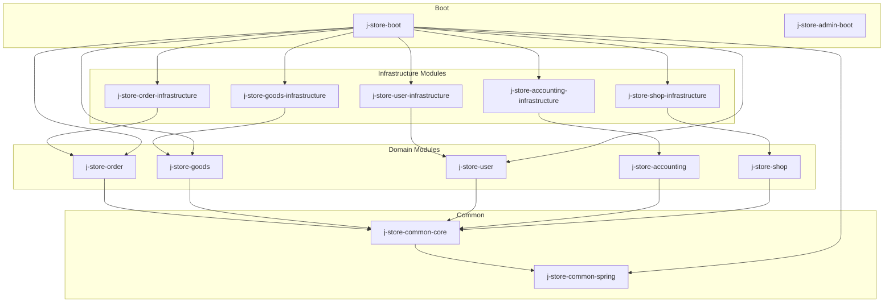
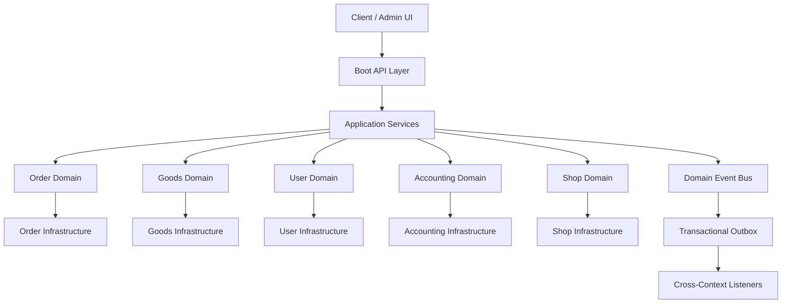
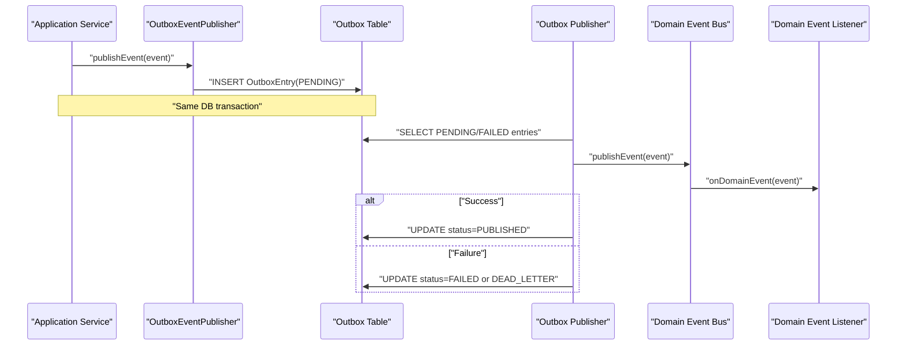
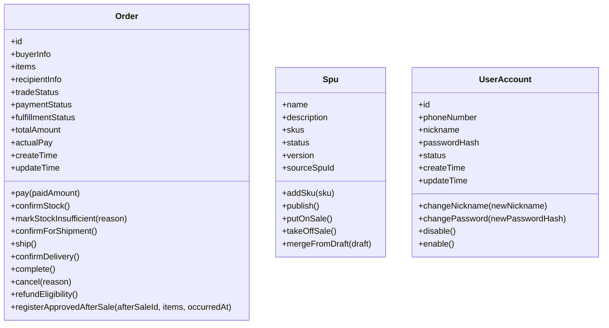
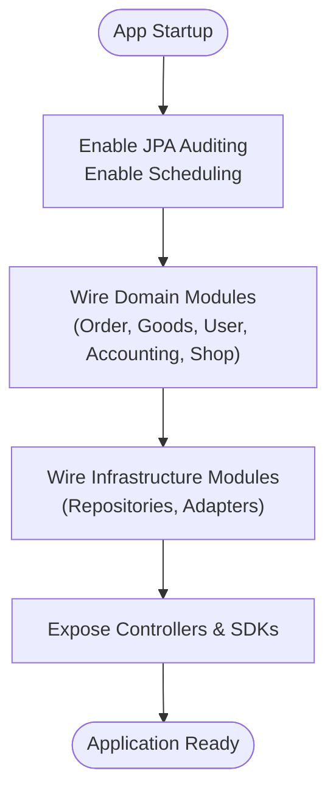
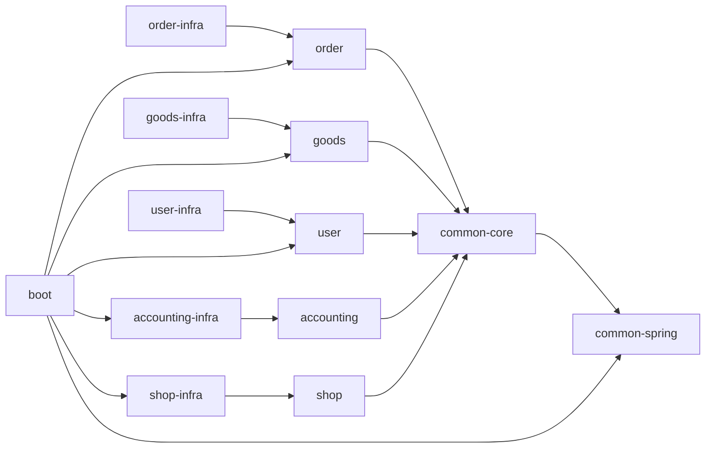

# Architecture Overview

<cite>
**Referenced Files in This Document**
- [README.md](file://README.md)
- [settings.gradle.kts](file://settings.gradle.kts)
- [build.gradle.kts](file://build.gradle.kts)
- [project-overview.md](file://docs/project-overview.md)
- [Spring-Modulith完全指南.md](file://docs/Spring-Modulith完全指南.md)
- [Spring-Modulith快速入门.md](file://docs/Spring-Modulith快速入门.md)
- [JStoreOrderBootApplication.kt](file://j-store-boot/src/main/kotlin/JStoreOrderBootApplication.kt)
- [OutboxEventPublisher.kt](file://j-store-common-spring/src/main/kotlin/com/jstore/common/framework/event/outbox/OutboxEventPublisher.kt)
- [Order.kt](file://j-store-order/src/main/kotlin/com/jstore/order/domain/order/Order.kt)
- [Spu.kt](file://j-store-goods/src/main/kotlin/com/jstore/goods/domain/commodity/Spu.kt)
- [UserAccount.kt](file://j-store-user/src/main/kotlin/com/jstore/user/domain/useraccount/UserAccount.kt)
</cite>

## Table of Contents
1. [Introduction](#introduction)
2. [Project Structure](#project-structure)
3. [Core Components](#core-components)
4. [Architecture Overview](#architecture-overview)
5. [Detailed Component Analysis](#detailed-component-analysis)
6. [Dependency Analysis](#dependency-analysis)
7. [Performance Considerations](#performance-considerations)
8. [Troubleshooting Guide](#troubleshooting-guide)
9. [Conclusion](#conclusion)
10. [Appendices](#appendices)

## Introduction
This document provides a comprehensive architecture overview for the J-Store modular monolith. It explains how Domain-Driven Design (DDD) is applied across clear bounded contexts—orders, goods, users, accounting, and shop—and how Spring Modulith organizes modules to enforce boundaries while enabling event-driven communication. The system separates concerns across presentation, application, domain, and infrastructure layers, and it includes an outbox-based eventing mechanism for reliable cross-module interactions. The document also outlines scalability considerations and an evolution path from a modular monolith toward microservices.

## Project Structure
J-Store is a Gradle multi-module project with distinct modules per bounded context and shared infrastructure:
- Common core and Spring integrations provide shared types, logging, geo utilities, and eventing infrastructure.
- Domain modules encapsulate business logic for orders, goods, users, accounting, and shop.
- Infrastructure modules implement persistence and external integrations for each domain.
- Boot modules assemble runtime components and expose APIs.

**Diagram sources**
- [settings.gradle.kts:1-28](file://settings.gradle.kts#L1-L28)
- [project-overview.md:16-35](file://docs/project-overview.md#L16-L35)

**Section sources**
- [settings.gradle.kts:1-28](file://settings.gradle.kts#L1-L28)
- [project-overview.md:16-35](file://docs/project-overview.md#L16-L35)

## Core Components
Key building blocks that underpin the modular monolith:
- Domain aggregates and value objects define rich behavior within bounded contexts.
- Application services orchestrate use cases using repositories and ACLs.
- Eventing infrastructure supports reliable cross-context communication via Outbox.
- Boot configuration wires modules together and exposes controllers.

Representative domain interfaces:
- Order aggregate defines trade, payment, fulfillment, and after-sale state transitions.
- Spu aggregate models product catalog lifecycle and snapshotting.
- UserAccount aggregate encapsulates account lifecycle and security operations.

**Section sources**
- [Order.kt:1-69](file://j-store-order/src/main/kotlin/com/jstore/order/domain/order/Order.kt#L1-L69)
- [Spu.kt:1-45](file://j-store-goods/src/main/kotlin/com/jstore/goods/domain/commodity/Spu.kt#L1-L45)
- [UserAccount.kt:1-35](file://j-store-user/src/main/kotlin/com/jstore/user/domain/useraccount/UserAccount.kt#L1-L35)

## Architecture Overview
The system follows DDD layered architecture and Spring Modulith module boundaries:
- Presentation layer: Controllers and SDKs exposed by boot modules.
- Application layer: Use case orchestrators coordinating domain and infrastructure.
- Domain layer: Aggregates, entities, value objects, and domain services.
- Infrastructure layer: Persistence (JPA), messaging (Outbox), and external adapters.

**Diagram sources**
- [project-overview.md:46-68](file://docs/project-overview.md#L46-L68)
- [Spring-Modulith完全指南.md:48-66](file://docs/Spring-Modulith完全指南.md#L48-L66)

**Section sources**
- [project-overview.md:46-68](file://docs/project-overview.md#L46-L68)
- [Spring-Modulith完全指南.md:48-66](file://docs/Spring-Modulith完全指南.md#L48-L66)

## Detailed Component Analysis

### Bounded Contexts and Module Responsibilities
- Orders: Order lifecycle management, item handling, shipping, payments, refunds, and after-sale processes.
- Goods: Product catalog (SPU/SKU), style management, draft-to-publish workflow, inventory events.
- Users: Account registration, login, token management, status control.
- Accounting: Ledger accounts, journal entries, settlement statements, and integration points with orders/payments/shops.
- Shop: Merchant/shop entity modeling and related operations.

Module organization aligns with Spring Modulith conventions:
- Public APIs at module root packages; internal implementations hidden under internal packages.
- Events defined per module to decouple cross-context interactions.

**Section sources**
- [project-overview.md:16-35](file://docs/project-overview.md#L16-L35)
- [Spring-Modulith完全指南.md:81-103](file://docs/Spring-Modulith完全指南.md#L81-L103)

### Event-Driven Communication and Outbox
Reliable asynchronous communication is achieved through domain events and a transactional outbox:
- Application services publish events via a publisher.
- Outbox persists events atomically with business data.
- A background publisher polls and dispatches events to the domain event bus.
- Consumers handle events asynchronously, ensuring eventual consistency.

**Diagram sources**
- [OutboxEventPublisher.kt:29-59](file://j-store-common-spring/src/main/kotlin/com/jstore/common/framework/event/outbox/OutboxEventPublisher.kt#L29-L59)
- [Spring-Modulith完全指南.md:67-73](file://docs/Spring-Modulith完全指南.md#L67-L73)

**Section sources**
- [OutboxEventPublisher.kt:29-59](file://j-store-common-spring/src/main/kotlin/com/jstore/common/framework/event/outbox/OutboxEventPublisher.kt#L29-L59)
- [Spring-Modulith完全指南.md:67-73](file://docs/Spring-Modulith完全指南.md#L67-L73)

### Domain Models and Aggregates
Aggregates encapsulate business rules and state transitions:
- Order: Trade, payment, fulfillment, and refund states are modeled distinctly to reflect parallel business facts.
- Spu: Product catalog with draft/publish lifecycle and snapshots for versioning.
- UserAccount: Secure account operations including nickname/password changes and status management.

**Diagram sources**
- [Order.kt:1-69](file://j-store-order/src/main/kotlin/com/jstore/order/domain/order/Order.kt#L1-L69)
- [Spu.kt:1-45](file://j-store-goods/src/main/kotlin/com/jstore/goods/domain/commodity/Spu.kt#L1-L45)
- [UserAccount.kt:1-35](file://j-store-user/src/main/kotlin/com/jstore/user/domain/useraccount/UserAccount.kt#L1-L35)

**Section sources**
- [Order.kt:1-69](file://j-store-order/src/main/kotlin/com/jstore/order/domain/order/Order.kt#L1-L69)
- [Spu.kt:1-45](file://j-store-goods/src/main/kotlin/com/jstore/goods/domain/commodity/Spu.kt#L1-L45)
- [UserAccount.kt:1-35](file://j-store-user/src/main/kotlin/com/jstore/user/domain/useraccount/UserAccount.kt#L1-L35)

### Boot Assembly and Module Wiring
The boot module assembles domain and infrastructure modules, configures Spring features, and exposes APIs:
- Enables JPA auditing and scheduling.
- Wires up controllers, configurations, and cross-context event translators.
- Integrates authentication SDK and common Spring eventing infrastructure.

**Diagram sources**
- [JStoreOrderBootApplication.kt:1-22](file://j-store-boot/src/main/kotlin/JStoreOrderBootApplication.kt#L1-L22)
- [project-overview.md:32-44](file://docs/project-overview.md#L32-L44)

**Section sources**
- [JStoreOrderBootApplication.kt:1-22](file://j-store-boot/src/main/kotlin/JStoreOrderBootApplication.kt#L1-L22)
- [project-overview.md:32-44](file://docs/project-overview.md#L32-L44)

## Dependency Analysis
Module dependencies follow DDD layering and Spring Modulith constraints:
- Domain modules depend only on common-core.
- Infrastructure modules depend on their corresponding domain modules.
- Boot depends on selected domain and infrastructure modules to compose the runtime.

**Diagram sources**
- [settings.gradle.kts:10-27](file://settings.gradle.kts#L10-L27)
- [project-overview.md:46-68](file://docs/project-overview.md#L46-L68)

**Section sources**
- [settings.gradle.kts:10-27](file://settings.gradle.kts#L10-L27)
- [project-overview.md:46-68](file://docs/project-overview.md#L46-L68)

## Performance Considerations
- Eventual consistency via Outbox reduces synchronous coupling and improves throughput.
- Batched processing and retry policies prevent database contention and deadlocks.
- Snapshotting and versioning (e.g., SPU snapshots) reduce read amplification and support efficient queries.
- Caching strategies (e.g., Redis token store) improve authentication performance.
- Scheduling and job coordination should be tuned to avoid hotspots and ensure idempotency.

[No sources needed since this section provides general guidance]

## Troubleshooting Guide
Common issues and remedies:
- Outbox backlog: Monitor pending/failed entries; adjust polling intervals and retry limits.
- Event deserialization errors: Validate event metadata and registered event classes.
- Dead letters: Investigate failed deliveries and reprocess or archive as needed.
- Database migrations: Ensure Flyway scripts are applied consistently across environments.
- Authentication failures: Check JWT provider and Redis token store connectivity.

**Section sources**
- [project-overview.md:70-84](file://docs/project-overview.md#L70-L84)
- [OutboxEventPublisher.kt:29-59](file://j-store-common-spring/src/main/kotlin/com/jstore/common/framework/event/outbox/OutboxEventPublisher.kt#L29-L59)

## Conclusion
J-Store’s modular monolith leverages DDD and Spring Modulith to create well-bounded, loosely coupled modules with clear separation of concerns. Event-driven communication ensures resilience and scalability, while the outbox pattern guarantees reliability. The architecture supports gradual evolution toward microservices by maintaining strict module boundaries and stable contracts.

[No sources needed since this section summarizes without analyzing specific files]

## Appendices
- Local environment setup and service connections are documented in the repository README.
- Gradle build configuration centralizes Java/Kotlin toolchain and repositories.

**Section sources**
- [README.md:1-53](file://README.md#L1-L53)
- [build.gradle.kts:1-28](file://build.gradle.kts#L1-L28)