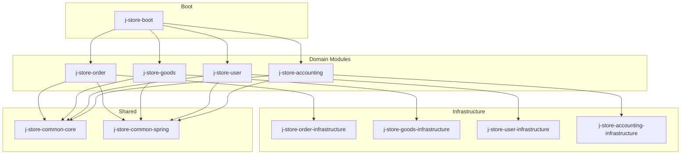
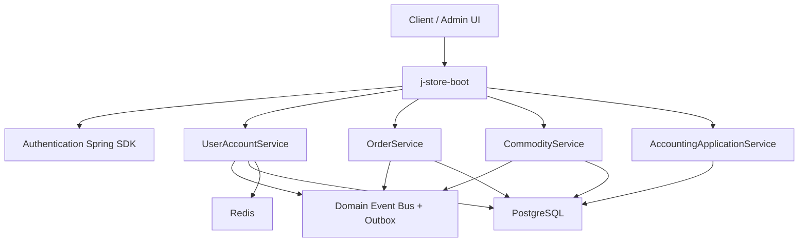
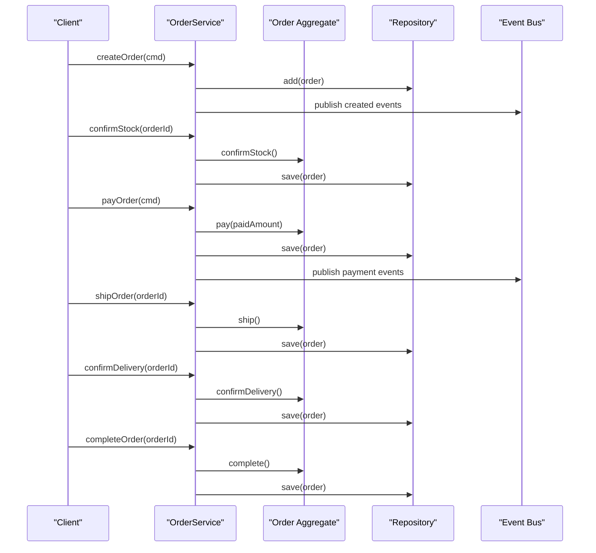
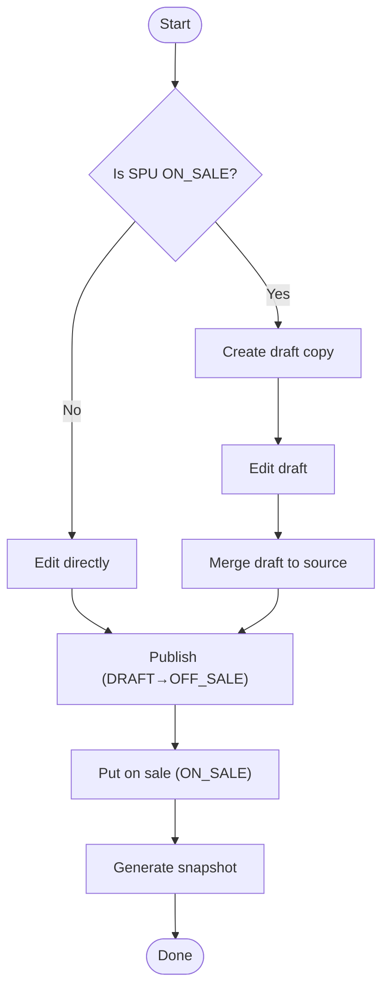
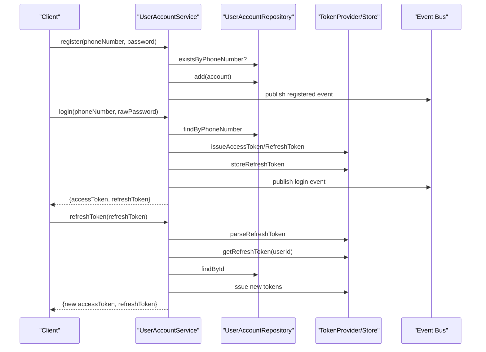
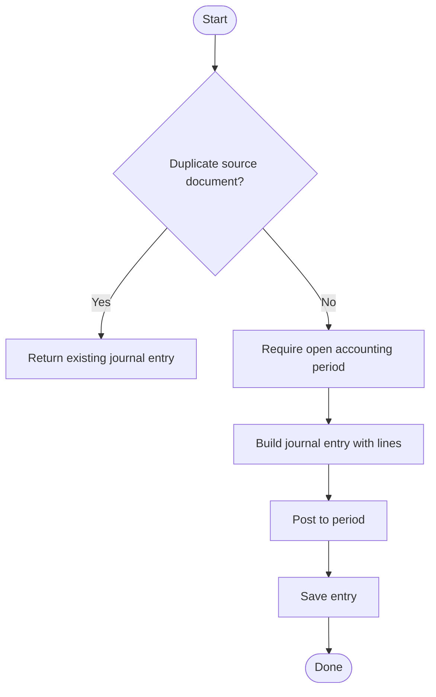
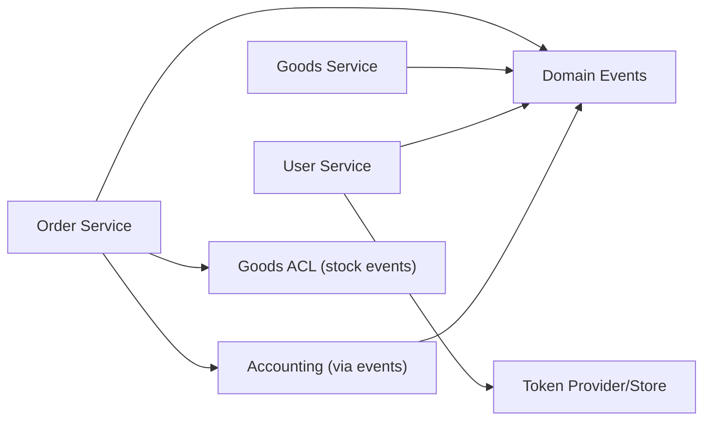

# Core Features

<cite>
**Referenced Files in This Document**
- [README.md](file://README.md)
- [project-overview.md](file://docs/project-overview.md)
- [Order.kt](file://j-store-order/src/main/kotlin/com/jstore/order/domain/order/Order.kt)
- [OrderService.kt](file://j-store-order/src/main/kotlin/com/jstore/order/service/OrderService.kt)
- [Spu.kt](file://j-store-goods/src/main/kotlin/com/jstore/goods/domain/commodity/Spu.kt)
- [CommodityService.kt](file://j-store-goods/src/main/kotlin/com/jstore/goods/service/CommodityService.kt)
- [UserAccount.kt](file://j-store-user/src/main/kotlin/com/jstore/user/domain/useraccount/UserAccount.kt)
- [UserAccountService.kt](file://j-store-user/src/main/kotlin/com/jstore/user/service/UserAccountService.kt)
- [JournalEntry.kt](file://j-store-accounting/src/main/kotlin/com/jstore/accounting/domain/journal/JournalEntry.kt)
- [AccountingApplicationService.kt](file://j-store-accounting/src/main/kotlin/com/jstore/accounting/service/AccountingApplicationService.kt)
- [SettlementStatement.kt](file://j-store-accounting/src/main/kotlin/com/jstore/accounting/domain/settlement/SettlementStatement.kt)
</cite>

## Table of Contents
1. [Introduction](#introduction)
2. [Project Structure](#project-structure)
3. [Core Components](#core-components)
4. [Architecture Overview](#architecture-overview)
5. [Detailed Component Analysis](#detailed-component-analysis)
6. [Dependency Analysis](#dependency-analysis)
7. [Performance Considerations](#performance-considerations)
8. [Troubleshooting Guide](#troubleshooting-guide)
9. [Conclusion](#conclusion)

## Introduction
This document explains the core features of the J-Store e-commerce platform with a focus on four functional areas: Order Management, Goods/Product Catalog (SPU/SKU), User Account Management, and Financial Accounting (double-entry bookkeeping and settlement statements). It describes business value, key entities, typical workflows, and how these features collaborate in real scenarios such as customer shopping and merchant operations.

J-Store is a Kotlin/Spring Boot application organized by DDD bounded contexts into Gradle modules. The boot module wires together order, goods, user, accounting, authentication SDK, and shared infrastructure. Domain events and an Outbox pattern are used for reliable cross-context communication.

**Section sources**
- [README.md](file://README.md)
- [project-overview.md](file://docs/project-overview.md)

## Project Structure
At a high level, the system is split into domain modules (order, goods, user, accounting), their infrastructure implementations, and a boot module that composes them at runtime. Shared foundations live in common-core and common-spring.

**Diagram sources**
- [project-overview.md](file://docs/project-overview.md)

**Section sources**
- [project-overview.md](file://docs/project-overview.md)

## Core Components
This section introduces the primary aggregates and application services that implement the core features.

- Order Management: Order aggregate defines trade, payment, fulfillment, and after-sale states; OrderService orchestrates lifecycle commands.
- Goods/Product Catalog: Spu aggregate models product hierarchy with SKU; CommodityService manages draft/publish flows and snapshots.
- User Account Management: UserAccount aggregate encapsulates registration, login, token management, and account status transitions; UserAccountService implements auth workflows.
- Financial Accounting: JournalEntry and SettlementStatement model double-entry bookkeeping and settlement statements; AccountingApplicationService records payments, commissions, refunds, and settlements.

**Section sources**
- [Order.kt](file://j-store-order/src/main/kotlin/com/jstore/order/domain/order/Order.kt)
- [OrderService.kt](file://j-store-order/src/main/kotlin/com/jstore/order/service/OrderService.kt)
- [Spu.kt](file://j-store-goods/src/main/kotlin/com/jstore/goods/domain/commodity/Spu.kt)
- [CommodityService.kt](file://j-store-goods/src/main/kotlin/com/jstore/goods/service/CommodityService.kt)
- [UserAccount.kt](file://j-store-user/src/main/kotlin/com/jstore/user/domain/useraccount/UserAccount.kt)
- [UserAccountService.kt](file://j-store-user/src/main/kotlin/com/jstore/user/service/UserAccountService.kt)
- [JournalEntry.kt](file://j-store-accounting/src/main/kotlin/com/jstore/accounting/domain/journal/JournalEntry.kt)
- [AccountingApplicationService.kt](file://j-store-accounting/src/main/kotlin/com/jstore/accounting/service/AccountingApplicationService.kt)
- [SettlementStatement.kt](file://j-store-accounting/src/main/kotlin/com/jstore/accounting/domain/settlement/SettlementStatement.kt)

## Architecture Overview
The system follows DDD boundaries and uses domain events to coordinate across contexts. Application services orchestrate use cases, persist aggregates via repositories, and publish events through a shared event bus. Infrastructure modules provide persistence and external integrations.

**Diagram sources**
- [project-overview.md](file://docs/project-overview.md)
- [OrderService.kt](file://j-store-order/src/main/kotlin/com/jstore/order/service/OrderService.kt)
- [CommodityService.kt](file://j-store-goods/src/main/kotlin/com/jstore/goods/service/CommodityService.kt)
- [UserAccountService.kt](file://j-store-user/src/main/kotlin/com/jstore/user/service/UserAccountService.kt)
- [AccountingApplicationService.kt](file://j-store-accounting/src/main/kotlin/com/jstore/accounting/service/AccountingApplicationService.kt)

## Detailed Component Analysis

### Order Management System
Business value: Enables customers to create orders, pay, receive goods, and handle after-sales. Merchants can fulfill orders and reconcile inventory and financials.

Key entities:
- Order: Trade, payment, fulfillment, refund dimensions; methods for confirm stock, pay, ship, confirm delivery, complete, cancel.
- OrderItem: Line items within an order.
- OrderService: Orchestrates creation, stock confirmation, payment, shipment, delivery, completion, cancellation.

Typical workflow:
- Create order → reserve stock → confirm stock or mark insufficient → pay → confirm for shipment → ship → confirm delivery → complete.
- After sale: request refund → approve → reverse original entries → settle adjustments.

**Diagram sources**
- [OrderService.kt](file://j-store-order/src/main/kotlin/com/jstore/order/service/OrderService.kt)
- [Order.kt](file://j-store-order/src/main/kotlin/com/jstore/order/domain/order/Order.kt)

Practical example:
- Customer adds items to cart, places order, pays online, receives goods, and confirms receipt. If issues arise, they request after-sale; upon approval, accounting reverses relevant entries and updates settlement statements.

**Section sources**
- [Order.kt](file://j-store-order/src/main/kotlin/com/jstore/order/domain/order/Order.kt)
- [OrderService.kt](file://j-store-order/src/main/kotlin/com/jstore/order/service/OrderService.kt)

### Goods/Product Catalog (SPU/SKU)
Business value: Provides a robust product catalog with versioned snapshots, draft editing for live products, and inventory control via events.

Key entities:
- Spu: Product definition with name, description, SKUs, status, version, and draft copy support.
- Sku: Variant-level details (attributes, price).
- CommodityService: Create/update SPU, add SKU, publish, put on sale (create snapshot), take off sale, manage drafts, and query latest snapshots.

Typical workflow:
- Draft creation → edit → publish (DRAFT → OFF_SALE) → put on sale (ON_SALE, generate snapshot) → optional take off sale.
- For ON_SALE edits, create a draft copy, merge back to source, increment snapshot version.

**Diagram sources**
- [CommodityService.kt](file://j-store-goods/src/main/kotlin/com/jstore/goods/service/CommodityService.kt)
- [Spu.kt](file://j-store-goods/src/main/kotlin/com/jstore/goods/domain/commodity/Spu.kt)

Practical example:
- Merchant creates a new product, adds variants (SKUs), publishes it, then puts it on sale generating a snapshot. When updating a live product, a draft copy is created, edited, merged back, and a new snapshot is generated.

**Section sources**
- [Spu.kt](file://j-store-goods/src/main/kotlin/com/jstore/goods/domain/commodity/Spu.kt)
- [CommodityService.kt](file://j-store-goods/src/main/kotlin/com/jstore/goods/service/CommodityService.kt)

### User Account Management
Business value: Secure registration, login, token management, and account lifecycle controls (enable/disable, forced offline).

Key entities:
- UserAccount: Phone number, nickname, password hash, status, timestamps; methods to change nickname/password, enable/disable.
- UserAccountService: Register, login, refresh tokens, find by ID, change nickname/password, disable/enable, force offline.

Typical workflow:
- Registration → store hashed password → publish registered event.
- Login → verify credentials → issue access and refresh tokens → store refresh token → publish login event.
- Refresh token → validate stored token → issue new tokens.
- Disable/Enable → update status → remove refresh token if disabled → publish forced offline event.

**Diagram sources**
- [UserAccountService.kt](file://j-store-user/src/main/kotlin/com/jstore/user/service/UserAccountService.kt)
- [UserAccount.kt](file://j-store-user/src/main/kotlin/com/jstore/user/domain/useraccount/UserAccount.kt)

Practical example:
- A new customer registers with phone number and password, logs in to receive JWT tokens, and later refreshes tokens securely. Admins can disable accounts, forcing immediate logout.

**Section sources**
- [UserAccount.kt](file://j-store-user/src/main/kotlin/com/jstore/user/domain/useraccount/UserAccount.kt)
- [UserAccountService.kt](file://j-store-user/src/main/kotlin/com/jstore/user/service/UserAccountService.kt)

### Financial Accounting (Double-Entry Bookkeeping and Settlement Statements)
Business value: Ensures accurate financial recording with debits/credits, supports order payments, commission recognition, refunds, and merchant settlement statements.

Key entities:
- JournalEntry: Entry type, source document, accounting date, status, lines (debit/credit), posting and reversal capabilities.
- SettlementStatement: Statement period, lines per order (gross, refund, commission, net), status transitions (draft → confirmed → paid).
- AccountingApplicationService: Records order paid, order completed (commission), refund approved (reversal), and settlement paid.

Typical workflow:
- Record order paid: debit clearing channel, credit merchant payable.
- Record order completed: debit merchant payable, credit platform commission.
- Record refund approved: reverse original entry (debit merchant payable, credit clearing channel).
- Record settlement paid: debit merchant payable, credit bank.

**Diagram sources**
- [AccountingApplicationService.kt](file://j-store-accounting/src/main/kotlin/com/jstore/accounting/service/AccountingApplicationService.kt)
- [JournalEntry.kt](file://j-store-accounting/src/main/kotlin/com/jstore/accounting/domain/journal/JournalEntry.kt)
- [SettlementStatement.kt](file://j-store-accounting/src/main/kotlin/com/jstore/accounting/domain/settlement/SettlementStatement.kt)

Practical example:
- When an order is paid, accounting records a debit to the payment channel clearing account and a credit to the merchant’s payable. Upon completion, commission is recognized. Refunds reverse the original entries. Settlement statements summarize net amounts due to merchants.

**Section sources**
- [JournalEntry.kt](file://j-store-accounting/src/main/kotlin/com/jstore/accounting/domain/journal/JournalEntry.kt)
- [AccountingApplicationService.kt](file://j-store-accounting/src/main/kotlin/com/jstore/accounting/service/AccountingApplicationService.kt)
- [SettlementStatement.kt](file://j-store-accounting/src/main/kotlin/com/jstore/accounting/domain/settlement/SettlementStatement.kt)

## Dependency Analysis
Cross-context interactions rely on domain events and ACL interfaces. Order interacts with goods via stock events; accounting consumes order/payment events to record entries; user authentication integrates with token providers and stores.

**Diagram sources**
- [OrderService.kt](file://j-store-order/src/main/kotlin/com/jstore/order/service/OrderService.kt)
- [CommodityService.kt](file://j-store-goods/src/main/kotlin/com/jstore/goods/service/CommodityService.kt)
- [UserAccountService.kt](file://j-store-user/src/main/kotlin/com/jstore/user/service/UserAccountService.kt)
- [AccountingApplicationService.kt](file://j-store-accounting/src/main/kotlin/com/jstore/accounting/service/AccountingApplicationService.kt)

**Section sources**
- [project-overview.md](file://docs/project-overview.md)

## Performance Considerations
- Use domain events and Outbox for reliable async processing to avoid blocking synchronous paths.
- Cache frequently accessed data (e.g., latest product snapshots) where appropriate.
- Ensure repository queries are optimized for pagination and filtering.
- Keep transaction boundaries tight around aggregate mutations to reduce lock contention.
- Leverage Redis for token storage and short-lived caches.

[No sources needed since this section provides general guidance]

## Troubleshooting Guide
Common issues and resolutions:
- Order not found: Verify order ID and repository retrieval logic.
- Stock insufficient: Confirm stock reservation flow and event handling.
- Authentication failures: Check password hashing, token validity, and refresh token storage.
- Accounting errors: Validate open accounting periods, account codes, and duplicate source documents.

**Section sources**
- [OrderService.kt](file://j-store-order/src/main/kotlin/com/jstore/order/service/OrderService.kt)
- [UserAccountService.kt](file://j-store-user/src/main/kotlin/com/jstore/user/service/UserAccountService.kt)
- [AccountingApplicationService.kt](file://j-store-accounting/src/main/kotlin/com/jstore/accounting/service/AccountingApplicationService.kt)

## Conclusion
J-Store’s core features deliver a cohesive e-commerce experience: robust order lifecycle management, flexible product catalog with versioned snapshots, secure user account management, and precise financial accounting with settlement statements. The DDD architecture and event-driven integration ensure scalability, reliability, and maintainability across domains.

[No sources needed since this section summarizes without analyzing specific files]