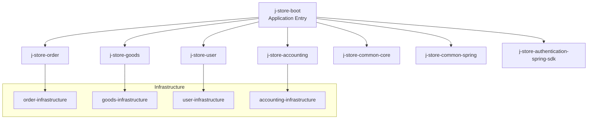
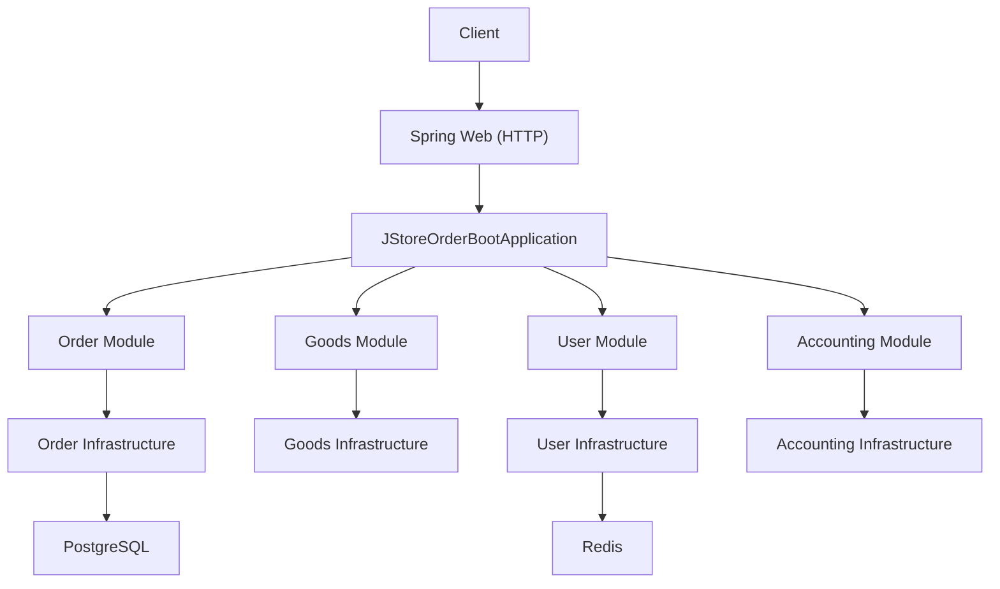
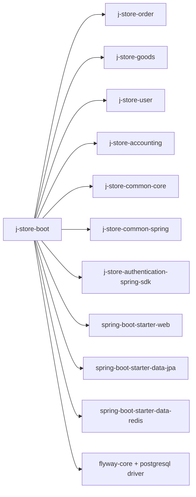

# Getting Started

<cite>
**Referenced Files in This Document**
- [README.md](file://README.md)
- [docker-compose.postgres.yml](file://docker-compose.postgres.yml)
- [Dockerfile](file://docker/postgres/Dockerfile)
- [build.gradle.kts](file://build.gradle.kts)
- [settings.gradle.kts](file://settings.gradle.kts)
- [gradle.properties](file://gradle.properties)
- [libs.versions.toml](file://gradle/libs.versions.toml)
- [application.properties](file://j-store-boot/src/main/resources/application.properties)
- [application-local.properties](file://j-store-boot/src/main/resources/application-local.properties)
- [JStoreOrderBootApplication.kt](file://j-store-boot/src/main/kotlin/JStoreOrderBootApplication.kt)
- [build.gradle.kts (boot module)](file://j-store-boot/build.gradle.kts)
</cite>

## Table of Contents
1. Introduction
2. Project Structure
3. Core Components
4. Architecture Overview
5. Detailed Component Analysis
6. Dependency Analysis
7. Performance Considerations
8. Troubleshooting Guide
9. Conclusion

## Introduction
This guide helps you set up and run the J-Store e-commerce platform locally. You will:
- Prepare your environment (Java 21 or newer, Gradle wrapper included)
- Start PostgreSQL and Redis with Docker Compose
- Initialize the database schema using Flyway
- Run the application and verify it is healthy
- Navigate the project structure and use common build commands for local development

The repository includes a Docker Compose file aligned with the local application configuration to bootstrap required services quickly.

## Project Structure
At a high level, J-Store is a multi-module Spring Boot application built with Kotlin and Gradle. The boot module assembles domain modules and infrastructure adapters into a runnable service.

Key modules:
- j-store-boot: Application entrypoint and assembly of features
- j-store-common-core and j-store-common-spring: Shared utilities and Spring integrations
- j-store-order, j-store-goods, j-store-user, j-store-accounting: Domain modules
- j-store-*-infrastructure: Persistence and external integration implementations
- j-store-authentication-spring-sdk: Authentication SDK for Spring applications

**Section sources**
- [settings.gradle.kts](file://settings.gradle.kts)
- [build.gradle.kts (boot module)](file://j-store-boot/build.gradle.kts)

## Core Components
- Application entrypoint: Spring Boot main class enabling JPA auditing, scheduling, and configuration properties.
- Configuration:
  - Base properties define application name, graceful shutdown, active profile, and Flyway settings.
  - Local profile configures server port, datasource, Hikari pool, Flyway schemas, Redis, JWT secret, logging, and outbox flags.
- Database initialization:
  - Flyway runs migrations from classpath on startup.
  - Docker Compose starts PostgreSQL and Redis with health checks.

**Section sources**
- [JStoreOrderBootApplication.kt](file://j-store-boot/src/main/kotlin/JStoreOrderBootApplication.kt)
- [application.properties](file://j-store-boot/src/main/resources/application.properties)
- [application-local.properties](file://j-store-boot/src/main/resources/application-local.properties)
- [docker-compose.postgres.yml](file://docker-compose.postgres.yml)

## Architecture Overview
The boot application wires together domain modules and their infrastructure implementations. On startup, it connects to PostgreSQL and Redis, applies Flyway migrations, and exposes HTTP endpoints via Spring Web.

**Diagram sources**
- [JStoreOrderBootApplication.kt](file://j-store-boot/src/main/kotlin/JStoreOrderBootApplication.kt)
- [build.gradle.kts (boot module)](file://j-store-boot/build.gradle.kts)
- [application-local.properties](file://j-store-boot/src/main/resources/application-local.properties)

## Detailed Component Analysis

### Environment Setup
- Java: Use Java 21 or newer. The project toolchain is configured to compile against a recent JDK; ensure your JAVA_HOME points to a compatible JDK.
- Gradle: Use the provided Gradle wrapper to avoid version mismatches.

Common commands:
- Build all modules: ./gradlew build
- Run tests: ./gradlew test
- Clean build: ./gradlew clean build
- Show dependency tree for a module: ./gradlew :j-store-boot:dependencies

**Section sources**
- [build.gradle.kts](file://build.gradle.kts)
- [gradle.properties](file://gradle.properties)
- [libs.versions.toml](file://gradle/libs.versions.toml)

### Database Initialization with Docker Compose
- Start PostgreSQL and Redis:
  - docker-compose -f docker-compose.postgres.yml up -d
- Check status:
  - docker-compose -f docker-compose.postgres.yml ps
- Stop services:
  - docker-compose -f docker-compose.postgres.yml down
- Remove volumes (deletes data):
  - docker-compose -f docker-compose.postgres.yml down -v

Notes:
- PostgreSQL image builds from a local Dockerfile that copies init scripts.
- Health checks ensure services are ready before clients connect.

**Section sources**
- [docker-compose.postgres.yml](file://docker-compose.postgres.yml)
- [Dockerfile](file://docker/postgres/Dockerfile)

### Application Startup
- Ensure the local profile is active (default).
- Start the application:
  - ./gradlew :j-store-boot:bootRun
- Verify:
  - Open http://localhost:8080 in a browser or use curl/HTTP client.
  - Check logs for successful startup and Flyway migration completion.

Configuration highlights:
- Server listens on port 8080 by default.
- Datasource URL, username, password, and Hikari pool size are defined in the local profile.
- Redis host/port/password/database are configured for local development.
- Flyway baseline and validation are enabled.

**Section sources**
- [application.properties](file://j-store-boot/src/main/resources/application.properties)
- [application-local.properties](file://j-store-boot/src/main/resources/application-local.properties)
- [JStoreOrderBootApplication.kt](file://j-store-boot/src/main/kotlin/JStoreOrderBootApplication.kt)

### Development Workflow
- Navigate modules:
  - j-store-boot: Main application and feature wiring
  - j-store-order, j-store-goods, j-store-user, j-store-accounting: Business domains
  - j-store-*-infrastructure: Data access and external integrations
  - j-store-common-*: Shared libraries
- Common tasks:
  - Compile only: ./gradlew compileKotlin
  - Run specific module tests: ./gradlew :j-store-order:test
  - Generate IDE files: ./gradlew idea or ./gradlew eclipse

**Section sources**
- [settings.gradle.kts](file://settings.gradle.kts)
- [build.gradle.kts (boot module)](file://j-store-boot/build.gradle.kts)

### Quick Start Examples
- Start dependencies:
  - docker-compose -f docker-compose.postgres.yml up -d
- Run the app:
  - ./gradlew :j-store-boot:bootRun
- Access basic endpoints:
  - GET http://localhost:8080/actuator/health (if Actuator is enabled)
  - Explore controllers under j-store-boot for available APIs
- Verify deployment:
  - Check logs for “Started” messages and no Flyway errors
  - Confirm connectivity to PostgreSQL and Redis

[No sources needed since this section provides general guidance]

## Dependency Analysis
The boot module aggregates domain and infrastructure modules and adds web, JPA, Redis, and Flyway runtime dependencies.

**Diagram sources**
- [build.gradle.kts (boot module)](file://j-store-boot/build.gradle.kts)
- [libs.versions.toml](file://gradle/libs.versions.toml)

**Section sources**
- [build.gradle.kts (boot module)](file://j-store-boot/build.gradle.kts)
- [libs.versions.toml](file://gradle/libs.versions.toml)

## Performance Considerations
- Connection pooling: Hikari maximum-pool-size is configured in the local profile; tune based on workload.
- Flyway baseline: Baseline version is set to avoid re-running initial migrations during development.
- Redis timeout: Short timeout configured for local dev; adjust if latency increases.
- Logging: Root log level set to info; enable debug for deeper insights during setup.

**Section sources**
- [application-local.properties](file://j-store-boot/src/main/resources/application-local.properties)
- [application.properties](file://j-store-boot/src/main/resources/application.properties)

## Troubleshooting Guide
- Cannot connect to PostgreSQL:
  - Verify container is running and ports mapped correctly.
  - Confirm JDBC URL, username, password, and schema match local profile.
  - Check health endpoint of the Postgres container.
- Redis connection failures:
  - Ensure Redis container is up and reachable at configured host/port.
  - Validate password and database index in local profile.
- Flyway migration errors:
  - Review migration files and baseline version.
  - Clear local DB volume cautiously when starting fresh.
- Port conflicts:
  - Change server.port in local profile if 8080 is occupied.
- Java version mismatch:
  - Ensure JAVA_HOME points to Java 21+ and matches toolchain expectations.

**Section sources**
- [docker-compose.postgres.yml](file://docker-compose.postgres.yml)
- [application-local.properties](file://j-store-boot/src/main/resources/application-local.properties)
- [application.properties](file://j-store-boot/src/main/resources/application.properties)
- [README.md](file://README.md)

## Conclusion
You now have the essentials to run J-Store locally: prepare your environment, start PostgreSQL and Redis, apply database migrations, and launch the application. Use the quick start commands and troubleshooting tips to resolve common issues. For further exploration, review the module structure and configuration files referenced above.