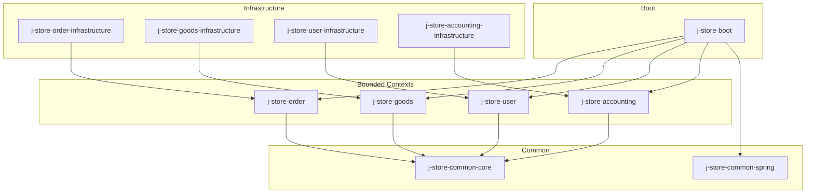
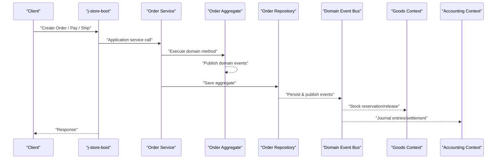
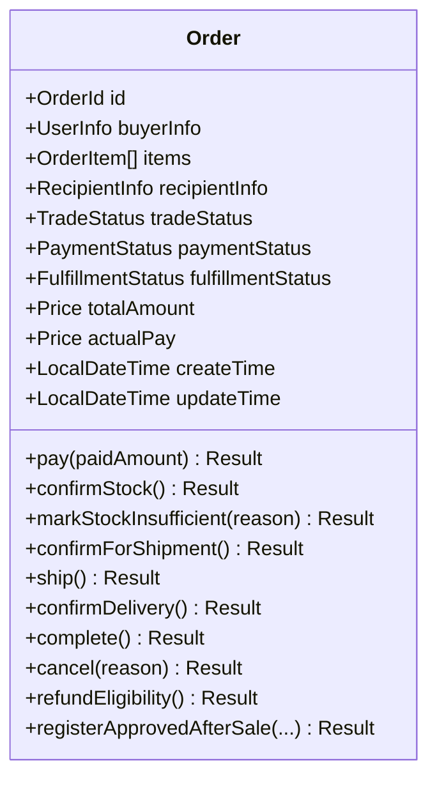
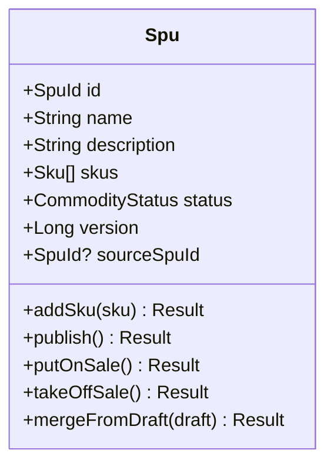
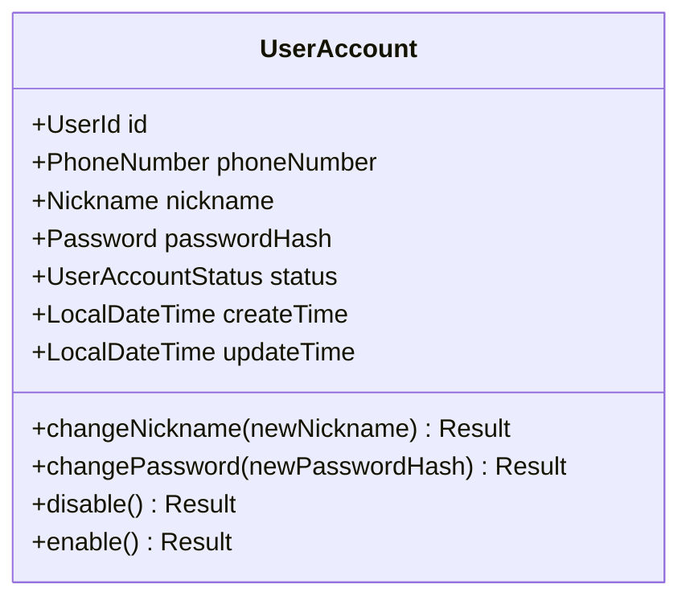
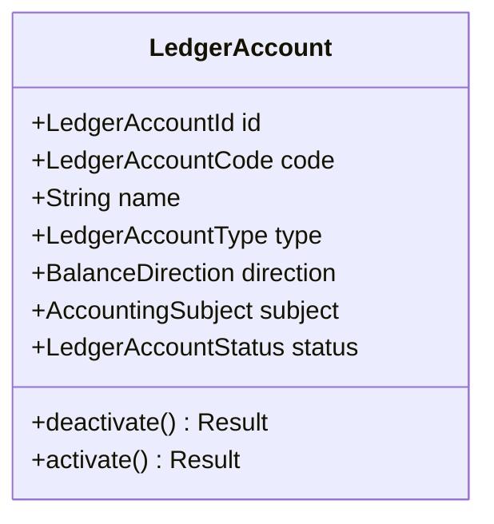
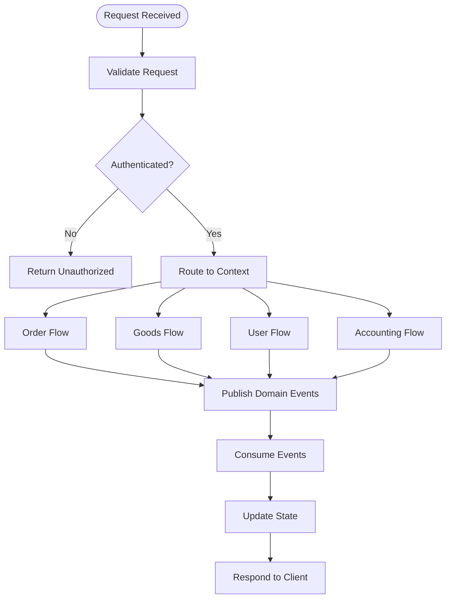
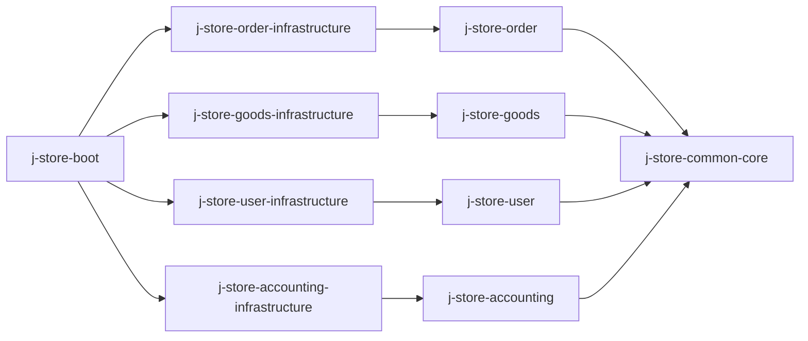

# Project Overview

<cite>
**Referenced Files in This Document**
- [README.md](file://README.md)
- [build.gradle.kts](file://build.gradle.kts)
- [settings.gradle.kts](file://settings.gradle.kts)
- [libs.versions.toml](file://gradle/libs.versions.toml)
- [project-overview.md](file://docs/project-overview.md)
- [ddd-guidelines.md](file://docs/steering/ddd-guidelines.md)
- [application.properties](file://j-store-boot/src/main/resources/application.properties)
- [docker-compose.postgres.yml](file://docker-compose.postgres.yml)
- [JStoreOrderBootApplication.kt](file://j-store-boot/src/main/kotlin/JStoreOrderBootApplication.kt)
- [AgreeGate.kt](file://j-store-common-core/src/main/kotlin/com/jstore/common/framework/AgreeGate.kt)
- [Entity.kt](file://j-store-common-core/src/main/kotlin/com/jstore/common/framework/Entity.kt)
- [Order.kt](file://j-store-order/src/main/kotlin/com/jstore/order/domain/order/Order.kt)
- [Spu.kt](file://j-store-goods/src/main/kotlin/com/jstore/goods/domain/commodity/Spu.kt)
- [LedgerAccount.kt](file://j-store-accounting/src/main/kotlin/com/jstore/accounting/domain/account/LedgerAccount.kt)
- [UserAccount.kt](file://j-store-user/src/main/kotlin/com/jstore/user/domain/useraccount/UserAccount.kt)
</cite>

## Table of Contents
1. Introduction
2. Project Structure
3. Core Components
4. Architecture Overview
5. Detailed Component Analysis
6. Dependency Analysis
7. Performance Considerations
8. Troubleshooting Guide
9. Conclusion

## Introduction
J-Store is a Kotlin/Spring Boot e-commerce platform built with Domain-Driven Design (DDD) and a modular monolith architecture. It models key business domains as bounded contexts: Orders, Goods, Users, and Accounting. The system uses an event-driven approach to coordinate cross-context workflows such as order fulfillment, inventory reservation/release, and financial accounting entries.

Key technology highlights:
- Kotlin 2.3.0 with Spring Boot 3.5.16
- PostgreSQL for persistence and Redis for caching/token storage
- JWT-based authentication via a dedicated Spring SDK
- Gradle multi-module project with clear layering and dependency rules

This overview provides both a conceptual introduction for newcomers and technical details for experienced developers, using terminology consistent with the codebase such as DDD, modular monolith, and event-driven architecture.

## Project Structure
The repository is organized into multiple Gradle modules aligned with DDD bounded contexts and shared infrastructure:
- Common layers: j-store-common-core (framework primitives), j-store-common-spring (Spring integrations)
- Bounded contexts: j-store-order, j-store-goods, j-store-user, j-store-accounting
- Infrastructure per context: *-infrastructure modules implementing JPA repositories and adapters
- Application entry points: j-store-boot (main bootstrapping), j-store-admin-boot (admin skeleton)
- Additional skeletons: j-store-shop, j-store-warehouse

**Diagram sources**
- [settings.gradle.kts:1-28](file://settings.gradle.kts#L1-L28)
- [project-overview.md:16-35](file://docs/project-overview.md#L16-L35)

**Section sources**
- [settings.gradle.kts:1-28](file://settings.gradle.kts#L1-L28)
- [project-overview.md:16-35](file://docs/project-overview.md#L16-L35)

## Core Components
At the heart of the system are domain aggregates that encapsulate business logic and state transitions:
- Order aggregate: manages trade, payment, fulfillment, and after-sale dimensions; exposes commands like pay, confirmStock, ship, cancel, refundEligibility.
- Spu aggregate: models product catalog with SPU/SKU, draft/publish lifecycle, and snapshots.
- UserAccount aggregate: handles registration, login, nickname/password changes, and account status management.
- LedgerAccount aggregate: foundational accounting entity for subjects, types, and balance direction.

These aggregates implement common framework interfaces from j-store-common-core:
- Entity<I> defines identity
- AgreeGate<I> extends Entity and provides a domain event queue for publishing events during transactions

Practical examples:
- Order management: create order, confirm stock, pay, ship, confirm delivery, complete, or cancel; handle insufficient stock events.
- Product catalog: create SPU/SKU, publish/draft workflow, manage on-sale/off-sale states.
- User accounts: register user, change nickname/password, enable/disable account, issue JWT tokens.
- Financial accounting: define ledger accounts, record journal entries, settle statements based on orders/payments.

**Section sources**
- [Order.kt:12-68](file://j-store-order/src/main/kotlin/com/jstore/order/domain/order/Order.kt#L12-L68)
- [Spu.kt:11-44](file://j-store-goods/src/main/kotlin/com/jstore/goods/domain/commodity/Spu.kt#L11-L44)
- [UserAccount.kt:14-34](file://j-store-user/src/main/kotlin/com/jstore/user/domain/useraccount/UserAccount.kt#L14-L34)
- [LedgerAccount.kt:30-41](file://j-store-accounting/src/main/kotlin/com/jstore/accounting/domain/account/LedgerAccount.kt#L30-L41)
- [AgreeGate.kt:6-21](file://j-store-common-core/src/main/kotlin/com/jstore/common/framework/AgreeGate.kt#L6-L21)
- [Entity.kt:3-5](file://j-store-common-core/src/main/kotlin/com/jstore/common/framework/Entity.kt#L3-L5)

## Architecture Overview
J-Store follows a modular monolith with clear boundaries between layers and contexts:
- Interface/boot layer orchestrates controllers, configuration, and scheduling
- Infrastructure layer implements persistence (JPA/PostgreSQL), caching (Redis), and external integrations
- Domain/application layers contain pure business logic and application services
- Cross-context communication uses domain events and ACL interfaces

Event-driven coordination:
- Aggregates publish domain events via AgreeGate
- Events are persisted and published within transactional boundaries
- Outbox pattern ensures reliable event delivery
- Consumers react to events (e.g., inventory confirmation/release, accounting entries)

Authentication:
- JWT-based authentication provided by a Spring SDK
- Interceptors and argument resolvers enforce login requirements and inject current user context

Runtime:
- Flyway-managed database migrations
- Docker Compose for local PostgreSQL and Redis
- Spring Boot application properties configure profiles and features

**Diagram sources**
- [JStoreOrderBootApplication.kt:11-21](file://j-store-boot/src/main/kotlin/JStoreOrderBootApplication.kt#L11-L21)
- [AgreeGate.kt:6-21](file://j-store-common-core/src/main/kotlin/com/jstore/common/framework/AgreeGate.kt#L6-L21)
- [project-overview.md:46-59](file://docs/project-overview.md#L46-L59)

**Section sources**
- [application.properties:1-11](file://j-store-boot/src/main/resources/application.properties#L1-L11)
- [docker-compose.postgres.yml:1-40](file://docker-compose.postgres.yml#L1-L40)
- [project-overview.md:46-59](file://docs/project-overview.md#L46-L59)

## Detailed Component Analysis

### Order Management (Orders Bounded Context)
The Order aggregate models parallel business facts across trade, payment, fulfillment, and after-sale dimensions. Commands include pay, confirmStock, markStockInsufficient, confirmForShipment, ship, confirmDelivery, complete, cancel, and refund eligibility checks.

**Diagram sources**
- [Order.kt:12-68](file://j-store-order/src/main/kotlin/com/jstore/order/domain/order/Order.kt#L12-L68)

**Section sources**
- [Order.kt:12-68](file://j-store-order/src/main/kotlin/com/jstore/order/domain/order/Order.kt#L12-L68)

### Product Catalog (Goods Bounded Context)
The Spu aggregate represents product information with SKU variants, draft/publish lifecycle, and snapshots. Methods support adding SKUs, publishing, putting on sale/taking off sale, and merging drafts.

**Diagram sources**
- [Spu.kt:11-44](file://j-store-goods/src/main/kotlin/com/jstore/goods/domain/commodity/Spu.kt#L11-L44)

**Section sources**
- [Spu.kt:11-44](file://j-store-goods/src/main/kotlin/com/jstore/goods/domain/commodity/Spu.kt#L11-L44)

### User Accounts (Users Bounded Context)
The UserAccount aggregate encapsulates user lifecycle operations including nickname/password changes and account enable/disable. It integrates with JWT token providers and Redis token stores in infrastructure.

**Diagram sources**
- [UserAccount.kt:14-34](file://j-store-user/src/main/kotlin/com/jstore/user/domain/useraccount/UserAccount.kt#L14-L34)

**Section sources**
- [UserAccount.kt:14-34](file://j-store-user/src/main/kotlin/com/jstore/user/domain/useraccount/UserAccount.kt#L14-L34)

### Financial Accounting (Accounting Bounded Context)
The LedgerAccount aggregate defines core accounting concepts such as account codes, types, balance directions, and subject associations. It supports activation/deactivation and serves as a foundation for journal entries and settlement statements.

**Diagram sources**
- [LedgerAccount.kt:30-41](file://j-store-accounting/src/main/kotlin/com/jstore/accounting/domain/account/LedgerAccount.kt#L30-L41)

**Section sources**
- [LedgerAccount.kt:30-41](file://j-store-accounting/src/main/kotlin/com/jstore/accounting/domain/account/LedgerAccount.kt#L30-L41)

### Conceptual Overview
At a high level, J-Store coordinates cross-context workflows through domain events:
- Order creation triggers inventory reservation requests
- Payment confirmation leads to shipment preparation and accounting entries
- After-sale processes trigger stock restoration and refund settlements
- User authentication secures access via JWT tokens stored in Redis

[No sources needed since this diagram shows conceptual workflow, not actual code structure]

## Dependency Analysis
The project enforces strict dependency direction following DDD principles:
- boot → infrastructure → domain module → common-core
- Domain modules depend only on common-core
- Infrastructure modules implement domain interfaces and introduce framework dependencies
- Cross-context collaboration uses ACL interfaces and domain events

**Diagram sources**
- [settings.gradle.kts:10-26](file://settings.gradle.kts#L10-L26)
- [project-overview.md:48-59](file://docs/project-overview.md#L48-L59)

**Section sources**
- [settings.gradle.kts:10-26](file://settings.gradle.kts#L10-L26)
- [project-overview.md:48-59](file://docs/project-overview.md#L48-L59)

## Performance Considerations
- Use Redis for caching frequently accessed data and storing JWT tokens to reduce database load
- Implement pagination for large datasets using Page/SortedPage wrappers
- Leverage Spring Data JPA repositories for efficient queries
- Apply outbox pattern for reliable event processing without blocking transactions
- Monitor database performance with proper indexing and query optimization
- Consider connection pooling for PostgreSQL and Redis clients

## Troubleshooting Guide
Common issues and solutions:
- Database connectivity: Verify PostgreSQL connection settings in application-local.properties and docker-compose configuration
- Redis connectivity: Ensure Redis service is running and accessible on port 6379
- Authentication failures: Check JWT token provider configuration and Redis token store settings
- Event processing: Monitor outbox table for pending events and consumer lag
- Migration issues: Review Flyway migration scripts and baseline versions

**Section sources**
- [README.md:34-53](file://README.md#L34-L53)
- [docker-compose.postgres.yml:1-40](file://docker-compose.postgres.yml#L1-L40)
- [application.properties:1-11](file://j-store-boot/src/main/resources/application.properties#L1-L11)

## Conclusion
J-Store demonstrates a well-structured DDD implementation with modular monolith architecture. The clear separation of concerns, event-driven communication, and comprehensive testing strategy provide a solid foundation for scalable e-commerce functionality. The system effectively balances simplicity with extensibility, making it suitable for both development and production environments.

[No sources needed since this section summarizes without analyzing specific files]