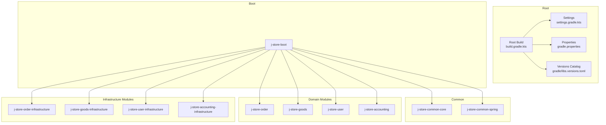
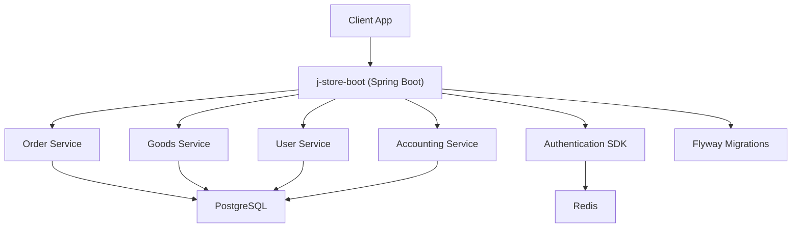
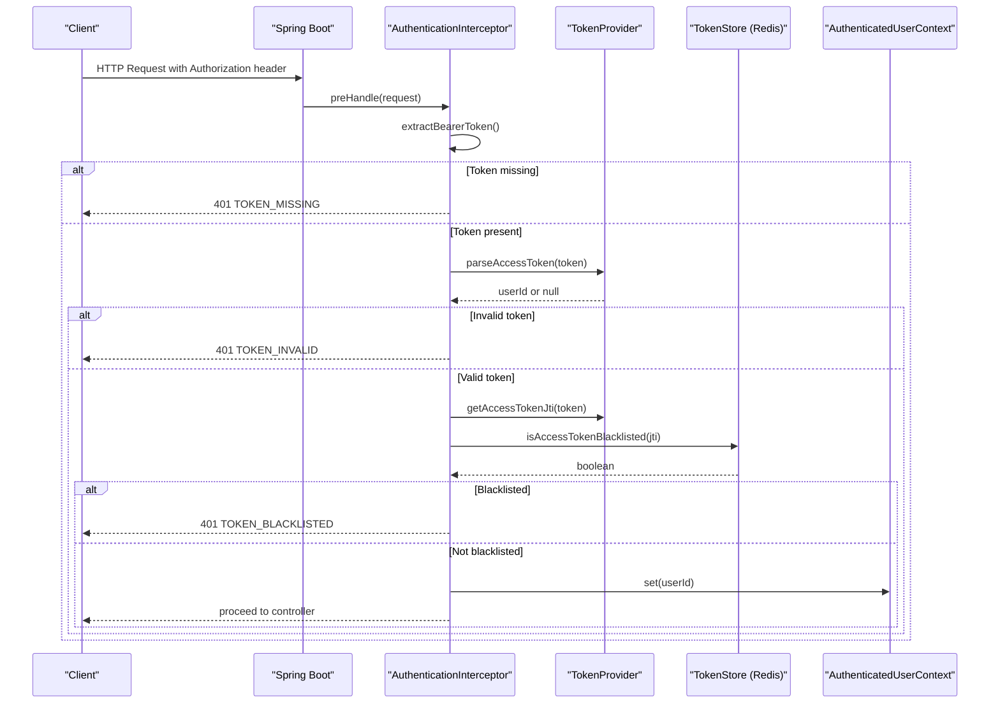
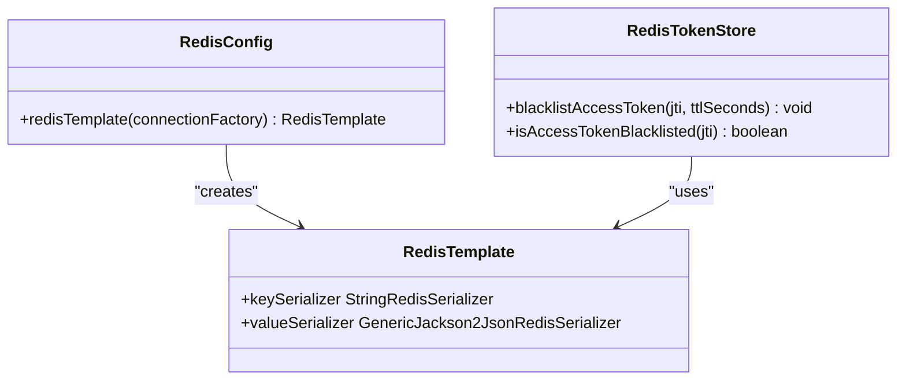
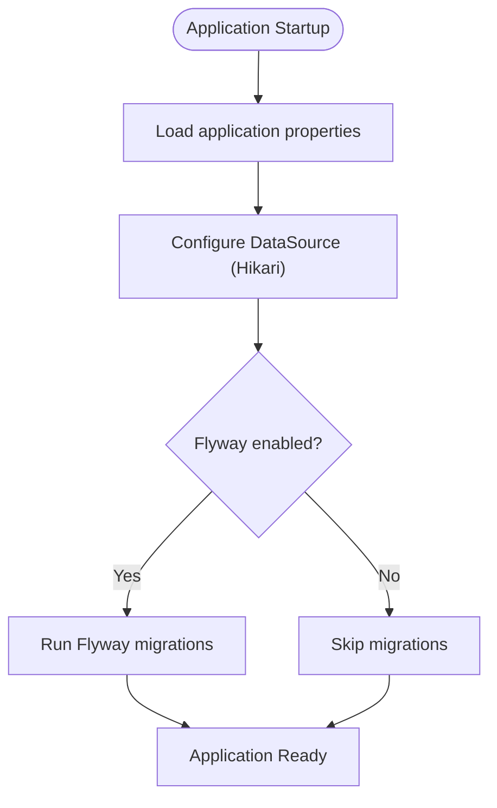
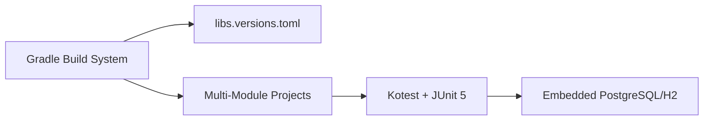
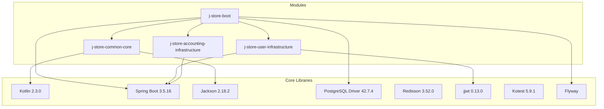

# Technology Stack

<cite>
**Referenced Files in This Document**
- [build.gradle.kts](file://build.gradle.kts)
- [settings.gradle.kts](file://settings.gradle.kts)
- [gradle.properties](file://gradle.properties)
- [libs.versions.toml](file://gradle/libs.versions.toml)
- [README.md](file://README.md)
- [docker-compose.postgres.yml](file://docker-compose.postgres.yml)
- [j-store-boot/build.gradle.kts](file://j-store-boot/build.gradle.kts)
- [j-store-boot/src/main/resources/application.properties](file://j-store-boot/src/main/resources/application.properties)
- [j-store-boot/src/main/resources/application-local.properties](file://j-store-boot/src/main/resources/application-local.properties)
- [j-store-common-core/build.gradle.kts](file://j-store-common-core/build.gradle.kts)
- [j-store-user-infrastructure/build.gradle.kts](file://j-store-user-infrastructure/build.gradle.kts)
- [j-store-accounting-infrastructure/build.gradle.kts](file://j-store-accounting-infrastructure/build.gradle.kts)
- [j-store-authentication-spring-sdk/src/main/kotlin/com/jstore/authentication/spring/AuthenticationAutoConfiguration.kt](file://j-store-authentication-spring-sdk/src/main/kotlin/com/jstore/authentication/spring/AuthenticationAutoConfiguration.kt)
- [j-store-authentication-spring-sdk/src/main/kotlin/com/jstore/authentication/spring/AuthenticationInterceptor.kt](file://j-store-authentication-spring-sdk/src/main/kotlin/com/jstore/authentication/spring/AuthenticationInterceptor.kt)
- [j-store-user-infrastructure/src/main/kotlin/com/jstore/user/domain/useraccount/RedisTokenStore.kt](file://j-store-user-infrastructure/src/main/kotlin/com/jstore/user/domain/useraccount/RedisTokenStore.kt)
- [j-store-boot/src/main/kotlin/com/jstore/order/config/RedisConfig.kt](file://j-store-boot/src/main/kotlin/com/jstore/order/config/RedisConfig.kt)
</cite>

## Table of Contents
1. Introduction
2. Project Structure
3. Core Components
4. Architecture Overview
5. Detailed Component Analysis
6. Dependency Analysis
7. Performance Considerations
8. Troubleshooting Guide
9. Conclusion

## Introduction
This document describes the technology stack powering the J-Store platform, focusing on core technologies and their roles: Kotlin 2.3.0 as the primary language, Spring Boot 3.5.16 for application framework, PostgreSQL for relational data storage, Redis for caching and session management, and JWT for authentication. It also documents key libraries (Spring Data JPA, Jackson, Kotest, Flyway), build tools (Gradle), testing frameworks, and development utilities used across modules. The rationale behind each choice and version compatibility are explained to help both technical and non-technical readers understand how the system is constructed and operated.

## Project Structure
J-Store is a multi-module Gradle project with clear separation between domain modules, infrastructure implementations, and bootstrapping applications. The root configuration centralizes versions and plugins, while individual modules declare only the dependencies they need.

**Diagram sources**
- [settings.gradle.kts:1-28](file://settings.gradle.kts#L1-L28)
- [build.gradle.kts:1-28](file://build.gradle.kts#L1-L28)
- [gradle.properties:1-3](file://gradle.properties#L1-L3)
- [libs.versions.toml:1-110](file://gradle/libs.versions.toml#L1-L110)

**Section sources**
- [settings.gradle.kts:1-28](file://settings.gradle.kts#L1-L28)
- [build.gradle.kts:1-28](file://build.gradle.kts#L1-L28)
- [gradle.properties:1-3](file://gradle.properties#L1-L3)
- [libs.versions.toml:1-110](file://gradle/libs.versions.toml#L1-L110)

## Core Components
The platform’s core technologies and their roles:

- Kotlin 2.3.0: Primary language for domain and infrastructure code; provides null safety, coroutines-ready runtime, and excellent interop with Java/Spring ecosystem.
- Spring Boot 3.5.16: Application framework providing auto-configuration, embedded server, and dependency management via BOM.
- PostgreSQL: Relational database for persistent domain state; configured via JDBC and managed by Flyway migrations.
- Redis: In-memory store used for token blacklisting, distributed locks, and job scheduling support via Lua scripts.
- JWT (jjwt): Stateless authentication tokens signed and validated at request boundaries.
- Spring Data JPA: Repository abstraction over PostgreSQL entities.
- Jackson: JSON serialization/deserialization for API payloads and Redis values.
- Kotest: Property-based and unit testing framework integrated with JUnit 5.
- Flyway: Database schema migration tool aligned with application lifecycle.

Rationale:
- Kotlin + Spring Boot delivers modern, concise, and type-safe backend development with strong community support.
- PostgreSQL ensures ACID guarantees and rich SQL features for complex business domains.
- Redis enables low-latency operations for tokens, locks, and transient job queues.
- JWT simplifies cross-service authentication without shared sessions.
- Spring Data JPA reduces boilerplate persistence code.
- Jackson integrates seamlessly with Kotlin and Spring ecosystems.
- Kotest supports robust property tests and fast unit testing.
- Flyway keeps schema evolution deterministic and auditable.

Version compatibility highlights:
- Kotlin 2.3.0 with Spring Boot 3.5.16 and Spring Security 7.1.0-RC1 are coordinated through the versions catalog.
- PostgreSQL driver 42.7.4 aligns with Spring Boot 3.x defaults.
- Jackson 2.18.2 matches Spring Boot’s managed versions.
- Redisson 3.52.0 and jjwt 0.13.0 are compatible with Spring Boot 3.x and Kotlin 2.3.0.

**Section sources**
- [libs.versions.toml:1-110](file://gradle/libs.versions.toml#L1-L110)
- [j-store-boot/build.gradle.kts:1-84](file://j-store-boot/build.gradle.kts#L1-L84)
- [j-store-common-core/build.gradle.kts:1-41](file://j-store-common-core/build.gradle.kts#L1-L41)
- [j-store-user-infrastructure/build.gradle.kts:1-50](file://j-store-user-infrastructure/build.gradle.kts#L1-L50)

## Architecture Overview
High-level architecture shows how services interact with databases, caches, and authentication components.

**Diagram sources**
- [j-store-boot/build.gradle.kts:23-73](file://j-store-boot/build.gradle.kts#L23-L73)
- [j-store-user-infrastructure/build.gradle.kts:13-42](file://j-store-user-infrastructure/build.gradle.kts#L13-L42)
- [j-store-boot/src/main/resources/application.properties:1-11](file://j-store-boot/src/main/resources/application.properties#L1-L11)

## Detailed Component Analysis

### Authentication Flow with JWT and Redis
The authentication SDK configures interceptors that validate JWTs and check token blacklists stored in Redis.

**Diagram sources**
- [j-store-authentication-spring-sdk/src/main/kotlin/com/jstore/authentication/spring/AuthenticationAutoConfiguration.kt:1-28](file://j-store-authentication-spring-sdk/src/main/kotlin/com/jstore/authentication/spring/AuthenticationAutoConfiguration.kt#L1-L28)
- [j-store-authentication-spring-sdk/src/main/kotlin/com/jstore/authentication/spring/AuthenticationInterceptor.kt:29-68](file://j-store-authentication-spring-sdk/src/main/kotlin/com/jstore/authentication/spring/AuthenticationInterceptor.kt#L29-L68)
- [j-store-user-infrastructure/src/main/kotlin/com/jstore/user/domain/useraccount/RedisTokenStore.kt:33-45](file://j-store-user-infrastructure/src/main/kotlin/com/jstore/user/domain/useraccount/RedisTokenStore.kt#L33-L45)

**Section sources**
- [j-store-authentication-spring-sdk/src/main/kotlin/com/jstore/authentication/spring/AuthenticationAutoConfiguration.kt:1-28](file://j-store-authentication-spring-sdk/src/main/kotlin/com/jstore/authentication/spring/AuthenticationAutoConfiguration.kt#L1-L28)
- [j-store-authentication-spring-sdk/src/main/kotlin/com/jstore/authentication/spring/AuthenticationInterceptor.kt:29-68](file://j-store-authentication-spring-sdk/src/main/kotlin/com/jstore/authentication/spring/AuthenticationInterceptor.kt#L29-L68)
- [j-store-user-infrastructure/src/main/kotlin/com/jstore/user/domain/useraccount/RedisTokenStore.kt:33-45](file://j-store-user-infrastructure/src/main/kotlin/com/jstore/user/domain/useraccount/RedisTokenStore.kt#L33-L45)

### Redis Configuration and Usage
Redis is configured for JSON serialization and used for token blacklisting and distributed coordination.

**Diagram sources**
- [j-store-boot/src/main/kotlin/com/jstore/order/config/RedisConfig.kt:1-29](file://j-store-boot/src/main/kotlin/com/jstore/order/config/RedisConfig.kt#L1-L29)
- [j-store-user-infrastructure/src/main/kotlin/com/jstore/user/domain/useraccount/RedisTokenStore.kt:33-45](file://j-store-user-infrastructure/src/main/kotlin/com/jstore/user/domain/useraccount/RedisTokenStore.kt#L33-L45)

**Section sources**
- [j-store-boot/src/main/kotlin/com/jstore/order/config/RedisConfig.kt:1-29](file://j-store-boot/src/main/kotlin/com/jstore/order/config/RedisConfig.kt#L1-L29)
- [j-store-user-infrastructure/src/main/kotlin/com/jstore/user/domain/useraccount/RedisTokenStore.kt:33-45](file://j-store-user-infrastructure/src/main/kotlin/com/jstore/user/domain/useraccount/RedisTokenStore.kt#L33-L45)

### Database and Migration Setup
PostgreSQL is configured via JDBC with HikariCP pooling and Flyway for schema migrations.

**Diagram sources**
- [j-store-boot/src/main/resources/application.properties:1-11](file://j-store-boot/src/main/resources/application.properties#L1-L11)
- [j-store-boot/src/main/resources/application-local.properties:1-43](file://j-store-boot/src/main/resources/application-local.properties#L1-L43)

**Section sources**
- [j-store-boot/src/main/resources/application.properties:1-11](file://j-store-boot/src/main/resources/application.properties#L1-L11)
- [j-store-boot/src/main/resources/application-local.properties:1-43](file://j-store-boot/src/main/resources/application-local.properties#L1-L43)

### Build Tools and Testing Frameworks
Gradle orchestrates builds across modules with centralized version management. Kotest and JUnit 5 provide comprehensive testing capabilities.

**Diagram sources**
- [build.gradle.kts:1-28](file://build.gradle.kts#L1-L28)
- [libs.versions.toml:1-110](file://gradle/libs.versions.toml#L1-L110)
- [j-store-common-core/build.gradle.kts:13-18](file://j-store-common-core/build.gradle.kts#L13-L18)
- [j-store-accounting-infrastructure/build.gradle.kts:23-31](file://j-store-accounting-infrastructure/build.gradle.kts#L23-L31)

**Section sources**
- [build.gradle.kts:1-28](file://build.gradle.kts#L1-L28)
- [libs.versions.toml:1-110](file://gradle/libs.versions.toml#L1-L110)
- [j-store-common-core/build.gradle.kts:13-18](file://j-store-common-core/build.gradle.kts#L13-L18)
- [j-store-accounting-infrastructure/build.gradle.kts:23-31](file://j-store-accounting-infrastructure/build.gradle.kts#L23-L31)

## Dependency Analysis
The dependency graph shows how modules relate to each other and external libraries.

**Diagram sources**
- [libs.versions.toml:1-110](file://gradle/libs.versions.toml#L1-L110)
- [j-store-boot/build.gradle.kts:23-73](file://j-store-boot/build.gradle.kts#L23-L73)
- [j-store-common-core/build.gradle.kts:10-31](file://j-store-common-core/build.gradle.kts#L10-L31)
- [j-store-user-infrastructure/build.gradle.kts:13-42](file://j-store-user-infrastructure/build.gradle.kts#L13-L42)
- [j-store-accounting-infrastructure/build.gradle.kts:14-31](file://j-store-accounting-infrastructure/build.gradle.kts#L14-L31)

**Section sources**
- [libs.versions.toml:1-110](file://gradle/libs.versions.toml#L1-L110)
- [j-store-boot/build.gradle.kts:23-73](file://j-store-boot/build.gradle.kts#L23-L73)
- [j-store-common-core/build.gradle.kts:10-31](file://j-store-common-core/build.gradle.kts#L10-L31)
- [j-store-user-infrastructure/build.gradle.kts:13-42](file://j-store-user-infrastructure/build.gradle.kts#L13-L42)
- [j-store-accounting-infrastructure/build.gradle.kts:14-31](file://j-store-accounting-infrastructure/build.gradle.kts#L14-L31)

## Performance Considerations
- Connection Pooling: HikariCP is configured with appropriate pool sizes for production workloads.
- Redis Serialization: JSON serialization balances readability and performance; consider binary serialization for high-throughput scenarios.
- Database Indexing: Ensure proper indexing strategies for frequently queried columns in PostgreSQL.
- Caching Strategy: Use Redis for hot data and token blacklists to reduce database load.
- Lazy Loading: Be cautious with lazy loading in JPA to avoid N+1 query problems.

[No sources needed since this section provides general guidance]

## Troubleshooting Guide
Common issues and solutions:

- Database Connection Failures: Verify JDBC URL, credentials, and schema settings in application-local.properties.
- Redis Connectivity Issues: Check host, port, and password configurations; ensure Redis container is running.
- JWT Validation Errors: Validate secret key length and format; ensure tokens are properly signed and not expired.
- Migration Conflicts: Review Flyway baseline settings and migration file ordering.
- Test Environment Problems: Ensure embedded databases are properly configured and cleaned up between tests.

**Section sources**
- [j-store-boot/src/main/resources/application-local.properties:1-43](file://j-store-boot/src/main/resources/application-local.properties#L1-L43)
- [docker-compose.postgres.yml:1-40](file://docker-compose.postgres.yml#L1-L40)
- [README.md:1-53](file://README.md#L1-L53)

## Conclusion
J-Store leverages a modern, well-architected technology stack centered around Kotlin 2.3.0 and Spring Boot 3.5.16. PostgreSQL provides reliable relational data storage, Redis enables efficient caching and session management, and JWT ensures secure authentication. The modular structure promotes maintainability and scalability, while Gradle and Kotest streamline development and testing workflows. This combination delivers a robust foundation for building scalable e-commerce services.

[No sources needed since this section summarizes without analyzing specific files]