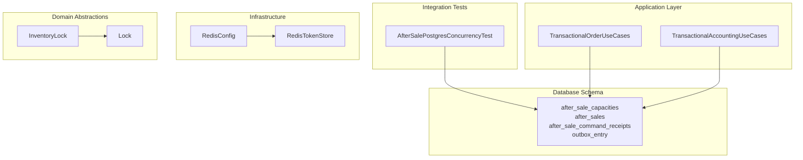
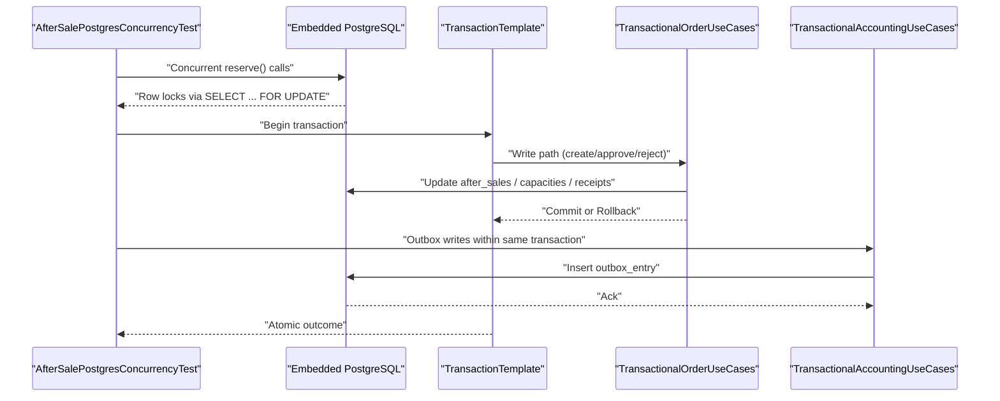
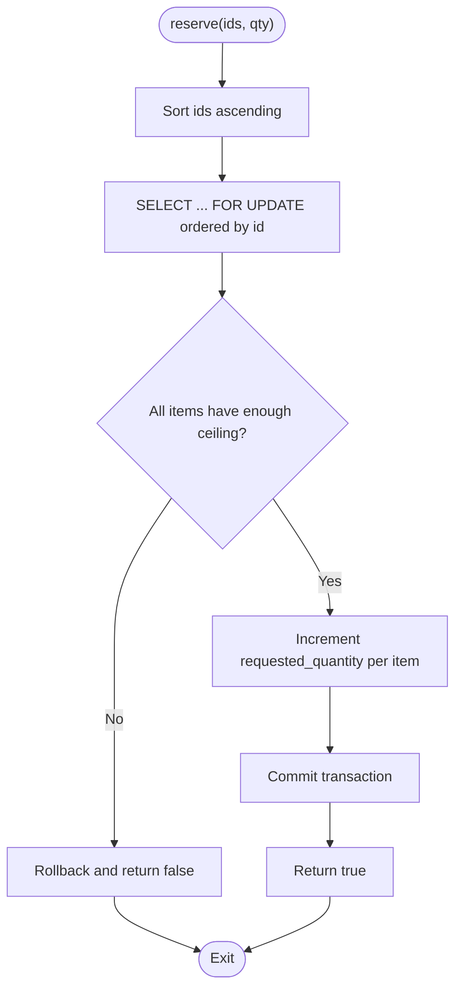
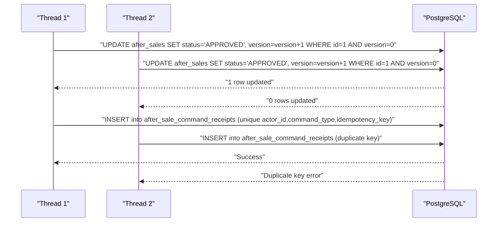
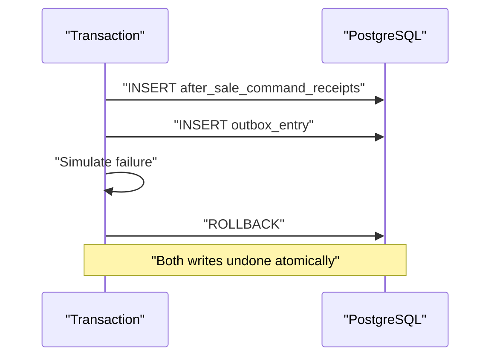
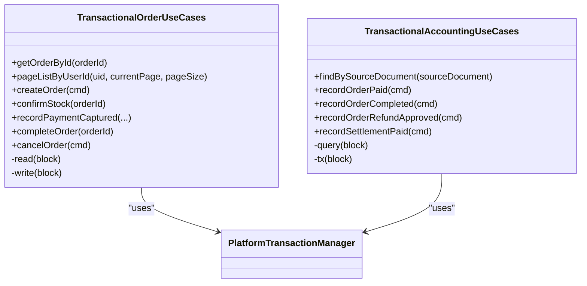
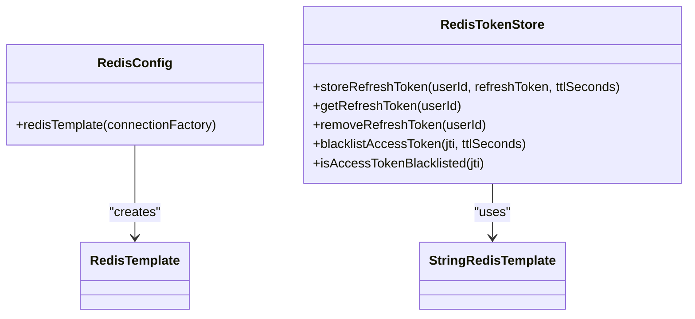
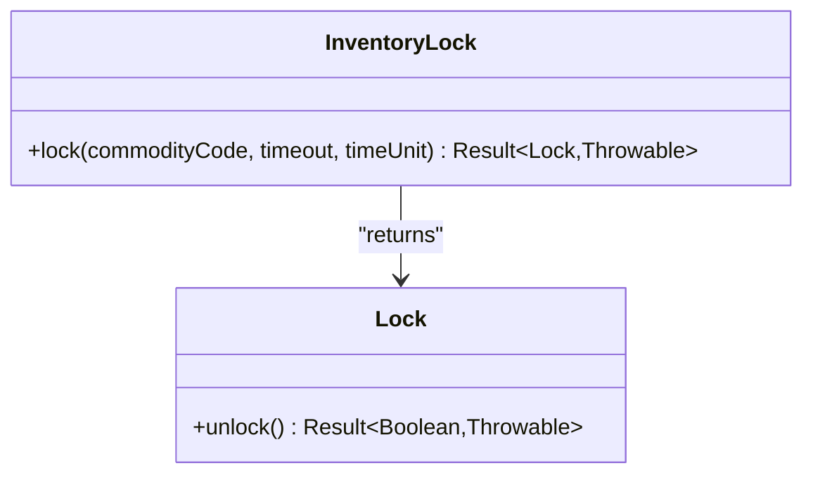
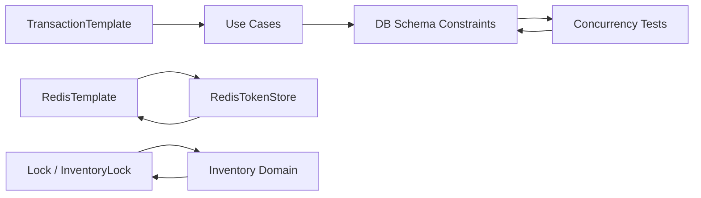

# Concurrency Testing

<cite>
**Referenced Files in This Document**
- [AfterSalePostgresConcurrencyTest.kt](file://j-store-order-infrastructure/src/test/kotlin/com/jstore/order/integration/AfterSalePostgresConcurrencyTest.kt)
- [V20260803__order_after_sale_aggregate.sql](file://j-store-boot/src/main/resources/db/migration/V20260803__order_after_sale_aggregate.sql)
- [TransactionalOrderUseCases.kt](file://j-store-order-boot/src/main/kotlin/com/jstore/order/config/TransactionalOrderUseCases.kt)
- [TransactionalAccountingUseCases.kt](file://j-store-accounting-boot/src/main/kotlin/com/jstore/accounting/config/TransactionalAccountingUseCases.kt)
- [RedisConfig.kt](file://j-store-order-boot/src/main/kotlin/com/jstore/order/config/RedisConfig.kt)
- [RedisTokenStore.kt](file://j-store-user-infrastructure/src/main/kotlin/com/jstore/user/domain/useraccount/RedisTokenStore.kt)
- [Lock.kt](file://j-store-common-core/src/main/kotlin/com/jstore/common/utils/Lock.kt)
- [InventoryLock.kt](file://j-store-goods-domain/src/main/kotlin/com/jstore/goods/domain/inventory/InventoryLock.kt)
</cite>

## Table of Contents
1. Introduction
2. Project Structure
3. Core Components
4. Architecture Overview
5. Detailed Component Analysis
6. Dependency Analysis
7. Performance Considerations
8. Troubleshooting Guide
9. Conclusion

## Introduction
This document provides comprehensive concurrency testing guidance for the J-Store platform. It focuses on strategies to test concurrent access to shared resources, race conditions, and deadlock scenarios across database-backed aggregates, optimistic and pessimistic locking mechanisms, transaction isolation levels, and distributed locking via Redis. It also covers how to simulate high-concurrency workloads, validate atomicity and consistency guarantees, and ensure data integrity under load.

## Project Structure
The concurrency testing strategy spans multiple layers:
- Integration tests that exercise real embedded databases with concurrent threads
- Transaction boundaries defined by Spring’s TransactionTemplate
- Distributed primitives (locks and token stores) backed by Redis
- Domain abstractions for locks used by inventory operations

**Diagram sources**
- [AfterSalePostgresConcurrencyTest.kt](file://j-store-order-infrastructure/src/test/kotlin/com/jstore/order/integration/AfterSalePostgresConcurrencyTest.kt)
- [TransactionalOrderUseCases.kt](file://j-store-order-boot/src/main/kotlin/com/jstore/order/config/TransactionalOrderUseCases.kt)
- [TransactionalAccountingUseCases.kt](file://j-store-accounting-boot/src/main/kotlin/com/jstore/accounting/config/TransactionalAccountingUseCases.kt)
- [RedisConfig.kt](file://j-store-order-boot/src/main/kotlin/com/jstore/order/config/RedisConfig.kt)
- [RedisTokenStore.kt](file://j-store-user-infrastructure/src/main/kotlin/com/jstore/user/domain/useraccount/RedisTokenStore.kt)
- [Lock.kt](file://j-store-common-core/src/main/kotlin/com/jstore/common/utils/Lock.kt)
- [InventoryLock.kt](file://j-store-goods-domain/src/main/kotlin/com/jstore/goods/domain/inventory/InventoryLock.kt)
- [V20260803__order_after_sale_aggregate.sql](file://j-store-boot/src/main/resources/db/migration/V20260803__order_after_sale_aggregate.sql)

**Section sources**
- [AfterSalePostgresConcurrencyTest.kt](file://j-store-order-infrastructure/src/test/kotlin/com/jstore/order/integration/AfterSalePostgresConcurrencyTest.kt)
- [TransactionalOrderUseCases.kt](file://j-store-order-boot/src/main/kotlin/com/jstore/order/config/TransactionalOrderUseCases.kt)
- [TransactionalAccountingUseCases.kt](file://j-store-accounting-boot/src/main/kotlin/com/jstore/accounting/config/TransactionalAccountingUseCases.kt)
- [RedisConfig.kt](file://j-store-order-boot/src/main/kotlin/com/jstore/order/config/RedisConfig.kt)
- [RedisTokenStore.kt](file://j-store-user-infrastructure/src/main/kotlin/com/jstore/user/domain/useraccount/RedisTokenStore.kt)
- [Lock.kt](file://j-store-common-core/src/main/kotlin/com/jstore/common/utils/Lock.kt)
- [InventoryLock.kt](file://j-store-goods-domain/src/main/kotlin/com/jstore/goods/domain/inventory/InventoryLock.kt)
- [V20260803__order_after_sale_aggregate.sql](file://j-store-boot/src/main/resources/db/migration/V20260803__order_after_sale_aggregate.sql)

## Core Components
- Embedded PostgreSQL concurrency tests: Validate pessimistic row-level locking, idempotency keys, and outbox rollback behavior under concurrent access.
- Transactional use case wrappers: Provide explicit read/write transaction boundaries using Spring’s TransactionTemplate.
- Redis configuration and token store: Demonstrate distributed key/value storage patterns suitable for distributed locks and token blacklisting.
- Lock abstractions: Define a generic Lock interface and an InventoryLock interface for domain-level distributed locking.

Key responsibilities:
- AfterSalePostgresConcurrencyTest exercises concurrent reservations, decision updates with optimistic versioning, and idempotent command receipts.
- TransactionalOrderUseCases and TransactionalAccountingUseCases encapsulate write/read transactions around application logic.
- RedisConfig sets up serialization for Redis templates; RedisTokenStore shows TTL-based storage patterns.
- Lock and InventoryLock define contracts for acquiring and releasing distributed locks.

**Section sources**
- [AfterSalePostgresConcurrencyTest.kt](file://j-store-order-infrastructure/src/test/kotlin/com/jstore/order/integration/AfterSalePostgresConcurrencyTest.kt)
- [TransactionalOrderUseCases.kt](file://j-store-order-boot/src/main/kotlin/com/jstore/order/config/TransactionalOrderUseCases.kt)
- [TransactionalAccountingUseCases.kt](file://j-store-accounting-boot/src/main/kotlin/com/jstore/accounting/config/TransactionalAccountingUseCases.kt)
- [RedisConfig.kt](file://j-store-order-boot/src/main/kotlin/com/jstore/order/config/RedisConfig.kt)
- [RedisTokenStore.kt](file://j-store-user-infrastructure/src/main/kotlin/com/jstore/user/domain/useraccount/RedisTokenStore.kt)
- [Lock.kt](file://j-store-common-core/src/main/kotlin/com/jstore/common/utils/Lock.kt)
- [InventoryLock.kt](file://j-store-goods-domain/src/main/kotlin/com/jstore/goods/domain/inventory/InventoryLock.kt)

## Architecture Overview
The concurrency architecture combines database-level controls with application-layer transactions and optional distributed locks.

**Diagram sources**
- [AfterSalePostgresConcurrencyTest.kt](file://j-store-order-infrastructure/src/test/kotlin/com/jstore/order/integration/AfterSalePostgresConcurrencyTest.kt)
- [TransactionalOrderUseCases.kt](file://j-store-order-boot/src/main/kotlin/com/jstore/order/config/TransactionalOrderUseCases.kt)
- [TransactionalAccountingUseCases.kt](file://j-store-accounting-boot/src/main/kotlin/com/jstore/accounting/config/TransactionalAccountingUseCases.kt)

## Detailed Component Analysis

### Pessimistic Locking and Deadlock Prevention
- Strategy: Use deterministic lock ordering (sorted IDs) when acquiring row locks to prevent deadlocks.
- Evidence: The test reserves multiple capacity rows by sorting requested IDs before locking, ensuring consistent acquisition order across concurrent threads.
- Validation: Two threads requesting overlapping sets in opposite order both succeed without deadlock.

**Diagram sources**
- [AfterSalePostgresConcurrencyTest.kt](file://j-store-order-infrastructure/src/test/kotlin/com/jstore/order/integration/AfterSalePostgresConcurrencyTest.kt)

**Section sources**
- [AfterSalePostgresConcurrencyTest.kt](file://j-store-order-infrastructure/src/test/kotlin/com/jstore/order/integration/AfterSalePostgresConcurrencyTest.kt)

### Optimistic Locking and Idempotency Keys
- Strategy: Combine versioned updates with unique constraints to ensure exactly one winner among concurrent decisions and idempotent command receipts.
- Evidence:
  - Versioned update on after_sales ensures only one approval succeeds when two threads attempt concurrently.
  - Unique constraint on after_sale_command_receipts prevents duplicate receipt insertion.
- Validation: Exactly one successful decision and one receipt insertion occur under concurrency.

**Diagram sources**
- [AfterSalePostgresConcurrencyTest.kt](file://j-store-order-infrastructure/src/test/kotlin/com/jstore/order/integration/AfterSalePostgresConcurrencyTest.kt)
- [V20260803__order_after_sale_aggregate.sql](file://j-store-boot/src/main/resources/db/migration/V20260803__order_after_sale_aggregate.sql)

**Section sources**
- [AfterSalePostgresConcurrencyTest.kt](file://j-store-order-infrastructure/src/test/kotlin/com/jstore/order/integration/AfterSalePostgresConcurrencyTest.kt)
- [V20260803__order_after_sale_aggregate.sql](file://j-store-boot/src/main/resources/db/migration/V20260803__order_after_sale_aggregate.sql)

### Outbox Atomicity and Rollback Semantics
- Strategy: Ensure command receipts and outbox entries are written within the same transaction so failures roll back consistently.
- Evidence: The test inserts both a receipt and an outbox entry, then rolls back the connection, verifying neither persists.
- Validation: Post-rollback queries confirm zero persisted records.

**Diagram sources**
- [AfterSalePostgresConcurrencyTest.kt](file://j-store-order-infrastructure/src/test/kotlin/com/jstore/order/integration/AfterSalePostgresConcurrencyTest.kt)

**Section sources**
- [AfterSalePostgresConcurrencyTest.kt](file://j-store-order-infrastructure/src/test/kotlin/com/jstore/order/integration/AfterSalePostgresConcurrencyTest.kt)

### Transaction Isolation Levels and Boundaries
- Strategy: Use Spring’s TransactionTemplate to explicitly mark read-only and write transactions around use cases.
- Evidence:
  - TransactionalOrderUseCases wraps reads with read-only transactions and writes with standard transactions.
  - TransactionalAccountingUseCases similarly separates read and write paths.
- Validation: Ensures consistent isolation semantics and avoids accidental long-running read locks.

**Diagram sources**
- [TransactionalOrderUseCases.kt](file://j-store-order-boot/src/main/kotlin/com/jstore/order/config/TransactionalOrderUseCases.kt)
- [TransactionalAccountingUseCases.kt](file://j-store-accounting-boot/src/main/kotlin/com/jstore/accounting/config/TransactionalAccountingUseCases.kt)

**Section sources**
- [TransactionalOrderUseCases.kt](file://j-store-order-boot/src/main/kotlin/com/jstore/order/config/TransactionalOrderUseCases.kt)
- [TransactionalAccountingUseCases.kt](file://j-store-accounting-boot/src/main/kotlin/com/jstore/accounting/config/TransactionalAccountingUseCases.kt)

### Distributed Locking with Redis
- Strategy: Use Redis for distributed locks and token management with TTLs and string keys.
- Evidence:
  - RedisConfig configures RedisTemplate with serializers.
  - RedisTokenStore demonstrates storing refresh tokens and blacklisting access tokens with TTLs.
- Validation: Key patterns and TTL usage ensure safe expiration and uniqueness.

**Diagram sources**
- [RedisConfig.kt](file://j-store-order-boot/src/main/kotlin/com/jstore/order/config/RedisConfig.kt)
- [RedisTokenStore.kt](file://j-store-user-infrastructure/src/main/kotlin/com/jstore/user/domain/useraccount/RedisTokenStore.kt)

**Section sources**
- [RedisConfig.kt](file://j-store-order-boot/src/main/kotlin/com/jstore/order/config/RedisConfig.kt)
- [RedisTokenStore.kt](file://j-store-user-infrastructure/src/main/kotlin/com/jstore/user/domain/useraccount/RedisTokenStore.kt)

### Domain-Level Lock Abstractions
- Strategy: Define a generic Lock interface and an InventoryLock interface to abstract distributed locking for inventory operations.
- Evidence:
  - Lock defines unlock returning a Result<Boolean, Throwable>.
  - InventoryLock.lock returns Result<Lock, Throwable> with timeout parameters.
- Validation: Encourages consistent lock acquisition/release patterns across domains.

**Diagram sources**
- [Lock.kt](file://j-store-common-core/src/main/kotlin/com/jstore/common/utils/Lock.kt)
- [InventoryLock.kt](file://j-store-goods-domain/src/main/kotlin/com/jstore/goods/domain/inventory/InventoryLock.kt)

**Section sources**
- [Lock.kt](file://j-store-common-core/src/main/kotlin/com/jstore/common/utils/Lock.kt)
- [InventoryLock.kt](file://j-store-goods-domain/src/main/kotlin/com/jstore/goods/domain/inventory/InventoryLock.kt)

## Dependency Analysis
Concurrency controls depend on:
- Database schema constraints and indexes for idempotency and performance
- Transaction boundaries provided by Spring’s TransactionTemplate
- Redis for distributed state and locks
- Domain abstractions for consistent lock usage

**Diagram sources**
- [V20260803__order_after_sale_aggregate.sql](file://j-store-boot/src/main/resources/db/migration/V20260803__order_after_sale_aggregate.sql)
- [TransactionalOrderUseCases.kt](file://j-store-order-boot/src/main/kotlin/com/jstore/order/config/TransactionalOrderUseCases.kt)
- [TransactionalAccountingUseCases.kt](file://j-store-accounting-boot/src/main/kotlin/com/jstore/accounting/config/TransactionalAccountingUseCases.kt)
- [RedisConfig.kt](file://j-store-order-boot/src/main/kotlin/com/jstore/order/config/RedisConfig.kt)
- [RedisTokenStore.kt](file://j-store-user-infrastructure/src/main/kotlin/com/jstore/user/domain/useraccount/RedisTokenStore.kt)
- [Lock.kt](file://j-store-common-core/src/main/kotlin/com/jstore/common/utils/Lock.kt)
- [InventoryLock.kt](file://j-store-goods-domain/src/main/kotlin/com/jstore/goods/domain/inventory/InventoryLock.kt)

**Section sources**
- [V20260803__order_after_sale_aggregate.sql](file://j-store-boot/src/main/resources/db/migration/V20260803__order_after_sale_aggregate.sql)
- [TransactionalOrderUseCases.kt](file://j-store-order-boot/src/main/kotlin/com/jstore/order/config/TransactionalOrderUseCases.kt)
- [TransactionalAccountingUseCases.kt](file://j-store-accounting-boot/src/main/kotlin/com/jstore/accounting/config/TransactionalAccountingUseCases.kt)
- [RedisConfig.kt](file://j-store-order-boot/src/main/kotlin/com/jstore/order/config/RedisConfig.kt)
- [RedisTokenStore.kt](file://j-store-user-infrastructure/src/main/kotlin/com/jstore/user/domain/useraccount/RedisTokenStore.kt)
- [Lock.kt](file://j-store-common-core/src/main/kotlin/com/jstore/common/utils/Lock.kt)
- [InventoryLock.kt](file://j-store-goods-domain/src/main/kotlin/com/jstore/goods/domain/inventory/InventoryLock.kt)

## Performance Considerations
- Prefer sorted ID acquisition to avoid deadlocks and reduce contention.
- Keep transactions short and focused; separate read-only paths to minimize lock duration.
- Use unique constraints for idempotency rather than application-level checks where possible.
- For Redis-backed locks, set appropriate TTLs to prevent stale locks and ensure timely release.
- Batch operations carefully to balance throughput and lock granularity.

[No sources needed since this section provides general guidance]

## Troubleshooting Guide
Common issues and remedies:
- Deadlocks: Ensure deterministic lock ordering and verify no circular dependencies in multi-row updates.
- Race conditions: Use optimistic versioning and unique constraints to enforce single-writer semantics.
- Inconsistent outbox: Write receipts and outbox entries within the same transaction; validate rollback behavior.
- Redis lock leaks: Confirm TTL settings and implement retry/backoff on lock acquisition.
- Transaction scope errors: Verify read-only vs write transaction boundaries and exception propagation.

**Section sources**
- [AfterSalePostgresConcurrencyTest.kt](file://j-store-order-infrastructure/src/test/kotlin/com/jstore/order/integration/AfterSalePostgresConcurrencyTest.kt)
- [TransactionalOrderUseCases.kt](file://j-store-order-boot/src/main/kotlin/com/jstore/order/config/TransactionalOrderUseCases.kt)
- [TransactionalAccountingUseCases.kt](file://j-store-accounting-boot/src/main/kotlin/com/jstore/accounting/config/TransactionalAccountingUseCases.kt)
- [RedisConfig.kt](file://j-store-order-boot/src/main/kotlin/com/jstore/order/config/RedisConfig.kt)
- [RedisTokenStore.kt](file://j-store-user-infrastructure/src/main/kotlin/com/jstore/user/domain/useraccount/RedisTokenStore.kt)

## Conclusion
J-Store’s concurrency testing strategy leverages embedded PostgreSQL for realistic contention scenarios, explicit transaction boundaries for isolation, and Redis for distributed coordination. By combining pessimistic and optimistic locking, idempotency keys, and robust rollback semantics, the system maintains data integrity and consistency under high concurrency. The provided abstractions and configurations offer a solid foundation for extending concurrency controls across additional domains while preserving reliability and performance.

[No sources needed since this section summarizes without analyzing specific files]