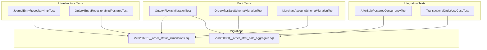
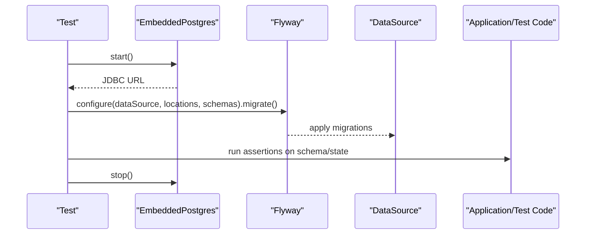
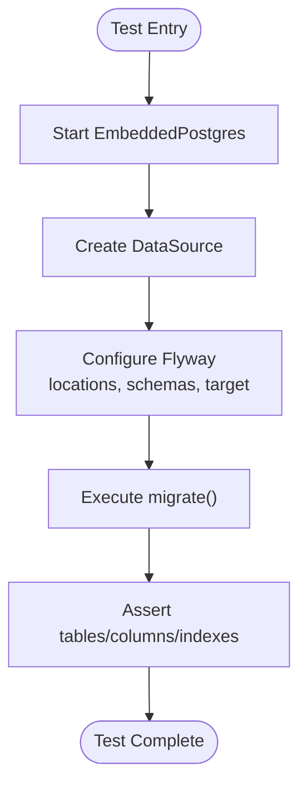
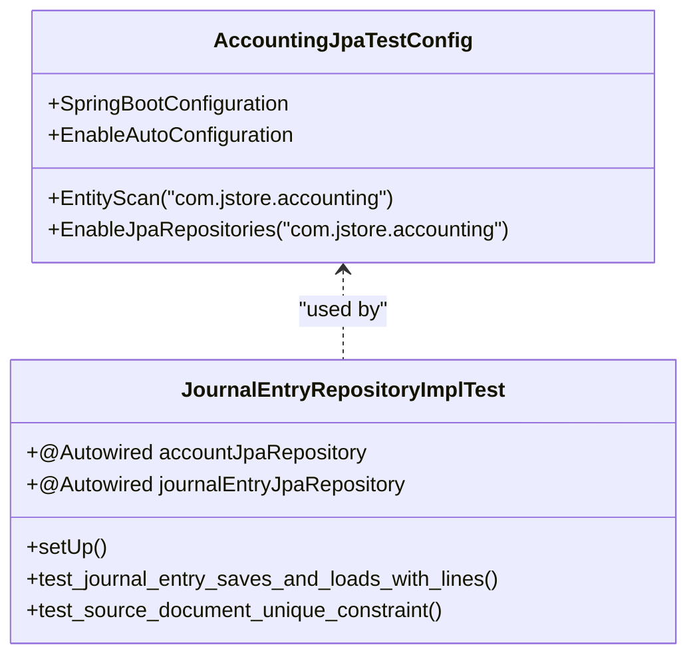
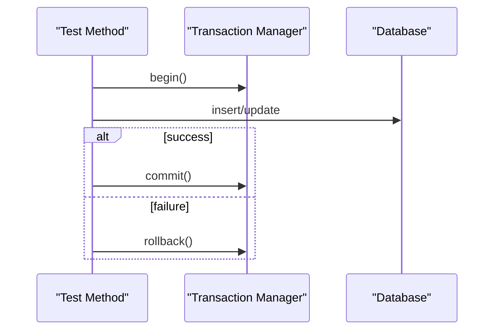
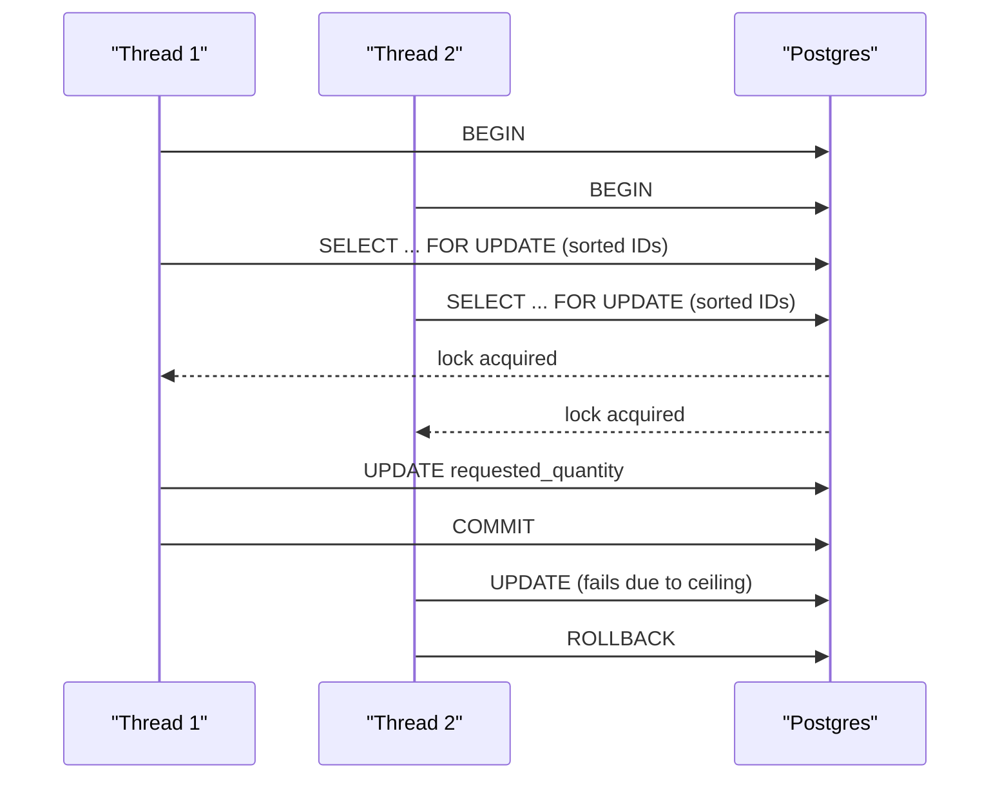
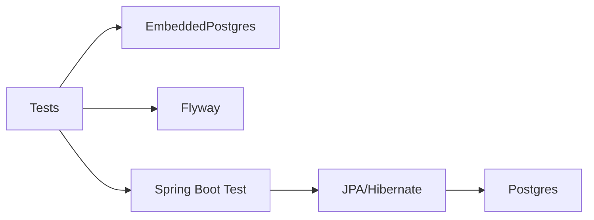

# Database Testing

<cite>
**Referenced Files in This Document**
- [OutboxFlywayMigrationTest.kt](file://j-store-boot/src/test/kotlin/com/jstore/outbox/OutboxFlywayMigrationTest.kt)
- [AfterSalePostgresConcurrencyTest.kt](file://j-store-order-infrastructure/src/test/kotlin/com/jstore/order/integration/AfterSalePostgresConcurrencyTest.kt)
- [JournalEntryRepositoryImplTest.kt](file://j-store-accounting-infrastructure/src/test/kotlin/com/jstore/accounting/domain/journal/JournalEntryRepositoryImplTest.kt)
- [AccountingJpaTestConfig.kt](file://j-store-accounting-infrastructure/src/test/kotlin/com/jstore/accounting/AccountingJpaTestConfig.kt)
- [V20260803__order_after_sale_aggregate.sql](file://j-store-boot/src/main/resources/db/migration/V20260803__order_after_sale_aggregate.sql)
- [V20260731__order_status_dimensions.sql](file://j-store-boot/src/main/resources/db/migration/V20260731__order_status_dimensions.sql)
- [OrderAfterSaleSchemaMigrationTest.kt](file://j-store-boot/src/test/kotlin/com/jstore/order/migration/OrderAfterSaleSchemaMigrationTest.kt)
- [MerchantAccountSchemaMigrationTest.kt](file://j-store-shop/src/test/kotlin/com/jstore/shop/migration/MerchantAccountSchemaMigrationTest.kt)
- [OutboxEntryRepositoryImplPostgresTest.kt](file://j-store-common-spring/src/test/kotlin/com/jstore/common/framework/event/outbox/persistence/OutboxEntryRepositoryImplPostgresTest.kt)
- [TransactionalOrderUseCaseTest.kt](file://j-store-order-boot/src/test/kotlin/com/jstore/order/config/TransactionalOrderUseCaseTest.kt)
- [build.gradle.kts](file://build.gradle.kts)
</cite>

## Table of Contents
1. Introduction
2. Project Structure
3. Core Components
4. Architecture Overview
5. Detailed Component Analysis
6. Dependency Analysis
7. Performance Considerations
8. Troubleshooting Guide
9. Conclusion

## Introduction
This document explains how the J-Store platform performs database testing with PostgreSQL using embedded databases and Flyway migrations, and how it validates JPA repositories, transactions, and complex scenarios such as concurrency, optimistic locking, and constraint validation. It also covers test data preparation patterns and guidance for testing JSONB columns and custom converters.

## Project Structure
The repository organizes tests by module:
- Boot-level migration verification tests validate Flyway runs against an embedded PostgreSQL instance.
- Infrastructure tests use Spring Boot Test with either H2 (PostgreSQL compatibility mode) or embedded PostgreSQL to exercise JPA repositories and constraints.
- Integration tests demonstrate concurrent access patterns, optimistic versioning, and idempotency guarantees.

**Diagram sources**
- [OutboxFlywayMigrationTest.kt](file://j-store-boot/src/test/kotlin/com/jstore/outbox/OutboxFlywayMigrationTest.kt)
- [OrderAfterSaleSchemaMigrationTest.kt](file://j-store-boot/src/test/kotlin/com/jstore/order/migration/OrderAfterSaleSchemaMigrationTest.kt)
- [MerchantAccountSchemaMigrationTest.kt](file://j-store-shop/src/test/kotlin/com/jstore/shop/migration/MerchantAccountSchemaMigrationTest.kt)
- [JournalEntryRepositoryImplTest.kt](file://j-store-accounting-infrastructure/src/test/kotlin/com/jstore/accounting/domain/journal/JournalEntryRepositoryImplTest.kt)
- [OutboxEntryRepositoryImplPostgresTest.kt](file://j-store-common-spring/src/test/kotlin/com/jstore/common/framework/event/outbox/persistence/OutboxEntryRepositoryImplPostgresTest.kt)
- [AfterSalePostgresConcurrencyTest.kt](file://j-store-order-infrastructure/src/test/kotlin/com/jstore/order/integration/AfterSalePostgresConcurrencyTest.kt)
- [TransactionalOrderUseCaseTest.kt](file://j-store-order-boot/src/test/kotlin/com/jstore/order/config/TransactionalOrderUseCaseTest.kt)
- [V20260731__order_status_dimensions.sql](file://j-store-boot/src/main/resources/db/migration/V20260731__order_status_dimensions.sql)
- [V20260803__order_after_sale_aggregate.sql](file://j-store-boot/src/main/resources/db/migration/V20260803__order_after_sale_aggregate.sql)

**Section sources**
- [OutboxFlywayMigrationTest.kt](file://j-store-boot/src/test/kotlin/com/jstore/outbox/OutboxFlywayMigrationTest.kt)
- [AfterSalePostgresConcurrencyTest.kt](file://j-store-order-infrastructure/src/test/kotlin/com/jstore/order/integration/AfterSalePostgresConcurrencyTest.kt)
- [JournalEntryRepositoryImplTest.kt](file://j-store-accounting-infrastructure/src/test/kotlin/com/jstore/accounting/domain/journal/JournalEntryRepositoryImplTest.kt)
- [V20260731__order_status_dimensions.sql](file://j-store-boot/src/main/resources/db/migration/V20260731__order_status_dimensions.sql)
- [V20260803__order_after_sale_aggregate.sql](file://j-store-boot/src/main/resources/db/migration/V20260803__order_after_sale_aggregate.sql)

## Core Components
- Embedded PostgreSQL via io.zonky.test.db.postgres.embedded.EmbeddedPostgres is used across boot and integration tests to spin up a real Postgres process per test class or method.
- Flyway is invoked programmatically within tests to execute all migrations or targeted versions and assert schema state.
- Spring Boot Test is used with @SpringBootTest and @TestPropertySource to configure DataSource and JPA/Hibernate for tests.
- H2 in PostgreSQL compatibility mode is used for fast unit-style repository tests where a full Postgres is not required.

Key responsibilities:
- OutboxFlywayMigrationTest: Runs Flyway against an embedded Postgres and asserts schema artifacts exist and are correct.
- AfterSalePostgresConcurrencyTest: Demonstrates pessimistic row locks, optimistic version checks, and idempotency keys under concurrency.
- JournalEntryRepositoryImplTest: Validates JPA entity persistence, queries, and DB constraints using H2 in PostgreSQL mode.

**Section sources**
- [OutboxFlywayMigrationTest.kt](file://j-store-boot/src/test/kotlin/com/jstore/outbox/OutboxFlywayMigrationTest.kt)
- [AfterSalePostgresConcurrencyTest.kt](file://j-store-order-infrastructure/src/test/kotlin/com/jstore/order/integration/AfterSalePostgresConcurrencyTest.kt)
- [JournalEntryRepositoryImplTest.kt](file://j-store-accounting-infrastructure/src/test/kotlin/com/jstore/accounting/domain/journal/JournalEntryRepositoryImplTest.kt)

## Architecture Overview
The testing architecture combines three layers:
- Migration layer: Flyway executes SQL migrations against an embedded Postgres to ensure schema correctness.
- Persistence layer: JPA repositories are exercised with Spring Boot Test; some tests use H2 for speed, others use embedded Postgres for fidelity.
- Concurrency layer: Concurrent threads simulate real-world contention to validate locking, versioning, and idempotency.

**Diagram sources**
- [OutboxFlywayMigrationTest.kt](file://j-store-boot/src/test/kotlin/com/jstore/outbox/OutboxFlywayMigrationTest.kt)

**Section sources**
- [OutboxFlywayMigrationTest.kt](file://j-store-boot/src/test/kotlin/com/jstore/outbox/OutboxFlywayMigrationTest.kt)

## Detailed Component Analysis

### Embedded PostgreSQL Setup and Flyway Migration Validation
- Tests instantiate EmbeddedPostgres, obtain a DataSource, and invoke Flyway with explicit schema and default schema settings.
- Assertions verify that expected tables, columns, defaults, and indexes exist after migration execution.
- Targeted migration tests run up to a specific version to validate backward compatibility and data preservation.

**Diagram sources**
- [OutboxFlywayMigrationTest.kt](file://j-store-boot/src/test/kotlin/com/jstore/outbox/OutboxFlywayMigrationTest.kt)

**Section sources**
- [OutboxFlywayMigrationTest.kt](file://j-store-boot/src/test/kotlin/com/jstore/outbox/OutboxFlywayMigrationTest.kt)
- [V20260731__order_status_dimensions.sql](file://j-store-boot/src/main/resources/db/migration/V20260731__order_status_dimensions.sql)
- [V20260803__order_after_sale_aggregate.sql](file://j-store-boot/src/main/resources/db/migration/V20260803__order_after_sale_aggregate.sql)

### JPA Repository Testing Patterns
- Use @SpringBootTest with a minimal configuration class to scan entities and repositories.
- Configure DataSource and Hibernate via @TestPropertySource properties.
- Wrap tests with @Transactional to auto-rollback state between tests.
- Prepare test data by persisting required entities before exercising repository methods.
- Validate both successful operations and constraint violations.

**Diagram sources**
- [AccountingJpaTestConfig.kt](file://j-store-accounting-infrastructure/src/test/kotlin/com/jstore/accounting/AccountingJpaTestConfig.kt)
- [JournalEntryRepositoryImplTest.kt](file://j-store-accounting-infrastructure/src/test/kotlin/com/jstore/accounting/domain/journal/JournalEntryRepositoryImplTest.kt)

**Section sources**
- [JournalEntryRepositoryImplTest.kt](file://j-store-accounting-infrastructure/src/test/kotlin/com/jstore/accounting/domain/journal/JournalEntryRepositoryImplTest.kt)
- [AccountingJpaTestConfig.kt](file://j-store-accounting-infrastructure/src/test/kotlin/com/jstore/accounting/AccountingJpaTestConfig.kt)

### Transaction Management Strategies
- Use @Transactional at the test class level to ensure automatic rollback after each test method.
- For manual transaction control, open a Connection, set autoCommit false, perform statements, then commit or rollback explicitly.
- Ensure outbox entries and command receipts are persisted atomically with business updates.

**Diagram sources**
- [JournalEntryRepositoryImplTest.kt](file://j-store-accounting-infrastructure/src/test/kotlin/com/jstore/accounting/domain/journal/JournalEntryRepositoryImplTest.kt)
- [AfterSalePostgresConcurrencyTest.kt](file://j-store-order-infrastructure/src/test/kotlin/com/jstore/order/integration/AfterSalePostgresConcurrencyTest.kt)

**Section sources**
- [JournalEntryRepositoryImplTest.kt](file://j-store-accounting-infrastructure/src/test/kotlin/com/jstore/accounting/domain/journal/JournalEntryRepositoryImplTest.kt)
- [AfterSalePostgresConcurrencyTest.kt](file://j-store-order-infrastructure/src/test/kotlin/com/jstore/order/integration/AfterSalePostgresConcurrencyTest.kt)

### Test Data Preparation Techniques
- Seed reference entities (e.g., ledger accounts) before running repository tests.
- Insert minimal rows into capacity and receipt tables to simulate preconditions for concurrency tests.
- Use deterministic IDs and timestamps to simplify assertions.

**Section sources**
- [JournalEntryRepositoryImplTest.kt](file://j-store-accounting-infrastructure/src/test/kotlin/com/jstore/accounting/domain/journal/JournalEntryRepositoryImplTest.kt)
- [AfterSalePostgresConcurrencyTest.kt](file://j-store-order-infrastructure/src/test/kotlin/com/jstore/order/integration/AfterSalePostgresConcurrencyTest.kt)

### Testing Complex Scenarios

#### Concurrent Access and Pessimistic Locking
- Create multiple threads that reserve capacities concurrently.
- Use SELECT ... FOR UPDATE with sorted IDs to avoid deadlocks.
- Verify only one reservation succeeds when capacity is exhausted.

**Diagram sources**
- [AfterSalePostgresConcurrencyTest.kt](file://j-store-order-infrastructure/src/test/kotlin/com/jstore/order/integration/AfterSalePostgresConcurrencyTest.kt)

**Section sources**
- [AfterSalePostgresConcurrencyTest.kt](file://j-store-order-infrastructure/src/test/kotlin/com/jstore/order/integration/AfterSalePostgresConcurrencyTest.kt)

#### Optimistic Locking and Version Control
- Update rows with WHERE version = current_version to enforce optimistic concurrency.
- Only one concurrent update should succeed; others fail and must be retried or rejected.

**Section sources**
- [AfterSalePostgresConcurrencyTest.kt](file://j-store-order-infrastructure/src/test/kotlin/com/jstore/order/integration/AfterSalePostgresConcurrencyTest.kt)

#### Idempotency Keys and Command Receipts
- Enforce uniqueness on actor_id, command_type, idempotency_key to prevent duplicate processing.
- Combine receipt insertion with outbox entry creation inside a single transaction for atomicity.

**Section sources**
- [AfterSalePostgresConcurrencyTest.kt](file://j-store-order-infrastructure/src/test/kotlin/com/jstore/order/integration/AfterSalePostgresConcurrencyTest.kt)

#### Constraint Validation
- Use DB CHECK constraints and unique indexes to enforce business rules at the database level.
- Assert DataIntegrityViolationException is thrown when constraints are violated.

**Section sources**
- [V20260731__order_status_dimensions.sql](file://j-store-boot/src/main/resources/db/migration/V20260731__order_status_dimensions.sql)
- [V20260803__order_after_sale_aggregate.sql](file://j-store-boot/src/main/resources/db/migration/V20260803__order_after_sale_aggregate.sql)
- [JournalEntryRepositoryImplTest.kt](file://j-store-accounting-infrastructure/src/test/kotlin/com/jstore/accounting/domain/journal/JournalEntryRepositoryImplTest.kt)

### Entity Persistence, Query Methods, and Database-Specific Features
- Entity persistence: Save and load entities with relationships; verify field mappings and collections.
- Query methods: Summarize balances and filter by status; ensure draft vs posted semantics are enforced.
- JSONB columns and custom converters: When present, write round-trip tests to serialize/deserialize JSON payloads and validate converter behavior.

Guidance:
- For JSONB fields, create fixtures with known JSON structures and assert exact serialization results.
- For custom converters, include property tests that cover edge cases (nulls, empty strings, special characters).

[No sources needed since this section provides general guidance]

## Dependency Analysis
- Tests depend on EmbeddedPostgres for a real Postgres runtime.
- Flyway is used directly in tests to manage schema evolution.
- Spring Boot Test wires repositories and entities through minimal configurations.

**Diagram sources**
- [OutboxFlywayMigrationTest.kt](file://j-store-boot/src/test/kotlin/com/jstore/outbox/OutboxFlywayMigrationTest.kt)
- [JournalEntryRepositoryImplTest.kt](file://j-store-accounting-infrastructure/src/test/kotlin/com/jstore/accounting/domain/journal/JournalEntryRepositoryImplTest.kt)

**Section sources**
- [OutboxFlywayMigrationTest.kt](file://j-store-boot/src/test/kotlin/com/jstore/outbox/OutboxFlywayMigrationTest.kt)
- [JournalEntryRepositoryImplTest.kt](file://j-store-accounting-infrastructure/src/test/kotlin/com/jstore/accounting/domain/journal/JournalEntryRepositoryImplTest.kt)

## Performance Considerations
- Prefer H2 in PostgreSQL compatibility mode for fast repository tests when Postgres-specific features are not required.
- Use embedded Postgres for tests that rely on Postgres behaviors (locking, constraints, JSONB).
- Keep test datasets minimal to reduce startup and migration time.
- Run tests sequentially when they share resources or when flakiness is observed.

[No sources needed since this section provides general guidance]

## Troubleshooting Guide
- If Flyway fails, verify migration locations, schema names, and target versions.
- If constraint violations occur unexpectedly, review CHECK constraints and unique indexes.
- For concurrency flakiness, ensure consistent lock ordering and sufficient timeouts.
- For transactional issues, confirm @Transactional boundaries and manual commit/rollback paths.

**Section sources**
- [OutboxFlywayMigrationTest.kt](file://j-store-boot/src/test/kotlin/com/jstore/outbox/OutboxFlywayMigrationTest.kt)
- [AfterSalePostgresConcurrencyTest.kt](file://j-store-order-infrastructure/src/test/kotlin/com/jstore/order/integration/AfterSalePostgresConcurrencyTest.kt)
- [JournalEntryRepositoryImplTest.kt](file://j-store-accounting-infrastructure/src/test/kotlin/com/jstore/accounting/domain/journal/JournalEntryRepositoryImplTest.kt)

## Conclusion
The J-Store platform employs a robust testing strategy combining embedded PostgreSQL, Flyway-driven schema validation, and Spring Boot Test for JPA repositories. Tests cover critical scenarios including concurrency, optimistic locking, idempotency, and constraint enforcement. By following the patterns outlined here, teams can write reliable, maintainable database tests that closely mirror production behavior while keeping execution times reasonable.