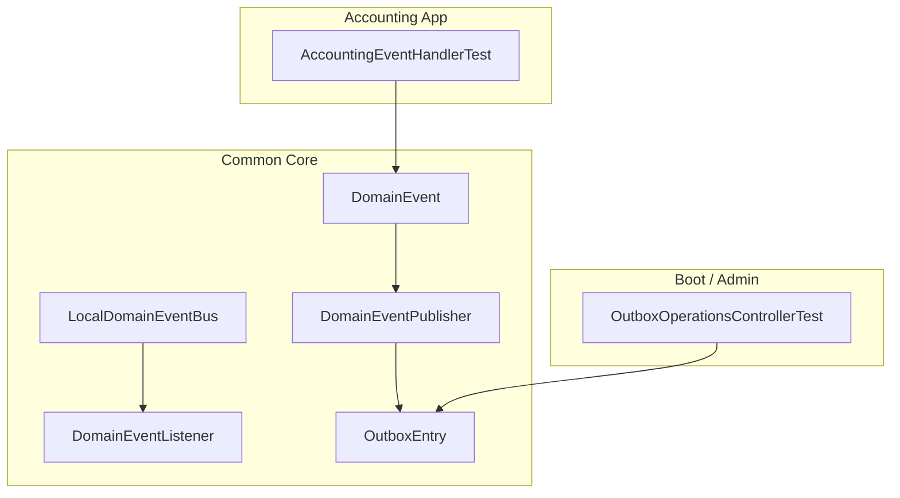
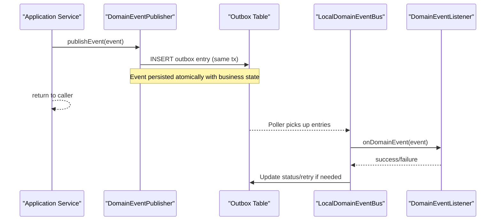
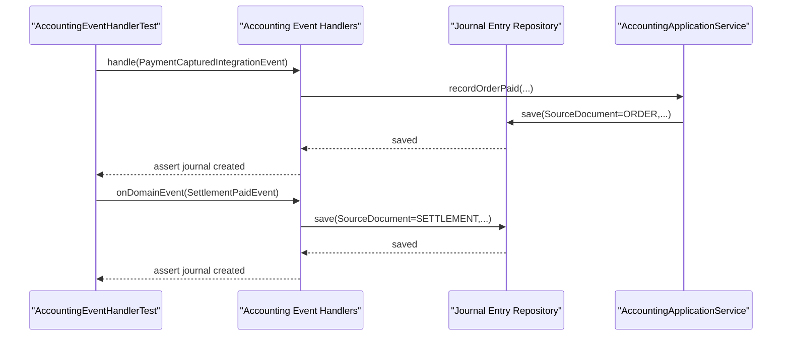
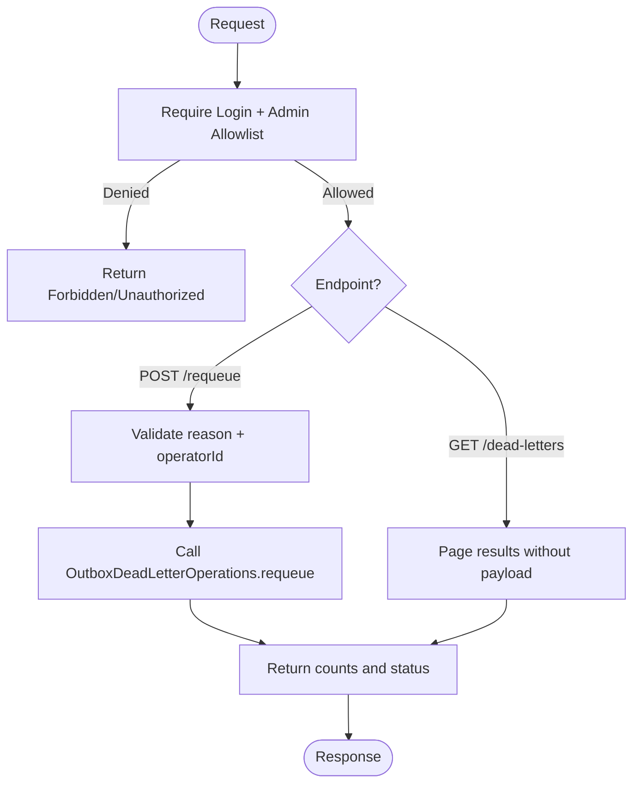
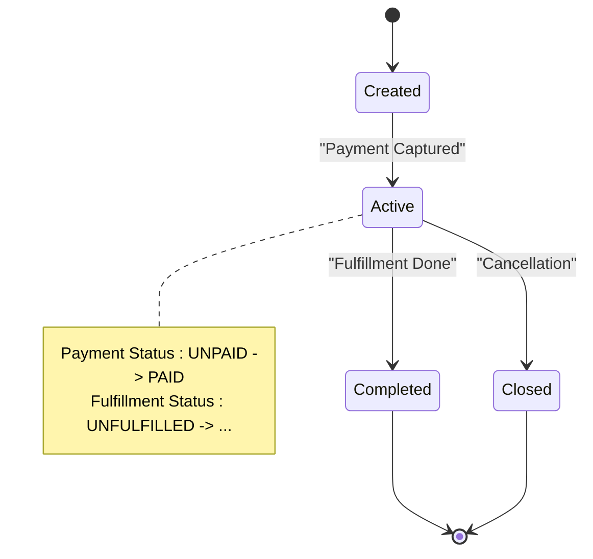
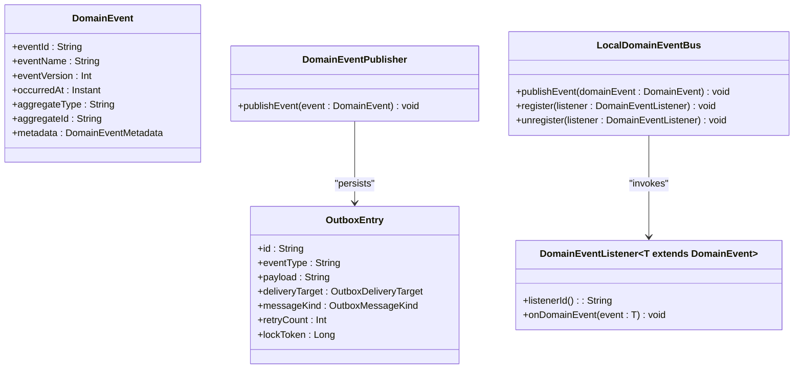

# Event Testing

<cite>
**Referenced Files in This Document**
- [DomainEvent.kt](file://j-store-common-core/src/main/kotlin/com/jstore/common/framework/event/DomainEvent.kt)
- [DomainEventPublisher.kt](file://j-store-common-core/src/main/kotlin/com/jstore/common/framework/event/DomainEventPublisher.kt)
- [LocalDomainEventBus.kt](file://j-store-common-core/src/main/kotlin/com/jstore/common/framework/event/LocalDomainEventBus.kt)
- [DomainEventListener.kt](file://j-store-common-core/src/main/kotlin/com/jstore/common/framework/event/DomainEventListener.kt)
- [OutboxEntry.kt](file://j-store-common-core/src/main/kotlin/com/jstore/common/framework/event/outbox/OutboxEntry.kt)
- [AccountingEventHandlerTest.kt](file://j-store-accounting-application/src/test/kotlin/com/jstore/accounting/service/AccountingEventHandlerTest.kt)
- [OutboxOperationsControllerTest.kt](file://j-store-boot/src/test/kotlin/com/jstore/outbox/operations/OutboxOperationsControllerTest.kt)
- [V20260803__order_after_sale_aggregate.sql](file://j-store-boot/src/main/resources/db/migration/V20260803__order_after_sale_aggregate.sql)
- [V20260731__order_status_dimensions.sql](file://j-store-boot/src/main/resources/db/migration/V20260731__order_status_dimensions.sql)
</cite>

## Table of Contents
1. [Introduction](#introduction)
2. [Project Structure](#project-structure)
3. [Core Components](#core-components)
4. [Architecture Overview](#architecture-overview)
5. [Detailed Component Analysis](#detailed-component-analysis)
6. [Dependency Analysis](#dependency-analysis)
7. [Performance Considerations](#performance-considerations)
8. [Troubleshooting Guide](#troubleshooting-guide)
9. [Conclusion](#conclusion)

## Introduction
This document provides a comprehensive guide to testing event-driven behavior in the J-Store platform. It focuses on:
- Domain events and their stable envelope metadata
- Transactional outbox pattern for reliable publishing
- Asynchronous event processing and idempotency
- Isolation and integration testing strategies for publishers, subscribers, and handlers
- Cross-bounded-context communication via integration messages
- Event versioning, serialization/deserialization, and ordering guarantees
- End-to-end workflows such as order lifecycle transitions and inventory updates

The guidance is grounded in the existing codebase interfaces and tests, ensuring practical applicability across unit, component, and integration layers.

## Project Structure
J-Store organizes eventing infrastructure under common modules and applies it across bounded contexts (accounting, goods, order, payment, fulfillment). The core abstractions include:
- Domain event model with stable metadata
- A transactional publisher interface decoupled from local dispatch
- A local bus for in-process synchronous listener invocation
- Outbox entry model with delivery targets and message kinds
- Application-level event handlers that translate integration/domain events into domain actions

**Diagram sources**
- [DomainEvent.kt](file://j-store-common-core/src/main/kotlin/com/jstore/common/framework/event/DomainEvent.kt)
- [DomainEventPublisher.kt](file://j-store-common-core/src/main/kotlin/com/jstore/common/framework/event/DomainEventPublisher.kt)
- [LocalDomainEventBus.kt](file://j-store-common-core/src/main/kotlin/com/jstore/common/framework/event/LocalDomainEventBus.kt)
- [DomainEventListener.kt](file://j-store-common-core/src/main/kotlin/com/jstore/common/framework/event/DomainEventListener.kt)
- [OutboxEntry.kt](file://j-store-common-core/src/main/kotlin/com/jstore/common/framework/event/outbox/OutboxEntry.kt)
- [AccountingEventHandlerTest.kt](file://j-store-accounting-application/src/test/kotlin/com/jstore/accounting/service/AccountingEventHandlerTest.kt)
- [OutboxOperationsControllerTest.kt](file://j-store-boot/src/test/kotlin/com/jstore/outbox/operations/OutboxOperationsControllerTest.kt)

**Section sources**
- [DomainEvent.kt](file://j-store-common-core/src/main/kotlin/com/jstore/common/framework/event/DomainEvent.kt)
- [DomainEventPublisher.kt](file://j-store-common-core/src/main/kotlin/com/jstore/common/framework/event/DomainEventPublisher.kt)
- [LocalDomainEventBus.kt](file://j-store-common-core/src/main/kotlin/com/jstore/common/framework/event/LocalDomainEventBus.kt)
- [DomainEventListener.kt](file://j-store-common-core/src/main/kotlin/com/jstore/common/framework/event/DomainEventListener.kt)
- [OutboxEntry.kt](file://j-store-common-core/src/main/kotlin/com/jstore/common/framework/event/outbox/OutboxEntry.kt)

## Core Components
- DomainEvent: Immutable event envelope carrying eventId, eventName, eventVersion, occurredAt, aggregateType, aggregateId, and a stable metadata accessor used by outbox delivery and idempotent consumers.
- DomainEventPublisher: Transactional publisher responsible for persisting events to the outbox within the same database transaction as business data; not responsible for local listener dispatch.
- LocalDomainEventBus: In-process bus for synchronous invocation of registered listeners; no reliability or transactional guarantees beyond process boundaries.
- DomainEventListener: Listener interface with a stable listenerId() for idempotent consumption and an onDomainEvent(T) method.
- OutboxEntry: Persistent representation of a pending event/message with fields for delivery target, message kind, partitioning, correlation/causation, retry, and lease management.

These components together enable:
- Reliable publishing via outbox
- Deterministic consumer identity for idempotency
- Clear separation between transactional persistence and asynchronous delivery

**Section sources**
- [DomainEvent.kt](file://j-store-common-core/src/main/kotlin/com/jstore/common/framework/event/DomainEvent.kt)
- [DomainEventPublisher.kt](file://j-store-common-core/src/main/kotlin/com/jstore/common/framework/event/DomainEventPublisher.kt)
- [LocalDomainEventBus.kt](file://j-store-common-core/src/main/kotlin/com/jstore/common/framework/event/LocalDomainEventBus.kt)
- [DomainEventListener.kt](file://j-store-common-core/src/main/kotlin/com/jstore/common/framework/event/DomainEventListener.kt)
- [OutboxEntry.kt](file://j-store-common-core/src/main/kotlin/com/jstore/common/framework/event/outbox/OutboxEntry.kt)

## Architecture Overview
The event-driven architecture separates concerns across domains while ensuring reliability through the outbox pattern.

**Diagram sources**
- [DomainEventPublisher.kt](file://j-store-common-core/src/main/kotlin/com/jstore/common/framework/event/DomainEventPublisher.kt)
- [LocalDomainEventBus.kt](file://j-store-common-core/src/main/kotlin/com/jstore/common/framework/event/LocalDomainEventBus.kt)
- [DomainEventListener.kt](file://j-store-common-core/src/main/kotlin/com/jstore/common/framework/event/DomainEventListener.kt)
- [OutboxEntry.kt](file://j-store-common-core/src/main/kotlin/com/jstore/common/framework/event/outbox/OutboxEntry.kt)

## Detailed Component Analysis

### Domain Events and Metadata
- Stable identifiers and timestamps ensure deduplication and auditability.
- Event versioning supports evolution without breaking consumers.
- Metadata includes aggregate context for routing and correlation.

Testing tips:
- Assert eventId uniqueness and immutability after construction.
- Verify eventVersion matches declared schema version.
- Validate metadata consistency across serialization round-trips.

**Section sources**
- [DomainEvent.kt](file://j-store-common-core/src/main/kotlin/com/jstore/common/framework/event/DomainEvent.kt)

### Transactional Outbox Publisher
- Publishers must write outbox entries within the same transaction as domain state changes.
- Delivery targets and message kinds constrain routing semantics.
- Lease and retry fields support robust polling and reprocessing.

Testing tips:
- Use embedded databases to assert outbox rows exist post-commit.
- Simulate failures to verify rollback behavior and idempotent retries.
- Validate constraints like deliveryTarget vs messageKind.

**Section sources**
- [DomainEventPublisher.kt](file://j-store-common-core/src/main/kotlin/com/jstore/common/framework/event/DomainEventPublisher.kt)
- [OutboxEntry.kt](file://j-store-common-core/src/main/kotlin/com/jstore/common/framework/event/outbox/OutboxEntry.kt)

### Local Domain Event Bus and Listeners
- The bus invokes registered listeners synchronously within the calling thread.
- Each listener exposes a stable listenerId for idempotent consumption.

Testing tips:
- Register test listeners to capture invocations and side effects.
- Assert handler invocation order when multiple listeners are present.
- Use listenerId to simulate duplicate deliveries and verify idempotency.

**Section sources**
- [LocalDomainEventBus.kt](file://j-store-common-core/src/main/kotlin/com/jstore/common/framework/event/LocalDomainEventBus.kt)
- [DomainEventListener.kt](file://j-store-common-core/src/main/kotlin/com/jstore/common/framework/event/DomainEventListener.kt)

### Accounting Event Handlers (Integration Tests)
The accounting module demonstrates how integration events are translated into domain journal entries and how domain settlement events trigger accounting actions.

**Diagram sources**
- [AccountingEventHandlerTest.kt](file://j-store-accounting-application/src/test/kotlin/com/jstore/accounting/service/AccountingEventHandlerTest.kt)

**Section sources**
- [AccountingEventHandlerTest.kt](file://j-store-accounting-application/src/test/kotlin/com/jstore/accounting/service/AccountingEventHandlerTest.kt)

### Outbox Operations Controller (Admin API)
Administrative operations allow inspecting dead-lettered outbox entries and requeueing them with operator attribution and reason tracking.

**Diagram sources**
- [OutboxOperationsControllerTest.kt](file://j-store-boot/src/test/kotlin/com/jstore/outbox/operations/OutboxOperationsControllerTest.kt)

**Section sources**
- [OutboxOperationsControllerTest.kt](file://j-store-boot/src/test/kotlin/com/jstore/outbox/operations/OutboxOperationsControllerTest.kt)

### Order Lifecycle and After-Sale Aggregates
Schema migrations define multi-dimensional order statuses and after-sale aggregates, enabling event-driven transitions and refund facts.

**Diagram sources**
- [V20260731__order_status_dimensions.sql](file://j-store-boot/src/main/resources/db/migration/V20260731__order_status_dimensions.sql)
- [V20260803__order_after_sale_aggregate.sql](file://j-store-boot/src/main/resources/db/migration/V20260803__order_after_sale_aggregate.sql)

**Section sources**
- [V20260731__order_status_dimensions.sql](file://j-store-boot/src/main/resources/db/migration/V20260731__order_status_dimensions.sql)
- [V20260803__order_after_sale_aggregate.sql](file://j-store-boot/src/main/resources/db/migration/V20260803__order_after_sale_aggregate.sql)

## Dependency Analysis
Eventing dependencies span core abstractions and application handlers:

**Diagram sources**
- [DomainEvent.kt](file://j-store-common-core/src/main/kotlin/com/jstore/common/framework/event/DomainEvent.kt)
- [DomainEventPublisher.kt](file://j-store-common-core/src/main/kotlin/com/jstore/common/framework/event/DomainEventPublisher.kt)
- [LocalDomainEventBus.kt](file://j-store-common-core/src/main/kotlin/com/jstore/common/framework/event/LocalDomainEventBus.kt)
- [DomainEventListener.kt](file://j-store-common-core/src/main/kotlin/com/jstore/common/framework/event/DomainEventListener.kt)
- [OutboxEntry.kt](file://j-store-common-core/src/main/kotlin/com/jstore/common/framework/event/outbox/OutboxEntry.kt)

**Section sources**
- [DomainEvent.kt](file://j-store-common-core/src/main/kotlin/com/jstore/common/framework/event/DomainEvent.kt)
- [DomainEventPublisher.kt](file://j-store-common-core/src/main/kotlin/com/jstore/common/framework/event/DomainEventPublisher.kt)
- [LocalDomainEventBus.kt](file://j-store-common-core/src/main/kotlin/com/jstore/common/framework/event/LocalDomainEventBus.kt)
- [DomainEventListener.kt](file://j-store-common-core/src/main/kotlin/com/jstore/common/framework/event/DomainEventListener.kt)
- [OutboxEntry.kt](file://j-store-common-core/src/main/kotlin/com/jstore/common/framework/event/outbox/OutboxEntry.kt)

## Performance Considerations
- Batch outbox polling to reduce database load; tune batch size based on throughput needs.
- Partition keys should align with aggregateId to preserve ordering per aggregate.
- Avoid heavy work in synchronous local bus handlers; prefer async processing for long-running tasks.
- Use idempotency keys and stable listenerId to prevent duplicate processing overhead.
- Monitor retry backoff and dead-letter thresholds to avoid cascading failures.

[No sources needed since this section provides general guidance]

## Troubleshooting Guide
Common issues and how to address them:
- Duplicate event processing: Ensure consumers use stable listenerId and idempotency checks against sourceMessageId or eventId.
- Stuck outbox entries: Inspect dead-letter pages via admin APIs; validate payloads and requeue with reasons.
- Ordering violations: Confirm partitionKey usage and single-writer semantics per aggregate.
- Serialization mismatches: Validate eventVersion and schema compatibility; add backward-compatible deserializers.
- Transactional inconsistencies: Verify outbox writes occur within the same transaction as business state changes.

**Section sources**
- [OutboxOperationsControllerTest.kt](file://j-store-boot/src/test/kotlin/com/jstore/outbox/operations/OutboxOperationsControllerTest.kt)

## Conclusion
J-Store’s event-driven design leverages clear abstractions and the outbox pattern to achieve reliable, scalable, and testable cross-boundary communication. By focusing on stable identifiers, versioned events, and idempotent consumers, teams can confidently test both isolated handlers and integrated workflows. The provided patterns and examples offer a solid foundation for validating event ordering, error handling, and end-to-end scenarios such as order lifecycle transitions and inventory updates.

[No sources needed since this section summarizes without analyzing specific files]