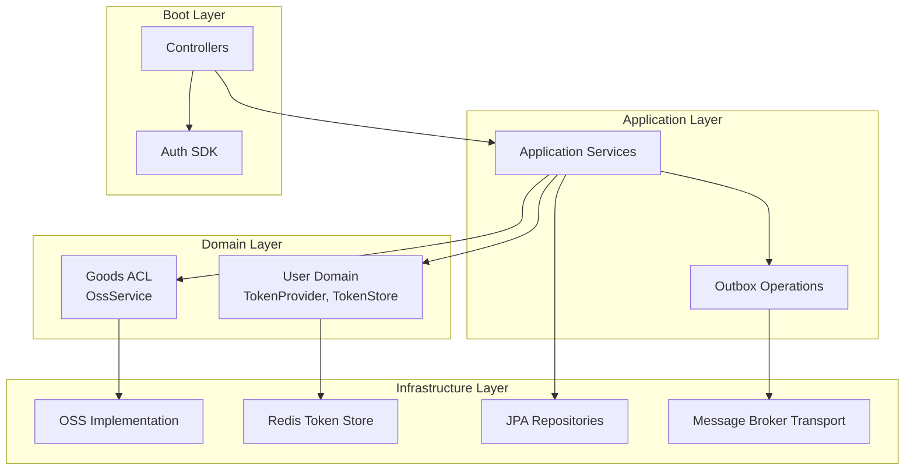
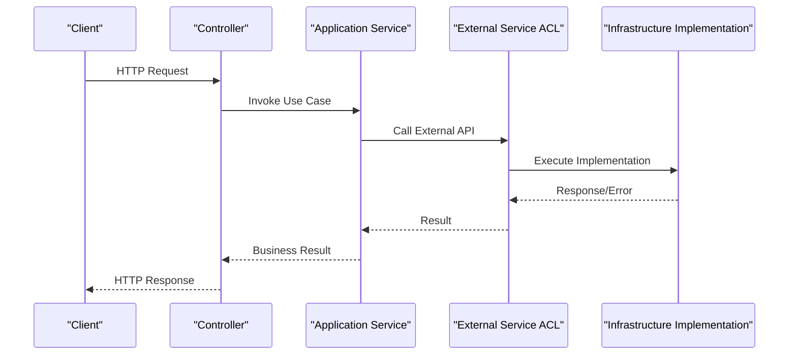
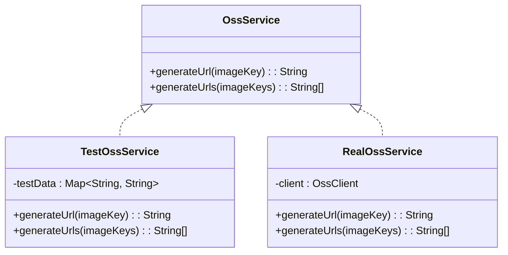
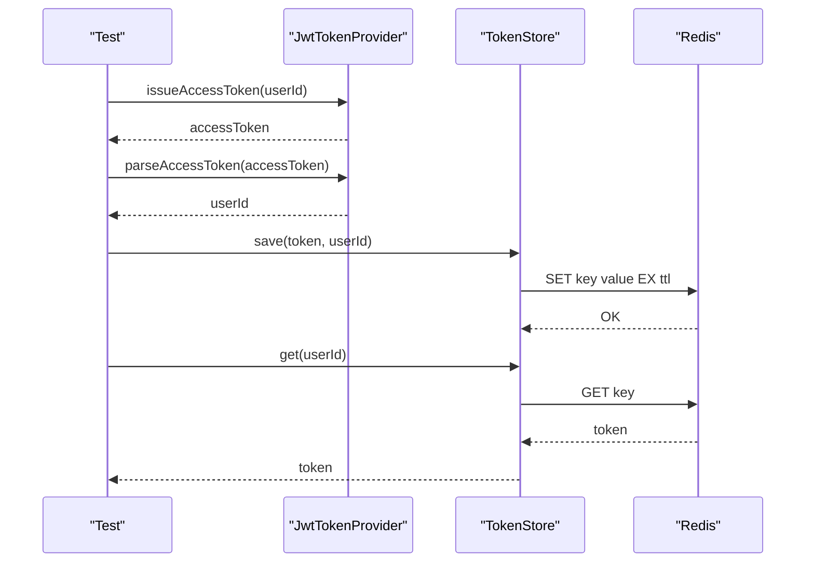
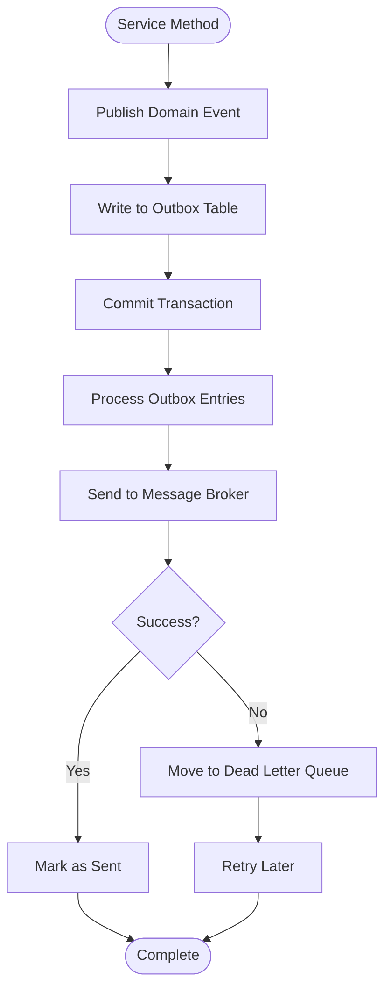
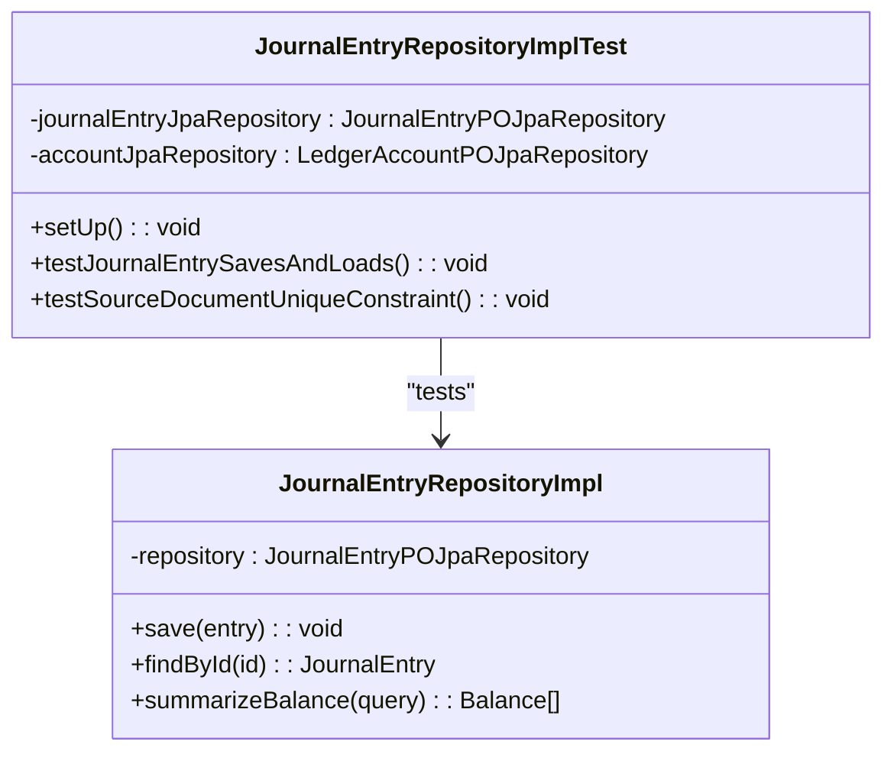
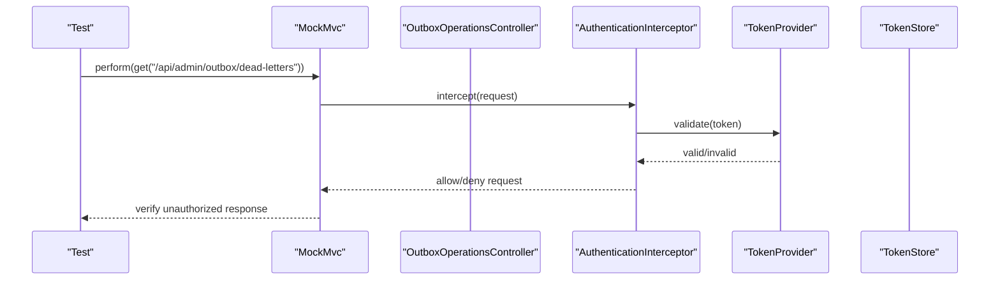
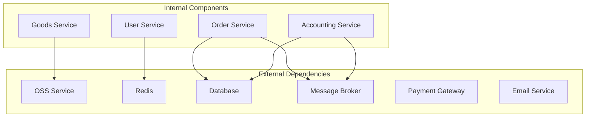

# External Service Testing

<cite>
**Referenced Files in This Document**
- [OssService.kt](file://j-store-goods-domain/src/main/kotlin/com/jstore/goods/acl/OssService.kt)
- [RedisTokenStore.kt](file://j-store-user-infrastructure/src/main/kotlin/com/jstore/user/domain/useraccount/RedisTokenStore.kt)
- [JwtTokenProviderPropertyTest.kt](file://j-store-user-infrastructure/src/test/kotlin/com/jstore/user/JwtTokenProviderPropertyTest.kt)
- [BCryptPasswordHasherPropertyTest.kt](file://j-store-user-infrastructure/src/test/kotlin/com/jstore/user/BCryptPasswordHasherPropertyTest.kt)
- [AuthenticationAutoConfigurationTest.kt](file://j-store-authentication-spring-sdk/src/test/kotlin/com/jstore/authentication/spring/AuthenticationAutoConfigurationTest.kt)
- [OutboxOperationsControllerTest.kt](file://j-store-boot/src/test/kotlin/com/jstore/outbox/operations/OutboxOperationsControllerTest.kt)
- [JournalEntryRepositoryImplTest.kt](file://j-store-accounting-infrastructure/src/test/kotlin/com/jstore/accounting/domain/journal/JournalEntryRepositoryImplTest.kt)
- [BrokerIntegrationMessageTransport.kt](file://j-store-common-core/src/main/kotlin/com/jstore/common/framework/messaging/BrokerIntegrationMessageTransport.kt)
- [IntegrationMessageHandler.kt](file://j-store-common-core/src/main/kotlin/com/jstore/common/framework/messaging/IntegrationMessageHandler.kt)
- [DomainEventPublisher.kt](file://j-store-common-core/src/main/kotlin/com/jstore/common/framework/event/DomainEventPublisher.kt)
- [LocalDomainEventBus.kt](file://j-store-common-core/src/main/kotlin/com/jstore/common/framework/event/LocalDomainEventBus.kt)
- [OutboxDeadLetterOperations.kt](file://j-store-common-core/src/main/kotlin/com/jstore/common/framework/event/outbox/OutboxDeadLetterOperations.kt)
- [TimerJobCoordinator.kt](file://j-store-boot/src/main/java/com/jstore/order/expired/TimerJobCoordinator.kt)
- [Worker.kt](file://j-store-boot/src/main/java/com/jstore/order/expired/Worker.kt)
- [RetryTimes.java](file://j-store-boot/src/main/java/com/jstore/order/expired/RetryTimes.java)
</cite>

## Table of Contents
1. Introduction
2. Project Structure
3. Core Components
4. Architecture Overview
5. Detailed Component Analysis
6. Dependency Analysis
7. Performance Considerations
8. Troubleshooting Guide
9. Conclusion

## Introduction
This document provides a comprehensive guide to testing external service integrations for the J-Store platform. It covers strategies for mocking HTTP clients, message brokers, Redis connections, and authentication providers; examples of failure scenarios, timeouts, retries; and guidance for creating test doubles for OSS storage, payment gateways, and notification systems. It also addresses testing patterns for circuit breakers, rate limiting, and service discovery. The guidance is grounded in existing code and tests within the repository.

## Project Structure
The J-Store platform follows a modular architecture with clear separation between domain, application, infrastructure, and boot modules. External integrations are typically abstracted via interfaces (ACLs) and implemented in infrastructure layers. Tests use a mix of unit tests, property-based tests, Spring Boot integration tests, and MockMvc controller tests.

[No sources needed since this diagram shows conceptual structure]

## Core Components
Key components involved in external integrations and their testing patterns:

- OSS Storage Interface: Defined as an ACL interface to abstract object storage operations.
- Authentication and Tokens: JWT token provider and Redis-backed token store.
- Message Broker Integration: Abstractions for publishing and handling integration messages.
- Outbox Pattern: Dead letter operations for reliable event delivery.
- Controller Security: Authentication interceptor and authorization checks.
- Database Persistence: Repository implementations tested against embedded databases.

**Section sources**
- [OssService.kt:1-26](file://j-store-goods-domain/src/main/kotlin/com/jstore/goods/acl/OssService.kt#L1-L26)
- [RedisTokenStore.kt](file://j-store-user-infrastructure/src/main/kotlin/com/jstore/user/domain/useraccount/RedisTokenStore.kt)
- [BrokerIntegrationMessageTransport.kt](file://j-store-common-core/src/main/kotlin/com/jstore/common/framework/messaging/BrokerIntegrationMessageTransport.kt)
- [IntegrationMessageHandler.kt](file://j-store-common-core/src/main/kotlin/com/jstore/common/framework/messaging/IntegrationMessageHandler.kt)
- [OutboxDeadLetterOperations.kt](file://j-store-common-core/src/main/kotlin/com/jstore/common/framework/event/outbox/OutboxDeadLetterOperations.kt)

## Architecture Overview
The system uses layered architecture with clear boundaries. External services are accessed through well-defined interfaces, enabling effective mocking and testing.

[No sources needed since this diagram shows conceptual workflow]

## Detailed Component Analysis

### OSS Storage Testing
The OSS service is defined as an interface, making it easy to create test doubles for different storage backends.

**Diagram sources**
- [OssService.kt:1-26](file://j-store-goods-domain/src/main/kotlin/com/jstore/goods/acl/OssService.kt#L1-L26)

Testing strategies:
- Create mock implementations that return predefined URLs
- Test URL generation logic without actual network calls
- Validate batch operations and error handling

**Section sources**
- [OssService.kt:1-26](file://j-store-goods-domain/src/main/kotlin/com/jstore/goods/acl/OssService.kt#L1-L26)

### Authentication Provider Testing
JWT token provider and Redis token store are critical authentication components that require thorough testing.

**Diagram sources**
- [JwtTokenProviderPropertyTest.kt:1-54](file://j-store-user-infrastructure/src/test/kotlin/com/jstore/user/JwtTokenProviderPropertyTest.kt#L1-L54)
- [RedisTokenStore.kt](file://j-store-user-infrastructure/src/main/kotlin/com/jstore/user/domain/useraccount/RedisTokenStore.kt)

Testing approaches:
- Property-based testing for token round-trip validation
- Embedded Redis for token store testing
- Mock implementations for isolated unit tests

**Section sources**
- [JwtTokenProviderPropertyTest.kt:1-54](file://j-store-user-infrastructure/src/test/kotlin/com/jstore/user/JwtTokenProviderPropertyTest.kt#L1-L54)
- [BCryptPasswordHasherPropertyTest.kt:1-44](file://j-store-user-infrastructure/src/test/kotlin/com/jstore/user/BCryptPasswordHasherPropertyTest.kt#L1-L44)

### Message Broker Integration Testing
The platform uses outbox pattern for reliable message delivery with dead letter handling.

**Diagram sources**
- [OutboxOperationsControllerTest.kt:1-141](file://j-store-boot/src/test/kotlin/com/jstore/outbox/operations/OutboxOperationsControllerTest.kt#L1-L141)
- [BrokerIntegrationMessageTransport.kt](file://j-store-common-core/src/main/kotlin/com/jstore/common/framework/messaging/BrokerIntegrationMessageTransport.kt)

Testing strategies:
- Mock message broker responses for success/failure scenarios
- Test dead letter queue operations
- Verify idempotency and retry mechanisms

**Section sources**
- [OutboxOperationsControllerTest.kt:1-141](file://j-store-boot/src/test/kotlin/com/jstore/outbox/operations/OutboxOperationsControllerTest.kt#L1-L141)

### Database Integration Testing
Repository implementations are tested with embedded databases to ensure data consistency and constraint validation.

**Diagram sources**
- [JournalEntryRepositoryImplTest.kt:1-225](file://j-store-accounting-infrastructure/src/test/kotlin/com/jstore/accounting/domain/journal/JournalEntryRepositoryImplTest.kt#L1-L225)

Testing patterns:
- Embedded H2 database with PostgreSQL compatibility mode
- Transactional test methods for data isolation
- Constraint violation testing for business rules

**Section sources**
- [JournalEntryRepositoryImplTest.kt:1-225](file://j-store-accounting-infrastructure/src/test/kotlin/com/jstore/accounting/domain/journal/JournalEntryRepositoryImplTest.kt#L1-L225)

### Controller Security Testing
Authentication and authorization are tested using MockMvc with custom argument resolvers.

**Diagram sources**
- [AuthenticationAutoConfigurationTest.kt:1-55](file://j-store-authentication-spring-sdk/src/test/kotlin/com/jstore/authentication/spring/AuthenticationAutoConfigurationTest.kt#L1-L55)
- [OutboxOperationsControllerTest.kt:1-141](file://j-store-boot/src/test/kotlin/com/jstore/outbox/operations/OutboxOperationsControllerTest.kt#L1-L141)

Testing approaches:
- Mock authentication providers and token stores
- Test authorization based on user roles
- Verify proper error responses for unauthorized access

**Section sources**
- [AuthenticationAutoConfigurationTest.kt:1-55](file://j-store-authentication-spring-sdk/src/test/kotlin/com/jstore/authentication/spring/AuthenticationAutoConfigurationTest.kt#L1-L55)
- [OutboxOperationsControllerTest.kt:1-141](file://j-store-boot/src/test/kotlin/com/jstore/outbox/operations/OutboxOperationsControllerTest.kt#L1-L141)

## Dependency Analysis
Understanding component dependencies helps in creating effective test doubles and isolating external service interactions.

**Diagram sources**
- [OssService.kt:1-26](file://j-store-goods-domain/src/main/kotlin/com/jstore/goods/acl/OssService.kt#L1-L26)
- [BrokerIntegrationMessageTransport.kt](file://j-store-common-core/src/main/kotlin/com/jstore/common/framework/messaging/BrokerIntegrationMessageTransport.kt)

**Section sources**
- [OssService.kt:1-26](file://j-store-goods-domain/src/main/kotlin/com/jstore/goods/acl/OssService.kt#L1-L26)
- [BrokerIntegrationMessageTransport.kt](file://j-store-common-core/src/main/kotlin/com/jstore/common/framework/messaging/BrokerIntegrationMessageTransport.kt)

## Performance Considerations
When testing external service integrations, consider these performance aspects:

- **Network Latency**: Use mocks to eliminate network calls in unit tests
- **Database Performance**: Use embedded databases with minimal datasets
- **Memory Usage**: Be mindful of large payloads when mocking responses
- **Concurrency**: Test concurrent access patterns with appropriate isolation
- **Timeout Handling**: Implement and test timeout scenarios for external calls

## Troubleshooting Guide
Common issues and solutions when testing external service integrations:

### Connection Issues
- **Problem**: External service connection failures during tests
- **Solution**: Use circuit breaker patterns with fallback implementations
- **Example**: Configure test-specific connection parameters and timeouts

### Timeout Handling
- **Problem**: Tests hanging due to slow external responses
- **Solution**: Implement reasonable timeouts and test timeout scenarios
- **Pattern**: Use `@Timeout` annotations and mock slow responses

### Retry Mechanisms
- **Problem**: Infinite retry loops in tests
- **Solution**: Limit retry attempts and test retry behavior explicitly
- **Implementation**: Mock retry counters and verify retry logic

### Data Consistency
- **Problem**: Test data affecting other tests
- **Solution**: Use transactional tests with automatic rollback
- **Pattern**: Isolate test data with unique identifiers

**Section sources**
- [TimerJobCoordinator.kt](file://j-store-boot/src/main/java/com/jstore/order/expired/TimerJobCoordinator.kt)
- [Worker.kt](file://j-store-boot/src/main/java/com/jstore/order/expired/Worker.kt)
- [RetryTimes.java](file://j-store-boot/src/main/java/com/jstore/order/expired/RetryTimes.java)

## Conclusion
Effective testing of external service integrations in J-Store requires a multi-layered approach combining unit tests with mocks, integration tests with embedded services, and contract tests for external APIs. The modular architecture with clear interfaces enables comprehensive testing strategies while maintaining code quality and reliability. By following the patterns and guidelines outlined in this document, teams can ensure robust external service integrations that handle failures gracefully and maintain system stability.