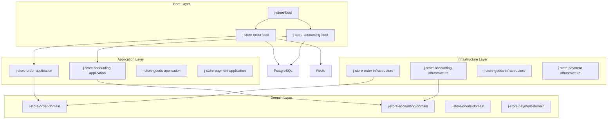
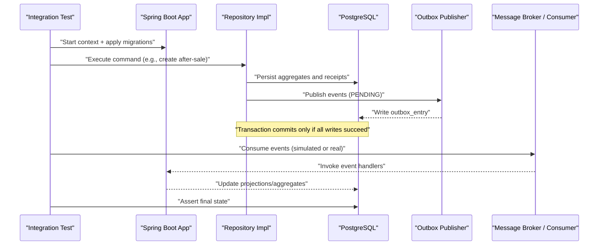
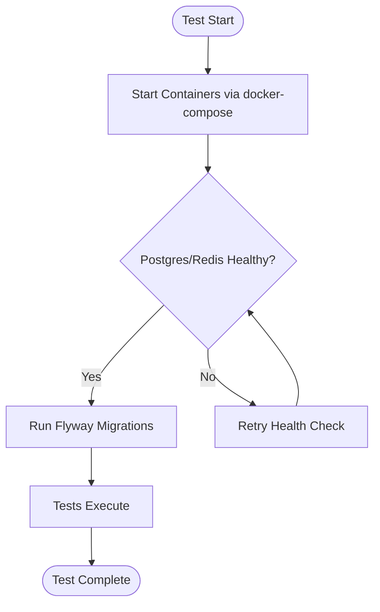
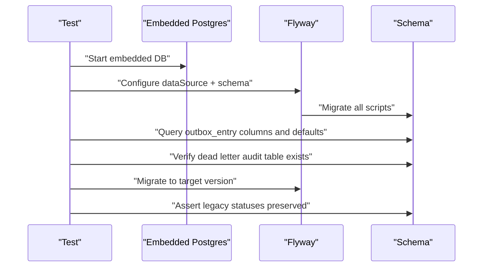
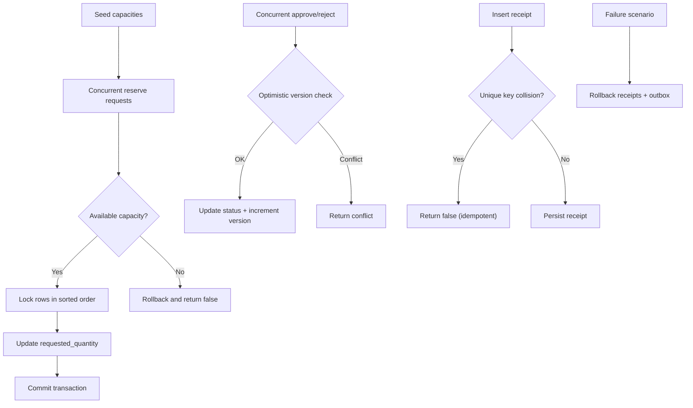
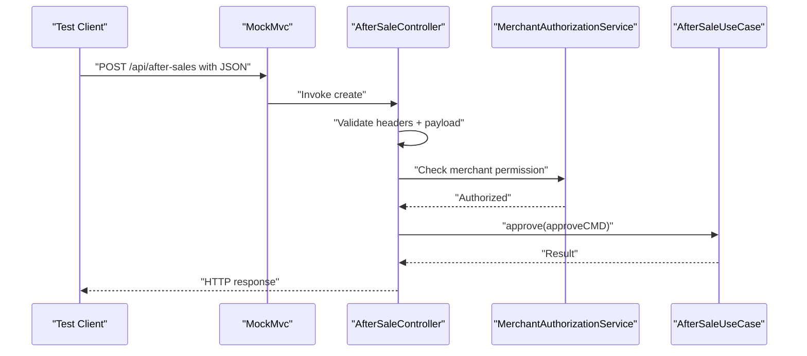
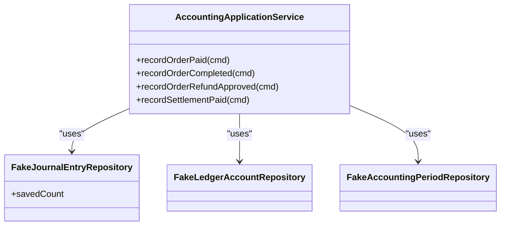
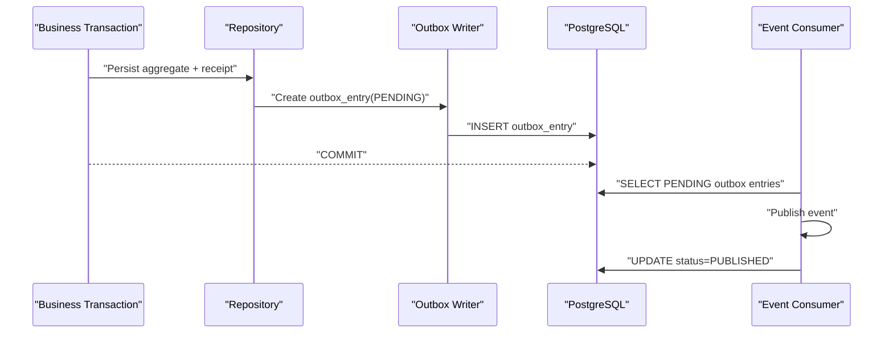
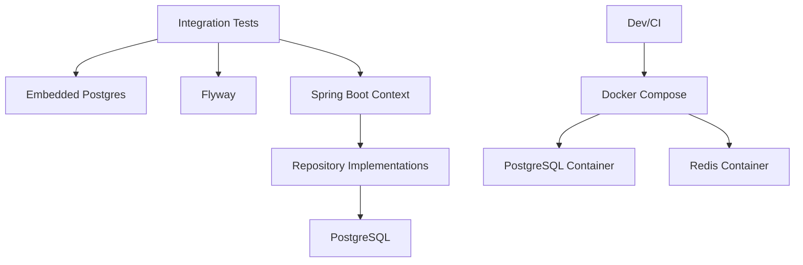

# Integration Testing

<cite>
**Referenced Files in This Document**
- [docker-compose.postgres.yml](file://docker-compose.postgres.yml)
- [build.gradle.kts](file://build.gradle.kts)
- [AccountingJpaTestConfig.kt](file://j-store-accounting-infrastructure/src/test/kotlin/com/jstore/accounting/AccountingJpaTestConfig.kt)
- [OutboxFlywayMigrationTest.kt](file://j-store-boot/src/test/kotlin/com/jstore/outbox/OutboxFlywayMigrationTest.kt)
- [AfterSalePostgresConcurrencyTest.kt](file://j-store-order-infrastructure/src/test/kotlin/com/jstore/order/integration/AfterSalePostgresConcurrencyTest.kt)
- [AccountingApplicationServiceTest.kt](file://j-store-accounting-application/src/test/kotlin/com/jstore/accounting/service/AccountingApplicationServiceTest.kt)
- [AfterSaleControllerContractTest.kt](file://j-store-order-boot/src/test/kotlin/com/jstore/order/controller/AfterSaleControllerContractTest.kt)
- [V20260803__order_after_sale_aggregate.sql](file://j-store-boot/src/main/resources/db/migration/V20260803__order_after_sale_aggregate.sql)
- [V20260731__order_status_dimensions.sql](file://j-store-boot/src/main/resources/db/migration/V20260731__order_status_dimensions.sql)
</cite>

## Table of Contents
1. [Introduction](#introduction)
2. [Project Structure](#project-structure)
3. [Core Components](#core-components)
4. [Architecture Overview](#architecture-overview)
5. [Detailed Component Analysis](#detailed-component-analysis)
6. [Dependency Analysis](#dependency-analysis)
7. [Performance Considerations](#performance-considerations)
8. [Troubleshooting Guide](#troubleshooting-guide)
9. [Conclusion](#conclusion)
10. [Appendices](#appendices)

## Introduction
This document explains how to design and run integration tests for the J-Store platform with a focus on database-backed flows, Redis usage, event-driven communication, and outbox-based reliability. It covers:
- Using Testcontainers (via Embedded PostgreSQL and Docker Compose) for realistic Postgres and Redis environments
- Testing repository implementations against real databases
- Validating event handlers and outbox pattern components end-to-end
- Concrete examples for after-sale flows, accounting journal entries, and event-driven interactions
- Transaction management strategies, test data preparation, asynchronous processing, message brokers, and external service integrations
- Performance and concurrency testing approaches

## Project Structure
The project is organized into multiple modules (accounting, order, goods, payment, user, etc.) with clear separation between domain, application, infrastructure, and boot layers. Tests are colocated with their respective modules under src/test, enabling focused unit, property, contract, and integration tests.

[No sources needed since this diagram shows conceptual structure]

## Core Components
Key integration testing assets include:
- Database container orchestration via Docker Compose for PostgreSQL and Redis
- Flyway migration validation using an embedded Postgres instance
- Concurrency and transactional integrity tests using embedded Postgres
- Contract tests for controllers ensuring authentication, idempotency headers, and validation
- Application-level tests for accounting use cases validating idempotency and ledger correctness

**Section sources**
- [docker-compose.postgres.yml:1-40](file://docker-compose.postgres.yml#L1-L40)
- [OutboxFlywayMigrationTest.kt:1-116](file://j-store-boot/src/test/kotlin/com/jstore/outbox/OutboxFlywayMigrationTest.kt#L1-L116)
- [AfterSalePostgresConcurrencyTest.kt:1-204](file://j-store-order-infrastructure/src/test/kotlin/com/jstore/order/integration/AfterSalePostgresConcurrencyTest.kt#L1-L204)
- [AfterSaleControllerContractTest.kt:1-138](file://j-store-order-boot/src/test/kotlin/com/jstore/order/controller/AfterSaleControllerContractTest.kt#L1-L138)
- [AccountingApplicationServiceTest.kt:1-221](file://j-store-accounting-application/src/test/kotlin/com/jstore/accounting/service/AccountingApplicationServiceTest.kt#L1-L221)

## Architecture Overview
Integration tests exercise the full stack across modules by wiring Spring contexts, applying Flyway migrations, and interacting with real or embedded databases. The outbox pattern ensures reliable event publishing; tests validate that receipts and outbox entries are created atomically and rolled back together when failures occur.

[No sources needed since this diagram shows conceptual workflow]

## Detailed Component Analysis

### Testcontainers and Database Setup
- Use Docker Compose to spin up PostgreSQL and Redis containers with health checks and environment variables for credentials and ports.
- For fast, isolated tests, use Embedded PostgreSQL within tests to avoid external dependencies while keeping SQL behavior accurate.

**Section sources**
- [docker-compose.postgres.yml:1-40](file://docker-compose.postgres.yml#L1-L40)

### Flyway Migration Validation
- Validate that production migrations create required tables, columns, defaults, and audit structures.
- Ensure backward compatibility by targeting specific versions and asserting legacy states are preserved.

**Section sources**
- [OutboxFlywayMigrationTest.kt:1-116](file://j-store-boot/src/test/kotlin/com/jstore/outbox/OutboxFlywayMigrationTest.kt#L1-L116)
- [V20260803__order_after_sale_aggregate.sql:1-21](file://j-store-boot/src/main/resources/db/migration/V20260803__order_after_sale_aggregate.sql#L1-L21)

### After-Sale Concurrency and Transactional Integrity
- Simulate concurrent capacity reservations and decision updates to ensure no overselling and deterministic lock ordering.
- Verify idempotency keys and command receipts prevent duplicate approvals.
- Confirm that command receipts and outbox entries are rolled back together on failure.

**Section sources**
- [AfterSalePostgresConcurrencyTest.kt:1-204](file://j-store-order-infrastructure/src/test/kotlin/com/jstore/order/integration/AfterSalePostgresConcurrencyTest.kt#L1-L204)
- [V20260803__order_after_sale_aggregate.sql:1-21](file://j-store-boot/src/main/resources/db/migration/V20260803__order_after_sale_aggregate.sql#L1-L21)

### Controller Contract Tests (Authentication, Idempotency, Validation)
- Validate that all after-sale endpoints require authenticated current user and idempotency headers.
- Ensure nested DTOs are validated before invoking services.
- Confirm merchant authorization uses correct actor IDs and permissions.

**Section sources**
- [AfterSaleControllerContractTest.kt:1-138](file://j-store-order-boot/src/test/kotlin/com/jstore/order/controller/AfterSaleControllerContractTest.kt#L1-L138)

### Accounting Journal Entries and Idempotency
- Validate idempotent recording of paid orders and settlement payments.
- Ensure refund approvals create reversal entries without mutating original source documents.
- Enforce accounting period constraints and error propagation.

**Section sources**
- [AccountingApplicationServiceTest.kt:1-221](file://j-store-accounting-application/src/test/kotlin/com/jstore/accounting/service/AccountingApplicationServiceTest.kt#L1-L221)

### JPA Test Configuration
- Provide a minimal Spring configuration for JPA tests scanning entities and repositories within the accounting module.

**Section sources**
- [AccountingJpaTestConfig.kt:1-13](file://j-store-accounting-infrastructure/src/test/kotlin/com/jstore/accounting/AccountingJpaTestConfig.kt#L1-L13)

### Event Handlers and Outbox Pattern
- Outbox entries are persisted alongside business transactions; consumers publish events reliably.
- Tests assert that outbox entries have expected columns, defaults, and statuses, and that hardening migrations preserve existing states.

**Section sources**
- [OutboxFlywayMigrationTest.kt:1-116](file://j-store-boot/src/test/kotlin/com/jstore/outbox/OutboxFlywayMigrationTest.kt#L1-L116)
- [V20260803__order_after_sale_aggregate.sql:1-21](file://j-store-boot/src/main/resources/db/migration/V20260803__order_after_sale_aggregate.sql#L1-L21)

## Dependency Analysis
Integration tests depend on:
- Embedded Postgres for fast, isolated DB operations
- Flyway for schema validation and migration assertions
- Spring Boot for wiring application contexts and repositories
- Docker Compose for orchestrating Postgres and Redis during development and CI

**Section sources**
- [build.gradle.kts:1-64](file://build.gradle.kts#L1-L64)
- [docker-compose.postgres.yml:1-40](file://docker-compose.postgres.yml#L1-L40)

## Performance Considerations
- Prefer embedded Postgres for fast iteration; switch to Docker Compose for realistic performance characteristics.
- Use targeted migrations and limited datasets to reduce startup time.
- Parallelize independent tests; serialize tests that share mutable state or resources.
- Measure query performance with EXPLAIN ANALYZE on critical paths and add indexes where necessary.
- For concurrency tests, limit thread pools and timeouts to avoid flakiness.

[No sources needed since this section provides general guidance]

## Troubleshooting Guide
Common issues and resolutions:
- Embedded Postgres startup failures: verify JDBC URL, user, and password settings; ensure health checks pass.
- Flyway migration conflicts: confirm schema names and default schemas match test configurations.
- Concurrency test flakiness: increase timeouts, ensure deterministic lock ordering, and validate unique constraints.
- Redis connectivity: confirm port mappings and health checks; reset containers if state persists.

**Section sources**
- [OutboxFlywayMigrationTest.kt:1-116](file://j-store-boot/src/test/kotlin/com/jstore/outbox/OutboxFlywayMigrationTest.kt#L1-L116)
- [AfterSalePostgresConcurrencyTest.kt:1-204](file://j-store-order-infrastructure/src/test/kotlin/com/jstore/order/integration/AfterSalePostgresConcurrencyTest.kt#L1-L204)
- [docker-compose.postgres.yml:1-40](file://docker-compose.postgres.yml#L1-L40)

## Conclusion
The J-Store integration testing strategy combines embedded databases for speed and Docker Compose for realism, validates schema migrations rigorously, and exercises transactional integrity and concurrency through targeted tests. Event-driven flows are verified via outbox persistence and consumer interactions, ensuring reliability and consistency across modules.

[No sources needed since this section summarizes without analyzing specific files]

## Appendices

### Test Data Preparation Patterns
- Seed capacity records for after-sale concurrency tests.
- Create initial after-sale aggregates and receipts to simulate idempotency scenarios.
- Prepare accounting periods and ledger accounts for journal entry validations.

**Section sources**
- [AfterSalePostgresConcurrencyTest.kt:1-204](file://j-store-order-infrastructure/src/test/kotlin/com/jstore/order/integration/AfterSalePostgresConcurrencyTest.kt#L1-L204)
- [AccountingApplicationServiceTest.kt:1-221](file://j-store-accounting-application/src/test/kotlin/com/jstore/accounting/service/AccountingApplicationServiceTest.kt#L1-L221)

### Asynchronous Processing and Message Brokers
- Simulate broker consumption by polling outbox entries and asserting status transitions.
- Validate that failed publishes remain PENDING and are retried according to policy.
- Ensure consumers handle idempotency via correlation IDs and idempotency keys.

[No sources needed since this section provides general guidance]

### External Service Integrations
- Mock external services at the application layer to isolate integration tests.
- Assert that failures propagate correctly and do not leave partial state.
- Use contract tests to validate request/response shapes and error codes.

**Section sources**
- [AfterSaleControllerContractTest.kt:1-138](file://j-store-order-boot/src/test/kotlin/com/jstore/order/controller/AfterSaleControllerContractTest.kt#L1-L138)