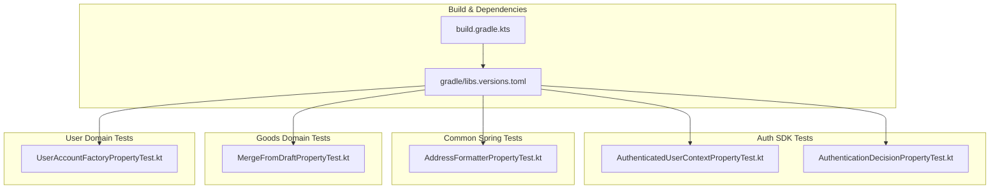
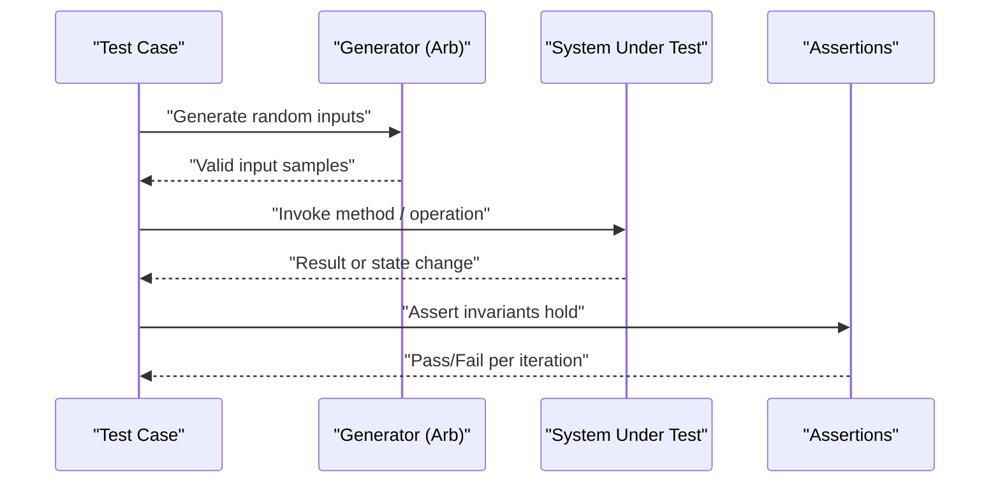
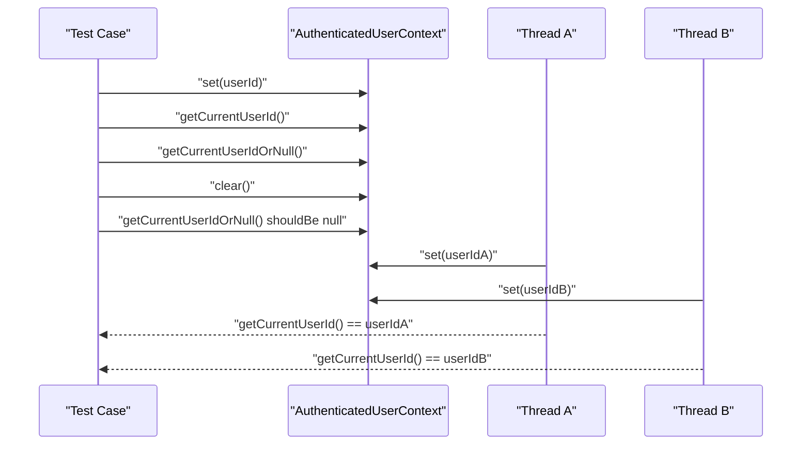
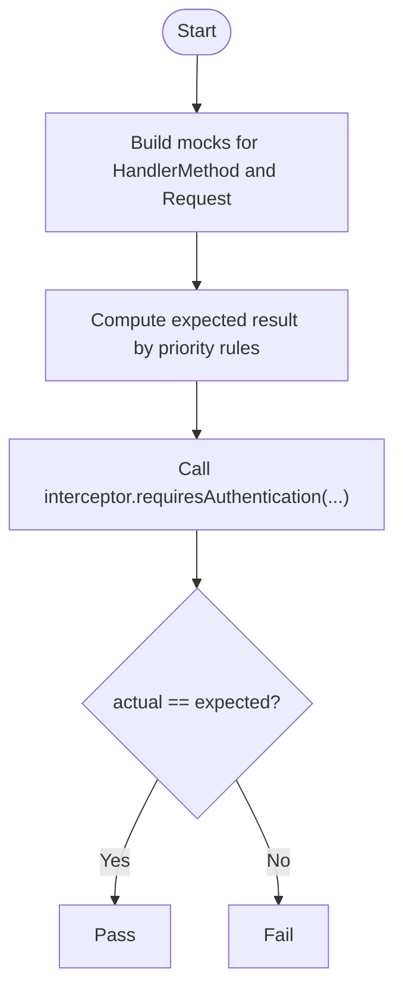
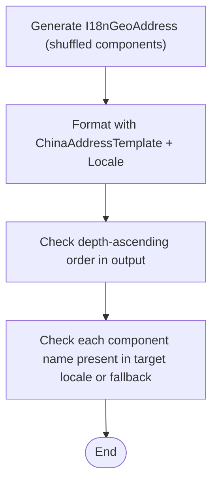
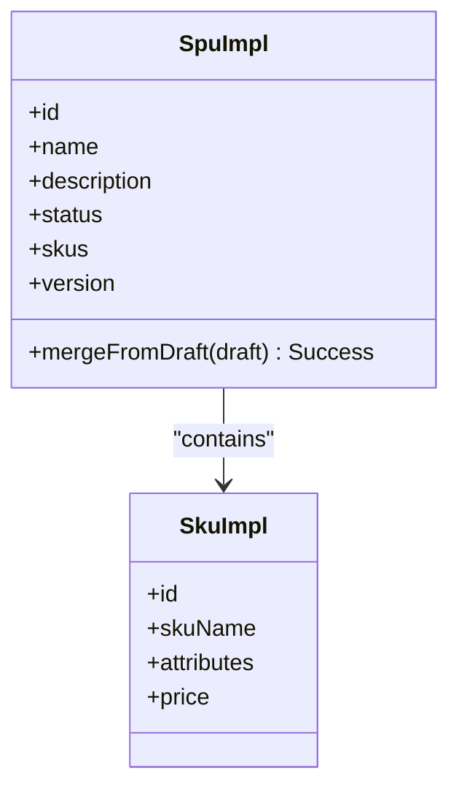
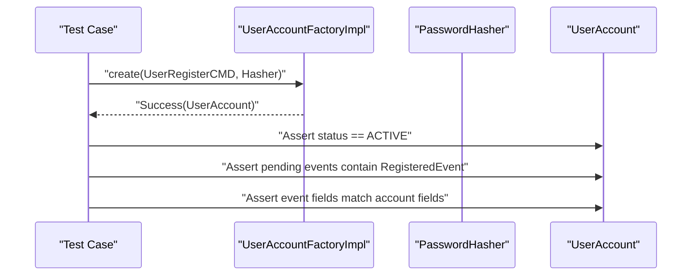
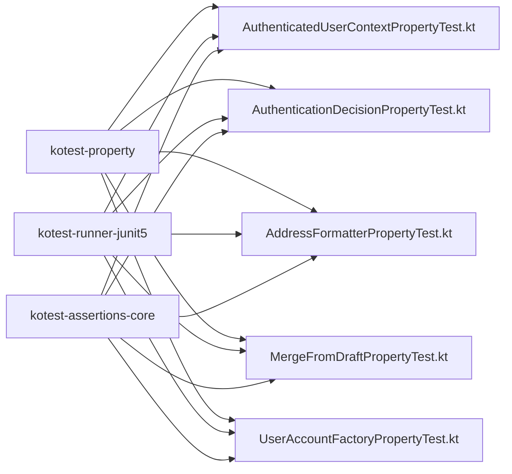

# Property-Based Testing

<cite>
**Referenced Files in This Document**
- [libs.versions.toml](file://gradle/libs.versions.toml)
- [build.gradle.kts](file://build.gradle.kts)
- [AuthenticatedUserContextPropertyTest.kt](file://j-store-authentication-spring-sdk/src/test/kotlin/com/jstore/authentication/context/AuthenticatedUserContextPropertyTest.kt)
- [AuthenticationDecisionPropertyTest.kt](file://j-store-authentication-spring-sdk/src/test/kotlin/com/jstore/authentication/spring/AuthenticationDecisionPropertyTest.kt)
- [AddressFormatterPropertyTest.kt](file://j-store-common-spring/src/test/kotlin/com/jstore/common/geo/AddressFormatterPropertyTest.kt)
- [MergeFromDraftPropertyTest.kt](file://j-store-goods-domain/src/test/kotlin/com/jstore/goods/domain/commodity/MergeFromDraftPropertyTest.kt)
- [UserAccountFactoryPropertyTest.kt](file://j-store-user-domain/src/test/kotlin/com/jstore/user/UserAccountFactoryPropertyTest.kt)
</cite>

## Table of Contents
1. [Introduction](#introduction)
2. [Project Structure](#project-structure)
3. [Core Components](#core-components)
4. [Architecture Overview](#architecture-overview)
5. [Detailed Component Analysis](#detailed-component-analysis)
6. [Dependency Analysis](#dependency-analysis)
7. [Performance Considerations](#performance-considerations)
8. [Troubleshooting Guide](#troubleshooting-guide)
9. [Conclusion](#conclusion)
10. [Appendices](#appendices)

## Introduction
This document explains how the project uses Kotest’s property-based testing to validate business invariants, data constraints, and algorithmic correctness across authentication, address formatting, goods domain operations, and user account creation. It synthesizes patterns from existing tests to guide writing meaningful properties, designing robust generators, interpreting failures, and scaling to complex business rules such as order amount calculations, inventory reservation logic, and authentication flows.

## Project Structure
The repository is a multi-module Kotlin/Spring application with dedicated test modules per feature area. Property tests are co-located with their respective features under src/test/kotlin and rely on Kotest for both specification style and property generation/assertions.

**Diagram sources**
- [libs.versions.toml:1-111](file://gradle/libs.versions.toml#L1-L111)
- [build.gradle.kts:1-64](file://build.gradle.kts#L1-L64)

**Section sources**
- [libs.versions.toml:1-111](file://gradle/libs.versions.toml#L1-L111)
- [build.gradle.kts:1-64](file://build.gradle.kts#L1-L64)

## Core Components
- Kotest runner and assertions are provided via kotest-runner-junit5 and kotest-assertions-core.
- Property testing utilities (Arb, checkAll, PropTestConfig) come from kotest-property.
- Tests use FunSpec-style specs and assert with kotest matchers.
- Generators are composed using Arb.bind, Arb.list, Arb.string, Arb.int, Arb.element, Arb.shuffle, and custom arbitrary builders.

Key usage patterns observed:
- Define valid input distributions with Arb to exercise invariants across many random inputs.
- Use checkAll with PropTestConfig(iterations = N) to run randomized trials.
- Assert invariants that must hold for all generated inputs (e.g., state transitions, ordering, idempotency).

**Section sources**
- [libs.versions.toml:95-97](file://gradle/libs.versions.toml#L95-L97)

## Architecture Overview
Property tests in this project follow a consistent flow:
- Generate valid inputs using Arb combinators.
- Invoke the system under test (domain methods, formatters, interceptors, factories).
- Assert universal properties (invariants, consistency, ordering, idempotence).

[No sources needed since this diagram shows conceptual workflow, not actual code structure]

## Detailed Component Analysis

### Authentication Context Property Test
Purpose: Validate thread-local context round-trip and isolation for authenticated user identity.

**Diagram sources**
- [AuthenticatedUserContextPropertyTest.kt:18-77](file://j-store-authentication-spring-sdk/src/test/kotlin/com/jstore/authentication/context/AuthenticatedUserContextPropertyTest.kt#L18-L77)

**Section sources**
- [AuthenticatedUserContextPropertyTest.kt:18-77](file://j-store-authentication-spring-sdk/src/test/kotlin/com/jstore/authentication/context/AuthenticatedUserContextPropertyTest.kt#L18-L77)

### Authentication Decision Property Test
Purpose: Verify priority-based authentication decision across annotations, class/method-level RequireLogin/SkipLogin, and path pattern matching.

**Diagram sources**
- [AuthenticationDecisionPropertyTest.kt:26-128](file://j-store-authentication-spring-sdk/src/test/kotlin/com/jstore/authentication/spring/AuthenticationDecisionPropertyTest.kt#L26-L128)

**Section sources**
- [AuthenticationDecisionPropertyTest.kt:26-128](file://j-store-authentication-spring-sdk/src/test/kotlin/com/jstore/authentication/spring/AuthenticationDecisionPropertyTest.kt#L26-L128)

### Address Formatter Property Test
Purpose: Ensure country-specific formatting produces correct component ordering and locale-aware names.

**Diagram sources**
- [AddressFormatterPropertyTest.kt:27-243](file://j-store-common-spring/src/test/kotlin/com/jstore/common/geo/AddressFormatterPropertyTest.kt#L27-L243)

**Section sources**
- [AddressFormatterPropertyTest.kt:27-243](file://j-store-common-spring/src/test/kotlin/com/jstore/common/geo/AddressFormatterPropertyTest.kt#L27-L243)

### Goods Merge From Draft Property Test
Purpose: Validate merge semantics and version increment when merging draft into an ON_SALE source.

**Diagram sources**
- [MergeFromDraftPropertyTest.kt:23-112](file://j-store-goods-domain/src/test/kotlin/com/jstore/goods/domain/commodity/MergeFromDraftPropertyTest.kt#L23-L112)

**Section sources**
- [MergeFromDraftPropertyTest.kt:23-112](file://j-store-goods-domain/src/test/kotlin/com/jstore/goods/domain/commodity/MergeFromDraftPropertyTest.kt#L23-L112)

### User Account Factory Property Test
Purpose: Confirm factory-created accounts have correct initial status and pending events for registration.

**Diagram sources**
- [UserAccountFactoryPropertyTest.kt:24-96](file://j-store-user-domain/src/test/kotlin/com/jstore/user/UserAccountFactoryPropertyTest.kt#L24-L96)

**Section sources**
- [UserAccountFactoryPropertyTest.kt:24-96](file://j-store-user-domain/src/test/kotlin/com/jstore/user/UserAccountFactoryPropertyTest.kt#L24-L96)

## Dependency Analysis
Kotest dependencies are centrally managed and used across modules. The following diagram maps dependency usage to specific test files.

**Diagram sources**
- [libs.versions.toml:95-97](file://gradle/libs.versions.toml#L95-L97)

**Section sources**
- [libs.versions.toml:95-97](file://gradle/libs.versions.toml#L95-L97)

## Performance Considerations
- Iteration count: Use PropTestConfig(iterations = N) to balance coverage and runtime. Typical values range from 100 to 200 for CPU-bound checks; increase for critical paths.
- Generator complexity: Prefer bounded ranges and filtered generators to avoid long-running or failing shrinks.
- Concurrency: When testing thread isolation, ensure proper synchronization primitives (e.g., CountDownLatch) to avoid flakiness.
- Shrinkers: Kotest automatically shrinks failing inputs; keep predicates simple to improve shrink speed.

[No sources needed since this section provides general guidance]

## Troubleshooting Guide
Common issues and remedies:
- Flaky concurrency tests: Ensure explicit barriers and finally blocks to clear contexts.
- Shrinking takes too long: Simplify generators and assertions; avoid heavy computations inside checkAll.
- False positives due to non-determinism: Seed randomness deterministically where needed and avoid external time-dependent behavior.
- Misinterpreted failures: Focus on minimal failing case produced by shrinking; trace back to generator composition.

[No sources needed since this section provides general guidance]

## Conclusion
The project demonstrates mature property-based testing practices using Kotest to enforce invariants across authentication, formatting, domain merges, and user account creation. By composing robust generators and asserting universal properties, teams can confidently evolve complex business logic while catching regressions early.

[No sources needed since this section summarizes without analyzing specific files]

## Appendices

### Best Practices for Writing Meaningful Properties
- Express invariants, not examples: State what must always hold (e.g., “version increments after merge,” “formatted addresses preserve depth order”).
- Design generators carefully: Use Arb.bind for composite types, filter invalid inputs, and constrain ranges to realistic domains.
- Keep tests deterministic: Avoid external state; isolate side effects; clean up thread-local contexts.
- Interpret failures with shrinking: Read the minimal failing case first; it often reveals the exact boundary condition.

[No sources needed since this section provides general guidance]

### Example Scenarios You Can Model With These Patterns
- Order amount calculations: Generate lists of items with prices and quantities; assert totals, discounts, and rounding rules.
- Inventory reservation logic: Generate SKU/quantity pairs; assert capacity ceilings, partial reservations, and rollback on failure.
- Authentication flows: Generate tokens, headers, and path patterns; assert decision outcomes against configured rules.

[No sources needed since this section provides general guidance]