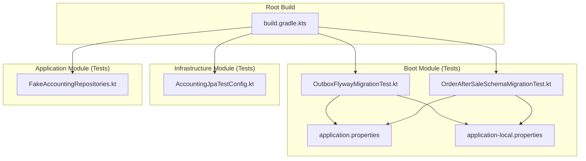
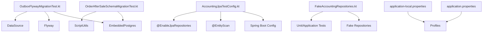
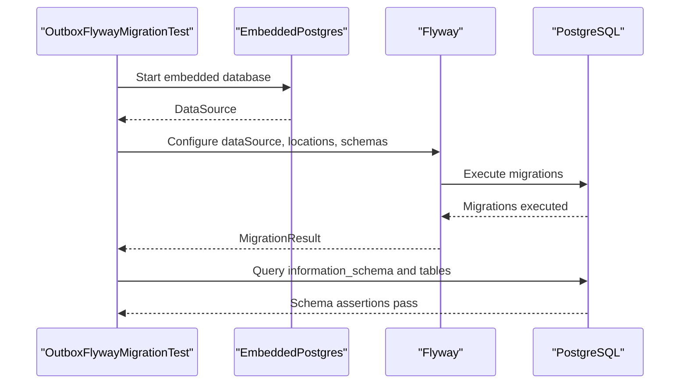
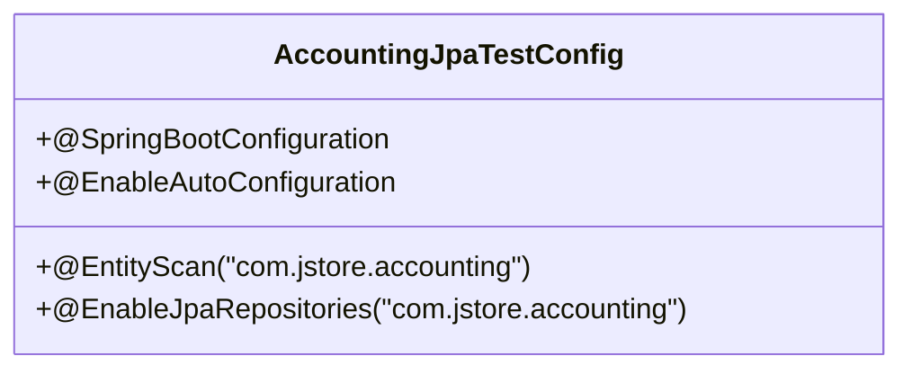
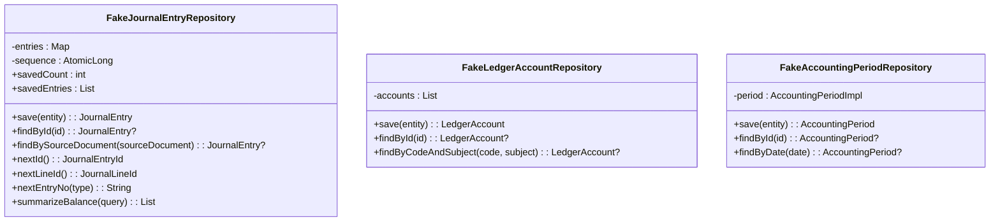
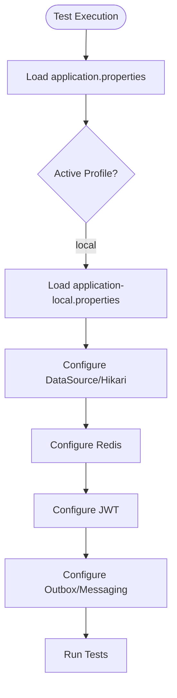
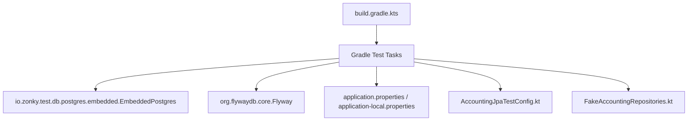

# Test Infrastructure & Utilities

<cite>
**Referenced Files in This Document**
- [build.gradle.kts](file://build.gradle.kts)
- [application.properties](file://j-store-boot/src/main/resources/application.properties)
- [application-local.properties](file://j-store-boot/src/main/resources/application-local.properties)
- [OutboxFlywayMigrationTest.kt](file://j-store-boot/src/test/kotlin/com/jstore/outbox/OutboxFlywayMigrationTest.kt)
- [OrderAfterSaleSchemaMigrationTest.kt](file://j-store-boot/src/test/kotlin/com/jstore/order/migration/OrderAfterSaleSchemaMigrationTest.kt)
- [V20260731__order_status_dimensions.sql](file://j-store-boot/src/main/resources/db/migration/V20260731__order_status_dimensions.sql)
- [V20260803__order_after_sale_aggregate.sql](file://j-store-boot/src/main/resources/db/migration/V20260803__order_after_sale_aggregate.sql)
- [AccountingJpaTestConfig.kt](file://j-store-accounting-infrastructure/src/test/kotlin/com/jstore/accounting/AccountingJpaTestConfig.kt)
- [FakeAccountingRepositories.kt](file://j-store-accounting-application/src/test/kotlin/com/jstore/accounting/service/FakeAccountingRepositories.kt)
- [docker-compose.postgres.yml](file://docker-compose.postgres.yml)
</cite>

## Table of Contents
1. Introduction
2. Project Structure
3. Core Components
4. Architecture Overview
5. Detailed Component Analysis
6. Dependency Analysis
7. Performance Considerations
8. Troubleshooting Guide
9. Conclusion

## Introduction
This document explains the test infrastructure and utilities used across the J-Store platform. It covers how tests are configured, how embedded databases and Flyway migrations are validated, how fake repositories and fixtures enable isolated unit and integration testing, and how Spring Boot applications, event-driven components, and outbox pattern implementations are tested. It also outlines strategies for microservices testing, API contracts, and cross-cutting concerns such as security and logging.

## Project Structure
The project is a multi-module Gradle build with Kotlin and Java sources. Tests are colocated under each module’s src/test directory, following standard conventions:
- Domain modules contain property-based and unit tests.
- Application modules include service-level tests and fakes/stubs for repositories.
- Infrastructure modules provide JPA configuration classes for tests and repository implementation tests.
- Boot modules host migration tests against an embedded PostgreSQL instance and controller contract tests.

**Diagram sources**
- [build.gradle.kts:1-64](file://build.gradle.kts#L1-L64)
- [OutboxFlywayMigrationTest.kt:1-116](file://j-store-boot/src/test/kotlin/com/jstore/outbox/OutboxFlywayMigrationTest.kt#L1-L116)
- [OrderAfterSaleSchemaMigrationTest.kt:1-70](file://j-store-boot/src/test/kotlin/com/jstore/order/migration/OrderAfterSaleSchemaMigrationTest.kt#L1-L70)
- [application.properties:1-11](file://j-store-boot/src/main/resources/application.properties#L1-L11)
- [application-local.properties:1-45](file://j-store-boot/src/main/resources/application-local.properties#L1-L45)
- [AccountingJpaTestConfig.kt:1-13](file://j-store-accounting-infrastructure/src/test/kotlin/com/jstore/accounting/AccountingJpaTestConfig.kt#L1-L13)
- [FakeAccountingRepositories.kt:1-143](file://j-store-accounting-application/src/test/kotlin/com/jstore/accounting/service/FakeAccountingRepositories.kt#L1-L143)

**Section sources**
- [build.gradle.kts:1-64](file://build.gradle.kts#L1-L64)

## Core Components
- Embedded database testing: Tests spin up an embedded PostgreSQL instance to validate schema migrations and constraints without external dependencies.
- Flyway migration validation: Dedicated tests execute Flyway against the embedded database to ensure all migrations run successfully and produce expected schemas.
- JPA test configuration: Minimal Spring Boot configuration enables entity scanning and JPA repositories for repository-level tests.
- Fake repositories and fixtures: In-memory implementations of repositories provide deterministic data for application-layer tests, isolating business logic from persistence.
- Environment-specific configuration: Local profiles define datasource, Redis, JWT, and messaging settings used by tests and local development.

**Section sources**
- [OutboxFlywayMigrationTest.kt:1-116](file://j-store-boot/src/test/kotlin/com/jstore/outbox/OutboxFlywayMigrationTest.kt#L1-L116)
- [OrderAfterSaleSchemaMigrationTest.kt:1-70](file://j-store-boot/src/test/kotlin/com/jstore/order/migration/OrderAfterSaleSchemaMigrationTest.kt#L1-L70)
- [AccountingJpaTestConfig.kt:1-13](file://j-store-accounting-infrastructure/src/test/kotlin/com/jstore/accounting/AccountingJpaTestConfig.kt#L1-L13)
- [FakeAccountingRepositories.kt:1-143](file://j-store-accounting-application/src/test/kotlin/com/jstore/accounting/service/FakeAccountingRepositories.kt#L1-L143)
- [application.properties:1-11](file://j-store-boot/src/main/resources/application.properties#L1-L11)
- [application-local.properties:1-45](file://j-store-boot/src/main/resources/application-local.properties#L1-L45)

## Architecture Overview
The test architecture centers on isolated execution using embedded Postgres and Spring Boot configurations. Migration tests verify schema correctness; application tests use fakes to isolate domain logic; infrastructure tests wire JPA contexts for persistence round-trips.

**Diagram sources**
- [OutboxFlywayMigrationTest.kt:1-116](file://j-store-boot/src/test/kotlin/com/jstore/outbox/OutboxFlywayMigrationTest.kt#L1-L116)
- [OrderAfterSaleSchemaMigrationTest.kt:1-70](file://j-store-boot/src/test/kotlin/com/jstore/order/migration/OrderAfterSaleSchemaMigrationTest.kt#L1-L70)
- [AccountingJpaTestConfig.kt:1-13](file://j-store-accounting-infrastructure/src/test/kotlin/com/jstore/accounting/AccountingJpaTestConfig.kt#L1-L13)
- [FakeAccountingRepositories.kt:1-143](file://j-store-accounting-application/src/test/kotlin/com/jstore/accounting/service/FakeAccountingRepositories.kt#L1-L143)
- [application.properties:1-11](file://j-store-boot/src/main/resources/application.properties#L1-L11)
- [application-local.properties:1-45](file://j-store-boot/src/main/resources/application-local.properties#L1-L45)

## Detailed Component Analysis

### Embedded Database and Flyway Migration Testing
- OutboxFlywayMigrationTest validates that full production migrations create fencing and audit schema elements, including default values and column presence checks. It also verifies backward compatibility by running targeted migrations and asserting existing states are preserved.
- OrderAfterSaleSchemaMigrationTest executes a sequence of SQL scripts via ScriptUtils against an embedded Postgres connection, then asserts table and column existence to confirm schema evolution.

**Diagram sources**
- [OutboxFlywayMigrationTest.kt:1-116](file://j-store-boot/src/test/kotlin/com/jstore/outbox/OutboxFlywayMigrationTest.kt#L1-L116)

**Section sources**
- [OutboxFlywayMigrationTest.kt:1-116](file://j-store-boot/src/test/kotlin/com/jstore/outbox/OutboxFlywayMigrationTest.kt#L1-L116)
- [OrderAfterSaleSchemaMigrationTest.kt:1-70](file://j-store-boot/src/test/kotlin/com/jstore/order/migration/OrderAfterSaleSchemaMigrationTest.kt#L1-L70)
- [V20260731__order_status_dimensions.sql:1-33](file://j-store-boot/src/main/resources/db/migration/V20260731__order_status_dimensions.sql#L1-L33)
- [V20260803__order_after_sale_aggregate.sql:1-21](file://j-store-boot/src/main/resources/db/migration/V20260803__order_after_sale_aggregate.sql#L1-L21)

### JPA Test Configuration
- AccountingJpaTestConfig provides a minimal Spring Boot configuration enabling auto-configuration, entity scanning, and JPA repository discovery for accounting-related tests. This allows repository implementation tests to run with real JPA behavior while remaining isolated from application wiring.

**Diagram sources**
- [AccountingJpaTestConfig.kt:1-13](file://j-store-accounting-infrastructure/src/test/kotlin/com/jstore/accounting/AccountingJpaTestConfig.kt#L1-L13)

**Section sources**
- [AccountingJpaTestConfig.kt:1-13](file://j-store-accounting-infrastructure/src/test/kotlin/com/jstore/accounting/AccountingJpaTestConfig.kt#L1-L13)

### Fake Repositories and Test Fixtures
- FakeAccountingRepositories implements in-memory versions of JournalEntryRepository, LedgerAccountRepository, and AccountingPeriodRepository. These fakes expose counters and snapshots to assert behavior deterministically, enabling isolation of application services from persistence.

**Diagram sources**
- [FakeAccountingRepositories.kt:1-143](file://j-store-accounting-application/src/test/kotlin/com/jstore/accounting/service/FakeAccountingRepositories.kt#L1-L143)

**Section sources**
- [FakeAccountingRepositories.kt:1-143](file://j-store-accounting-application/src/test/kotlin/com/jstore/accounting/service/FakeAccountingRepositories.kt#L1-L143)

### Test Profiles and Environment-Specific Configuration
- application.properties sets the application name, graceful shutdown, active profile, and Flyway defaults.
- application-local.properties defines datasource URL, Hikari pool settings, Redis connectivity, JWT secret, logging level, and outbox/messaging mode. These properties are consumed by both runtime and tests when the local profile is active.

**Diagram sources**
- [application.properties:1-11](file://j-store-boot/src/main/resources/application.properties#L1-L11)
- [application-local.properties:1-45](file://j-store-boot/src/main/resources/application-local.properties#L1-L45)

**Section sources**
- [application.properties:1-11](file://j-store-boot/src/main/resources/application.properties#L1-L11)
- [application-local.properties:1-45](file://j-store-boot/src/main/resources/application-local.properties#L1-L45)

### Docker Compose for Test Containers
- docker-compose.postgres.yml provides a containerized PostgreSQL service for integration tests and local development. While tests in this codebase primarily use an embedded Postgres, the compose file supports externalizing the database when needed.

[No sources needed since this section references a configuration file without analyzing specific code lines]

## Dependency Analysis
The test setup depends on:
- Gradle root build configuration for toolchain and formatting.
- Spring Boot properties for environment configuration.
- Embedded Postgres and Flyway libraries invoked by tests.
- JPA annotations and repository interfaces wired through test configuration.

**Diagram sources**
- [build.gradle.kts:1-64](file://build.gradle.kts#L1-L64)
- [OutboxFlywayMigrationTest.kt:1-116](file://j-store-boot/src/test/kotlin/com/jstore/outbox/OutboxFlywayMigrationTest.kt#L1-L116)
- [OrderAfterSaleSchemaMigrationTest.kt:1-70](file://j-store-boot/src/test/kotlin/com/jstore/order/migration/OrderAfterSaleSchemaMigrationTest.kt#L1-L70)
- [application.properties:1-11](file://j-store-boot/src/main/resources/application.properties#L1-L11)
- [application-local.properties:1-45](file://j-store-boot/src/main/resources/application-local.properties#L1-L45)
- [AccountingJpaTestConfig.kt:1-13](file://j-store-accounting-infrastructure/src/test/kotlin/com/jstore/accounting/AccountingJpaTestConfig.kt#L1-L13)
- [FakeAccountingRepositories.kt:1-143](file://j-store-accounting-application/src/test/kotlin/com/jstore/accounting/service/FakeAccountingRepositories.kt#L1-L143)

**Section sources**
- [build.gradle.kts:1-64](file://build.gradle.kts#L1-L64)

## Performance Considerations
- Prefer embedded databases for fast, isolated tests; avoid external containers unless necessary.
- Keep migration tests focused on schema changes; avoid heavy data population.
- Use fakes to eliminate I/O overhead in unit and application tests.
- Limit test parallelism if shared state or resource contention exists; the review logs indicate running with single worker for stability.

[No sources needed since this section provides general guidance]

## Troubleshooting Guide
Common issues and resolutions:
- Migration failures: Ensure Flyway baseline and target versions align with the embedded database state. Validate schema names and default values.
- Missing columns or tables: Confirm migration scripts are executed in order and referenced by tests.
- JPA context not found: Verify @EntityScan and @EnableJpaRepositories point to correct packages in test configuration.
- Property misconfiguration: Check active profiles and environment variables for datasource, Redis, and JWT settings.

**Section sources**
- [OutboxFlywayMigrationTest.kt:1-116](file://j-store-boot/src/test/kotlin/com/jstore/outbox/OutboxFlywayMigrationTest.kt#L1-L116)
- [OrderAfterSaleSchemaMigrationTest.kt:1-70](file://j-store-boot/src/test/kotlin/com/jstore/order/migration/OrderAfterSaleSchemaMigrationTest.kt#L1-L70)
- [AccountingJpaTestConfig.kt:1-13](file://j-store-accounting-infrastructure/src/test/kotlin/com/jstore/accounting/AccountingJpaTestConfig.kt#L1-L13)
- [application.properties:1-11](file://j-store-boot/src/main/resources/application.properties#L1-L11)
- [application-local.properties:1-45](file://j-store-boot/src/main/resources/application-local.properties#L1-L45)

## Conclusion
The J-Store test infrastructure leverages embedded databases, Flyway migration validation, minimal Spring Boot configurations, and in-memory fakes to deliver fast, reliable, and isolated tests. This approach supports robust testing of Spring Boot applications, event-driven components, and outbox patterns, while providing clear strategies for microservices, API contracts, and cross-cutting concerns.