# Testing Strategy & Implementation

<cite>
**Referenced Files in This Document**
- [build.gradle.kts](file://build.gradle.kts)
- [libs.versions.toml](file://gradle/libs.versions.toml)
- [AccountingApplicationServiceTest.kt](file://j-store-accounting-application/src/test/kotlin/com/jstore/accounting/service/AccountingApplicationServiceTest.kt)
- [AccountingEventHandlerTest.kt](file://j-store-accounting-application/src/test/kotlin/com/jstore/accounting/service/AccountingEventHandlerTest.kt)
- [FakeAccountingRepositories.kt](file://j-store-accounting-application/src/test/kotlin/com/jstore/accounting/service/FakeAccountingRepositories.kt)
- [LedgerAccountUnitTest.kt](file://j-store-accounting-domain/src/test/kotlin/com/jstore/accounting/domain/account/LedgerAccountUnitTest.kt)
- [AccountingPeriodUnitTest.kt](file://j-store-accounting-domain/src/test/kotlin/com/jstore/accounting/domain/journal/AccountingPeriodUnitTest.kt)
- [JournalEntryUnitTest.kt](file://j-store-accounting-domain/src/test/kotlin/com/jstore/accounting/domain/journal/JournalEntryUnitTest.kt)
- [SettlementStatementUnitTest.kt](file://j-store-accounting-domain/src/test/kotlin/com/jstore/accounting/domain/settlement/SettlementStatementUnitTest.kt)
- [JournalEntryRepositoryImplTest.kt](file://j-store-accounting-infrastructure/src/test/kotlin/com/jstore/accounting/domain/journal/JournalEntryRepositoryImplTest.kt)
- [SettlementStatementRepositoryImplTest.kt](file://j-store-accounting-infrastructure/src/test/kotlin/com/jstore/accounting/domain/settlement/SettlementStatementRepositoryImplTest.kt)
- [AccountingJpaTestConfig.kt](file://j-store-accounting-infrastructure/src/test/kotlin/com/jstore/accounting/AccountingJpaTestConfig.kt)
- [AuthenticatedUserContextPropertyTest.kt](file://j-store-authentication-spring-sdk/src/test/kotlin/com/jstore/authentication/context/AuthenticatedUserContextPropertyTest.kt)
- [AuthenticationDecisionPropertyTest.kt](file://j-store-authentication-spring-sdk/src/test/kotlin/com/jstore/authentication/spring/AuthenticationDecisionPropertyTest.kt)
- [BearerTokenExtractionPropertyTest.kt](file://j-store-authentication-spring-sdk/src/test/kotlin/com/jstore/authentication/spring/BearerTokenExtractionPropertyTest.kt)
- [TokenValidationErrorPropertyTest.kt](file://j-store-authentication-spring-sdk/src/test/kotlin/com/jstore/authentication/spring/TokenValidationErrorPropertyTest.kt)
- [OutboxEventPublisherPropertyTest.kt](file://j-store-common-spring/src/test/kotlin/com/jstore/common/framework/event/outbox/OutboxEventPublisherPropertyTest.kt)
- [OrderTestFixtures.kt](file://j-store-order-domain/src/testFixtures/kotlin/com/jstore/order/domain/order/OrderTestFixtures.kt)
- [AfterSalePostgresConcurrencyTest.kt](file://j-store-order-infrastructure/src/test/kotlin/com/jstore/order/integration/AfterSalePostgresConcurrencyTest.kt)
- [OrderAfterSaleSchemaMigrationTest.kt](file://j-store-boot/src/test/kotlin/com/jstore/order/migration/OrderAfterSaleSchemaMigrationTest.kt)
- [OutboxFlywayMigrationTest.kt](file://j-store-boot/src/test/kotlin/com/jstore/outbox/OutboxFlywayMigrationTest.kt)
- [OutboxOperationsControllerTest.kt](file://j-store-boot/src/test/kotlin/com/jstore/outbox/operations/OutboxOperationsControllerTest.kt)
</cite>

## Table of Contents
1. Introduction
2. Project Structure
3. Core Components
4. Architecture Overview
5. Detailed Component Analysis
6. Dependency Analysis
7. Performance Considerations
8. Troubleshooting Guide
9. Conclusion

## Introduction
This document explains the testing strategy and implementation for the J-Store platform using a testing pyramid approach: unit tests, integration tests, and property-based tests with Kotest. It covers strategies for domain models, application services, and infrastructure components, including test fixtures, fake repositories, and mock services to achieve isolated and reliable tests. Concrete examples include order lifecycle, commodity workflows, user authentication flows, event-driven components, outbox pattern, and asynchronous processing. Integration testing leverages embedded PostgreSQL via zt-database and Testcontainers-like patterns. The document also outlines performance testing, load testing, and chaos engineering approaches, along with test governance and quality gates.

## Project Structure
The repository is organized by modules (accounting, goods, order, payment, user, fulfillment, common, authentication SDK, boot). Each module contains:
- src/main: production code
- src/test: unit and integration tests
- src/testFixtures: shared test data builders and fixtures

Key testing-related build configuration:
- Kotlin JVM and Spring plugins are applied at the root level.
- Version catalog centralizes dependencies including Kotest, Mockito, JUnit 5, Spring Boot Test, Redisson, and PostgreSQL driver.

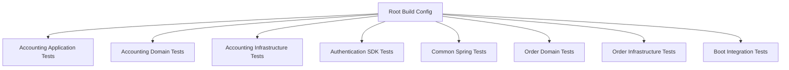

**Diagram sources**
- [build.gradle.kts:1-64](file://build.gradle.kts#L1-L64)
- [libs.versions.toml:1-111](file://gradle/libs.versions.toml#L1-L111)

**Section sources**
- [build.gradle.kts:1-64](file://build.gradle.kts#L1-L64)
- [libs.versions.toml:1-111](file://gradle/libs.versions.toml#L1-L111)

## Core Components
- Unit tests validate pure domain logic and small units without external dependencies.
- Integration tests verify persistence, transactions, concurrency, and cross-component interactions.
- Property-based tests use Kotest to assert invariants across randomized inputs.
- Test fixtures provide deterministic builders for complex aggregates.
- Fake repositories isolate application services from infrastructure.
- Mock services simulate external integrations and events.

Examples:
- Domain unit tests for accounting entities and journals.
- Application service tests using fake repositories.
- Property tests for authentication context isolation and outbox serialization.
- Concurrency tests against embedded PostgreSQL for after-sale capacity locking.

**Section sources**
- [LedgerAccountUnitTest.kt](file://j-store-accounting-domain/src/test/kotlin/com/jstore/accounting/domain/account/LedgerAccountUnitTest.kt)
- [AccountingPeriodUnitTest.kt](file://j-store-accounting-domain/src/test/kotlin/com/jstore/accounting/domain/journal/AccountingPeriodUnitTest.kt)
- [JournalEntryUnitTest.kt](file://j-store-accounting-domain/src/test/kotlin/com/jstore/accounting/domain/journal/JournalEntryUnitTest.kt)
- [SettlementStatementUnitTest.kt](file://j-store-accounting-domain/src/test/kotlin/com/jstore/accounting/domain/settlement/SettlementStatementUnitTest.kt)
- [AccountingApplicationServiceTest.kt](file://j-store-accounting-application/src/test/kotlin/com/jstore/accounting/service/AccountingApplicationServiceTest.kt)
- [AccountingEventHandlerTest.kt](file://j-store-accounting-application/src/test/kotlin/com/jstore/accounting/service/AccountingEventHandlerTest.kt)
- [FakeAccountingRepositories.kt](file://j-store-accounting-application/src/test/kotlin/com/jstore/accounting/service/FakeAccountingRepositories.kt)
- [AuthenticatedUserContextPropertyTest.kt](file://j-store-authentication-spring-sdk/src/test/kotlin/com/jstore/authentication/context/AuthenticatedUserContextPropertyTest.kt)
- [OutboxEventPublisherPropertyTest.kt](file://j-store-common-spring/src/test/kotlin/com/jstore/common/framework/event/outbox/OutboxEventPublisherPropertyTest.kt)
- [OrderTestFixtures.kt](file://j-store-order-domain/src/testFixtures/kotlin/com/jstore/order/domain/order/OrderTestFixtures.kt)
- [AfterSalePostgresConcurrencyTest.kt](file://j-store-order-infrastructure/src/test/kotlin/com/jstore/order/integration/AfterSalePostgresConcurrencyTest.kt)

## Architecture Overview
The testing architecture aligns with DDD and modular design:
- Domain layer tests ensure business rules and invariants.
- Application layer tests orchestrate use cases with fakes/mocks.
- Infrastructure layer tests validate persistence and transactional behavior.
- Boot-level tests cover migrations, controllers, and end-to-end scenarios.

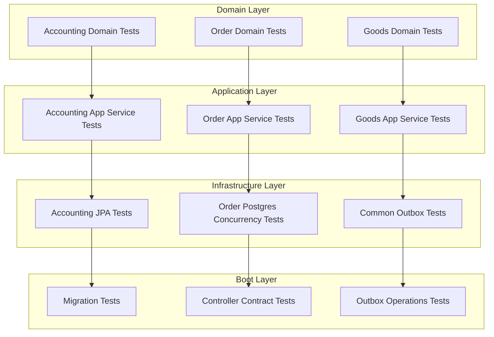

[No sources needed since this diagram shows conceptual workflow, not actual code structure]

## Detailed Component Analysis

### Accounting Domain Unit Tests
Focus on ledger accounts, journal entries, periods, and settlement statements. These tests assert state transitions, balance calculations, and period constraints.

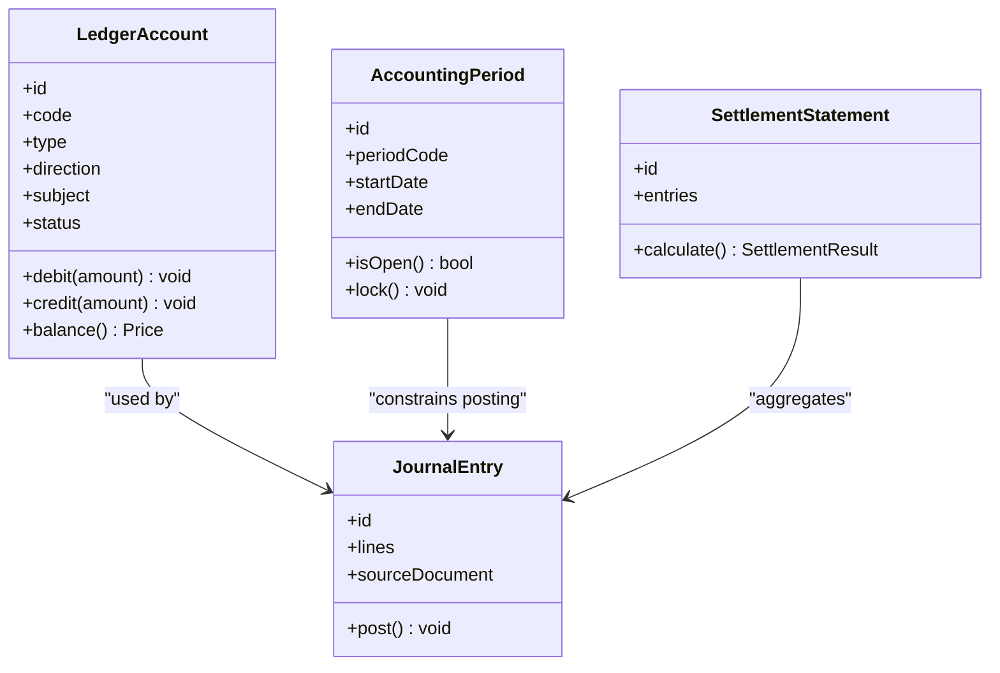

**Diagram sources**
- [LedgerAccountUnitTest.kt](file://j-store-accounting-domain/src/test/kotlin/com/jstore/accounting/domain/account/LedgerAccountUnitTest.kt)
- [JournalEntryUnitTest.kt](file://j-store-accounting-domain/src/test/kotlin/com/jstore/accounting/domain/journal/JournalEntryUnitTest.kt)
- [AccountingPeriodUnitTest.kt](file://j-store-accounting-domain/src/test/kotlin/com/jstore/accounting/domain/journal/AccountingPeriodUnitTest.kt)
- [SettlementStatementUnitTest.kt](file://j-store-accounting-domain/src/test/kotlin/com/jstore/accounting/domain/settlement/SettlementStatementUnitTest.kt)

**Section sources**
- [LedgerAccountUnitTest.kt](file://j-store-accounting-domain/src/test/kotlin/com/jstore/accounting/domain/account/LedgerAccountUnitTest.kt)
- [JournalEntryUnitTest.kt](file://j-store-accounting-domain/src/test/kotlin/com/jstore/accounting/domain/journal/JournalEntryUnitTest.kt)
- [AccountingPeriodUnitTest.kt](file://j-store-accounting-domain/src/test/kotlin/com/jstore/accounting/domain/journal/AccountingPeriodUnitTest.kt)
- [SettlementStatementUnitTest.kt](file://j-store-accounting-domain/src/test/kotlin/com/jstore/accounting/domain/settlement/SettlementStatementUnitTest.kt)

### Accounting Application Service Tests with Fakes
Application services are tested with fake repositories to isolate orchestration logic and event handling.

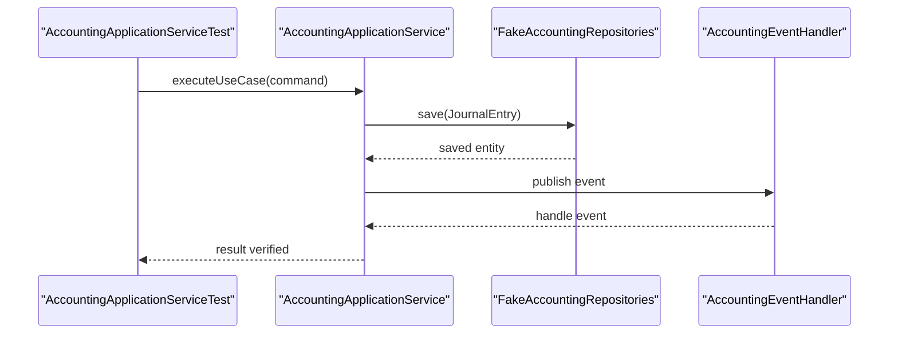

**Diagram sources**
- [AccountingApplicationServiceTest.kt](file://j-store-accounting-application/src/test/kotlin/com/jstore/accounting/service/AccountingApplicationServiceTest.kt)
- [AccountingEventHandlerTest.kt](file://j-store-accounting-application/src/test/kotlin/com/jstore/accounting/service/AccountingEventHandlerTest.kt)
- [FakeAccountingRepositories.kt](file://j-store-accounting-application/src/test/kotlin/com/jstore/accounting/service/FakeAccountingRepositories.kt)

**Section sources**
- [AccountingApplicationServiceTest.kt](file://j-store-accounting-application/src/test/kotlin/com/jstore/accounting/service/AccountingApplicationServiceTest.kt)
- [AccountingEventHandlerTest.kt](file://j-store-accounting-application/src/test/kotlin/com/jstore/accounting/service/AccountingEventHandlerTest.kt)
- [FakeAccountingRepositories.kt](file://j-store-accounting-application/src/test/kotlin/com/jstore/accounting/service/FakeAccountingRepositories.kt)

### Authentication Context Property Tests
Kotest property tests validate thread isolation and round-trip behavior of authenticated user context.

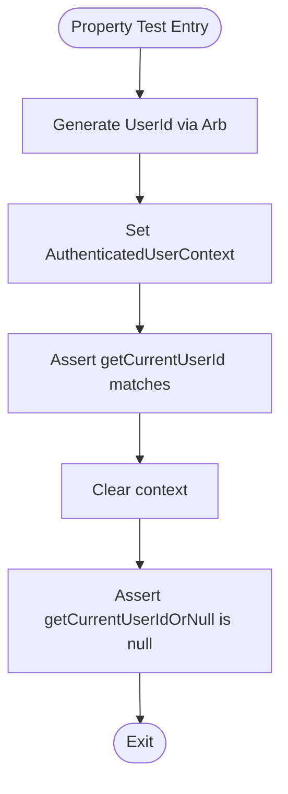

**Diagram sources**
- [AuthenticatedUserContextPropertyTest.kt](file://j-store-authentication-spring-sdk/src/test/kotlin/com/jstore/authentication/context/AuthenticatedUserContextPropertyTest.kt)

**Section sources**
- [AuthenticatedUserContextPropertyTest.kt](file://j-store-authentication-spring-sdk/src/test/kotlin/com/jstore/authentication/context/AuthenticatedUserContextPropertyTest.kt)
- [AuthenticationDecisionPropertyTest.kt](file://j-store-authentication-spring-sdk/src/test/kotlin/com/jstore/authentication/spring/AuthenticationDecisionPropertyTest.kt)
- [BearerTokenExtractionPropertyTest.kt](file://j-store-authentication-spring-sdk/src/test/kotlin/com/jstore/authentication/spring/BearerTokenExtractionPropertyTest.kt)
- [TokenValidationErrorPropertyTest.kt](file://j-store-authentication-spring-sdk/src/test/kotlin/com/jstore/authentication/spring/TokenValidationErrorPropertyTest.kt)

### Outbox Event Publisher Property Tests
Property tests assert that events are persisted with PENDING status and stable envelope fields.

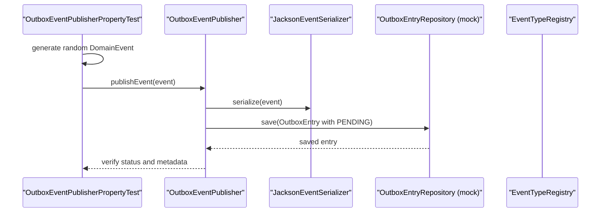

**Diagram sources**
- [OutboxEventPublisherPropertyTest.kt](file://j-store-common-spring/src/test/kotlin/com/jstore/common/framework/event/outbox/OutboxEventPublisherPropertyTest.kt)

**Section sources**
- [OutboxEventPublisherPropertyTest.kt](file://j-store-common-spring/src/test/kotlin/com/jstore/common/framework/event/outbox/OutboxEventPublisherPropertyTest.kt)

### Order Test Fixtures
Shared fixtures construct valid orders with consistent item lists, addresses, and amounts for deterministic tests.

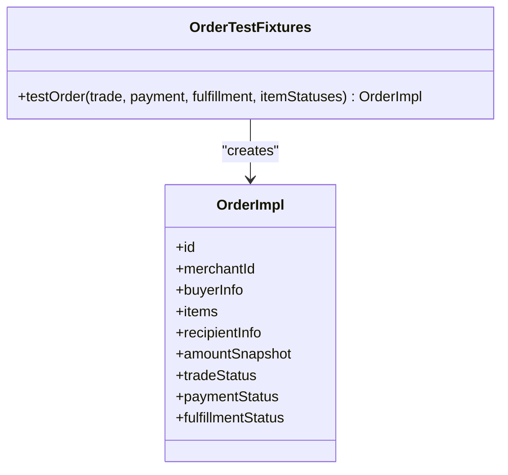

**Diagram sources**
- [OrderTestFixtures.kt](file://j-store-order-domain/src/testFixtures/kotlin/com/jstore/order/domain/order/OrderTestFixtures.kt)

**Section sources**
- [OrderTestFixtures.kt](file://j-store-order-domain/src/testFixtures/kotlin/com/jstore/order/domain/order/OrderTestFixtures.kt)

### After-Sale Concurrency Integration Tests
Embedded PostgreSQL validates capacity locking, deadlock avoidance, optimistic versioning, idempotency keys, and rollback semantics.

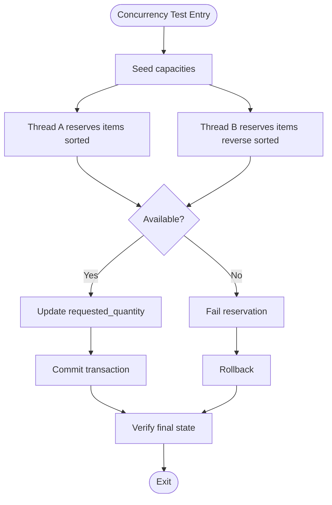

**Diagram sources**
- [AfterSalePostgresConcurrencyTest.kt](file://j-store-order-infrastructure/src/test/kotlin/com/jstore/order/integration/AfterSalePostgresConcurrencyTest.kt)

**Section sources**
- [AfterSalePostgresConcurrencyTest.kt](file://j-store-order-infrastructure/src/test/kotlin/com/jstore/order/integration/AfterSalePostgresConcurrencyTest.kt)

### Infrastructure Repository Tests
JPA repository implementations are validated with Spring Boot test configuration scanning entities and repositories.

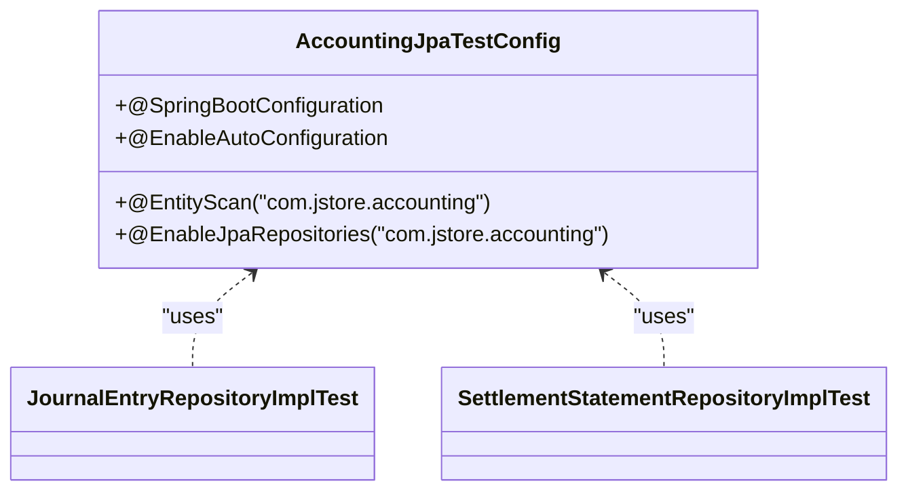

**Diagram sources**
- [AccountingJpaTestConfig.kt](file://j-store-accounting-infrastructure/src/test/kotlin/com/jstore/accounting/AccountingJpaTestConfig.kt)
- [JournalEntryRepositoryImplTest.kt](file://j-store-accounting-infrastructure/src/test/kotlin/com/jstore/accounting/domain/journal/JournalEntryRepositoryImplTest.kt)
- [SettlementStatementRepositoryImplTest.kt](file://j-store-accounting-infrastructure/src/test/kotlin/com/jstore/accounting/domain/settlement/SettlementStatementRepositoryImplTest.kt)

**Section sources**
- [AccountingJpaTestConfig.kt](file://j-store-accounting-infrastructure/src/test/kotlin/com/jstore/accounting/AccountingJpaTestConfig.kt)
- [JournalEntryRepositoryImplTest.kt](file://j-store-accounting-infrastructure/src/test/kotlin/com/jstore/accounting/domain/journal/JournalEntryRepositoryImplTest.kt)
- [SettlementStatementRepositoryImplTest.kt](file://j-store-accounting-infrastructure/src/test/kotlin/com/jstore/accounting/domain/settlement/SettlementStatementRepositoryImplTest.kt)

### Boot Integration Tests
Migration and controller contract tests ensure schema correctness and API stability.

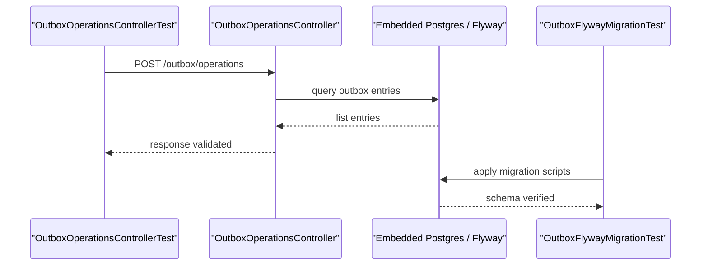

**Diagram sources**
- [OutboxOperationsControllerTest.kt](file://j-store-boot/src/test/kotlin/com/jstore/outbox/operations/OutboxOperationsControllerTest.kt)
- [OutboxFlywayMigrationTest.kt](file://j-store-boot/src/test/kotlin/com/jstore/outbox/OutboxFlywayMigrationTest.kt)
- [OrderAfterSaleSchemaMigrationTest.kt](file://j-store-boot/src/test/kotlin/com/jstore/order/migration/OrderAfterSaleSchemaMigrationTest.kt)

**Section sources**
- [OutboxOperationsControllerTest.kt](file://j-store-boot/src/test/kotlin/com/jstore/outbox/operations/OutboxOperationsControllerTest.kt)
- [OutboxFlywayMigrationTest.kt](file://j-store-boot/src/test/kotlin/com/jstore/outbox/OutboxFlywayMigrationTest.kt)
- [OrderAfterSaleSchemaMigrationTest.kt](file://j-store-boot/src/test/kotlin/com/jstore/order/migration/OrderAfterSaleSchemaMigrationTest.kt)

## Dependency Analysis
Testing dependencies are centralized in the version catalog:
- Kotest runner, assertions, and property libraries.
- Mockito and Mockito-Kotlin for mocking.
- Spring Boot Test starter for integration tests.
- PostgreSQL driver for embedded database usage.
- Redisson for Redis integration where applicable.

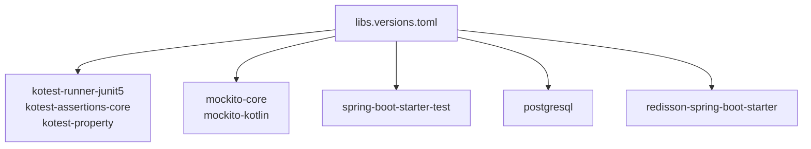

**Diagram sources**
- [libs.versions.toml:1-111](file://gradle/libs.versions.toml#L1-L111)

**Section sources**
- [libs.versions.toml:1-111](file://gradle/libs.versions.toml#L1-L111)

## Performance Considerations
- Use embedded databases for fast, deterministic integration tests; avoid heavy setup in unit tests.
- Limit test iterations in property-based tests to reasonable bounds to keep CI times low.
- Parallelize independent tests but be cautious with shared resources like embedded databases.
- Profile critical paths with dedicated benchmarks outside the main test suite.
- For load testing, consider external tools (e.g., k6, Gatling) targeting API endpoints exposed by boot modules.
- Chaos engineering can be introduced via fault injection in integration tests (network failures, timeouts) to validate resilience.

[No sources needed since this section provides general guidance]

## Troubleshooting Guide
- Ensure test configurations scan correct packages for entities and repositories.
- Validate Flyway migrations run in order and match expected schema changes.
- When using embedded Postgres, confirm connection parameters and schema initialization.
- For property tests, adjust iteration counts and generators if flakiness occurs.
- For async or event-driven tests, verify event publication and consumption sequencing.

**Section sources**
- [AccountingJpaTestConfig.kt](file://j-store-accounting-infrastructure/src/test/kotlin/com/jstore/accounting/AccountingJpaTestConfig.kt)
- [OutboxFlywayMigrationTest.kt](file://j-store-boot/src/test/kotlin/com/jstore/outbox/OutboxFlywayMigrationTest.kt)
- [AfterSalePostgresConcurrencyTest.kt](file://j-store-order-infrastructure/src/test/kotlin/com/jstore/order/integration/AfterSalePostgresConcurrencyTest.kt)

## Conclusion
The J-Store platform employs a robust testing strategy combining unit, integration, and property-based tests. Domain logic is thoroughly validated, application services are isolated with fakes and mocks, and infrastructure behaviors are verified against embedded databases. Property-based testing ensures invariants under randomized inputs, while concurrency and transactional integrity are explicitly covered. The approach scales across modules and supports continuous integration with clear quality gates.

[No sources needed since this section summarizes without analyzing specific files]