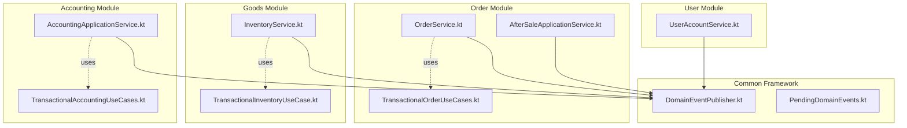
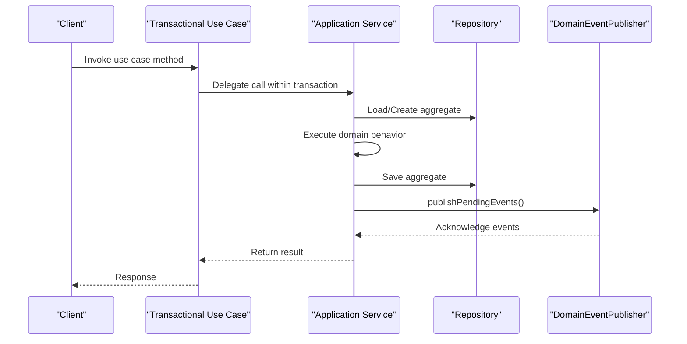
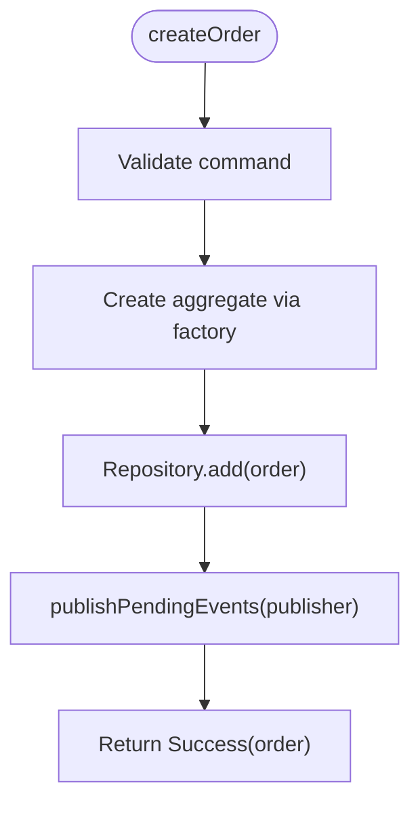
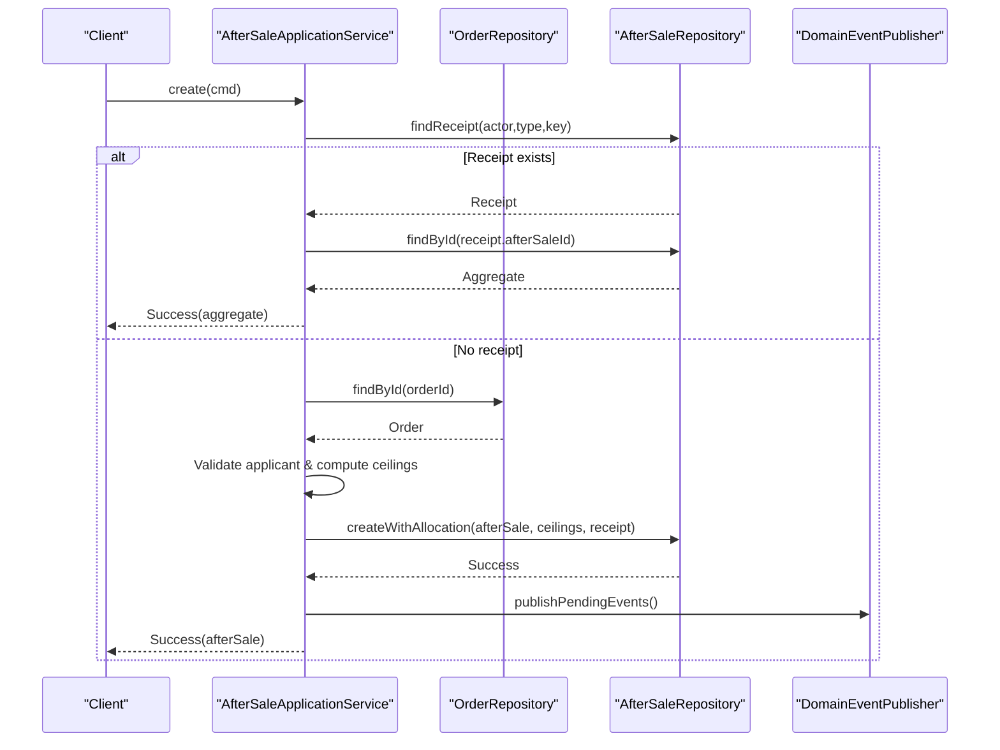
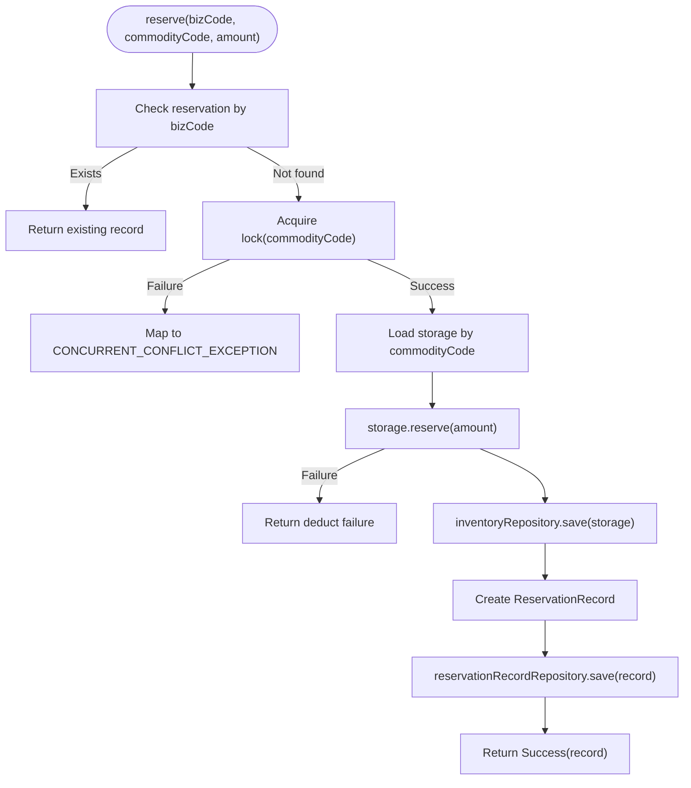
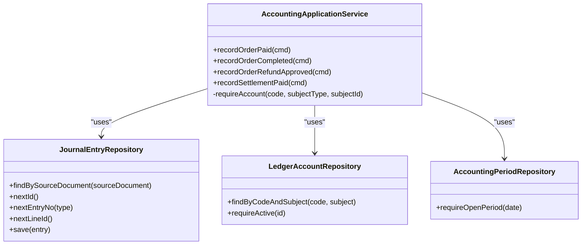
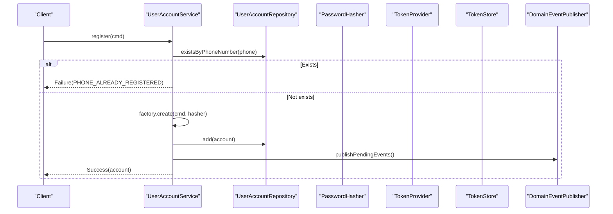
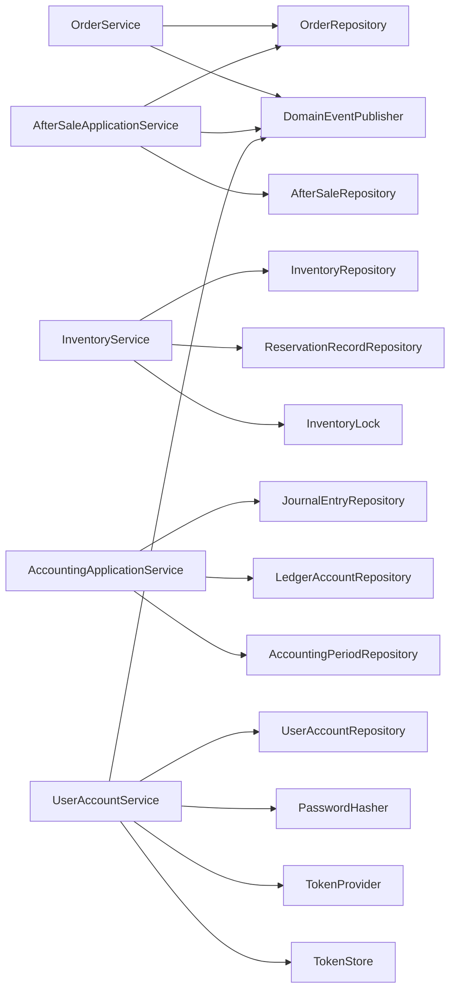

# Application Service Testing

<cite>
**Referenced Files in This Document**
- [OrderService.kt](file://j-store-order-application/src/main/kotlin/com/jstore/order/service/OrderService.kt)
- [AfterSaleApplicationService.kt](file://j-store-order-application/src/main/kotlin/com/jstore/order/service/AfterSaleApplicationService.kt)
- [TransactionalOrderUseCases.kt](file://j-store-order-boot/src/main/kotlin/com/jstore/order/config/TransactionalOrderUseCases.kt)
- [InventoryService.kt](file://j-store-goods-application/src/main/kotlin/com/jstore/goods/service/InventoryService.kt)
- [TransactionalInventoryUseCase.kt](file://j-store-goods-boot/src/main/kotlin/com/jstore/goods/config/TransactionalInventoryUseCase.kt)
- [AccountingApplicationService.kt](file://j-store-accounting-application/src/main/kotlin/com/jstore/accounting/service/AccountingApplicationService.kt)
- [TransactionalAccountingUseCases.kt](file://j-store-accounting-boot/src/main/kotlin/com/jstore/accounting/config/TransactionalAccountingUseCases.kt)
- [UserAccountService.kt](file://j-store-user-application/src/main/kotlin/com/jstore/user/service/UserAccountService.kt)
- [DomainEventPublisher.kt](file://j-store-common-core/src/main/kotlin/com/jstore/common/framework/event/DomainEventPublisher.kt)
- [PendingDomainEvents.kt](file://j-store-common-core/src/main/kotlin/com/jstore/common/framework/event/PendingDomainEvents.kt)
- [AfterSaleApplicationServiceTest.kt](file://j-store-order-application/src/test/kotlin/com/jstore/order/service/AfterSaleApplicationServiceTest.kt)
- [CommodityServiceDraftFlowTest.kt](file://j-store-goods-application/src/test/kotlin/com/jstore/goods/service/CommodityServiceDraftFlowTest.kt)
- [AccountingApplicationServiceTest.kt](file://j-store-accounting-application/src/test/kotlin/com/jstore/accounting/service/AccountingApplicationServiceTest.kt)
- [UserAccountServiceTest.kt](file://j-store-user-application/src/test/kotlin/com/jstore/user/UserAccountServiceTest.kt)
</cite>

## Table of Contents
1. [Introduction](#introduction)
2. [Project Structure](#project-structure)
3. [Core Components](#core-components)
4. [Architecture Overview](#architecture-overview)
5. [Detailed Component Analysis](#detailed-component-analysis)
6. [Dependency Analysis](#dependency-analysis)
7. [Performance Considerations](#performance-considerations)
8. [Troubleshooting Guide](#troubleshooting-guide)
9. [Conclusion](#conclusion)

## Introduction
This document explains how to test application services in the J-Store platform with a focus on use cases, command handlers, and application-level business logic. It covers testing strategies for service orchestration, event handling, cross-aggregate operations, and transaction boundaries. Practical examples include order creation flows, after-sale processing, user registration, and inventory management. The guide also details mocking strategies for repositories, external services, and domain events, as well as approaches to validate error handling and integration points between services.

## Project Structure
J-Store is organized by bounded contexts (modules), each split into domain, application, infrastructure, and boot layers:
- Domain layer contains aggregates, factories, and repository interfaces.
- Application layer implements use cases that orchestrate domain behavior, persist state via repositories, and publish domain events.
- Boot layer provides Spring configuration and transactional wrappers around application services.
- Tests are colocated under src/test per module and demonstrate unit and property-based testing patterns.

**Diagram sources**
- [OrderService.kt](file://j-store-order-application/src/main/kotlin/com/jstore/order/service/OrderService.kt)
- [AfterSaleApplicationService.kt](file://j-store-order-application/src/main/kotlin/com/jstore/order/service/AfterSaleApplicationService.kt)
- [TransactionalOrderUseCases.kt](file://j-store-order-boot/src/main/kotlin/com/jstore/order/config/TransactionalOrderUseCases.kt)
- [InventoryService.kt](file://j-store-goods-application/src/main/kotlin/com/jstore/goods/service/InventoryService.kt)
- [TransactionalInventoryUseCase.kt](file://j-store-goods-boot/src/main/kotlin/com/jstore/goods/config/TransactionalInventoryUseCase.kt)
- [AccountingApplicationService.kt](file://j-store-accounting-application/src/main/kotlin/com/jstore/accounting/service/AccountingApplicationService.kt)
- [TransactionalAccountingUseCases.kt](file://j-store-accounting-boot/src/main/kotlin/com/jstore/accounting/config/TransactionalAccountingUseCases.kt)
- [UserAccountService.kt](file://j-store-user-application/src/main/kotlin/com/jstore/user/service/UserAccountService.kt)
- [DomainEventPublisher.kt](file://j-store-common-core/src/main/kotlin/com/jstore/common/framework/event/DomainEventPublisher.kt)
- [PendingDomainEvents.kt](file://j-store-common-core/src/main/kotlin/com/jstore/common/framework/event/PendingDomainEvents.kt)

**Section sources**
- [OrderService.kt](file://j-store-order-application/src/main/kotlin/com/jstore/order/service/OrderService.kt)
- [AfterSaleApplicationService.kt](file://j-store-order-application/src/main/kotlin/com/jstore/order/service/AfterSaleApplicationService.kt)
- [InventoryService.kt](file://j-store-goods-application/src/main/kotlin/com/jstore/goods/service/InventoryService.kt)
- [AccountingApplicationService.kt](file://j-store-accounting-application/src/main/kotlin/com/jstore/accounting/service/AccountingApplicationService.kt)
- [UserAccountService.kt](file://j-store-user-application/src/main/kotlin/com/jstore/user/service/UserAccountService.kt)

## Core Components
The application services implement use case interfaces and coordinate domain objects through repositories and event publishers. Key responsibilities:
- Load or create aggregates via factories.
- Execute domain behavior on aggregates.
- Persist changes using repositories.
- Publish pending domain events atomically within the same transaction boundary.

Examples:
- OrderService orchestrates order lifecycle operations and publishes pending events after persistence.
- AfterSaleApplicationService handles idempotent commands, allocation ceilings, and cross-aggregate reads/writes.
- InventoryService manages reservation lifecycles with locking and dual writes to inventory and reservation records.
- AccountingApplicationService creates journal entries with strict accounting rules and idempotency checks.
- UserAccountService performs authentication flows, token issuance, and event-driven side effects.

**Section sources**
- [OrderService.kt](file://j-store-order-application/src/main/kotlin/com/jstore/order/service/OrderService.kt)
- [AfterSaleApplicationService.kt](file://j-store-order-application/src/main/kotlin/com/jstore/order/service/AfterSaleApplicationService.kt)
- [InventoryService.kt](file://j-store-goods-application/src/main/kotlin/com/jstore/goods/service/InventoryService.kt)
- [AccountingApplicationService.kt](file://j-store-accounting-application/src/main/kotlin/com/jstore/accounting/service/AccountingApplicationService.kt)
- [UserAccountService.kt](file://j-store-user-application/src/main/kotlin/com/jstore/user/service/UserAccountService.kt)

## Architecture Overview
Application services sit between controllers and domain repositories, enforcing transaction boundaries and event publishing semantics. Transactional wrappers ensure read/write isolation and consistent persistence.

**Diagram sources**
- [TransactionalOrderUseCases.kt](file://j-store-order-boot/src/main/kotlin/com/jstore/order/config/TransactionalOrderUseCases.kt)
- [OrderService.kt](file://j-store-order-application/src/main/kotlin/com/jstore/order/service/OrderService.kt)
- [DomainEventPublisher.kt](file://j-store-common-core/src/main/kotlin/com/jstore/common/framework/event/DomainEventPublisher.kt)
- [PendingDomainEvents.kt](file://j-store-common-core/src/main/kotlin/com/jstore/common/framework/event/PendingDomainEvents.kt)

## Detailed Component Analysis

### Order Service Testing
OrderService coordinates order creation, stock confirmation, payment capture, fulfillment updates, refund recording, completion, and cancellation. Each operation follows a consistent pattern: load aggregate, execute domain behavior, save, and publish pending events.

Testing strategy:
- Mock repositories to control aggregate availability and persistence outcomes.
- Validate Result types and error propagation.
- Verify event publication calls and aggregate state transitions.
- For cross-aggregate operations (e.g., after-sale), assert authorization and capacity calculations.

**Diagram sources**
- [OrderService.kt](file://j-store-order-application/src/main/kotlin/com/jstore/order/service/OrderService.kt)
- [DomainEventPublisher.kt](file://j-store-common-core/src/main/kotlin/com/jstore/common/framework/event/DomainEventPublisher.kt)
- [PendingDomainEvents.kt](file://j-store-common-core/src/main/kotlin/com/jstore/common/framework/event/PendingDomainEvents.kt)

Key tests and assertions:
- Idempotency and receipt-based deduplication in after-sale creation.
- Capacity ceiling computation for multi-line orders.
- Error paths for missing orders and forbidden applicants.

**Section sources**
- [OrderService.kt](file://j-store-order-application/src/main/kotlin/com/jstore/order/service/OrderService.kt)
- [AfterSaleApplicationServiceTest.kt](file://j-store-order-application/src/test/kotlin/com/jstore/order/service/AfterSaleApplicationServiceTest.kt)

### After-Sale Processing Testing
AfterSaleApplicationService implements idempotent command handling, allocation ceilings, and decision persistence. It enforces actor authorization and ensures only requested items’ capacities are considered.

Testing strategy:
- Provide custom repository implementations to simulate receipts and allocations.
- Assert idempotency returns stored aggregates without loading order when receipt exists.
- Verify allocation ceilings reflect only requested items.
- Confirm event publication occurs only on successful saves.

**Diagram sources**
- [AfterSaleApplicationService.kt](file://j-store-order-application/src/main/kotlin/com/jstore/order/service/AfterSaleApplicationService.kt)
- [DomainEventPublisher.kt](file://j-store-common-core/src/main/kotlin/com/jstore/common/framework/event/DomainEventPublisher.kt)
- [PendingDomainEvents.kt](file://j-store-common-core/src/main/kotlin/com/jstore/common/framework/event/PendingDomainEvents.kt)

**Section sources**
- [AfterSaleApplicationService.kt](file://j-store-order-application/src/main/kotlin/com/jstore/order/service/AfterSaleApplicationService.kt)
- [AfterSaleApplicationServiceTest.kt](file://j-store-order-application/src/test/kotlin/com/jstore/order/service/AfterSaleApplicationServiceTest.kt)

### Inventory Management Testing
InventoryService manages reserve/confirm/release/add operations with distributed locking and dual writes to inventory and reservation records. It maps lock acquisition failures to concurrent conflict errors.

Testing strategy:
- Mock inventory and reservation repositories.
- Simulate lock acquisition success/failure scenarios.
- Assert correct sequence of repository calls and error mapping.
- Validate idempotency for reservations by checking existing records.

**Diagram sources**
- [InventoryService.kt](file://j-store-goods-application/src/main/kotlin/com/jstore/goods/service/InventoryService.kt)

**Section sources**
- [InventoryService.kt](file://j-store-goods-application/src/main/kotlin/com/jstore/goods/service/InventoryService.kt)

### Accounting Application Service Testing
AccountingApplicationService creates journal entries for order payments, completions, refunds, and settlements. It enforces idempotency by source documents, requires open accounting periods, and validates original entries for reversals.

Testing strategy:
- Use fake repositories to track saved entries and counts.
- Assert idempotency returns the same entry for duplicate commands.
- Verify debits/credits correspond to expected ledger accounts.
- Fail fast when accounting period is closed or original entry is missing.

**Diagram sources**
- [AccountingApplicationService.kt](file://j-store-accounting-application/src/main/kotlin/com/jstore/accounting/service/AccountingApplicationService.kt)

**Section sources**
- [AccountingApplicationService.kt](file://j-store-accounting-application/src/main/kotlin/com/jstore/accounting/service/AccountingApplicationService.kt)
- [AccountingApplicationServiceTest.kt](file://j-store-accounting-application/src/test/kotlin/com/jstore/accounting/service/AccountingApplicationServiceTest.kt)

### User Account Service Testing
UserAccountService handles registration, login, token refresh, nickname/password changes, disable/enable, and forced offline. It integrates with password hashing, token providers, token stores, and event publishers.

Testing strategy:
- Mock all dependencies to isolate service logic.
- Assert token issuance and deferred refresh-token persistence.
- Validate error paths for not found, mismatched passwords, disabled accounts, and revoked tokens.
- Confirm event publication for login and forced offline actions.

**Diagram sources**
- [UserAccountService.kt](file://j-store-user-application/src/main/kotlin/com/jstore/user/service/UserAccountService.kt)
- [DomainEventPublisher.kt](file://j-store-common-core/src/main/kotlin/com/jstore/common/framework/event/DomainEventPublisher.kt)
- [PendingDomainEvents.kt](file://j-store-common-core/src/main/kotlin/com/jstore/common/framework/event/PendingDomainEvents.kt)

**Section sources**
- [UserAccountService.kt](file://j-store-user-application/src/main/kotlin/com/jstore/user/service/UserAccountService.kt)
- [UserAccountServiceTest.kt](file://j-store-user-application/src/test/kotlin/com/jstore/user/UserAccountServiceTest.kt)

### Conceptual Overview
A unified approach across modules:
- Use case methods encapsulate orchestration; domain logic remains inside aggregates.
- Repositories abstract persistence; tests provide mocks or fakes.
- Event publishing is decoupled via DomainEventPublisher; tests verify calls without requiring brokers.
- Transactional wrappers ensure atomicity; tests can invoke either raw services (unit) or wrapped ones (integration).

[No sources needed since this section doesn't analyze specific files]

## Dependency Analysis
Application services depend on:
- Repository interfaces for persistence.
- Factories for aggregate creation.
- DomainEventPublisher for event emission.
- Optional external services (e.g., locks, sequences, token providers).

**Diagram sources**
- [OrderService.kt](file://j-store-order-application/src/main/kotlin/com/jstore/order/service/OrderService.kt)
- [AfterSaleApplicationService.kt](file://j-store-order-application/src/main/kotlin/com/jstore/order/service/AfterSaleApplicationService.kt)
- [InventoryService.kt](file://j-store-goods-application/src/main/kotlin/com/jstore/goods/service/InventoryService.kt)
- [AccountingApplicationService.kt](file://j-store-accounting-application/src/main/kotlin/com/jstore/accounting/service/AccountingApplicationService.kt)
- [UserAccountService.kt](file://j-store-user-application/src/main/kotlin/com/jstore/user/service/UserAccountService.kt)

**Section sources**
- [OrderService.kt](file://j-store-order-application/src/main/kotlin/com/jstore/order/service/OrderService.kt)
- [AfterSaleApplicationService.kt](file://j-store-order-application/src/main/kotlin/com/jstore/order/service/AfterSaleApplicationService.kt)
- [InventoryService.kt](file://j-store-goods-application/src/main/kotlin/com/jstore/goods/service/InventoryService.kt)
- [AccountingApplicationService.kt](file://j-store-accounting-application/src/main/kotlin/com/jstore/accounting/service/AccountingApplicationService.kt)
- [UserAccountService.kt](file://j-store-user-application/src/main/kotlin/com/jstore/user/service/UserAccountService.kt)

## Performance Considerations
- Prefer lightweight mocks and fakes in unit tests to avoid I/O overhead.
- Avoid unnecessary repository loads; leverage receipts/idempotency keys to short-circuit workflows.
- Validate locking strategies in inventory tests to prevent contention issues.
- Keep event publishing minimal; rely on pending events to batch emissions safely.

[No sources needed since this section provides general guidance]

## Troubleshooting Guide
Common pitfalls and how to address them in tests:
- Missing aggregates: Ensure repositories return nulls appropriately and assert Failure results.
- Idempotency conflicts: Provide receipts with matching hashes; assert rejection when hashes differ.
- Closed accounting periods: Configure fake period repositories to fail open-period checks.
- Lock failures: Simulate lock acquisition errors and assert mapped business errors.
- Event publication: Verify publisher calls but do not require broker delivery in unit tests.

**Section sources**
- [AfterSaleApplicationServiceTest.kt](file://j-store-order-application/src/test/kotlin/com/jstore/order/service/AfterSaleApplicationServiceTest.kt)
- [AccountingApplicationServiceTest.kt](file://j-store-accounting-application/src/test/kotlin/com/jstore/accounting/service/AccountingApplicationServiceTest.kt)
- [UserAccountServiceTest.kt](file://j-store-user-application/src/test/kotlin/com/jstore/user/UserAccountServiceTest.kt)

## Conclusion
Testing application services in J-Store centers on isolating orchestration logic, validating domain interactions through repositories, and asserting event publishing semantics. Use mocks and fakes to control persistence and external dependencies, enforce idempotency and authorization, and confirm transactional behavior via wrapper classes. The provided tests demonstrate robust patterns for order creation, after-sale processing, inventory management, accounting entries, and user account operations.

[No sources needed since this section summarizes without analyzing specific files]