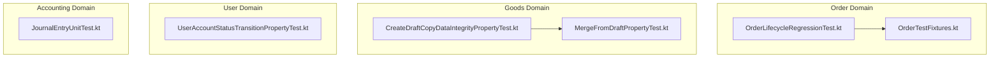
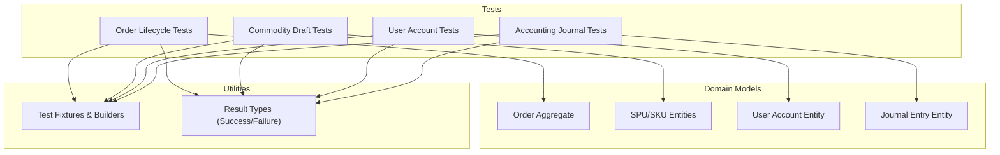
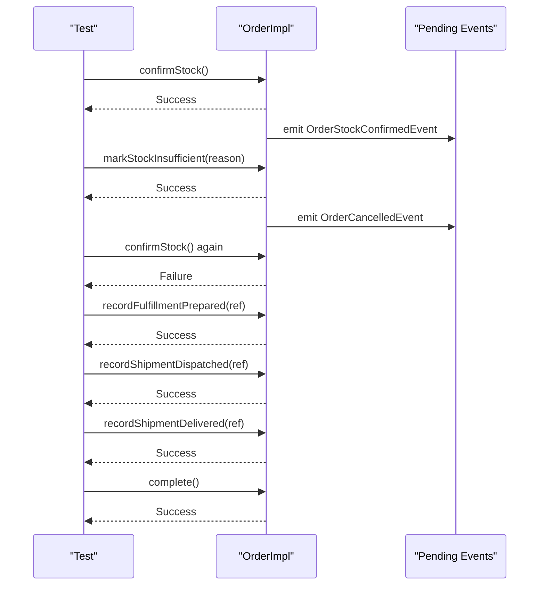
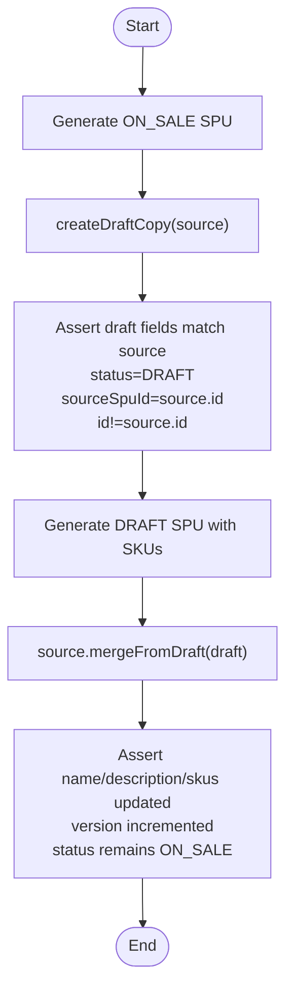
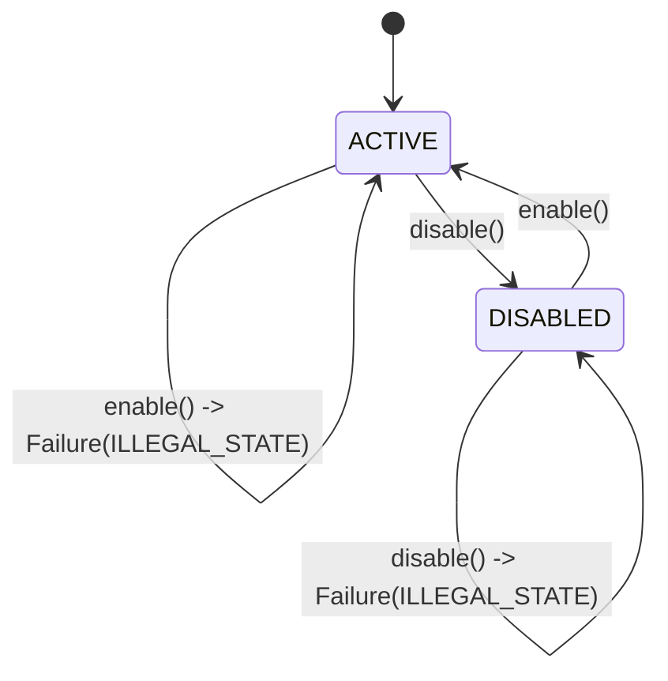
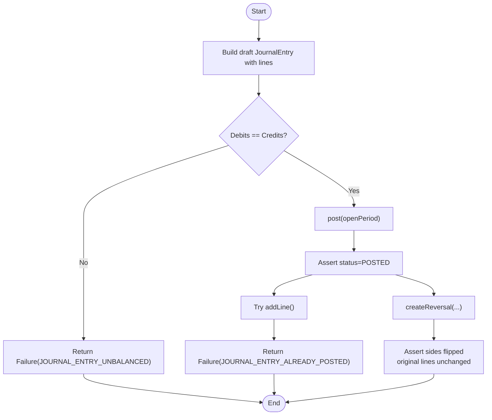
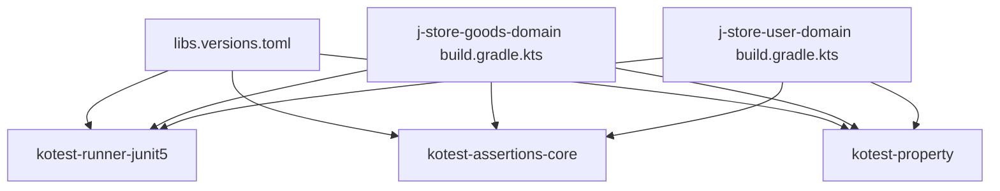

# Domain Model Testing

<cite>
**Referenced Files in This Document**
- [OrderLifecycleRegressionTest.kt](file://j-store-order-domain/src/test/kotlin/com/jstore/order/domain/order/OrderLifecycleRegressionTest.kt)
- [OrderTestFixtures.kt](file://j-store-order-domain/src/testFixtures/kotlin/com/jstore/order/domain/order/OrderTestFixtures.kt)
- [CreateDraftCopyDataIntegrityPropertyTest.kt](file://j-store-goods-domain/src/test/kotlin/com/jstore/goods/domain/commodity/CreateDraftCopyDataIntegrityPropertyTest.kt)
- [MergeFromDraftPropertyTest.kt](file://j-store-goods-domain/src/test/kotlin/com/jstore/goods/domain/commodity/MergeFromDraftPropertyTest.kt)
- [UserAccountStatusTransitionPropertyTest.kt](file://j-store-user-domain/src/test/kotlin/com/jstore/user/UserAccountStatusTransitionPropertyTest.kt)
- [JournalEntryUnitTest.kt](file://j-store-accounting-domain/src/test/kotlin/com/jstore/accounting/domain/journal/JournalEntryUnitTest.kt)
- [libs.versions.toml](file://gradle/libs.versions.toml)
- [build.gradle.kts (goods domain)](file://j-store-goods-domain/build.gradle.kts)
- [build.gradle.kts (user domain)](file://j-store-user-domain/build.gradle.kts)
</cite>

## Table of Contents
1. Introduction
2. Project Structure
3. Core Components
4. Architecture Overview
5. Detailed Component Analysis
6. Dependency Analysis
7. Performance Considerations
8. Troubleshooting Guide
9. Conclusion

## Introduction
This document explains how to test domain models in the J-Store platform using Kotest with property-based testing. It focuses on aggregates, entities, and value objects across order lifecycle states, commodity draft workflows, user account operations, and accounting ledger operations. You will learn strategies for validating business rules, state transitions, invariants, error conditions, and edge cases, along with guidance on test fixtures, data builders, and assertion libraries tailored for domain testing.

## Project Structure
The repository is organized by bounded contexts (modules). Each module contains:
- Domain layer with aggregates, entities, and value objects
- Application layer use cases and services
- Infrastructure layer persistence implementations
- Tests that exercise domain behavior directly, often with property-based tests

Key testing-related modules:
- j-store-order-domain: Order aggregate lifecycle tests and fixtures
- j-store-goods-domain: Commodity draft workflow property tests
- j-store-user-domain: User account status transition property tests
- j-store-accounting-domain: Journal entry unit tests for accounting invariants

**Diagram sources**
- [OrderLifecycleRegressionTest.kt](file://j-store-order-domain/src/test/kotlin/com/jstore/order/domain/order/OrderLifecycleRegressionTest.kt)
- [OrderTestFixtures.kt](file://j-store-order-domain/src/testFixtures/kotlin/com/jstore/order/domain/order/OrderTestFixtures.kt)
- [CreateDraftCopyDataIntegrityPropertyTest.kt](file://j-store-goods-domain/src/test/kotlin/com/jstore/goods/domain/commodity/CreateDraftCopyDataIntegrityPropertyTest.kt)
- [MergeFromDraftPropertyTest.kt](file://j-store-goods-domain/src/test/kotlin/com/jstore/goods/domain/commodity/MergeFromDraftPropertyTest.kt)
- [UserAccountStatusTransitionPropertyTest.kt](file://j-store-user-domain/src/test/kotlin/com/jstore/user/UserAccountStatusTransitionPropertyTest.kt)
- [JournalEntryUnitTest.kt](file://j-store-accounting-domain/src/test/kotlin/com/jstore/accounting/domain/journal/JournalEntryUnitTest.kt)

**Section sources**
- [OrderLifecycleRegressionTest.kt](file://j-store-order-domain/src/test/kotlin/com/jstore/order/domain/order/OrderLifecycleRegressionTest.kt)
- [OrderTestFixtures.kt](file://j-store-order-domain/src/testFixtures/kotlin/com/jstore/order/domain/order/OrderTestFixtures.kt)
- [CreateDraftCopyDataIntegrityPropertyTest.kt](file://j-store-goods-domain/src/test/kotlin/com/jstore/goods/domain/commodity/CreateDraftCopyDataIntegrityPropertyTest.kt)
- [MergeFromDraftPropertyTest.kt](file://j-store-goods-domain/src/test/kotlin/com/jstore/goods/domain/commodity/MergeFromDraftPropertyTest.kt)
- [UserAccountStatusTransitionPropertyTest.kt](file://j-store-user-domain/src/test/kotlin/com/jstore/user/UserAccountStatusTransitionPropertyTest.kt)
- [JournalEntryUnitTest.kt](file://j-store-accounting-domain/src/test/kotlin/com/jstore/accounting/domain/journal/JournalEntryUnitTest.kt)

## Core Components
This section highlights the core domain components under test and their testing patterns:
- Order aggregate: lifecycle transitions, event emission, idempotency, and atomicity
- Commodity SPU/SKU: draft copy integrity and merge semantics
- User account: state transitions and illegal state handling
- Accounting journal: balancing invariant, immutability after posting, and reversal correctness

Testing techniques used:
- Kotest FunSpec for structured tests
- Kotest Property for randomized inputs and invariant assertions
- Test fixtures and builders for consistent object creation
- Result types (Success/Failure) for deterministic assertions

**Section sources**
- [OrderLifecycleRegressionTest.kt](file://j-store-order-domain/src/test/kotlin/com/jstore/order/domain/order/OrderLifecycleRegressionTest.kt)
- [CreateDraftCopyDataIntegrityPropertyTest.kt](file://j-store-goods-domain/src/test/kotlin/com/jstore/goods/domain/commodity/CreateDraftCopyDataIntegrityPropertyTest.kt)
- [MergeFromDraftPropertyTest.kt](file://j-store-goods-domain/src/test/kotlin/com/jstore/goods/domain/commodity/MergeFromDraftPropertyTest.kt)
- [UserAccountStatusTransitionPropertyTest.kt](file://j-store-user-domain/src/test/kotlin/com/jstore/user/UserAccountStatusTransitionPropertyTest.kt)
- [JournalEntryUnitTest.kt](file://j-store-accounting-domain/src/test/kotlin/com/jstore/accounting/domain/journal/JournalEntryUnitTest.kt)

## Architecture Overview
The testing architecture centers around pure domain tests that validate business rules without infrastructure concerns. Property-based tests generate valid and invalid inputs to ensure invariants hold across many scenarios. Unit tests verify specific sequences and outcomes, including event emissions and state changes.

[No sources needed since this diagram shows conceptual workflow, not actual code structure]

## Detailed Component Analysis

### Order Lifecycle Testing
Focus areas:
- Stock confirmation opens trade and emits a payment creation gate event
- Stock failure closes order and emits cancellation event
- Idempotent stock confirmation prevents duplicate events
- Fulfillment sequence preserves item statuses through delivery and completion
- Cancellation behavior differs for unpaid vs paid orders
- Invalid payment recording does not mutate state partially

**Diagram sources**
- [OrderLifecycleRegressionTest.kt](file://j-store-order-domain/src/test/kotlin/com/jstore/order/domain/order/OrderLifecycleRegressionTest.kt)
- [OrderTestFixtures.kt](file://j-store-order-domain/src/testFixtures/kotlin/com/jstore/order/domain/order/OrderTestFixtures.kt)

**Section sources**
- [OrderLifecycleRegressionTest.kt](file://j-store-order-domain/src/test/kotlin/com/jstore/order/domain/order/OrderLifecycleRegressionTest.kt)
- [OrderTestFixtures.kt](file://j-store-order-domain/src/testFixtures/kotlin/com/jstore/order/domain/order/OrderTestFixtures.kt)

### Commodity Draft Workflow Testing
Focus areas:
- createDraftCopy preserves source data integrity (name, description, SKU list, version, status, sourceSpuId)
- mergeFromDraft merges draft into ON_SALE source and increments version while keeping status unchanged
- Property-based generation ensures robust coverage over varied SKUs and attributes

**Diagram sources**
- [CreateDraftCopyDataIntegrityPropertyTest.kt](file://j-store-goods-domain/src/test/kotlin/com/jstore/goods/domain/commodity/CreateDraftCopyDataIntegrityPropertyTest.kt)
- [MergeFromDraftPropertyTest.kt](file://j-store-goods-domain/src/test/kotlin/com/jstore/goods/domain/commodity/MergeFromDraftPropertyTest.kt)

**Section sources**
- [CreateDraftCopyDataIntegrityPropertyTest.kt](file://j-store-goods-domain/src/test/kotlin/com/jstore/goods/domain/commodity/CreateDraftCopyDataIntegrityPropertyTest.kt)
- [MergeFromDraftPropertyTest.kt](file://j-store-goods-domain/src/test/kotlin/com/jstore/goods/domain/commodity/MergeFromDraftPropertyTest.kt)

### User Account Operations Testing
Focus areas:
- State transitions: ACTIVE <-> DISABLED via enable/disable
- Illegal state transitions return Failure with ILLEGAL_STATE
- Property-based tests cover random IDs and consistent nickname/password hashing

**Diagram sources**
- [UserAccountStatusTransitionPropertyTest.kt](file://j-store-user-domain/src/test/kotlin/com/jstore/user/UserAccountStatusTransitionPropertyTest.kt)

**Section sources**
- [UserAccountStatusTransitionPropertyTest.kt](file://j-store-user-domain/src/test/kotlin/com/jstore/user/UserAccountStatusTransitionPropertyTest.kt)

### Accounting Ledger Operations Testing
Focus areas:
- Balanced entries can be posted; unbalanced entries fail
- Posted entries cannot be modified; reversal creates mirrored lines
- Original lines remain immutable after posting

**Diagram sources**
- [JournalEntryUnitTest.kt](file://j-store-accounting-domain/src/test/kotlin/com/jstore/accounting/domain/journal/JournalEntryUnitTest.kt)

**Section sources**
- [JournalEntryUnitTest.kt](file://j-store-accounting-domain/src/test/kotlin/com/jstore/accounting/domain/journal/JournalEntryUnitTest.kt)

## Dependency Analysis
Kotest and related libraries are centrally managed via Gradle version catalog. The domain modules include Kotest runner, assertions, and property testing dependencies. Tests run on JUnit Platform.

**Diagram sources**
- [libs.versions.toml](file://gradle/libs.versions.toml)
- [build.gradle.kts (goods domain)](file://j-store-goods-domain/build.gradle.kts)
- [build.gradle.kts (user domain)](file://j-store-user-domain/build.gradle.kts)

**Section sources**
- [libs.versions.toml](file://gradle/libs.versions.toml)
- [build.gradle.kts (goods domain)](file://j-store-goods-domain/build.gradle.kts)
- [build.gradle.kts (user domain)](file://j-store-user-domain/build.gradle.kts)

## Performance Considerations
- Property-based tests should limit sample sizes to balance coverage and runtime (e.g., 100 samples per checkAll).
- Avoid heavy I/O in domain tests; keep them fast and deterministic.
- Use lightweight generators for complex structures (e.g., SKU lists) to reduce test execution time.
- Prefer immutable domain objects and pure functions to avoid hidden state costs.

[No sources needed since this section provides general guidance]

## Troubleshooting Guide
Common issues and resolutions:
- Illegal state transitions: Ensure initial state matches expected preconditions before invoking operations; assert Failure with ILLEGAL_STATE when appropriate.
- Unbalanced journal entries: Validate debit/credit sums before posting; assert Failure with JOURNAL_ENTRY_UNBALANCED.
- Duplicate operations: Confirm idempotency checks prevent repeated side effects; assert no additional events or state mutations.
- Partial mutations on failures: Verify that failed operations leave the domain model unchanged; compare snapshots before and after.

**Section sources**
- [UserAccountStatusTransitionPropertyTest.kt](file://j-store-user-domain/src/test/kotlin/com/jstore/user/UserAccountStatusTransitionPropertyTest.kt)
- [JournalEntryUnitTest.kt](file://j-store-accounting-domain/src/test/kotlin/com/jstore/accounting/domain/journal/JournalEntryUnitTest.kt)
- [OrderLifecycleRegressionTest.kt](file://j-store-order-domain/src/test/kotlin/com/jstore/order/domain/order/OrderLifecycleRegressionTest.kt)

## Conclusion
The J-Store platform employs robust domain testing practices using Kotest and property-based testing to validate business rules, state transitions, and invariants across order, commodity, user, and accounting domains. By combining focused unit tests with comprehensive property tests, the team ensures correctness, resilience, and maintainability of domain logic. Adopting similar patterns—fixtures, builders, Result types, and clear assertions—will help teams scale testing efforts effectively.

[No sources needed since this section summarizes without analyzing specific files]