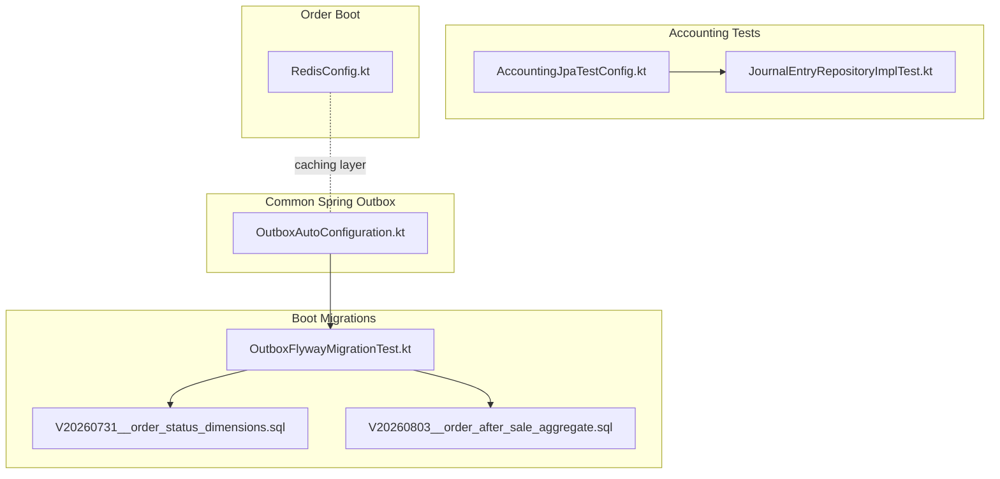
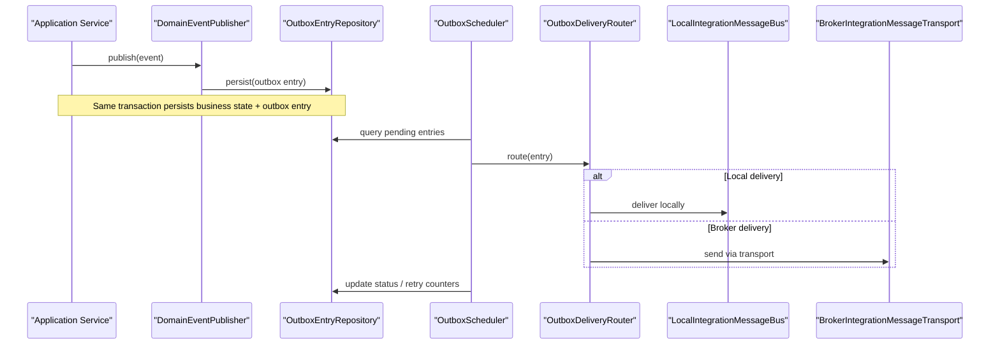
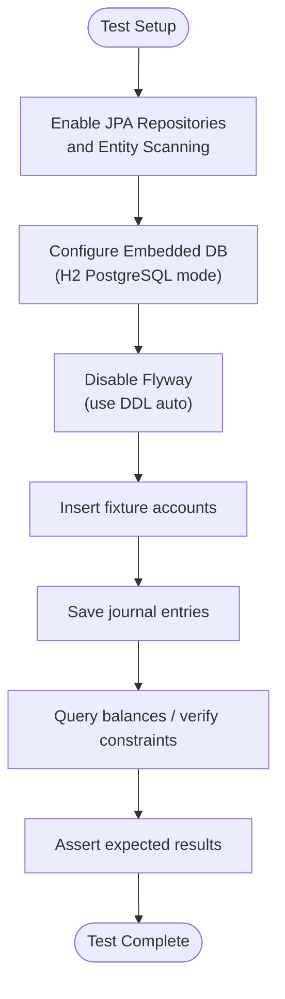
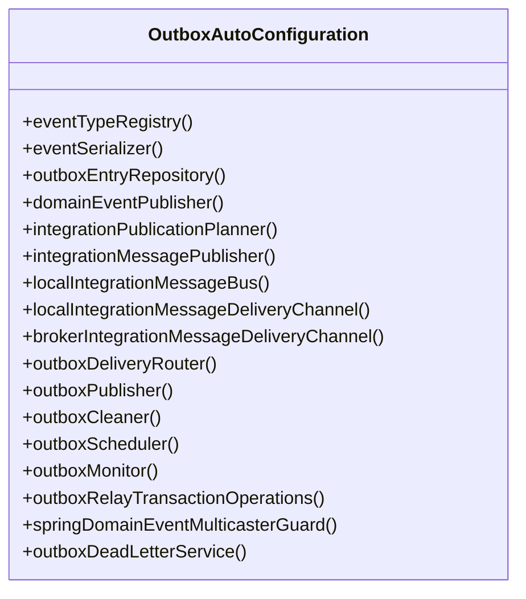
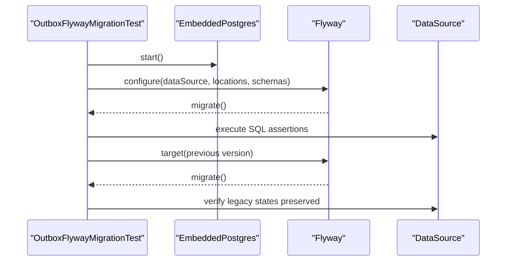
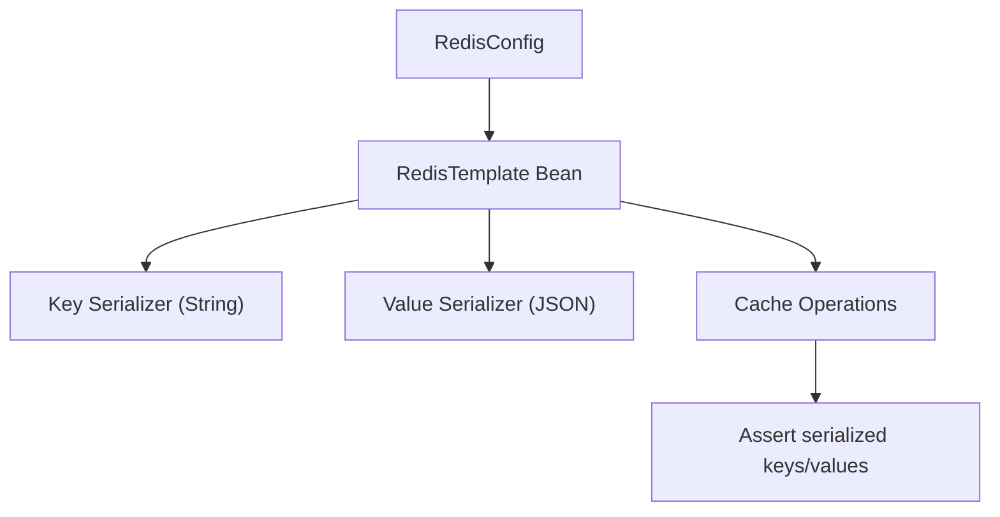

# Infrastructure Testing

<cite>
**Referenced Files in This Document**
- [AccountingJpaTestConfig.kt](file://j-store-accounting-infrastructure/src/test/kotlin/com/jstore/accounting/AccountingJpaTestConfig.kt)
- [JournalEntryRepositoryImplTest.kt](file://j-store-accounting-infrastructure/src/test/kotlin/com/jstore/accounting/domain/journal/JournalEntryRepositoryImplTest.kt)
- [OutboxAutoConfiguration.kt](file://j-store-common-spring/src/main/kotlin/com/jstore/common/framework/event/outbox/OutboxAutoConfiguration.kt)
- [OutboxOperationsConfiguration.kt](file://j-store-boot/src/main/kotlin/com/jstore/outbox/operations/OutboxOperationsConfiguration.kt)
- [OutboxFlywayMigrationTest.kt](file://j-store-boot/src/test/kotlin/com/jstore/outbox/OutboxFlywayMigrationTest.kt)
- [RedisConfig.kt](file://j-store-order-boot/src/main/kotlin/com/jstore/order/config/RedisConfig.kt)
- [V20260731__order_status_dimensions.sql](file://j-store-boot/src/main/resources/db/migration/V20260731__order_status_dimensions.sql)
- [V20260803__order_after_sale_aggregate.sql](file://j-store-boot/src/main/resources/db/migration/V20260803__order_after_sale_aggregate.sql)
</cite>

## Table of Contents
1. [Introduction](#introduction)
2. [Project Structure](#project-structure)
3. [Core Components](#core-components)
4. [Architecture Overview](#architecture-overview)
5. [Detailed Component Analysis](#detailed-component-analysis)
6. [Dependency Analysis](#dependency-analysis)
7. [Performance Considerations](#performance-considerations)
8. [Troubleshooting Guide](#troubleshooting-guide)
9. [Conclusion](#conclusion)

## Introduction
This document explains how to test infrastructure components in the J-Store platform, focusing on repository implementations, database interactions, and external service integrations. It covers testing strategies for JPA repositories, message brokers via the outbox pattern, caching layers (e.g., Redis), transaction management, connection pooling, and performance considerations. It also provides examples for testing outbox persistence, event publishing, and concurrent access scenarios using Testcontainers and embedded databases.

## Project Structure
The testing infrastructure spans multiple modules:
- Accounting infrastructure tests demonstrate JPA repository testing with an embedded PostgreSQL-compatible H2 database.
- Outbox auto-configuration wires domain and integration messaging through a persistent outbox table and scheduled delivery.
- Boot-level migration tests validate Flyway migrations against an embedded Postgres instance.
- Order boot configuration sets up Redis serialization for caching or session storage.

**Diagram sources**
- [AccountingJpaTestConfig.kt](file://j-store-accounting-infrastructure/src/test/kotlin/com/jstore/accounting/AccountingJpaTestConfig.kt)
- [JournalEntryRepositoryImplTest.kt](file://j-store-accounting-infrastructure/src/test/kotlin/com/jstore/accounting/domain/journal/JournalEntryRepositoryImplTest.kt)
- [OutboxAutoConfiguration.kt](file://j-store-common-spring/src/main/kotlin/com/jstore/common/framework/event/outbox/OutboxAutoConfiguration.kt)
- [OutboxFlywayMigrationTest.kt](file://j-store-boot/src/test/kotlin/com/jstore/outbox/OutboxFlywayMigrationTest.kt)
- [V20260731__order_status_dimensions.sql](file://j-store-boot/src/main/resources/db/migration/V20260731__order_status_dimensions.sql)
- [V20260803__order_after_sale_aggregate.sql](file://j-store-boot/src/main/resources/db/migration/V20260803__order_after_sale_aggregate.sql)
- [RedisConfig.kt](file://j-store-order-boot/src/main/kotlin/com/jstore/order/config/RedisConfig.kt)

**Section sources**
- [AccountingJpaTestConfig.kt](file://j-store-accounting-infrastructure/src/test/kotlin/com/jstore/accounting/AccountingJpaTestConfig.kt)
- [JournalEntryRepositoryImplTest.kt](file://j-store-accounting-infrastructure/src/test/kotlin/com/jstore/accounting/domain/journal/JournalEntryRepositoryImplTest.kt)
- [OutboxAutoConfiguration.kt](file://j-store-common-spring/src/main/kotlin/com/jstore/common/framework/event/outbox/OutboxAutoConfiguration.kt)
- [OutboxFlywayMigrationTest.kt](file://j-store-boot/src/test/kotlin/com/jstore/outbox/OutboxFlywayMigrationTest.kt)
- [RedisConfig.kt](file://j-store-order-boot/src/main/kotlin/com/jstore/order/config/RedisConfig.kt)
- [V20260731__order_status_dimensions.sql](file://j-store-boot/src/main/resources/db/migration/V20260731__order_status_dimensions.sql)
- [V20260803__order_after_sale_aggregate.sql](file://j-store-boot/src/main/resources/db/migration/V20260803__order_after_sale_aggregate.sql)

## Core Components
- JPA Repository Testing: Use SpringBootTest with a minimal test configuration that scans entities and repositories. Configure an embedded database and disable schema migrations when using DDL generation.
- Outbox Pattern: Auto-configuration wires serializers, registries, publishers, routers, schedulers, and monitors. It supports both local and broker-based delivery channels and integrates with transactional operations.
- Migration Testing: Validate Flyway migrations against an embedded Postgres instance to ensure schema correctness and idempotent upgrades.
- Caching Layer: Configure Redis templates with appropriate serializers for keys and values to ensure consistent serialization across caches.

**Section sources**
- [JournalEntryRepositoryImplTest.kt](file://j-store-accounting-infrastructure/src/test/kotlin/com/jstore/accounting/domain/journal/JournalEntryRepositoryImplTest.kt)
- [OutboxAutoConfiguration.kt](file://j-store-common-spring/src/main/kotlin/com/jstore/common/framework/event/outbox/OutboxAutoConfiguration.kt)
- [OutboxFlywayMigrationTest.kt](file://j-store-boot/src/test/kotlin/com/jstore/outbox/OutboxFlywayMigrationTest.kt)
- [RedisConfig.kt](file://j-store-order-boot/src/main/kotlin/com/jstore/order/config/RedisConfig.kt)

## Architecture Overview
The outbox architecture ensures reliable event persistence and delivery:
- Domain events are published into a persistent outbox table within the same transaction as business data changes.
- A scheduler picks pending entries, serializes them, and routes to either a local bus or a broker transport channel.
- Delivery is retried with backoff and dead-letter handling; observability metrics are recorded.

**Diagram sources**
- [OutboxAutoConfiguration.kt](file://j-store-common-spring/src/main/kotlin/com/jstore/common/framework/event/outbox/OutboxAutoConfiguration.kt)

## Detailed Component Analysis

### JPA Repository Testing Strategy
- Use a minimal Spring Boot test configuration to enable entity scanning and repository discovery.
- Configure an embedded database compatible with your production dialect (e.g., H2 in PostgreSQL mode).
- Disable Flyway when using DDL auto-generation to avoid conflicts.
- Assert constraints such as uniqueness and balance queries by saving fixtures and querying results.

**Diagram sources**
- [AccountingJpaTestConfig.kt](file://j-store-accounting-infrastructure/src/test/kotlin/com/jstore/accounting/AccountingJpaTestConfig.kt)
- [JournalEntryRepositoryImplTest.kt](file://j-store-accounting-infrastructure/src/test/kotlin/com/jstore/accounting/domain/journal/JournalEntryRepositoryImplTest.kt)

**Section sources**
- [AccountingJpaTestConfig.kt](file://j-store-accounting-infrastructure/src/test/kotlin/com/jstore/accounting/AccountingJpaTestConfig.kt)
- [JournalEntryRepositoryImplTest.kt](file://j-store-accounting-infrastructure/src/test/kotlin/com/jstore/accounting/domain/journal/JournalEntryRepositoryImplTest.kt)

### Outbox Pattern Testing
- The outbox auto-configuration wires all necessary beans: serializers, registries, publishers, routers, schedulers, and monitors.
- For unit tests, you can isolate the publisher and router by providing mocks for transports and buses.
- For integration tests, use an embedded Postgres to validate persistence and scheduling behavior.

**Diagram sources**
- [OutboxAutoConfiguration.kt](file://j-store-common-spring/src/main/kotlin/com/jstore/common/framework/event/outbox/OutboxAutoConfiguration.kt)

**Section sources**
- [OutboxAutoConfiguration.kt](file://j-store-common-spring/src/main/kotlin/com/jstore/common/framework/event/outbox/OutboxAutoConfiguration.kt)

### Migration Testing with Testcontainers
- Use an embedded Postgres instance to run Flyway migrations and assert schema correctness.
- Verify specific columns, defaults, and audit tables created by migrations.
- Validate backward compatibility by running partial migrations and checking preserved states.

**Diagram sources**
- [OutboxFlywayMigrationTest.kt](file://j-store-boot/src/test/kotlin/com/jstore/outbox/OutboxFlywayMigrationTest.kt)
- [V20260731__order_status_dimensions.sql](file://j-store-boot/src/main/resources/db/migration/V20260731__order_status_dimensions.sql)
- [V20260803__order_after_sale_aggregate.sql](file://j-store-boot/src/main/resources/db/migration/V20260803__order_after_sale_aggregate.sql)

**Section sources**
- [OutboxFlywayMigrationTest.kt](file://j-store-boot/src/test/kotlin/com/jstore/outbox/OutboxFlywayMigrationTest.kt)
- [V20260731__order_status_dimensions.sql](file://j-store-boot/src/main/resources/db/migration/V20260731__order_status_dimensions.sql)
- [V20260803__order_after_sale_aggregate.sql](file://j-store-boot/src/main/resources/db/migration/V20260803__order_after_sale_aggregate.sql)

### Caching Layer Testing (Redis)
- Configure RedisTemplate with explicit serializers for keys and values to ensure consistency.
- In tests, use an embedded Redis or a test container to validate serialization and cache behavior.
- Assert key formats and value structures after cache writes and reads.

**Diagram sources**
- [RedisConfig.kt](file://j-store-order-boot/src/main/kotlin/com/jstore/order/config/RedisConfig.kt)

**Section sources**
- [RedisConfig.kt](file://j-store-order-boot/src/main/kotlin/com/jstore/order/config/RedisConfig.kt)

### Transaction Management and Connection Pooling
- Ensure outbox persistence occurs within the same transaction as business data updates.
- Use explicit transaction boundaries in application services to guarantee atomicity.
- For connection pooling tests, verify pool sizing and leak detection under load.

[No sources needed since this section provides general guidance]

### Message Broker Integration Testing
- Provide a mock broker transport for unit tests to isolate outbox logic.
- For integration tests, spin up a real broker (e.g., RabbitMQ or Kafka) via Testcontainers and validate end-to-end delivery.
- Assert idempotency and retry behavior by simulating failures and re-deliveries.

[No sources needed since this section provides general guidance]

## Dependency Analysis
The outbox auto-configuration centralizes dependencies between serializers, registries, publishers, routers, and schedulers. This reduces coupling and allows flexible substitution for testing.

```mermaid
graph TB
OA["OutboxAutoConfiguration"]
ER["EventTypeRegistry"]
ISR["SpringIntegrationMessageTypeRegistryRegistrar"]
IMR["IntegrationMessageTypeRegistry"]
ES["EventSerializer"]
IMS["IntegrationMessageSerializer"]
OER["OutboxEntryRepository"]
ODP["DomainEventPublisher"]
IMP["IntegrationMessagePublisher"]
LMB["LocalIntegrationMessageBus"]
LDC["LocalIntegrationMessageDeliveryChannel"]
BDC["BrokerIntegrationMessageDeliveryChannel"]
RTR["OutboxDeliveryRouter"]
OPUB["OutboxPublisher"]
CLN["OutboxCleaner"]
SCH["OutboxScheduler"]
MON["OutboxMonitor"]
TM["PlatformTransactionManager"]
ROT["OutboxRelayTransactionOperations"]
OA --> ER
OA --> ISR
OA --> IMR
OA --> ES
OA --> IMS
OA --> OER
OA --> ODP
OA --> IMP
OA --> LMB
OA --> LDC
OA --> BDC
OA --> RTR
OA --> OPUB
OA --> CLN
OA --> SCH
OA --> MON
OA --> TM
OA --> ROT
```

**Diagram sources**
- [OutboxAutoConfiguration.kt](file://j-store-common-spring/src/main/kotlin/com/jstore/common/framework/event/outbox/OutboxAutoConfiguration.kt)

**Section sources**
- [OutboxAutoConfiguration.kt](file://j-store-common-spring/src/main/kotlin/com/jstore/common/framework/event/outbox/OutboxAutoConfiguration.kt)

## Performance Considerations
- Prefer embedded databases for fast unit tests; switch to Testcontainers for realistic integration tests.
- Keep test transactions small and isolated to reduce lock contention and improve throughput.
- Tune connection pool sizes for integration tests to simulate production load without exhausting resources.
- Avoid heavy serialization in hot paths during tests; use lightweight payloads where possible.
- Monitor outbox scheduler intervals and retry policies to prevent excessive polling or retries in CI environments.

[No sources needed since this section provides general guidance]

## Troubleshooting Guide
- If Flyway migrations fail in tests, ensure the correct schema and default schema are configured and that previous versions are targeted appropriately.
- When H2 behaves differently from Postgres, set the mode explicitly and validate constraint names and functions.
- For outbox delivery issues, check monitor metrics and dead-letter queues; verify serializer configurations and type registries.
- For Redis serialization mismatches, confirm key and value serializers match across services and tests.

**Section sources**
- [OutboxFlywayMigrationTest.kt](file://j-store-boot/src/test/kotlin/com/jstore/outbox/OutboxFlywayMigrationTest.kt)
- [JournalEntryRepositoryImplTest.kt](file://j-store-accounting-infrastructure/src/test/kotlin/com/jstore/accounting/domain/journal/JournalEntryRepositoryImplTest.kt)
- [OutboxAutoConfiguration.kt](file://j-store-common-spring/src/main/kotlin/com/jstore/common/framework/event/outbox/OutboxAutoConfiguration.kt)
- [RedisConfig.kt](file://j-store-order-boot/src/main/kotlin/com/jstore/order/config/RedisConfig.kt)

## Conclusion
The J-Store platform’s testing infrastructure combines Spring Boot test configurations, embedded databases, Testcontainers, and robust outbox auto-configuration to validate repository implementations, database interactions, and event-driven integrations. By following the patterns outlined here—using minimal test configs, asserting constraints and behaviors, and isolating external dependencies—you can build reliable, fast, and maintainable tests for JPA repositories, message brokers, and caching layers while ensuring transactional integrity and performance.