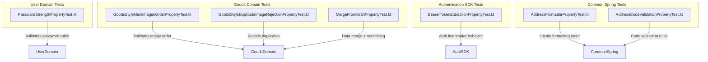
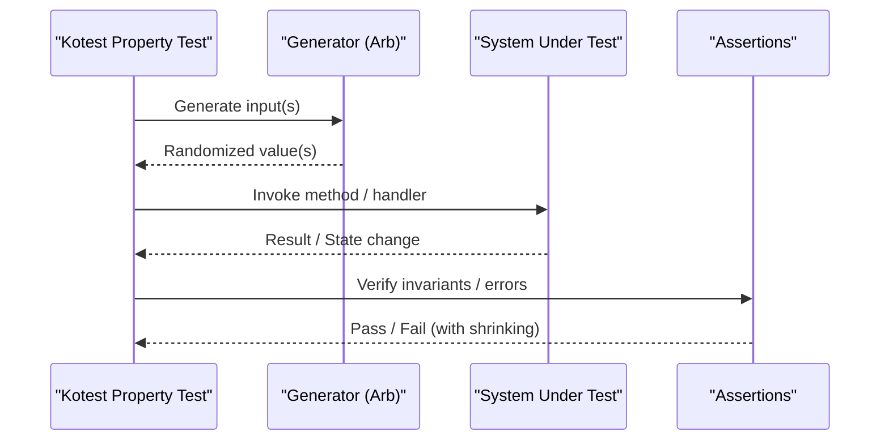
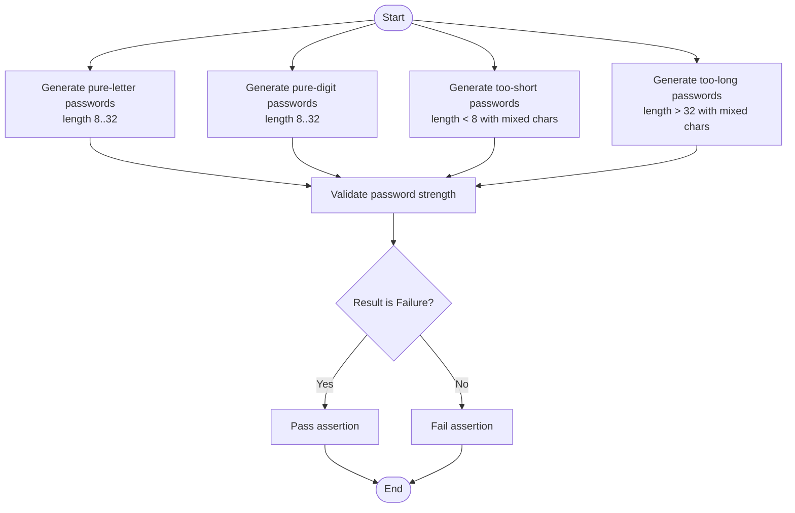
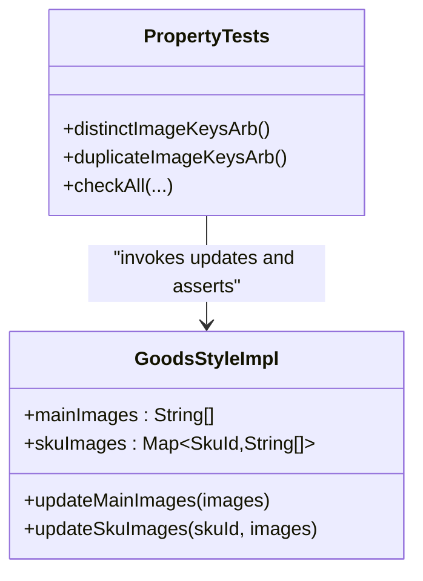
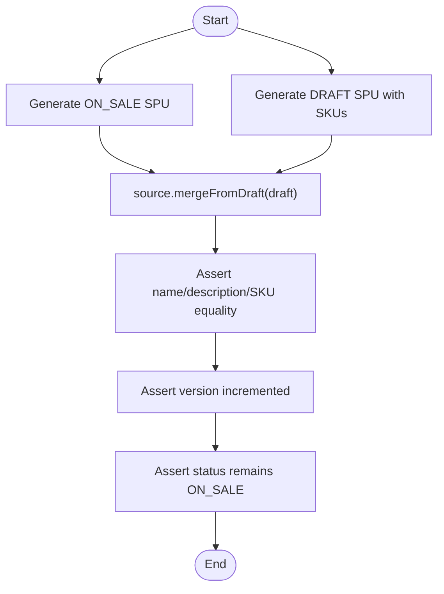
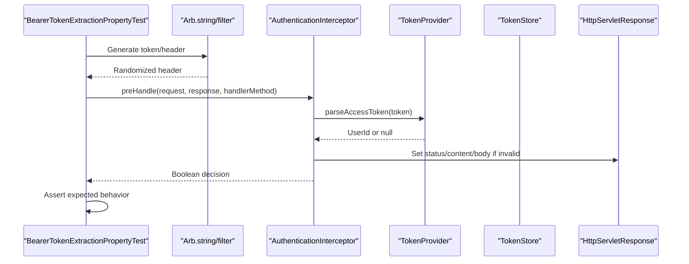
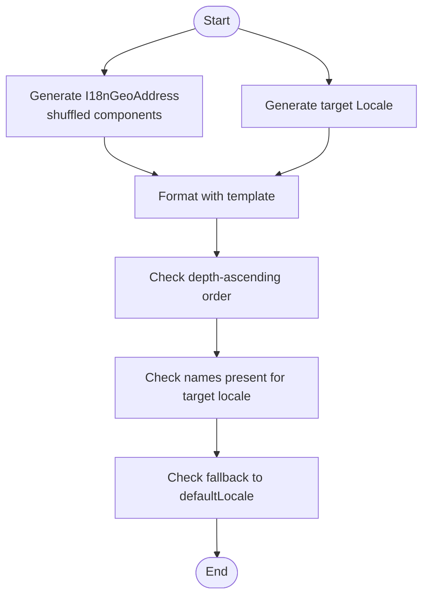
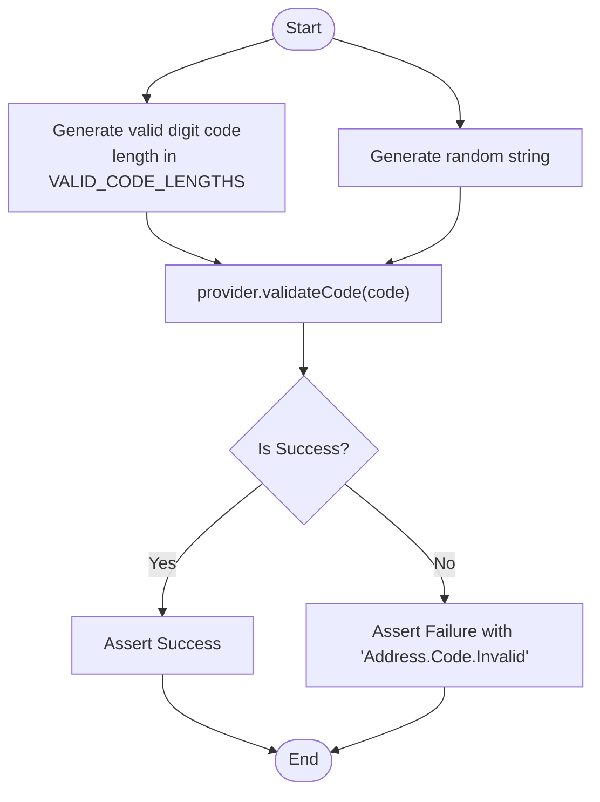
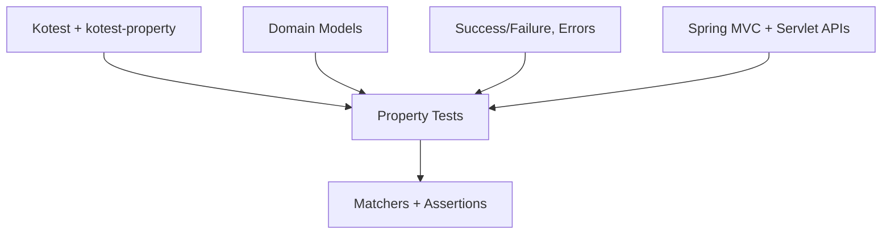

# Property-Based Testing

<cite>
**Referenced Files in This Document**
- [GoodsStyleMainImagesOrderPropertyTest.kt](file://j-store-goods-domain/src/test/kotlin/com/jstore/goods/domain/commodity/GoodsStyleMainImagesOrderPropertyTest.kt)
- [GoodsStyleDuplicateImageRejectionPropertyTest.kt](file://j-store-goods-domain/src/test/kotlin/com/jstore/goods/domain/commodity/GoodsStyleDuplicateImageRejectionPropertyTest.kt)
- [MergeFromDraftPropertyTest.kt](file://j-store-goods-domain/src/test/kotlin/com/jstore/goods/domain/commodity/MergeFromDraftPropertyTest.kt)
- [PasswordStrengthPropertyTest.kt](file://j-store-user-domain/src/test/kotlin/com/jstore/user/PasswordStrengthPropertyTest.kt)
- [BearerTokenExtractionPropertyTest.kt](file://j-store-authentication-spring-sdk/src/test/kotlin/com/jstore/authentication/spring/BearerTokenExtractionPropertyTest.kt)
- [AddressFormatterPropertyTest.kt](file://j-store-common-spring/src/test/kotlin/com/jstore/common/geo/AddressFormatterPropertyTest.kt)
- [AddressCodeValidationPropertyTest.kt](file://j-store-common-spring/src/test/kotlin/com/jstore/common/geo/AddressCodeValidationPropertyTest.kt)
</cite>

## Table of Contents
1. [Introduction](#introduction)
2. [Project Structure](#project-structure)
3. [Core Components](#core-components)
4. [Architecture Overview](#architecture-overview)
5. [Detailed Component Analysis](#detailed-component-analysis)
6. [Dependency Analysis](#dependency-analysis)
7. [Performance Considerations](#performance-considerations)
8. [Troubleshooting Guide](#troubleshooting-guide)
9. [Conclusion](#conclusion)

## Introduction
This document explains how the J-Store platform uses Kotest’s property-based testing to validate business rules, validation constraints, and mathematical invariants across modules. It covers strategies for defining properties, building generators, handling shrinkers, and debugging failures. Concrete examples include password strength requirements, image ordering constraints, result transformations, and data integrity rules. The goal is to make property testing accessible and actionable for both new and experienced contributors.

## Project Structure
Property tests are co-located with their respective domain or application code under each module’s test source set. They use Kotest’s FunSpec style and the kotest-property library (Arb, checkAll, arbitrary, filter, map, bind). Typical patterns:
- Define one or more Arb generators that produce valid or intentionally invalid inputs.
- Use checkAll to assert universal properties over many random inputs.
- Assert success/failure outcomes using matchers and error codes.
- Keep tests deterministic by controlling randomness via PropTestConfig when needed.

**Section sources**
- [GoodsStyleMainImagesOrderPropertyTest.kt:1-51](file://j-store-goods-domain/src/test/kotlin/com/jstore/goods/domain/commodity/GoodsStyleMainImagesOrderPropertyTest.kt#L1-L51)
- [GoodsStyleDuplicateImageRejectionPropertyTest.kt:1-82](file://j-store-goods-domain/src/test/kotlin/com/jstore/goods/domain/commodity/GoodsStyleDuplicateImageRejectionPropertyTest.kt#L1-L82)
- [MergeFromDraftPropertyTest.kt:1-112](file://j-store-goods-domain/src/test/kotlin/com/jstore/goods/domain/commodity/MergeFromDraftPropertyTest.kt#L1-L112)
- [PasswordStrengthPropertyTest.kt:1-81](file://j-store-user-domain/src/test/kotlin/com/jstore/user/PasswordStrengthPropertyTest.kt#L1-L81)
- [BearerTokenExtractionPropertyTest.kt:1-119](file://j-store-authentication-spring-sdk/src/test/kotlin/com/jstore/authentication/spring/BearerTokenExtractionPropertyTest.kt#L1-L119)
- [AddressFormatterPropertyTest.kt:1-243](file://j-store-common-spring/src/test/kotlin/com/jstore/common/geo/AddressFormatterPropertyTest.kt#L1-L243)
- [AddressCodeValidationPropertyTest.kt:1-69](file://j-store-common-spring/src/test/kotlin/com/jstore/common/geo/AddressCodeValidationPropertyTest.kt#L1-L69)

## Core Components
- Generators (Arb): Used to create valid and invalid inputs, including lists, strings, numbers, and complex domain objects. Examples include distinct image key lists, duplicate-containing lists, passwords of specific character sets, and multi-locale addresses.
- Assertions: Properties are expressed as boolean conditions or outcome checks (e.g., Success/Failure types, error codes, state invariants).
- Configuration: PropTestConfig controls iterations and other runtime behaviors.
- Shrinkers: Kotest automatically shrinks failing inputs; custom shrinkers can be provided via Arb for faster diagnosis.

Key patterns observed:
- Pure-letter/digit and length-bounded generators to target password policy edge cases.
- Distinct vs duplicate list generators to enforce uniqueness constraints.
- Multi-locale component generation to verify formatter fallback behavior.
- Mocked HTTP components to validate authentication interceptor decisions.

**Section sources**
- [PasswordStrengthPropertyTest.kt:20-55](file://j-store-user-domain/src/test/kotlin/com/jstore/user/PasswordStrengthPropertyTest.kt#L20-L55)
- [GoodsStyleMainImagesOrderPropertyTest.kt:24-27](file://j-store-goods-domain/src/test/kotlin/com/jstore/goods/domain/commodity/GoodsStyleMainImagesOrderPropertyTest.kt#L24-L27)
- [GoodsStyleDuplicateImageRejectionPropertyTest.kt:25-34](file://j-store-goods-domain/src/test/kotlin/com/jstore/goods/domain/commodity/GoodsStyleDuplicateImageRejectionPropertyTest.kt#L25-L34)
- [AddressFormatterPropertyTest.kt:84-123](file://j-store-common-spring/src/test/kotlin/com/jstore/common/geo/AddressFormatterPropertyTest.kt#L84-L123)
- [BearerTokenExtractionPropertyTest.kt:32-70](file://j-store-authentication-spring-sdk/src/test/kotlin/com/jstore/authentication/spring/BearerTokenExtractionPropertyTest.kt#L32-L70)

## Architecture Overview
The property tests exercise domain logic, application services, and framework integrations through randomized inputs. The flow typically involves:
- Generating inputs with Arb.
- Invoking domain methods or interceptors.
- Checking outcomes (state changes, return types, error codes).
- Relying on Kotest’s shrinking to simplify failing cases.

[No sources needed since this diagram shows conceptual workflow, not actual code structure]

## Detailed Component Analysis

### Password Strength Validation
Strategy:
- Create generators for pure letters, pure digits, too short, and too long passwords.
- Assert that validation returns failure for all invalid categories.
- Use flatMap/bind to ensure constraints like minimum letter/digit presence within length bounds.

**Section sources**
- [PasswordStrengthPropertyTest.kt:20-55](file://j-store-user-domain/src/test/kotlin/com/jstore/user/PasswordStrengthPropertyTest.kt#L20-L55)
- [PasswordStrengthPropertyTest.kt:57-79](file://j-store-user-domain/src/test/kotlin/com/jstore/user/PasswordStrengthPropertyTest.kt#L57-L79)

### Image Ordering Constraints
Strategy:
- Generate distinct image key lists (including empty) and assert that update operations preserve element order exactly.
- Ensure no duplicates are accepted; duplicates must yield a Failure and leave state unchanged.

**Diagram sources**
- [GoodsStyleMainImagesOrderPropertyTest.kt:28-49](file://j-store-goods-domain/src/test/kotlin/com/jstore/goods/domain/commodity/GoodsStyleMainImagesOrderPropertyTest.kt#L28-L49)
- [GoodsStyleDuplicateImageRejectionPropertyTest.kt:38-80](file://j-store-goods-domain/src/test/kotlin/com/jstore/goods/domain/commodity/GoodsStyleDuplicateImageRejectionPropertyTest.kt#L38-L80)

**Section sources**
- [GoodsStyleMainImagesOrderPropertyTest.kt:24-49](file://j-store-goods-domain/src/test/kotlin/com/jstore/goods/domain/commodity/GoodsStyleMainImagesOrderPropertyTest.kt#L24-L49)
- [GoodsStyleDuplicateImageRejectionPropertyTest.kt:25-80](file://j-store-goods-domain/src/test/kotlin/com/jstore/goods/domain/commodity/GoodsStyleDuplicateImageRejectionPropertyTest.kt#L25-L80)

### Data Integrity Rules (Merge From Draft)
Strategy:
- Generate an ON_SALE source SPU and a draft SPU with at least one SKU.
- After merging, assert name, description, SKU list equality, version increment, and status preservation.

**Section sources**
- [MergeFromDraftPropertyTest.kt:27-95](file://j-store-goods-domain/src/test/kotlin/com/jstore/goods/domain/commodity/MergeFromDraftPropertyTest.kt#L27-L95)
- [MergeFromDraftPropertyTest.kt:97-111](file://j-store-goods-domain/src/test/kotlin/com/jstore/goods/domain/commodity/MergeFromDraftPropertyTest.kt#L97-L111)

### Authentication Interceptor Behavior
Strategy:
- Generate Authorization header values (valid Bearer tokens, missing/invalid formats).
- Mock TokenProvider and TokenStore to control parsing outcomes.
- Assert preHandle decision, response status, content type, and error body.

**Diagram sources**
- [BearerTokenExtractionPropertyTest.kt:32-70](file://j-store-authentication-spring-sdk/src/test/kotlin/com/jstore/authentication/spring/BearerTokenExtractionPropertyTest.kt#L32-L70)
- [BearerTokenExtractionPropertyTest.kt:73-117](file://j-store-authentication-spring-sdk/src/test/kotlin/com/jstore/authentication/spring/BearerTokenExtractionPropertyTest.kt#L73-L117)

**Section sources**
- [BearerTokenExtractionPropertyTest.kt:32-70](file://j-store-authentication-spring-sdk/src/test/kotlin/com/jstore/authentication/spring/BearerTokenExtractionPropertyTest.kt#L32-L70)
- [BearerTokenExtractionPropertyTest.kt:73-117](file://j-store-authentication-spring-sdk/src/test/kotlin/com/jstore/authentication/spring/BearerTokenExtractionPropertyTest.kt#L73-L117)

### Address Formatting and Locale Fallback
Strategy:
- Generate I18nGeoAddress with shuffled components per depth level.
- Assert formatted string contains components in depth-ascending order.
- For multi-locale names, assert target locale usage and fallback to defaultLocale.

**Section sources**
- [AddressFormatterPropertyTest.kt:84-149](file://j-store-common-spring/src/test/kotlin/com/jstore/common/geo/AddressFormatterPropertyTest.kt#L84-L149)
- [AddressFormatterPropertyTest.kt:171-241](file://j-store-common-spring/src/test/kotlin/com/jstore/common/geo/AddressFormatterPropertyTest.kt#L171-L241)

### Address Code Validation
Strategy:
- Generate valid Chinese address codes (all-digit, valid lengths) and random strings.
- Assert Success for valid codes and Failure with specific error code for invalid ones.

**Section sources**
- [AddressCodeValidationPropertyTest.kt:31-47](file://j-store-common-spring/src/test/kotlin/com/jstore/common/geo/AddressCodeValidationPropertyTest.kt#L31-L47)
- [AddressCodeValidationPropertyTest.kt:50-67](file://j-store-common-spring/src/test/kotlin/com/jstore/common/geo/AddressCodeValidationPropertyTest.kt#L50-L67)

## Dependency Analysis
Property tests depend on:
- Kotest core and property libraries (FunSpec, Arb, checkAll, arbitrary, filter, map, bind).
- Domain classes and implementations (e.g., GoodsStyleImpl, SpuImpl, SkuImpl).
- Framework mocks (e.g., HttpServletRequest, HttpServletResponse, HandlerMethod, TokenProvider, TokenStore).
- Utility types (Success/Failure wrappers, error codes).

[No sources needed since this diagram shows conceptual dependencies, not direct file mappings]

**Section sources**
- [BearerTokenExtractionPropertyTest.kt:1-23](file://j-store-authentication-spring-sdk/src/test/kotlin/com/jstore/authentication/spring/BearerTokenExtractionPropertyTest.kt#L1-L23)
- [AddressFormatterPropertyTest.kt:1-15](file://j-store-common-spring/src/test/kotlin/com/jstore/common/geo/AddressFormatterPropertyTest.kt#L1-L15)
- [AddressCodeValidationPropertyTest.kt:1-14](file://j-store-common-spring/src/test/kotlin/com/jstore/common/geo/AddressCodeValidationPropertyTest.kt#L1-L14)

## Performance Considerations
- Control iterations with PropTestConfig(iterations = N) to balance coverage and speed.
- Prefer lightweight generators; avoid heavy object creation inside Arb.
- Use filter/map strategically to constrain inputs without excessive rejection.
- Keep assertions simple and fast; defer expensive checks to targeted unit tests.
- Run tests with Gradle flags like --no-daemon and --max-workers=1 for deterministic runs when diagnosing flaky issues.

[No sources needed since this section provides general guidance]

## Troubleshooting Guide
- Shrinking: Kotest automatically shrinks failing inputs; inspect the minimal failing case to pinpoint root causes.
- Debugging generators: Temporarily print generated values or reduce ranges to isolate problematic distributions.
- Flaky tests: Increase determinism by fixing seeds or narrowing generator ranges; ensure mocks behave consistently.
- Error paths: Assert exact error codes and response bodies to catch regressions early.

**Section sources**
- [BearerTokenExtractionPropertyTest.kt:73-117](file://j-store-authentication-spring-sdk/src/test/kotlin/com/jstore/authentication/spring/BearerTokenExtractionPropertyTest.kt#L73-L117)
- [AddressCodeValidationPropertyTest.kt:50-67](file://j-store-common-spring/src/test/kotlin/com/jstore/common/geo/AddressCodeValidationPropertyTest.kt#L50-L67)

## Conclusion
J-Store’s property-based tests demonstrate robust strategies for validating business rules and invariants across domains. By combining precise generators, clear assertions, and Kotest’s shrinking, teams can confidently cover edge cases and maintain correctness as the system evolves. Adopt these patterns to strengthen validation for passwords, image ordering, data merges, authentication flows, and internationalization formatting.