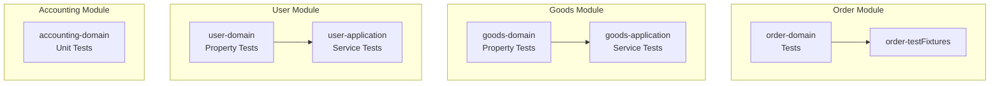
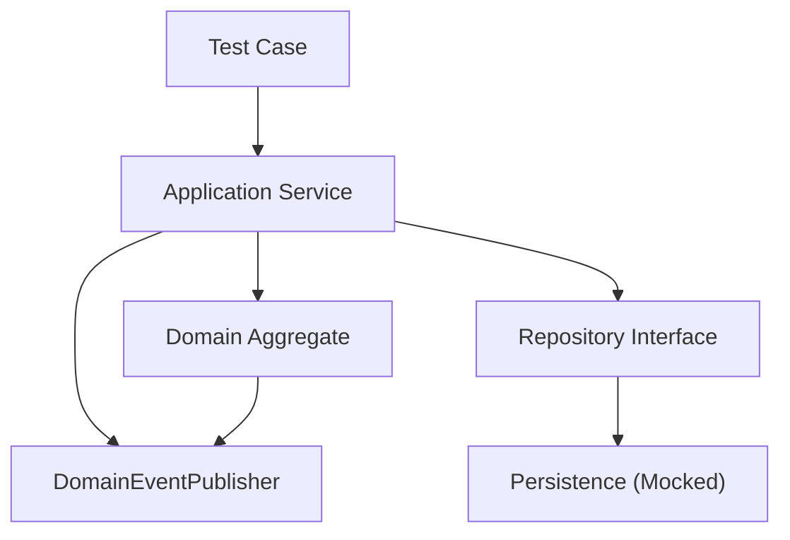
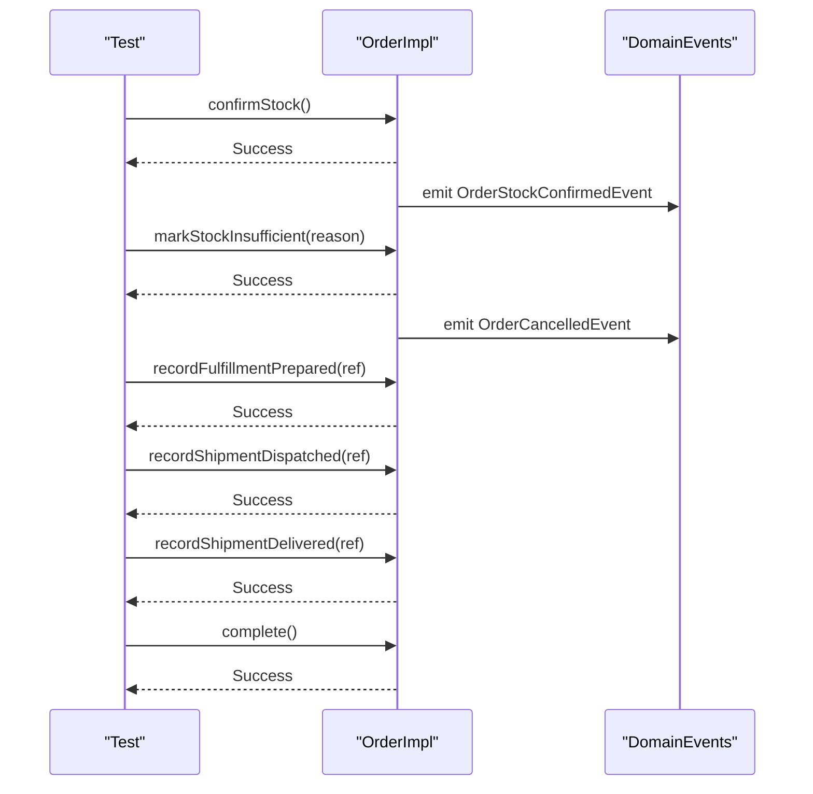
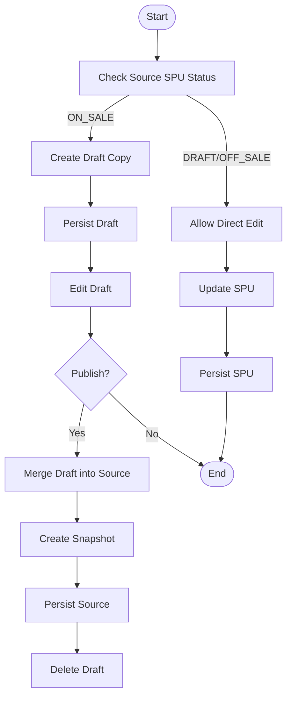
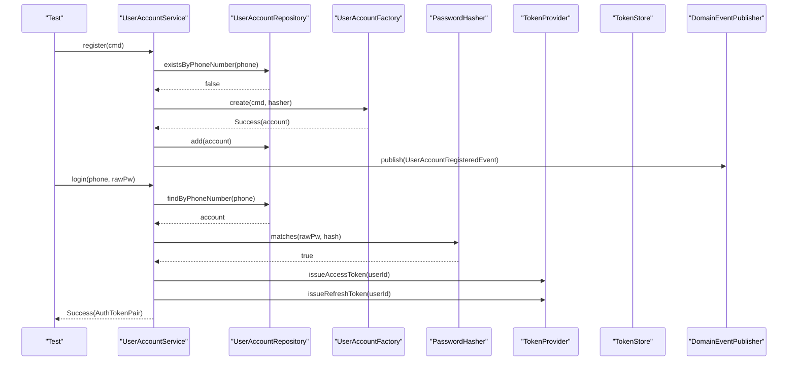
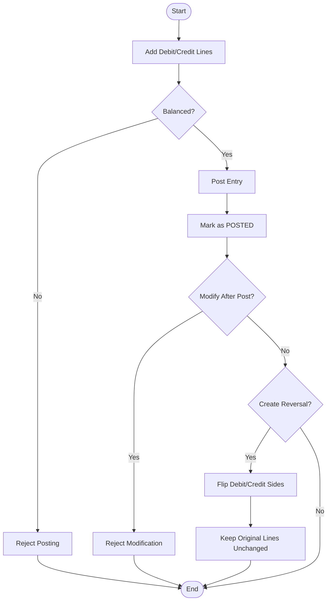
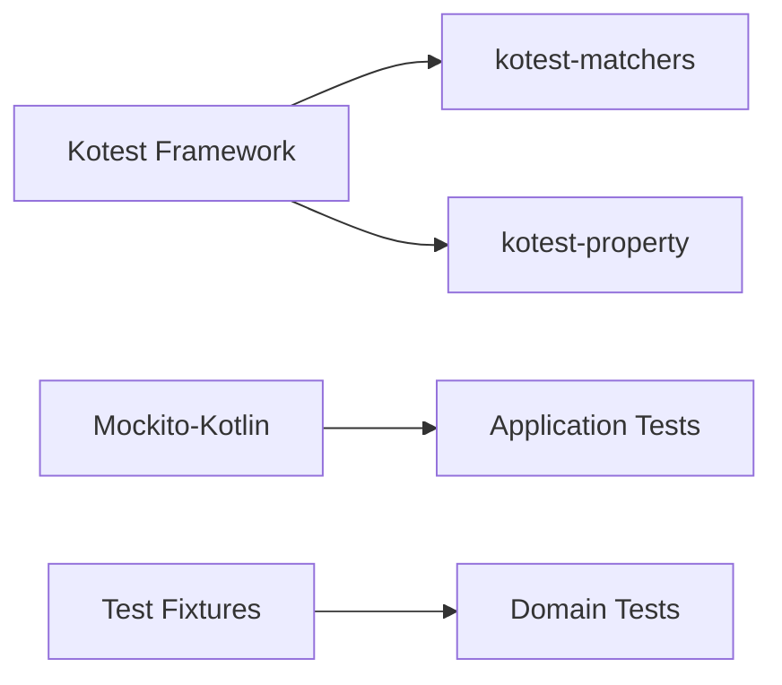

# Unit Testing

<cite>
**Referenced Files in This Document**
- [OrderLifecycleRegressionTest.kt](file://j-store-order-domain/src/test/kotlin/com/jstore/order/domain/order/OrderLifecycleRegressionTest.kt)
- [OrderTestFixtures.kt](file://j-store-order-domain/src/testFixtures/kotlin/com/jstore/order/domain/order/OrderTestFixtures.kt)
- [MergeFromDraftPropertyTest.kt](file://j-store-goods-domain/src/test/kotlin/com/jstore/goods/domain/commodity/MergeFromDraftPropertyTest.kt)
- [CreateDraftCopyDataIntegrityPropertyTest.kt](file://j-store-goods-domain/src/test/kotlin/com/jstore/goods/domain/commodity/CreateDraftCopyDataIntegrityPropertyTest.kt)
- [CommodityServiceDraftFlowTest.kt](file://j-store-goods-application/src/test/kotlin/com/jstore/goods/service/CommodityServiceDraftFlowTest.kt)
- [UserAccountStatusTransitionPropertyTest.kt](file://j-store-user-domain/src/test/kotlin/com/jstore/user/UserAccountStatusTransitionPropertyTest.kt)
- [UserAccountFactoryPropertyTest.kt](file://j-store-user-domain/src/test/kotlin/com/jstore/user/UserAccountFactoryPropertyTest.kt)
- [UserAccountServiceTest.kt](file://j-store-user-application/src/test/kotlin/com/jstore/user/UserAccountServiceTest.kt)
- [JournalEntryUnitTest.kt](file://j-store-accounting-domain/src/test/kotlin/com/jstore/accounting/domain/journal/JournalEntryUnitTest.kt)
</cite>

## Table of Contents
1. [Introduction](#introduction)
2. [Project Structure](#project-structure)
3. [Core Components](#core-components)
4. [Architecture Overview](#architecture-overview)
5. [Detailed Component Analysis](#detailed-component-analysis)
6. [Dependency Analysis](#dependency-analysis)
7. [Performance Considerations](#performance-considerations)
8. [Troubleshooting Guide](#troubleshooting-guide)
9. [Conclusion](#conclusion)

## Introduction
This document explains the unit testing strategy for the J-Store platform using Kotest with property-based testing. It focuses on testing domain aggregates, entities, and value objects in isolation, covering order lifecycle states, commodity draft workflows, user account operations, and accounting ledger operations. It also documents test fixtures, data builders, assertion libraries, business rule validation, state transitions, error conditions, edge cases, naming conventions, and maintainable test organization.

## Project Structure
The repository is organized by bounded contexts (modules), each containing domain, application, infrastructure, and boot layers. Tests are co-located with their respective modules:
- Domain tests validate invariants, state transitions, and business rules without external dependencies.
- Application tests verify use-case orchestration with mocked repositories and services.
- Infrastructure tests focus on persistence adapters and serialization.

[No sources needed since this diagram shows conceptual module layout]

## Core Components
- Kotest FunSpec as the primary test framework.
- Property-based testing via kotest-property Arb and checkAll for robust coverage.
- Assertion library kotest-matchers for readable assertions.
- Mocking with Mockito-Kotlin for application-layer service tests.
- Test fixtures and builders to construct valid domain objects deterministically.

Key patterns observed:
- Domain tests assert state transitions, event emission, and immutability guarantees.
- Property tests encode requirements as universal invariants over generated inputs.
- Service tests isolate orchestration logic with mocks and verify interactions.

**Section sources**
- [OrderLifecycleRegressionTest.kt:1-100](file://j-store-order-domain/src/test/kotlin/com/jstore/order/domain/order/OrderLifecycleRegressionTest.kt#L1-L100)
- [MergeFromDraftPropertyTest.kt:1-112](file://j-store-goods-domain/src/test/kotlin/com/jstore/goods/domain/commodity/MergeFromDraftPropertyTest.kt#L1-L112)
- [CreateDraftCopyDataIntegrityPropertyTest.kt:1-86](file://j-store-goods-domain/src/test/kotlin/com/jstore/goods/domain/commodity/CreateDraftCopyDataIntegrityPropertyTest.kt#L1-L86)
- [UserAccountStatusTransitionPropertyTest.kt:1-67](file://j-store-user-domain/src/test/kotlin/com/jstore/user/UserAccountStatusTransitionPropertyTest.kt#L1-L67)
- [UserAccountFactoryPropertyTest.kt:1-96](file://j-store-user-domain/src/test/kotlin/com/jstore/user/UserAccountFactoryPropertyTest.kt#L1-L96)
- [UserAccountServiceTest.kt:1-269](file://j-store-user-application/src/test/kotlin/com/jstore/user/UserAccountServiceTest.kt#L1-L269)
- [JournalEntryUnitTest.kt:1-128](file://j-store-accounting-domain/src/test/kotlin/com/jstore/accounting/domain/journal/JournalEntryUnitTest.kt#L1-L128)

## Architecture Overview
The testing architecture mirrors the production architecture:
- Domain layer: pure Kotlin classes with no external dependencies; tested directly.
- Application layer: orchestrates domain objects and infrastructure via interfaces; tested with mocks.
- Infrastructure layer: persistence and external integrations; isolated from domain logic.

[No sources needed since this diagram shows conceptual flow]

## Detailed Component Analysis

### Order Lifecycle State Transitions
Focus areas:
- Stock confirmation opens order and emits payment creation gate event.
- Stock failure closes order and emits cancellation event.
- Idempotency prevents duplicate events.
- Fulfillment sequence preserves through delivery and completion.
- Cancellation behavior differs for unpaid vs paid orders.
- Invalid payment does not mutate state partially.

**Diagram sources**
- [OrderLifecycleRegressionTest.kt:15-63](file://j-store-order-domain/src/test/kotlin/com/jstore/order/domain/order/OrderLifecycleRegressionTest.kt#L15-L63)

**Section sources**
- [OrderLifecycleRegressionTest.kt:15-98](file://j-store-order-domain/src/test/kotlin/com/jstore/order/domain/order/OrderLifecycleRegressionTest.kt#L15-L98)
- [OrderTestFixtures.kt:11-64](file://j-store-order-domain/src/testFixtures/kotlin/com/jstore/order/domain/order/OrderTestFixtures.kt#L11-L64)

### Commodity Draft Workflow
Focus areas:
- Creating a draft copy preserves source integrity and sets correct metadata.
- Merging draft into ON_SALE SPU updates fields and increments version.
- Publishing draft merges, snapshots, persists, and deletes draft.
- Discarding draft removes only the draft without affecting source.
- Direct edits blocked for ON_SALE; allowed for DRAFT and OFF_SALE.

**Diagram sources**
- [CreateDraftCopyDataIntegrityPropertyTest.kt:69-84](file://j-store-goods-domain/src/test/kotlin/com/jstore/goods/domain/commodity/CreateDraftCopyDataIntegrityPropertyTest.kt#L69-L84)
- [MergeFromDraftPropertyTest.kt:97-110](file://j-store-goods-domain/src/test/kotlin/com/jstore/goods/domain/commodity/MergeFromDraftPropertyTest.kt#L97-L110)
- [CommodityServiceDraftFlowTest.kt:178-213](file://j-store-goods-application/src/test/kotlin/com/jstore/goods/service/CommodityServiceDraftFlowTest.kt#L178-L213)

**Section sources**
- [CreateDraftCopyDataIntegrityPropertyTest.kt:1-86](file://j-store-goods-domain/src/test/kotlin/com/jstore/goods/domain/commodity/CreateDraftCopyDataIntegrityPropertyTest.kt#L1-L86)
- [MergeFromDraftPropertyTest.kt:1-112](file://j-store-goods-domain/src/test/kotlin/com/jstore/goods/domain/commodity/MergeFromDraftPropertyTest.kt#L1-L112)
- [CommodityServiceDraftFlowTest.kt:93-357](file://j-store-goods-application/src/test/kotlin/com/jstore/goods/service/CommodityServiceDraftFlowTest.kt#L93-L357)

### User Account Operations
Focus areas:
- Factory creates ACTIVE accounts with registered event.
- Status transitions enforce enable/disable rules.
- Service handles registration, login, token refresh, password change, force offline, disable.
- Error conditions include duplicates, invalid tokens, disabled accounts, weak passwords.

**Diagram sources**
- [UserAccountServiceTest.kt:71-118](file://j-store-user-application/src/test/kotlin/com/jstore/user/UserAccountServiceTest.kt#L71-L118)
- [UserAccountFactoryPropertyTest.kt:60-94](file://j-store-user-domain/src/test/kotlin/com/jstore/user/UserAccountFactoryPropertyTest.kt#L60-L94)

**Section sources**
- [UserAccountFactoryPropertyTest.kt:1-96](file://j-store-user-domain/src/test/kotlin/com/jstore/user/UserAccountFactoryPropertyTest.kt#L1-L96)
- [UserAccountStatusTransitionPropertyTest.kt:1-67](file://j-store-user-domain/src/test/kotlin/com/jstore/user/UserAccountStatusTransitionPropertyTest.kt#L1-L67)
- [UserAccountServiceTest.kt:71-267](file://j-store-user-application/src/test/kotlin/com/jstore/user/UserAccountServiceTest.kt#L71-L267)

### Accounting Ledger Operations
Focus areas:
- Journal entries must be balanced to post.
- Posted entries cannot be modified; reversal keeps original lines unchanged.
- Reversal flips debit/credit sides while preserving amounts.

**Diagram sources**
- [JournalEntryUnitTest.kt:31-126](file://j-store-accounting-domain/src/test/kotlin/com/jstore/accounting/domain/journal/JournalEntryUnitTest.kt#L31-L126)

**Section sources**
- [JournalEntryUnitTest.kt:1-128](file://j-store-accounting-domain/src/test/kotlin/com/jstore/accounting/domain/journal/JournalEntryUnitTest.kt#L1-L128)

## Dependency Analysis
- Domain tests depend only on domain models and common utilities; no Spring or I/O.
- Application tests depend on domain models and mock infrastructure via interfaces.
- Property tests rely on Arb generators to produce valid inputs and assert invariants.

[No sources needed since this diagram shows conceptual dependencies]

**Section sources**
- [OrderLifecycleRegressionTest.kt:1-100](file://j-store-order-domain/src/test/kotlin/com/jstore/order/domain/order/OrderLifecycleRegressionTest.kt#L1-L100)
- [CommodityServiceDraftFlowTest.kt:1-49](file://j-store-goods-application/src/test/kotlin/com/jstore/goods/service/CommodityServiceDraftFlowTest.kt#L1-L49)
- [UserAccountServiceTest.kt:1-49](file://j-store-user-application/src/test/kotlin/com/jstore/user/UserAccountServiceTest.kt#L1-L49)

## Performance Considerations
- Use property-based tests judiciously; limit iterations per test to balance coverage and speed.
- Prefer lightweight Arb generators that avoid expensive computations.
- Isolate slow operations (e.g., hashing) behind test doubles where appropriate.
- Avoid heavy object construction in tight loops; reuse fixtures when safe.

[No sources needed since this section provides general guidance]

## Troubleshooting Guide
Common issues and resolutions:
- Flaky property tests due to non-deterministic generators: constrain ranges and ensure uniqueness constraints.
- Mock verification failures: ensure beforeEach reinitializes mocks and stubs consistently.
- Event assertion mismatches: verify pendingDomainEvents() content and ordering explicitly.
- State mutation errors: capture before/after snapshots to detect partial mutations.

**Section sources**
- [OrderLifecycleRegressionTest.kt:86-98](file://j-store-order-domain/src/test/kotlin/com/jstore/order/domain/order/OrderLifecycleRegressionTest.kt#L86-L98)
- [UserAccountServiceTest.kt:104-118](file://j-store-user-application/src/test/kotlin/com/jstore/user/UserAccountServiceTest.kt#L104-L118)

## Conclusion
The J-Store platform employs a robust unit testing strategy centered on Kotest with property-based testing for domain invariants and clear service-level orchestration tests with mocks. This approach ensures high confidence in business rules, state transitions, and integration points while maintaining fast, maintainable tests. Adhering to consistent naming, fixture usage, and assertion patterns enhances readability and reliability across modules.