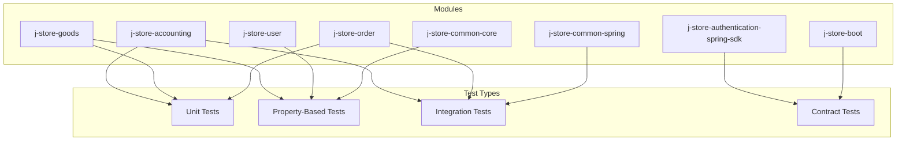
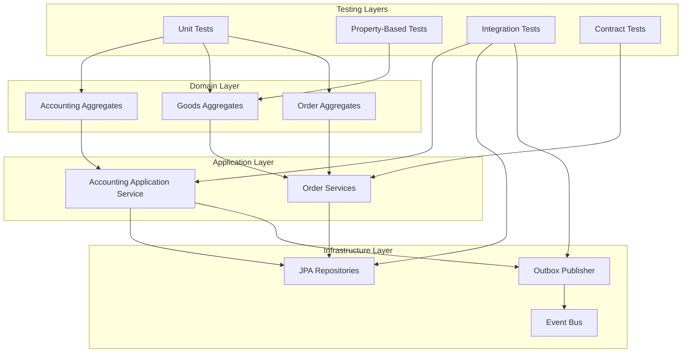
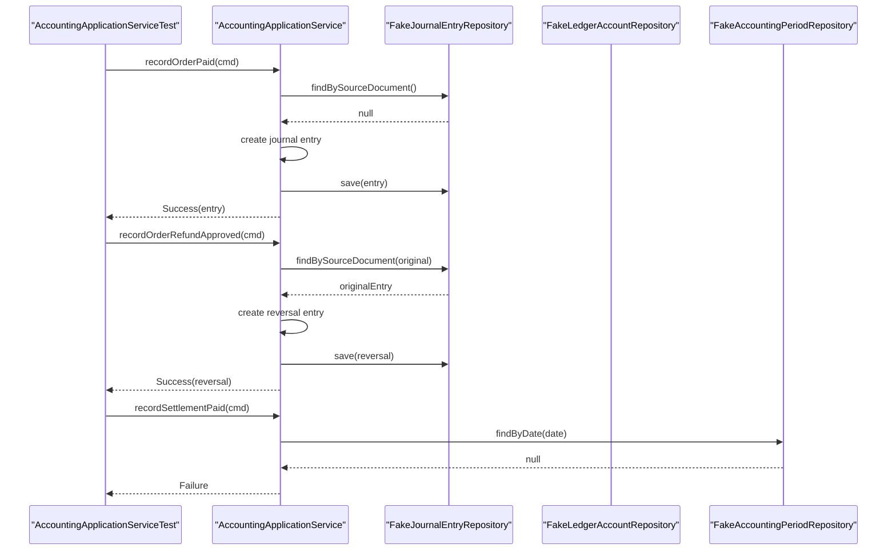
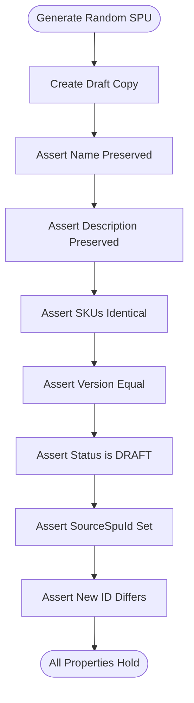
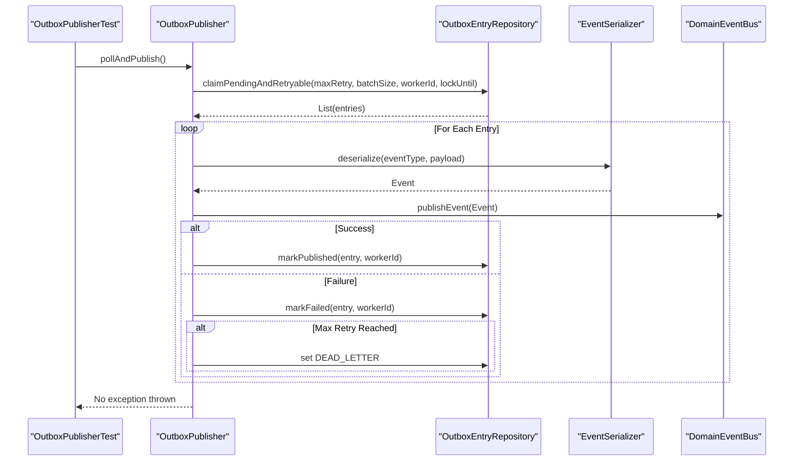
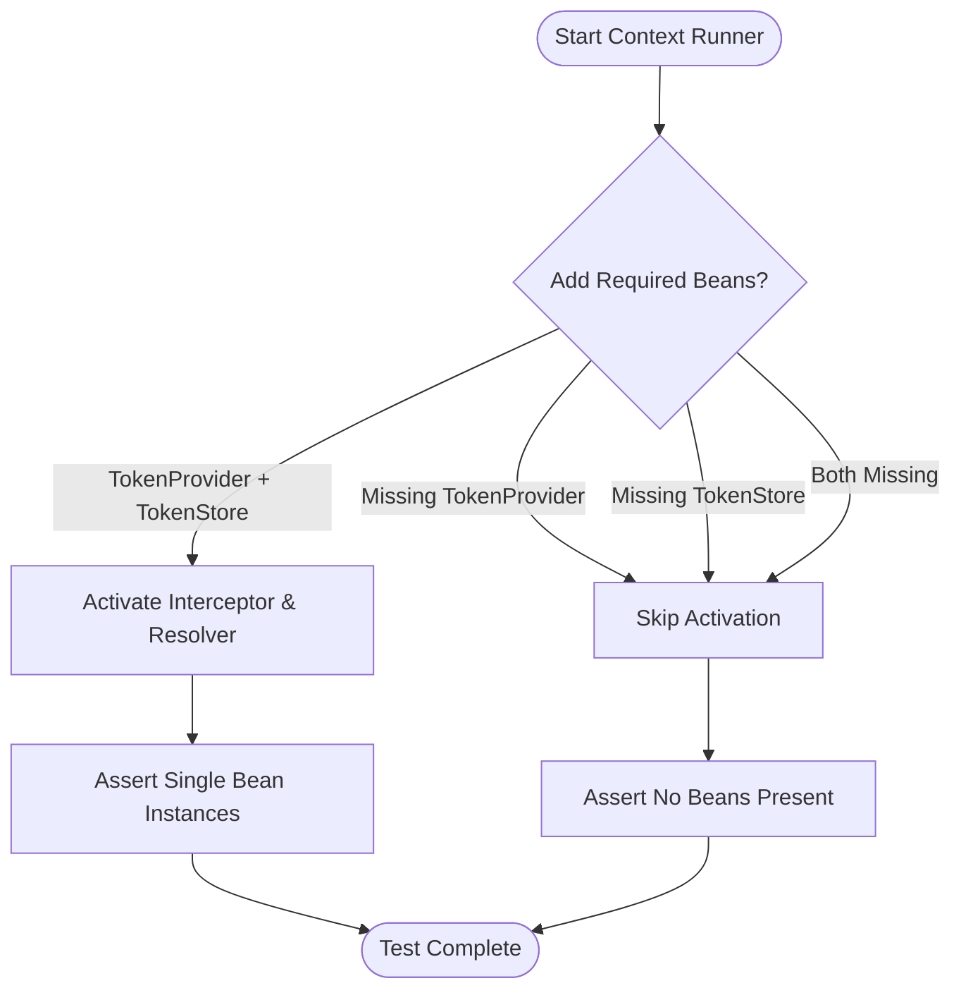
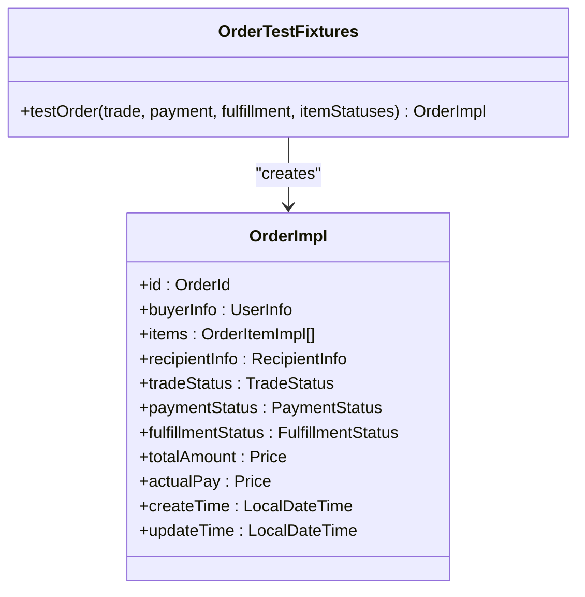
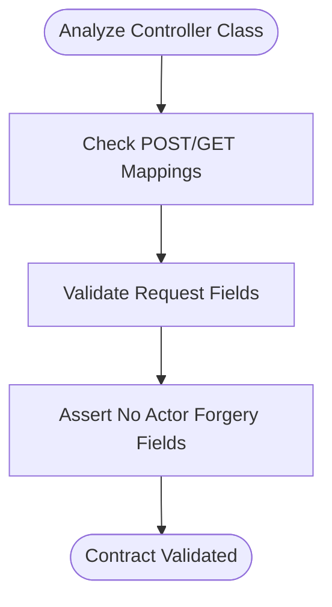
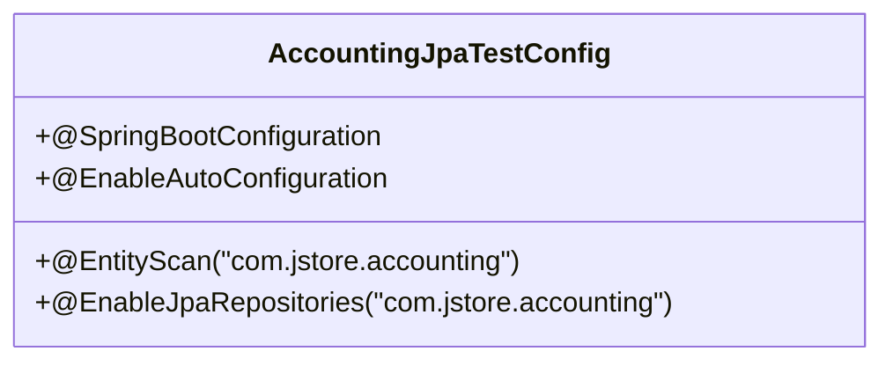
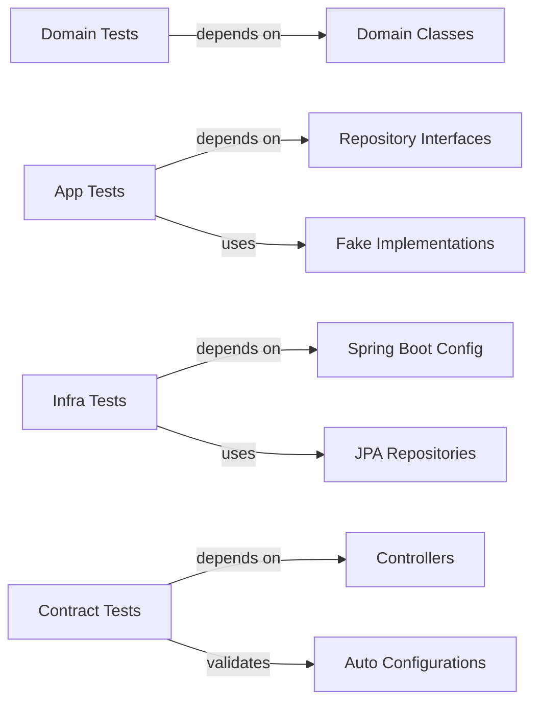

# Testing Strategy and Implementation

<cite>
**Referenced Files in This Document**
- [README.md](file://README.md)
- [AccountingApplicationServiceTest.kt](file://j-store-accounting/src/test/kotlin/com/jstore/accounting/service/AccountingApplicationServiceTest.kt)
- [FakeAccountingRepositories.kt](file://j-store-accounting/src/test/kotlin/com/jstore/accounting/service/FakeAccountingRepositories.kt)
- [CreateDraftCopyDataIntegrityPropertyTest.kt](file://j-store-goods/src/test/kotlin/com/jstore/goods/domain/commodity/CreateDraftCopyDataIntegrityPropertyTest.kt)
- [OutboxPublisherTest.kt](file://j-store-common-spring/src/test/kotlin/com/jstore/common/framework/event/outbox/OutboxPublisherTest.kt)
- [AuthenticationAutoConfigurationTest.kt](file://j-store-authentication-spring-sdk/src/test/kotlin/com/jstore/authentication/spring/AuthenticationAutoConfigurationTest.kt)
- [OrderTestFixtures.kt](file://j-store-order/src/test/kotlin/com/jstore/order/domain/order/OrderTestFixtures.kt)
- [AfterSaleControllerContractTest.kt](file://j-store-boot/src/test/kotlin/com/jstore/order/controller/AfterSaleControllerContractTest.kt)
- [AccountingJpaTestConfig.kt](file://j-store-accounting-infrastructure/src/test/kotlin/com/jstore/accounting/AccountingJpaTestConfig.kt)
</cite>

## Table of Contents
1. [Introduction](#introduction)
2. [Project Structure](#project-structure)
3. [Core Components](#core-components)
4. [Architecture Overview](#architecture-overview)
5. [Detailed Component Analysis](#detailed-component-analysis)
6. [Dependency Analysis](#dependency-analysis)
7. [Performance Considerations](#performance-considerations)
8. [Troubleshooting Guide](#troubleshooting-guide)
9. [Conclusion](#conclusion)
10. [Appendices](#appendices)

## Introduction
This document explains J-Store’s testing strategy and implementation across unit, integration, and contract tests. It focuses on:
- Unit testing with Kotest and property-based testing patterns for domain logic
- Integration testing for database operations, event handling, and cross-module interactions
- Test data management using fixtures and factories
- Best practices for asynchronous operations, event-driven code, and external dependencies
- Performance and load testing considerations
- Guidelines for maintainable tests and organizing test suites
- Examples covering authentication flows, transaction boundaries, and error scenarios

The repository uses a modular architecture (accounting, goods, order, user, common, spring integrations, boot) with clear separation between domain, application services, and infrastructure layers. Tests are organized per module to reflect these boundaries.

## Project Structure
Tests follow the standard Gradle layout under each module’s src/test directory. The project includes:
- Domain unit tests validating business rules and invariants
- Application service tests using fakes to isolate behavior
- Infrastructure tests with Spring Boot configuration for JPA repositories
- Contract tests for controllers and auto-configurations
- Property-based tests for robustness and edge-case coverage

[No sources needed since this diagram shows conceptual structure]

**Section sources**
- [README.md:1-53](file://README.md#L1-L53)

## Core Components
Key testing components and patterns observed:
- Kotest FunSpec specs for unit and property-based tests
- Mocking via Mockito-Kotlin for external dependencies
- Spring WebApplicationContextRunner for auto-configuration validation
- In-memory fakes for repositories to isolate application logic
- Fixtures and factories for consistent test data creation
- JPA test configuration for repository integration tests

Examples include:
- Accounting application service tests verifying idempotency and accounting period checks
- Goods domain property tests ensuring data integrity during draft copy operations
- Outbox publisher tests validating delivery, retry, failure, and dead-letter transitions
- Authentication auto-configuration tests ensuring conditional bean activation
- Order fixtures simplifying aggregate construction for tests

**Section sources**
- [AccountingApplicationServiceTest.kt:1-148](file://j-store-accounting/src/test/kotlin/com/jstore/accounting/service/AccountingApplicationServiceTest.kt#L1-L148)
- [FakeAccountingRepositories.kt:1-96](file://j-store-accounting/src/test/kotlin/com/jstore/accounting/service/FakeAccountingRepositories.kt#L1-L96)
- [CreateDraftCopyDataIntegrityPropertyTest.kt:1-86](file://j-store-goods/src/test/kotlin/com/jstore/goods/domain/commodity/CreateDraftCopyDataIntegrityPropertyTest.kt#L1-L86)
- [OutboxPublisherTest.kt:1-288](file://j-store-common-spring/src/test/kotlin/com/jstore/common/framework/event/outbox/OutboxPublisherTest.kt#L1-L288)
- [AuthenticationAutoConfigurationTest.kt:1-62](file://j-store-authentication-spring-sdk/src/test/kotlin/com/jstore/authentication/spring/AuthenticationAutoConfigurationTest.kt#L1-L62)
- [OrderTestFixtures.kt:1-58](file://j-store-order/src/test/kotlin/com/jstore/order/domain/order/OrderTestFixtures.kt#L1-L58)
- [AccountingJpaTestConfig.kt:1-13](file://j-store-accounting-infrastructure/src/test/kotlin/com/jstore/accounting/AccountingJpaTestConfig.kt#L1-L13)

## Architecture Overview
The testing architecture mirrors the production architecture:
- Domain layer tests validate aggregates and value objects without external dependencies
- Application service tests use fakes to simulate repositories and verify command handling
- Infrastructure tests configure Spring contexts to exercise JPA repositories and outbox mechanisms
- Contract tests ensure API surface stability and security constraints

[No sources needed since this diagram shows conceptual architecture]

## Detailed Component Analysis

### Accounting Application Service Tests
These tests validate command processing, idempotency, and accounting period enforcement using fakes for repositories. They assert journal entry creation, reversal behavior, and failure paths when periods are closed or original entries are missing.

**Diagram sources**
- [AccountingApplicationServiceTest.kt:1-148](file://j-store-accounting/src/test/kotlin/com/jstore/accounting/service/AccountingApplicationServiceTest.kt#L1-L148)
- [FakeAccountingRepositories.kt:1-96](file://j-store-accounting/src/test/kotlin/com/jstore/accounting/service/FakeAccountingRepositories.kt#L1-L96)

**Section sources**
- [AccountingApplicationServiceTest.kt:1-148](file://j-store-accounting/src/test/kotlin/com/jstore/accounting/service/AccountingApplicationServiceTest.kt#L1-L148)
- [FakeAccountingRepositories.kt:1-96](file://j-store-accounting/src/test/kotlin/com/jstore/accounting/service/FakeAccountingRepositories.kt#L1-L96)

### Goods Domain Property-Based Tests
Property-based tests ensure data integrity during draft copy operations by generating random but valid SPU instances and asserting invariants such as name preservation, SKU consistency, version equality, and status transitions.

**Diagram sources**
- [CreateDraftCopyDataIntegrityPropertyTest.kt:1-86](file://j-store-goods/src/test/kotlin/com/jstore/goods/domain/commodity/CreateDraftCopyDataIntegrityPropertyTest.kt#L1-L86)

**Section sources**
- [CreateDraftCopyDataIntegrityPropertyTest.kt:1-86](file://j-store-goods/src/test/kotlin/com/jstore/goods/domain/commodity/CreateDraftCopyDataIntegrityPropertyTest.kt#L1-L86)

### Outbox Publisher Integration Tests
These tests validate the outbox mechanism including polling, delivery, retry logic, failure handling, and dead-letter transitions. They also verify transaction boundaries and scheduling resilience.

**Diagram sources**
- [OutboxPublisherTest.kt:1-288](file://j-store-common-spring/src/test/kotlin/com/jstore/common/framework/event/outbox/OutboxPublisherTest.kt#L1-L288)

**Section sources**
- [OutboxPublisherTest.kt:1-288](file://j-store-common-spring/src/test/kotlin/com/jstore/common/framework/event/outbox/OutboxPublisherTest.kt#L1-L288)

### Authentication Auto-Configuration Tests
These tests verify conditional activation of authentication components based on the presence of required beans. They ensure that interceptors and argument resolvers are only registered when both TokenProvider and TokenStore are available.

**Diagram sources**
- [AuthenticationAutoConfigurationTest.kt:1-62](file://j-store-authentication-spring-sdk/src/test/kotlin/com/jstore/authentication/spring/AuthenticationAutoConfigurationTest.kt#L1-L62)

**Section sources**
- [AuthenticationAutoConfigurationTest.kt:1-62](file://j-store-authentication-spring-sdk/src/test/kotlin/com/jstore/authentication/spring/AuthenticationAutoConfigurationTest.kt#L1-L62)

### Order Test Fixtures
Fixtures provide consistent and reusable test data for order aggregates, simplifying test setup and reducing duplication across test cases.

**Diagram sources**
- [OrderTestFixtures.kt:1-58](file://j-store-order/src/test/kotlin/com/jstore/order/domain/order/OrderTestFixtures.kt#L1-L58)

**Section sources**
- [OrderTestFixtures.kt:1-58](file://j-store-order/src/test/kotlin/com/jstore/order/domain/order/OrderTestFixtures.kt#L1-L58)

### Controller Contract Tests
Contract tests ensure controller endpoints expose expected routes and enforce security constraints by validating request models do not allow actor forgery.

**Diagram sources**
- [AfterSaleControllerContractTest.kt:1-8](file://j-store-boot/src/test/kotlin/com/jstore/order/controller/AfterSaleControllerContractTest.kt#L1-L8)

**Section sources**
- [AfterSaleControllerContractTest.kt:1-8](file://j-store-boot/src/test/kotlin/com/jstore/order/controller/AfterSaleControllerContractTest.kt#L1-L8)

### JPA Integration Test Configuration
A minimal Spring Boot configuration enables entity scanning and repository discovery for integration tests, allowing database-backed tests without full application context.

**Diagram sources**
- [AccountingJpaTestConfig.kt:1-13](file://j-store-accounting-infrastructure/src/test/kotlin/com/jstore/accounting/AccountingJpaTestConfig.kt#L1-L13)

**Section sources**
- [AccountingJpaTestConfig.kt:1-13](file://j-store-accounting-infrastructure/src/test/kotlin/com/jstore/accounting/AccountingJpaTestConfig.kt#L1-L13)

## Dependency Analysis
Testing dependencies are structured to mirror production modules:
- Domain tests depend only on domain classes and utilities
- Application tests depend on interfaces and fakes
- Infrastructure tests depend on Spring Boot and JPA configurations
- Contract tests depend on Spring Web and auto-configuration classes

[No sources needed since this diagram shows conceptual dependencies]

## Performance Considerations
- Property-based tests should limit generation size to balance coverage and execution time
- Outbox publisher tests verify batch sizes and retry limits; tune these parameters for realistic workloads
- Integration tests should use in-memory databases where possible to reduce I/O overhead
- Avoid heavy initialization in test setup; use lightweight fixtures and fakes
- Consider parallel test execution for independent specs to speed up CI pipelines

[No sources needed since this section provides general guidance]

## Troubleshooting Guide
Common issues and resolutions:
- **Transaction boundary failures**: Ensure delivery and failure updates run in separate transactions as validated by recording transaction operations
- **Event deserialization errors**: Verify event serializers handle all event types and payloads correctly
- **Bean activation problems**: Confirm required beans are present for conditional auto-configuration
- **Database connectivity**: Use local Docker services as documented in README for consistent test environments
- **Assertion failures in contracts**: Validate controller mappings and request model fields match requirements

**Section sources**
- [OutboxPublisherTest.kt:1-288](file://j-store-common-spring/src/test/kotlin/com/jstore/common/framework/event/outbox/OutboxPublisherTest.kt#L1-L288)
- [AuthenticationAutoConfigurationTest.kt:1-62](file://j-store-authentication-spring-sdk/src/test/kotlin/com/jstore/authentication/spring/AuthenticationAutoConfigurationTest.kt#L1-L62)
- [README.md:1-53](file://README.md#L1-L53)

## Conclusion
J-Store’s testing strategy combines unit, property-based, integration, and contract tests to ensure robustness across all layers. The approach emphasizes isolation through fakes, comprehensive coverage through property-based testing, and reliability through integration tests with Spring Boot configurations. Following the guidelines and examples provided will help maintain high-quality, maintainable tests that evolve with the system.

[No sources needed since this section summarizes without analyzing specific files]

## Appendices
- Local development environment setup using Docker Compose for PostgreSQL and Redis
- Gradle test execution commands for running specific test suites
- Best practices for organizing test packages and naming conventions

[No sources needed since this section provides general guidance]