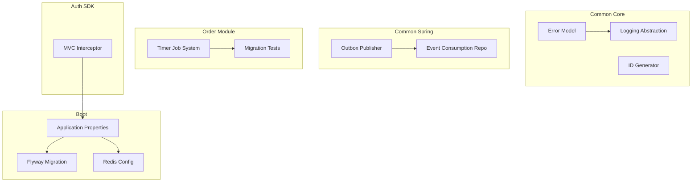
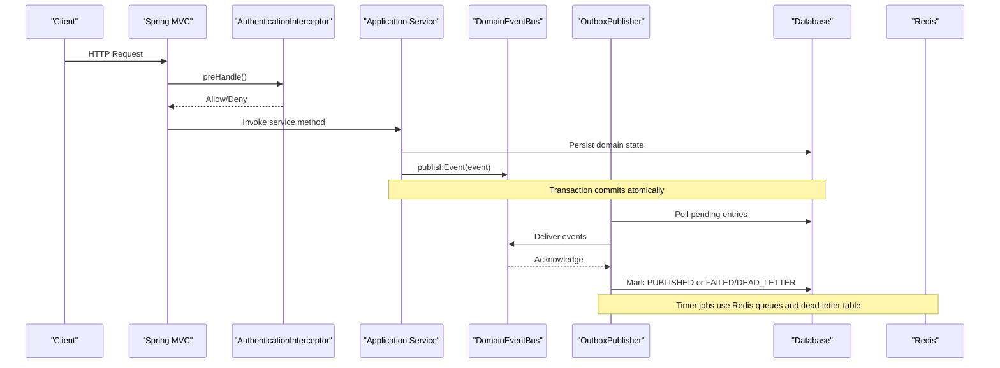
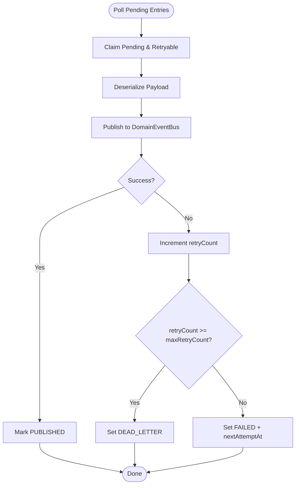
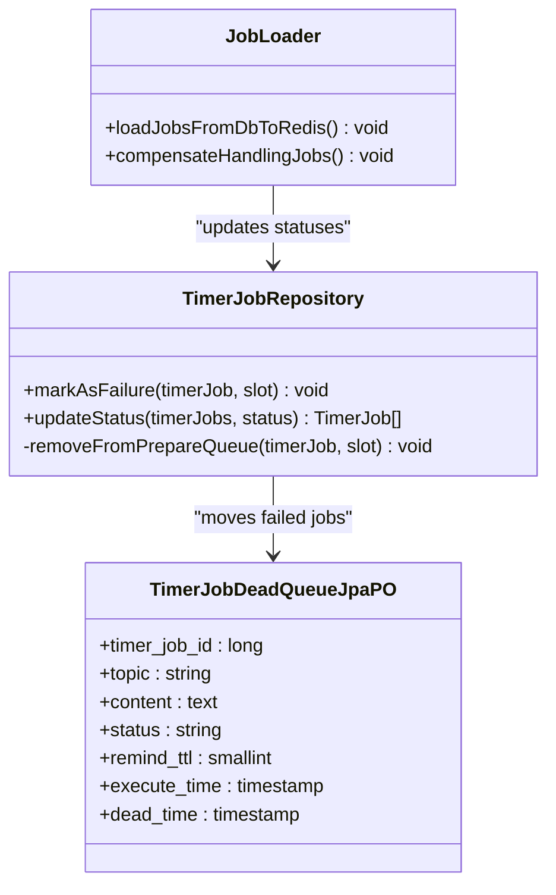
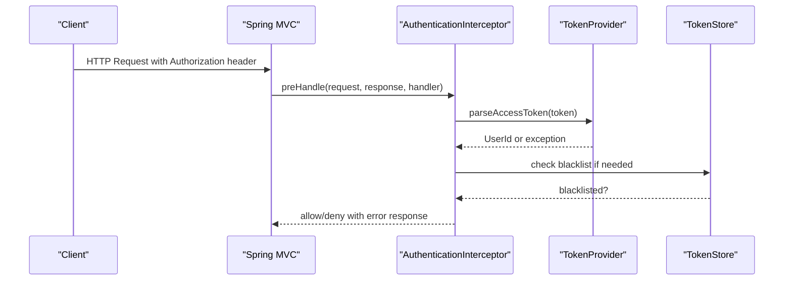
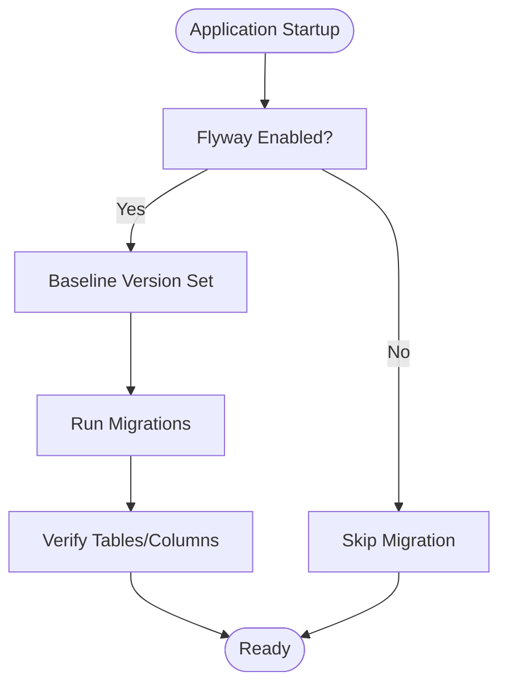
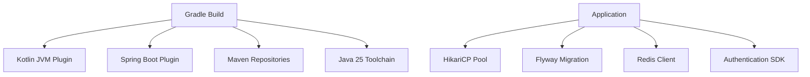

# Troubleshooting and FAQ

<cite>
**Referenced Files in This Document**
- [README.md](file://README.md)
- [build.gradle.kts](file://build.gradle.kts)
- [application.properties](file://j-store-boot/src/main/resources/application.properties)
- [application-local.properties](file://j-store-boot/src/main/resources/application-local.properties)
- [Errors.kt](file://j-store-common-core/src/main/kotlin/com/jstore/common/errors/Errors.kt)
- [LogException.kt](file://j-store-common-core/src/main/kotlin/com/jstore/common/logging/LogException.kt)
- [Logger.kt](file://j-store-common-core/src/main/kotlin/com/jstore/common/logging/Logger.kt)
- [Slf4jLocationAwareLoggerImpl.kt](file://j-store-common-core/src/main/kotlin/com/jstore/common/logging/slf4j/Slf4jLocationAwareLoggerImpl.kt)
- [OutboxPublisher.kt](file://j-store-common-spring/src/main/kotlin/com/jstore/common/framework/event/outbox/OutboxPublisher.kt)
- [DomainEventConsumptionRepositoryImpl.kt](file://j-store-common-spring/src/main/kotlin/com/jstore/common/framework/event/persistence/DomainEventConsumptionRepositoryImpl.kt)
- [OrderAfterSaleSchemaMigrationTest.kt](file://j-store-boot/src/test/kotlin/com/jstore/order/migration/OrderAfterSaleSchemaMigrationTest.kt)
- [V20260507__baseline_j_store_boot_schema.sql](file://j-store-boot/src/main/resources/db/migration/V20260507__baseline_j_store_boot_schema.sql)
- [init_j_store_boot_schema.sql](file://j-store-boot/src/main/resources/db/init/init_j_store_boot_schema.sql)
- [JobLoader.java](file://j-store-boot/src/main/java/com/jstore/order/expired/JobLoader.java)
- [TimerJobDeadQueueJpaPO.java](file://j-store-boot/src/main/java/com/jstore/order/expired/TimerJobDeadQueueJpaPO.java)
- [TimerJobRepository.java](file://j-store-boot/src/main/java/com/jstore/order/expired/TimerJobRepository.java)
- [AuthenticationAutoConfiguration.kt](file://j-store-authentication-spring-sdk/src/main/kotlin/com/jstore/authentication/spring/AuthenticationAutoConfiguration.kt)
- [BearerTokenExtractionPropertyTest.kt](file://j-store-authentication-spring-sdk/src/test/kotlin/com/jstore/authentication/spring/BearerTokenExtractionPropertyTest.kt)
- [TokenValidationErrorPropertyTest.kt](file://j-store-authentication-spring-sdk/src/test/kotlin/com/jstore/authentication/spring/TokenValidationErrorPropertyTest.kt)
- [SnowFlakSequence.kt](file://j-store-common-core/src/main/kotlin/com/jstore/common/persistent/SnowFlakSequence.kt)
</cite>

## Table of Contents
1. [Introduction](#introduction)
2. [Project Structure](#project-structure)
3. [Core Components](#core-components)
4. [Architecture Overview](#architecture-overview)
5. [Detailed Component Analysis](#detailed-component-analysis)
6. [Dependency Analysis](#dependency-analysis)
7. [Performance Considerations](#performance-considerations)
8. [Troubleshooting Guide](#troubleshooting-guide)
9. [Conclusion](#conclusion)
10. [Appendices](#appendices)

## Introduction
This document provides comprehensive troubleshooting and FAQ guidance for J-Store across development, deployment, and operation. It focuses on:
- Debugging domain logic errors, event processing failures, and database connectivity problems
- Performance optimization strategies, memory tuning, and query optimization
- Database schema migration procedures and dependency updates
- Architecture decisions, design patterns, and implementation choices
- Diagnostic tools and logging strategies to identify and resolve issues
- Known limitations and workarounds for common scenarios

The content is grounded in the repository’s configuration, infrastructure, and core modules.

## Project Structure
J-Store is a multi-module Spring Boot application with clear separation between domain modules (order, goods, accounting, user), shared common libraries, and bootstrapping modules. Key operational aspects include:
- Local environment setup via Docker Compose and local properties
- Flyway-based schema migrations
- Outbox pattern for reliable event delivery
- Timer job system with Redis-backed queues and dead-letter handling
- Authentication SDK integrated via Spring MVC interceptors

**Diagram sources**
- [application.properties:1-11](file://j-store-boot/src/main/resources/application.properties#L1-L11)
- [application-local.properties:1-43](file://j-store-boot/src/main/resources/application-local.properties#L1-L43)
- [Errors.kt:1-45](file://j-store-common-core/src/main/kotlin/com/jstore/common/errors/Errors.kt#L1-L45)
- [Logger.kt:1-25](file://j-store-common-core/src/main/kotlin/com/jstore/common/logging/Logger.kt#L1-L25)
- [OutboxPublisher.kt:86-117](file://j-store-common-spring/src/main/kotlin/com/jstore/common/framework/event/outbox/OutboxPublisher.kt#L86-L117)
- [DomainEventConsumptionRepositoryImpl.kt:1-32](file://j-store-common-spring/src/main/kotlin/com/jstore/common/framework/event/persistence/DomainEventConsumptionRepositoryImpl.kt#L1-L32)
- [JobLoader.java:66-94](file://j-store-boot/src/main/java/com/jstore/order/expired/JobLoader.java#L66-L94)
- [OrderAfterSaleSchemaMigrationTest.kt:1-13](file://j-store-boot/src/test/kotlin/com/jstore/order/migration/OrderAfterSaleSchemaMigrationTest.kt#L1-L13)
- [AuthenticationAutoConfiguration.kt:26-53](file://j-store-authentication-spring-sdk/src/main/kotlin/com/jstore/authentication/spring/AuthenticationAutoConfiguration.kt#L26-L53)

**Section sources**
- [README.md:1-53](file://README.md#L1-L53)
- [build.gradle.kts:1-28](file://build.gradle.kts#L1-L28)
- [application.properties:1-11](file://j-store-boot/src/main/resources/application.properties#L1-L11)
- [application-local.properties:1-43](file://j-store-boot/src/main/resources/application-local.properties#L1-L43)

## Core Components
- Error model: Centralized error types with HTTP codes and error codes for consistent responses.
- Logging abstraction: Logger interface with SLF4J implementation for location-aware logging.
- Outbox publisher: Reliable asynchronous event delivery with retry and dead-letter handling.
- Event consumption tracking: Idempotent consumption records to prevent duplicate processing.
- Timer job system: Background job scheduling with Redis queues, compensation scans, and dead-letter queue.
- Authentication SDK: Spring MVC interceptor for token validation and context propagation.

**Section sources**
- [Errors.kt:1-45](file://j-store-common-core/src/main/kotlin/com/jstore/common/errors/Errors.kt#L1-L45)
- [Logger.kt:1-25](file://j-store-common-core/src/main/kotlin/com/jstore/common/logging/Logger.kt#L1-L25)
- [Slf4jLocationAwareLoggerImpl.kt:36-71](file://j-store-common-core/src/main/kotlin/com/jstore/common/logging/slf4j/Slf4jLocationAwareLoggerImpl.kt#L36-L71)
- [OutboxPublisher.kt:86-117](file://j-store-common-spring/src/main/kotlin/com/jstore/common/framework/event/outbox/OutboxPublisher.kt#L86-L117)
- [DomainEventConsumptionRepositoryImpl.kt:1-32](file://j-store-common-spring/src/main/kotlin/com/jstore/common/framework/event/persistence/DomainEventConsumptionRepositoryImpl.kt#L1-L32)
- [JobLoader.java:66-94](file://j-store-boot/src/main/java/com/jstore/order/expired/JobLoader.java#L66-L94)
- [TimerJobDeadQueueJpaPO.java:44-58](file://j-store-boot/src/main/java/com/jstore/order/expired/TimerJobDeadQueueJpaPO.java#L44-L58)
- [TimerJobRepository.java:210-238](file://j-store-boot/src/main/java/com/jstore/order/expired/TimerJobRepository.java#L210-L238)
- [AuthenticationAutoConfiguration.kt:26-53](file://j-store-authentication-spring-sdk/src/main/kotlin/com/jstore/authentication/spring/AuthenticationAutoConfiguration.kt#L26-L53)

## Architecture Overview
The system uses an outbox pattern for reliable eventing, a timer job subsystem for background tasks, and a modular architecture with clear boundaries. The authentication layer integrates via Spring MVC interceptors.

**Diagram sources**
- [OutboxPublisher.kt:86-117](file://j-store-common-spring/src/main/kotlin/com/jstore/common/framework/event/outbox/OutboxPublisher.kt#L86-L117)
- [DomainEventConsumptionRepositoryImpl.kt:1-32](file://j-store-common-spring/src/main/kotlin/com/jstore/common/framework/event/persistence/DomainEventConsumptionRepositoryImpl.kt#L1-L32)
- [JobLoader.java:66-94](file://j-store-boot/src/main/java/com/jstore/order/expired/JobLoader.java#L66-L94)
- [TimerJobDeadQueueJpaPO.java:44-58](file://j-store-boot/src/main/java/com/jstore/order/expired/TimerJobDeadQueueJpaPO.java#L44-L58)
- [TimerJobRepository.java:210-238](file://j-store-boot/src/main/java/com/jstore/order/expired/TimerJobRepository.java#L210-L238)
- [AuthenticationAutoConfiguration.kt:26-53](file://j-store-authentication-spring-sdk/src/main/kotlin/com/jstore/authentication/spring/AuthenticationAutoConfiguration.kt#L26-L53)

## Detailed Component Analysis

### Outbox Event Delivery
The outbox ensures reliable asynchronous event delivery with retries and dead-letter handling. Failures increment retry counts; exceeding max retries moves entries to dead-letter.

**Diagram sources**
- [OutboxPublisher.kt:86-117](file://j-store-common-spring/src/main/kotlin/com/jstore/common/framework/event/outbox/OutboxPublisher.kt#L86-L117)

**Section sources**
- [OutboxPublisher.kt:86-117](file://j-store-common-spring/src/main/kotlin/com/jstore/common/framework/event/outbox/OutboxPublisher.kt#L86-L117)

### Timer Job System
Background jobs are scheduled using Redis queues with compensation scanning to recover from failures. Jobs that fail repeatedly move to a dead-letter table.

**Diagram sources**
- [TimerJobRepository.java:210-238](file://j-store-boot/src/main/java/com/jstore/order/expired/TimerJobRepository.java#L210-L238)
- [JobLoader.java:66-94](file://j-store-boot/src/main/java/com/jstore/order/expired/JobLoader.java#L66-L94)
- [TimerJobDeadQueueJpaPO.java:44-58](file://j-store-boot/src/main/java/com/jstore/order/expired/TimerJobDeadQueueJpaPO.java#L44-L58)

**Section sources**
- [TimerJobRepository.java:210-238](file://j-store-boot/src/main/java/com/jstore/order/expired/TimerJobRepository.java#L210-L238)
- [JobLoader.java:66-94](file://j-store-boot/src/main/java/com/jstore/order/expired/JobLoader.java#L66-L94)
- [TimerJobDeadQueueJpaPO.java:44-58](file://j-store-boot/src/main/java/com/jstore/order/expired/TimerJobDeadQueueJpaPO.java#L44-L58)

### Authentication Interceptor
The authentication SDK integrates via Spring MVC interceptors to validate tokens and set authenticated user context. Missing or invalid tokens produce standardized error responses.

**Diagram sources**
- [AuthenticationAutoConfiguration.kt:26-53](file://j-store-authentication-spring-sdk/src/main/kotlin/com/jstore/authentication/spring/AuthenticationAutoConfiguration.kt#L26-L53)
- [BearerTokenExtractionPropertyTest.kt:33-62](file://j-store-authentication-spring-sdk/src/test/kotlin/com/jstore/authentication/spring/BearerTokenExtractionPropertyTest.kt#L33-L62)
- [TokenValidationErrorPropertyTest.kt:61-144](file://j-store-authentication-spring-sdk/src/test/kotlin/com/jstore/authentication/spring/TokenValidationErrorPropertyTest.kt#L61-L144)

**Section sources**
- [AuthenticationAutoConfiguration.kt:26-53](file://j-store-authentication-spring-sdk/src/main/kotlin/com/jstore/authentication/spring/AuthenticationAutoConfiguration.kt#L26-L53)
- [BearerTokenExtractionPropertyTest.kt:33-62](file://j-store-authentication-spring-sdk/src/test/kotlin/com/jstore/authentication/spring/BearerTokenExtractionPropertyTest.kt#L33-L62)
- [TokenValidationErrorPropertyTest.kt:61-144](file://j-store-authentication-spring-sdk/src/test/kotlin/com/jstore/authentication/spring/TokenValidationErrorPropertyTest.kt#L61-L144)

### Database Schema Migrations
Flyway manages schema migrations with baseline support. Tests verify independent after-sale schema creation and removal of legacy columns.

**Diagram sources**
- [application.properties:5-11](file://j-store-boot/src/main/resources/application.properties#L5-L11)
- [OrderAfterSaleSchemaMigrationTest.kt:1-13](file://j-store-boot/src/test/kotlin/com/jstore/order/migration/OrderAfterSaleSchemaMigrationTest.kt#L1-L13)
- [V20260507__baseline_j_store_boot_schema.sql:179-215](file://j-store-boot/src/main/resources/db/migration/V20260507__baseline_j_store_boot_schema.sql#L179-L215)
- [init_j_store_boot_schema.sql:179-215](file://j-store-boot/src/main/resources/db/init/init_j_store_boot_schema.sql#L179-L215)

**Section sources**
- [application.properties:5-11](file://j-store-boot/src/main/resources/application.properties#L5-L11)
- [OrderAfterSaleSchemaMigrationTest.kt:1-13](file://j-store-boot/src/test/kotlin/com/jstore/order/migration/OrderAfterSaleSchemaMigrationTest.kt#L1-L13)
- [V20260507__baseline_j_store_boot_schema.sql:179-215](file://j-store-boot/src/main/resources/db/migration/V20260507__baseline_j_store_boot_schema.sql#L179-L215)
- [init_j_store_boot_schema.sql:179-215](file://j-store-boot/src/main/resources/db/init/init_j_store_boot_schema.sql#L179-L215)

## Dependency Analysis
Key dependencies include Spring Boot, Flyway, HikariCP, Redis, and Kotlin/Java toolchain. The build configuration centralizes version management and repositories.

**Diagram sources**
- [build.gradle.kts:1-28](file://build.gradle.kts#L1-L28)
- [application-local.properties:1-43](file://j-store-boot/src/main/resources/application-local.properties#L1-L43)

**Section sources**
- [build.gradle.kts:1-28](file://build.gradle.kts#L1-L28)
- [application-local.properties:1-43](file://j-store-boot/src/main/resources/application-local.properties#L1-L43)

## Performance Considerations
- Connection pooling: Tune HikariCP pool size and auto-commit settings based on workload.
- Outbox batching: Adjust batch size and retry limits to balance throughput and latency.
- Redis operations: Monitor TTL and queue sizes to prevent memory pressure.
- Query optimization: Ensure proper indexes on frequently queried columns (e.g., execute_time, status).
- Logging levels: Use appropriate log levels to reduce overhead while maintaining visibility.

[No sources needed since this section provides general guidance]

## Troubleshooting Guide

### Development Setup Issues
- **Docker Compose not starting**: Verify Docker Desktop installation and network connectivity to PostgreSQL and Redis endpoints.
- **Local properties misconfiguration**: Check host, port, credentials, and schema settings in local properties file.
- **Port conflicts**: Ensure no other services are using ports 8080, 30432, or 6379.

**Section sources**
- [README.md:1-53](file://README.md#L1-L53)
- [application-local.properties:1-43](file://j-store-boot/src/main/resources/application-local.properties#L1-L43)

### Database Connectivity Problems
- **Connection refused**: Validate PostgreSQL server availability and firewall rules.
- **Authentication failures**: Verify username, password, and default schema configuration.
- **Pool exhaustion**: Increase maximum pool size and monitor connection usage.

**Section sources**
- [application-local.properties:1-22](file://j-store-boot/src/main/resources/application-local.properties#L1-L22)

### Event Processing Failures
- **Outbox stuck in FAILED**: Check retry count and next attempt time; investigate downstream consumer issues.
- **Dead letter accumulation**: Review error logs and requeue critical messages after fixing root causes.
- **Duplicate processing**: Ensure idempotency in event listeners using consumption tracking.

**Section sources**
- [OutboxPublisher.kt:86-117](file://j-store-common-spring/src/main/kotlin/com/jstore/common/framework/event/outbox/OutboxPublisher.kt#L86-L117)
- [DomainEventConsumptionRepositoryImpl.kt:1-32](file://j-store-common-spring/src/main/kotlin/com/jstore/common/framework/event/persistence/DomainEventConsumptionRepositoryImpl.kt#L1-L32)

### Timer Job Issues
- **Jobs not executing**: Verify Redis connectivity and queue integrity.
- **Stuck in HANDLING state**: Run compensation scan to recover jobs lost due to Redis failures.
- **Dead letter overflow**: Investigate job handlers for exceptions and implement retry logic.

**Section sources**
- [JobLoader.java:66-94](file://j-store-boot/src/main/java/com/jstore/order/expired/JobLoader.java#L66-L94)
- [TimerJobRepository.java:210-238](file://j-store-boot/src/main/java/com/jstore/order/expired/TimerJobRepository.java#L210-L238)

### Authentication Problems
- **401 Unauthorized**: Validate Authorization header format and token validity.
- **Token blacklisting**: Check token store for revoked tokens.
- **Missing headers**: Ensure clients send proper Authorization headers.

**Section sources**
- [AuthenticationAutoConfiguration.kt:26-53](file://j-store-authentication-spring-sdk/src/main/kotlin/com/jstore/authentication/spring/AuthenticationAutoConfiguration.kt#L26-L53)
- [TokenValidationErrorPropertyTest.kt:61-144](file://j-store-authentication-spring-sdk/src/test/kotlin/com/jstore/authentication/spring/TokenValidationErrorPropertyTest.kt#L61-L144)

### Migration Issues
- **Migration failures**: Verify Flyway configuration and baseline version settings.
- **Schema inconsistencies**: Run migration tests to ensure expected tables and columns exist.
- **Rollback procedures**: Maintain backward compatibility and test rollback scenarios.

**Section sources**
- [application.properties:5-11](file://j-store-boot/src/main/resources/application.properties#L5-L11)
- [OrderAfterSaleSchemaMigrationTest.kt:1-13](file://j-store-boot/src/test/kotlin/com/jstore/order/migration/OrderAfterSaleSchemaMigrationTest.kt#L1-L13)

### Logging and Diagnostics
- **Enable debug logging**: Configure log levels for specific packages during troubleshooting.
- **Structured logging**: Use the logger abstraction for consistent log formats.
- **Error tracking**: Leverage centralized error codes and HTTP status mappings.

**Section sources**
- [Logger.kt:1-25](file://j-store-common-core/src/main/kotlin/com/jstore/common/logging/Logger.kt#L1-L25)
- [Slf4jLocationAwareLoggerImpl.kt:36-71](file://j-store-common-core/src/main/kotlin/com/jstore/common/logging/slf4j/Slf4jLocationAwareLoggerImpl.kt#L36-L71)
- [Errors.kt:1-45](file://j-store-common-core/src/main/kotlin/com/jstore/common/errors/Errors.kt#L1-L45)

## Conclusion
This troubleshooting guide addresses common issues across J-Store’s architecture, providing actionable solutions for development, deployment, and operational challenges. By leveraging the documented components and following the outlined procedures, teams can effectively diagnose and resolve issues while maintaining system reliability and performance.

[No sources needed since this section summarizes without analyzing specific files]

## Appendices

### Frequently Asked Questions

**Q: How do I handle domain logic errors consistently?**  
A: Use the centralized error model with BusinessError and Result types. Define error constants with appropriate HTTP codes and propagate them through layers.

**Q: What happens when event delivery fails?**  
A: The outbox increments retry counts and marks entries as FAILED. After exceeding max retries, entries move to DEAD_LETTER for manual intervention.

**Q: How can I optimize database queries?**  
A: Ensure proper indexing on frequently queried columns like execute_time and status. Monitor slow queries and consider query refactoring.

**Q: How do I troubleshoot Redis connectivity issues?**  
A: Verify Redis server availability, network connectivity, and timeout configurations. Monitor queue sizes and memory usage.

**Q: What is the recommended approach for schema migrations?**  
A: Use Flyway with baseline support. Test migrations thoroughly and maintain backward compatibility during schema evolution.

**Section sources**
- [Errors.kt:1-45](file://j-store-common-core/src/main/kotlin/com/jstore/common/errors/Errors.kt#L1-L45)
- [OutboxPublisher.kt:86-117](file://j-store-common-spring/src/main/kotlin/com/jstore/common/framework/event/outbox/OutboxPublisher.kt#L86-L117)
- [application-local.properties:1-43](file://j-store-boot/src/main/resources/application-local.properties#L1-L43)
- [application.properties:5-11](file://j-store-boot/src/main/resources/application.properties#L5-L11)