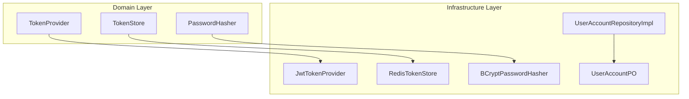
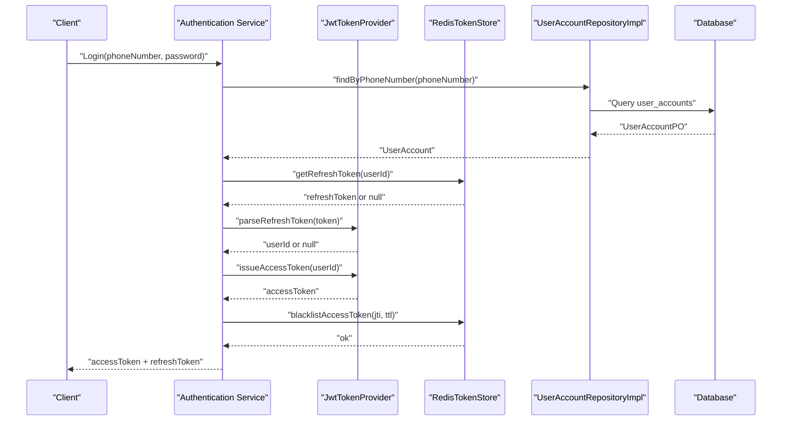
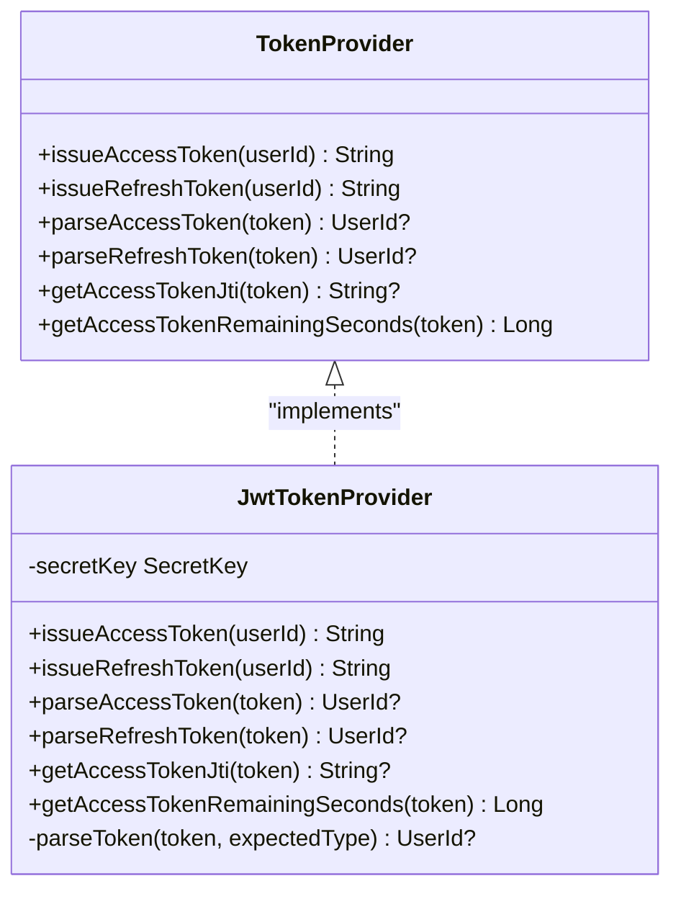
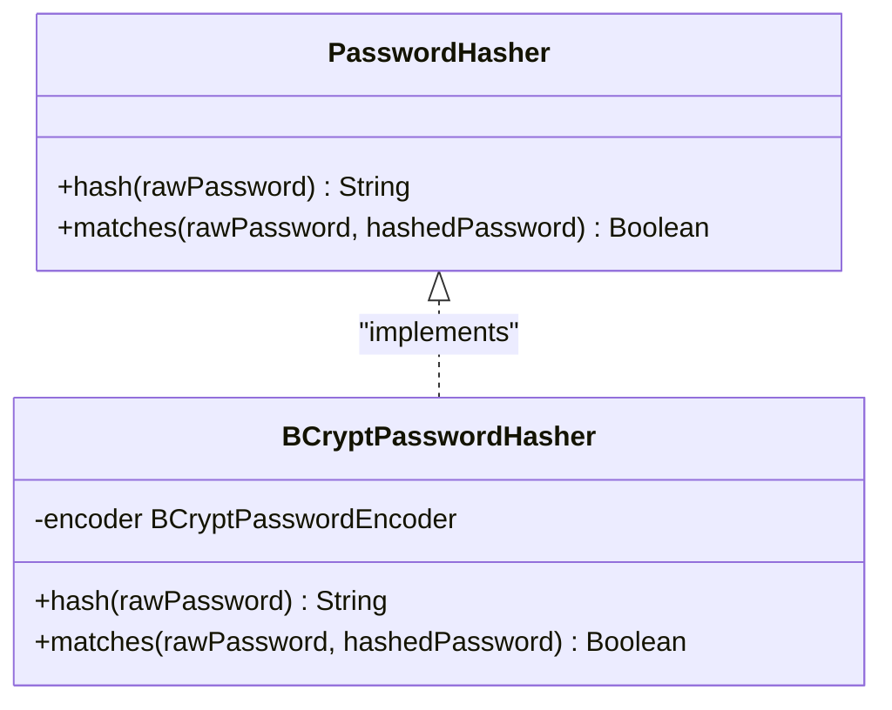
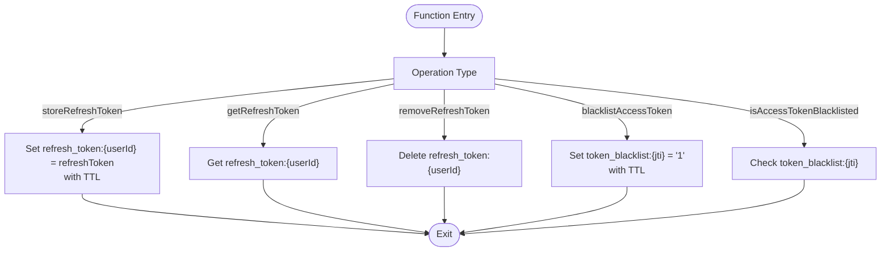
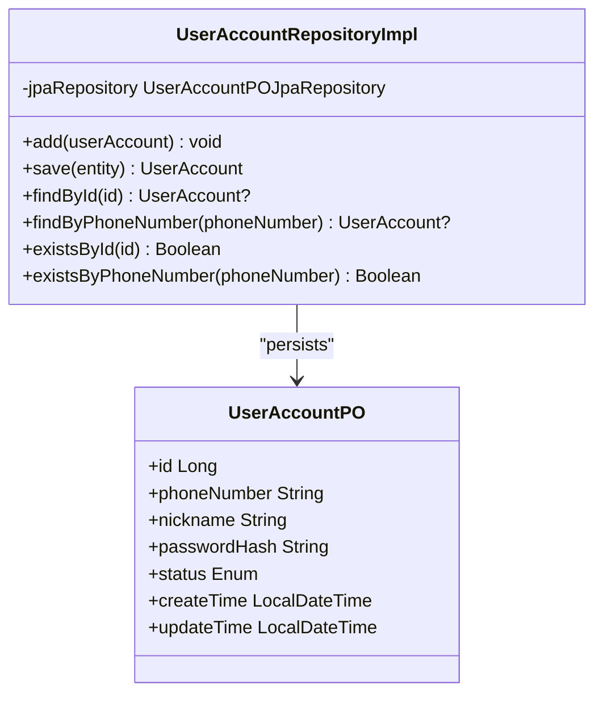
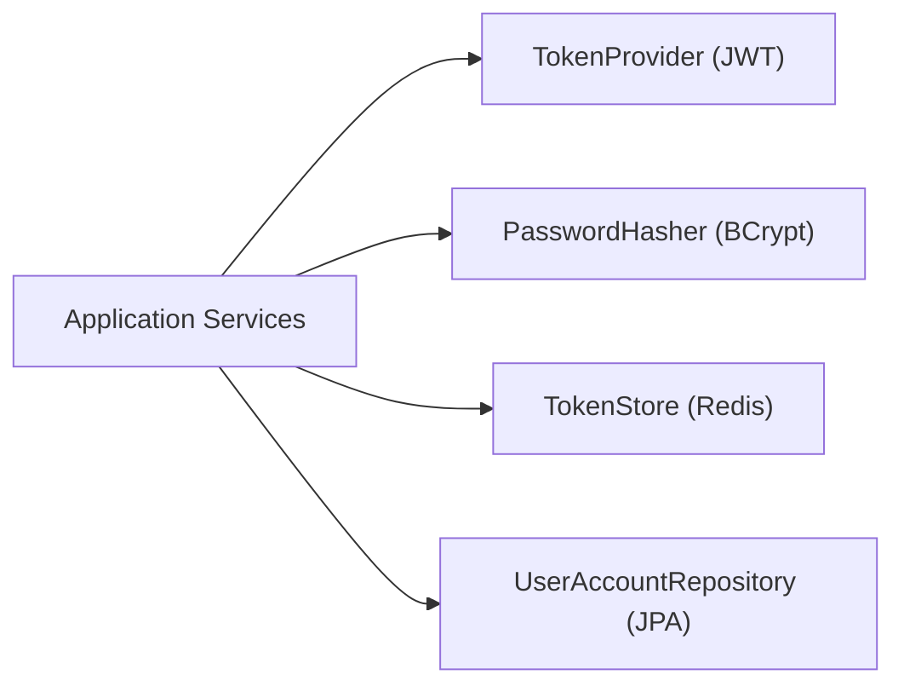
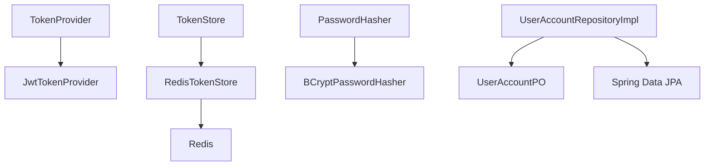

# Authentication Infrastructure

<cite>
**Referenced Files in This Document**
- [JwtTokenProvider.kt](file://j-store-user-infrastructure/src/main/kotlin/com/jstore/user/domain/useraccount/JwtTokenProvider.kt)
- [BCryptPasswordHasher.kt](file://j-store-user-infrastructure/src/main/kotlin/com/jstore/user/domain/useraccount/BCryptPasswordHasher.kt)
- [RedisTokenStore.kt](file://j-store-user-infrastructure/src/main/kotlin/com/jstore/user/domain/useraccount/RedisTokenStore.kt)
- [UserAccountRepositoryImpl.kt](file://j-store-user-infrastructure/src/main/kotlin/com/jstore/user/domain/useraccount/UserAccountRepositoryImpl.kt)
- [TokenProvider.kt](file://j-store-user-domain/src/main/kotlin/com/jstore/user/domain/useraccount/TokenProvider.kt)
- [TokenStore.kt](file://j-store-user-domain/src/main/kotlin/com/jstore/user/domain/useraccount/TokenStore.kt)
- [PasswordHasher.kt](file://j-store-user-domain/src/main/kotlin/com/jstore/user/domain/useraccount/PasswordHasher.kt)
- [UserAccountPO.kt](file://j-store-user-infrastructure/src/main/kotlin/com/jstore/user/domain/useraccount/persistence/UserAccountPO.kt)
- [UserBootConfiguration.kt](file://j-store-user-boot/src/main/kotlin/com/jstore/user/config/UserBootConfiguration.kt)
- [application.properties](file://j-store-boot/src/main/resources/application.properties)
- [application-local.properties](file://j-store-boot/src/main/resources/application-local.properties)
</cite>

## Table of Contents
1. [Introduction](#introduction)
2. [Project Structure](#project-structure)
3. [Core Components](#core-components)
4. [Architecture Overview](#architecture-overview)
5. [Detailed Component Analysis](#detailed-component-analysis)
6. [Dependency Analysis](#dependency-analysis)
7. [Performance Considerations](#performance-considerations)
8. [Troubleshooting Guide](#troubleshooting-guide)
9. [Conclusion](#conclusion)
10. [Appendices](#appendices)

## Introduction
This document explains the authentication infrastructure layer with a focus on:
- JWT token generation and validation via JwtTokenProvider
- Password hashing using BCryptPasswordHasher
- Token storage strategy with RedisTokenStore (refresh tokens and access token blacklist)
- User account persistence through UserAccountRepositoryImpl
- Integration points and configuration for JWT expiration, Redis connectivity, and password hashing parameters
It also provides concrete examples of token creation, validation, and storage operations, along with security best practices, performance considerations, and troubleshooting guidance.

## Project Structure
The authentication infrastructure is implemented across domain interfaces and infrastructure implementations:
- Domain interfaces define contracts for token handling, password hashing, and token storage
- Infrastructure modules provide concrete implementations using JWT, BCrypt, and Redis
- Persistence uses JPA entities to map user accounts to relational storage

**Diagram sources**
- [TokenProvider.kt](file://j-store-user-domain/src/main/kotlin/com/jstore/user/domain/useraccount/TokenProvider.kt)
- [TokenStore.kt](file://j-store-user-domain/src/main/kotlin/com/jstore/user/domain/useraccount/TokenStore.kt)
- [PasswordHasher.kt](file://j-store-user-domain/src/main/kotlin/com/jstore/user/domain/useraccount/PasswordHasher.kt)
- [JwtTokenProvider.kt](file://j-store-user-infrastructure/src/main/kotlin/com/jstore/user/domain/useraccount/JwtTokenProvider.kt)
- [RedisTokenStore.kt](file://j-store-user-infrastructure/src/main/kotlin/com/jstore/user/domain/useraccount/RedisTokenStore.kt)
- [BCryptPasswordHasher.kt](file://j-store-user-infrastructure/src/main/kotlin/com/jstore/user/domain/useraccount/BCryptPasswordHasher.kt)
- [UserAccountRepositoryImpl.kt](file://j-store-user-infrastructure/src/main/kotlin/com/jstore/user/domain/useraccount/UserAccountRepositoryImpl.kt)
- [UserAccountPO.kt](file://j-store-user-infrastructure/src/main/kotlin/com/jstore/user/domain/useraccount/persistence/UserAccountPO.kt)

**Section sources**
- [TokenProvider.kt](file://j-store-user-domain/src/main/kotlin/com/jstore/user/domain/useraccount/TokenProvider.kt)
- [TokenStore.kt](file://j-store-user-domain/src/main/kotlin/com/jstore/user/domain/useraccount/TokenStore.kt)
- [PasswordHasher.kt](file://j-store-user-domain/src/main/kotlin/com/jstore/user/domain/useraccount/PasswordHasher.kt)
- [JwtTokenProvider.kt](file://j-store-user-infrastructure/src/main/kotlin/com/jstore/user/domain/useraccount/JwtTokenProvider.kt)
- [RedisTokenStore.kt](file://j-store-user-infrastructure/src/main/kotlin/com/jstore/user/domain/useraccount/RedisTokenStore.kt)
- [BCryptPasswordHasher.kt](file://j-store-user-infrastructure/src/main/kotlin/com/jstore/user/domain/useraccount/BCryptPasswordHasher.kt)
- [UserAccountRepositoryImpl.kt](file://j-store-user-infrastructure/src/main/kotlin/com/jstore/user/domain/useraccount/UserAccountRepositoryImpl.kt)
- [UserAccountPO.kt](file://j-store-user-infrastructure/src/main/kotlin/com/jstore/user/domain/useraccount/persistence/UserAccountPO.kt)

## Core Components
- JwtTokenProvider: Issues and validates JWTs (access and refresh), extracts claims, computes remaining TTL, and supports token blacklisting via jti.
- BCryptPasswordHasher: Hashes passwords and verifies them against stored hashes using Spring Security’s BCrypt encoder.
- RedisTokenStore: Persists refresh tokens keyed by userId and maintains an access token blacklist keyed by jti with TTLs.
- UserAccountRepositoryImpl: Maps domain UserAccount to/from JPA entity UserAccountPO and performs CRUD operations under mandatory transactions.

Key responsibilities:
- Token lifecycle: issue, parse, validate, blacklist, and compute remaining seconds
- Password security: strong hashing and verification
- Persistence: safe conversion between domain and persistence models

**Section sources**
- [JwtTokenProvider.kt](file://j-store-user-infrastructure/src/main/kotlin/com/jstore/user/domain/useraccount/JwtTokenProvider.kt)
- [BCryptPasswordHasher.kt](file://j-store-user-infrastructure/src/main/kotlin/com/jstore/user/domain/useraccount/BCryptPasswordHasher.kt)
- [RedisTokenStore.kt](file://j-store-user-infrastructure/src/main/kotlin/com/jstore/user/domain/useraccount/RedisTokenStore.kt)
- [UserAccountRepositoryImpl.kt](file://j-store-user-infrastructure/src/main/kotlin/com/jstore/user/domain/useraccount/UserAccountRepositoryImpl.kt)

## Architecture Overview
The authentication flow integrates JWT issuance/validation, secure password hashing, and Redis-backed token storage with persistent user accounts.

**Diagram sources**
- [JwtTokenProvider.kt](file://j-store-user-infrastructure/src/main/kotlin/com/jstore/user/domain/useraccount/JwtTokenProvider.kt)
- [RedisTokenStore.kt](file://j-store-user-infrastructure/src/main/kotlin/com/jstore/user/domain/useraccount/RedisTokenStore.kt)
- [UserAccountRepositoryImpl.kt](file://j-store-user-infrastructure/src/main/kotlin/com/jstore/user/domain/useraccount/UserAccountRepositoryImpl.kt)

## Detailed Component Analysis

### JwtTokenProvider
- Issues short-lived access tokens and longer-lived refresh tokens using HS256 with HMAC-SHA keys derived from a secret string.
- Claims include userId, type (access/refresh), iat, exp, and a unique jti for access tokens.
- Parsing enforces token type and returns null for invalid or mismatched tokens.
- Provides utilities to extract jti and remaining seconds for access tokens.

**Diagram sources**
- [TokenProvider.kt](file://j-store-user-domain/src/main/kotlin/com/jstore/user/domain/useraccount/TokenProvider.kt)
- [JwtTokenProvider.kt](file://j-store-user-infrastructure/src/main/kotlin/com/jstore/user/domain/useraccount/JwtTokenProvider.kt)

**Section sources**
- [JwtTokenProvider.kt](file://j-store-user-infrastructure/src/main/kotlin/com/jstore/user/domain/useraccount/JwtTokenProvider.kt)
- [TokenProvider.kt](file://j-store-user-domain/src/main/kotlin/com/jstore/user/domain/useraccount/TokenProvider.kt)

### BCryptPasswordHasher
- Wraps Spring Security’s BCryptPasswordEncoder with configurable strength.
- Exposes hash and matches methods for secure password handling.

**Diagram sources**
- [PasswordHasher.kt](file://j-store-user-domain/src/main/kotlin/com/jstore/user/domain/useraccount/PasswordHasher.kt)
- [BCryptPasswordHasher.kt](file://j-store-user-infrastructure/src/main/kotlin/com/jstore/user/domain/useraccount/BCryptPasswordHasher.kt)

**Section sources**
- [BCryptPasswordHasher.kt](file://j-store-user-infrastructure/src/main/kotlin/com/jstore/user/domain/useraccount/BCryptPasswordHasher.kt)
- [PasswordHasher.kt](file://j-store-user-domain/src/main/kotlin/com/jstore/user/domain/useraccount/PasswordHasher.kt)

### RedisTokenStore
- Stores refresh tokens per userId with TTL.
- Maintains an access token blacklist by jti with TTL to support logout and revocation.
- Uses StringRedisTemplate for simple key-value operations.

**Diagram sources**
- [RedisTokenStore.kt](file://j-store-user-infrastructure/src/main/kotlin/com/jstore/user/domain/useraccount/RedisTokenStore.kt)

**Section sources**
- [RedisTokenStore.kt](file://j-store-user-infrastructure/src/main/kotlin/com/jstore/user/domain/useraccount/RedisTokenStore.kt)
- [TokenStore.kt](file://j-store-user-domain/src/main/kotlin/com/jstore/user/domain/useraccount/TokenStore.kt)

### UserAccountRepositoryImpl
- Converts domain UserAccount to/from JPA entity UserAccountPO.
- Enforces mandatory transaction boundaries for writes.
- Supports lookup by id and phone number, existence checks, and save/add operations.

**Diagram sources**
- [UserAccountRepositoryImpl.kt](file://j-store-user-infrastructure/src/main/kotlin/com/jstore/user/domain/useraccount/UserAccountRepositoryImpl.kt)
- [UserAccountPO.kt](file://j-store-user-infrastructure/src/main/kotlin/com/jstore/user/domain/useraccount/persistence/UserAccountPO.kt)

**Section sources**
- [UserAccountRepositoryImpl.kt](file://j-store-user-infrastructure/src/main/kotlin/com/jstore/user/domain/useraccount/UserAccountRepositoryImpl.kt)
- [UserAccountPO.kt](file://j-store-user-infrastructure/src/main/kotlin/com/jstore/user/domain/useraccount/persistence/UserAccountPO.kt)

### Conceptual Overview
The authentication system separates concerns cleanly:
- Domain interfaces ensure testability and flexibility
- Infrastructure components implement concrete technologies (JWT, BCrypt, Redis, JPA)
- Configuration wires secrets, TTLs, and connection settings at runtime

[No sources needed since this diagram shows conceptual workflow, not actual code structure]

## Dependency Analysis
- JwtTokenProvider depends on javax.crypto.SecretKey and JJWT library for signing and parsing.
- RedisTokenStore depends on Spring Data Redis StringRedisTemplate.
- BCryptPasswordHasher depends on Spring Security Crypto’s BCryptPasswordEncoder.
- UserAccountRepositoryImpl depends on Spring Data JPA repository and transaction management.

**Diagram sources**
- [JwtTokenProvider.kt](file://j-store-user-infrastructure/src/main/kotlin/com/jstore/user/domain/useraccount/JwtTokenProvider.kt)
- [RedisTokenStore.kt](file://j-store-user-infrastructure/src/main/kotlin/com/jstore/user/domain/useraccount/RedisTokenStore.kt)
- [BCryptPasswordHasher.kt](file://j-store-user-infrastructure/src/main/kotlin/com/jstore/user/domain/useraccount/BCryptPasswordHasher.kt)
- [UserAccountRepositoryImpl.kt](file://j-store-user-infrastructure/src/main/kotlin/com/jstore/user/domain/useraccount/UserAccountRepositoryImpl.kt)
- [UserAccountPO.kt](file://j-store-user-infrastructure/src/main/kotlin/com/jstore/user/domain/useraccount/persistence/UserAccountPO.kt)

**Section sources**
- [JwtTokenProvider.kt](file://j-store-user-infrastructure/src/main/kotlin/com/jstore/user/domain/useraccount/JwtTokenProvider.kt)
- [RedisTokenStore.kt](file://j-store-user-infrastructure/src/main/kotlin/com/jstore/user/domain/useraccount/RedisTokenStore.kt)
- [BCryptPasswordHasher.kt](file://j-store-user-infrastructure/src/main/kotlin/com/jstore/user/domain/useraccount/BCryptPasswordHasher.kt)
- [UserAccountRepositoryImpl.kt](file://j-store-user-infrastructure/src/main/kotlin/com/jstore/user/domain/useraccount/UserAccountRepositoryImpl.kt)

## Performance Considerations
- JWT parsing and signature verification are CPU-bound; keep payloads minimal and avoid heavy claims.
- Redis operations are fast but network-bound; batch where possible and use appropriate TTLs to prevent memory growth.
- BCrypt hashing cost scales with strength; choose a balanced strength that meets security goals without excessive latency.
- Repository conversions should be lightweight; avoid unnecessary object churn in hot paths.

[No sources needed since this section provides general guidance]

## Troubleshooting Guide
Common issues and resolutions:
- Invalid or expired JWT:
  - Verify secret key consistency across services
  - Ensure correct token type (access vs refresh) during parsing
  - Check expiration and remaining seconds calculations
- Redis connectivity failures:
  - Validate connection properties and availability
  - Confirm key prefixes and TTL values
- Password mismatches:
  - Ensure consistent BCrypt strength across environments
  - Verify stored hashes were generated with the same encoder
- Transaction errors:
  - Writes require mandatory transactions; ensure callers wrap operations in transactions

**Section sources**
- [JwtTokenProvider.kt](file://j-store-user-infrastructure/src/main/kotlin/com/jstore/user/domain/useraccount/JwtTokenProvider.kt)
- [RedisTokenStore.kt](file://j-store-user-infrastructure/src/main/kotlin/com/jstore/user/domain/useraccount/RedisTokenStore.kt)
- [BCryptPasswordHasher.kt](file://j-store-user-infrastructure/src/main/kotlin/com/jstore/user/domain/useraccount/BCryptPasswordHasher.kt)
- [UserAccountRepositoryImpl.kt](file://j-store-user-infrastructure/src/main/kotlin/com/jstore/user/domain/useraccount/UserAccountRepositoryImpl.kt)

## Conclusion
The authentication infrastructure cleanly separates domain contracts from technology-specific implementations. JwtTokenProvider handles secure JWT operations, BCryptPasswordHasher ensures robust password security, RedisTokenStore enables scalable token storage and revocation, and UserAccountRepositoryImpl persists user data safely. Proper configuration and adherence to security best practices will yield a resilient and performant authentication system.

[No sources needed since this section summarizes without analyzing specific files]

## Appendices

### Configuration Options
- JWT expiration:
  - Access token TTL: configured within JwtTokenProvider constants
  - Refresh token TTL: configured within JwtTokenProvider constants
- Redis connection:
  - Configure Spring Data Redis properties (host, port, credentials, pool settings) in application properties
- Password hashing:
  - BCrypt strength parameter is configurable when constructing BCryptPasswordHasher

**Section sources**
- [JwtTokenProvider.kt](file://j-store-user-infrastructure/src/main/kotlin/com/jstore/user/domain/useraccount/JwtTokenProvider.kt)
- [BCryptPasswordHasher.kt](file://j-store-user-infrastructure/src/main/kotlin/com/jstore/user/domain/useraccount/BCryptPasswordHasher.kt)
- [application.properties](file://j-store-boot/src/main/resources/application.properties)
- [application-local.properties](file://j-store-boot/src/main/resources/application-local.properties)

### Concrete Examples
- Token creation:
  - Generate access token: call issueAccessToken with a valid UserId
  - Generate refresh token: call issueRefreshToken with a valid UserId
- Token validation:
  - Parse access token: call parseAccessToken and verify non-null result
  - Parse refresh token: call parseRefreshToken and verify non-null result
  - Extract jti: call getAccessTokenJti for blacklist operations
  - Remaining seconds: call getAccessTokenRemainingSeconds for UI hints or proactive refresh
- Storage operations:
  - Store refresh token: call storeRefreshToken with userId, token, and TTL
  - Retrieve refresh token: call getRefreshToken with userId
  - Remove refresh token: call removeRefreshToken on logout
  - Blacklist access token: call blacklistAccessToken with jti and TTL
  - Check blacklist: call isAccessTokenBlacklisted with jti

**Section sources**
- [JwtTokenProvider.kt](file://j-store-user-infrastructure/src/main/kotlin/com/jstore/user/domain/useraccount/JwtTokenProvider.kt)
- [RedisTokenStore.kt](file://j-store-user-infrastructure/src/main/kotlin/com/jstore/user/domain/useraccount/RedisTokenStore.kt)

### Security Best Practices
- Keep the JWT secret key confidential and rotate periodically
- Use HTTPS everywhere to protect tokens in transit
- Enforce short-lived access tokens and long-lived refresh tokens with strict rotation
- Implement token revocation via blacklist and enforce checks on sensitive endpoints
- Validate all inputs and reject malformed tokens early
- Limit exposed claims to minimum necessary information

[No sources needed since this section provides general guidance]