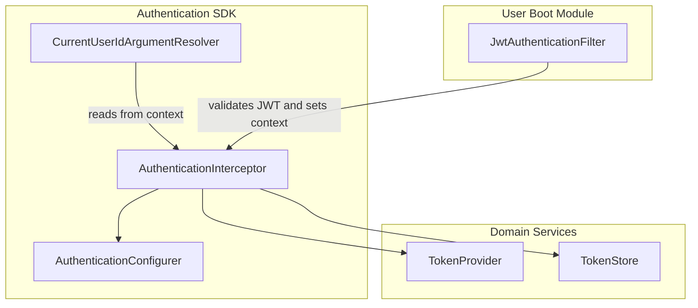
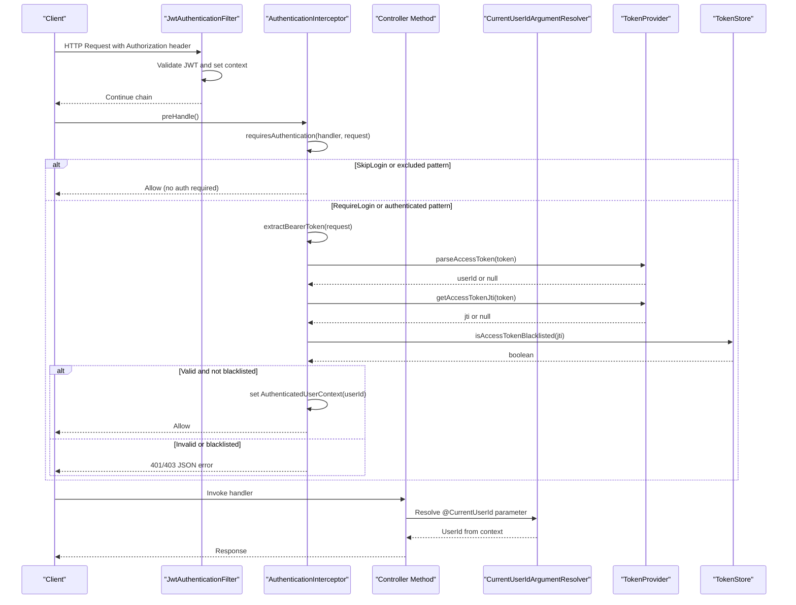
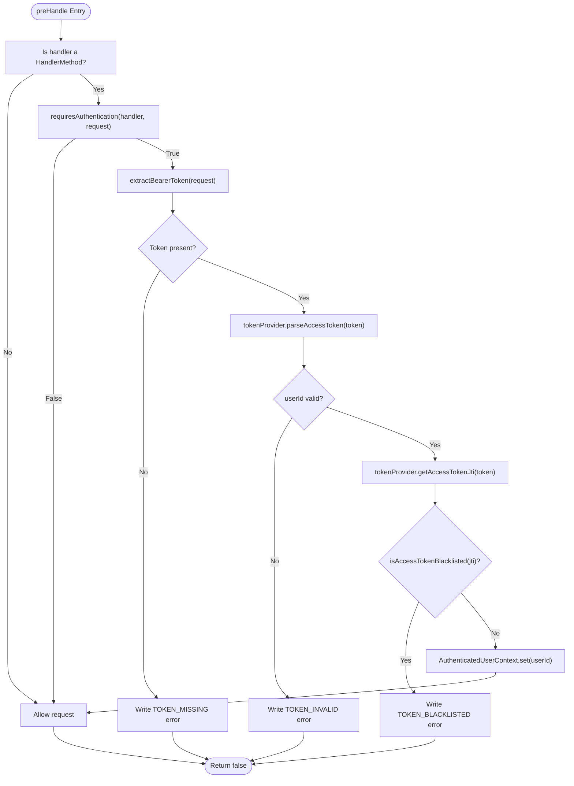
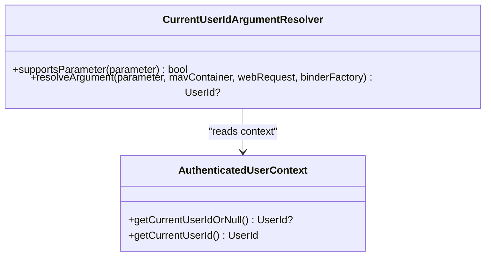
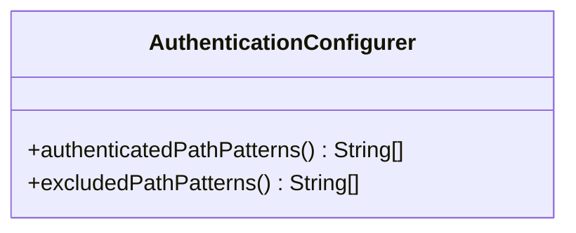
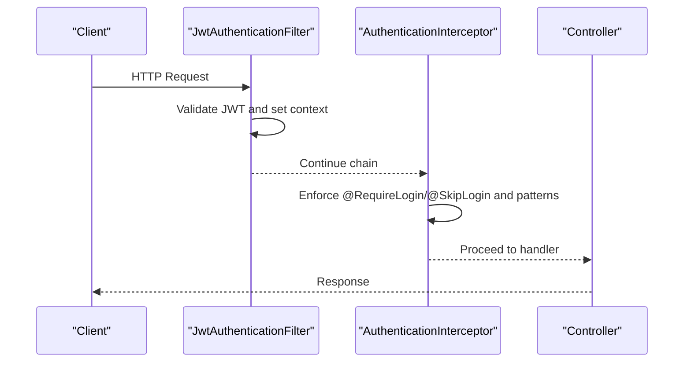
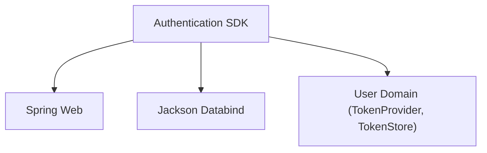

# Spring Security Integration

<cite>
**Referenced Files in This Document**
- [AuthenticationInterceptor.kt](file://j-store-authentication-spring-sdk/src/main/kotlin/com/jstore/authentication/spring/AuthenticationInterceptor.kt)
- [CurrentUserIdArgumentResolver.kt](file://j-store-authentication-spring-sdk/src/main/kotlin/com/jstore/authentication/spring/CurrentUserIdArgumentResolver.kt)
- [AuthenticationConfigurer.kt](file://j-store-authentication-spring-sdk/src/main/kotlin/com/jstore/authentication/config/AuthenticationConfigurer.kt)
- [JwtAuthenticationFilter.kt](file://j-store-user-boot/src/main/kotlin/com/jstore/user/filter/JwtAuthenticationFilter.kt)
- [build.gradle.kts](file://j-store-authentication-spring-sdk/build.gradle.kts)
</cite>

## Table of Contents
1. [Introduction](#introduction)
2. [Project Structure](#project-structure)
3. [Core Components](#core-components)
4. [Architecture Overview](#architecture-overview)
5. [Detailed Component Analysis](#detailed-component-analysis)
6. [Dependency Analysis](#dependency-analysis)
7. [Performance Considerations](#performance-considerations)
8. [Troubleshooting Guide](#troubleshooting-guide)
9. [Conclusion](#conclusion)
10. [Appendices](#appendices)

## Introduction
This document explains the Spring integration for authentication and authorization in the project. It focuses on:
- Request-level authentication via AuthenticationInterceptor
- Dependency injection of authenticated user context using CurrentUserIdArgumentResolver
- Security configuration through AuthenticationConfigurer
- JWT authentication filter pipeline and its integration with Spring MVC
- Practical examples for protecting endpoints, accessing current user information, and configuring authentication rules
- Annotation-based approach using @RequireLogin and @SkipLogin
- Common security configurations, custom authentication providers, and debugging authentication flows

The implementation uses a lightweight interceptor-based approach rather than full Spring Security filters, while still integrating cleanly with Spring MVC and leveraging domain services for token handling.

## Project Structure
The authentication SDK module provides the core components that integrate with Spring MVC:
- Interceptor for request-level authentication and path-based rules
- Argument resolver to inject UserId into controller method parameters
- Configuration interface to declare which paths require authentication or are excluded
- A JWT filter in the user boot module that participates in the request lifecycle

**Diagram sources**
- [AuthenticationInterceptor.kt:18-119](file://j-store-authentication-spring-sdk/src/main/kotlin/com/jstore/authentication/spring/AuthenticationInterceptor.kt#L18-L119)
- [CurrentUserIdArgumentResolver.kt:12-30](file://j-store-authentication-spring-sdk/src/main/kotlin/com/jstore/authentication/spring/CurrentUserIdArgumentResolver.kt#L12-L30)
- [AuthenticationConfigurer.kt:3-8](file://j-store-authentication-spring-sdk/src/main/kotlin/com/jstore/authentication/config/AuthenticationConfigurer.kt#L3-L8)
- [JwtAuthenticationFilter.kt](file://j-store-user-boot/src/main/kotlin/com/jstore/user/filter/JwtAuthenticationFilter.kt)

**Section sources**
- [build.gradle.kts:10-22](file://j-store-authentication-spring-sdk/build.gradle.kts#L10-L22)

## Core Components
- AuthenticationInterceptor: Implements HandlerInterceptor to enforce authentication based on annotations and path patterns, extract Bearer tokens, validate them via TokenProvider, check blacklist via TokenStore, and set the authenticated user context.
- CurrentUserIdArgumentResolver: Implements HandlerMethodArgumentResolver to resolve UserId parameters annotated with @CurrentUserId from the authenticated context.
- AuthenticationConfigurer: Interface to supply lists of authenticated and excluded path patterns used by the interceptor.

These components work together to provide annotation-driven and pattern-driven access control without requiring full Spring Security setup.

**Section sources**
- [AuthenticationInterceptor.kt:18-119](file://j-store-authentication-spring-sdk/src/main/kotlin/com/jstore/authentication/spring/AuthenticationInterceptor.kt#L18-L119)
- [CurrentUserIdArgumentResolver.kt:12-30](file://j-store-authentication-spring-sdk/src/main/kotlin/com/jstore/authentication/spring/CurrentUserIdArgumentResolver.kt#L12-L30)
- [AuthenticationConfigurer.kt:3-8](file://j-store-authentication-spring-sdk/src/main/kotlin/com/jstore/authentication/config/AuthenticationConfigurer.kt#L3-L8)

## Architecture Overview
The request flow integrates a JWT filter and an MVC interceptor:
- JwtAuthenticationFilter validates incoming JWTs and establishes the authenticated context.
- AuthenticationInterceptor enforces per-request authentication decisions based on annotations and configured patterns.
- CurrentUserIdArgumentResolver injects the authenticated UserId into controller methods.

**Diagram sources**
- [AuthenticationInterceptor.kt:35-78](file://j-store-authentication-spring-sdk/src/main/kotlin/com/jstore/authentication/spring/AuthenticationInterceptor.kt#L35-L78)
- [AuthenticationInterceptor.kt:80-101](file://j-store-authentication-spring-sdk/src/main/kotlin/com/jstore/authentication/spring/AuthenticationInterceptor.kt#L80-L101)
- [AuthenticationInterceptor.kt:103-118](file://j-store-authentication-spring-sdk/src/main/kotlin/com/jstore/authentication/spring/AuthenticationInterceptor.kt#L103-L118)
- [CurrentUserIdArgumentResolver.kt:19-29](file://j-store-authentication-spring-sdk/src/main/kotlin/com/jstore/authentication/spring/CurrentUserIdArgumentResolver.kt#L19-L29)
- [JwtAuthenticationFilter.kt](file://j-store-user-boot/src/main/kotlin/com/jstore/user/filter/JwtAuthenticationFilter.kt)

## Detailed Component Analysis

### AuthenticationInterceptor
Responsibilities:
- Determine if a request requires authentication based on annotations (@RequireLogin, @SkipLogin) and configured path patterns.
- Extract Bearer token from Authorization header.
- Parse and validate token using TokenProvider; check blacklist using TokenStore.
- Set authenticated user context and return appropriate responses on failure.

Key behaviors:
- Annotation precedence: @SkipLogin overrides all other checks.
- Path-based rules: Excluded patterns bypass authentication; authenticated patterns enforce it.
- Error responses: Writes JSON with message and errorCode fields for missing, invalid, or blacklisted tokens.

**Diagram sources**
- [AuthenticationInterceptor.kt:35-78](file://j-store-authentication-spring-sdk/src/main/kotlin/com/jstore/authentication/spring/AuthenticationInterceptor.kt#L35-L78)
- [AuthenticationInterceptor.kt:80-101](file://j-store-authentication-spring-sdk/src/main/kotlin/com/jstore/authentication/spring/AuthenticationInterceptor.kt#L80-L101)
- [AuthenticationInterceptor.kt:103-118](file://j-store-authentication-spring-sdk/src/main/kotlin/com/jstore/authentication/spring/AuthenticationInterceptor.kt#L103-L118)

**Section sources**
- [AuthenticationInterceptor.kt:18-119](file://j-store-authentication-spring-sdk/src/main/kotlin/com/jstore/authentication/spring/AuthenticationInterceptor.kt#L18-L119)

### CurrentUserIdArgumentResolver
Responsibilities:
- Resolve method parameters annotated with @CurrentUserId to UserId values.
- Support optional parameters by returning null when no authenticated context exists.

Behavior:
- If parameter is optional, returns null when no context; otherwise throws or returns non-null based on context availability.

**Diagram sources**
- [CurrentUserIdArgumentResolver.kt:12-30](file://j-store-authentication-spring-sdk/src/main/kotlin/com/jstore/authentication/spring/CurrentUserIdArgumentResolver.kt#L12-L30)

**Section sources**
- [CurrentUserIdArgumentResolver.kt:12-30](file://j-store-authentication-spring-sdk/src/main/kotlin/com/jstore/authentication/spring/CurrentUserIdArgumentResolver.kt#L12-L30)

### AuthenticationConfigurer
Responsibilities:
- Provide lists of path patterns that require authentication and those that should be excluded.

Usage:
- Implement this interface to define module-specific security rules. The interceptor aggregates patterns from all configurers.

**Diagram sources**
- [AuthenticationConfigurer.kt:3-8](file://j-store-authentication-spring-sdk/src/main/kotlin/com/jstore/authentication/config/AuthenticationConfigurer.kt#L3-L8)

**Section sources**
- [AuthenticationConfigurer.kt:3-8](file://j-store-authentication-spring-sdk/src/main/kotlin/com/jstore/authentication/config/AuthenticationConfigurer.kt#L3-L8)

### JWT Authentication Filter Pipeline
The user boot module includes a JwtAuthenticationFilter that participates in the request lifecycle. While the interceptor enforces per-endpoint rules, the filter typically validates JWTs early and sets the authenticated context. Together they ensure:
- Early validation of tokens at the filter level
- Fine-grained access control at the interceptor level based on annotations and patterns

**Diagram sources**
- [JwtAuthenticationFilter.kt](file://j-store-user-boot/src/main/kotlin/com/jstore/user/filter/JwtAuthenticationFilter.kt)
- [AuthenticationInterceptor.kt:35-78](file://j-store-authentication-spring-sdk/src/main/kotlin/com/jstore/authentication/spring/AuthenticationInterceptor.kt#L35-L78)

## Dependency Analysis
The authentication SDK depends on:
- Spring Web for MVC integration
- Jackson for writing JSON error responses
- Domain services TokenProvider and TokenStore for JWT parsing and blacklist checks

**Diagram sources**
- [build.gradle.kts:10-22](file://j-store-authentication-spring-sdk/build.gradle.kts#L10-L22)

**Section sources**
- [build.gradle.kts:10-22](file://j-store-authentication-spring-sdk/build.gradle.kts#L10-L22)

## Performance Considerations
- Pattern matching: Uses AntPathMatcher for efficient path matching; keep patterns concise to minimize overhead.
- Token operations: Parsing and blacklist checks are performed per request; consider caching strategies if needed.
- Context management: Clearing context after completion prevents memory leaks across requests.

[No sources needed since this section provides general guidance]

## Troubleshooting Guide
Common issues and resolutions:
- Missing token: Ensure Authorization header contains a valid Bearer token.
- Invalid token: Verify token signature and expiration; confirm TokenProvider implementation.
- Blacklisted token: Check TokenStore blacklist status; revoke tokens appropriately.
- Annotation conflicts: @SkipLogin takes precedence over @RequireLogin; verify endpoint annotations.
- Path pattern mismatches: Confirm configured patterns match request URIs exactly.

Debugging steps:
- Log interceptor decisions and token extraction results.
- Inspect response body for error codes and messages.
- Validate JwtAuthenticationFilter behavior and context setting.

**Section sources**
- [AuthenticationInterceptor.kt:108-114](file://j-store-authentication-spring-sdk/src/main/kotlin/com/jstore/authentication/spring/AuthenticationInterceptor.kt#L108-L114)

## Conclusion
The authentication integration combines a JWT filter and an MVC interceptor to provide robust, annotation-driven access control. AuthenticationConfigurer enables flexible path-based policies, while CurrentUserIdArgumentResolver simplifies accessing authenticated user context in controllers. This approach offers fine-grained control without requiring full Spring Security setup.

[No sources needed since this section summarizes without analyzing specific files]

## Appendices

### Practical Examples

#### Protecting Endpoints with Annotations
- Use @RequireLogin on controller methods or classes to enforce authentication.
- Use @SkipLogin to explicitly allow unauthenticated access.

#### Accessing Current User Information
- Inject UserId using @CurrentUserId parameter annotation in controller methods.
- Access via CurrentUserIdArgumentResolver from the authenticated context.

#### Configuring Authentication Rules
- Implement AuthenticationConfigurer to define authenticated and excluded path patterns.
- Register multiple configurers to compose security policies across modules.

#### Custom Authentication Providers
- Implement TokenProvider to handle JWT parsing and validation logic.
- Implement TokenStore to manage token blacklist functionality.

#### Debugging Authentication Flows
- Enable detailed logging in AuthenticationInterceptor and JwtAuthenticationFilter.
- Monitor error responses for TOKEN_MISSING, TOKEN_INVALID, and TOKEN_BLACKLISTED.

[No sources needed since this section provides general guidance]