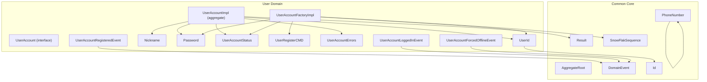
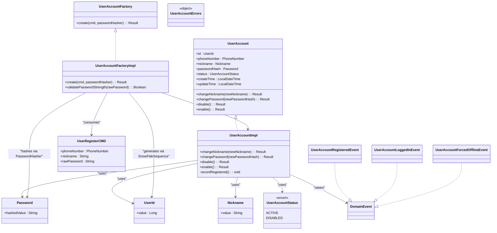
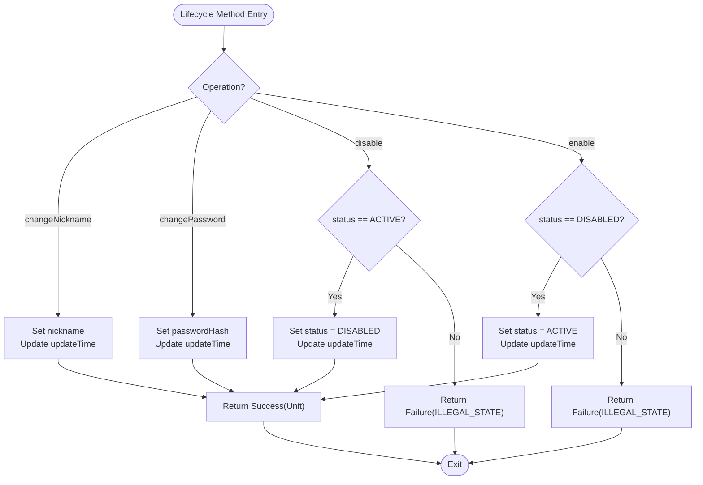
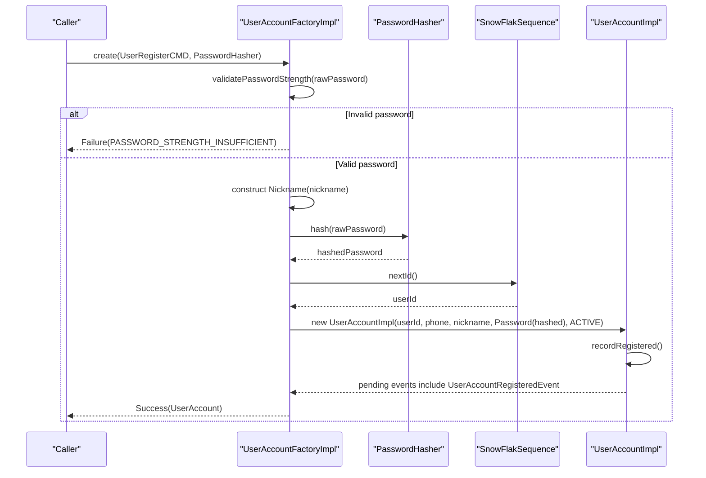
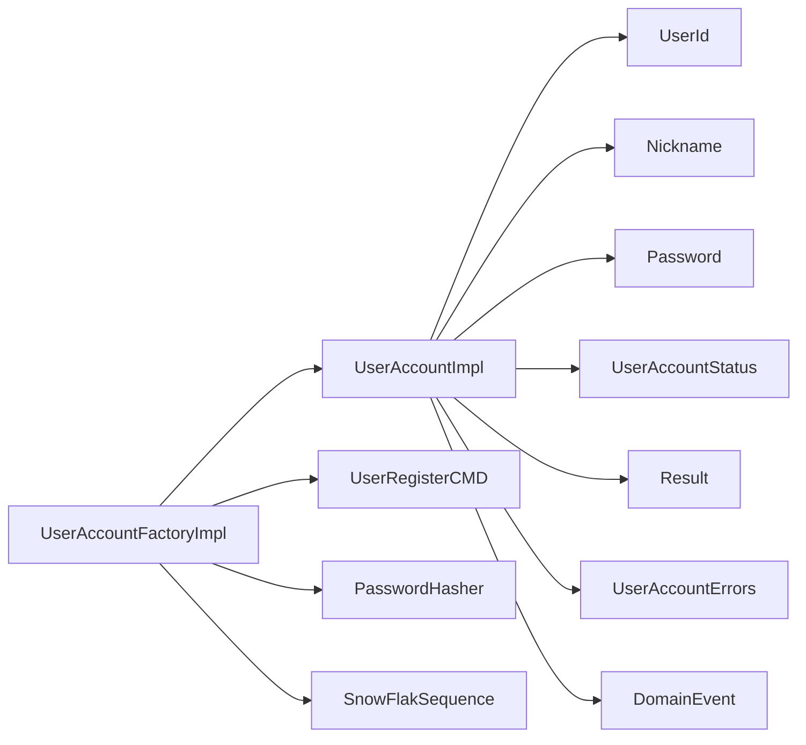

# User Account Domain Model

<cite>
**Referenced Files in This Document**
- [UserAccount.kt](file://j-store-user-domain/src/main/kotlin/com/jstore/user/domain/useraccount/UserAccount.kt)
- [UserAccountImpl.kt](file://j-store-user-domain/src/main/kotlin/com/jstore/user/domain/useraccount/UserAccountImpl.kt)
- [UserId.kt](file://j-store-user-domain/src/main/kotlin/com/jstore/user/domain/useraccount/UserId.kt)
- [Nickname.kt](file://j-store-user-domain/src/main/kotlin/com/jstore/user/domain/useraccount/Nickname.kt)
- [Password.kt](file://j-store-user-domain/src/main/kotlin/com/jstore/user/domain/useraccount/Password.kt)
- [UserAccountStatus.kt](file://j-store-user-domain/src/main/kotlin/com/jstore/user/domain/useraccount/UserAccountStatus.kt)
- [UserAccountFactory.kt](file://j-store-user-domain/src/main/kotlin/com/jstore/user/domain/useraccount/UserAccountFactory.kt)
- [UserRegisterCMD.kt](file://j-store-user-domain/src/main/kotlin/com/jstore/user/domain/useraccount/command/UserRegisterCMD.kt)
- [UserAccountErrors.kt](file://j-store-user-domain/src/main/kotlin/com/jstore/user/domain/useraccount/UserAccountErrors.kt)
- [UserAccountRegisteredEvent.kt](file://j-store-user-domain/src/main/kotlin/com/jstore/user/domain/useraccount/event/UserAccountRegisteredEvent.kt)
- [UserAccountLoggedInEvent.kt](file://j-store-user-domain/src/main/kotlin/com/jstore/user/domain/useraccount/event/UserAccountLoggedInEvent.kt)
- [UserAccountForcedOfflineEvent.kt](file://j-store-user-domain/src/main/kotlin/com/jstore/user/domain/useraccount/event/UserAccountForcedOfflineEvent.kt)
- [Result.kt](file://j-store-common-core/src/main/kotlin/com/jstore/common/utils/Result.kt)
- [AggregateRoot.kt](file://j-store-common-core/src/main/kotlin/com/jstore/common/framework/AggregateRoot.kt)
- [DomainEvent.kt](file://j-store-common-core/src/main/kotlin/com/jstore/common/framework/event/DomainEvent.kt)
- [PhoneNumber.kt](file://j-store-common-core/src/main/kotlin/com/jstore/common/properties/PhoneNumber.kt)
- [Id.kt](file://j-store-common-core/src/main/kotlin/com/jstore/common/properties/Id.kt)
- [SnowFlakSequence.kt](file://j-store-common-core/src/main/kotlin/com/jstore/common/persistent/SnowFlakSequence.kt)
- [UserAccountFactoryPropertyTest.kt](file://j-store-user-domain/src/test/kotlin/com/jstore/user/UserAccountFactoryPropertyTest.kt)
- [NicknamePropertyTest.kt](file://j-store-user-domain/src/test/kotlin/com/jstore/user/NicknamePropertyTest.kt)
- [PasswordStrengthPropertyTest.kt](file://j-store-user-domain/src/test/kotlin/com/jstore/user/PasswordStrengthPropertyTest.kt)
- [UserAccountStatusTransitionPropertyTest.kt](file://j-store-user-domain/src/test/kotlin/com/jstore/user/UserAccountStatusTransitionPropertyTest.kt)
</cite>

## Table of Contents
1. [Introduction](#introduction)
2. [Project Structure](#project-structure)
3. [Core Components](#core-components)
4. [Architecture Overview](#architecture-overview)
5. [Detailed Component Analysis](#detailed-component-analysis)
6. [Dependency Analysis](#dependency-analysis)
7. [Performance Considerations](#performance-considerations)
8. [Troubleshooting Guide](#troubleshooting-guide)
9. [Conclusion](#conclusion)

## Introduction
This document explains the User Account domain model, focusing on the UserAccount aggregate root and its lifecycle methods: changeNickname, changePassword, enable, and disable. It documents value objects (UserId, Nickname, Password), the UserAccountStatus enum, domain events for user account changes, and the Result pattern used for error handling. Examples cover account creation, status transitions, and data validation rules. Security considerations for password handling and account state management are also addressed.

## Project Structure
The User Account domain resides in the j-store-user-domain module. The core files include the aggregate interface and implementation, value objects, factory, command input, errors, and domain events. Tests validate behavior and constraints.

**Diagram sources**
- [UserAccount.kt](file://j-store-user-domain/src/main/kotlin/com/jstore/user/domain/useraccount/UserAccount.kt)
- [UserAccountImpl.kt](file://j-store-user-domain/src/main/kotlin/com/jstore/user/domain/useraccount/UserAccountImpl.kt)
- [UserId.kt](file://j-store-user-domain/src/main/kotlin/com/jstore/user/domain/useraccount/UserId.kt)
- [Nickname.kt](file://j-store-user-domain/src/main/kotlin/com/jstore/user/domain/useraccount/Nickname.kt)
- [Password.kt](file://j-store-user-domain/src/main/kotlin/com/jstore/user/domain/useraccount/Password.kt)
- [UserAccountStatus.kt](file://j-store-user-domain/src/main/kotlin/com/jstore/user/domain/useraccount/UserAccountStatus.kt)
- [UserAccountFactory.kt](file://j-store-user-domain/src/main/kotlin/com/jstore/user/domain/useraccount/UserAccountFactory.kt)
- [UserRegisterCMD.kt](file://j-store-user-domain/src/main/kotlin/com/jstore/user/domain/useraccount/command/UserRegisterCMD.kt)
- [UserAccountErrors.kt](file://j-store-user-domain/src/main/kotlin/com/jstore/user/domain/useraccount/UserAccountErrors.kt)
- [UserAccountRegisteredEvent.kt](file://j-store-user-domain/src/main/kotlin/com/jstore/user/domain/useraccount/event/UserAccountRegisteredEvent.kt)
- [UserAccountLoggedInEvent.kt](file://j-store-user-domain/src/main/kotlin/com/jstore/user/domain/useraccount/event/UserAccountLoggedInEvent.kt)
- [UserAccountForcedOfflineEvent.kt](file://j-store-user-domain/src/main/kotlin/com/jstore/user/domain/useraccount/event/UserAccountForcedOfflineEvent.kt)
- [Result.kt](file://j-store-common-core/src/main/kotlin/com/jstore/common/utils/Result.kt)
- [AggregateRoot.kt](file://j-store-common-core/src/main/kotlin/com/jstore/common/framework/AggregateRoot.kt)
- [DomainEvent.kt](file://j-store-common-core/src/main/kotlin/com/jstore/common/framework/event/DomainEvent.kt)
- [PhoneNumber.kt](file://j-store-common-core/src/main/kotlin/com/jstore/common/properties/PhoneNumber.kt)
- [Id.kt](file://j-store-common-core/src/main/kotlin/com/jstore/common/properties/Id.kt)
- [SnowFlakSequence.kt](file://j-store-common-core/src/main/kotlin/com/jstore/common/persistent/SnowFlakSequence.kt)

**Section sources**
- [UserAccount.kt](file://j-store-user-domain/src/main/kotlin/com/jstore/user/domain/useraccount/UserAccount.kt)
- [UserAccountImpl.kt](file://j-store-user-domain/src/main/kotlin/com/jstore/user/domain/useraccount/UserAccountImpl.kt)
- [UserAccountFactory.kt](file://j-store-user-domain/src/main/kotlin/com/jstore/user/domain/useraccount/UserAccountFactory.kt)
- [UserRegisterCMD.kt](file://j-store-user-domain/src/main/kotlin/com/jstore/user/domain/useraccount/command/UserRegisterCMD.kt)
- [UserAccountErrors.kt](file://j-store-user-domain/src/main/kotlin/com/jstore/user/domain/useraccount/UserAccountErrors.kt)
- [UserAccountRegisteredEvent.kt](file://j-store-user-domain/src/main/kotlin/com/jstore/user/domain/useraccount/event/UserAccountRegisteredEvent.kt)
- [UserAccountLoggedInEvent.kt](file://j-store-user-domain/src/main/kotlin/com/jstore/user/domain/useraccount/event/UserAccountLoggedInEvent.kt)
- [UserAccountForcedOfflineEvent.kt](file://j-store-user-domain/src/main/kotlin/com/jstore/user/domain/useraccount/event/UserAccountForcedOfflineEvent.kt)
- [Result.kt](file://j-store-common-core/src/main/kotlin/com/jstore/common/utils/Result.kt)
- [AggregateRoot.kt](file://j-store-common-core/src/main/kotlin/com/jstore/common/framework/AggregateRoot.kt)
- [DomainEvent.kt](file://j-store-common-core/src/main/kotlin/com/jstore/common/framework/event/DomainEvent.kt)
- [PhoneNumber.kt](file://j-store-common-core/src/main/kotlin/com/jstore/common/properties/PhoneNumber.kt)
- [Id.kt](file://j-store-common-core/src/main/kotlin/com/jstore/common/properties/Id.kt)
- [SnowFlakSequence.kt](file://j-store-common-core/src/main/kotlin/com/jstore/common/persistent/SnowFlakSequence.kt)

## Core Components
- UserAccount aggregate root defines the lifecycle operations and properties for a user account, including nickname, password hash, phone number, status, and timestamps.
- UserAccountImpl implements the aggregate with business logic for changing nickname/password and transitioning between ACTIVE and DISABLED states.
- Value objects enforce domain constraints:
  - UserId wraps a Long identifier.
  - Nickname enforces non-blank and length limits.
  - Password stores only hashed values and rejects empty strings.
- UserAccountStatus enumerates valid account states.
- UserAccountFactory creates accounts from registration commands, validates password strength, hashes passwords, generates IDs, and records the registered event.
- Domain events capture significant account changes.
- Result pattern returns Success or Failure to propagate domain errors without exceptions.

**Section sources**
- [UserAccount.kt](file://j-store-user-domain/src/main/kotlin/com/jstore/user/domain/useraccount/UserAccount.kt)
- [UserAccountImpl.kt](file://j-store-user-domain/src/main/kotlin/com/jstore/user/domain/useraccount/UserAccountImpl.kt)
- [UserId.kt](file://j-store-user-domain/src/main/kotlin/com/jstore/user/domain/useraccount/UserId.kt)
- [Nickname.kt](file://j-store-user-domain/src/main/kotlin/com/jstore/user/domain/useraccount/Nickname.kt)
- [Password.kt](file://j-store-user-domain/src/main/kotlin/com/jstore/user/domain/useraccount/Password.kt)
- [UserAccountStatus.kt](file://j-store-user-domain/src/main/kotlin/com/jstore/user/domain/useraccount/UserAccountStatus.kt)
- [UserAccountFactory.kt](file://j-store-user-domain/src/main/kotlin/com/jstore/user/domain/useraccount/UserAccountFactory.kt)
- [UserRegisterCMD.kt](file://j-store-user-domain/src/main/kotlin/com/jstore/user/domain/useraccount/command/UserRegisterCMD.kt)
- [UserAccountErrors.kt](file://j-store-user-domain/src/main/kotlin/com/jstore/user/domain/useraccount/UserAccountErrors.kt)
- [UserAccountRegisteredEvent.kt](file://j-store-user-domain/src/main/kotlin/com/jstore/user/domain/useraccount/event/UserAccountRegisteredEvent.kt)
- [UserAccountLoggedInEvent.kt](file://j-store-user-domain/src/main/kotlin/com/jstore/user/domain/useraccount/event/UserAccountLoggedInEvent.kt)
- [UserAccountForcedOfflineEvent.kt](file://j-store-user-domain/src/main/kotlin/com/jstore/user/domain/useraccount/event/UserAccountForcedOfflineEvent.kt)
- [Result.kt](file://j-store-common-core/src/main/kotlin/com/jstore/common/utils/Result.kt)

## Architecture Overview
The User Account domain follows DDD patterns:
- Aggregate root encapsulates state and behavior.
- Factory constructs aggregates with validated inputs.
- Value objects ensure invariants at construction time.
- Domain events record state changes.
- Result pattern centralizes error handling.

**Diagram sources**
- [UserAccount.kt](file://j-store-user-domain/src/main/kotlin/com/jstore/user/domain/useraccount/UserAccount.kt)
- [UserAccountImpl.kt](file://j-store-user-domain/src/main/kotlin/com/jstore/user/domain/useraccount/UserAccountImpl.kt)
- [UserId.kt](file://j-store-user-domain/src/main/kotlin/com/jstore/user/domain/useraccount/UserId.kt)
- [Nickname.kt](file://j-store-user-domain/src/main/kotlin/com/jstore/user/domain/useraccount/Nickname.kt)
- [Password.kt](file://j-store-user-domain/src/main/kotlin/com/jstore/user/domain/useraccount/Password.kt)
- [UserAccountStatus.kt](file://j-store-user-domain/src/main/kotlin/com/jstore/user/domain/useraccount/UserAccountStatus.kt)
- [UserAccountFactory.kt](file://j-store-user-domain/src/main/kotlin/com/jstore/user/domain/useraccount/UserAccountFactory.kt)
- [UserRegisterCMD.kt](file://j-store-user-domain/src/main/kotlin/com/jstore/user/domain/useraccount/command/UserRegisterCMD.kt)
- [UserAccountErrors.kt](file://j-store-user-domain/src/main/kotlin/com/jstore/user/domain/useraccount/UserAccountErrors.kt)
- [UserAccountRegisteredEvent.kt](file://j-store-user-domain/src/main/kotlin/com/jstore/user/domain/useraccount/event/UserAccountRegisteredEvent.kt)
- [UserAccountLoggedInEvent.kt](file://j-store-user-domain/src/main/kotlin/com/jstore/user/domain/useraccount/event/UserAccountLoggedInEvent.kt)
- [UserAccountForcedOfflineEvent.kt](file://j-store-user-domain/src/main/kotlin/com/jstore/user/domain/useraccount/event/UserAccountForcedOfflineEvent.kt)
- [DomainEvent.kt](file://j-store-common-core/src/main/kotlin/com/jstore/common/framework/event/DomainEvent.kt)

## Detailed Component Analysis

### UserAccount Aggregate Root
- Responsibilities:
  - Encapsulate user account state and enforce invariants.
  - Provide lifecycle methods for nickname and password updates, and status transitions.
- Key behaviors:
  - changeNickname updates nickname and timestamp; returns success.
  - changePassword updates password hash and timestamp; returns success.
  - disable transitions from ACTIVE to DISABLED; otherwise fails with ILLEGAL_STATE.
  - enable transitions from DISABLED to ACTIVE; otherwise fails with ILLEGAL_STATE.
- Event recording:
  - recordRegistered raises UserAccountRegisteredEvent during creation.

**Diagram sources**
- [UserAccountImpl.kt](file://j-store-user-domain/src/main/kotlin/com/jstore/user/domain/useraccount/UserAccountImpl.kt)
- [UserAccountErrors.kt](file://j-store-user-domain/src/main/kotlin/com/jstore/user/domain/useraccount/UserAccountErrors.kt)

**Section sources**
- [UserAccount.kt](file://j-store-user-domain/src/main/kotlin/com/jstore/user/domain/useraccount/UserAccount.kt)
- [UserAccountImpl.kt](file://j-store-user-domain/src/main/kotlin/com/jstore/user/domain/useraccount/UserAccountImpl.kt)
- [UserAccountErrors.kt](file://j-store-user-domain/src/main/kotlin/com/jstore/user/domain/useraccount/UserAccountErrors.kt)

### Value Objects and Constraints
- UserId:
  - Wraps a Long identifier; extends Id<Long>.
- Nickname:
  - Non-blank string; maximum length 20 characters.
  - Construction throws IllegalArgumentException on invalid input.
- Password:
  - Stores only hashed values; rejects empty strings.
- UserAccountStatus:
  - Enum with ACTIVE and DISABLED states.

Validation examples:
- Nickname rejects blank or too-long strings.
- Password requires non-empty hashed value.
- Password strength enforced by factory: 8–32 chars, must contain at least one letter and one digit.

**Section sources**
- [UserId.kt](file://j-store-user-domain/src/main/kotlin/com/jstore/user/domain/useraccount/UserId.kt)
- [Nickname.kt](file://j-store-user-domain/src/main/kotlin/com/jstore/user/domain/useraccount/Nickname.kt)
- [Password.kt](file://j-store-user-domain/src/main/kotlin/com/jstore/user/domain/useraccount/Password.kt)
- [UserAccountStatus.kt](file://j-store-user-domain/src/main/kotlin/com/jstore/user/domain/useraccount/UserAccountStatus.kt)
- [NicknamePropertyTest.kt](file://j-store-user-domain/src/test/kotlin/com/jstore/user/NicknamePropertyTest.kt)
- [PasswordStrengthPropertyTest.kt](file://j-store-user-domain/src/test/kotlin/com/jstore/user/PasswordStrengthPropertyTest.kt)

### Factory and Registration Flow
- Inputs:
  - UserRegisterCMD contains phoneNumber, nickname, rawPassword.
- Steps:
  - Validate password strength using factory helper.
  - Construct Nickname with validation.
  - Hash rawPassword via PasswordHasher.
  - Generate UserId via SnowFlakSequence.
  - Create UserAccountImpl with initial ACTIVE status.
  - Record UserAccountRegisteredEvent.
- Output:
  - Result<UserAccount, BusinessError> with Success containing the new aggregate.

**Diagram sources**
- [UserAccountFactory.kt](file://j-store-user-domain/src/main/kotlin/com/jstore/user/domain/useraccount/UserAccountFactory.kt)
- [UserRegisterCMD.kt](file://j-store-user-domain/src/main/kotlin/com/jstore/user/domain/useraccount/command/UserRegisterCMD.kt)
- [UserAccountImpl.kt](file://j-store-user-domain/src/main/kotlin/com/jstore/user/domain/useraccount/UserAccountImpl.kt)
- [UserAccountRegisteredEvent.kt](file://j-store-user-domain/src/main/kotlin/com/jstore/user/domain/useraccount/event/UserAccountRegisteredEvent.kt)
- [SnowFlakSequence.kt](file://j-store-common-core/src/main/kotlin/com/jstore/common/persistent/SnowFlakSequence.kt)

**Section sources**
- [UserAccountFactory.kt](file://j-store-user-domain/src/main/kotlin/com/jstore/user/domain/useraccount/UserAccountFactory.kt)
- [UserRegisterCMD.kt](file://j-store-user-domain/src/main/kotlin/com/jstore/user/domain/useraccount/command/UserRegisterCMD.kt)
- [UserAccountImpl.kt](file://j-store-user-domain/src/main/kotlin/com/jstore/user/domain/useraccount/UserAccountImpl.kt)
- [UserAccountRegisteredEvent.kt](file://j-store-user-domain/src/main/kotlin/com/jstore/user/domain/useraccount/event/UserAccountRegisteredEvent.kt)
- [SnowFlakSequence.kt](file://j-store-common-core/src/main/kotlin/com/jstore/common/persistent/SnowFlakSequence.kt)

### Domain Events
- UserAccountRegisteredEvent:
  - Emitted when a new account is created.
  - Carries userId and phoneNumber; aggregateType "UserAccount".
- UserAccountLoggedInEvent:
  - Captures login activity with userId and loginTime.
- UserAccountForcedOfflineEvent:
  - Records forced offline operation with userId and operationTime.

All events implement DomainEvent and carry eventId and occurredAt metadata.

**Section sources**
- [UserAccountRegisteredEvent.kt](file://j-store-user-domain/src/main/kotlin/com/jstore/user/domain/useraccount/event/UserAccountRegisteredEvent.kt)
- [UserAccountLoggedInEvent.kt](file://j-store-user-domain/src/main/kotlin/com/jstore/user/domain/useraccount/event/UserAccountLoggedInEvent.kt)
- [UserAccountForcedOfflineEvent.kt](file://j-store-user-domain/src/main/kotlin/com/jstore/user/domain/useraccount/event/UserAccountForcedOfflineEvent.kt)
- [DomainEvent.kt](file://j-store-common-core/src/main/kotlin/com/jstore/common/framework/event/DomainEvent.kt)

### Result Pattern and Error Handling
- Result<T, E> represents either Success or Failure.
- BusinessError instances define domain-specific errors with message, code, and HTTP status.
- Common errors for user account:
  - USER_NOT_FOUND, PHONE_ALREADY_REGISTERED, PASSWORD_STRENGTH_INSUFFICIENT, NICKNAME_INVALID, PASSWORD_MISMATCH, OLD_PASSWORD_MISMATCH, ACCOUNT_DISABLED, ILLEGAL_STATE, TOKEN_INVALID, TOKEN_EXPIRED, REFRESH_TOKEN_REVOKED.
- Lifecycle methods return Result to signal success or failure without throwing exceptions.

**Section sources**
- [Result.kt](file://j-store-common-core/src/main/kotlin/com/jstore/common/utils/Result.kt)
- [UserAccountErrors.kt](file://j-store-user-domain/src/main/kotlin/com/jstore/user/domain/useraccount/UserAccountErrors.kt)
- [UserAccountImpl.kt](file://j-store-user-domain/src/main/kotlin/com/jstore/user/domain/useraccount/UserAccountImpl.kt)

### Status Transitions
- Allowed transitions:
  - ACTIVE → DISABLED via disable().
  - DISABLED → ACTIVE via enable().
- Disallowed transitions return Failure with ILLEGAL_STATE.

Tests verify these transitions across many random inputs.

**Section sources**
- [UserAccountImpl.kt](file://j-store-user-domain/src/main/kotlin/com/jstore/user/domain/useraccount/UserAccountImpl.kt)
- [UserAccountStatusTransitionPropertyTest.kt](file://j-store-user-domain/src/test/kotlin/com/jstore/user/UserAccountStatusTransitionPropertyTest.kt)

## Dependency Analysis
- UserAccountImpl depends on:
  - UserId, Nickname, Password, UserAccountStatus.
  - Result and BusinessError for error handling.
  - DomainEvent infrastructure for event recording.
- UserAccountFactoryImpl depends on:
  - UserRegisterCMD, PasswordHasher, SnowFlakSequence.
  - Creates UserAccountImpl and records events.
- Value objects depend on common types like Id and PhoneNumber.

**Diagram sources**
- [UserAccountImpl.kt](file://j-store-user-domain/src/main/kotlin/com/jstore/user/domain/useraccount/UserAccountImpl.kt)
- [UserAccountFactory.kt](file://j-store-user-domain/src/main/kotlin/com/jstore/user/domain/useraccount/UserAccountFactory.kt)
- [UserId.kt](file://j-store-user-domain/src/main/kotlin/com/jstore/user/domain/useraccount/UserId.kt)
- [Nickname.kt](file://j-store-user-domain/src/main/kotlin/com/jstore/user/domain/useraccount/Nickname.kt)
- [Password.kt](file://j-store-user-domain/src/main/kotlin/com/jstore/user/domain/useraccount/Password.kt)
- [UserAccountStatus.kt](file://j-store-user-domain/src/main/kotlin/com/jstore/user/domain/useraccount/UserAccountStatus.kt)
- [UserRegisterCMD.kt](file://j-store-user-domain/src/main/kotlin/com/jstore/user/domain/useraccount/command/UserRegisterCMD.kt)
- [Result.kt](file://j-store-common-core/src/main/kotlin/com/jstore/common/utils/Result.kt)
- [UserAccountErrors.kt](file://j-store-user-domain/src/main/kotlin/com/jstore/user/domain/useraccount/UserAccountErrors.kt)
- [DomainEvent.kt](file://j-store-common-core/src/main/kotlin/com/jstore/common/framework/event/DomainEvent.kt)
- [SnowFlakSequence.kt](file://j-store-common-core/src/main/kotlin/com/jstore/common/persistent/SnowFlakSequence.kt)

**Section sources**
- [UserAccountImpl.kt](file://j-store-user-domain/src/main/kotlin/com/jstore/user/domain/useraccount/UserAccountImpl.kt)
- [UserAccountFactory.kt](file://j-store-user-domain/src/main/kotlin/com/jstore/user/domain/useraccount/UserAccountFactory.kt)
- [UserId.kt](file://j-store-user-domain/src/main/kotlin/com/jstore/user/domain/useraccount/UserId.kt)
- [Nickname.kt](file://j-store-user-domain/src/main/kotlin/com/jstore/user/domain/useraccount/Nickname.kt)
- [Password.kt](file://j-store-user-domain/src/main/kotlin/com/jstore/user/domain/useraccount/Password.kt)
- [UserAccountStatus.kt](file://j-store-user-domain/src/main/kotlin/com/jstore/user/domain/useraccount/UserAccountStatus.kt)
- [UserRegisterCMD.kt](file://j-store-user-domain/src/main/kotlin/com/jstore/user/domain/useraccount/command/UserRegisterCMD.kt)
- [Result.kt](file://j-store-common-core/src/main/kotlin/com/jstore/common/utils/Result.kt)
- [UserAccountErrors.kt](file://j-store-user-domain/src/main/kotlin/com/jstore/user/domain/useraccount/UserAccountErrors.kt)
- [DomainEvent.kt](file://j-store-common-core/src/main/kotlin/com/jstore/common/framework/event/DomainEvent.kt)
- [SnowFlakSequence.kt](file://j-store-common-core/src/main/kotlin/com/jstore/common/persistent/SnowFlakSequence.kt)

## Performance Considerations
- Password hashing should use a secure, configurable algorithm with appropriate cost factors.
- Nickname and password validations are lightweight and executed at construction/factory boundaries.
- Status transitions are O(1) checks and assignments.
- Event recording uses in-memory lists within the aggregate; ensure persistence layer batches events efficiently.

[No sources needed since this section provides general guidance]

## Troubleshooting Guide
Common issues and resolutions:
- Invalid nickname: Ensure non-blank and ≤ 20 characters.
- Weak password: Must be 8–32 characters and include at least one letter and one digit.
- Illegal state transitions: Only ACTIVE→DISABLED and DISABLED→ACTIVE are allowed.
- Token errors: Handle INVALID, EXPIRED, and REVOKED tokens appropriately in authentication flows.

**Section sources**
- [NicknamePropertyTest.kt](file://j-store-user-domain/src/test/kotlin/com/jstore/user/NicknamePropertyTest.kt)
- [PasswordStrengthPropertyTest.kt](file://j-store-user-domain/src/test/kotlin/com/jstore/user/PasswordStrengthPropertyTest.kt)
- [UserAccountStatusTransitionPropertyTest.kt](file://j-store-user-domain/src/test/kotlin/com/jstore/user/UserAccountStatusTransitionPropertyTest.kt)
- [UserAccountErrors.kt](file://j-store-user-domain/src/main/kotlin/com/jstore/user/domain/useraccount/UserAccountErrors.kt)

## Conclusion
The User Account domain model encapsulates robust invariants through value objects and an aggregate root that manages lifecycle operations safely. The factory ensures strong password policies and consistent creation workflows. Domain events provide auditable state changes, while the Result pattern centralizes error handling. Proper security practices for password hashing and state transitions are enforced at the domain boundary, ensuring reliable and maintainable user account management.

[No sources needed since this section summarizes without analyzing specific files]