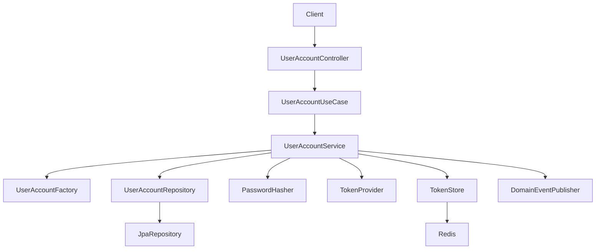
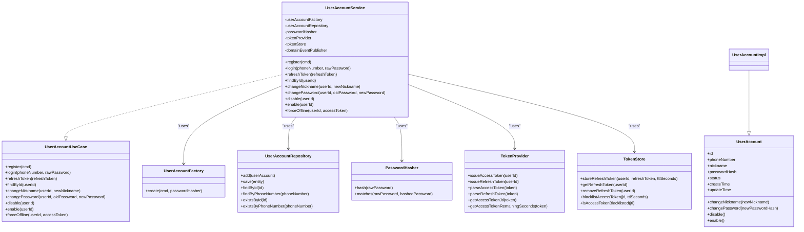
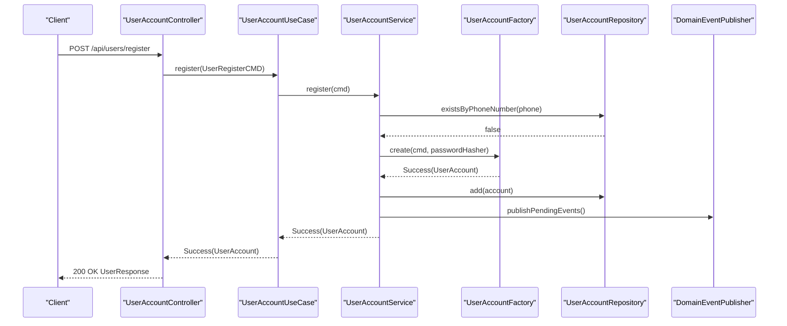
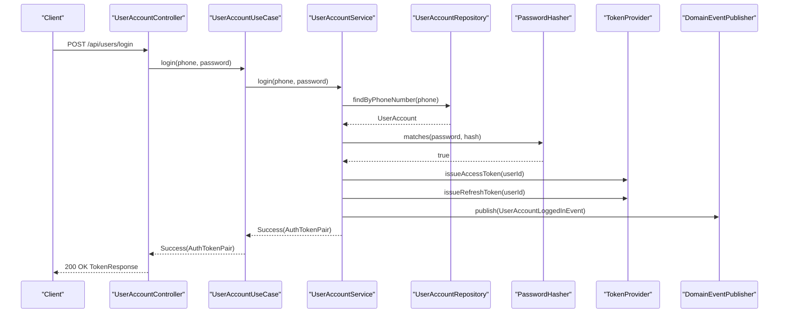
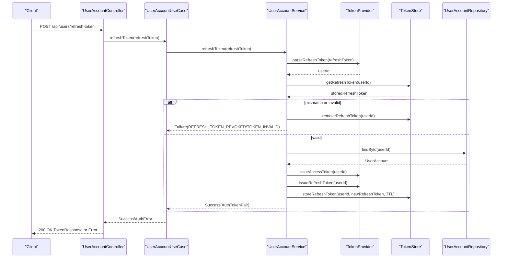
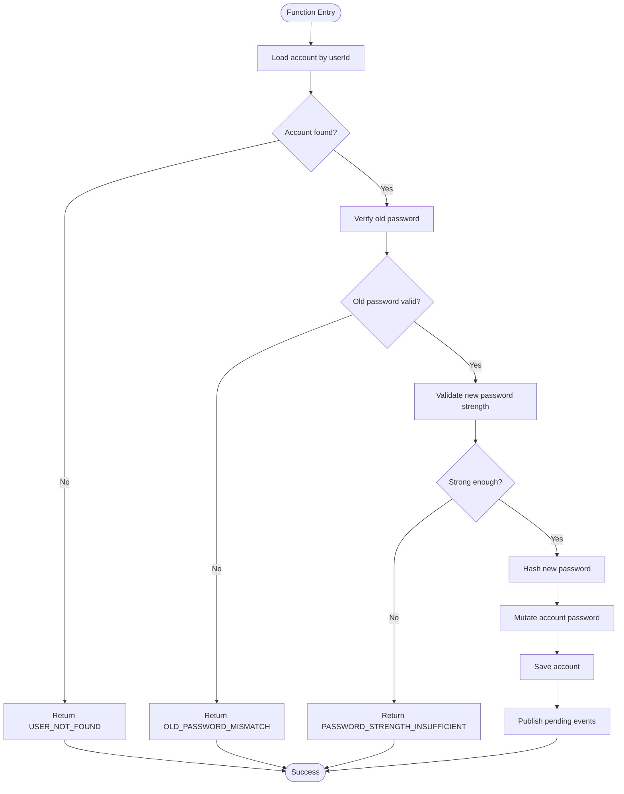
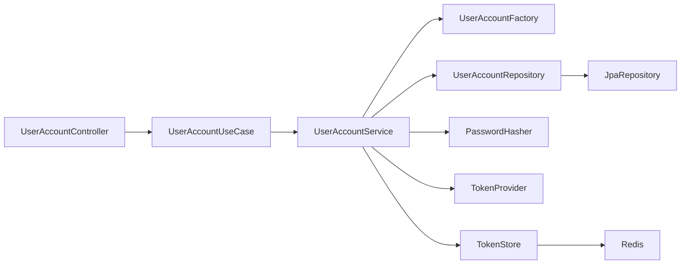

# User Application Services

<cite>
**Referenced Files in This Document**
- [UserAccountService.kt](file://j-store-user-application/src/main/kotlin/com/jstore/user/service/UserAccountService.kt)
- [UserAccountUseCase.kt](file://j-store-user-application/src/main/kotlin/com/jstore/user/service/UserAccountUseCase.kt)
- [UserAccountController.kt](file://j-store-user-boot/src/main/kotlin/com/jstore/user/controller/UserAccountController.kt)
- [TransactionalUserAccountUseCase.kt](file://j-store-user-boot/src/main/kotlin/com/jstore/user/config/TransactionalUserAccountUseCase.kt)
- [UserBootConfiguration.kt](file://j-store-user-boot/src/main/kotlin/com/jstore/user/config/UserBootConfiguration.kt)
- [UserAccount.kt](file://j-store-user-domain/src/main/kotlin/com/jstore/user/domain/useraccount/UserAccount.kt)
- [UserAccountImpl.kt](file://j-store-user-domain/src/main/kotlin/com/jstore/user/domain/useraccount/UserAccountImpl.kt)
- [UserAccountFactory.kt](file://j-store-user-domain/src/main/kotlin/com/jstore/user/domain/useraccount/UserAccountFactory.kt)
- [UserAccountRepository.kt](file://j-store-user-domain/src/main/kotlin/com/jstore/user/domain/useraccount/UserAccountRepository.kt)
- [UserAccountRepositoryImpl.kt](file://j-store-user-infrastructure/src/main/kotlin/com/jstore/user/domain/useraccount/UserAccountRepositoryImpl.kt)
- [PasswordHasher.kt](file://j-store-user-domain/src/main/kotlin/com/jstore/user/domain/useraccount/PasswordHasher.kt)
- [TokenProvider.kt](file://j-store-user-domain/src/main/kotlin/com/jstore/user/domain/useraccount/TokenProvider.kt)
- [TokenStore.kt](file://j-store-user-domain/src/main/kotlin/com/jstore/user/domain/useraccount/TokenStore.kt)
- [UserRegisterCMD.kt](file://j-store-user-domain/src/main/kotlin/com/jstore/user/domain/useraccount/command/UserRegisterCMD.kt)
- [UserAccountServiceTest.kt](file://j-store-user-application/src/test/kotlin/com/jstore/user/UserAccountServiceTest.kt)
</cite>

## Table of Contents
1. Introduction
2. Project Structure
3. Core Components
4. Architecture Overview
5. Detailed Component Analysis
6. Dependency Analysis
7. Performance Considerations
8. Troubleshooting Guide
9. Conclusion

## Introduction
This document explains the user application services and use cases for the j-store project, focusing on:
- Orchestration logic in UserAccountService
- Abstractions defined by UserAccountUseCase
- REST controller layer for user endpoints
- Workflows for registration, login, token refresh, profile updates, and account management
- Transactional boundaries, input validation, response formatting, error handling
- Testing strategies and integration patterns with domain models

The design follows a layered architecture:
- Controller layer handles HTTP requests/responses and maps to command objects
- Application service orchestrates use cases, delegates business rules to domain aggregates, persists via repositories, and publishes domain events
- Domain layer defines aggregates, factories, and value types
- Infrastructure layer implements persistence (JPA), token storage (Redis), hashing (BCrypt), and JWT token issuance

## Project Structure
Key modules involved:
- j-store-user-application: Application services and use case interfaces
- j-store-user-boot: Spring Boot configuration, controllers, transactional decorators, filters
- j-store-user-domain: Domain models, interfaces, commands, and events
- j-store-user-infrastructure: Repository implementation, token store, password hasher, JWT provider

**Diagram sources**
- [UserAccountController.kt](file://j-store-user-boot/src/main/kotlin/com/jstore/user/controller/UserAccountController.kt)
- [UserAccountUseCase.kt](file://j-store-user-application/src/main/kotlin/com/jstore/user/service/UserAccountUseCase.kt)
- [UserAccountService.kt](file://j-store-user-application/src/main/kotlin/com/jstore/user/service/UserAccountService.kt)
- [UserAccountFactory.kt](file://j-store-user-domain/src/main/kotlin/com/jstore/user/domain/useraccount/UserAccountFactory.kt)
- [UserAccountRepository.kt](file://j-store-user-domain/src/main/kotlin/com/jstore/user/domain/useraccount/UserAccountRepository.kt)
- [UserAccountRepositoryImpl.kt](file://j-store-user-infrastructure/src/main/kotlin/com/jstore/user/domain/useraccount/UserAccountRepositoryImpl.kt)
- [PasswordHasher.kt](file://j-store-user-domain/src/main/kotlin/com/jstore/user/domain/useraccount/PasswordHasher.kt)
- [TokenProvider.kt](file://j-store-user-domain/src/main/kotlin/com/jstore/user/domain/useraccount/TokenProvider.kt)
- [TokenStore.kt](file://j-store-user-domain/src/main/kotlin/com/jstore/user/domain/useraccount/TokenStore.kt)

**Section sources**
- [UserAccountController.kt](file://j-store-user-boot/src/main/kotlin/com/jstore/user/controller/UserAccountController.kt)
- [UserAccountUseCase.kt](file://j-store-user-application/src/main/kotlin/com/jstore/user/service/UserAccountUseCase.kt)
- [UserAccountService.kt](file://j-store-user-application/src/main/kotlin/com/jstore/user/service/UserAccountService.kt)
- [UserAccountRepositoryImpl.kt](file://j-store-user-infrastructure/src/main/kotlin/com/jstore/user/domain/useraccount/UserAccountRepositoryImpl.kt)
- [UserBootConfiguration.kt](file://j-store-user-boot/src/main/kotlin/com/jstore/user/config/UserBootConfiguration.kt)

## Core Components
- UserAccountUseCase: Defines the application-level operations for user accounts (register, login, refresh token, find by ID, change nickname/password, enable/disable, force offline).
- UserAccountService: Implements orchestration for each use case, delegating domain behavior to aggregates, persisting via repository, publishing domain events, and issuing tokens.
- UserAccountController: Exposes REST endpoints, maps request DTOs to commands, and formats responses using a unified Result-to-Response pattern.
- TransactionalUserAccountUseCase: Wraps write operations in database transactions and defers external side effects (e.g., Redis token operations) to after successful commit.
- Domain models: UserAccount aggregate interface and implementation, factory for creating new accounts, and value types (PhoneNumber, Nickname, Password, UserId).
- Infrastructure: Repository implementation over JPA, BCrypt password hashing, JWT token provider, and Redis-backed token store.

**Section sources**
- [UserAccountUseCase.kt](file://j-store-user-application/src/main/kotlin/com/jstore/user/service/UserAccountUseCase.kt)
- [UserAccountService.kt](file://j-store-user-application/src/main/kotlin/com/jstore/user/service/UserAccountService.kt)
- [UserAccountController.kt](file://j-store-user-boot/src/main/kotlin/com/jstore/user/controller/UserAccountController.kt)
- [TransactionalUserAccountUseCase.kt](file://j-store-user-boot/src/main/kotlin/com/jstore/user/config/TransactionalUserAccountUseCase.kt)
- [UserAccount.kt](file://j-store-user-domain/src/main/kotlin/com/jstore/user/domain/useraccount/UserAccount.kt)
- [UserAccountImpl.kt](file://j-store-user-domain/src/main/kotlin/com/jstore/user/domain/useraccount/UserAccountImpl.kt)
- [UserAccountFactory.kt](file://j-store-user-domain/src/main/kotlin/com/jstore/user/domain/useraccount/UserAccountFactory.kt)
- [UserAccountRepository.kt](file://j-store-user-domain/src/main/kotlin/com/jstore/user/domain/useraccount/UserAccountRepository.kt)
- [UserAccountRepositoryImpl.kt](file://j-store-user-infrastructure/src/main/kotlin/com/jstore/user/domain/useraccount/UserAccountRepositoryImpl.kt)
- [PasswordHasher.kt](file://j-store-user-domain/src/main/kotlin/com/jstore/user/domain/useraccount/PasswordHasher.kt)
- [TokenProvider.kt](file://j-store-user-domain/src/main/kotlin/com/jstore/user/domain/useraccount/TokenProvider.kt)
- [TokenStore.kt](file://j-store-user-domain/src/main/kotlin/com/jstore/user/domain/useraccount/TokenStore.kt)

## Architecture Overview
The user module follows DDD and clean architecture principles:
- Controllers accept HTTP requests and map them to domain commands
- Application services coordinate flows without containing business rules
- Domain aggregates encapsulate state transitions and business invariants
- Repositories abstract persistence; infrastructure provides concrete implementations
- External concerns (JWT, Redis) are modeled as interfaces in the domain layer and implemented in infrastructure

**Diagram sources**
- [UserAccountUseCase.kt](file://j-store-user-application/src/main/kotlin/com/jstore/user/service/UserAccountUseCase.kt)
- [UserAccountService.kt](file://j-store-user-application/src/main/kotlin/com/jstore/user/service/UserAccountService.kt)
- [UserAccount.kt](file://j-store-user-domain/src/main/kotlin/com/jstore/user/domain/useraccount/UserAccount.kt)
- [UserAccountImpl.kt](file://j-store-user-domain/src/main/kotlin/com/jstore/user/domain/useraccount/UserAccountImpl.kt)
- [UserAccountFactory.kt](file://j-store-user-domain/src/main/kotlin/com/jstore/user/domain/useraccount/UserAccountFactory.kt)
- [UserAccountRepository.kt](file://j-store-user-domain/src/main/kotlin/com/jstore/user/domain/useraccount/UserAccountRepository.kt)
- [PasswordHasher.kt](file://j-store-user-domain/src/main/kotlin/com/jstore/user/domain/useraccount/PasswordHasher.kt)
- [TokenProvider.kt](file://j-store-user-domain/src/main/kotlin/com/jstore/user/domain/useraccount/TokenProvider.kt)
- [TokenStore.kt](file://j-store-user-domain/src/main/kotlin/com/jstore/user/domain/useraccount/TokenStore.kt)

## Detailed Component Analysis

### UserAccountUseCase Abstraction
- Defines the contract for all user account operations at the application layer.
- Returns a typed Result to unify success/failure handling across the stack.
- Methods include registration, authentication, token refresh, profile updates, and account lifecycle management.

**Section sources**
- [UserAccountUseCase.kt](file://j-store-user-application/src/main/kotlin/com/jstore/user/service/UserAccountUseCase.kt)

### UserAccountService Orchestration Logic
Responsibilities:
- Input validation and preconditions (e.g., duplicate phone number)
- Delegation to domain aggregates for business rules
- Persistence via repository
- Publishing domain events
- Token issuance and optional token store interactions

Key workflows:
- Registration:
  - Check phone uniqueness
  - Create aggregate via factory (validates password strength, nickname)
  - Persist and publish pending events
- Login:
  - Load account by phone
  - Verify password hash
  - Ensure account is active
  - Issue access and refresh tokens
  - Publish login event
- Refresh token:
  - Parse refresh token
  - Validate stored refresh token against Redis
  - Ensure account still active
  - Issue new tokens and update stored refresh token
- Profile updates:
  - Change nickname: load, mutate, save, publish events
  - Change password: verify old password, validate new password strength, hash, mutate, save, publish events
- Account management:
  - Disable/Enable: enforce state transitions, persist, publish events
  - Force offline: publish forced offline event; token revocation deferred to decorator

Error scenarios handled:
- Duplicate phone, invalid credentials, disabled account, weak passwords, invalid tokens, revoked refresh tokens

**Section sources**
- [UserAccountService.kt](file://j-store-user-application/src/main/kotlin/com/jstore/user/service/UserAccountService.kt)
- [UserAccountFactory.kt](file://j-store-user-domain/src/main/kotlin/com/jstore/user/domain/useraccount/UserAccountFactory.kt)
- [UserAccountImpl.kt](file://j-store-user-domain/src/main/kotlin/com/jstore/user/domain/useraccount/UserAccountImpl.kt)

### Controller Layer (REST API Endpoints)
Endpoints:
- POST /api/users/register
- POST /api/users/login
- POST /api/users/refresh-token
- GET /api/users/{id}
- PUT /api/users/{id}/nickname
- PUT /api/users/{id}/password
- POST /api/users/{id}/disable
- POST /api/users/{id}/enable
- POST /api/users/{id}/force-offline

Request/response handling:
- Request DTOs: RegisterRequest, LoginRequest, RefreshTokenRequest, ChangeNicknameRequest, ChangePasswordRequest
- Response DTOs: UserResponse, TokenResponse, ErrorResponse
- Unified mapping via Result.fold to produce ResponseEntity.ok or error responses with HTTP status codes derived from BusinessError

Authentication:
- JwtAuthenticationFilter registered for /api/* paths validates tokens before reaching controllers

**Section sources**
- [UserAccountController.kt](file://j-store-user-boot/src/main/kotlin/com/jstore/user/controller/UserAccountController.kt)
- [UserBootConfiguration.kt](file://j-store-user-boot/src/main/kotlin/com/jstore/user/config/UserBootConfiguration.kt)

### Transactional Boundaries and Side Effects
- Write operations are wrapped in database transactions via TransactionalUserAccountUseCase.
- Redis token operations are deferred until after successful DB commit to avoid inconsistent states.
- Read-only queries use read-only transactions where applicable.
- Refresh token flow intentionally avoids pretending to be an atomic DB transaction because it involves external state exchange.

Decorator behaviors:
- login: stores refresh token in Redis after successful DB transaction
- disable: removes refresh token after disabling
- forceOffline: blacklists access token and removes refresh token after forcing offline

**Section sources**
- [TransactionalUserAccountUseCase.kt](file://j-store-user-boot/src/main/kotlin/com/jstore/user/config/TransactionalUserAccountUseCase.kt)

### Domain Models and Aggregates
- UserAccount interface defines identity, attributes, and lifecycle methods.
- UserAccountImpl implements state transitions with guards (e.g., only ACTIVE can be disabled).
- UserAccountFactory creates new accounts with validated inputs and records domain events.
- Value types: PhoneNumber, Nickname, Password, UserId ensure type safety and constraints.

**Section sources**
- [UserAccount.kt](file://j-store-user-domain/src/main/kotlin/com/jstore/user/domain/useraccount/UserAccount.kt)
- [UserAccountImpl.kt](file://j-store-user-domain/src/main/kotlin/com/jstore/user/domain/useraccount/UserAccountImpl.kt)
- [UserAccountFactory.kt](file://j-store-user-domain/src/main/kotlin/com/jstore/user/domain/useraccount/UserAccountFactory.kt)
- [UserRegisterCMD.kt](file://j-store-user-domain/src/main/kotlin/com/jstore/user/domain/useraccount/command/UserRegisterCMD.kt)

### Repository and Persistence
- UserAccountRepository defines domain-facing operations (add, save, findById, findByPhoneNumber, exists*).
- UserAccountRepositoryImpl implements JPA persistence with mandatory transaction propagation.
- Converter maps between domain entities and persistent objects.

**Section sources**
- [UserAccountRepository.kt](file://j-store-user-domain/src/main/kotlin/com/jstore/user/domain/useraccount/UserAccountRepository.kt)
- [UserAccountRepositoryImpl.kt](file://j-store-user-infrastructure/src/main/kotlin/com/jstore/user/domain/useraccount/UserAccountRepositoryImpl.kt)

### Security and Tokens
- PasswordHasher abstracts hashing (BCrypt implementation in infrastructure).
- TokenProvider abstracts JWT issuance and parsing (JWT implementation in infrastructure).
- TokenStore abstracts Redis-based token storage and blacklist management.

**Section sources**
- [PasswordHasher.kt](file://j-store-user-domain/src/main/kotlin/com/jstore/user/domain/useraccount/PasswordHasher.kt)
- [TokenProvider.kt](file://j-store-user-domain/src/main/kotlin/com/jstore/user/domain/useraccount/TokenProvider.kt)
- [TokenStore.kt](file://j-store-user-domain/src/main/kotlin/com/jstore/user/domain/useraccount/TokenStore.kt)

### Sequence Diagrams

#### Registration Flow

**Diagram sources**
- [UserAccountController.kt](file://j-store-user-boot/src/main/kotlin/com/jstore/user/controller/UserAccountController.kt)
- [UserAccountService.kt](file://j-store-user-application/src/main/kotlin/com/jstore/user/service/UserAccountService.kt)
- [UserAccountFactory.kt](file://j-store-user-domain/src/main/kotlin/com/jstore/user/domain/useraccount/UserAccountFactory.kt)
- [UserAccountRepository.kt](file://j-store-user-domain/src/main/kotlin/com/jstore/user/domain/useraccount/UserAccountRepository.kt)

#### Login Flow

**Diagram sources**
- [UserAccountController.kt](file://j-store-user-boot/src/main/kotlin/com/jstore/user/controller/UserAccountController.kt)
- [UserAccountService.kt](file://j-store-user-application/src/main/kotlin/com/jstore/user/service/UserAccountService.kt)
- [PasswordHasher.kt](file://j-store-user-domain/src/main/kotlin/com/jstore/user/domain/useraccount/PasswordHasher.kt)
- [TokenProvider.kt](file://j-store-user-domain/src/main/kotlin/com/jstore/user/domain/useraccount/TokenProvider.kt)

#### Token Refresh Flow

**Diagram sources**
- [UserAccountController.kt](file://j-store-user-boot/src/main/kotlin/com/jstore/user/controller/UserAccountController.kt)
- [UserAccountService.kt](file://j-store-user-application/src/main/kotlin/com/jstore/user/service/UserAccountService.kt)
- [TokenProvider.kt](file://j-store-user-domain/src/main/kotlin/com/jstore/user/domain/useraccount/TokenProvider.kt)
- [TokenStore.kt](file://j-store-user-domain/src/main/kotlin/com/jstore/user/domain/useraccount/TokenStore.kt)
- [UserAccountRepository.kt](file://j-store-user-domain/src/main/kotlin/com/jstore/user/domain/useraccount/UserAccountRepository.kt)

#### Profile Update Flow (Change Password)

**Diagram sources**
- [UserAccountService.kt](file://j-store-user-application/src/main/kotlin/com/jstore/user/service/UserAccountService.kt)
- [UserAccountFactory.kt](file://j-store-user-domain/src/main/kotlin/com/jstore/user/domain/useraccount/UserAccountFactory.kt)

### Input Validation and Response Formatting
- Input validation occurs in both controller DTOs and domain layers:
  - Phone number and nickname constructed via value types
  - Password strength enforced in factory and change password flow
- Response formatting uses a consistent Result.fold helper to map successes to 200 OK with typed payloads and failures to appropriate HTTP status codes with error messages and codes.

**Section sources**
- [UserAccountController.kt](file://j-store-user-boot/src/main/kotlin/com/jstore/user/controller/UserAccountController.kt)
- [UserAccountFactory.kt](file://j-store-user-domain/src/main/kotlin/com/jstore/user/domain/useraccount/UserAccountFactory.kt)

### Testing Strategies
- Unit tests for UserAccountService mock dependencies to verify orchestration logic, error paths, and event publishing.
- Tests cover:
  - Registration success and duplicate phone rejection
  - Login success, not found, password mismatch, disabled account
  - Refresh token success, invalid token, mismatched token, disabled account
  - Change password success, wrong old password, weak new password
  - Force offline defers token revocation to decorator
  - Disable persists state and defers token revocation

Integration patterns:
- Repository implementation uses JPA with mandatory transaction propagation
- Token store and hasher are injected via interfaces, enabling test doubles

**Section sources**
- [UserAccountServiceTest.kt](file://j-store-user-application/src/test/kotlin/com/jstore/user/UserAccountServiceTest.kt)
- [UserAccountRepositoryImpl.kt](file://j-store-user-infrastructure/src/main/kotlin/com/jstore/user/domain/useraccount/UserAccountRepositoryImpl.kt)

## Dependency Analysis
- Controller depends on UserAccountUseCase abstraction
- UseCase implemented by UserAccountService
- Service depends on domain abstractions: factory, repository, hasher, token provider, token store, event publisher
- Repository implementation depends on JPA
- Token store depends on Redis
- Configuration wires beans and sets primary decorator for transactional behavior

**Diagram sources**
- [UserAccountController.kt](file://j-store-user-boot/src/main/kotlin/com/jstore/user/controller/UserAccountController.kt)
- [UserAccountUseCase.kt](file://j-store-user-application/src/main/kotlin/com/jstore/user/service/UserAccountUseCase.kt)
- [UserAccountService.kt](file://j-store-user-application/src/main/kotlin/com/jstore/user/service/UserAccountService.kt)
- [UserAccountRepositoryImpl.kt](file://j-store-user-infrastructure/src/main/kotlin/com/jstore/user/domain/useraccount/UserAccountRepositoryImpl.kt)
- [TokenStore.kt](file://j-store-user-domain/src/main/kotlin/com/jstore/user/domain/useraccount/TokenStore.kt)

**Section sources**
- [UserBootConfiguration.kt](file://j-store-user-boot/src/main/kotlin/com/jstore/user/config/UserBootConfiguration.kt)

## Performance Considerations
- Short-lived access tokens reduce server-side session overhead
- Refresh tokens stored in Redis with TTL to limit memory usage
- Database writes are minimized within transactions; reads are optimized via targeted queries
- Event publishing is decoupled to avoid blocking critical paths

[No sources needed since this section provides general guidance]

## Troubleshooting Guide
Common errors and their causes:
- PHONE_ALREADY_REGISTERED: Attempting to register with an existing phone number
- USER_NOT_FOUND: Login or lookup by non-existent phone/id
- PASSWORD_MISMATCH: Incorrect password during login
- ACCOUNT_DISABLED: Login or refresh attempted on disabled account
- TOKEN_INVALID: Malformed or expired refresh token
- REFRESH_TOKEN_REVOKED: Mismatch between provided and stored refresh token
- OLD_PASSWORD_MISMATCH: Wrong old password when changing password
- PASSWORD_STRENGTH_INSUFFICIENT: New password does not meet complexity requirements

Debugging tips:
- Inspect Result outcomes in controller mappings
- Verify domain event publication for auditability
- Check Redis state for refresh tokens and blacklists
- Ensure transactional decorator applies to write operations

**Section sources**
- [UserAccountService.kt](file://j-store-user-application/src/main/kotlin/com/jstore/user/service/UserAccountService.kt)
- [UserAccountController.kt](file://j-store-user-boot/src/main/kotlin/com/jstore/user/controller/UserAccountController.kt)
- [TransactionalUserAccountUseCase.kt](file://j-store-user-boot/src/main/kotlin/com/jstore/user/config/TransactionalUserAccountUseCase.kt)

## Conclusion
The user application services implement a clear separation of concerns:
- Controllers handle HTTP concerns and DTO mapping
- Application services orchestrate workflows and delegate business rules to domain aggregates
- Domain models encapsulate invariants and state transitions
- Infrastructure provides concrete implementations for persistence, security, and token management
- Transactional boundaries ensure consistency while deferring external side effects appropriately
- Comprehensive unit tests validate orchestration logic and error handling

This design supports maintainability, testability, and scalability for user-related features such as registration, authentication, profile updates, and account management.