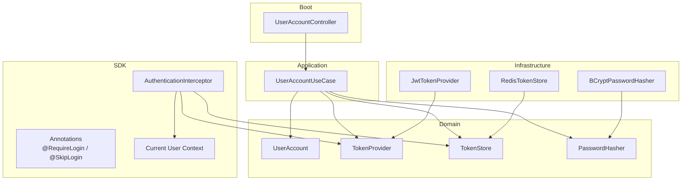
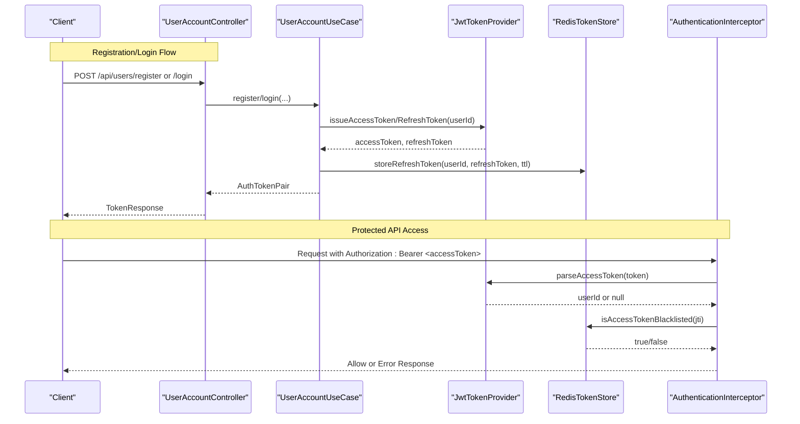
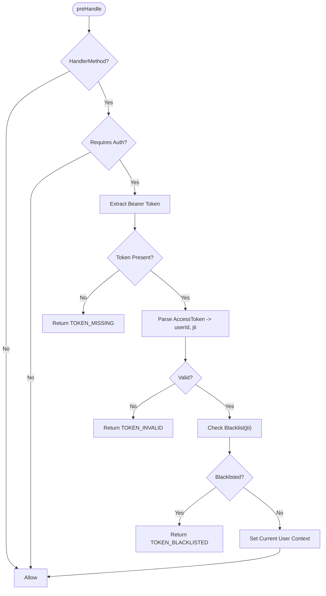
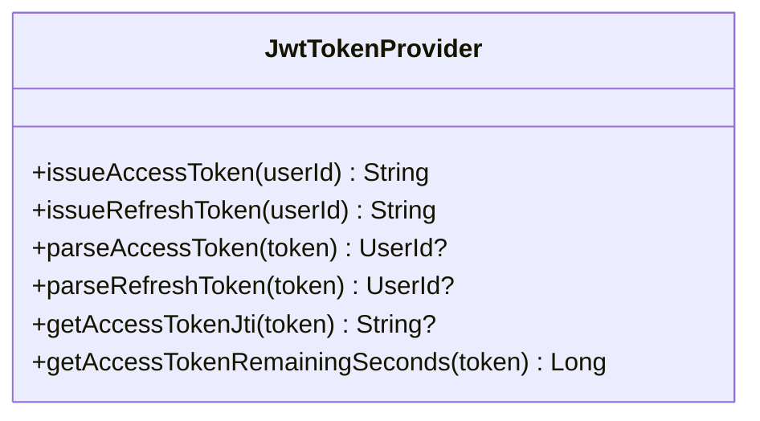
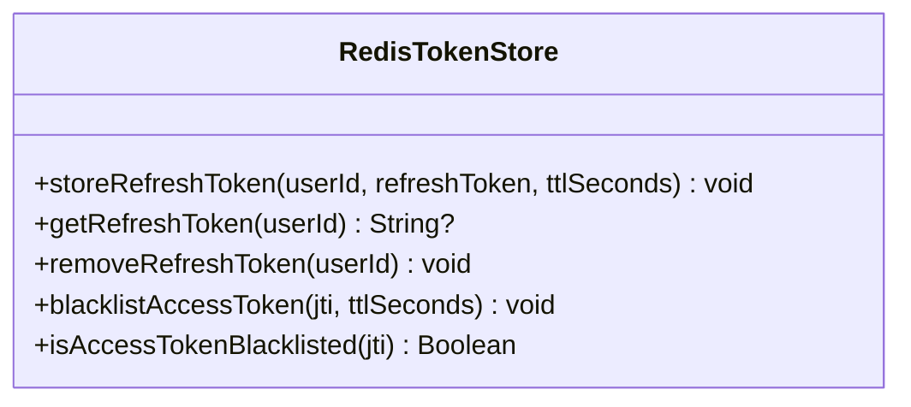
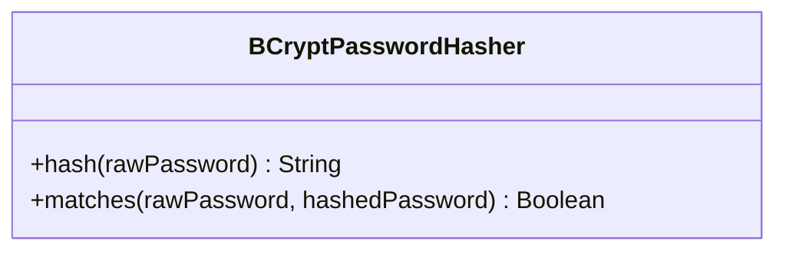
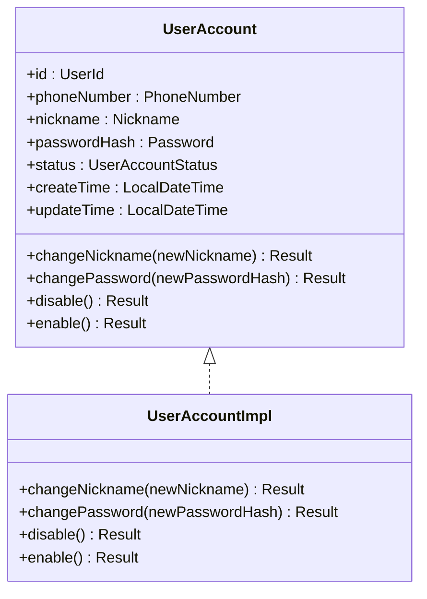
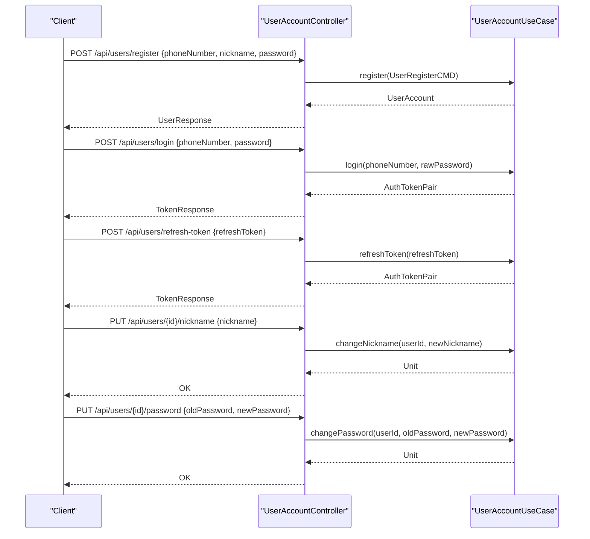
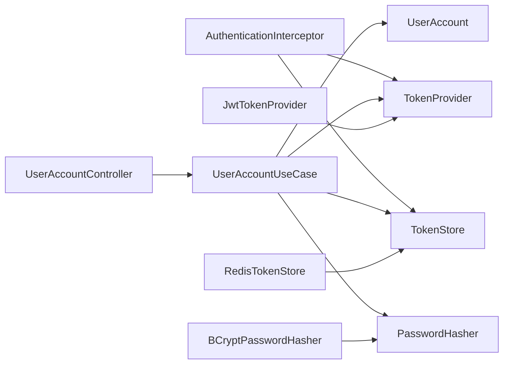

# User Authentication Module

<cite>
**Referenced Files in This Document**
- [AuthenticationInterceptor.kt](file://j-store-authentication-spring-sdk/src/main/kotlin/com/jstore/authentication/spring/AuthenticationInterceptor.kt)
- [JwtTokenProvider.kt](file://j-store-user-infrastructure/src/main/kotlin/com/jstore/user/domain/useraccount/JwtTokenProvider.kt)
- [RedisTokenStore.kt](file://j-store-user-infrastructure/src/main/kotlin/com/jstore/user/domain/useraccount/RedisTokenStore.kt)
- [BCryptPasswordHasher.kt](file://j-store-user-infrastructure/src/main/kotlin/com/jstore/user/domain/useraccount/BCryptPasswordHasher.kt)
- [UserAccountController.kt](file://j-store-user-boot/src/main/kotlin/com/jstore/user/controller/UserAccountController.kt)
- [UserAccountUseCase.kt](file://j-store-user-application/src/main/kotlin/com/jstore/user/service/UserAccountUseCase.kt)
- [UserAccount.kt](file://j-store-user-domain/src/main/kotlin/com/jstore/user/domain/useraccount/UserAccount.kt)
- [UserAccountImpl.kt](file://j-store-user-domain/src/main/kotlin/com/jstore/user/domain/useraccount/UserAccountImpl.kt)
</cite>

## Table of Contents
1. [Introduction](#introduction)
2. [Project Structure](#project-structure)
3. [Core Components](#core-components)
4. [Architecture Overview](#architecture-overview)
5. [Detailed Component Analysis](#detailed-component-analysis)
6. [Dependency Analysis](#dependency-analysis)
7. [Performance Considerations](#performance-considerations)
8. [Troubleshooting Guide](#troubleshooting-guide)
9. [Conclusion](#conclusion)

## Introduction
This document explains the User Authentication module, focusing on user account management, JWT token handling, and role-based authorization patterns. It covers registration, login, refresh-token flow, profile updates, authentication interceptor behavior, current user context, and security configuration. It also details token storage using Redis, password hashing with BCrypt, token expiration, session management via blacklisting, and provides concrete examples for beginners while maintaining technical depth for experienced developers.

## Project Structure
The authentication feature spans multiple modules:
- SDK layer (Spring integration): Interceptor, annotations, auto-configuration, and current user context
- Domain layer: User account model, token provider interface, token store interface, password hasher interface
- Infrastructure layer: JWT token provider, Redis-backed token store, BCrypt password hasher
- Boot layer: REST controller exposing endpoints for registration, login, refresh, and profile operations
- Application layer: Use case interface defining business operations

**Diagram sources**
- [AuthenticationInterceptor.kt](file://j-store-authentication-spring-sdk/src/main/kotlin/com/jstore/authentication/spring/AuthenticationInterceptor.kt)
- [UserAccountController.kt](file://j-store-user-boot/src/main/kotlin/com/jstore/user/controller/UserAccountController.kt)
- [UserAccountUseCase.kt](file://j-store-user-application/src/main/kotlin/com/jstore/user/service/UserAccountUseCase.kt)
- [UserAccount.kt](file://j-store-user-domain/src/main/kotlin/com/jstore/user/domain/useraccount/UserAccount.kt)
- [JwtTokenProvider.kt](file://j-store-user-infrastructure/src/main/kotlin/com/jstore/user/domain/useraccount/JwtTokenProvider.kt)
- [RedisTokenStore.kt](file://j-store-user-infrastructure/src/main/kotlin/com/jstore/user/domain/useraccount/RedisTokenStore.kt)
- [BCryptPasswordHasher.kt](file://j-store-user-infrastructure/src/main/kotlin/com/jstore/user/domain/useraccount/BCryptPasswordHasher.kt)

**Section sources**
- [AuthenticationInterceptor.kt](file://j-store-authentication-spring-sdk/src/main/kotlin/com/jstore/authentication/spring/AuthenticationInterceptor.kt)
- [UserAccountController.kt](file://j-store-user-boot/src/main/kotlin/com/jstore/user/controller/UserAccountController.kt)
- [UserAccountUseCase.kt](file://j-store-user-application/src/main/kotlin/com/jstore/user/service/UserAccountUseCase.kt)
- [UserAccount.kt](file://j-store-user-domain/src/main/kotlin/com/jstore/user/domain/useraccount/UserAccount.kt)
- [JwtTokenProvider.kt](file://j-store-user-infrastructure/src/main/kotlin/com/jstore/user/domain/useraccount/JwtTokenProvider.kt)
- [RedisTokenStore.kt](file://j-store-user-infrastructure/src/main/kotlin/com/jstore/user/domain/useraccount/RedisTokenStore.kt)
- [BCryptPasswordHasher.kt](file://j-store-user-infrastructure/src/main/kotlin/com/jstore/user/domain/useraccount/BCryptPasswordHasher.kt)

## Core Components
- AuthenticationInterceptor: Validates requests, extracts bearer tokens, checks blacklist, sets current user context, and enforces path-level or annotation-based access control.
- JwtTokenProvider: Issues and parses JWTs (access and refresh), computes remaining TTL, and supports token type validation.
- RedisTokenStore: Stores refresh tokens per user and maintains an access token blacklist keyed by jti with TTL.
- BCryptPasswordHasher: Hashes and verifies passwords using Spring Security’s BCrypt encoder.
- UserAccountController: Exposes endpoints for register, login, refresh-token, find-by-id, change nickname/password, disable/enable, and force offline.
- UserAccountUseCase: Defines business operations for account lifecycle and authentication flows.
- UserAccount and UserAccountImpl: Aggregate root modeling account state transitions and behaviors.

**Section sources**
- [AuthenticationInterceptor.kt](file://j-store-authentication-spring-sdk/src/main/kotlin/com/jstore/authentication/spring/AuthenticationInterceptor.kt)
- [JwtTokenProvider.kt](file://j-store-user-infrastructure/src/main/kotlin/com/jstore/user/domain/useraccount/JwtTokenProvider.kt)
- [RedisTokenStore.kt](file://j-store-user-infrastructure/src/main/kotlin/com/jstore/user/domain/useraccount/RedisTokenStore.kt)
- [BCryptPasswordHasher.kt](file://j-store-user-infrastructure/src/main/kotlin/com/jstore/user/domain/useraccount/BCryptPasswordHasher.kt)
- [UserAccountController.kt](file://j-store-user-boot/src/main/kotlin/com/jstore/user/controller/UserAccountController.kt)
- [UserAccountUseCase.kt](file://j-store-user-application/src/main/kotlin/com/jstore/user/service/UserAccountUseCase.kt)
- [UserAccount.kt](file://j-store-user-domain/src/main/kotlin/com/jstore/user/domain/useraccount/UserAccount.kt)
- [UserAccountImpl.kt](file://j-store-user-domain/src/main/kotlin/com/jstore/user/domain/useraccount/UserAccountImpl.kt)

## Architecture Overview
The authentication architecture separates concerns across layers:
- HTTP entry points are handled by controllers that delegate to use cases.
- Use cases orchestrate domain logic and infrastructure services.
- The Spring SDK intercepts requests to enforce authentication and populate current user context.
- Token issuance and validation are delegated to a JWT provider; persistence and blacklisting are delegated to Redis.

**Diagram sources**
- [UserAccountController.kt](file://j-store-user-boot/src/main/kotlin/com/jstore/user/controller/UserAccountController.kt)
- [UserAccountUseCase.kt](file://j-store-user-application/src/main/kotlin/com/jstore/user/service/UserAccountUseCase.kt)
- [JwtTokenProvider.kt](file://j-store-user-infrastructure/src/main/kotlin/com/jstore/user/domain/useraccount/JwtTokenProvider.kt)
- [RedisTokenStore.kt](file://j-store-user-infrastructure/src/main/kotlin/com/jstore/user/domain/useraccount/RedisTokenStore.kt)
- [AuthenticationInterceptor.kt](file://j-store-authentication-spring-sdk/src/main/kotlin/com/jstore/authentication/spring/AuthenticationInterceptor.kt)

## Detailed Component Analysis

### Authentication Interceptor
- Extracts Bearer token from Authorization header.
- Parses access token to obtain userId and jti.
- Checks token blacklist via Redis.
- Sets current authenticated user context for downstream handlers.
- Enforces authentication based on:
  - Method/class annotations (@RequireLogin, @SkipLogin)
  - Configured path patterns (authenticated vs excluded)
- Returns standardized error responses for missing, invalid, or blacklisted tokens.

**Diagram sources**
- [AuthenticationInterceptor.kt](file://j-store-authentication-spring-sdk/src/main/kotlin/com/jstore/authentication/spring/AuthenticationInterceptor.kt)

**Section sources**
- [AuthenticationInterceptor.kt](file://j-store-authentication-spring-sdk/src/main/kotlin/com/jstore/authentication/spring/AuthenticationInterceptor.kt)

### JWT Token Provider
- Issues short-lived access tokens (15 minutes) and longer-lived refresh tokens (7 days).
- Includes claims: userId, type (access/refresh), iat, exp, and unique id (jti).
- Provides methods to parse tokens and compute remaining seconds until expiration.
- Uses HS256 with a secret key derived from configuration.

**Diagram sources**
- [JwtTokenProvider.kt](file://j-store-user-infrastructure/src/main/kotlin/com/jstore/user/domain/useraccount/JwtTokenProvider.kt)

**Section sources**
- [JwtTokenProvider.kt](file://j-store-user-infrastructure/src/main/kotlin/com/jstore/user/domain/useraccount/JwtTokenProvider.kt)

### Redis Token Store
- Stores refresh tokens per user with TTL equal to refresh token expiry.
- Maintains an access token blacklist keyed by jti with TTL matching access token expiry.
- Supports get/remove for refresh tokens and hasKey check for blacklist entries.

**Diagram sources**
- [RedisTokenStore.kt](file://j-store-user-infrastructure/src/main/kotlin/com/jstore/user/domain/useraccount/RedisTokenStore.kt)

**Section sources**
- [RedisTokenStore.kt](file://j-store-user-infrastructure/src/main/kotlin/com/jstore/user/domain/useraccount/RedisTokenStore.kt)

### Password Hashing with BCrypt
- Wraps Spring Security’s BCryptPasswordEncoder.
- Provides hash and match operations for secure password handling.
- Default strength is configurable; higher values increase security but cost more CPU.

**Diagram sources**
- [BCryptPasswordHasher.kt](file://j-store-user-infrastructure/src/main/kotlin/com/jstore/user/domain/useraccount/BCryptPasswordHasher.kt)

**Section sources**
- [BCryptPasswordHasher.kt](file://j-store-user-infrastructure/src/main/kotlin/com/jstore/user/domain/useraccount/BCryptPasswordHasher.kt)

### User Account Model and Lifecycle
- UserAccount aggregate defines identity, credentials, status, timestamps, and behaviors like changing nickname/password and enabling/disabling accounts.
- UserAccountImpl implements state transitions and updates timestamps accordingly.

**Diagram sources**
- [UserAccount.kt](file://j-store-user-domain/src/main/kotlin/com/jstore/user/domain/useraccount/UserAccount.kt)
- [UserAccountImpl.kt](file://j-store-user-domain/src/main/kotlin/com/jstore/user/domain/useraccount/UserAccountImpl.kt)

**Section sources**
- [UserAccount.kt](file://j-store-user-domain/src/main/kotlin/com/jstore/user/domain/useraccount/UserAccount.kt)
- [UserAccountImpl.kt](file://j-store-user-domain/src/main/kotlin/com/jstore/user/domain/useraccount/UserAccountImpl.kt)

### Controller Endpoints and Workflows
- Register: Creates a new account and returns account details.
- Login: Authenticates user and returns access and refresh tokens with expiration times.
- Refresh Token: Validates refresh token and issues new token pair.
- Profile Update: Change nickname/password, enable/disable account, and force offline.
- Find By Id: Retrieve account details.

**Diagram sources**
- [UserAccountController.kt](file://j-store-user-boot/src/main/kotlin/com/jstore/user/controller/UserAccountController.kt)
- [UserAccountUseCase.kt](file://j-store-user-application/src/main/kotlin/com/jstore/user/service/UserAccountUseCase.kt)

**Section sources**
- [UserAccountController.kt](file://j-store-user-boot/src/main/kotlin/com/jstore/user/controller/UserAccountController.kt)
- [UserAccountUseCase.kt](file://j-store-user-application/src/main/kotlin/com/jstore/user/service/UserAccountUseCase.kt)

## Dependency Analysis
- Interceptor depends on TokenProvider and TokenStore to validate tokens and check blacklist.
- Controller depends on UserAccountUseCase to execute business operations.
- UseCase depends on domain models and infrastructure abstractions (TokenProvider, TokenStore, PasswordHasher).
- Infrastructure implementations provide concrete behavior for JWT and Redis.

**Diagram sources**
- [AuthenticationInterceptor.kt](file://j-store-authentication-spring-sdk/src/main/kotlin/com/jstore/authentication/spring/AuthenticationInterceptor.kt)
- [UserAccountController.kt](file://j-store-user-boot/src/main/kotlin/com/jstore/user/controller/UserAccountController.kt)
- [UserAccountUseCase.kt](file://j-store-user-application/src/main/kotlin/com/jstore/user/service/UserAccountUseCase.kt)
- [JwtTokenProvider.kt](file://j-store-user-infrastructure/src/main/kotlin/com/jstore/user/domain/useraccount/JwtTokenProvider.kt)
- [RedisTokenStore.kt](file://j-store-user-infrastructure/src/main/kotlin/com/jstore/user/domain/useraccount/RedisTokenStore.kt)
- [BCryptPasswordHasher.kt](file://j-store-user-infrastructure/src/main/kotlin/com/jstore/user/domain/useraccount/BCryptPasswordHasher.kt)

**Section sources**
- [AuthenticationInterceptor.kt](file://j-store-authentication-spring-sdk/src/main/kotlin/com/jstore/authentication/spring/AuthenticationInterceptor.kt)
- [UserAccountController.kt](file://j-store-user-boot/src/main/kotlin/com/jstore/user/controller/UserAccountController.kt)
- [UserAccountUseCase.kt](file://j-store-user-application/src/main/kotlin/com/jstore/user/service/UserAccountUseCase.kt)
- [JwtTokenProvider.kt](file://j-store-user-infrastructure/src/main/kotlin/com/jstore/user/domain/useraccount/JwtTokenProvider.kt)
- [RedisTokenStore.kt](file://j-store-user-infrastructure/src/main/kotlin/com/jstore/user/domain/useraccount/RedisTokenStore.kt)
- [BCryptPasswordHasher.kt](file://j-store-user-infrastructure/src/main/kotlin/com/jstore/user/domain/useraccount/BCryptPasswordHasher.kt)

## Performance Considerations
- JWT parsing and signature verification are lightweight but should be cached where possible.
- Redis operations for refresh token storage and blacklist checks are fast; ensure proper connection pooling and TTL alignment with token lifetimes.
- BCrypt hashing is CPU-intensive; tune strength based on server capacity and latency requirements.
- Short-lived access tokens reduce risk and minimize blacklist size; refresh tokens can be rotated on each use to limit exposure.

[No sources needed since this section provides general guidance]

## Troubleshooting Guide
Common issues and resolutions:
- Missing token: Ensure Authorization header includes “Bearer <token>”.
- Invalid token: Verify token signature and type claim; re-issue if expired.
- Blacklisted token: Indicates forced logout or revocation; client must refresh using a valid refresh token or re-login.
- Redis connectivity: Confirm Redis availability and correct TTL settings for keys.
- Password mismatch: Validate input encoding and ensure BCrypt encoder strength is consistent across environments.

**Section sources**
- [AuthenticationInterceptor.kt](file://j-store-authentication-spring-sdk/src/main/kotlin/com/jstore/authentication/spring/AuthenticationInterceptor.kt)
- [JwtTokenProvider.kt](file://j-store-user-infrastructure/src/main/kotlin/com/jstore/user/domain/useraccount/JwtTokenProvider.kt)
- [RedisTokenStore.kt](file://j-store-user-infrastructure/src/main/kotlin/com/jstore/user/domain/useraccount/RedisTokenStore.kt)
- [BCryptPasswordHasher.kt](file://j-store-user-infrastructure/src/main/kotlin/com/jstore/user/domain/useraccount/BCryptPasswordHasher.kt)

## Conclusion
The User Authentication module provides a robust, layered approach to securing APIs through JWT-based tokens, Redis-backed session management, and BCrypt password hashing. The interceptor enforces authentication consistently, while the controller and use cases expose clear workflows for registration, login, token refresh, and profile management. Proper configuration of token lifetimes, blacklist strategies, and password hashing ensures both security and performance.

[No sources needed since this section summarizes without analyzing specific files]