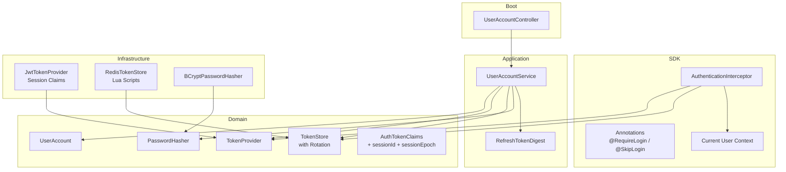
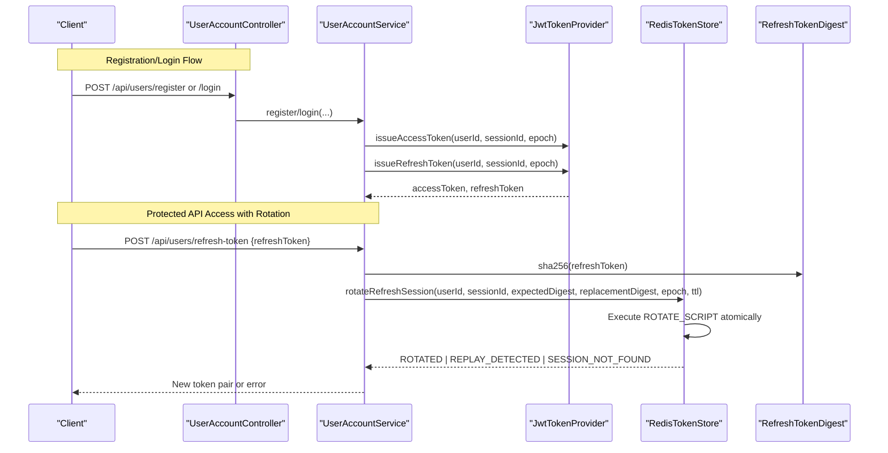
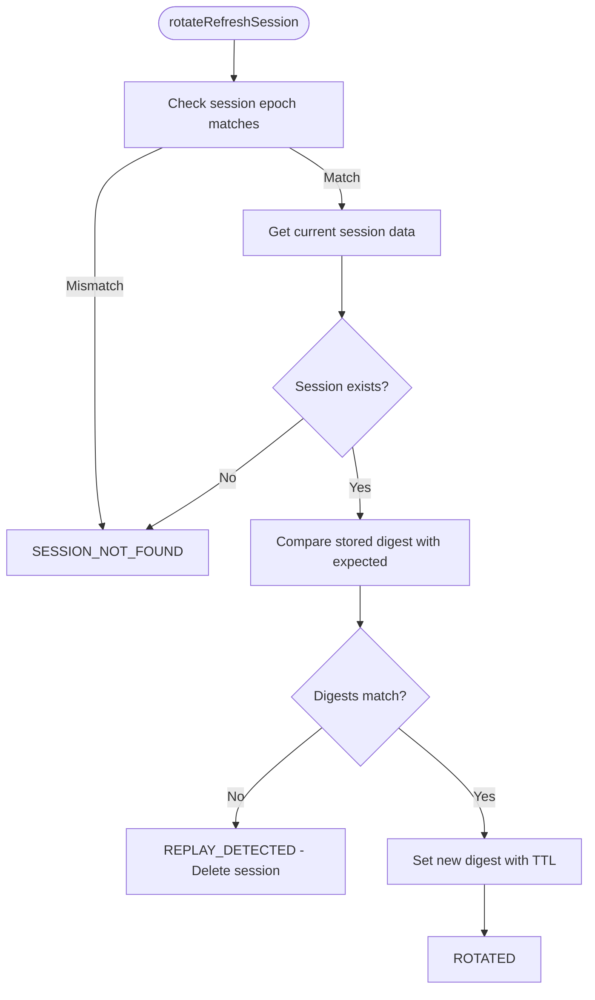
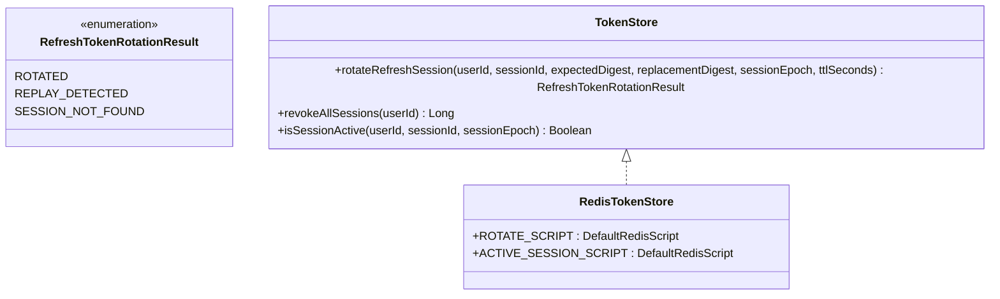
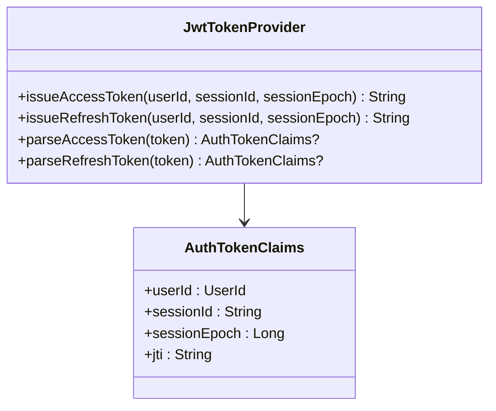
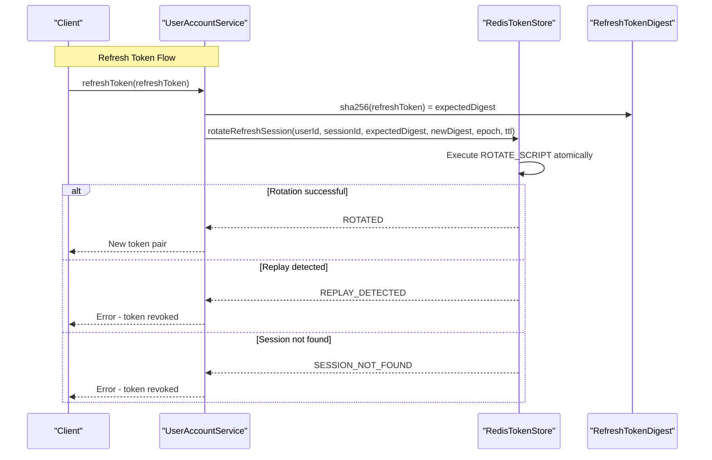
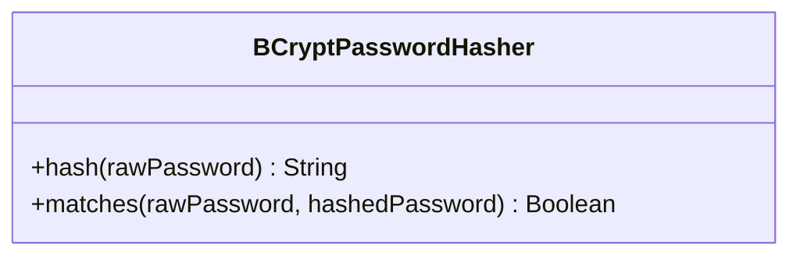
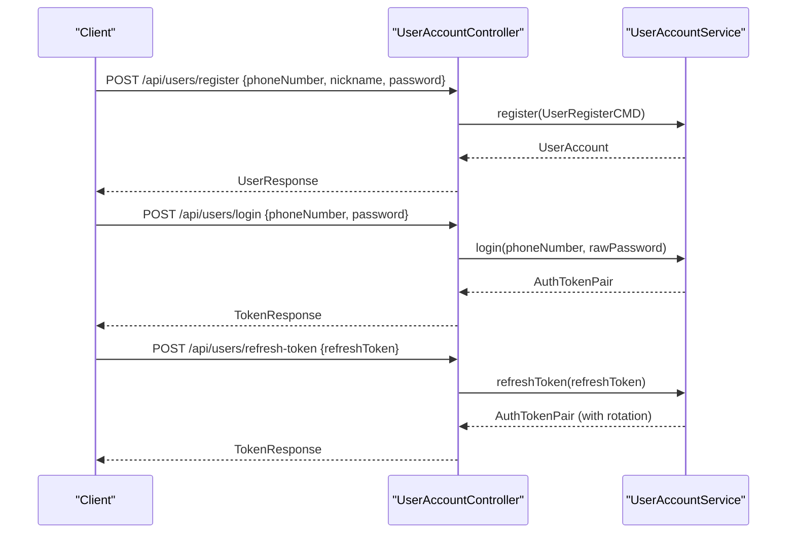
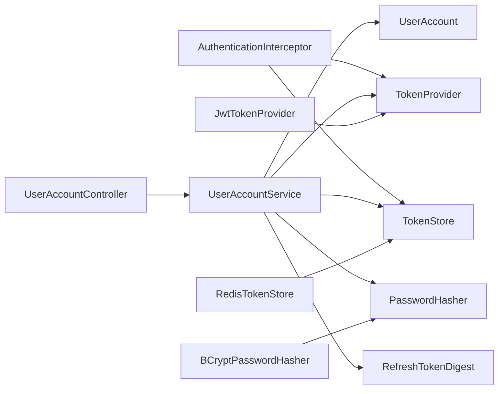

# User Authentication Module

<cite>
**Referenced Files in This Document**
- [AuthenticationInterceptor.kt](file://j-store-authentication-spring-sdk/src/main/kotlin/com/jstore/authentication/spring/AuthenticationInterceptor.kt)
- [JwtTokenProvider.kt](file://j-store-user-infrastructure/src/main/kotlin/com/jstore/user/domain/useraccount/JwtTokenProvider.kt)
- [RedisTokenStore.kt](file://j-store-user-infrastructure/src/main/kotlin/com/jstore/user/domain/useraccount/RedisTokenStore.kt)
- [BCryptPasswordHasher.kt](file://j-store-user-infrastructure/src/main/kotlin/com/jstore/user/domain/useraccount/BCryptPasswordHasher.kt)
- [UserAccountController.kt](file://j-store-user-boot/src/main/kotlin/com/jstore/user/controller/UserAccountController.kt)
- [UserAccountService.kt](file://j-store-user-application/src/main/kotlin/com/jstore/user/service/UserAccountService.kt)
- [TokenStore.kt](file://j-store-user-domain/src/main/kotlin/com/jstore/user/domain/useraccount/TokenStore.kt)
- [RefreshTokenDigest.kt](file://j-store-user-application/src/main/kotlin/com/jstore/user/service/RefreshTokenDigest.kt)
- [AuthTokenPair.kt](file://j-store-user-domain/src/main/kotlin/com/jstore/user/domain/useraccount/AuthTokenPair.kt)
- [TokenProvider.kt](file://j-store-user-domain/src/main/kotlin/com/jstore/user/domain/useraccount/TokenProvider.kt)
</cite>

## Update Summary
**Changes Made**
- Updated Redis Token Store section to reflect atomic operations using Redis Lua scripts for refresh token rotation and concurrent session validation
- Added new Refresh Token Rotation Security section covering replay attack protection and digest-based verification
- Enhanced Token Claims section to document session epoch and session ID claims for improved security
- Updated authentication flow diagrams to show the new rotation mechanism
- Added comprehensive coverage of concurrent session management and token revocation strategies

## Table of Contents
1. [Introduction](#introduction)
2. [Project Structure](#project-structure)
3. [Core Components](#core-components)
4. [Architecture Overview](#architecture-overview)
5. [Detailed Component Analysis](#detailed-component-analysis)
6. [Dependency Analysis](#dependency-analysis)
7. [Performance Considerations](#performance-considerations)
8. [Troubleshooting Guide](#troubleshooting-guide)
9. [Conclusion](#conclusion)

## Introduction
This document explains the User Authentication module, focusing on user account management, JWT token handling with enhanced security features, and role-based authorization patterns. The system has been significantly hardened with Redis-backed session management featuring atomic refresh token rotation, replay attack protection, and concurrent session validation. It covers registration, login, refresh-token flow with rotation, profile updates, authentication interceptor behavior, current user context, and security configuration. The implementation uses Redis Lua scripts for atomic operations, BCrypt password hashing, and sophisticated session management with epoch-based invalidation.

## Project Structure
The authentication feature spans multiple modules with enhanced security:
- SDK layer (Spring integration): Interceptor, annotations, auto-configuration, and current user context
- Domain layer: User account model, token provider interface, enhanced token store interface with rotation support, password hasher interface
- Infrastructure layer: JWT token provider with session claims, Redis-backed token store with Lua scripts, BCrypt password hasher
- Boot layer: REST controller exposing endpoints for registration, login, refresh, and profile operations
- Application layer: Use case interface defining business operations with rotation logic

**Diagram sources**
- [AuthenticationInterceptor.kt](file://j-store-authentication-spring-sdk/src/main/kotlin/com/jstore/authentication/spring/AuthenticationInterceptor.kt)
- [UserAccountController.kt](file://j-store-user-boot/src/main/kotlin/com/jstore/user/controller/UserAccountController.kt)
- [UserAccountService.kt](file://j-store-user-application/src/main/kotlin/com/jstore/user/service/UserAccountService.kt)
- [TokenStore.kt](file://j-store-user-domain/src/main/kotlin/com/jstore/user/domain/useraccount/TokenStore.kt)
- [JwtTokenProvider.kt](file://j-store-user-infrastructure/src/main/kotlin/com/jstore/user/domain/useraccount/JwtTokenProvider.kt)
- [RedisTokenStore.kt](file://j-store-user-infrastructure/src/main/kotlin/com/jstore/user/domain/useraccount/RedisTokenStore.kt)
- [RefreshTokenDigest.kt](file://j-store-user-application/src/main/kotlin/com/jstore/user/service/RefreshTokenDigest.kt)

**Section sources**
- [AuthenticationInterceptor.kt](file://j-store-authentication-spring-sdk/src/main/kotlin/com/jstore/authentication/spring/AuthenticationInterceptor.kt)
- [UserAccountController.kt](file://j-store-user-boot/src/main/kotlin/com/jstore/user/controller/UserAccountController.kt)
- [UserAccountService.kt](file://j-store-user-application/src/main/kotlin/com/jstore/user/service/UserAccountService.kt)
- [TokenStore.kt](file://j-store-user-domain/src/main/kotlin/com/jstore/user/domain/useraccount/TokenStore.kt)
- [JwtTokenProvider.kt](file://j-store-user-infrastructure/src/main/kotlin/com/jstore/user/domain/useraccount/JwtTokenProvider.kt)
- [RedisTokenStore.kt](file://j-store-user-infrastructure/src/main/kotlin/com/jstore/user/domain/useraccount/RedisTokenStore.kt)
- [RefreshTokenDigest.kt](file://j-store-user-application/src/main/kotlin/com/jstore/user/service/RefreshTokenDigest.kt)

## Core Components
- **AuthenticationInterceptor**: Validates requests, extracts bearer tokens, checks blacklist, sets current user context, and enforces path-level or annotation-based access control.
- **JwtTokenProvider**: Issues and parses JWTs with enhanced session claims (userId, sessionId, sessionEpoch), computes remaining TTL, and supports token type validation.
- **RedisTokenStore**: Stores refresh sessions with atomic operations using Redis Lua scripts, maintains session epochs for batch invalidation, and provides concurrent-safe rotation with replay attack protection.
- **RefreshTokenDigest**: Generates SHA-256 digests of refresh tokens for secure storage and comparison without exposing actual token values.
- **BCryptPasswordHasher**: Hashes and verifies passwords using Spring Security's BCrypt encoder.
- **UserAccountController**: Exposes endpoints for register, login, refresh-token, find-by-id, change nickname/password, disable/enable, and force offline.
- **UserAccountService**: Orchestrates authentication flows with enhanced refresh token rotation and session management.

**Section sources**
- [AuthenticationInterceptor.kt](file://j-store-authentication-spring-sdk/src/main/kotlin/com/jstore/authentication/spring/AuthenticationInterceptor.kt)
- [JwtTokenProvider.kt](file://j-store-user-infrastructure/src/main/kotlin/com/jstore/user/domain/useraccount/JwtTokenProvider.kt)
- [RedisTokenStore.kt](file://j-store-user-infrastructure/src/main/kotlin/com/jstore/user/domain/useraccount/RedisTokenStore.kt)
- [RefreshTokenDigest.kt](file://j-store-user-application/src/main/kotlin/com/jstore/user/service/RefreshTokenDigest.kt)
- [BCryptPasswordHasher.kt](file://j-store-user-infrastructure/src/main/kotlin/com/jstore/user/domain/useraccount/BCryptPasswordHasher.kt)
- [UserAccountController.kt](file://j-store-user-boot/src/main/kotlin/com/jstore/user/controller/UserAccountController.kt)
- [UserAccountService.kt](file://j-store-user-application/src/main/kotlin/com/jstore/user/service/UserAccountService.kt)

## Architecture Overview
The enhanced authentication architecture separates concerns across layers with improved security:
- HTTP entry points are handled by controllers that delegate to use cases.
- Use cases orchestrate domain logic with atomic refresh token rotation and session management.
- The Spring SDK interceptors enforce authentication and populate current user context.
- Token issuance includes session context; persistence and rotation use Redis Lua scripts for atomicity.

**Diagram sources**
- [UserAccountController.kt](file://j-store-user-boot/src/main/kotlin/com/jstore/user/controller/UserAccountController.kt)
- [UserAccountService.kt](file://j-store-user-application/src/main/kotlin/com/jstore/user/service/UserAccountService.kt)
- [JwtTokenProvider.kt](file://j-store-user-infrastructure/src/main/kotlin/com/jstore/user/domain/useraccount/JwtTokenProvider.kt)
- [RedisTokenStore.kt](file://j-store-user-infrastructure/src/main/kotlin/com/jstore/user/domain/useraccount/RedisTokenStore.kt)
- [RefreshTokenDigest.kt](file://j-store-user-application/src/main/kotlin/com/jstore/user/service/RefreshTokenDigest.kt)

## Detailed Component Analysis

### Enhanced Redis Token Store with Atomic Operations
The RedisTokenStore now implements sophisticated session management with atomic operations using Redis Lua scripts:

- **Atomic Refresh Token Rotation**: Uses `ROTATE_SCRIPT` to perform check-and-update operations atomically, preventing race conditions during concurrent refresh attempts.
- **Replay Attack Protection**: Detects when the same refresh token is used multiple times by comparing stored digests with expected values.
- **Session Epoch Management**: Maintains per-user epoch counters that invalidate all sessions when incremented.
- **Concurrent Session Validation**: `ACTIVE_SESSION_SCRIPT` validates session activity while checking epoch consistency.

**Diagram sources**
- [RedisTokenStore.kt:32-54](file://j-store-user-infrastructure/src/main/kotlin/com/jstore/user/domain/useraccount/RedisTokenStore.kt#L32-L54)
- [RedisTokenStore.kt:86-102](file://j-store-user-infrastructure/src/main/kotlin/com/jstore/user/domain/useraccount/RedisTokenStore.kt#L86-L102)

**Section sources**
- [RedisTokenStore.kt:7-118](file://j-store-user-infrastructure/src/main/kotlin/com/jstore/user/domain/useraccount/RedisTokenStore.kt#L7-L118)

### Refresh Token Rotation Security
The system implements comprehensive refresh token rotation with security enhancements:

- **Digest-Based Storage**: Refresh tokens are never stored in plaintext; only SHA-256 digests are kept in Redis.
- **Atomic Rotation**: The `rotateRefreshSession` method performs check-and-update operations atomically using Redis Lua scripts.
- **Replay Detection**: If a refresh token is used more than once, the system detects this and revokes the session immediately.
- **Session Isolation**: Each device/browser session maintains its own refresh token state.

**Diagram sources**
- [TokenStore.kt:3-36](file://j-store-user-domain/src/main/kotlin/com/jstore/user/domain/useraccount/TokenStore.kt#L3-L36)
- [RedisTokenStore.kt:86-116](file://j-store-user-infrastructure/src/main/kotlin/com/jstore/user/domain/useraccount/RedisTokenStore.kt#L86-L116)

**Section sources**
- [TokenStore.kt:1-36](file://j-store-user-domain/src/main/kotlin/com/jstore/user/domain/useraccount/TokenStore.kt#L1-L36)
- [RedisTokenStore.kt:32-73](file://j-store-user-infrastructure/src/main/kotlin/com/jstore/user/domain/useraccount/RedisTokenStore.kt#L32-L73)

### Enhanced JWT Token Provider with Session Claims
The JwtTokenProvider now includes enhanced session information in token claims:

- **Session Identification**: Tokens include `sessionId` claim to identify specific browser/device sessions.
- **Session Epoch**: Tokens include `sessionEpoch` claim that enables batch invalidation of all sessions for a user.
- **Type Safety**: Separate signing keys for access and refresh tokens prevent cross-type usage.
- **Validation**: Comprehensive parsing validates all claims including subject consistency and session parameters.

**Diagram sources**
- [JwtTokenProvider.kt:13-136](file://j-store-user-infrastructure/src/main/kotlin/com/jstore/user/domain/useraccount/JwtTokenProvider.kt#L13-L136)
- [TokenProvider.kt:3-8](file://j-store-user-domain/src/main/kotlin/com/jstore/user/domain/useraccount/TokenProvider.kt#L3-L8)

**Section sources**
- [JwtTokenProvider.kt:1-136](file://j-store-user-infrastructure/src/main/kotlin/com/jstore/user/domain/useraccount/JwtTokenProvider.kt#L1-L136)
- [TokenProvider.kt:1-19](file://j-store-user-domain/src/main/kotlin/com/jstore/user/domain/useraccount/TokenProvider.kt#L1-L19)

### Enhanced Authentication Flow with Rotation
The authentication flow now includes atomic refresh token rotation:

- **Login**: Creates new session with unique sessionId and current epoch, issues both access and refresh tokens.
- **Token Refresh**: Performs atomic rotation that validates the refresh token, replaces it with a new one, and handles concurrent access safely.
- **Session Management**: Supports single-session logout and full session revocation through epoch increment.
- **Security**: Prevents replay attacks and ensures only one successful rotation per refresh token.

**Diagram sources**
- [UserAccountService.kt:114-155](file://j-store-user-application/src/main/kotlin/com/jstore/user/service/UserAccountService.kt#L114-L155)
- [RedisTokenStore.kt:32-54](file://j-store-user-infrastructure/src/main/kotlin/com/jstore/user/domain/useraccount/RedisTokenStore.kt#L32-L54)
- [RefreshTokenDigest.kt:5-12](file://j-store-user-application/src/main/kotlin/com/jstore/user/service/RefreshTokenDigest.kt#L5-L12)

**Section sources**
- [UserAccountService.kt:65-155](file://j-store-user-application/src/main/kotlin/com/jstore/user/service/UserAccountService.kt#L65-L155)
- [RefreshTokenDigest.kt:1-12](file://j-store-user-application/src/main/kotlin/com/jstore/user/service/RefreshTokenDigest.kt#L1-L12)

### Password Hashing with BCrypt
- Wraps Spring Security's BCryptPasswordEncoder.
- Provides hash and match operations for secure password handling.
- Default strength is configurable; higher values increase security but cost more CPU.

**Diagram sources**
- [BCryptPasswordHasher.kt](file://j-store-user-infrastructure/src/main/kotlin/com/jstore/user/domain/useraccount/BCryptPasswordHasher.kt)

**Section sources**
- [BCryptPasswordHasher.kt](file://j-store-user-infrastructure/src/main/kotlin/com/jstore/user/domain/useraccount/BCryptPasswordHasher.kt)

### Controller Endpoints and Workflows
- Register: Creates a new account and returns account details.
- Login: Authenticates user and returns access and refresh tokens with expiration times.
- Refresh Token: Validates refresh token and issues new token pair with atomic rotation.
- Profile Update: Change nickname/password, enable/disable account, and force offline.
- Find By Id: Retrieve account details.

**Diagram sources**
- [UserAccountController.kt](file://j-store-user-boot/src/main/kotlin/com/jstore/user/controller/UserAccountController.kt)
- [UserAccountService.kt:65-155](file://j-store-user-application/src/main/kotlin/com/jstore/user/service/UserAccountService.kt#L65-L155)

**Section sources**
- [UserAccountController.kt](file://j-store-user-boot/src/main/kotlin/com/jstore/user/controller/UserAccountController.kt)
- [UserAccountService.kt:65-155](file://j-store-user-application/src/main/kotlin/com/jstore/user/service/UserAccountService.kt#L65-L155)

## Dependency Analysis
- Interceptor depends on TokenProvider and TokenStore to validate tokens and check session activity.
- Controller depends on UserAccountService to execute business operations with rotation support.
- Service depends on domain models and infrastructure abstractions (TokenProvider, TokenStore, PasswordHasher, RefreshTokenDigest).
- Infrastructure implementations provide concrete behavior for JWT with session claims and Redis with Lua scripts.

**Diagram sources**
- [AuthenticationInterceptor.kt](file://j-store-authentication-spring-sdk/src/main/kotlin/com/jstore/authentication/spring/AuthenticationInterceptor.kt)
- [UserAccountController.kt](file://j-store-user-boot/src/main/kotlin/com/jstore/user/controller/UserAccountController.kt)
- [UserAccountService.kt](file://j-store-user-application/src/main/kotlin/com/jstore/user/service/UserAccountService.kt)
- [JwtTokenProvider.kt](file://j-store-user-infrastructure/src/main/kotlin/com/jstore/user/domain/useraccount/JwtTokenProvider.kt)
- [RedisTokenStore.kt](file://j-store-user-infrastructure/src/main/kotlin/com/jstore/user/domain/useraccount/RedisTokenStore.kt)
- [RefreshTokenDigest.kt](file://j-store-user-application/src/main/kotlin/com/jstore/user/service/RefreshTokenDigest.kt)

**Section sources**
- [AuthenticationInterceptor.kt](file://j-store-authentication-spring-sdk/src/main/kotlin/com/jstore/authentication/spring/AuthenticationInterceptor.kt)
- [UserAccountController.kt](file://j-store-user-boot/src/main/kotlin/com/jstore/user/controller/UserAccountController.kt)
- [UserAccountService.kt](file://j-store-user-application/src/main/kotlin/com/jstore/user/service/UserAccountService.kt)
- [JwtTokenProvider.kt](file://j-store-user-infrastructure/src/main/kotlin/com/jstore/user/domain/useraccount/JwtTokenProvider.kt)
- [RedisTokenStore.kt](file://j-store-user-infrastructure/src/main/kotlin/com/jstore/user/domain/useraccount/RedisTokenStore.kt)
- [RefreshTokenDigest.kt](file://j-store-user-application/src/main/kotlin/com/jstore/user/service/RefreshTokenDigest.kt)

## Performance Considerations
- JWT parsing and signature verification remain lightweight with enhanced session claims.
- Redis operations for refresh token rotation use Lua scripts for atomicity, reducing network round trips and ensuring consistency under concurrent load.
- BCrypt hashing remains CPU-intensive; tune strength based on server capacity and latency requirements.
- Short-lived access tokens reduce risk and minimize session state; refresh token rotation limits exposure window.
- Session epoch-based invalidation allows efficient batch revocation without scanning individual sessions.

## Troubleshooting Guide
Common issues and resolutions:
- Missing token: Ensure Authorization header includes "Bearer <token>".
- Invalid token: Verify token signature and type claim; re-issue if expired.
- Blacklisted token: Indicates forced logout or revocation; client must refresh using a valid refresh token or re-login.
- Redis connectivity: Confirm Redis availability and correct TTL settings for keys.
- Password mismatch: Validate input encoding and ensure BCrypt encoder strength is consistent across environments.
- Refresh token rotation failures: Check for replay detection errors indicating potential token theft; investigate concurrent refresh attempts.
- Session epoch mismatches: Occur when user logs out from other devices; requires re-authentication.

**Section sources**
- [AuthenticationInterceptor.kt](file://j-store-authentication-spring-sdk/src/main/kotlin/com/jstore/authentication/spring/AuthenticationInterceptor.kt)
- [JwtTokenProvider.kt](file://j-store-user-infrastructure/src/main/kotlin/com/jstore/user/domain/useraccount/JwtTokenProvider.kt)
- [RedisTokenStore.kt](file://j-store-user-infrastructure/src/main/kotlin/com/jstore/user/domain/useraccount/RedisTokenStore.kt)
- [RefreshTokenDigest.kt](file://j-store-user-application/src/main/kotlin/com/jstore/user/service/RefreshTokenDigest.kt)
- [BCryptPasswordHasher.kt](file://j-store-user-infrastructure/src/main/kotlin/com/jstore/user/domain/useraccount/BCryptPasswordHasher.kt)

## Conclusion
The enhanced User Authentication module provides a robust, layered approach to securing APIs through JWT-based tokens with session context, Redis-backed atomic session management, and BCrypt password hashing. The significant improvements include atomic refresh token rotation using Redis Lua scripts, replay attack protection through digest-based verification, and concurrent session validation with epoch-based invalidation. The interceptor enforces authentication consistently, while the service layer exposes clear workflows for registration, login, token refresh with rotation, and profile management. Proper configuration of token lifetimes, rotation strategies, and password hashing ensures both security and performance in production environments.