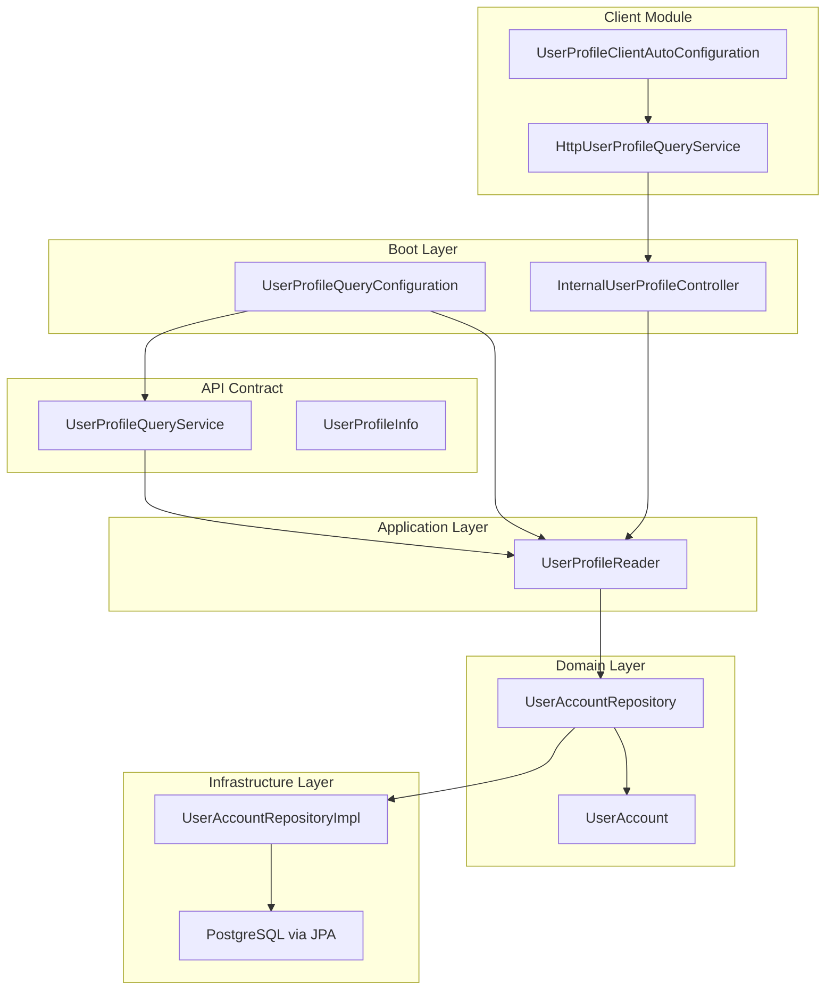
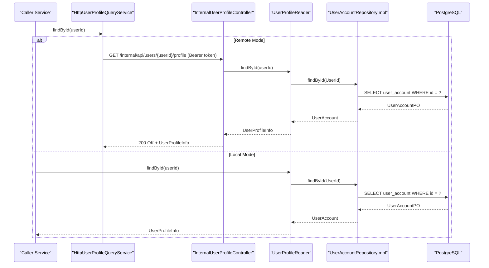
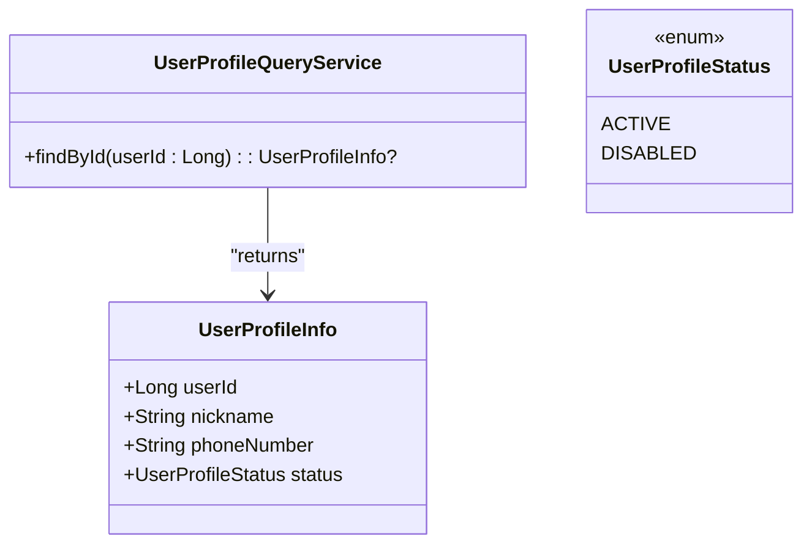
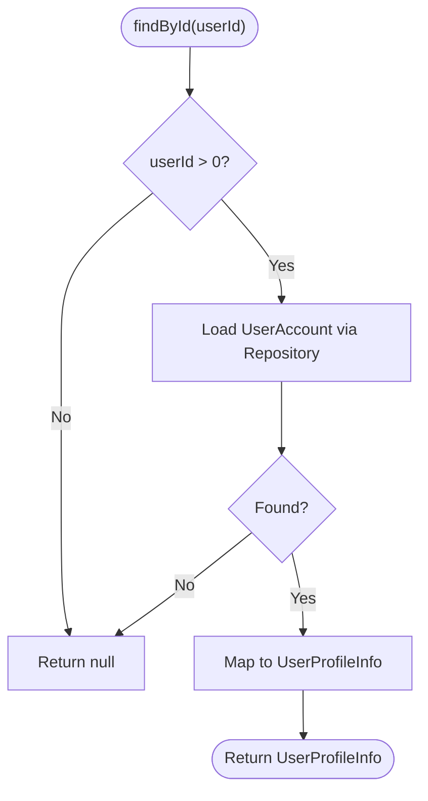
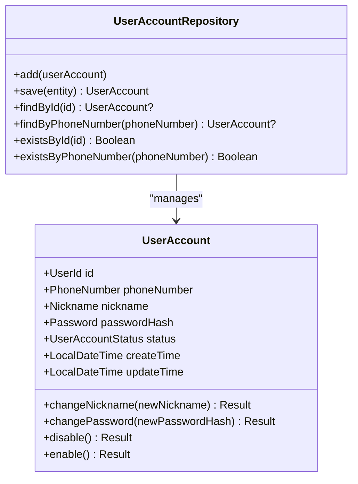
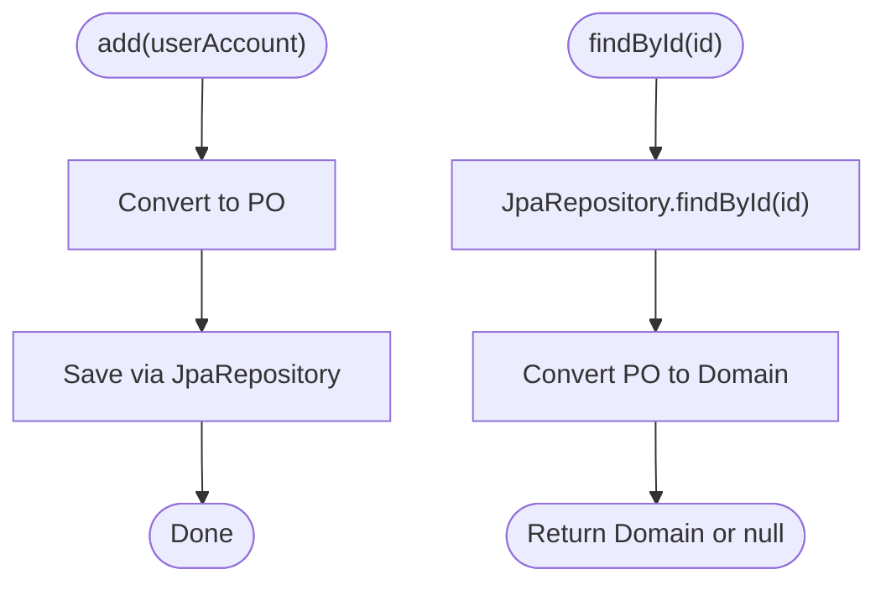
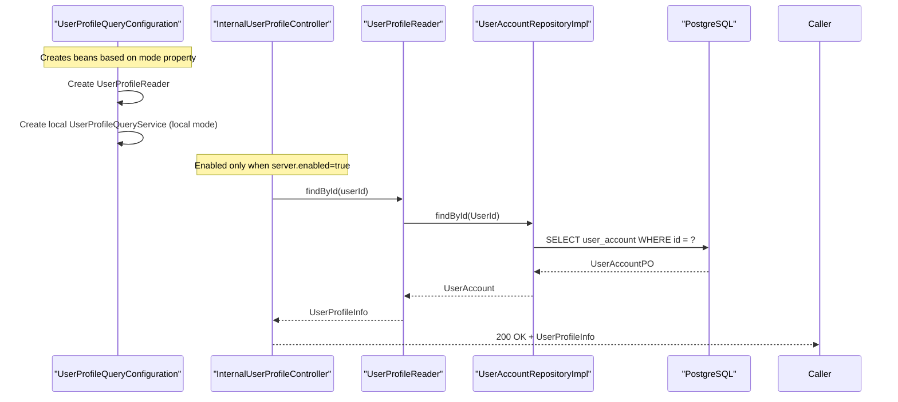
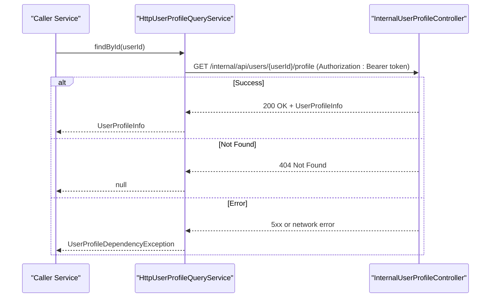
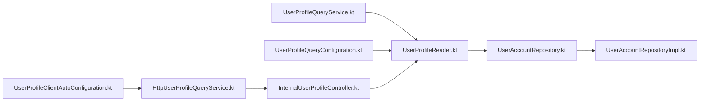

# Distributed User Profile Query System

<cite>
**Referenced Files in This Document**
- [UserProfileQueryService.kt](file://j-store-user-api/src/main/kotlin/com/jstore/user/api/UserProfileQueryService.kt)
- [UserProfileReader.kt](file://j-store-user-application/src/main/kotlin/com/jstore/user/service/UserProfileReader.kt)
- [UserAccountRepository.kt](file://j-store-user-domain/src/main/kotlin/com/jstore/user/domain/useraccount/UserAccountRepository.kt)
- [UserAccountRepositoryImpl.kt](file://j-store-user-infrastructure/src/main/kotlin/com/jstore/user/domain/useraccount/UserAccountRepositoryImpl.kt)
- [UserAccount.kt](file://j-store-user-domain/src/main/kotlin/com/jstore/user/domain/useraccount/UserAccount.kt)
- [UserProfileQueryConfiguration.kt](file://j-store-user-boot/src/main/kotlin/com/jstore/user/config/UserProfileQueryConfiguration.kt)
- [UserProfileClientAutoConfiguration.kt](file://j-store-user-client-spring/src/main/kotlin/com/jstore/user/client/UserProfileClientAutoConfiguration.kt)
- [HttpUserProfileQueryService.kt](file://j-store-user-client-spring/src/main/kotlin/com/jstore/user/client/HttpUserProfileQueryService.kt)
- [InternalUserProfileController.kt](file://j-store-user-boot/src/main/kotlin/com/jstore/user/controller/InternalUserProfileController.kt)
- [README.md](file://README.md)
</cite>

## Table of Contents
1. [Introduction](#introduction)
2. [Project Structure](#project-structure)
3. [Core Components](#core-components)
4. [Architecture Overview](#architecture-overview)
5. [Detailed Component Analysis](#detailed-component-analysis)
6. [Dependency Analysis](#dependency-analysis)
7. [Performance Considerations](#performance-considerations)
8. [Troubleshooting Guide](#troubleshooting-guide)
9. [Conclusion](#conclusion)

## Introduction
This document describes the distributed user profile query system implemented across the j-store modules. The system provides a unified way for other services to retrieve read-only user profile information either locally (in-process) or remotely via an internal HTTP endpoint. It is designed with clear module boundaries, configuration-driven behavior, and strong validation for security-sensitive settings.

The key design goals are:
- Stable API contract for user profile queries
- Pluggable implementations: local repository access or remote HTTP client
- Secure internal service-to-service communication using token-based authorization
- Clear separation between domain, application, infrastructure, and boot layers

## Project Structure
The user profile query capability spans multiple modules:
- API contract defines the query interface and data model
- Application layer reads domain aggregates and maps them to API models
- Domain layer encapsulates user account state and persistence contracts
- Infrastructure implements persistence against PostgreSQL via JPA
- Boot layer wires configurations and exposes an optional internal HTTP endpoint
- Client module provides a remote HTTP implementation for consumers

**Diagram sources**
- [UserProfileQueryService.kt:1-28](file://j-store-user-api/src/main/kotlin/com/jstore/user/api/UserProfileQueryService.kt#L1-L28)
- [UserProfileReader.kt:1-26](file://j-store-user-application/src/main/kotlin/com/jstore/user/service/UserProfileReader.kt#L1-L26)
- [UserAccountRepository.kt:1-27](file://j-store-user-domain/src/main/kotlin/com/jstore/user/domain/useraccount/UserAccountRepository.kt#L1-L27)
- [UserAccountRepositoryImpl.kt:1-70](file://j-store-user-infrastructure/src/main/kotlin/com/jstore/user/domain/useraccount/UserAccountRepositoryImpl.kt#L1-L70)
- [UserAccount.kt:1-36](file://j-store-user-domain/src/main/kotlin/com/jstore/user/domain/useraccount/UserAccount.kt#L1-L36)
- [UserProfileQueryConfiguration.kt:1-26](file://j-store-user-boot/src/main/kotlin/com/jstore/user/config/UserProfileQueryConfiguration.kt#L1-L26)
- [InternalUserProfileController.kt:1-61](file://j-store-user-boot/src/main/kotlin/com/jstore/user/controller/InternalUserProfileController.kt#L1-L61)
- [HttpUserProfileQueryService.kt:1-39](file://j-store-user-client-spring/src/main/kotlin/com/jstore/user/client/HttpUserProfileQueryService.kt#L1-L39)
- [UserProfileClientAutoConfiguration.kt:1-63](file://j-store-user-client-spring/src/main/kotlin/com/jstore/user/client/UserProfileClientAutoConfiguration.kt#L1-L63)

**Section sources**
- [README.md:43-67](file://README.md#L43-L67)

## Core Components
- UserProfileQueryService: Defines the query contract for retrieving a user profile by ID.
- UserProfileReader: Application service that translates domain user accounts into API profile info.
- UserAccountRepository: Domain repository interface for user account persistence operations.
- UserAccountRepositoryImpl: Infrastructure implementation backed by JPA repositories and converters.
- InternalUserProfileController: Optional internal HTTP endpoint exposing profile retrieval with token-based authorization.
- HttpUserProfileQueryService: Remote client implementation that calls the internal endpoint.
- Configuration classes: Enable local or remote modes based on properties.

Key behaviors:
- Local mode: In-process lookup via UserRepository -> PostgreSQL
- Remote mode: HTTP call to internal endpoint with bearer token
- Validation: Strong checks on IDs, phone number format, and tokens

**Section sources**
- [UserProfileQueryService.kt:1-28](file://j-store-user-api/src/main/kotlin/com/jstore/user/api/UserProfileQueryService.kt#L1-L28)
- [UserProfileReader.kt:1-26](file://j-store-user-application/src/main/kotlin/com/jstore/user/service/UserProfileReader.kt#L1-L26)
- [UserAccountRepository.kt:1-27](file://j-store-user-domain/src/main/kotlin/com/jstore/user/domain/useraccount/UserAccountRepository.kt#L1-L27)
- [UserAccountRepositoryImpl.kt:1-70](file://j-store-user-infrastructure/src/main/kotlin/com/jstore/user/domain/useraccount/UserAccountRepositoryImpl.kt#L1-L70)
- [InternalUserProfileController.kt:1-61](file://j-store-user-boot/src/main/kotlin/com/jstore/user/controller/InternalUserProfileController.kt#L1-L61)
- [HttpUserProfileQueryService.kt:1-39](file://j-store-user-client-spring/src/main/kotlin/com/jstore/user/client/HttpUserProfileQueryService.kt#L1-L39)
- [UserProfileClientAutoConfiguration.kt:1-63](file://j-store-user-client-spring/src/main/kotlin/com/jstore/user/client/UserProfileClientAutoConfiguration.kt#L1-L63)

## Architecture Overview
The system supports two deployment modes controlled by configuration:
- Local mode: Default; uses in-process repository to fetch user profiles from PostgreSQL
- Remote mode: Uses an HTTP client to call the User service’s internal endpoint

**Diagram sources**
- [HttpUserProfileQueryService.kt:12-39](file://j-store-user-client-spring/src/main/kotlin/com/jstore/user/client/HttpUserProfileQueryService.kt#L12-L39)
- [InternalUserProfileController.kt:18-61](file://j-store-user-boot/src/main/kotlin/com/jstore/user/controller/InternalUserProfileController.kt#L18-L61)
- [UserProfileReader.kt:9-25](file://j-store-user-application/src/main/kotlin/com/jstore/user/service/UserProfileReader.kt#L9-L25)
- [UserAccountRepositoryImpl.kt:27-33](file://j-store-user-infrastructure/src/main/kotlin/com/jstore/user/domain/useraccount/UserAccountRepositoryImpl.kt#L27-L33)

## Detailed Component Analysis

### API Contract: UserProfileQueryService and UserProfileInfo
- Exposes a simple function to find a user profile by ID
- Validates input constraints such as positive userId and canonical E.164 phone number format
- Provides a stable interface for both local and remote implementations

**Diagram sources**
- [UserProfileQueryService.kt:1-28](file://j-store-user-api/src/main/kotlin/com/jstore/user/api/UserProfileQueryService.kt#L1-L28)

**Section sources**
- [UserProfileQueryService.kt:1-28](file://j-store-user-api/src/main/kotlin/com/jstore/user/api/UserProfileQueryService.kt#L1-L28)

### Application Layer: UserProfileReader
- Converts domain UserAccount into API UserProfileInfo
- Maps status enums appropriately
- Guards invalid userId values

**Diagram sources**
- [UserProfileReader.kt:9-25](file://j-store-user-application/src/main/kotlin/com/jstore/user/service/UserProfileReader.kt#L9-L25)

**Section sources**
- [UserProfileReader.kt:9-25](file://j-store-user-application/src/main/kotlin/com/jstore/user/service/UserProfileReader.kt#L9-L25)

### Domain Layer: UserAccount and Repository
- UserAccount aggregate encapsulates identity, credentials, and lifecycle methods
- Repository interface abstracts persistence details and supports lookups by ID and phone number

**Diagram sources**
- [UserAccount.kt:10-35](file://j-store-user-domain/src/main/kotlin/com/jstore/user/domain/useraccount/UserAccount.kt#L10-L35)
- [UserAccountRepository.kt:6-26](file://j-store-user-domain/src/main/kotlin/com/jstore/user/domain/useraccount/UserAccountRepository.kt#L6-L26)

**Section sources**
- [UserAccount.kt:10-35](file://j-store-user-domain/src/main/kotlin/com/jstore/user/domain/useraccount/UserAccount.kt#L10-L35)
- [UserAccountRepository.kt:6-26](file://j-store-user-domain/src/main/kotlin/com/jstore/user/domain/useraccount/UserAccountRepository.kt#L6-L26)

### Infrastructure Layer: UserAccountRepositoryImpl
- Implements repository methods using Spring Data JPA
- Converts between domain objects and persistence entities
- Enforces mandatory transactional context for write operations

**Diagram sources**
- [UserAccountRepositoryImpl.kt:14-33](file://j-store-user-infrastructure/src/main/kotlin/com/jstore/user/domain/useraccount/UserAccountRepositoryImpl.kt#L14-L33)

**Section sources**
- [UserAccountRepositoryImpl.kt:14-33](file://j-store-user-infrastructure/src/main/kotlin/com/jstore/user/domain/useraccount/UserAccountRepositoryImpl.kt#L14-L33)

### Boot Layer: Configuration and Internal Endpoint
- UserProfileQueryConfiguration wires the reader and local service bean when mode is local
- InternalUserProfileController exposes a secure internal endpoint guarded by a bearer token
- Both components validate configuration values early to fail fast

**Diagram sources**
- [UserProfileQueryConfiguration.kt:10-25](file://j-store-user-boot/src/main/kotlin/com/jstore/user/config/UserProfileQueryConfiguration.kt#L10-L25)
- [InternalUserProfileController.kt:18-61](file://j-store-user-boot/src/main/kotlin/com/jstore/user/controller/InternalUserProfileController.kt#L18-L61)
- [UserProfileReader.kt:9-25](file://j-store-user-application/src/main/kotlin/com/jstore/user/service/UserProfileReader.kt#L9-L25)
- [UserAccountRepositoryImpl.kt:27-33](file://j-store-user-infrastructure/src/main/kotlin/com/jstore/user/domain/useraccount/UserAccountRepositoryImpl.kt#L27-L33)

**Section sources**
- [UserProfileQueryConfiguration.kt:10-25](file://j-store-user-boot/src/main/kotlin/com/jstore/user/config/UserProfileQueryConfiguration.kt#L10-L25)
- [InternalUserProfileController.kt:18-61](file://j-store-user-boot/src/main/kotlin/com/jstore/user/controller/InternalUserProfileController.kt#L18-L61)

### Client Module: Remote HTTP Implementation
- HttpUserProfileQueryService calls the internal endpoint with a configured base URL and bearer token
- Handles 404 as not found and wraps network errors into a specific dependency exception
- Validates response integrity (user ID match)

**Diagram sources**
- [HttpUserProfileQueryService.kt:12-39](file://j-store-user-client-spring/src/main/kotlin/com/jstore/user/client/HttpUserProfileQueryService.kt#L12-L39)
- [InternalUserProfileController.kt:35-46](file://j-store-user-boot/src/main/kotlin/com/jstore/user/controller/InternalUserProfileController.kt#L35-L46)

**Section sources**
- [HttpUserProfileQueryService.kt:12-39](file://j-store-user-client-spring/src/main/kotlin/com/jstore/user/client/HttpUserProfileQueryService.kt#L12-L39)
- [UserProfileClientAutoConfiguration.kt:16-63](file://j-store-user-client-spring/src/main/kotlin/com/jstore/user/client/UserProfileClientAutoConfiguration.kt#L16-L63)

## Dependency Analysis
- API contract depends only on basic types and validation rules
- Application layer depends on domain repository interface
- Infrastructure depends on Spring Data JPA and converts between domain and persistence models
- Boot layer configures beans conditionally based on properties
- Client module depends on REST client and validates configuration properties

**Diagram sources**
- [UserProfileQueryService.kt:1-28](file://j-store-user-api/src/main/kotlin/com/jstore/user/api/UserProfileQueryService.kt#L1-L28)
- [UserProfileReader.kt:1-26](file://j-store-user-application/src/main/kotlin/com/jstore/user/service/UserProfileReader.kt#L1-L26)
- [UserAccountRepository.kt:1-27](file://j-store-user-domain/src/main/kotlin/com/jstore/user/domain/useraccount/UserAccountRepository.kt#L1-L27)
- [UserAccountRepositoryImpl.kt:1-70](file://j-store-user-infrastructure/src/main/kotlin/com/jstore/user/domain/useraccount/UserAccountRepositoryImpl.kt#L1-L70)
- [UserProfileQueryConfiguration.kt:1-26](file://j-store-user-boot/src/main/kotlin/com/jstore/user/config/UserProfileQueryConfiguration.kt#L1-L26)
- [InternalUserProfileController.kt:1-61](file://j-store-user-boot/src/main/kotlin/com/jstore/user/controller/InternalUserProfileController.kt#L1-L61)
- [UserProfileClientAutoConfiguration.kt:1-63](file://j-store-user-client-spring/src/main/kotlin/com/jstore/user/client/UserProfileClientAutoConfiguration.kt#L1-L63)
- [HttpUserProfileQueryService.kt:1-39](file://j-store-user-client-spring/src/main/kotlin/com/jstore/user/client/HttpUserProfileQueryService.kt#L1-L39)

**Section sources**
- [README.md:43-67](file://README.md#L43-L67)

## Performance Considerations
- Local mode avoids network overhead and is suitable for modular monolith deployments
- Remote mode introduces latency and failure modes; configure timeouts appropriately
- Use connection and read timeouts to prevent long-running requests under load
- Ensure database indexes exist for frequent lookups by user ID and phone number
- Consider caching strategies at the caller side if read patterns are hot paths

[No sources needed since this section provides general guidance]

## Troubleshooting Guide
Common issues and resolutions:
- Missing or invalid internal token: The internal endpoint requires a bearer token with sufficient length; ensure configuration provides a valid token
- Remote mode misconfiguration: Base URL must be absolute HTTP(S), token must meet minimum length, and timeouts must be positive
- Not found responses: 404 indicates no user profile exists for the given ID; callers should treat this as absence rather than error
- Network failures: RestClient exceptions are wrapped into a dependency-specific exception; handle retries or fallbacks accordingly

Validation points:
- Internal endpoint validates token length during startup
- Remote client validates base URL scheme and host presence
- Timeout properties are validated to be positive and non-zero

**Section sources**
- [InternalUserProfileController.kt:29-33](file://j-store-user-boot/src/main/kotlin/com/jstore/user/controller/InternalUserProfileController.kt#L29-L33)
- [UserProfileClientAutoConfiguration.kt:16-37](file://j-store-user-client-spring/src/main/kotlin/com/jstore/user/client/UserProfileClientAutoConfiguration.kt#L16-L37)
- [HttpUserProfileQueryService.kt:12-39](file://j-store-user-client-spring/src/main/kotlin/com/jstore/user/client/HttpUserProfileQueryService.kt#L12-L39)

## Conclusion
The distributed user profile query system provides a robust, configurable approach to reading user profiles across services. It cleanly separates concerns through layered architecture, supports both local and remote modes, and enforces strict validation for security and reliability. By following the configuration guidelines and understanding the component interactions, teams can deploy it effectively in modular monolith or microservice environments.

[No sources needed since this section summarizes without analyzing specific files]