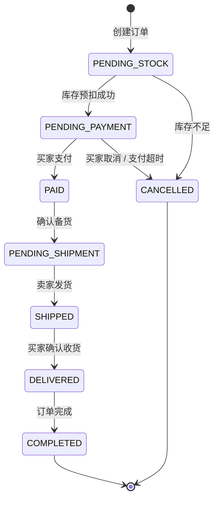
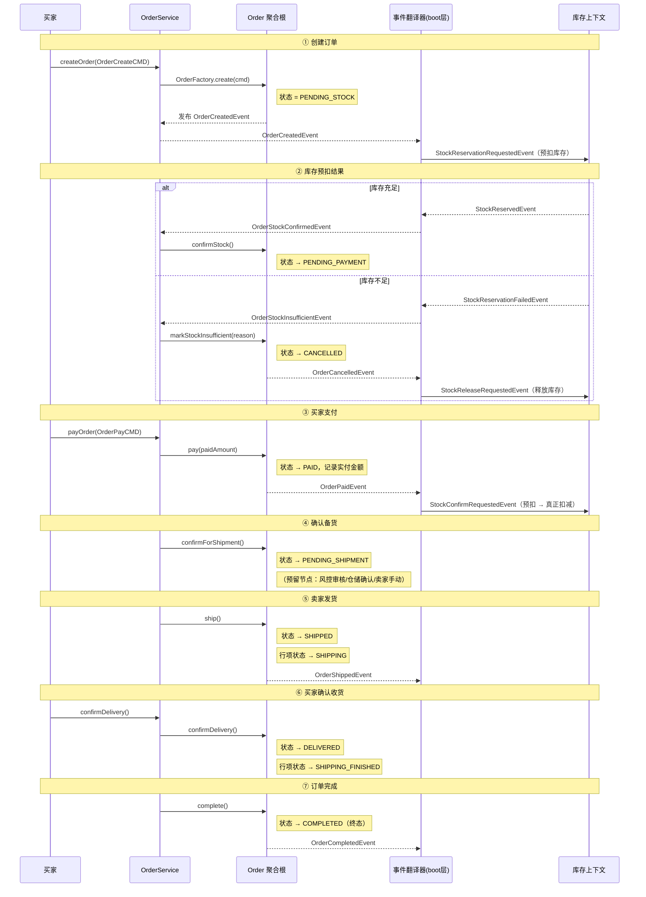
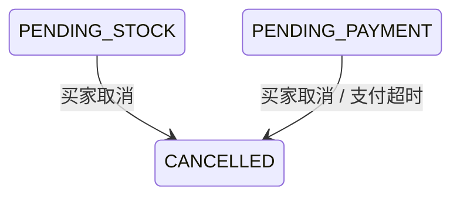
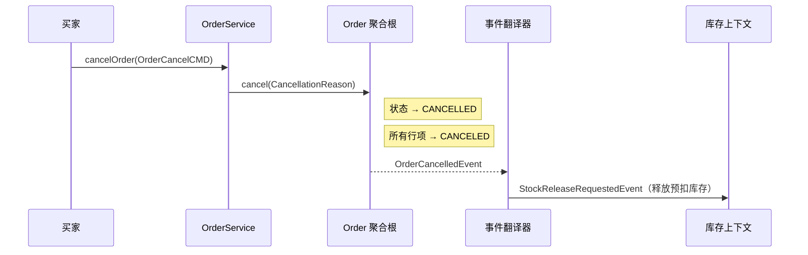
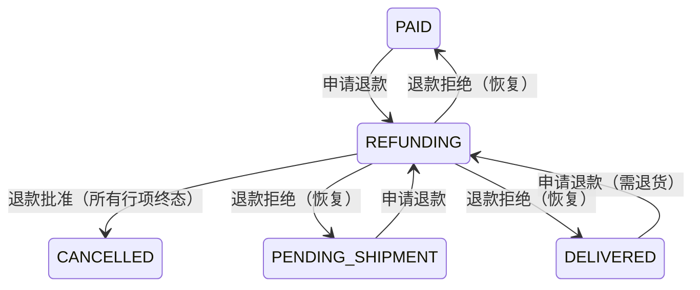
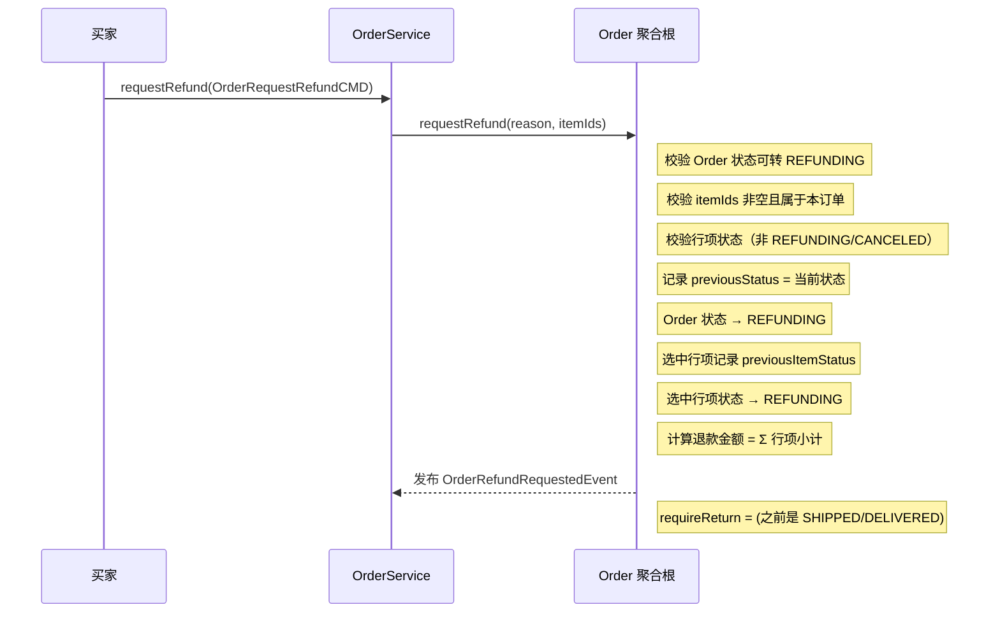
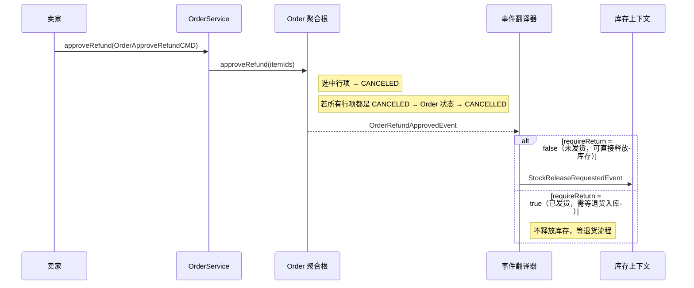
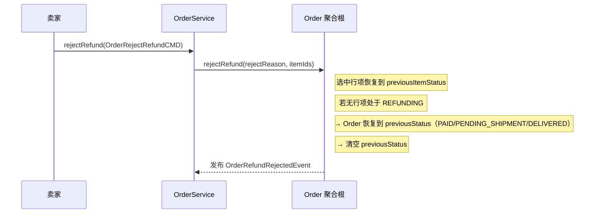
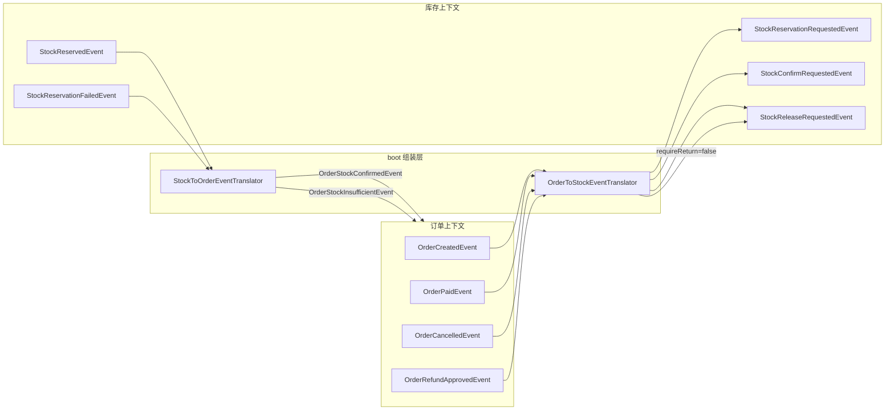

# Order 模型业务流程详解

## 一、订单状态总览

```
OrderStatus:
  PENDING_STOCK     待库存确认（初始状态）
  PENDING_PAYMENT   待支付
  PAID              已支付
  PENDING_SHIPMENT  待发货
  SHIPPED           已发货
  DELIVERED         已签收
  COMPLETED         已完成（终态）
  CANCELLED         已取消（终态）
  REFUNDING         退款中
```

```
OrderItemStatus:
  NONE              初始
  WAIT_SHIPPING     待发货
  SHIPPING          运输中
  SHIPPING_ERROR    运输异常
  SHIPPING_FINISHED 已签收
  REFUNDING         退款中
  CANCELED          已取消
```

---

## 二、正向流程

### 2.1 状态机



### 2.2 流程时序



---

## 三、逆向流程

### 3.1 取消订单

买家在 `PENDING_STOCK` 或 `PENDING_PAYMENT` 阶段可主动取消。





### 3.2 退款流程（已支付后）

可发起退款的状态：`PAID`、`PENDING_SHIPMENT`、`DELIVERED`



#### 3.2.1 申请退款



#### 3.2.2 卖家批准退款



#### 3.2.3 卖家拒绝退款



---

## 四、跨上下文事件协作



| 订单事件 | 翻译为 | 库存动作 |
|---|---|---|
| `OrderCreatedEvent` | `StockReservationRequestedEvent` | 预扣库存 |
| `OrderPaidEvent` | `StockConfirmRequestedEvent` | 预扣 → 真正扣减 |
| `OrderCancelledEvent` | `StockReleaseRequestedEvent` | 释放预扣库存 |
| `OrderRefundApprovedEvent` | `StockReleaseRequestedEvent`（仅未发货） | 释放已扣减库存 |

| 库存事件 | 翻译为 | 订单动作 |
|---|---|---|
| `StockReservedEvent` | `OrderStockConfirmedEvent` | `confirmStock()` → PENDING_PAYMENT |
| `StockReservationFailedEvent` | `OrderStockInsufficientEvent` | `markStockInsufficient()` → CANCELLED |

---

## 五、Command 与方法对照表

| 应用服务方法 | Command | 触发方式 | 发布事件 |
|---|---|---|---|
| `createOrder` | `OrderCreateCMD` | 买家提交 | `OrderCreatedEvent` |
| `confirmStock` | — (仅 orderId) | 库存事件回调 | — |
| `markStockInsufficient` | — (orderId + reason) | 库存事件回调 | `OrderCancelledEvent` |
| `payOrder` | `OrderPayCMD` | 支付回调 | `OrderPaidEvent` |
| `confirmForShipment` | — (仅 orderId) | 预留（风控/仓储/卖家手动） | — |
| `shipOrder` | — (仅 orderId) | 卖家操作 | `OrderShippedEvent` |
| `confirmDelivery` | — (仅 orderId) | 买家操作 | — |
| `completeOrder` | — (仅 orderId) | 系统/买家操作 | `OrderCompletedEvent` |
| `cancelOrder` | `OrderCancelCMD` | 买家操作 | `OrderCancelledEvent` |
| `requestRefund` | `OrderRequestRefundCMD` | 买家操作 | `OrderRefundRequestedEvent` |
| `approveRefund` | `OrderApproveRefundCMD` | 卖家操作 | `OrderRefundApprovedEvent` |
| `rejectRefund` | `OrderRejectRefundCMD` | 卖家操作 | `OrderRefundRejectedEvent` |
