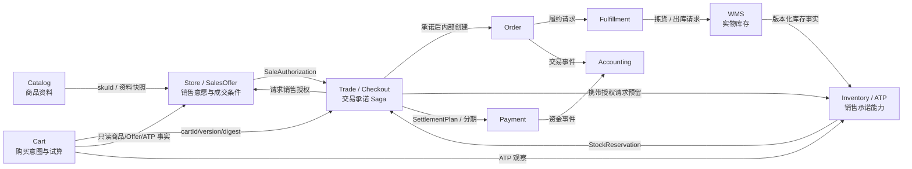

# j-store 领域建模说明

本文描述 j-store 当前已经实现的领域划分、权威事实、一致性边界和跨上下文协作方式。它是项目理解文档，不替代具体功能的 requirement、delta 或设计文档。

## 建模原则

j-store 采用战略 DDD 与战术 DDD 结合的方式：

1. 先按“谁拥有最终解释权”划分有界上下文，而不是按数据库表或页面功能分组。
2. 每个业务事实只指定一个权威上下文；其它上下文保存引用、快照、镜像或派生结果。
3. 聚合是本地事务的一致性边界。跨聚合、跨上下文流程通过应用服务、领域事件、集成消息和补偿协议协作。
4. 跨服务不依赖 JVM 锁、共享数据库事务或两阶段提交；对外承诺必须表示为可持久化、可幂等的业务事实。
5. 查询模型可以最终一致，但不能替代下单、库存、支付等写入侧承诺。

## 有界上下文与权威事实

| 有界上下文 | 核心模型 | 权威事实 | 非职责 |
|---|---|---|---|
| Catalog（goods） | `Spu`、`Sku`、`GoodsStyle`、`SpuSnapshot` | 商品资料是什么、资料是否已发布或归档 | 店铺上下架、成交价、库存、最终可售判断 |
| Store / Offer（shop） | `Merchant`、`Store`、`SalesOffer`、`SaleAuthorization` | 谁在什么店铺、渠道、市场、时间和价格下愿意销售 | 实物库存、ATP、订单交易状态 |
| Inventory / ATP | `StockPosition`、`StockReservation` | 平台当前能够承诺多少库存、哪些数量已向订单预留 | 库位、盘点、真实出入库、商品资料 |
| WMS（warehouse） | `PhysicalStock` | 实物库存及其来源版本 | 页面可售、销售授权、订单交易状态 |
| Cart | `Cart`、`CartAssessment` | 买家的可变购买意图、数量、Selection、Cart 内容版本和派生试算 | 价格/库存权威、销售授权、库存预留、Order 创建 |
| Trade / Checkout | `Trade`、`TradeOrderPlan`、`SettlementPlan` | Checkout 幂等、成交快照、拆单、销售/库存承诺、Order 创建与结算屏障 | 商品资料、Offer/库存内部状态、支付渠道与履约执行状态 |
| Order | `Order`、`OrderItem`、`AfterSale` | 已确认订单记录、买家视角生命周期、履约与售后快照 | 销售授权、库存预留、优惠试算与支付资金状态 |
| Payment | `TradePayment`、退款相关模型 | 按结算分期执行支付和退款的资金状态 | 交易结算条款、订单商品与履约事实 |
| Fulfillment | `FulfillmentOrder` | 发货、运输、签收等履约状态 | 交易定价、支付记账、实物库存盘点 |
| Accounting | 账户、期间、凭证、结算模型 | 会计分录和结算事实 | 订单或支付聚合内部状态 |
| User / Authentication | 用户账户、身份令牌、用户资料查询契约 | 当前认证域内的用户身份、昵称、已验证手机号、账号状态、登录状态和认证事实 | 跨认证域全局身份、商户销售政策与交易状态 |

“权威”表示只有该上下文可以定义和修改该事实的业务语义。其它上下文可以通过 ACL 查询它，或保存发生交易时的不可变快照，但不得反向成为第二权威。

## 核心上下文关系



关系类型如下：

- Catalog 是商品资料的上游。Offer 仅通过 `skuId` 引用 Catalog，不把 Catalog 聚合嵌入自身。
- WMS 是实物库存上游；Inventory 保存带 `sourceVersion` 的镜像，并忽略重复或旧版本事件。
- Trade 是下单承诺 Saga 的协调者，持久化授权、预留和补偿进度，但不拥有 Offer 或 ATP 的内部状态。
- Cart 保存可反复修改的购买意图和派生 Assessment；Checkout 前同步重新采集事实，旧 Assessment 不构成成交输入。
- Order 只由 Trade 在承诺形成后通过内部端口创建，不保存销售授权或库存预留标识。
- Payment、Fulfillment、Accounting 通过已发生的交易事实继续各自状态机，不直接修改 Order 聚合。
- 查询方向可通过上下文发布的 `-api` 契约和消费方 ACL 完成；写入协作使用版本化集成消息。

## Catalog：商品资料模型

Catalog 回答“商品是什么”。`Spu` 管理商品名称、描述、SKU 结构以及对 Product Type、Brand 和 Category 的稳定引用；`GoodsStyle` 管理展示素材，`SpuSnapshot` 冻结一次发布产生的完整可追溯资料版本。

`ProductType` 是独立聚合，定义 SPU 级与 SKU 级属性的 code、类型、必填、枚举范围和变体轴。`Brand` 是 Catalog 内的商户级聚合，维护多语言名称与启停状态；SPU 保存和发布时必须验证品牌存在、启用且属于同一商户，历史快照同时冻结品牌 ID 和名称。Category 负责分类树，Product Type 负责资料结构，二者不能互相替代。属性值目前以字符串传输和持久化，但发布前必须按 Product Type 解析为文本、数字、布尔或枚举语义并校验。

已发布 SPU 通过 Copy-on-Write 草稿修改。草稿 SPU 由 `sourceSpuId` 指向发布源；草稿 SKU 使用独立 ID，并由 `sourceSkuId` 指向稳定已发布 SKU。发布草稿时，已有 SKU 恢复稳定源 ID，新建 SKU 保留其新 ID，从而避免两个 SPU 聚合共享同一持久化 SKU 主键，也避免破坏 Offer、Inventory 和历史订单对稳定 SKU ID 的引用。

商品名称、描述、结构化属性、类目/品牌引用、主图、详情和 SKU 图片都参与同一次发布并进入 `SpuSnapshot`。`GoodsStyle` 虽是独立聚合，但其写入只能针对 DRAFT SPU，草稿复制与发布由同一个商品应用事务协调；不能绕过草稿直接修改已发布素材。

Catalog 生命周期为：

```text
DRAFT -> PUBLISHED -> ARCHIVED
```

- `DRAFT`：资料编辑中。
- `PUBLISHED`：资料可被店铺 Offer 引用。
- `ARCHIVED`：资料停止继续使用或进入历史保留。

业务资料版本 `Spu.version` 与 JPA 乐观锁版本分离。前者进入发布快照和跨上下文契约，后者只用于检测并发覆盖。数据库同时保证一个发布源最多存在一个 DRAFT 副本。

`PUBLISHED` 不代表消费者可以购买。Catalog 不保存 `ON_SALE/OFF_SALE`，SKU 不拥有成交价，商品快照也不作为订单价格权威。

## Store / SalesOffer：销售意愿模型

`SalesOffer` 是“店铺愿意按什么条件卖某个 SKU”的聚合，主要包含：

```text
offerId, storeId, merchantId, skuId,
channel/market, price, status, effectivePeriod,
purchaseLimit, fulfillmentPolicy, version
```

状态为 `ACTIVE/SUSPENDED/ENDED`。同一个 SKU 可以在不同店铺、渠道或市场拥有不同 Offer、价格、限购和履约节点。

当前部署模型按站点配置默认币种与允许币种集合。Offer 价格尚未在聚合内分别配置币种，Offer 查询使用当前站默认币种，Checkout、Trade、Order 与 Payment 冻结并校验该币种；核心领域只认识合法 ISO 4217 代码，不认识 CNY、JPY 或 USD 等具体站点选择。未来若一个站点需要并行销售多币种 Offer，必须把币种纳入 Offer 成交条件，而不是在领域中增加站点币种硬编码。

下单时 Store 上下文在一个本地事务内按稳定顺序锁定 Store 和 Offer，校验：

- 店铺和 Offer 均允许销售；
- 商户、店铺、SKU 引用匹配；
- Offer 版本和价格未变化；
- 当前时间位于销售周期内；
- 购买数量满足限购规则。

成功后签发 `SaleAuthorization`。它是持久化业务凭证，具有稳定业务键、有效期、幂等和释放语义，不是一次普通查询。

普通下架与授权的竞态由事务提交顺序决定：下架先提交则新授权失败；授权先提交则已取得的短期授权仍有效。监管召回等强制撤销不复用普通下架语义，应单独建模撤销政策。

## WMS 与 Inventory / ATP：两层库存模型

WMS 回答“真实世界的货在哪里、有多少”，Inventory 回答“电商平台现在还能承诺多少”。二者不能合并成一个库存数字。

Inventory 的当前计算为：

```text
ATP = max(onHand - reserved - safetyStock - isolatedQuantity, 0)
```

- `onHand`：来自 WMS 的实物库存镜像。
- `reserved`：已经向订单作出的库存承诺。
- `safetyStock`：不参与普通销售的安全库存。
- `isolatedQuantity`：渠道配额或隔离库存。

Inventory 只有成功创建 `StockReservation` 后才作出库存承诺。页面显示“有库存”只是最终一致的查询结果，下单时仍可能因并发预留而失败。

库存承诺以 `tradeId + orderPlanId` 关联；Trade 根据结算与履约放行策略确认消耗或释放 Reservation。退款成功不会直接增加库存，退货必须经过收货、验收或盘点，由 WMS 发布新的实物库存事实。

## Cart：购买意图与派生试算

Cart 是认证买家的可变购买意图聚合。一个活动 Cart 可以包含多个商户的 Offer，但首条加购会固定 `SettlementScope(market, channelId, currency)`；跨范围 Offer 不能加入。Cart Line 保存 SKU、Offer、商户、数量和 Selection，不保存权威价格或库存。

Cart 内容或 Selection 变化会记录带内容版本的 `CartRefreshRequestedEvent`。`CartAssessment` 使用 Catalog 当前发布、Store/Offer 当前资格及 Inventory ATP 批量观察进行派生计算；下架、售罄和库存不足行保留在 Cart，但不计入金额。Assessment 是可过期查询投影，不锁价、不占库存；Trade 从 Cart Checkout 时必须同步重新评估当前版本。

## Trade / Checkout：成交决策与交易承诺 Saga

Trade 是面向认证买家的统一下单边界，公开创建入口为 `POST /api/checkouts`；`POST /api/orders` 已删除。输入可以是直接购买行或 `cartId + expectedCartVersion`，后者由 Trade 通过 `j-store-cart-api` 拉取新鲜 Eligible Line。Trade 冻结 Cart 来源 ID、版本和摘要，保存下单时不可变的商品、Offer、价格、数量、商户和履约节点快照，并负责协调 `SaleAuthorization` 与 `StockReservation`。

当前实现已建立独立 `tradeId`、认证域与买家 ID 联合范围的 Checkout 幂等、一个或多个 `TradeOrderPlan`，并以 `tradeId + orderPlanId` 协调销售授权、库存预留和 Order 创建。Trade 冻结发起者的认证域与域内账号 ID；裸买家 ID 不作为跨边界身份。全部计划预留成功后，Trade 发布版本化 Order 创建命令并等待每个计划的成功或拒绝事实；全部 Order 形成且金额守恒后，Trade 才建立唯一 `SettlementPlan`，并通过消息命令要求 Payment 为首期 `PREPAID + FULL` 分期准备一个 `TradePayment`。Payment 以稳定渠道幂等键区分明确受理、明确拒绝和结果未知，Trade 按 `installmentId` 保存 Payment 引用与准备阶段，不保存渠道引用或支付动作。`orderId` 仅在 Order 形成后回写计划，不再是 Trade 身份或 Checkout 相关键。

Trade 主链状态协议为：

```text
AUTHORIZING -> RESERVING -> CREATING_ORDERS -> SETTLEMENT_PREPARING -> PAYMENT_READY
      |              |                 |                    |               |
      +--------------+-----------------+--------------------+-------------> FAILED
                                                          |
                                                          +--> PAYMENT_UNCERTAIN
                                                          |
                          买家取消且资金尚未裁决 ----------+--> CLOSING
```

1. Checkout 先持久化 Trade 与计划，再逐计划请求销售授权。
2. 授权成功后，Trade 保存授权并携带授权请求库存预留。
3. 所有计划库存预留成功后，Trade 才发布 Order 创建命令；Order 独立落库并以成功或拒绝事实驱动 Trade Saga，不允许 Trade 直接调用 Order 写用例。
4. 所有 Order 创建成功且金额守恒后，Trade 建立唯一 SettlementPlan；仅当库存承诺覆盖支付动作窗口及安全余量时才继续，否则失败并补偿。Payment 先提交稳定的 `PREPARING/paymentId`，再脱离数据库事务调用渠道，最后以独立事务记录结果，并以 `Prepared/Rejected/Uncertain` 事实回投。
5. Checkout 仅在 `PAYMENT_READY` 时通过 Payment 的只读 ACL 返回未过期支付动作；动作过期只隐藏 `payment`，不影响 Trade 状态查询。`PAYMENT_UNCERTAIN` 或支付阶段取消竞争进入 `CLOSING`；若准备调用仍在途，Payment 先持久化 `PREPARATION_CANCELLING` 并等待该次渠道结果，明确受理后保存渠道引用再进入 `CANCELLING`。渠道结果未知时保持取消处理中并按稳定幂等键重试；只有与当前支付事实匹配的明确撤销确认才能驱动 Trade 关闭 Order、释放库存与销售授权。
6. 渠道主动查询、支付捕获、迟到支付退款及显式履约放行仍按 `docs/spec/trade-checkout-boundary/tasks.md` 的后续切片推进；在统一捕获契约落地前，不向 Trade 发布缺少 `tradeId + installmentId` 的临时 Order 支付事实，也不得声称主链已达到生产就绪。

该协议通过 Trade 状态持久化、Outbox、幂等 handler 和补偿收敛，不依赖跨服务事务。未来购物车只提供结算输入；活动、优惠券与价格上下文向 Trade 提供带版本和分摊明细的 `PricingQuote`；对账消费 Trade、Payment、Order 的稳定业务键和金额事实，不反向修改聚合内部状态。

## Order：订单记录与买家生命周期

Order 保存的是平台已经向买家作出的交易承诺，不回查当前商品名称、当前价格来解释历史订单。订单行冻结：

- `spuId`、`skuId` 和 Catalog 快照版本；
- `offerId`、Offer 版本、店铺和渠道；
- 成交单价、数量和履约节点；
- 下单时的商品名称、规格等展示快照。

订单根同时冻结创建时的买家认证域、域内账号 ID、昵称和已验证手机号。客户端只能提供认证令牌，不能提交或覆盖买家资料；收货人姓名和联系方式是本次履约指令，不等同于账号资料。模块化单体通过进程内 `UserProfileQueryService` 在当前认证域内读取，微服务消费方通过同一发布契约的 HTTP 适配器读取。Payment、Fulfillment 和 Accounting 解释历史交易时继续消费订单或集成消息中的快照，不回查可变用户资料。

买家订单详情、列表、售后与主动取消必须同时校验认证域、域内账号 ID 和订单快照中的买家身份；越权访问按订单不存在处理。账号昵称和已验证手机号不进入公开订单响应，只在聚合持久化及受控交易协作中使用。

Order 仅投影交易承诺的最终结果：

```text
PENDING_OFFER -> CONFIRMED
       |
       +-------> FAILED
```

Order 不再保存 `SaleAuthorization`，也不判断应否请求或释放库存。收到 Trade 最终成功事实后进入 `CONFIRMED/ACTIVE` 并允许创建支付单；收到最终失败事实后进入 `FAILED/CLOSED`。

## 聚合、事务与消息规则

### 聚合边界

- 聚合根封装状态转换和不变量，外部不能直接修改内部状态。
- 一个聚合通过类型化 ID 引用另一个聚合，不持有跨聚合对象引用。
- Repository 接口只操作聚合，位于 domain；JPA PO 与实现位于 infrastructure。
- 业务版本（例如 Offer 版本、WMS 来源版本）与 JPA 持久化版本含义不同，必须分别建模和完整往返映射。

### 本地事务

- `*-boot` 提供应用用例的 Spring 事务边界。
- 聚合保存和 Outbox 写入处于同一数据库事务。
- 需要串行化的本地竞态使用数据库悲观锁和稳定锁顺序；乐观版本用于检测陈旧写入。
- Repository 写适配器要求已有事务，不自行打开更窄事务。

### 跨上下文协议

- `j-store-integration-contracts` 是跨上下文发布语言，只承载版本化标量契约，不共享领域对象。
- 消息必须具有稳定的 message ID、correlation/causation 信息、分区键和版本。
- 消息 metadata 使用可空 `merchantScopeId` 表达商户隔离范围，当前值只能解释为
  `merchantId`；独立的可空 `deploymentScopeId` 为未来部署/站点路由保留。两者不得合并为
  `tenantId`，也不得仅凭 metadata 完成业务授权。
- 消费者以稳定业务键实现幂等；重复消息不得重复签发授权、重复预留或重复记账。
- 不使用跨库事务、分布式对象引用或进程内事件假装跨服务一致性。

## 查询模型与 `canSell`

`canSell` 是组合决策，不是长期权威字段。典型查询需要组合：

```text
catalogPublished
&& storeActive
&& offerActiveAndEffective
&& atpSufficient
```

该结果可以用于页面展示和提前过滤，但不能替代下单时的 `SaleAuthorization` 与 `StockReservation`。因此不得在 Catalog、Offer、Inventory 或 Order 表中持久化一个被当作最终事实的 `can_sell` 布尔值。

## 模型变更规则

出现以下情况时，必须同步评估并更新本文：

| 变化 | 必须检查的内容 |
|---|---|
| 新增或拆分有界上下文 | 权威事实表、上下文关系、模块与集成契约 |
| 聚合边界变化 | 本地事务、不变量、Repository 和并发测试 |
| 订单、Offer、库存、支付状态变化 | 状态机、补偿路径、消息版本和历史数据迁移 |
| 一个事实开始在多个上下文保存 | 明确唯一权威、其它副本的镜像/快照语义和同步方式 |
| 新增跨上下文调用 | 查询 ACL 或集成消息的选择、幂等、超时和失败策略 |
| 价格、库存、金额语义变化 | 精度、快照、权威来源、审计和回滚方案 |
| 数据库迁移改变领域含义 | 当前事实、兼容策略、回填规则和恢复方案 |

领域模型变更的交付证据至少应包含：适用 requirement/delta、状态机或不变量测试、消息或 ACL 契约测试、持久化/迁移验证、本文的漂移检查，以及非实现者对高风险变更的独立评估。

## 长期维护责任

- Product Steward 每月对照最近合并的领域变更、迁移和集成契约抽查本文，发现权威事实、术语、状态机或上下文关系漂移时创建 drift finding。
- 涉及订单、金额、价格、库存、权限或公共契约的漂移必须转人工确认，不能由维护任务自动改写产品意图。
- 文档与实现冲突时：代码、迁移和可执行测试描述当前事实；已批准 requirement/delta 描述预期行为。二者冲突应记录并路由给事实或意图的所有者，而不是静默选择一方。
- 本文只记录长期稳定的当前模型；一次性实施过程和临时排障记录放在对应变更规格或 issue 中。

相关约束见 [DDD Architecture Guidelines](steering/ddd-guidelines.md)，实现模块和测试入口见 [Project Overview](project-overview.md)，本次销售资格重构意图见 [Commerce Sellability Boundaries](spec/changes/commerce-sellability-boundaries/delta.md)。
