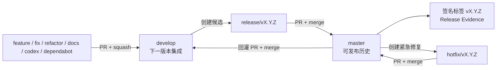

# 分支管理操作手册

## 目标与原则

本仓库使用轻量 GitFlow：`master` 保存可发布历史，`develop` 集成下一版本，其他分支短期存在。分支不是环境，部署状态由发布证据和运行平台记录；任何自动化都只能准备候选，不能自动合并、发布或绕过 required checks。

## 分支分类

| 分支 | 来源 | PR 目标 | 用途与寿命 |
|---|---|---|---|
| `master` | — | — | 长期分支；任一提交都应满足发布条件 |
| `develop` | `master` 或已确认的集成基线 | — | 长期分支；下一版本唯一集成线 |
| `feature/<slug>` | `develop` | `develop` | 新功能 |
| `fix/<slug>` | `develop` | `develop` | 非生产紧急缺陷 |
| `refactor/<slug>`、`perf/<slug>` | `develop` | `develop` | 内部重构或性能优化 |
| `docs/<slug>`、`test/<slug>`、`build/<slug>`、`ci/<slug>`、`chore/<slug>` | `develop` | `develop` | 配套维护 |
| `revert/<slug>` | `develop` | `develop` | 撤销尚未发布的集成变更 |
| `codex/<slug>` | `develop` | `develop` | Codex 隔离候选；遵守相同审查规则 |
| `dependabot/**` | GitHub | `develop` | 自动依赖候选，不自动合并 |
| `release/vX.Y.Z[-prerelease]` | `develop` | `master` | 短期发布候选，只允许版本元数据和发布修复 |
| `hotfix/vX.Y.Z[-prerelease]` | `master` | `master` | 短期生产紧急修复 |

`<slug>` 只使用小写字母、数字、点、下划线和连字符，可按组件增加子路径。禁止个人长期分支、`main`/`feature-initial` 等第二套集成线以及用环境名建立长期分支。

## 日常开发

1. 更新本地 `develop`，从它创建一个单一意图的短分支。
2. 先建立适用规格或 accepted delta，再按 TDD 实现并运行最小相关测试。
3. 尽早创建 draft PR，目标固定为 `develop`。PR 标题使用 Conventional Commits，例如 `feat(order): reserve inventory`。
4. 合并前补齐 PR 模板中的验收映射、测试命令、兼容性、恢复方式和残余风险；同步最新目标分支。
5. 等待 `branch-policy`、`quality`、`static-analysis`、`dependency-vulnerability-scan`、`dependency-license-audit` 和 `secret-scan` 全部通过，并解决 review thread。
6. 日常短分支使用 squash merge；合并后立即删除远端和本地分支。不得把失败检查改成非 required 来完成合并。

公共契约、认证授权、隐私、多租户、金额、库存、订单状态、数据库不可逆迁移和生产行为变更即使目标是 `develop`，也必须取得独立人工评审；实现者不能批准自己的高风险变更。

## 发布流程

1. 确认 `develop` 上目标验收均有证据，没有未决高风险 drift finding。
2. 从最新 `develop` 创建 `release/vX.Y.Z`。该分支不接收新功能；发现普通缺陷先在 `develop` 修复并同步候选。
3. 创建到 `master` 的 PR，标题使用 `chore(release): prepare vX.Y.Z`。使用 merge commit 保留发布边界。
4. 合并后从该 `master` 提交创建签名 annotated tag `vX.Y.Z`。发布证据工作流会验证标签提交属于远端 `master` 历史，再生成证据；它不会创建 GitHub Release 或部署。
5. 创建 `master -> develop` PR，标题使用 `chore(sync): merge master into develop`，以 merge commit 回灌版本元数据。
6. 回灌完成后删除 `release/*`。正式发布仍按 [release-evidence.md](release-evidence.md) 完成人工审批。

## 热修复流程

1. 人工确认确属生产紧急问题，从最新 `master` 创建下一个补丁版本 `hotfix/vX.Y.Z`。
2. 只包含最小修复、回归测试和恢复说明；创建到 `master` 的 PR，并通过与发布相同的全部门禁和人工批准。
3. 使用 merge commit 合并，在合并提交上创建新的签名版本标签；禁止移动或覆盖旧标签。
4. 立即通过 `master -> develop` PR 回灌。若 `develop` 冲突，由领域所有者在回灌 PR 中解决并重新运行门禁。

## 失败恢复

- 未合并候选失败：继续在原短分支修复，或关闭 PR 并删除分支；不污染长期分支。
- 已合并但未发布：从 `develop` 创建 `revert/*`，以新 PR 撤销；禁止重写历史。
- 已进入 `master`：创建新的 `hotfix/*` 或 revert 候选并发布新补丁版本；禁止强推、删除或移动已发布标签。
- CI 或 GitHub 故障：停止合并并修复门禁。管理员临时例外必须有 issue、审批人、时间范围和恢复记录，不能静默绕过。

## 审查、合并与清理

- 当前只有一位明确所有者时，ruleset 的审批数为 0，但合并仍必须由所有者人工执行。增加独立维护者后，将两个 ruleset 的审批数提升为 1，并要求最后推送者之外的批准。
- 日常分支使用 squash merge；`release/*`、`hotfix/*`、`master -> develop` 使用 merge commit；禁用 rebase merge。
- draft 或 14 天无更新的 PR 由维护者确认继续、拆分或关闭。合并/关闭后删除短分支；30 天无 PR 的远端短分支经所有者确认后清理。
- Dependabot 和 agent 只能创建 PR。依赖 major、RC、里程碑版本及高风险变更必须单独评估。

## 首次启用与迁移

1. 先落地策略脚本、工作流和文档，不立即把尚未产生的 check context 设为 required。
2. 仓库管理员确认集成基线后创建远端 `develop`；若现有开发候选领先于 `master`，通过一次有完整审查证据的 bootstrap PR 纳入，而不是直接把临时分支声明为长期分支。
3. 分别创建正常和故意违规的 draft PR，确认六个 check context 名称稳定且分支方向校验符合预期。
4. 按 [.github/rulesets/README.md](../../.github/rulesets/README.md) 应用 `develop.json` 和 `master.json`。这是远端权限变更，必须由管理员明确执行。
5. 将默认 PR 目标改为 `develop`，确认 Dependabot 以 `develop` 为目标；迁移未合并工作后删除 `feature-initial` 等旧集成分支。

远端启用后，每季度和每次 required check 更名时复核 ruleset；不得仅修改仓库内 JSON 就声称保护已生效。
