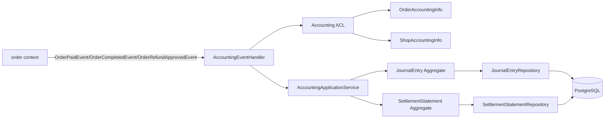
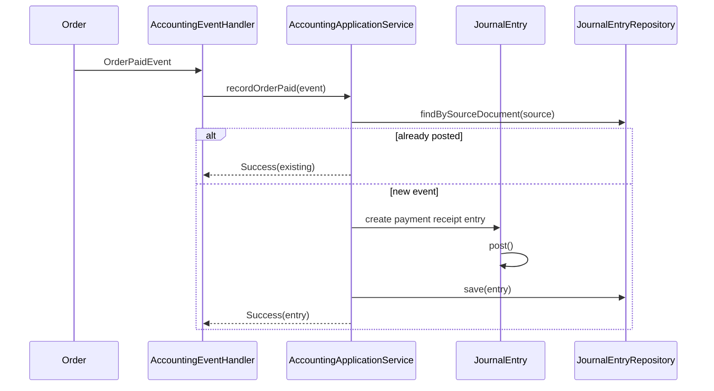

# 设计文档：财务模块基础功能

## 概述

基础财务模块采用 j-store 现有 DDD 约定：`j-store-accounting` 放置领域与应用服务，`j-store-accounting-infrastructure` 放置仓储实现与 JPA PO。第一阶段以 `JournalEntry` 作为账务事实源，支付成功只记录平台代收和商户待结算负债，订单完成后再确认平台佣金，退款通过反向凭证冲正。

#### 设计决策

| 决策 | 选择 | 理由 |
|---|---|---|
| 核心事实源 | `JournalEntry` | 凭证分录天然承载复式记账、审计追溯和重算余额 |
| 支付入账时点 | 支付成功记代收负债，不确认收入 | 避免订单未完成时提前确认平台佣金收入 |
| 冲正方式 | 生成相反借贷方向的新凭证 | 当前 `Price` 不支持负数，且保留原始凭证不可变 |
| 跨聚合一致性 | 事件驱动最终一致 | 符合“一次事务修改一个聚合”的仓库约定 |
| 账户余额 | 查询视图/投影 | 余额可从 POSTED 凭证重算，不作为唯一事实源 |
| 外部信息获取 | Accounting ACL 快照 | 订单、商户、支付信息不直接泄漏到财务领域模型 |
| 第一阶段范围 | 总账 + 结算 + 基础余额查询 | 收窄范围，先形成最小账务闭环 |

## 架构





目录结构：

```text
j-store-accounting/src/main/kotlin/com/jstore/accounting/
  domain/
    account/
      LedgerAccount.kt
      LedgerAccountRepository.kt
      AccountingAccountErrors.kt
    journal/
      JournalEntry.kt
      JournalLine.kt
      JournalEntryRepository.kt
      AccountingPeriod.kt
      AccountingErrors.kt
      command/
        CreateJournalEntryCMD.kt
      event/
        JournalEntryPostedEvent.kt
        JournalEntryReversedEvent.kt
    settlement/
      SettlementStatement.kt
      SettlementStatementRepository.kt
  acl/
    AccountingOrderService.kt
    AccountingShopService.kt
    AccountingPaymentService.kt
    OrderAccountingInfo.kt
    ShopAccountingInfo.kt
    PaymentAccountingInfo.kt
  service/
    AccountingApplicationService.kt
    AccountingEventHandler.kt
    SettlementApplicationService.kt

j-store-accounting-infrastructure/src/main/kotlin/com/jstore/accounting/
  domain/
    account/
      LedgerAccountRepositoryImpl.kt
      persistence/
        LedgerAccountPO.kt
        LedgerAccountPOJpaRepository.kt
    journal/
      JournalEntryRepositoryImpl.kt
      persistence/
        JournalEntryPO.kt
        JournalLinePO.kt
        JournalEntryPOJpaRepository.kt
    settlement/
      SettlementStatementRepositoryImpl.kt
      persistence/
        SettlementStatementPO.kt
        SettlementLinePO.kt
        SettlementStatementPOJpaRepository.kt
```

## 组件与接口

### 1. LedgerAccount

位置：`j-store-accounting/src/main/kotlin/com/jstore/accounting/domain/account/LedgerAccount.kt`

职责：维护可入账账户，限制只有启用账户可以被分录引用。

```kotlin
package com.jstore.accounting.domain.account

import com.jstore.common.framework.AgreeGate
import com.jstore.common.properties.Id

data class LedgerAccountId(override val value: Long) : Id<Long>(value)
data class LedgerAccountCode(val value: String)
data class AccountingSubject(val subjectType: SubjectType, val subjectId: String)

enum class LedgerAccountType { ASSET, LIABILITY, EQUITY, REVENUE, EXPENSE }
enum class BalanceDirection { DEBIT, CREDIT }
enum class LedgerAccountStatus { ACTIVE, INACTIVE }
enum class SubjectType { PLATFORM, MERCHANT, USER, CHANNEL }

interface LedgerAccount : AgreeGate<LedgerAccountId> {
    override val id: LedgerAccountId
    val code: LedgerAccountCode
    val name: String
    val type: LedgerAccountType
    val direction: BalanceDirection
    val subject: AccountingSubject
    val status: LedgerAccountStatus

    fun deactivate(): com.jstore.common.utils.Result<Unit, com.jstore.common.errors.BusinessError>
    fun activate(): com.jstore.common.utils.Result<Unit, com.jstore.common.errors.BusinessError>
}
```

### 2. JournalEntry

位置：`j-store-accounting/src/main/kotlin/com/jstore/accounting/domain/journal/JournalEntry.kt`

职责：封装凭证分录、借贷平衡、过账不可变和冲正行为。

```kotlin
package com.jstore.accounting.domain.journal

import com.jstore.accounting.domain.account.LedgerAccountId
import com.jstore.common.errors.BusinessError
import com.jstore.common.framework.AgreeGate
import com.jstore.common.properties.Id
import com.jstore.common.properties.Price
import com.jstore.common.utils.Result
import java.time.Instant
import java.time.LocalDate

data class JournalEntryId(override val value: Long) : Id<Long>(value)
data class JournalLineId(override val value: Long) : Id<Long>(value)
data class SourceDocument(
    val sourceType: SourceDocumentType,
    val sourceId: String,
    val eventType: String,
)

enum class SourceDocumentType { ORDER, REFUND, SETTLEMENT, ADJUSTMENT }
enum class JournalEntryType { ORDER_PAYMENT, ORDER_COMPLETION_COMMISSION, ORDER_REFUND_REVERSAL, SETTLEMENT_PAYMENT, MANUAL_ADJUSTMENT }
enum class JournalEntryStatus { DRAFT, POSTED, REVERSED }
enum class EntrySide { DEBIT, CREDIT }

data class JournalLine(
    val id: JournalLineId,
    val accountId: LedgerAccountId,
    val side: EntrySide,
    val amount: Price,
    val memo: String,
)

interface JournalEntry : AgreeGate<JournalEntryId> {
    override val id: JournalEntryId
    val entryNo: String
    val type: JournalEntryType
    val sourceDocument: SourceDocument
    val accountingDate: LocalDate
    val status: JournalEntryStatus
    val lines: List<JournalLine>
    val createdAt: Instant
    val postedAt: Instant?
    val reversedBy: JournalEntryId?

    fun addLine(line: JournalLine): Result<Unit, BusinessError>
    fun post(openPeriod: AccountingPeriod): Result<Unit, BusinessError>
    fun markReversed(reversalEntryId: JournalEntryId): Result<Unit, BusinessError>
    fun createReversal(
        reversalEntryId: JournalEntryId,
        reversalEntryNo: String,
        accountingDate: LocalDate,
        reason: String,
    ): Result<JournalEntry, BusinessError>
}
```

### 3. AccountingApplicationService

位置：`j-store-accounting/src/main/kotlin/com/jstore/accounting/service/AccountingApplicationService.kt`

职责：编排入账用例，处理幂等检查、账户查找、聚合创建和保存。业务规则仍由聚合执行。

```kotlin
package com.jstore.accounting.service

import com.jstore.accounting.domain.journal.JournalEntry
import com.jstore.accounting.domain.journal.SourceDocument
import com.jstore.accounting.service.command.RecordOrderCompletedCMD
import com.jstore.accounting.service.command.RecordOrderPaidCMD
import com.jstore.accounting.service.command.RecordOrderRefundApprovedCMD
import com.jstore.common.errors.BusinessError
import com.jstore.common.utils.Result

class AccountingApplicationService(
    private val journalEntryRepository: com.jstore.accounting.domain.journal.JournalEntryRepository,
    private val ledgerAccountRepository: com.jstore.accounting.domain.account.LedgerAccountRepository,
    private val accountingPeriodRepository: com.jstore.accounting.domain.journal.AccountingPeriodRepository,
) {
    fun findBySourceDocument(sourceDocument: SourceDocument): JournalEntry?
    fun recordOrderPaid(cmd: RecordOrderPaidCMD): Result<JournalEntry, BusinessError>
    fun recordOrderCompleted(cmd: RecordOrderCompletedCMD): Result<JournalEntry, BusinessError>
    fun recordOrderRefundApproved(cmd: RecordOrderRefundApprovedCMD): Result<JournalEntry, BusinessError>
}
```

### 4. SettlementStatement

位置：`j-store-accounting/src/main/kotlin/com/jstore/accounting/domain/settlement/SettlementStatement.kt`

职责：按商户和结算周期汇总结算明细，确认后冻结金额，打款后发布结算打款事件。

```kotlin
package com.jstore.accounting.domain.settlement

import com.jstore.common.errors.BusinessError
import com.jstore.common.framework.AgreeGate
import com.jstore.common.properties.Id
import com.jstore.common.properties.Price
import com.jstore.common.utils.Result
import java.time.Instant
import java.time.LocalDate

data class SettlementStatementId(override val value: Long) : Id<Long>(value)
data class SettlementLineId(override val value: Long) : Id<Long>(value)
data class SettlementPeriod(val startDate: LocalDate, val endDate: LocalDate)

enum class SettlementStatementStatus { DRAFT, CONFIRMED, PAID, CANCELLED }

data class SettlementLine(
    val id: SettlementLineId,
    val orderId: String,
    val grossAmount: Price,
    val refundAmount: Price,
    val commissionAmount: Price,
    val netAmount: Price,
)

interface SettlementStatement : AgreeGate<SettlementStatementId> {
    override val id: SettlementStatementId
    val statementNo: String
    val merchantId: String
    val period: SettlementPeriod
    val status: SettlementStatementStatus
    val lines: List<SettlementLine>
    val payableAmount: Price
    val confirmedAt: Instant?
    val paidAt: Instant?

    fun addLine(line: SettlementLine): Result<Unit, BusinessError>
    fun confirm(): Result<Unit, BusinessError>
    fun markPaid(paidAt: Instant): Result<Unit, BusinessError>
}
```

## 数据模型

### 领域模型

- `LedgerAccount`：账户聚合根，保存科目编码、主体、类型、方向和状态。
- `JournalEntry`：凭证聚合根，保存 `SourceDocument`、会计日期、状态和分录集合。
- `AccountingPeriod`：会计期间聚合根，控制开放和关闭状态。
- `SettlementStatement`：结算单聚合根，保存商户、周期、明细和应结金额。

### 持久化表

```sql
CREATE TABLE accounting_ledger_account (
    id BIGINT PRIMARY KEY,
    code VARCHAR(64) NOT NULL,
    name VARCHAR(128) NOT NULL,
    account_type VARCHAR(32) NOT NULL,
    balance_direction VARCHAR(16) NOT NULL,
    subject_type VARCHAR(32) NOT NULL,
    subject_id VARCHAR(128) NOT NULL,
    status VARCHAR(32) NOT NULL,
    created_at TIMESTAMP NOT NULL,
    updated_at TIMESTAMP NOT NULL,
    CONSTRAINT uk_accounting_ledger_account_code_subject UNIQUE (code, subject_type, subject_id)
);

CREATE TABLE accounting_journal_entry (
    id BIGINT PRIMARY KEY,
    entry_no VARCHAR(64) NOT NULL UNIQUE,
    entry_type VARCHAR(64) NOT NULL,
    source_type VARCHAR(64) NOT NULL,
    source_id VARCHAR(128) NOT NULL,
    source_event_type VARCHAR(128) NOT NULL,
    accounting_date DATE NOT NULL,
    status VARCHAR(32) NOT NULL,
    reversed_by BIGINT NULL,
    created_at TIMESTAMP NOT NULL,
    posted_at TIMESTAMP NULL,
    CONSTRAINT uk_accounting_journal_source UNIQUE (source_type, source_id, source_event_type)
);

CREATE TABLE accounting_journal_line (
    id BIGINT PRIMARY KEY,
    entry_id BIGINT NOT NULL,
    account_id BIGINT NOT NULL,
    side VARCHAR(16) NOT NULL,
    amount_fen BIGINT NOT NULL,
    memo VARCHAR(256) NOT NULL,
    CONSTRAINT fk_accounting_line_entry FOREIGN KEY (entry_id) REFERENCES accounting_journal_entry(id),
    CONSTRAINT fk_accounting_line_account FOREIGN KEY (account_id) REFERENCES accounting_ledger_account(id),
    CONSTRAINT ck_accounting_line_amount_positive CHECK (amount_fen > 0)
);

CREATE TABLE accounting_period (
    id BIGINT PRIMARY KEY,
    period_code VARCHAR(16) NOT NULL UNIQUE,
    start_date DATE NOT NULL,
    end_date DATE NOT NULL,
    status VARCHAR(32) NOT NULL,
    closed_at TIMESTAMP NULL,
    closed_by VARCHAR(128) NULL
);

CREATE TABLE accounting_settlement_statement (
    id BIGINT PRIMARY KEY,
    statement_no VARCHAR(64) NOT NULL UNIQUE,
    merchant_id VARCHAR(128) NOT NULL,
    period_start DATE NOT NULL,
    period_end DATE NOT NULL,
    status VARCHAR(32) NOT NULL,
    payable_amount_fen BIGINT NOT NULL,
    confirmed_at TIMESTAMP NULL,
    paid_at TIMESTAMP NULL,
    created_at TIMESTAMP NOT NULL,
    CONSTRAINT uk_accounting_settlement_merchant_period UNIQUE (merchant_id, period_start, period_end)
);

CREATE TABLE accounting_settlement_line (
    id BIGINT PRIMARY KEY,
    statement_id BIGINT NOT NULL,
    order_id VARCHAR(128) NOT NULL,
    gross_amount_fen BIGINT NOT NULL,
    refund_amount_fen BIGINT NOT NULL,
    commission_amount_fen BIGINT NOT NULL,
    net_amount_fen BIGINT NOT NULL,
    CONSTRAINT fk_accounting_settlement_line_statement FOREIGN KEY (statement_id) REFERENCES accounting_settlement_statement(id)
);
```

### 基础账户

| 编码 | 名称 | 类型 | 方向 | 主体 |
|---|---|---|---|---|
| `1002` | 平台银行存款 | ASSET | DEBIT | PLATFORM |
| `1010` | 支付渠道清算 | ASSET | DEBIT | CHANNEL |
| `2101` | 商户待结算款 | LIABILITY | CREDIT | MERCHANT |
| `3001` | 平台佣金收入 | REVENUE | CREDIT | PLATFORM |

### 入账模板

订单支付成功：

```text
借：1010 支付渠道清算     paidAmount
贷：2101 商户待结算款     paidAmount
```

订单完成确认佣金：

```text
借：2101 商户待结算款     commissionAmount
贷：3001 平台佣金收入     commissionAmount
```

退款批准：

```text
借：2101 商户待结算款     refundAmount
贷：1010 支付渠道清算     refundAmount
```

结算打款：

```text
借：2101 商户待结算款     payableAmount
贷：1002 平台银行存款     payableAmount
```

## 正确性属性

### Property 1：凭证借贷平衡

任何 `POSTED` 的 `JournalEntry` 必须满足借方金额合计等于贷方金额合计。

验证需求：需求 3。

### Property 2：过账后不可变

任何 `POSTED` 的 `JournalEntry` 不允许新增、删除或修改 `JournalLine`，只能通过新的冲正凭证调整。

验证需求：需求 3、需求 7。

### Property 3：事件幂等

相同 `SourceDocument` 最多只能生成一张 `JournalEntry`。

验证需求：需求 4。

### Property 4：支付不提前确认收入

订单支付成功入账只能影响支付渠道清算账户和商户待结算账户，不得贷记平台佣金收入账户。

验证需求：需求 5。

### Property 5：退款不修改原凭证

退款批准后生成新的反向凭证，原支付凭证保持原状态和原分录不变。

验证需求：需求 7。

### Property 6：结算金额一致

`SettlementStatement.payableAmount` 必须等于所有 `SettlementLine.netAmount` 之和。

验证需求：需求 8。

### Property 7：关闭期间不可普通入账

`accountingDate` 落在 `CLOSED` 期间的普通凭证不得过账。

验证需求：需求 9。

## 错误处理

| 错误常量 | 场景 | HTTP 语义 |
|---|---|---|
| `AccountingErrors.JOURNAL_ENTRY_UNBALANCED` | 凭证借贷不平 | 400 |
| `AccountingErrors.JOURNAL_ENTRY_ALREADY_POSTED` | 对已过账凭证追加分录 | 400 |
| `AccountingErrors.JOURNAL_ENTRY_NOT_FOUND` | 原凭证不存在 | 404 |
| `AccountingErrors.SOURCE_DOCUMENT_ALREADY_POSTED` | 重复来源事件 | 409 |
| `AccountingErrors.LEDGER_ACCOUNT_INACTIVE` | 引用停用账户 | 400 |
| `AccountingErrors.ACCOUNTING_PERIOD_CLOSED` | 关闭期间普通入账 | 400 |
| `AccountingErrors.SETTLEMENT_STATEMENT_INVALID_STATE` | 结算单状态不允许当前操作 | 400 |
| `AccountingErrors.SETTLEMENT_AMOUNT_MISMATCH` | 结算行合计与应结金额不一致 | 400 |

应用服务返回 `Result<T, BusinessError>`。事件处理器对幂等重复事件返回成功并记录已有凭证，不抛业务异常；对账户缺失、期间关闭、分录不平等错误记录日志并保留事件重试能力。

## 测试策略

- 属性测试：随机生成多条借贷分录，验证 `post()` 只允许借贷平衡凭证成功。
- 属性测试：随机生成相同 `SourceDocument` 的重复事件，验证只创建一张凭证。
- 属性测试：随机生成结算行，验证 `payableAmount` 等于 `netAmount` 合计。
- 单元测试：订单支付成功生成两条分录，且不包含平台佣金收入账户。
- 单元测试：订单完成生成佣金确认分录。
- 单元测试：退款批准生成反向分录且原凭证不变。
- 单元测试：已过账凭证调用 `addLine()` 返回 `JOURNAL_ENTRY_ALREADY_POSTED`。
- 集成测试：`JournalEntryRepositoryImpl` 保存和加载凭证时分录完整往返。
- 集成测试：`uk_accounting_journal_source` 唯一约束阻止重复入账。

## 实施顺序

1. 调整 `j-store-accounting` 与 `j-store-accounting-infrastructure` 依赖，引入 `j-store-common-core`，基础设施引入 domain 模块和 Spring Data JPA。
2. 实现 `LedgerAccount`、`JournalEntry`、`AccountingPeriod` 领域模型和错误常量。
3. 实现 `JournalEntryRepository` 与 JPA 持久化映射。
4. 实现基础账户种子数据或迁移脚本。
5. 实现 `AccountingApplicationService.recordOrderPaid()`，完成支付入账闭环。
6. 实现订单完成佣金确认和退款冲正。
7. 实现 `SettlementStatement` 及结算打款凭证。
8. 实现余额查询视图或仓储查询方法。
9. 补齐属性测试、单元测试和仓储集成测试。
