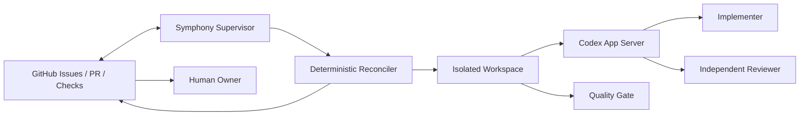
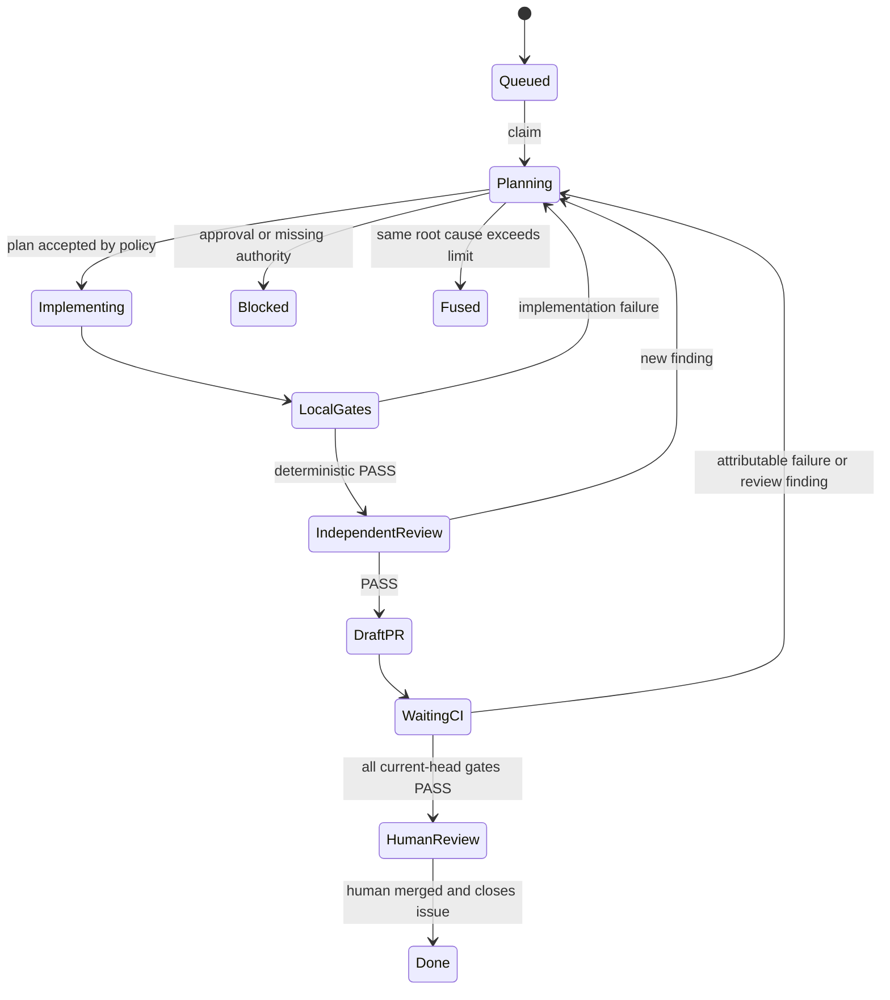

# Agentic CI/CD 编排设计

## 决策摘要

1. 采用 Symphony 作为常驻外层 Supervisor，不把长流程塞入单次 GitHub Actions job。
2. 第一版直接使用 Symphony reference implementation 已提供的 GitHub Issues adapter；运行时固定到经过审查且包含 GitHub 凭据隔离修复的 commit，不浮动跟随 `main`。
3. GitHub Issue 是任务控制面，Issue/PR/Git 是恢复事实；MVP 使用单 Supervisor，不引入业务数据库。
4. Agent 自主决定任务内实现步骤，但状态转换、权限、测试、required checks、重试上限和人工终态属于确定性硬门禁。
5. “正式 PR”是唯一 Draft PR 转为 Ready for Review；自动化不创建第二个 PR、不批准、不合并、不发布。
6. Symphony 当前通过 Codex App Server 驱动 Agent，因此先实现其 v2 JSONL 协议适配；OpenAI 官方对一般 CI 自动化优先推荐 Codex SDK，生产化评审时需用相同验收样例比较二者，不把 App Server 选择视为不可变决策。

## 组件边界



- **Symphony Supervisor**：轮询带调度标签的打开 Issue，声明运行、管理 workspace、启动 Codex turn、处理重试和停止。
- **Deterministic Reconciler**：读取 GitHub check/review/branch 状态，验证状态转换前置条件并执行幂等副作用。LLM 只能提交建议，不能伪造 gate conclusion。
- **Workspace Manager**：从锁定的 `origin/develop` SHA 创建、恢复和清理每 Issue 工作区。
- **Implementer**：根据目标和 findings 修改候选；不能给出最终批准。
- **Independent Reviewer**：使用独立会话和只读权限审查固定 head SHA；一旦修改候选，其批准立即失效。
- **Quality Gate**：运行仓库命令并保留退出码、摘要和日志位置，不修改代码。

## 控制面模型

### Issue 状态

GitHub Issues adapter 原生状态只有 `open`/`closed`，因此细粒度状态由一个互斥 `agent:*` 标签表示。`agent:queued` 同时作为 Symphony `required_labels` 调度条件；任务运行期间保留它，进入人工等待或阻塞终态时移除。

Issue Form 仅自动添加非调度标签 `agent:candidate`。仓库所有者完成身份、范围和风险分诊后，才可人工替换为 `agent:queued`，避免公共仓库中的任意 Issue 创建者直接触发 Agent。

| 状态标签 | 含义 | 允许自动写代码 |
|---|---|---:|
| `agent:queued` | 已满足准入，等待或正在自动处理 | 是 |
| `agent:waiting-ci` | Draft PR 已存在，等待 checks/review | 仅在失败归因为候选后 |
| `agent:human-review` | 全部门禁通过，等待人决定 | 否 |
| `agent:blocked` | 缺少输入、权限或外部依赖 | 否 |
| `agent:fused` | 同根因达到自动修复上限 | 否 |
| `agent:cancelled` | 人工取消 | 否 |

运行中的更细步骤保存在唯一 `## Codex Workpad` 评论中，而不为每个短暂步骤创建标签，以减少并发更新冲突。

### Workpad

Workpad 必须包含：

```text
run id / host / workspace
origin/develop base SHA
branch / head SHA / Draft PR
accepted scope and acceptance mapping
current iteration plan
deterministic validation commands and conclusions
independent review findings with root-cause IDs
semantic-fix attempts and infrastructure retries
budget consumption and next transition
GitHub handoff event ID
```

更新 Workpad 使用 compare-and-reconcile：先读取最新评论，再基于稳定标记更新；API 冲突后重新读取，不盲目覆盖。

## 生命周期



状态转换由 Reconciler 验证：

- 当前 Issue 仍可调度；
- claim 属于本 Supervisor 实例；
- worktree 与 branch 对应记录的 base/head；
- 评审与 checks 针对最新 head SHA；
- 不存在未解决的 blocking finding；
- 副作用幂等键尚未消费。

## Workspace 和 Git 设计

- 每次认领先执行 `git fetch origin develop`，解析并记录 `refs/remotes/origin/develop`。
- workspace 路径使用 `GH-<number>`，不拼接未经净化的 Issue 标题。
- 分支名使用 `codex/gh-<number>-<normalized-slug>`，目标固定为 `develop`，与仓库现有小写分支策略一致。
- 恢复时先根据 Issue 查找开放 PR，再核对 head branch、head SHA 和 workspace；不得仅凭本地目录判断。
- 目标分支前移时使用非交互方式同步并重新运行受影响门禁；不得 force push 受保护分支。
- PR 合并或 Issue 终止后才允许按 runbook 清理 workspace；清理前记录最终证据。

迭代 2 的确定性实现位于 `scripts/agentic_cicd/`：

- `coordinator.py`：合同状态转换、互斥 claim、根因化熔断、基础设施重试、预算、kill switch、原子快照和幂等键；
- `workspace.py`：Issue 标识/路径净化、获取真实 `origin/develop`、小写分支命名、独立 worktree 创建和可信元数据恢复。

当前 Level 0 不提供会调用这些写能力的生产 CLI；实现仅作为受测试的后续 Supervisor 组件存在。能力合同升级前，`WORKFLOW.md` 仍使用只读 sandbox。

## Agent 协作

### 规划与实现

Implementer 每轮收到规范化 `IterationPacket`：

```json
{
  "issue_identifier": "GH-123",
  "objective": "...",
  "base_sha": "...",
  "head_sha": "...",
  "acceptance": ["AC-..."],
  "review_findings": [],
  "ci_failures": [],
  "attempts_by_root_cause": {},
  "budget_remaining": {},
  "validation_commands": ["./scripts/quality-gate.sh"],
  "implementer_session_id": "..."
}
```

Agent 输出计划、变更、验证建议和阻塞项。Supervisor 不接受 Agent 自述的 PASS，只读取实际命令和 GitHub check 状态。

迭代 3 的机器合同和适配器位于：

- `config/agentic-cicd/iteration-packet.schema.json`：完整规划输入；
- `config/agentic-cicd/review-decision.schema.json`：PASS/FAIL 与结构化 finding；
- `config/agentic-cicd/role-routing.json`：写入角色、只读门禁和独立批准角色；
- `scripts/agentic_cicd/protocol.py`：运行时校验、固定 head PASS ledger 和快照可恢复的决定；
- `scripts/agentic_cicd/app_server.py`：JSONL request/response correlation、拒绝 server-initiated 提权请求、角色 sandbox 和 structured output；
- `scripts/smoke-codex-app-server.py`：不启动模型 turn，只验证当前已安装稳定版CLI、动态 v2 schema 和初始化握手。
- `scripts/check-agentic-cicd-runtime.py`：在启动 Supervisor 前验证 Symphony 精确源码提交及安全祖先、tracked source 洁净度、Codex稳定版策略和 Elixir/mise 构建工具；不启动服务或模型 turn。

### 独立评审

- Reviewer 使用新的 Agent 会话，只读检出固定 head SHA。
- Product Steward 负责验收覆盖和意图漂移；Evaluator 负责实现质量；高风险 diff 再路由 Security Agent。
- Finding 至少包含 `root_cause_id`、严重度、证据、影响、期望行为和验证方式。
- PASS 绑定 head SHA；任何新提交都会使旧 PASS 失效。
- `reviewer_session_id`、`implementer_session_id` 和 `head_sha` 都由 host 持有并复核；模型不能通过在输出中自报另一个身份或 SHA 获得批准。

## CI 反馈归因

| 失败类型 | 识别证据 | 动作 | 计入语义修复次数 |
|---|---|---|---:|
| 候选实现 | 编译、测试、静态规则在候选差异触发 | 返回规划并修复 | 是 |
| 基线失败 | 同一 base SHA 或 `develop` 已失败 | 阻塞并引用基线 run | 否 |
| 基础设施 | runner、网络、服务不可用 | 指数退避后有限重试 | 否 |
| Flaky | 相同 head 重跑后结论变化且无代码变更 | 记录并按策略重跑 | 否 |
| 需求/权限 | 需要改变意图、密钥或权限 | 转人工 | 否 |

相同 `root_cause_id` 最多允许两次有实质差异的语义修复。只改提示、重复同一命令或无新证据的重跑不构成实质差异。

## PR 就绪门禁

Reconciler 将 Draft PR 转为 Ready 前必须同时验证：

1. PR base 为 `develop`，head 为当前任务分支且只有一个开放 PR。
2. head SHA 等于 Workpad 和本地候选记录。
3. `branch-policy`、`quality`、`static-analysis`、`dependency-vulnerability-scan`、`dependency-license-audit`、`secret-scan` 全部为 success。
4. 适用的额外检查没有失败或等待状态。
5. 所有 actionable review thread 已处理。
6. 最新 head SHA 获得独立 Reviewer PASS。
7. PR 模板中的验收、测试、兼容性、恢复和残余风险已填写。
8. 没有 `agent:blocked`、`agent:fused` 或人工审批未决项。

## 安全设计

- 使用仓库专用 GitHub App。只读期授权 Metadata/Contents/Actions/Checks/PR/Issues read；Issue comment/label、Contents、PR write和review request必须按后续阶段分别批准。
- 不授予 Administration、Secrets、Environments、Deployments 或 Workflows write。
- GitHub App installation token 按任务短期签发；Supervisor 的长期私钥不进入 workspace 或 Codex 子进程。
- 使用 Symphony host-side `github_api` 工具，运行时必须包含会从子进程环境清除 GitHub token 别名的安全修复。
- `WORKFLOW.md` 由部署端从可信 `origin/develop` 固定 SHA 加载。候选分支修改后的工作流只能被评审，不能驱动当前运行。
- hook 内容只允许执行受版本控制、受 CODEOWNERS 保护的脚本；不直接执行 Issue 或 PR 文本拼接出的 shell。
- Issue 必须由允许身份创建或人工加 `agent:queued`，降低提示注入成为执行入口的风险。
- 运行节点与生产网络隔离，不挂载生产密钥和生产数据。

## 运行时与制品身份

第一版使用 OpenAI Symphony Elixir reference implementation 的 GitHub Issues adapter。锁文件记录仓库、commit、校验日期和必须包含的安全修复。部署构建必须从该 commit 产生并校验来源，不下载无校验的浮动二进制。

仓库不绑定单一具体Codex CLI版本。构建和部署入口读取当前已安装CLI的稳定版`X.Y.Z`输出，拒绝预发布、无法识别或空版本，并将该次实际版本显式传入镜像构建；Dockerfile不得提供浮动默认值。部署预检必须由同一二进制动态生成App Server v2 schema并验证请求参数，再完成`initialize`/`initialized`握手。实际版本写入镜像tag、label、runtime revision和来源记录，单个运行制品最终由完整镜像digest唯一标识。stdio JSONL模式不对外暴露监听端口；无模型smoke不发送`thread/start`或`turn/start`，不会触发模型费用。

默认运行策略：

- 单 Supervisor；
- 最大并发 `1`；
- 每次 Agent invocation 最大 `1` turn，由同一 Symphony Orchestrator 的 active-state continuation 创建下一独立会话；可信 turn-receipt 适配、validate/complete 无模型短路和重放阻断均属于该约束；
- Level 0 使用 `read-only` sandbox；进入本地实现迭代后才经受审合同变更为 `workspace-write`；
- 审批请求、规则变更和 MCP elicitation 默认拒绝并转阻塞；
- 仅在实现阶段按 allowlist 开放外网；只读观察期禁用网络写能力。

模型评审输出使用不含 session/thread/turn 身份的 `ReviewProposal`。host-side 阶段桥从 Symphony TurnReceipt 取得可信身份，与已保存 implementer session 和 exact head 绑定后才生成 `ReviewDecision`；模型自述不能成为独立性证据。

## GitHub 人工交接

Ready 转换生成稳定幂等键：`handoff:<repo>:<pr-number>:<head-sha>`。Reconciler只通过host-side GitHub能力尝试三种信号：更新唯一Workpad、把互斥状态标签迁移到`agent:human-review`、按仓库配置请求指定reviewer；Coding Agent不持有GitHub token，也不能指定任意外部接收者。

交接副作用按最新head SHA逐项幂等记录。至少一种已启用信号成功后，handoff才标记完成；其余失败信号形成独立operational finding并继续重试。三种信号全部失败时handoff保持pending。PR已转Ready后，任何信号失败都不回滚候选代码或Ready状态；重试成功后记录对应GitHub事件标识，重复事件直接跳过。

## 可观测性

结构化日志至少包含：

- `issue_identifier`、`run_id`、`workspace`；
- `base_sha`、`head_sha`、`pr_number`；
- `role`、`state_from`、`state_to`；
- `root_cause_id`、`semantic_attempt`、`infra_retry`；
- `turn_count`、耗时和预算；
- GitHub run/review/handoff 外部标识。

日志不得包含 prompt 中的秘密、完整 token 或未脱敏运行数据。

## 部署与恢复

- 试点 Supervisor/Codex执行面部署为指定开发主机上的单一host-native systemd服务；Artifact Broker、Gate Dispatcher和隔离Gate Job继续运行在开发Kubernetes集群。详细合同见[主机原生执行面变更](../changes/agentic-cicd-host-execution-plane/design.md)。
- host服务使用专用非登录身份和systemd credentials，不持有kubeconfig或Kubernetes ServiceAccount token；集群内组件继续使用独立namespace和最小ServiceAccount。
- 运维入口只用于受控管理，不把SSH身份、私钥、kubeconfig、个人Codex HOME或长期token写入仓库、bundle、ConfigMap、Issue或日志。
- 同一仓库只允许一个活跃Supervisor；host启动门必须确认旧Kubernetes Deployment为0且无Running Pod，静态单元不自动enable/restart。扩容前必须重新设计协调协议并单独批准。
- MVP 通过 Issue/Workpad、Git、PR 和 workspace 恢复；仅本机临时调度状态可以丢失。
- 全局 kill switch 阻止新认领并终止安全停止点上的 Agent，不删除候选数据。
- 回退优先停止host service或移除调度标签；保留Local PV、审计日志和任务事实，GitHub Actions和人工开发保持独立运行。不得以关闭Codex sandbox的Pod作为默认回退。

## 验证策略

- 静态合同测试验证 `WORKFLOW.md`、Issue 模板、状态模型、版本锁和治理边界互相一致。
- 使用临时 Git 仓库验证分支命名、基线锁定、重复恢复和取消清理。
- 使用 fake GitHub API 验证重复事件、单 PR、检查汇总、review thread 和 Ready 转换。
- 使用 fake GitHub API 验证Workpad、状态标签、review request的幂等键和失败重试。
- 在 disposable GitHub 仓库执行真实 E2E；随后按迭代6在j-store重新切换为只读profile观察两周，再逐步开放低风险写入。
- 故障注入覆盖 Supervisor 在规划、实现、等待 CI 和 GitHub 人工交接阶段被终止后的恢复。

## 重要风险

| 风险 | 缓解 |
|---|---|
| Symphony 属于预览实现 | 固定并审查 commit；先只读；保留停止和替换能力 |
| Issue/评论提示注入 | 身份/标签准入、最小工具、host-side 凭据、人工高风险审批 |
| Agent 自审失真 | 实现与最终评审分离；PASS 绑定 SHA；确定性 gate 优先 |
| 无限修复和资源失控 | 根因化计数、turn/时间限制、两次熔断 |
| 重启产生重复 PR/人工交接 | 以 GitHub 事实恢复，所有副作用使用幂等键 |
| 候选修改工作流提升权限 | 只执行可信 base SHA 的工作流和 hook |
| develop 本身红灯 | 上线写模式前修复基线；失败归因为 baseline 时停止修改候选 |
