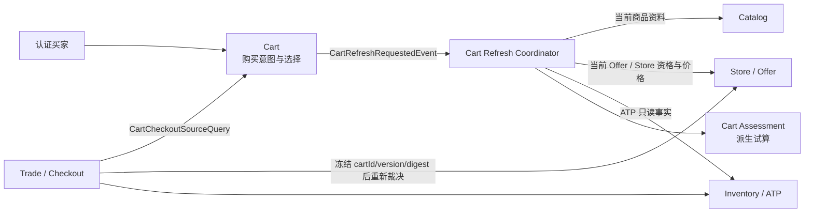

# 购物车上下文设计

## 设计目标

本设计实现 `requirement.md` 中的 CART-R1 至 CART-R7，并遵守当前模块依赖、Outbox、Result 错误处理和分层约束。核心选择是把“用户意图”和“派生试算”建模为两个独立聚合，避免 Cart 同时承担价格、库存和跨上下文查询职责。

## 上下文关系



权威关系：

- Cart 只权威管理“买家想买什么、数量多少、选择哪些行”。
- Cart Assessment 只描述一次观察结果，不成为价格或库存权威。
- Catalog 决定 SKU 当前是否属于已发布商品资料。
- Store / Offer 决定 Offer、Store、价格、有效期、渠道和履约节点。
- Inventory 决定指定 SKU 与履约节点的 ATP。
- Trade 负责 Checkout 幂等、可信快照、销售授权、库存预留、拆单和 Order 创建。

## 模块布局

新增模块：

| 模块 | 单一职责 |
|---|---|
| `j-store-cart-api` | 向 Trade 发布稳定的 Cart Checkout 来源查询契约，不暴露 Cart 领域对象 |
| `j-store-cart-domain` | Cart、CartLine、CartAssessment、值对象、纯计算规则、仓储端口和领域事件 |
| `j-store-cart-application` | 加购、选择、刷新、查询和 Checkout 来源准备的无框架用例编排 |
| `j-store-cart-infrastructure` | Cart / Assessment JPA 映射、仓储实现和上游查询 ACL 适配器 |
| `j-store-cart-boot` | HTTP Controller、Spring 事务装饰器、事件 handler 和 Bean 装配 |

同时新增 `j-store-inventory-api` 作为 Inventory 的稳定只读发布契约。Cart 不允许依赖 `j-store-inventory-domain`、Repository 实现或 Inventory 数据表。

依赖方向：

```text
cart-boot -> cart-application -> cart-domain -> common-core
         -> cart-infrastructure -> cart-domain
cart-infrastructure -> goods-api / shop-api / inventory-api
trade-boot -> cart-api
cart-application -> cart-api（实现发布接口时）
```

`cart-api` 只包含标量 DTO 和查询接口，不依赖 Cart domain。

## SRP 责任分配

| 组件 | 唯一主要责任 | 不负责 |
|---|---|---|
| `Cart` | 维护购买意图、数量、选择、版本和变化事件 | 查询商品、计算价格、判断库存、Checkout |
| `CartAssessment` | 保存某个 Cart 版本的一次成功派生结果 | 修改 Cart、成为成交承诺 |
| `CartAssessmentCalculator` | 根据已经采集的行事实执行纯规则和金额求和 | 调用外部服务、持久化 |
| `CartCommerceFactsService` ACL | 批量采集并转换 Catalog、Offer、ATP 标量事实 | 保存 Cart、决定 Checkout |
| `CartRefreshService` | 协调读取 Cart、采集事实、计算并保存 Assessment | Cart 行变更、Trade 创建 |
| `CartCheckoutSourceQueryService` | 为 Trade 返回当前版本已选择且可结算的规范化输入 | 创建 Trade 或资源承诺 |
| Trade `CheckoutSourceResolver` | 将 Direct 或 Cart 来源统一为 Checkout Intent | 管理 Cart 内容 |

## 领域模型

### Cart 聚合

```text
Cart
  id: CartId
  buyerId: BuyerId
  status: ACTIVE | EXPIRED
  settlementScope: SettlementScope(market, channelId, currency)
  contentVersion: Long
  lines: List<CartLine>

CartLine
  id: CartLineId
  skuId: Long
  offerId: Long
  quantity: Int
  selected: Boolean
  addedAt: Instant
  modifiedAt: Instant
```

主要行为：

- `setItemQuantity(expectedVersion, targetQuantity)`：新建行或按 Offer 设置绝对目标数量；目标已满足时收敛成功，目标未满足且版本陈旧时冲突；校验数量、行数上限和 Settlement Scope 一致性。
- `replaceSelection(expectedVersion, lineIds)`：原子替换目标选择集合；未知行失败；目标已满足时收敛成功且不增加版本，目标未满足且版本陈旧时冲突。
- 可选后续行为 `changeQuantity`、`removeLine` 不进入首个交付切片。
- 每次实际内容变化将 `contentVersion + 1`，并记录 `CartRefreshRequestedEvent(cartId, contentVersion, reason)`。

一个活动 Cart 对一个 buyer 唯一。首条加购时由应用服务和工厂使用可信 Offer 的 `market + channelId + currency` 惰性创建；后续不同商户的 Offer 可以加入，但 Settlement Scope 不一致时聚合拒绝且不改变版本。

### 加购编排

Cart 数量设置采用 `inspect -> resolve -> commit` 三阶段编排：先在短只读事务中判断目标是否已经收敛；尚未收敛时在无数据库事务阶段查询 Offer；最后在新的短写事务中重新加载 Cart、再次判断目标、校验版本与可信 Offer 身份，并保存 Cart 与 Outbox。第二次判断保证并发请求已经完成目标或 Offer 在重试前不可用时仍可按目标状态收敛。

可信 Offer 的 merchantId 和 Settlement Scope 作为聚合命令参数。Cart 不在事务中锁库存，也不把当前价格写入 Cart Line；写事务提交后通过刷新事件生成当前可结算结果。数量或 Selection 修改响应只报告 Cart 命令结果，可携带已有 Assessment 的 `STALE` 视图，但 Assessment 暂时不可用不得把已经提交的 Cart 修改报告成失败。

加购接口不接受 `spuId`、价格、Offer 版本、Catalog 版本、商户或履约节点；这些事实全部从发布 API 派生。

### CartAssessment 聚合

```text
CartAssessment
  id: CartAssessmentId
  cartId: CartId
  sourceCartVersion: Long
  status: COMPLETE | PARTIAL | EMPTY
  estimatedAmount: Price
  currency: String
  evaluatedAt: Instant
  lines: List<CartAssessmentLine>

CartAssessmentLine
  cartLineId
  status: ELIGIBLE | UNSELECTED | CATALOG_UNAVAILABLE |
          OFFER_UNAVAILABLE | OUT_OF_STOCK | INSUFFICIENT_STOCK
  observedUnitPrice?
  observedOfferVersion?
  observedCatalogVersion?
  observedAtp?
  reasonCode?
```

- `COMPLETE`：所有已选择行均 Eligible。
- `PARTIAL`：至少一个已选择行被业务规则排除，但至少一个 Eligible。
- `EMPTY`：没有 Eligible Line，金额为零。
- 上游技术失败不创建新的成功 Assessment；失败由刷新尝试日志和 meter 表达，最近成功 Assessment 仅能以 `STALE` 形式查询。

Assessment 的稳定业务身份使用 `cartId + sourceCartVersion`。相同版本重复计算执行 upsert/幂等返回；更旧版本不能替换最新版本。

### 纯计算规则

`CartAssessmentCalculator` 接收 Cart 快照和已标准化 `CartLineCommerceFacts`，不依赖 Repository、Clock 或外部接口。

判断顺序固定为：

```text
未选择
  -> Catalog 当前不可用
  -> Store / Offer 当前不可用或引用不匹配
  -> ATP == 0
  -> ATP < 请求数量
  -> Eligible，计入 currentOfferPrice * quantity
```

固定顺序保证一个行只产生一个稳定主原因，便于客户端提示和指标聚合。

## 上游只读契约

### Catalog

在 `j-store-goods-api` 增加按 SKU 批量查询当前发布状态的契约，返回：

```text
skuId, spuId, merchantId, published,
catalogSnapshotVersion, spuName, skuDescription
```

不能用历史 `GoodsSnapshotQueryService.queryLatestSnapshots` 的“最后一次发布快照存在”代替当前 `published` 状态，因为归档后历史快照仍需保留。

### Store / Offer

在 `j-store-shop-api` 发布面向组合查询的当前 Offer 事实：

```text
offerId, skuId, storeId, merchantId,
storeActive, offerActive, effectiveNow,
currentPrice, offerVersion,
fulfillmentNodeId, channelId, market, currency
```

是否下架由 Store / Offer 自身计算并返回原因或组成事实；Cart 不复制 Store / Offer 状态机。

### Inventory / ATP

新增 `j-store-inventory-api`：

```kotlin
fun interface InventoryAvailabilityQueryService {
    fun queryAvailability(keys: List<InventoryAvailabilityKey>): List<InventoryAvailabilityInfo>
}
```

键为 `skuId + fulfillmentNodeId`，结果至少包含 `availableToPromise`、上游 `sourceVersion` 和随 ATP 变化的 `availabilityVersion`。这是只读观察，不加锁、不创建 Reservation，也不保证 Checkout 时仍然可用。

### Cart 消费方 ACL

Cart domain/application 只看本地 `CartLineCommerceFacts`。`j-store-cart-infrastructure` 中的适配器批量调用上述三个 API、校验回包完整性并转换术语。缺失业务对象转换为对应 unavailable；调用异常或不完整技术响应作为整次刷新失败。

所有查询先对 SKU、Offer 和库存键去重，最多各一次批量调用，禁止逐行查询。

## 刷新事件与一致性

### 事件产生

Cart 内容变化事务执行：

```text
short read transaction: inspect current target
  -> no transaction: resolve required Offer identity
  -> new short write transaction: reload/create Cart
  -> aggregate behavior
  -> save Cart
  -> persist pending CartRefreshRequestedEvent to Outbox
  -> commit
```

事件只携带 `eventId, cartId, cartVersion, buyerId, reason, occurredAt`，不携带完整 Cart 或外部快照。

数量与 Selection 写入若在事务提交时发生 JPA 乐观锁冲突，事务装饰器使用新事务重试一次。重试重新加载 Cart：相同目标按已收敛 no-op 返回，不同目标由聚合返回版本冲突；第一次失败事务中的 Cart 和 Outbox 写入必须整体回滚。

显式刷新命令以 `expectedCartVersion` 指定目标版本；Assessment 的 `cartId + sourceCartVersion` 唯一约束提供自然幂等，已有结果直接返回，不保存请求历史。

### 事件处理

```text
receive(cartId, requestedVersion)
  -> before Outbox delivery transaction: load Cart in a short read transaction
  -> if cart.version != requestedVersion: discard as stale
  -> if Assessment for version already exists: success/no-op
  -> collect current facts without a transaction
  -> begin delivery transaction and claim consumption receipt
  -> calculate Assessment
  -> before save, verify Cart version still equals requestedVersion
  -> save Assessment and mark Outbox published in the same transaction
```

本地领域事件投递支持可选的 prepare/completion 两阶段：prepare 仅允许可重复的读取，不得执行持久化写入或不可逆外部副作用；返回的 completion 在原有投递事务中执行。Cart 的 prepare 结束读取事务后才采集外部事实，不通过挂起一个已经打开的投递事务来模拟释放连接。普通监听器继续使用 Spring 广播；预备型监听器完成并记录消费后，广播通过同一事务内的消费去重跳过重复执行。

事实查询失败必须传播到 Outbox 重试路径，不能正常确认消费；版本过期可作为 no-op 确认。completion 失败或 fencing 校验失败时，Assessment、消费记录与发布状态一起回滚。prepare 的结果只存在于本次尝试内，重投会重新采集。

Assessment 保存通过 PostgreSQL `INSERT ... ON CONFLICT (cart_id, source_cart_version) DO NOTHING` 仲裁并发。胜出者在同一事务保存明细，竞争者读取已提交的完整结果；不在已经失败的事务中捕获唯一约束异常继续查询。

最后一次版本检查必须由数据库条件更新或同一短事务中的乐观校验兜底，不能依赖 JVM 锁。

刷新是派生数据更新，不锁价、不锁库存。重复、乱序、进程重启只允许多次计算，不允许旧结果成为 CURRENT。

## API 设计

首期 HTTP 契约：

```text
PUT /api/carts/current/items
  { skuId, offerId, targetQuantity, expectedCartVersion }

PUT /api/carts/current/selection
  { expectedCartVersion, cartLineIds[] }

POST /api/carts/current/refresh
  { expectedCartVersion }

GET /api/carts/current
```

响应包括 Cart 内容版本、行项、选择状态以及 Assessment：

- Assessment 版本等于 Cart 版本时标记 `CURRENT`。
- 存在旧成功结果时可返回 `STALE`，但必须同时返回其 `sourceCartVersion`，且客户端不得将其用于 Checkout。
- 尚无结果或刷新失败时返回 `PENDING/UNAVAILABLE`，不伪造金额零。

所有路径使用 `@CurrentUserId`，不接受 body 中的 buyerId。

## 与 Trade / Checkout 集成

### 保持 Trade 为唯一入口

不在 Cart Controller 内直接调用 Order 或创建 Trade。扩展 `POST /api/checkouts` 的来源模型：

```text
CheckoutSourceRequest =
  DirectItems { items[] }
  | Cart { cartId, expectedCartVersion }
```

Trade application 引入单一职责的 `CheckoutSourceResolver`：

- Direct resolver 规范化现有直接购买行。
- Cart resolver 调用 `j-store-cart-api` 发布的 `CartCheckoutSourceQueryService`。

Cart API 返回：

```text
cartId, cartVersion, cartDigest,
eligibleLines[
  cartLineId, offerId, offerVersion,
  spuId, skuId, quantity, catalogSnapshotVersion
]
```

Cart 查询实现必须：

1. 校验 buyer 和 expectedVersion。
2. 结束 Cart 快照读取事务后，使用与刷新相同的事实采集器和纯计算器同步计算当前版本的新鲜 Assessment 候选；该路径不等待异步事件，也不要求把候选保存成查询投影。
3. 只返回已选择且 Eligible 的行。
4. 没有 Eligible 行时返回业务错误。

同步 Checkout 准备与异步 Assessment 持久化共享规则和 ACL，但分别负责“生成本次可信输入”和“维护可查询投影”，避免查询旧投影或把写投影变成 Checkout 的前置条件。技术失败时 Checkout 失败，不使用旧 Assessment。

Trade 随后仍通过自身 Checkout preparation 再次验证 Catalog 和 Offer，并在 Saga 中请求 SaleAuthorization 与 StockReservation。Cart Assessment 不能替代这些承诺。

### 多商户拆分与原子承诺

Cart 不按商户拆成多个聚合。Trade 接收规范化 Eligible Line 后，按以下规则形成计划：

```text
one Cart selection
  -> one Checkout request
  -> one Trade
  -> group lines by (merchantId, fulfillmentNodeId)
  -> one TradeOrderPlan per group
  -> one Order per successful plan
```

Trade 商品总金额使用 `Price.sumOf(orderPlans.payableAmount)`；每个计划金额使用 `Price.sumOf(plan.items.unitPrice * quantity)`。创建 Trade 前必须验证所有行的 `market + channelId + currency` 与 Cart Settlement Scope 一致，禁止在 Cart 或 Trade 中进行隐式汇率换算。

第一版沿用原子承诺策略：每个计划取得 SaleAuthorization 后可独立请求 StockReservation，但只有全部计划均已预留，Saga 才开始 Order 创建。任一计划授权或预留失败时，Trade 进入失败流程，并对其他计划已经取得的授权和预留发送幂等补偿。部分商户成功、部分商户继续创建订单属于后续策略扩展，不进入第一版。

### Trade 来源快照

Trade 增加不可变来源值对象：

```text
CheckoutSourceSnapshot
  type: DIRECT | CART
  sourceId?
  sourceVersion?
  sourceDigest
```

来源参与 Checkout request digest。相同 `checkoutRequestId` 只有 buyer、收货信息、来源摘要均一致时才幂等返回同一 Trade。

## 持久化与约束

建议表结构：

```text
cart
  id PK
  buyer_id
  status
  content_version
  persistence_version
  created_at / updated_at / expires_at
  UNIQUE(buyer_id) WHERE status = 'ACTIVE'

cart_line
  id PK
  cart_id FK
  sku_id / offer_id
  quantity / selected
  added_at / modified_at
  UNIQUE(cart_id, offer_id)

cart_assessment
  id PK
  cart_id / source_cart_version
  status / amount_fen / currency / evaluated_at
  UNIQUE(cart_id, source_cart_version)

cart_assessment_line
  assessment_id / cart_line_id
  inclusion_status / observed facts / reason_code
  UNIQUE(assessment_id, cart_line_id)
```

业务 `contentVersion` 与 JPA `persistenceVersion` 分离。前者进入事件和 Checkout 来源，后者只检测持久化并发。

数据库结构按内部开发期策略直接维护当前基线和初始化快照，不提供购物车数据回填或兼容双写。

## 错误语义

至少定义：

- `Cart.NotFound`：404，同时用于越权访问。
- `Cart.VersionConflict`：409。
- `Cart.InvalidQuantity`：400。
- `Cart.LineLimitExceeded`：400。
- `Cart.OfferSkuMismatch`：400 或 409。
- `Cart.SettlementScopeMismatch`：409。
- `Cart.UnknownSelectionLine`：400。
- `Cart.NoEligibleLines`：409。
- `Cart.RefreshUnavailable`：503；不得返回伪造金额。

预期业务失败使用 `Result<T, BusinessError>`。跨上下文查询异常在 infrastructure/boot 边界转换为稳定 Cart 错误；不能把 Spring、HTTP 或 JPA 异常泄露到 domain/application。

## 安全与隐私

- buyerId 只来自认证参数解析器。
- Cart API 不返回其他买家的存在性。
- Cart 只保存业务标识，不保存收货地址或支付信息。
- Checkout 的地址仍由 Trade 请求接收并冻结。
- 日志只记录 cartId、版本、行数、排除原因和 correlation ID；不记录手机号、地址或商品定制敏感内容。

## 可观测性

建议指标：

- `cart_refresh_total{result,reason}`
- `cart_refresh_duration_seconds`
- `cart_refresh_stale_discard_total`
- `cart_assessment_lines{status}`
- `cart_checkout_source_total{result}`
- `cart_version_conflict_total`

健康检查只反映 Cart 数据库和必要查询适配器状态，不因单次业务下架或售罄降级。

## 测试策略

### Domain

- Cart 行唯一性、绝对目标数量、版本增长、相同数量/Selection 目标收敛 no-op、不同目标陈旧版本冲突、未知选择失败。
- 不同商户同 Settlement Scope 可共存；不同 Settlement Scope 加购失败且 Cart 不变。
- Calculator 决策表、金额守恒、空/部分/全部 Eligible。
- 属性测试：任何输入下金额只等于 Eligible 行之和且不为负；排除行永不计价。

### Application

- fake repository 和 fake ACL 验证目标数量、选择、刷新、收敛幂等、失败传播和旧事件丢弃。
- Cart Checkout 来源只返回当前版本、已选择且 Eligible 的行。

### Infrastructure

- Cart 与 Assessment PO 往返。
- 活动 Cart 唯一约束、行 Offer 唯一约束、Assessment 版本唯一约束。
- 乐观并发和旧 Assessment 条件写入。
- Catalog / Offer / Inventory ACL 批量映射契约。

### Boot / Contract

- 认证买家隔离、请求映射、错误码和状态码。
- Cart 事件与 Outbox 同事务。
- `POST /api/checkouts` 的 Direct 与 Cart 两种来源契约。
- Cart 来源形成的 Trade 冻结来源版本和摘要。

### Feature-level

至少覆盖：

1. 加购两个 SKU，刷新得到金额，取消选择一行后重新刷新并 Checkout。
2. 一行 Offer 下架、一行售罄、一行可售时，只创建可售行对应的 Trade 计划。
3. Cart 刷新后发生并发修改，旧 Assessment 不可用于 Checkout。
4. ATP 在 Cart Checkout 来源刷新后、Reservation 前下降时，由 Trade 失败/补偿而不是错误成交。
5. 商户 A 两个商品、商户 B 一个商品在相同 Settlement Scope 下通过一次 Checkout 创建一个 Trade、两个 TradeOrderPlan 和两个订单，且 Trade 总金额等于两个计划金额之和。
6. 两个商户计划中任一授权或库存预留失败时，整笔 Trade 失败，另一计划已取得的授权或预留被补偿，且不创建部分订单。

## 重要替代方案

### 将价格和库存字段直接放进 CartLine

拒绝。它会使 Cart 成为第二价格/库存权威，并让行修改、价格刷新和库存变化共享一个聚合写热点，违反 SRP。

### Cart Controller 直接调用 Trade 写用例

拒绝。Trade 是统一 Checkout 边界；通过 `CheckoutSourceResolver + cart-api` 由 Trade 拉取来源可以避免 Cart 反向拥有交易编排。

### 库存变化时扫描并刷新所有相关购物车

首期拒绝。该方案产生不可控 fan-out，且仍不能形成库存承诺。采用惰性刷新和 Checkout 前强制新鲜评估，后续可独立增加热点商品失效通知投影。

### 使用 Redis 作为 Cart 唯一权威存储

首期拒绝。仓库现有事务、Outbox 和聚合模式以 PostgreSQL 为 Cart 权威；普通 Cart 写入通过目标状态与版本收敛，不依赖 Redis 或永久请求历史。Redis 可在有容量证据后作为查询缓存，但不能替代持久化 Cart。
