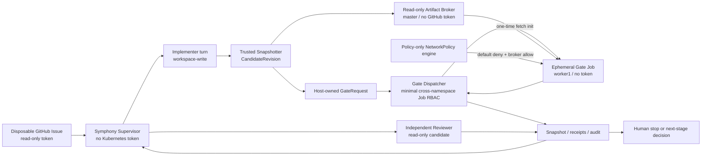

# Agentic CI/CD 本地候选闭环设计

## 决策摘要

1. 下一阶段定义为 **Level 1：本地候选闭环**，不是远程 PR 自动化。
2. 候选身份使用可信控制器生成的 Git tree 与不可变制品摘要，不要求 Implementer commit，也不修改工作区 index。
3. 候选代码只在独立 Gate Job 中执行；Symphony Pod 不挂 Kubernetes API token，由独立 Gate Dispatcher 持有最小 Job 管理权限。
4. Gate 与 Reviewer 都消费同一 CandidateRevision 的只读副本，任何候选变化都会使旧证据失效。
5. 先完成 Symphony 供应链和隔离 runner，再开启 `local_workspace_write`；所有远端写能力继续关闭。
6. 目标集群保留 Flannel VXLAN，不在本迭代替换 CNI；先以独立变更安装并验证 policy-only NetworkPolicy 执行器。执行器未通过隔离正反例前，Gate Job不得运行候选代码。
7. Supervisor及其 Local PV继续固定在 master；Gate Job固定到资源更充足的 worker1，通过独立只读 Artifact Broker拉取候选，不挂载或复制 Supervisor PVC。

## 目标集群事实与影响

2026-08-15 对目标集群的只读盘点形成以下约束：

| 事实 | 设计影响 |
|---|---|
| Kubernetes `v1.28.15`，containerd `2.2/2.3`，两个 Ready节点 | 继续使用标准 Deployment/Job；所有新增 API对象必须兼容 `v1.28` |
| master：16 CPU、约 12Gi内存；worker1：8 CPU、约 32Gi内存 | Supervisor留在 master；Gradle Gate固定 worker1，首轮并发 1 |
| master当前 memory limit已承诺约 95%，worker1约 18% | 不在 master运行完整 Gate；Dispatcher/Broker只设置小资源预算 |
| Flannel `v0.28.1` VXLAN，CNI链只有 flannel + portmap | 当前 NetworkPolicy对象不能作为执行证据；新增 policy-only执行器和真实连通性测试 |
| `agentic-cicd` Pod Security强制 `restricted` | 不采用 `NET_ADMIN` init、自定义 privileged Gate Pod或宿主防火墙旁路 |
| Symphony PVC为 master Local PV、RWO、Retain | Gate namespace不能也不应挂载该卷；使用内容寻址 Broker分发候选 |
| Symphony ServiceAccount无 Job、Secret、Pod list或 exec权限，Pod未挂 token | 保持现状；Dispatcher使用独立 SA和跨 namespace最小 RoleBinding |
| worker1有现有 j-store、PostgreSQL、Redis等开发 workload | Gate网络默认拒绝是硬门；设置 ResourceQuota、LimitRange和低优先级，避免资源争抢 |
| 当前没有已验证的内部 OCI Registry；master可免密 SSH到worker1，两节点均有 containerd工具 | Level 1先采用一次构建/下载、OCI archive按 digest导入目标节点；不依赖浮动镜像代理或 `latest` |

当前 `jstore` namespace已经存在 NetworkPolicy对象。安装执行器会使这些策略从“仅有对象”变为实际生效，属于集群级行为变化；必须先审计现有 allowlist，并在维护窗口验证 j-store、Redis、DNS、监控和入口流量，失败时立即回滚执行器。

首轮实机评估使用 `kube-network-policies v1.0.0`。worker1没有 NRI socket，切换到受支持的 `--disable-nri`后虽然两节点均可启动，但该实现仍将 PostgreSQL和监控连接的返回流量重新作为反向新流量判定，导致既有 `jstore` NetworkPolicy阻断数据库返回包和健康响应。该候选已卸载，业务随即恢复，不进入目标配置。

## 目标状态



Supervisor、Codex 子进程和 Gate Job 均不能读取 Gate Dispatcher 的 ServiceAccount token。Gate Dispatcher 不启动模型、不读取 GitHub token，也不修改 Issue、分支或 PR。

## 集群网络策略前置项

Flannel只负责 Pod网络，不应假设它执行标准 NetworkPolicy。目标方案优先评估与现有 Flannel并存的 policy-only实现，不替换 CNI、不重建现有 Pod网络。候选实现必须固定镜像 digest和配置，并先在临时 namespace完成：

1. 无策略时基线连通；
2. default-deny后 ingress/egress均失败；
3. 只允许 DNS/Broker时仅目标流量成功；
4. 跨节点 master ↔ worker1同样生效；
5. 删除执行器或回滚配置后集群恢复原网络状态；
6. 现有 jstore应用、Redis、入口、DNS和监控回归通过。

最终选择 `kube-router v2.10.0` 的 firewall-only模式，镜像固定为 `sha256:0991f2cc7aaabe107b51c0c554d6b843f0483fd319b94f437fab638470c47c22`：明确设置 `--run-router=false`、`--run-service-proxy=false`、`--run-firewall=true`，不包含 CNI installer、不挂载 `/etc/cni/net.d`，ClusterRole只有 pods、namespaces、nodes、services、endpoints、EndpointSlices和NetworkPolicy只读权限。实机已证明两节点 Ready、现有 j-store/Redis/PostgreSQL健康、跨节点允许流量成功且 ingress/egress负向流量失败。

Gate Job先运行受信的 network-admission init：等待固定收敛窗口后，必须实际拒绝 Kubernetes API、集群 DNS和公网端点，同时允许唯一的 Broker端点，随后才启动 fetch init；任一负向路由可达或 Broker尚不可达都会在候选物化前终止 Job。该逐 Job探针与跨节点 NetworkPolicy正反例共同构成同步硬门，不能仅凭 Pod Ready或存在策略对象放行候选。

回滚使用同一固定镜像的 `--cleanup-config`在每个节点清理规则。由于 kube-router该入口会尝试清理它支持的全部控制器配置，回滚脚本必须先拒绝非 iptables kube-proxy模式或已有其它 kube-router DaemonSet的集群；清理后强制等待 kube-proxy并回归 j-store健康。该约束使脚本只适用于本设计记录的开发集群拓扑。

## 能力分层

机器合同新增或收敛为以下独立能力：

| 能力 | Level 0 | Level 1 | 说明 |
|---|---:|---:|---|
| `bootstrap_local_workspace` | true | true | 从可信 `origin/develop` 创建本地隔离分支 |
| `local_workspace_write` | false | true | 仅 Implementer turn 可写当前 workspace |
| `freeze_local_candidate` | false | true | 可信 Snapshotter 生成 CandidateRevision |
| `run_isolated_gate` | false | true | 仅由 Gate Dispatcher 创建无凭据 Job |
| `create_remote_branch` | false | false | 不向 GitHub 创建 ref |
| `push_commit` | false | false | 不推送候选 |
| `create_draft_pull_request` | false | false | 不创建或更新 PR |
| `mark_pull_request_ready` / `send_email` | false | false | 后续阶段能力 |
| `auto_approve` / `auto_merge` / `auto_release` / `production_write` | false | false | 永久不因 Level 1 开启 |

`create_branch` 旧字段在一个受测试的合同迁移中替换；不保留同时代表本地和远端行为的模糊语义。

## CandidateRevision

### 冻结方式

可信 Snapshotter 使用独立临时 Git index：

1. 校验 workspace、可信 metadata、实际分支和 base SHA；
2. 从当前 `HEAD` 初始化临时 index，不触碰 workspace `.git/index`；
3. 收集 tracked、untracked、删除和文件模式，排除 `.git/` 与 `.agentic-cicd/`；
4. 拒绝 submodule、socket/device/FIFO、路径穿越及越界符号链接；
5. 通过 `git write-tree` 生成内容寻址的 `tree_sha`；
6. Snapshotter不调用会执行 clean/process filter的 `git add`；它安全枚举候选条目，以 `git hash-object --no-filters`和临时 index `update-index`把原始 worktree字节写入 tree，再从同一原始字节生成规范化只读 archive并计算 `artifact_sha256`；这样 CRLF等通常会被 Git规范化的字节变化仍会产生新 tree和候选身份，候选定义的 Git filter也不会在受信控制器中执行，冻结期间的竞态变化会被拒绝；
7. 将 base SHA、tree SHA、artifact SHA、snapshot policy digest 组合为 `candidate_revision`。

`git write-tree` 只创建本地 Git object，不创建 commit、branch ref 或远端副作用。Gate 和 Reviewer 从同一 archive 解包到各自一次性目录；不直接读取仍可变化的 Implementer workspace。

物化入口只接受不存在的新目标路径，拒绝目标符号链接；它先在可信父目录创建临时目录并校验全部 archive member，再使用 no-follow/exclusive文件创建和原子 rename发布结果。校验或写入失败只删除本次临时目录，不暴露半物化候选。

### 状态失效

Snapshot 中保存 CandidateRevision。进入下一轮 implement 前清除 active CandidateRevision、GateRequest、GateReceipt、ReviewProposal和review workspace指针，但保留以CandidateRevision索引的历史ReviewDecision审计账本。任何授权判断只查询当前exact CandidateRevision，因此旧PASS不能批准新候选；新冻结结果即使只改变文件模式，也必须得到新revision。恢复时若archive、tree或workspace metadata不匹配，任务进入blocked，不自动重建证据。

## 隔离 Gate Runner

### Gate Dispatcher

Gate Dispatcher 是独立、无模型的受信组件：

- 只读取 host-owned GateRequest 和 CandidateRevision metadata；不读取 GitHub token或 Supervisor state内容；
- 运行在 `agentic-cicd` namespace但使用独立 ServiceAccount，只允许在 `agentic-cicd-gates` 创建、观察和删除带固定 label的 Job/Pod并读取其日志；
- 不持有 GitHub、provider、Registry push 或业务集群凭据；
- 使用固定 runner image digest 和来自可信 base 的命令策略；
- 将 Pod/Job UID、镜像 ID、退出码、日志摘要写入 GateReceipt；
- Job 超时、驱逐、镜像拉取或节点故障分类为基础设施失败，不伪装为候选 finding。

GateRequest与GateReceipt作为 TaskSnapshot 的组成部分通过同目录临时文件、`fsync`和原子 replace持久化，不使用可能出现半事务的独立状态文件。Request绑定完整 CandidateRevision、唯一 gate ID、固定 runner digest、命令策略摘要、命令列表、超时和请求时间；Receipt再次绑定相同身份，并记录开始/结束时间、退出码、日志 SHA-256及 Job/Pod UID。Dispatcher恢复既存 Job前必须比较这些身份，任何不一致均拒绝消费。

候选命令非零退出分类为 `FAIL`并回流结构化 finding；超时、驱逐、镜像/节点等执行环境问题分类为`INFRASTRUCTURE_FAILURE`，不产生候选 finding、不清除 CandidateRevision，并消耗独立 infrastructure retry。每次基础设施重试使用新的 gate ID；已消费 gate ID不能重新请求。Receipt卷同时保存独立 cleanup完成标记；Dispatcher即使在Supervisor消费并删除request后仍会重试 foreground Job删除，只有确认Job消失后才写标记，避免已完成Job占满配额。超过机器合同预算后任务进入 blocked，不转入 implement，也不消耗语义修复次数。

Symphony Deployment 使用 `automountServiceAccountToken: false`。Dispatcher的 ServiceAccount token只挂载到 Dispatcher容器；不能与 Symphony或 Broker共享 Pod。Supervisor以 UID 10001只读 receipt卷、只写 request卷；Dispatcher以 UID 10002只读 request卷、只写 receipt卷，二者使用独立 Local PV和只读挂载形成单向通道。候选制品与 lease同样使用独立卷；模型 sandbox不得访问Dispatcher身份、token或receipt写路径。

### Artifact Broker

- Broker运行在 master，只挂载独立 candidate-artifact PVC为只读，不挂载 Symphony state/workspace路径；
- Broker不持有 GitHub、Kubernetes、Registry或模型凭据，只提供按 artifact SHA寻址的 GET；
- Dispatcher把短时、单次下载能力放入可信 fetch init，能力在主容器启动前失效，且不写入候选 workspace、日志或主容器环境；
- Gate Job位于 `agentic-cicd-gates` 并固定到 worker1；fetch init校验 artifact SHA后写入 emptyDir，主容器只读取该副本；
- NetworkPolicy允许 fetch init所在 Pod访问 Broker，但候选主容器即使再次连接也没有有效能力；Broker没有上传、列举或状态修改接口。

### Gate Job 基线

- `automountServiceAccountToken: false`；
- `runAsNonRoot`、固定 UID/GID、`allowPrivilegeEscalation: false`、drop ALL capabilities、RuntimeDefault seccomp；
- read-only root filesystem，仅 `/workspace` 和 `/tmp` 为临时卷；
- 默认 deny-all NetworkPolicy；需要依赖缓存时使用预构建 runner image 或单独批准的只读代理，不临时开放任意公网；
- CPU、内存、临时磁盘、`activeDeadlineSeconds` 和日志上限；
- candidate archive同时限制为512 MiB和10,000个member；fetch以两遍有界流式扫描先完成全量校验，再物化文件，避免单大文件或海量小文件耗尽128 MiB init内存；
- 不挂载 Supervisor PVC、宿主机路径、Docker/containerd socket、kubeconfig 或 Secret；
- 命令由可信策略选择，但候选脚本仍视为不可信代码，只能在上述隔离内执行。
- `nodeSelector` 固定 `k8s-worker1`；初始 requests不超过 2 CPU/4Gi，limits不超过 4 CPU/8Gi，并设置低于业务 workload的非全局默认 PriorityClass或保持默认优先级；资源不足时任务 blocked，不抢占现有 workload。

`agentic-cicd-gates` namespace单独强制 Pod Security `restricted`，只包含 Gate Job、ResourceQuota、LimitRange和NetworkPolicy。不得在该 namespace创建长期 Secret、Service、Ingress、PVC或通用调试 Pod。

## 阶段状态

```text
implement turn
  -> freeze candidate
  -> validate (GateRequest / GateReceipt, no model)
  -> review turn (read-only immutable candidate)
  -> complete
```

- Freeze 失败：`agent:blocked`，不进入 gate。
- Gate FAIL：结构化确定性 finding 回到 implement。
- Gate infrastructure failure：受限重试，保持 candidate revision。
- Review FAIL：finding 回到 implement，旧候选证据保留审计但不再有效。
- Review PASS：Level 1 complete，等待人工停止或批准下一阶段；不创建 PR。

`max_turns: 1`保持不变。validate、freeze和complete都在App Server创建前短路；after hook只提交可信TurnReceipt/请求，不执行candidate archive。Symphony在启动model turn前读取host-owned phase context，并在受信turn receipt中携带该次invocation的phase、role、head SHA和可选CandidateRevision；complete hook必须逐项回传，controller在任何状态写入前与当前snapshot核对。成功receipt还以session/thread/turn规范元组消费幂等键，因此Review FAIL回流后或未来再次进入同名phase时，旧callback都不能被重新分类或重复消费。

## Symphony 供应链顺序

供应链资格是 Level 1 部署的前置门：

1. 审计锁定 commit 后的上游修复，选择新的完整 Symphony commit 或最小可审查依赖补丁；
2. 按依赖治理单独提交升级候选，记录漏洞、许可证、兼容性和回滚 commit；
3. 使用官方镜像/软件源构建；代理不可用时回退官方源，需要认证时停止并向用户申请；
4. 在 Linux 原生文件系统完成 patch apply、`mix compile`、`mix test` 和依赖审计；
5. 构建双 revision、双 patch hash和基础镜像 digest固定的 OCI镜像，记录构建时实际稳定版Codex CLI并验证App Server v2兼容性，最终以完整镜像digest绑定制品；
6. Registry不可用时将同一 OCI archive按 digest导入 master和/或worker1，回查 containerd image ID；镜像代理不可用时使用官方源，需要认证时停止请求用户登录；
7. 独立安全评审通过后才允许注入短期只读 GitHub App token或启动模型 turn。

不能通过忽略审计、使用浮动 `main` 或保留已知高危依赖进入 Level 1。

## 端到端演练

按风险递增执行，任一步失败都停止在当前能力级别：

1. **无模型部署 smoke**：验证镜像、WORKFLOW、phase context、Dispatcher 和无凭据 Job。
2. **只读 observer**：使用短期只读 token读取一个 disposable Issue，证明单 turn 和 complete 短路。
3. **本地成功路径**：开启 Level 1 合同，Implementer 仅修改 disposable 低风险文件；Gate 和 Reviewer检查同一 CandidateRevision。
4. **失败回流**：用可信测试 fixture 产生一次 Gate FAIL 和一次 Review FAIL，确认稳定 finding 与新 revision 失效。
5. **恢复**：分别在 implement完成后、等待Gate、Gate PASS receipt持久化后但消费前、等待review四个点缩容/重启 Supervisor，确认没有重复副作用。
6. **熔断**：在隔离 fixture 中证明同根因第三次尝试进入 fused，不依赖真实模型故意犯错。
7. **停止**：移除调度资格并缩容为 0，保留状态供人工审计。

## 回退与失败处理

- 发现 token 泄漏、候选进程取得控制面访问、候选身份漂移或第二 App Server：立即缩容 Supervisor/Dispatcher 为 0，撤销短期 token并记录安全事件。
- Gate Runner 基础设施故障不修改候选；达到重试上限后 blocked。
- 新镜像失败时恢复上一已验证 Level 0 digest，`local_workspace_write` 回到 false。
- 不通过删除 PVC、Issue、workspace 或日志掩盖失败；物料清理仍需单独授权。

## 验证策略

- 合同测试：能力组合、阶段路由、凭据和远端写负向约束。
- Snapshotter 属性测试：内容稳定性、untracked/删除/mode、符号链接和特殊文件拒绝。
- Fake dispatcher/kubectl：Job 权限、镜像 digest、超时、重复请求和 receipt 绑定。
- Kubernetes integration：无 token、禁网、资源限制、新 Pod/Job UID 和恢复。
- Symphony upstream：完整 compile/test、依赖审计、单 turn 和无第二 App Server。
- 端到端：disposable Issue、exact-candidate reviewer、finding 回流、熔断和重启恢复。
- 仓库级：`./scripts/quality-gate.sh` 与独立 Product Steward/Security review。
