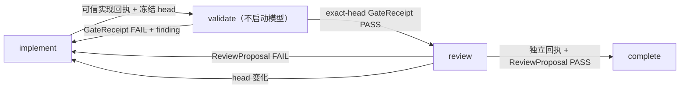

# Symphony 可信阶段桥设计

## 决策

采用“两段适配”而不是 hook 内嵌套 App Server：

1. 仓库侧 `SymphonyPhaseBridge` 只处理包、回执、确定性门禁结果和持久化状态，不启动 Codex。
2. 后续对固定 Symphony 源码增加最小、可校验的 turn-receipt 适配，将 App Server 返回的 `session_id/thread_id/turn_id` 传给 host-side complete hook。
3. 阶段控制器构建到镜像只读路径 `/opt/jstore-agentic-controller`；workspace 中的候选代码永远不能作为 hook 可执行入口。
4. Reviewer 使用 Symphony 提供的受限 host tool 提交 ReviewProposal。工具从 host-owned snapshot 校验当前为 review 阶段及 exact head，只写入对应 Issue 的外部状态目录；after hook 使用本次可信 receipt 完成绑定。
5. Implementer 完成后只记录可信 receipt 与实际 Git head，并进入 `validate`。验证由后续隔离 gate runner 产生 host-owned GateReceipt；Supervisor 不直接执行 workspace 脚本。

模型只产生 ReviewProposal；host 将 Symphony TurnReceipt 与已保存的 implementer session 绑定，生成 ReviewDecision。这样模型无法通过伪造身份绕过独立评审约束。

## 状态流



`iteration_phase` 是 TaskSnapshot 内部状态，不替代 GitHub label 状态机。外部 Issue/PR 状态仍由未来 reconciler 管理。

## 信任边界

- 可信：host 读取的 Git head、隔离 runner 写入的 GateReceipt、Symphony App Server 返回的 TurnReceipt、原子 SnapshotStore。
- 不可信：Issue 文本、prompt、模型 ReviewProposal 中的陈述、Agent 自报测试结果。
- ReviewProposal 不含运行时身份；ReviewDecision 中的 session 身份由 host 注入。
- `complete_review` 同时校验 receipt role、candidate head、proposal head 和 session 独立性。
- Symphony Supervisor 及 workspace hooks 不直接执行候选代码；隔离 gate runner 的实现和授权属于后续独立切片。

## 后续 Symphony 适配

下一切片 `I3-08B` 必须：

- 基于锁定 commit 维护最小 patch/fork commit 和摘要；构建前验证来源与补丁。
- 将每次 Agent invocation 设为 `max_turns: 1`，由同一 Orchestrator 的 active-state continuation 开启下一会话；`validate/complete` 在 App Server 启动前短路。
- 启动 session 前调用镜像内控制器读取 phase context；implement/review 分别选择 workspace-write/read-only，workspace 内容不得覆盖该选择。
- before hook 只准备当前阶段输入；after hook 只传递可信 turn receipt、运行确定性 gate 并推进阶段。
- after hook 不得调用 `codex`、`codex app-server` 或其他模型入口。
- after hook 失败必须可观测且不得被静默当成阶段成功；如果上游仍忽略 after hook 失败，适配器必须把失败写入 host-owned snapshot 并阻止下一阶段批准。
- `after_create` 使用 `--no-checkout` clone/fetch，由可信控制器锁定完整 `origin/develop` SHA 并创建任务分支；GitHub 默认 `master` 不得成为工作基线。
- Symphony patch 同时提供 turn receipt 环境和 `submit_review_proposal` host tool；ReviewProposal 不依赖 Reviewer 写 workspace。
- 构建输入同时固定 Symphony revision 与 j-store controller revision，二者均要求 tracked source 洁净并写入 OCI label。
- 镜像 tag 必须包含两个 revision 与 Codex 版本；WORKFLOW ConfigMap 使用内容 hash，使任一运行时内容变化都产生新 Pod template。
- 部署 smoke 验证 Pod UID、image ID、两个 revision label、实际挂载的 WORKFLOW hash和 `max_turns: 1`，不能只检查 Deployment available。

### Kubernetes 信任链

```text
clean j-store candidate commit ─┐
                               ├─> immutable image ─> new Pod template
clean pinned Symphony commit ──┘          │
                                          ├─ /opt/jstore-agentic-controller (read-only)
hashed trusted WORKFLOW ConfigMap ─────────┘
task workspace (writable) ───────────────X── host hook executable source
```

当前 Level 0 的同名镜像、`imagePullPolicy: Never` 和无 hash ConfigMap 只适用于已完成的无凭据 smoke；I3-08B 不复用该更新语义。

真实 disposable Issue 与一次已授权独立只读评审属于 `I3-08C`。只有 exact-head 模型证据、运行日志和恢复证据齐全后，才关闭 I3-04、I3-07、I3-08。

## 验证

- `python -m unittest tests.tooling.test_agentic_cicd_protocol tests.tooling.test_agentic_cicd_phase_bridge tests.tooling.test_agentic_cicd_coordinator`
- `python -m unittest tests.governance.test_agentic_cicd_contract`
- `python scripts/check-agentic-cicd.py`
- 交付前在指定远程 Linux 主机原生文件系统运行 `./scripts/quality-gate.sh`。
- 在临时 Kubernetes 名称空间或受控重建窗口验证镜像/WORKFLOW 改变会产生新 Pod UID；该验证属于集群写入，执行前需要精确授权。
