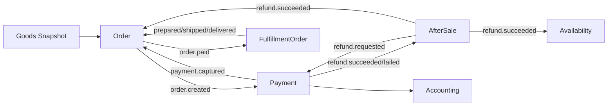

# 设计：订单领域边界重构

## 上下文边界



## 订单模型

`Order` 保留：

- `merchantId`、买家与收货快照、订单行项；
- `OrderAmountSnapshot`；
- `TradeStatus`、`PaymentStatus`、`FulfillmentStatus` 投影；
- `paidAmount`、`refundedAmount`；
- 支付捕获 ID 和退款成功事实，用于聚合内幂等。

`Order` 可主动执行的业务仅剩：库存确认/不足、未支付取消、交易完成。支付与履约改为事实登记方法：

- `recordPaymentCaptured`
- `recordFulfillmentPrepared`
- `recordShipmentDispatched`
- `recordShipmentDelivered`
- `recordRefundSucceeded`

## 支付模型

一个订单对应一个 `PaymentOrder` 聚合。第一阶段只支持全额捕获，但模型保存捕获与退款实体：

- `PaymentOrderStatus`: `PENDING`, `CAPTURED`, `PARTIALLY_REFUNDED`, `REFUNDED`
- `PaymentCapture`: 外部交易号、金额、发生时间
- `PaymentRefund`: 售后 ID、退款金额、状态、外部退款号
- `PaymentRefundStatus`: `PENDING`, `SUCCEEDED`, `FAILED`

`providerTransactionId` 和 `providerRefundId` 在仓储层建立唯一约束。

## 履约模型

一个订单对应一个 `FulfillmentOrder`：

- `PENDING -> READY -> SHIPPED -> DELIVERED`
- 保存订单、商户、收货地址快照和行项快照；
- `ship` 保存承运商编码和运单号；
- 第一阶段整单履约，不支持部分数量。

订单不引用 Fulfillment 聚合对象，只保存状态投影。

## 售后模型

```text
REQUESTED --reject--> REJECTED
REQUESTED --cancel--> CANCELLED
REQUESTED --approve(unshipped)--> REFUND_PENDING
REQUESTED --approve(shipped)--> RETURN_REQUIRED
RETURN_REQUIRED --receiveReturn--> REFUND_PENDING
REFUND_PENDING --refundSucceeded--> COMPLETED
REFUND_PENDING --refundFailed--> REFUND_FAILED
REFUND_FAILED --retryRefund--> REFUND_PENDING
```

售后容量在审批时继续冻结，只有拒绝/取消才释放。退款失败不释放容量，避免重复申请穿透退款上限。

## 集成事件

| 事件 | 生产者 | 主要消费者 |
| --- | --- | --- |
| `order.created` v2 | Order | Payment |
| `payment.captured` v1 | Payment | Order 投影 |
| `order.paid` v2 | Order | Inventory、Fulfillment |
| `fulfillment.prepared` v1 | Fulfillment | Order |
| `shipment.dispatched` v1 | Fulfillment | Order |
| `shipment.delivered` v1 | Fulfillment | Order |
| `after-sale.refund-requested` v1 | AfterSale | Payment |
| `after-sale.return-received` v1 | AfterSale | 退货审计与后续质检扩展 |
| `after-sale.refund-succeeded` v1 | AfterSale | Order、Inventory |
| `payment.refund-succeeded` v1 | Payment | AfterSale、Accounting |
| `payment.refund-failed` v1 | Payment | AfterSale |

Boot 层仅做事件语言翻译；订单领域不得 import Payment/Fulfillment 类型。

## 持久化与迁移

- `spu`、`spu_snapshot` 增加 `merchant_id`。
- `orders` 增加商户、币种、金额组成、已付金额、支付捕获 ID；删除 `total_amount`、`actual_pay`。
- `order_refund_facts` 改为按 `refund_id` 幂等，并保存 `after_sale_id`。
- 新增 `payment_orders`、`payment_refunds`、`payment_refund_items`；首期单次全额捕获字段保存在支付单。
- 新增 `fulfillment_orders`、`fulfillment_items`。
- 扩展 `after_sales` 状态约束和退款 ID。
- 因系统未上线，迁移先清理相关开发数据，再重建结构，不提供旧数据回填。

## API 替换

- 删除 `/api/orders/{id}/pay`、`confirm-shipment`、`ship`、`deliver`。
- 新增 Payment 捕获与退款结果操作端点，作为未来 Provider Webhook 适配入口。
- 新增 Fulfillment 查询、备货、发货、送达端点。
- 售后新增退货收货、退款重试入口。

## 验证

- 领域单元测试覆盖所有状态与失败原子性。
- 应用服务测试覆盖重复事件/外部流水幂等。
- JPA 往返和 PostgreSQL 唯一约束测试覆盖新聚合。
- MockMvc 契约测试确认旧订单动作已删除、新接口可用。
- Flyway 测试确认破坏性迁移后的列、表、约束和索引。
- 运行 order、payment、fulfillment、accounting、goods、boot 模块测试以及全仓测试。
