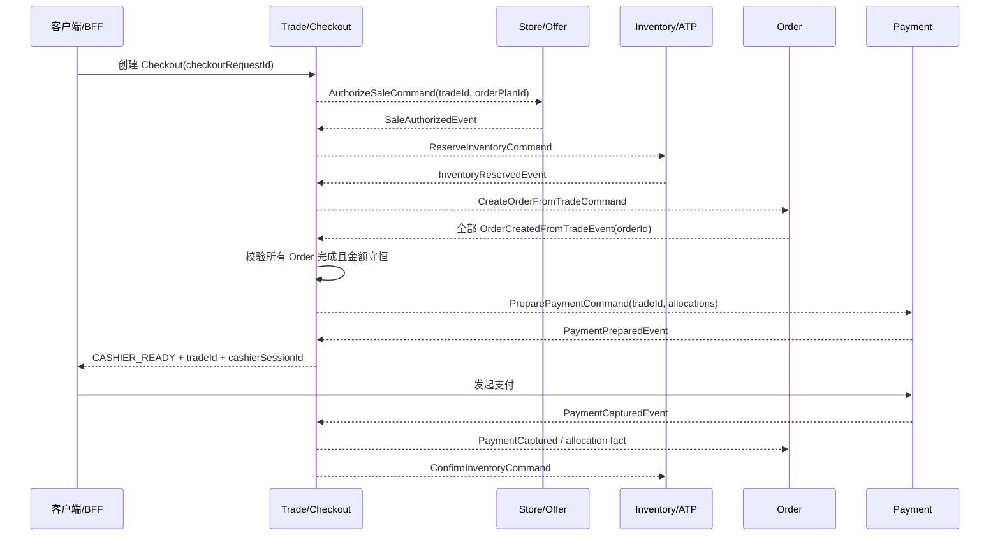
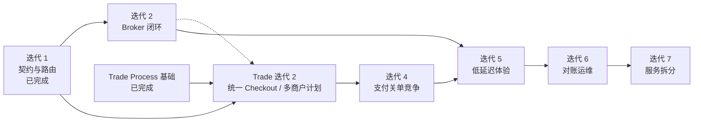

# 订单—库存—支付可靠异步迭代计划

## 1. 文档信息

| 项目 | 内容 |
|---|---|
| 状态 | 迭代 1 基础消息能力已实现；Trade Process 基础已由 `trade-checkout-boundary` 迭代 1 实现；Trade 唯一 Payment 与安全关单已批准并纳入其迭代 2；Broker、低延迟、对账和微服务切片待推进 |
| 适用范围 | 下单、销售授权、库存预留、支付准备、发起支付、支付确认、超时关单及相关补偿 |
| 目标部署形态 | 同时支持模块化单体、本地集成、Broker 集成和逐步微服务化 |
| 计划基线 | `event-delivery-architecture`、`outbox-production-hardening` 已交付能力 |
| 非目标 | 跨数据库 Exactly Once、XA/2PC、一次性拆分全部微服务、在领域事件中固化 Kafka/RabbitMQ 细节 |

本文把可靠异步和部署演进收敛为可执行路线。2026-08-12 已落地第一切片（消息契约、路由、Outbox 元数据和库存预留时限）；2026-08-14 已由 `trade-checkout-boundary` 迭代 1 落地 Trade Process 基础、授权/预留编排和补偿。Trade 唯一 Payment、渠道受理、安全宽限关单和迟到支付退款已由产品所有者批准，业务实现归入 `trade-checkout-boundary` 迭代 2；本文继续负责其可靠投递与运行验证，以及 Broker、低延迟、对账与微服务拆分。

### 1.1 与 Trade / Checkout 业务计划的关系

- [`trade-checkout-boundary`](../trade-checkout-boundary/requirement.md) 是用户下单入口、Trade 身份、多商户订单计划、Order 创建和业务状态机的权威来源。
- 本文负责 Broker、Inbox、投递故障窗口、支付关单竞争、容量、对账运维和微服务灰度，不再定义另一套 Order/Checkout Process Manager。
- Trade / Checkout 已确认是唯一用户下单入口；Order 只接受 Trade 的可信内部创建契约，并继续拥有单订单生命周期。
- 下一业务主迭代是“统一 Checkout、独立 `tradeId`、多商户 `TradeOrderPlan` 与 Trade 唯一 Payment”；Broker 可靠闭环可以并行准备，但不得继续把 `orderId` 固化为结账或支付主相关键。

## 2. 结论与实施原则

### 2.1 优先级结论

第一实施迭代应先优化**集成消息契约及其路由语义**，但不应重新设计已经满足内部事实表达需要的领域事件，也不应把 Broker Topic、Consumer Group、重试次数等基础设施信息加入领域事件。

正确的职责划分为：

1. 领域事件表达本限界上下文内已经发生的事实。
2. Translator/ACL 把领域事实转换为稳定的集成命令或集成事件。
3. 集成消息携带跨上下文语义、逻辑目的地、分区、关联、因果、租户以及必要的业务时限。
4. boot/infrastructure 根据逻辑目的地和投递策略选择 `local`、Kafka、RabbitMQ 或其它物理传输。
5. Trade / Checkout Process Manager 持久化跨上下文流程状态并决定下一步动作；Translator 不承担流程决策，Order 不成为第二流程管理器。

### 2.2 可靠异步目标

本项目采用：

```text
At-least-once delivery + 幂等业务效果 + 可恢复状态机 + 对账兜底
```

不追求跨数据库的 Exactly Once。消息可以重复，业务副作用不得重复；暂时失败可以自动恢复，永久失败必须可见、可审计、可人工重放。

### 2.3 低延迟目标

可靠性和低延迟分别治理：

- 可靠性通过本地事务、Outbox、Broker ACK、Inbox、业务幂等、重试、死信和对账实现。
- 低延迟通过高优先级通道、较短 Outbox 唤醒时间、有界同步等待和持久化进度查询实现。
- 不通过串联多个同步 RPC 或长数据库事务换取表面上的实时性。

## 3. 当前基线与差距

### 3.1 已有且应复用的能力

当前项目已经具备：

- `DomainEvent` 与 `IntegrationMessage` 分离。
- `IntegrationCommand` 与 `IntegrationEvent` 语义区分。
- 稳定的 message/event ID、名称、版本、发生时间、分区键、相关 ID、因果 ID和租户 ID。
- 事务性 Outbox、目标级独立记录及 `local`/外部 transport 规划。
- relay 领取、租约、fencing token、退避重试、死信、重放审计和可观测性。
- `j-store-observability-spring` 已统一提供 Actuator、Tracing、Prometheus 和条件化 HTTP correlation 自动配置；组件专属 meter、health contributor 和 span 仍由组件自身拥有。
- `j-store-outbox-spring` 已拥有 Outbox 指标、运行状态和条件化 `outbox` HealthIndicator；通用观测模块不依赖 Outbox，集群采集、存储和告警后端仍属于部署层。
- 本地集成消息 Handler、Inbox 技术幂等和流级顺序检查。
- 订单、销售授权、库存、支付、履约和会计之间的初步版本化集成契约。
- 结账命令 Deadline、库存 Reservation 标识和过期时间已进入现有契约；稳定消息 ID 已按真实消息版本生成。
- 现有订单后续链路具备以 `orderId` 作为 partition/correlation key 的基础；Checkout 主链将在下一业务迭代迁移为 `tradeId/orderPlanId`。

这些能力分别由以下既有规格定义：

- [`event-delivery-architecture`](../event-delivery-architecture/requirement.md)
- [`outbox-production-hardening`](../outbox-production-hardening/requirement.md)
- [`observability-production-foundation`](../changes/observability-production-foundation/requirement.md)

### 3.2 当前关键差距

| 差距 | 当前影响 | 目标迭代 |
|---|---|---|
| 没有具体 Broker 出站和入站适配器 | 现有 SPI 不能完成跨进程闭环 | 迭代 2 |
| 缺少 `PaymentPrepared/Failed/Cancelled/Uncertain` 等结果契约 | 无法可靠表达收银台是否就绪以及支付取消裁决 | `trade-checkout-boundary` 迭代 2 |
| Trade Process 基础已经持久化，但仍由 provisional Order 启动，缺少统一 Checkout API、独立 `tradeId`、多商户计划和 Order 内部创建闭环 | 用户入口和流程身份仍绑定单订单，不能安全扩展多商户 | `trade-checkout-boundary` 迭代 2 |
| 订单只有直接取消/关闭语义，缺少 `CLOSING` | 支付成功与超时关单竞争时可能错误拒绝资金事实 | 迭代 4 |
| Outbox 默认轮询间隔为 5 秒 | 多跳链路会累积出不可接受的收银台准备延迟 | 迭代 5 |
| 用户仍通过 Order 创建接口下单，Checkout API 没有持久化进度协议和有界等待 | 无法形成统一 Trade 入口，快慢路径用户不可感知 | Trade 迭代 2、本文迭代 5 |
| 缺少订单—库存—支付业务对账 | 消息系统之外的永久差异缺少最终兜底 | 迭代 6 |
| 根 boot 仍集中装配跨上下文 Translator 和迁移 | 独立部署边界尚未形成 | 迭代 7 |

### 3.3 已识别的模型风险

1. 当前 `Order.recordPaymentCaptured` 只允许 `ACTIVE + UNPAID`，订单进入最终关闭后到达的合法支付事实需要转入退款，而不能被静默拒绝或恢复履约。
2. 支付上下文当前主要表达 `PENDING/CAPTURED/REFUND`，尚未完整表达支付准备、关闭申请、取消完成和外部状态不确定。
3. 定时任务基础设施已存在，但不能直接把“计时到期”解释为“资金状态已经安全关闭”。
4. Inbox 技术幂等只能拦截同一 `messageId`；Trade 唯一 Payment、退款和库存预留仍必须有业务唯一约束。

## 4. 目标业务流程

### 4.1 正常路径



### 4.2 慢路径

Checkout 创建请求只等待有限时间：

```text
在等待预算内达到 CASHIER_READY -> 200/201 + 收银台会话
未达到但已可靠受理          -> 202 + tradeId + statusUrl
请求本身无效或明确失败      -> 4xx/业务失败
系统在受理前过载            -> 快速失败，可用相同 checkoutRequestId 重试
```

HTTP 请求结束后，可靠异步流程必须继续推进。客户端通过轮询、SSE 或 WebSocket 观察持久化状态，不依赖某个 JVM 内的 Future。

### 4.3 超时关单路径

```text
PAYMENT_READY / PAYING
  -> 到达 Payment acceptBefore：禁止新支付尝试
  -> 到达 Trade closeAfter（包含安全宽限）：查询或 CancelPaymentCommand
       -> PaymentCancelled/NotAcceptedEvent -> 撤销 Orders -> ReleaseInventoryCommand -> CLOSED
       -> PaymentCapturedEvent              -> PAID -> ConfirmInventoryCommand
       -> PaymentUncertainEvent             -> 保持 CLOSING，主动查询支付机构
       -> CLOSED 后迟到 PaymentCaptured     -> 保持关闭并发起幂等退款
```

`closeAfter` 必须晚于 Payment `acceptBefore`；是否按时以渠道权威受理/捕获时间而不是回调到达时间判断。在支付上下文给出“未创建、未支付或已安全撤销”的权威裁决前，订单不得最终关闭并释放库存；原 Trade 关闭后不得创建第二个 Payment。

## 5. 消息建模与路由规范

### 5.1 三层模型

| 层次 | 应包含 | 不应包含 |
|---|---|---|
| Domain Event | 事实 ID、名称、版本、时间、聚合标识、完整事实数据 | Topic、Broker、重试、Consumer Group |
| Integration Message | 消息语义、逻辑 destination、partition/correlation/causation、tenant、业务 Deadline、稳定标量 payload | 生产方聚合对象、JPA 类型、物理 Topic |
| Delivery Policy | transport、物理 destination 映射、优先级、重试、TTL/DLQ、容量和告警 | 领域规则和状态转换 |

### 5.2 路由字段约定

| 字段 | 约定 |
|---|---|
| `messageId` | 一次业务意图/事实的稳定唯一 ID；消息版本必须参与稳定 ID 语义 |
| `messageName` | 稳定发布语言名称，不使用 Kotlin 类全名作为外部契约 |
| `messageVersion` | 正整数；不兼容 payload 变化必须升版本 |
| `destination` | 逻辑目的地，例如 `payment.commands`，不等于具体 Broker Topic |
| `partitionKey` | Checkout 编排按 `orderPlanId` 保证计划内局部有序；订单生成后的支付分配、履约和售后按适用的 `tradeId` 或 `orderId` 分区 |
| `correlationId` | Checkout 主链统一使用稳定 `tradeId`；不得再用尚未生成的 `orderId` 充当 Trade 身份 |
| `causationId` | 触发当前消息的上游 message/event ID |
| `merchantScopeId` | 商户隔离需要时使用 `merchantId`；不承载 Site 语义，消费端不得只信任该字段完成授权 |
| `deploymentScopeId` | 独立的部署/站点路由扩展；当前可空或由部署配置提供，不参与业务授权 |
| `occurredAt` | 事实发生或命令生成时间，不能代替业务截止时间 |
| `acceptBefore` | 命令最晚受理时间；迟到时产生明确失败事实，不静默执行 |
| `expiresAt` | 授权、Reservation、收银台会话等业务承诺失效时间 |
| `orderingKey`/`sequenceNo` | 传输顺序元数据，由 Outbox 规划生成，不进入领域事实判断 |

### 5.3 目标消息目录

| 消息 | 类型 | 生产者 -> 消费者 | 逻辑 destination | 关键业务字段 | 幂等业务键 |
|---|---|---|---|---|---|
| `AuthorizeSaleCommand` | Command | Trade -> Store | `store.commands` | tradeId、orderPlanId、items、acceptBefore | orderPlanId + offerIds |
| `SaleAuthorizedEvent` | Event | Store -> Trade | `trade.events` | tradeId、orderPlanId、authorizationIds、expiresAt | orderPlanId + authorizationIds |
| `SaleAuthorizationFailedEvent` | Event | Store -> Trade | `trade.events` | tradeId、orderPlanId、标准错误码、retryable | orderPlanId + requestId |
| `ReserveInventoryCommand` | Command | Trade -> Inventory | `inventory.commands` | tradeId、orderPlanId、authorizationIds、items、acceptBefore | orderPlanId + authorizationIds |
| `InventoryReservedEvent` | Event | Inventory -> Trade | `trade.events` | tradeId、orderPlanId、reservationIds、expiresAt | orderPlanId + reservationIds |
| `InventoryReservationFailedEvent` | Event | Inventory -> Trade | `trade.events` | tradeId、orderPlanId、标准错误码、retryable | orderPlanId + requestId |
| `CreateOrderFromTradeCommand` | Command | Trade -> Order | `order.commands` | tradeId、orderPlanId、可信成交快照 | orderPlanId |
| `OrderCreatedFromTradeEvent` | Event | Order -> Trade | `trade.events` | tradeId、orderPlanId、orderId | orderPlanId |
| `PreparePaymentCommand` | Command | Trade -> Payment | `payment.commands` | tradeId、orderIds、金额分配、acceptBefore、desiredPaymentExpiresAt | tradeId |
| `PaymentPreparedEvent` | Event | Payment -> Trade | `trade.events` | tradeId、paymentId、cashierSessionId、expiresAt、allocationVersion | tradeId/paymentId |
| `PaymentPreparationFailedEvent` | Event | Payment -> Trade | `trade.events` | tradeId、标准错误码、retryable | tradeId + requestId |
| `CancelPaymentCommand` | Command | Trade -> Payment | `payment.commands` | tradeId、paymentId、reason、acceptBefore | tradeId/paymentId |
| `PaymentCancelledEvent` | Event | Payment -> Trade | `trade.events` | tradeId、paymentId、cancelledAt | paymentId |
| `PaymentCapturedEvent` | Event | Payment -> Trade/Order/Accounting | `commerce.events` | tradeId、providerTransactionId、providerAcceptedAt/providerCapturedAt、amount、currency、allocationVersion | providerTransactionId |
| `PaymentStatusUncertainEvent` | Event | Payment -> Trade | `trade.events` | tradeId、paymentId、reason、nextInquiryAt | paymentId + inquiryGeneration |
| `ConfirmInventoryCommand` | Command | Trade -> Inventory | `inventory.commands` | tradeId、orderPlanId、reservationIds | orderPlanId + reservationIds |
| `ReleaseInventoryCommand` | Command | Trade -> Inventory | `inventory.commands` | tradeId、orderPlanId、reservationIds、reason | orderPlanId + reservationIds |

说明：上表是目标发布语言，需按业务迭代升级当前 V1 契约；不得在未完成生产者、消费者和持久化同步迁移时只修改单侧载荷。`cashierSessionId` 应是可受控查询或兑换的短期引用，不应在广播事件中携带第三方密钥、完整支付凭证或用户敏感数据。

### 5.4 投递策略目录

建议新增框架无关策略模型或配置校验，至少支持：

```kotlin
data class DeliveryPolicy(
    val profile: String,
    val ordered: Boolean,
    val priority: Int,
    val maxDeliveryAge: Duration?,
    val retryProfile: String,
    val deadLetterRequired: Boolean,
    val alertOnDeadLetter: Boolean,
)
```

初始策略：

| Profile | 适用消息 | 顺序 | 过期 | 失败策略 |
|---|---|---|---|---|
| `CHECKOUT_CRITICAL` | 授权、预留、Order 创建、支付准备、支付取消 | orderPlanId 或 tradeId 有序 | 根据业务 Deadline 拒绝迟到执行 | 快速重试，死信立即告警 |
| `MONEY_FACT` | 支付捕获、退款结果 | payment/order 有序 | 不因消息年龄丢弃 | 持续恢复、死信 P0/P1 告警、对账 |
| `FULFILLMENT_CRITICAL` | 创建履约、发货、签收 | orderId 有序 | 通常不可过期 | 重试、死信、对账 |
| `NOTIFICATION_TRANSACTIONAL` | 支付/退款/发货通知 | 业务键去重 | 可配置通知有效期 | 有限重试、渠道降级 |
| `BEST_EFFORT` | 营销、分析 | 通常无强顺序 | 可过期 | 有限重试，允许审计后丢弃 |

## 6. 迭代总览

可靠异步技术路线保留 7 个实施迭代。业务功能顺序以 `trade-checkout-boundary` 为准；本文迭代可在不改变业务语义的前提下并行推进。每个迭代应形成独立可评审候选，不以日历日期替代完成证据。

| 迭代 | 名称 | 核心结果 | 状态/依赖 |
|---|---|---|---|
| 1 | 结账契约与路由就绪 | 基础消息具备跨服务路由、时限、幂等和版本信息 | 基础已于 2026-08-12 实现；Trade Payment 增量契约归 Trade 迭代 2 |
| 2 | Broker 可靠投递闭环 | 跨进程 Outbox -> Broker -> Inbox -> 业务事务可恢复 | 待 Broker 选型；可与 Trade 迭代 2 有限并行 |
| 3 | Trade / Checkout Process Manager | 流程状态持久化、可查询、可恢复 | 基础已于 2026-08-14 实现；独立 `tradeId`、多商户计划、统一 Payment 和用户 API 转入 Trade 迭代 2 |
| 4 | 支付与关单竞争治理 | 两阶段关单、迟到支付和不确定支付可收敛 | 产品语义已批准；实现归 Trade 迭代 2，本迭代补充渠道运行验证 |
| 5 | 低延迟结账体验 | 正常快速跳转，慢路径 `202 + tradeId + statusUrl` | 依赖持久化 Checkout 状态；Broker 可选但需容量证据 |
| 6 | 对账与运维恢复 | 差异发现、修复、DLQ 重放和故障演练 | 依赖稳定 Trade/Order/Payment 业务键 |
| 7 | 微服务拆分与灰度 | 从 local 可控迁移到独立服务/Broker | 前述门禁全部通过 |

## 7. 详细迭代计划

### 7.1 迭代 1：结账契约与路由就绪

#### 目标

在不引入具体 Broker 的前提下，使订单—销售授权—库存—支付的集成消息具备足够的业务数据和稳定路由信息，为本地和远程投递共享同一发布语言。

#### 已交付基础

1. 已建立初步消息契约、命令/事件语义、逻辑 destination 和生产者/消费者装配。
2. 库存预留成功事实已经暴露 Reservation 标识和过期时间，时效敏感命令已经具备 Deadline/有效期表达。
3. 稳定消息 ID 已显式纳入真实 `messageVersion`，现有契约具备序列化、路由和 Handler 装配测试。
4. 当前未发布契约统一按 V1 管理；项目内部开发期允许生产者、消费者和持久化一次性同步升级。

#### Trade 迭代 2 增量

1. 增加 `PaymentPrepared`、`PaymentPreparationFailed`、`PaymentCancelled/NotAccepted`、`PaymentStatusUncertain` 和迟到支付退款结果契约。
2. 将 Checkout/Payment correlation 与业务幂等统一为 `tradeId`，计划级动作使用 `orderPlanId`，不再以 `orderId` 创建支付。
3. 为支付受理截止、Payment 过期和 Trade/Order 安全宽限关单分别表达 `acceptBefore/expiresAt/closeAfter`。
4. 规定确定失败、`retryable` 和 `uncertain` 语义以及渠道权威受理时间的迟到判断规则。

#### 测试与证据

- 契约序列化/反序列化往返测试。
- message name/version 与类注册一致性测试。
- 稳定 ID 的版本、业务键和时间输入属性测试。
- 每个 Command 恰好一个 Handler 的装配测试。
- destination、partitionKey、correlationId、causationId、merchantScopeId、deploymentScopeId 和 Deadline 校验测试。
- V1 payload 的必填字段和拒绝非法载荷测试。
- 更新集成契约文档和 `docs/domain-modeling.md` 的漂移评估。

#### 退出门禁

- 所有 Checkout 关键消息均有所有者、消费者、业务幂等键、Deadline、顺序与失败语义。
- 领域模块没有物理 Broker 路由信息。
- 集成契约只使用稳定标量和专用 contract DTO。
- 金额、库存期限、支付期限等公共行为经过人工批准。

#### 本迭代不做

- 不接入真实 Kafka/RabbitMQ。
- 不实现 Checkout Process Manager。
- 不改变最终关单状态机。

### 7.2 迭代 2：Broker 可靠投递闭环

#### 目标

让现有 Outbox SPI 在独立进程、独立数据库条件下完成至少一次投递和幂等消费。

#### 实施任务

1. 评审并选择 Kafka 或 RabbitMQ；记录容量、顺序、可用性、运维和成本依据。
2. 新增独立 transport adapter 模块，不让具体客户端依赖进入 domain/application。
3. 实现出站 `IntegrationMessageTransport`，只有收到 Broker 持久化 ACK 后才返回。
4. 实现入站 envelope consumer、类型注册、版本校验和 Handler 路由。
5. 保证 `Inbox 插入 + 业务变更 + 本地 Outbox` 位于消费方同一数据库事务。
6. 数据库提交后再 ACK Broker；回滚时允许 Broker 重投。
7. Checkout 编排以 `orderPlanId`、Trade 级动作以 `tradeId`、订单后续事实以 `orderId` 作为分区键，分别验证集群内同分区单消费者语义。
8. 为支付创建、库存预留、销售授权增加数据库业务唯一约束。
9. 区分可重试、不可重试和未知错误，落地 Retry/DLQ 策略。
10. 支持 trace/correlation 元数据透传，并避免日志输出支付凭证和个人信息。

#### 测试与证据

- Broker ACK 前后故障窗口测试。
- 生产成功但 Outbox 状态提交失败时的重复发送测试。
- 业务提交成功但 Broker ACK 丢失时的重复消费测试。
- 消费中途崩溃和数据库回滚测试。
- 多实例并发、分区顺序、重复和毒消息测试。
- 契约完整性测试和真实 PostgreSQL 事务测试。
- Testcontainers 或等效真实 Broker 集成测试。

#### 退出门禁

- 任意单点进程重启后，关键消息最终可继续推进。
- 重复消息不会重复创建支付单、重复预留或重复签发授权。
- 未知版本和非法 payload 不会被 ACK 后静默丢失。
- Broker 不可用时业务事务仍可提交 Outbox，并产生可观测积压。

### 7.3 迭代 3：Trade / Checkout Process Manager

#### 目标

使用持久化 Trade 流程模型替代 Translator 和 Order 的隐式流程决策，使结账进度可查询、可恢复、可超时和可补偿。

基础 Trade Process 已在 2026-08-14 实现；独立 `tradeId`、统一用户入口、多商户订单计划和 Trade 到 Order 的内部创建闭环由 `trade-checkout-boundary` 迭代 2 继续完成。本节保留可靠性和恢复验收，不另建第二套 Process Manager。

#### 建议模型

```text
TradeProcess
  tradeId
  checkoutRequestId
  buyerId
  requestDigest
  state
  stateVersion
  currentDeadline
  orderPlans[]
    orderPlanId
    merchantId
    authorizationIds
    reservationIds / reservationExpiresAt
    orderId?
  paymentId
  paymentExpiresAt
  lastMessageId
  failureCode
  createdAt / updatedAt
```

建议状态：

```text
PREPARING
-> AUTHORIZING
-> RESERVING
-> CREATING_ORDERS
-> PAYMENT_PREPARING
-> CASHIER_READY
-> PAYING
-> PAID

终止/异常：FAILED、CLOSING、PAYMENT_UNCERTAIN、CLOSED
```

#### 实施任务

1. 保持 Process Manager 属于 Trade / Checkout 上下文，不成为 Order、Payment、Offer 或库存事实权威。
2. 将现有以 `orderId` 为身份的 Trade Process 演进为独立 `tradeId`、买家幂等和多商户 `TradeOrderPlan`。
3. 使用乐观版本或条件更新裁决重复与并发事件。
4. 每次状态变更与下一条集成命令 Outbox 同事务提交。
5. 将下一步决策从 Translator 移入 Process Manager；Translator 只映射契约。
6. 提供按 `tradeId` 查询总体进度、计划进度、`orderIds` 和失败原因的应用接口。
7. 对无法识别、重复、陈旧和乱序事件定义明确行为。
8. 引入 Deadline 扫描，但只推动到相应补偿状态。

#### 测试与证据

- 全状态转换单元测试和属性测试。
- 重复事件、乱序事件、并发支付/超时事件测试。
- 状态变更与 Outbox 原子性集成测试。
- 进程重启后从持久化状态恢复的端到端测试。
- Process Manager 不直接修改其它上下文数据的依赖边界测试。

#### 退出门禁

- 每个 Trade 及其订单计划的结账卡点、Deadline、失败原因和已生成订单可查询。
- 重启或重复消息不会重置或越级推进流程。
- Translator 中不存在同步/异步选择、重试或补偿业务逻辑。

### 7.4 迭代 4：支付与关单竞争治理

#### 目标

消除支付成功、支付回调延迟和订单超时关单之间的资金风险。

#### 实施任务

1. 为订单增加 `CLOSING` 或等价的两阶段关闭语义。
2. 为支付增加取消请求、已取消、捕获中/状态未知等必要状态。
3. 超时先发送 `CancelPaymentCommand`，不直接最终关闭订单。
4. 支付上下文以自身数据库和支付机构事实裁决 `CANCELLED/CAPTURED/UNCERTAIN`。
5. 只有收到取消事实后才释放库存和销售授权。
6. 若支付已捕获，则订单进入已支付路径并确认库存。
7. 定义 `providerAcceptedAt/providerCapturedAt <= acceptBefore` 的时间优先规则，以及 `closeAfter > acceptBefore` 的可配置安全宽限期。
8. 对已关闭 Trade 到达的合法支付事实实施幂等退款；自动退款失败或状态不确定时进入人工审核，不恢复订单履约。
9. 对不确定支付主动查询支付机构并限制查询频率。
10. 保存完整资金决策审计，不允许通过普通重试产生重复扣款/退款。

#### 测试与证据

- 支付回调与关单命令所有交错顺序的并发测试。
- 捕获成功但通知延迟、取消成功但响应丢失测试。
- 迟到支付自动退款测试。
- 支付机构查询超时、5xx 和长期未知测试。
- 金额、币种、providerTransactionId 冲突测试。
- 状态迁移、迁移脚本和数据完整性测试。

#### 退出门禁

- 不存在“已扣款但订单静默关闭且无补偿”的路径。
- 支付状态未知时不会释放库存。
- 同一 providerTransactionId 只产生一次资金业务效果。
- 该高风险状态机通过独立评估并获得人工批准。

### 7.5 迭代 5：低延迟结账体验

#### 目标

正常情况下快速进入收银台；发生积压时不阻塞长请求，也不丢失已受理流程。

#### 实施任务

1. 为 Checkout 关键消息配置独立的高优先级 destination/Topic/队列和消费容量。
2. 将关键 Outbox 轮询从默认 5 秒调整到经过压测验证的低延迟值。
3. 增加事务提交后 Relay 唤醒；周期轮询继续作为防丢兜底。
4. Checkout 创建接口支持经压测验证的有界等待，不再通过 Order 创建接口承载等待。
5. 达到 `CASHIER_READY` 时返回 `tradeId` 和短期 cashierSessionId；否则返回 `202 + tradeId + statusUrl`。
6. 提供轮询，并按客户端能力评估 SSE/WebSocket。
7. 以买家范围 `checkoutRequestId` 保证客户端超时重试不会创建重复 Trade、订单计划或 Order。
8. 增加过载保护、队列年龄阈值、快速失败和已受理请求继续推进规则。
9. 非关键通知、分析、会计投影不得共享 Checkout 的关键消费容量。

#### 初始 SLO 候选

以下数值是压测起点，不是未经验证的产品承诺：

| 指标 | 初始目标 |
|---|---|
| `OrderCreated -> InventoryReserved` | P95 < 500ms |
| `InventoryReserved -> PaymentPrepared` | P95 < 500ms |
| `OrderCreated -> CASHIER_READY` | P95 < 1.5s，P99 < 3s |
| 已受理消息丢失 | 0 |
| Checkout 关键 DLQ | 0；出现即告警 |

#### 测试与证据

- 基准、峰值、突发和长尾压测。
- 单服务降速、Broker 积压和数据库锁竞争测试。
- 有界等待超时后后台继续完成测试。
- 客户端使用相同 checkoutRequestId 重试的幂等测试。
- Relay 唤醒丢失后周期轮询兜底测试。

#### 退出门禁

- P95/P99 目标由真实环境或等效容量环境验证。
- 慢路径不会占用长数据库事务或无限 HTTP 线程。
- 过载期间已受理流程仍可恢复，未受理请求能快速、明确失败。

### 7.6 迭代 6：对账、可观测性与运维恢复

#### 目标

让永久不一致可发现、可定位、可安全修复。

#### 实施任务

1. 建立订单、Reservation、Payment 和 Checkout 的差异查询。
2. 检测支付已捕获但订单未支付、订单关闭但 Reservation 未释放、已支付但库存未确认等异常。
3. 对账只生成修复命令，不跨库直接修改其它上下文。
4. 为每种修复保存来源、原因、操作者/任务和结果审计。
5. 完善 DLQ 查询、授权重放、payload 脱敏和重放前置校验。
6. 建立按 destination/transport 的积压量、最老消息年龄、失败率和死信告警。
7. 建立 Checkout 状态停留时长、支付未知数量、迟到支付和自动退款指标。
8. 编写 Broker 中断、数据库重启、消费者崩溃、时钟偏差、乱序和重复消息故障演练手册。
9. Checkout/Trade/Payment 组件在自身模块注册低基数 meter、health 或 span；共享 HTTP correlation 和观测依赖装配复用 `j-store-observability-spring`，Outbox health 继续由 `j-store-outbox-spring` 拥有，部署层负责 Collector/Prometheus/Loki/Grafana 和通知路由。

#### 退出门禁

- 关键差异能在目标时间内被监测并产生告警。
- 修复操作可重复执行且不会产生重复资金或库存副作用。
- 死信重放有授权、原因、审计和回滚/停止条件。
- 完成至少一次端到端故障演练并保留证据。

### 7.7 迭代 7：微服务拆分与灰度迁移

#### 目标

在业务语义、可靠投递和恢复能力稳定后，把上下文从组合运行时逐步迁移为独立部署。

#### 推荐顺序

1. 保持模块化单体部署，通过真实 Broker 做端到端影子验证。
2. 独立部署 Payment，验证资金链路、回调和对账。
3. 独立部署 Inventory，验证预留并发和顺序。
4. 独立部署 Store/Offer。
5. 最后评估 Trade 与 Order 的独立部署拓扑；上下文所有权已经确定，不在部署阶段重新决定 Process Manager 归属。

#### 实施任务

1. 每个服务使用独立数据库、迁移、Outbox、Inbox 和健康检查。
2. 将根 boot 中 Translator/Handler 装配迁移到相应事件生产者或消费者服务 boot。
3. 按 logical destination 从 `local` 切换到 Broker transport。
4. 迁移期禁止 local 和 broker 两条路径同时产生真实副作用。
5. 若使用 hybrid，只允许影子消费或可证明无副作用的对比验证。
6. 为每个上下文准备独立回滚和流量切回方案。
7. 分阶段观察消息延迟、DLQ、状态差异和资源容量后再扩大流量。

#### 退出门禁

- 独立服务不访问其它上下文数据库。
- 单体和微服务模式通过同一契约测试套件。
- 任一阶段可切回前一稳定拓扑且不丢失 Outbox/Inbox 状态。
- 发布、迁移和生产切换均经过人工批准。

## 8. 依赖关系与关键路径



业务关键路径是 `Trade Process 基础 -> Trade 迭代 2 -> 支付关单 -> 低延迟 -> 对账 -> 服务拆分`。Broker 闭环是并行技术路径，但独立部署前必须完成。以下工作可有限并行：

- Trade 迭代 2 期间可以并行完成 Broker 技术选型和适配器验证，但不得用旧 `orderId` 固化 Checkout 主相关键。
- Broker 迭代 2 期间可以并行搭建压测和观测环境。
- Trade 统一 Checkout 期间可以并行设计对账查询，但不得绕过 Trade Process 状态语义。

## 9. 质量门禁与完成定义

每个迭代必须满足：

1. 先写失败测试，再实现行为。
2. 每项验收结果可以映射到代码、测试或运行证据。
3. 领域状态、公共契约、金额、库存和支付语义变化有明确 requirement/delta 并经人工批准。
4. 领域、应用、基础设施、Boot 测试按变更范围执行。
5. 涉及数据库和 Outbox 时使用真实 PostgreSQL 集成测试。
6. 涉及 Broker 时使用真实 Broker 或 Testcontainers，不以 mock 代替故障窗口验证。
7. 执行格式检查、最小相关模块测试、全量回归和 `scripts/quality-gate.sh`。
8. 高风险状态机和公共契约由未参与实现的评估者独立评审。
9. 未运行检查、已知偏差、回滚限制和残余风险在交付摘要中明确记录。

建议的模块级验证范围：

```text
j-store-common-core
j-store-messaging-core
j-store-outbox-core
j-store-messaging-local-spring
j-store-observability-spring
j-store-outbox-spring
j-store-integration-contracts
j-store-authentication-spring-sdk
j-store-user-*
j-store-shop-*
j-store-inventory-*
j-store-trade-*
j-store-order-*
j-store-payment-*
j-store-boot
```

## 10. 风险与缓解

| 风险 | 影响 | 缓解 |
|---|---|---|
| 先接 Broker、后补业务字段 | 契约和 Topic 反复升级 | 迭代 1 先冻结业务语义和逻辑路由 |
| 把物理路由塞进领域事件 | 领域模型绑定部署技术 | 保持三层模型和依赖检查 |
| 把 Inbox 当成全部幂等 | 新 messageId 的重复业务意图产生副作用 | 增加业务唯一键与聚合幂等 |
| 依赖 MQ 顺序保证业务正确 | 跨 Topic、重试和并发仍可乱序 | 聚合状态机、乐观锁和 sequence gap 双重防护 |
| 直接超时关单 | 已扣款订单被错误关闭 | 两阶段关闭，由 Payment 裁决资金事实 |
| 缩短轮询导致数据库压力 | Outbox 扫描争用业务资源 | 提交后唤醒、索引、小批领取、压测，必要时 CDC |
| hybrid 双写双消费 | 重复真实副作用 | 只允许影子验证或严格隔离 Consumer Group |
| 时钟偏差 | Deadline 与迟到支付判断错误 | 服务时间同步、使用 providerCapturedAt、记录判定来源和安全窗口 |
| DLQ 被当作可丢弃终点 | 关键订单永久卡住 | 关键 DLQ 即告警、授权重放、业务对账 |
| 过早拆服务 | 调试、联调和回滚复杂度激增 | 先在模块化单体中跑通 Broker 与状态机 |

## 11. 需要人工确认的架构与产品决策

仍需在接入具体生产基础设施前确认：

1. Checkout 的 P95/P99 目标和具体用户支付窗口。
2. SaleAuthorization、StockReservation、Payment 的具体 TTL 数值及安全余量；必须满足 `closeAfter > payment.acceptBefore`。
3. 具体支付机构对受理、撤销、关闭、查询和捕获时间的实际契约。
4. 首选 Broker 及其生产可用性、数据保留和成本要求。
5. 微服务拆分顺序和每个阶段的灰度/回滚窗口。

已经确认且不再开放的产品/架构决策：Checkout Process Manager 归属 Trade；多商户首期全有或全无；全部 Order 成功后才准备唯一 Payment；渠道明确受理后才暴露待支付对象；原 Trade 过期关闭后不得创建第二个 Payment；支付成功优先，已关闭后迟到支付进入退款；开发期允许一次性破坏性契约升级。

具体时长、渠道和 Broker 决策未完成前，可以推进领域状态机、契约测试、测试适配器、路由元数据校验和 Broker 技术验证，但不能宣称生产渠道与容量行为已经定稿。

## 12. 问题到迭代的追踪

| 业务问题 | 设计响应 | 负责迭代 |
|---|---|---|
| 消息缺少足够路由信息 | 稳定 envelope、逻辑 destination、partition/correlation/causation、策略目录 | 1 |
| 库存/支付处理慢导致长时间等待 | 高优先级通道、低延迟 Relay、Trade API 有界等待、`202 + tradeId + statusUrl` | 2、5 |
| 支付成功通知晚于订单超时 | Payment 截止与关单宽限分离、权威受理时间裁决、关闭后迟到支付退款 | Trade 迭代 2、本文 4 |
| 服务崩溃导致流程中断 | Outbox/Broker/Inbox、本地事务、持久化 Trade Process | 2、Trade 迭代 2 |
| 重复消息导致重复扣款或预留 | 技术幂等 + 业务唯一键 + 聚合幂等 | 1、2、4 |
| 用户入口和支付相关键绑定单 Order | Trade 统一 Checkout、独立 `tradeId`、`TradeOrderPlan`、内部 Order 创建和 Trade 唯一 Payment | Trade 迭代 2 |
| 消息永久失败后订单卡死 | DLQ 告警、授权重放、状态停留监控、对账修复 | 6 |
| 单体到微服务迁移风险 | 同一发布语言、transport 切换、逐上下文灰度 | 1、2、7 |

## 13. 最近一个迭代的建议启动清单

最近业务主迭代以 [`trade-checkout-boundary/tasks.md`](../trade-checkout-boundary/tasks.md) 的迭代 2 为准：统一 Trade Checkout、独立 `tradeId`、多商户 `TradeOrderPlan` 和内部 Order 创建闭环。

可靠异步路线最近可以启动的独立切片是 Broker 选型与故障窗口验证，建议按以下顺序执行：

1. 先冻结 Trade 迭代 2 的 `tradeId/orderPlanId/orderId` 相关键和目标消息目录。
2. 评审 Kafka/RabbitMQ 的容量、顺序、ACK、保留、DLQ、运维和成本，不提前修改业务状态机。
3. 用独立 transport adapter 和 Testcontainers 验证 Outbox -> Broker -> Inbox -> 业务事务闭环。
4. 验证生产 ACK、消费 ACK、数据库提交和进程崩溃的关键故障窗口。
5. 保持默认 local 路径可运行，禁止 local 与 Broker 同时产生真实副作用。
6. 运行相关模块测试、全量回归和质量门禁，并由非实现者评审可靠性与数据完整性证据。

技术切片完成的判据不是“接入了 Broker 客户端”，而是 Trade 主链的每条消息都能回答：谁拥有它、如何相关和分区、如何幂等、何时过期、失败后如何恢复，以及切换传输时如何避免双副作用。
