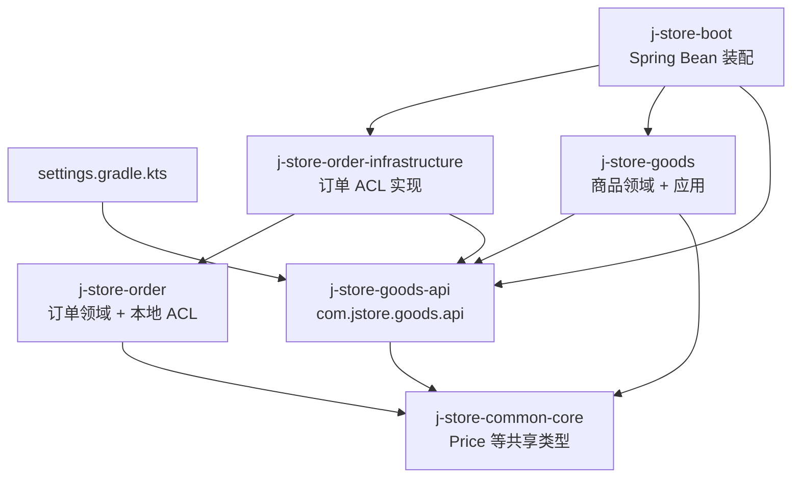
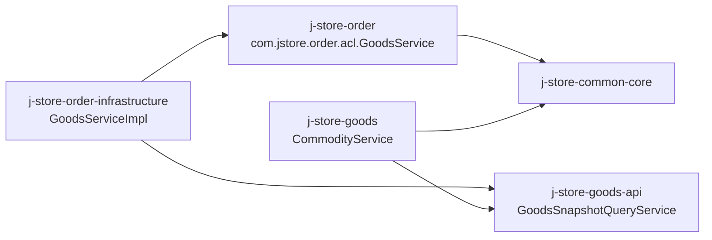
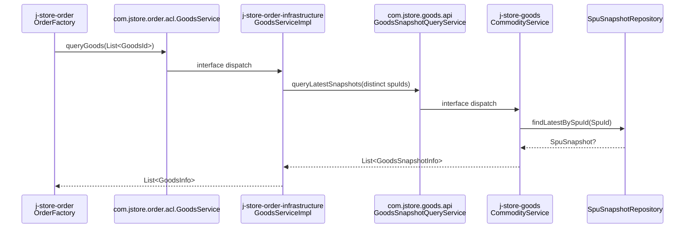
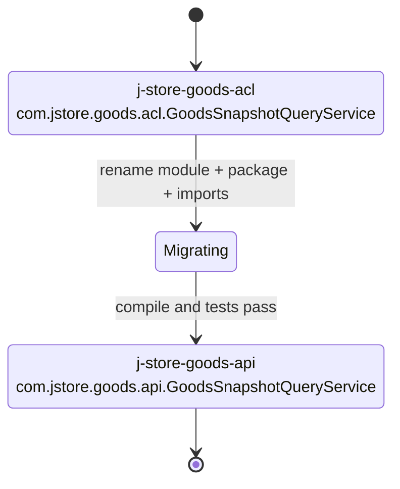
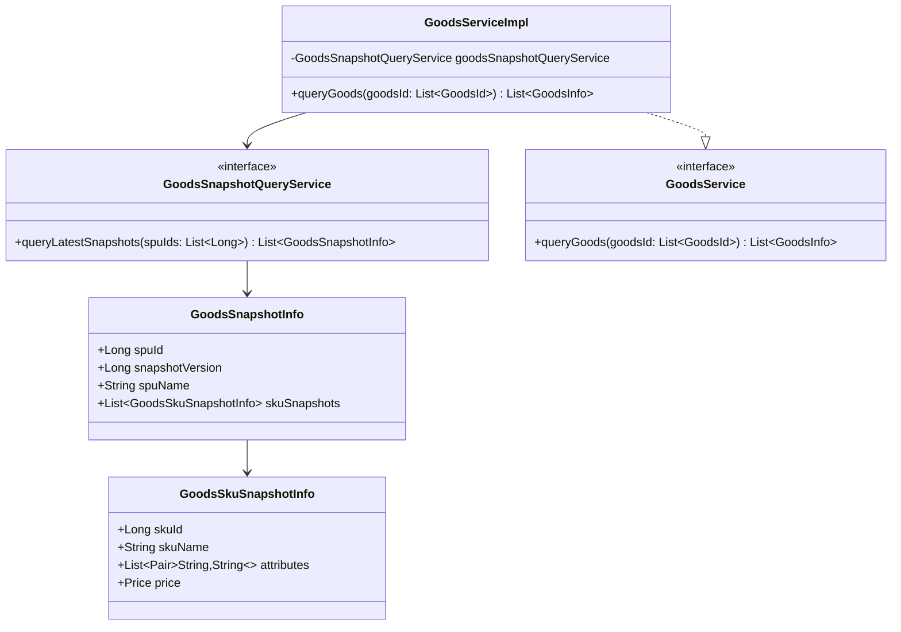
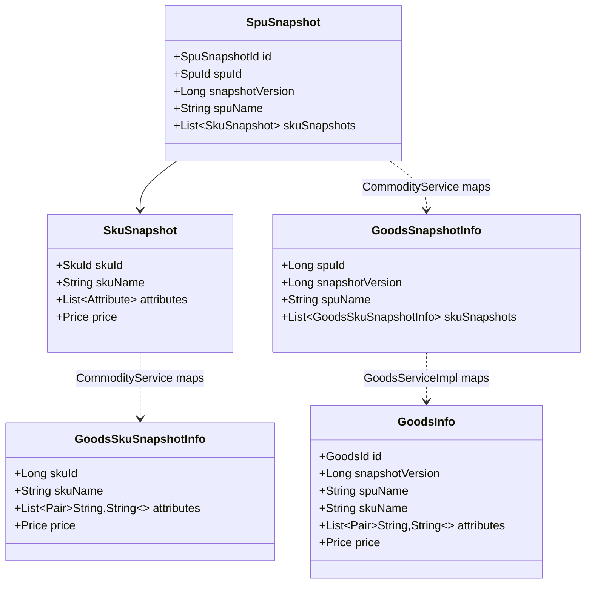
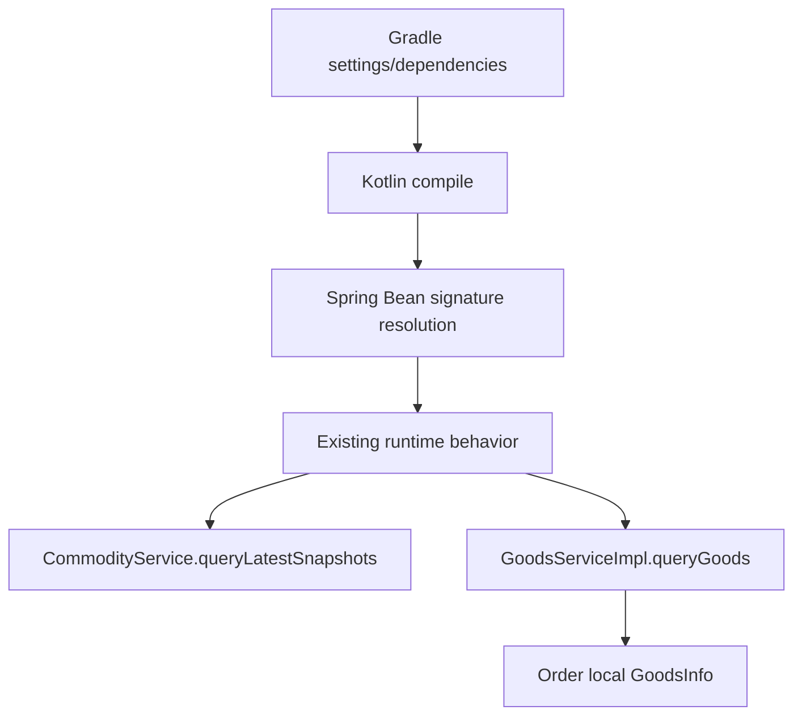

# 设计文档：goods-api-contract-rename

## 概述

本设计将商品 provider 侧快照查询契约从 `j-store-goods-acl` / `com.jstore.goods.acl` 迁移为 `j-store-goods-api` / `com.jstore.goods.api`，让模块名和包名表达“商品上下文发布 API 契约”，而不是消费方防腐层。设计遵循 `docs/steering/ddd-guidelines.md` 中的 bounded context、依赖方向与 ACL 规则：消费方 ACL 保留在消费方领域模块，provider 侧发布契约作为独立 api 模块被商品应用层实现，并被订单基础设施层适配。

本变更只覆盖 `GoodsSnapshotQueryService`、`GoodsSnapshotInfo`、`GoodsSkuSnapshotInfo` 这一组商品快照查询契约及其构建引用，不改变订单领域建模、不迁移 `com.jstore.order.acl.GoodsService`，也不新增远程调用协议或商品查询能力。

### 设计决策

| 决策 | 选择 | 理由 |
|------|------|------|
| provider 侧契约模块命名 | 将 `j-store-goods-acl` 目录和 Gradle include 改为 `j-store-goods-api` | `acl` 在项目 DDD 约定中表示消费方本地防腐层，provider 发布契约使用 `api` 更准确 |
| provider 侧契约包名 | 将 `com.jstore.goods.acl` 中的快照查询契约迁移到 `com.jstore.goods.api` | 避免与订单上下文的 `com.jstore.order.acl.GoodsService` 混淆 |
| 订单领域依赖方向 | `j-store-order` 不依赖 `j-store-goods-api`，继续只依赖本地 `com.jstore.order.acl.GoodsService` | 保持订单领域模型与外部商品发布语言解耦 |
| 订单基础设施适配方式 | `j-store-order-infrastructure` 依赖 `j-store-goods-api`，`GoodsServiceImpl` 将 goods api DTO 转换为订单本地 ACL DTO | 符合“ACL 接口在消费方领域模块，实现在基础设施模块”的约定 |
| 商品发布实现位置 | `j-store-goods` 依赖 `j-store-goods-api`，`CommodityService` 实现 `GoodsSnapshotQueryService` | 商品应用服务已经拥有快照仓储依赖和查询实现，迁移只改契约命名不改行为 |
| 非目标 `acl` 包处理 | 不迁移 `j-store-goods/src/main/kotlin/com/jstore/goods/acl/event` 和 `OssService` | 需求只要求 provider 侧快照查询契约迁移，其他 `acl` 命名需要独立需求确认 |
| 兼容策略 | 不保留 `j-store-goods-acl` alias 模块，不保留 `com.jstore.goods.acl` 快照契约桥接类 | 需求要求旧模块不再作为依赖入口，旧包不再承载 provider 快照契约 |

## 架构



目标依赖方向：



关键调用流程：



契约迁移状态：



快照 DTO 关系：



目标目录与包结构：

```text
settings.gradle.kts
  include("j-store-goods-api")

j-store-goods-api/
  build.gradle.kts
  src/main/kotlin/com/jstore/goods/api/
    GoodsSnapshotQueryService.kt

j-store-goods/
  build.gradle.kts
  src/main/kotlin/com/jstore/goods/service/
    CommodityService.kt
  src/test/kotlin/com/jstore/goods/service/
    CommodityServiceGoodsSnapshotQueryTest.kt

j-store-order/
  src/main/kotlin/com/jstore/order/acl/
    GoodsService.kt

j-store-order-infrastructure/
  build.gradle.kts
  src/main/kotlin/com/jstore/order/acl/
    GoodsServiceImpl.kt
  src/test/kotlin/com/jstore/order/acl/
    GoodsServiceImplTest.kt

j-store-boot/
  src/main/kotlin/com/jstore/order/config/
    OrderBootConfiguration.kt
```

## 组件与接口

### 1. Goods API Gradle 模块 - 商品 provider 发布契约模块

- 位置: `j-store-goods-api` / Gradle project `:j-store-goods-api`
- 职责: 承载商品上下文对外发布的稳定快照查询契约，不包含商品领域实现、Spring Bean、JPA 或消费方 ACL 类型。

```kotlin
// j-store-goods-api/build.gradle.kts
plugins {
    alias(libs.plugins.kotlin.jvm)
}

repositories {
    mavenCentral()
}

dependencies {
    api(libs.kotlin.stdlib)
    api(project(":j-store-common-core"))
}

tasks.withType<Test> {
    useJUnitPlatform()
}

kotlin {
    jvmToolchain(21)
}
```

生成阶段需要将原 `j-store-goods-acl/build.gradle.kts` 的内容迁移到新目录，并保证下游依赖引用 `project(":j-store-goods-api")`。

### 2. Settings 模块注册 - Gradle include 入口

- 位置: `settings.gradle.kts`
- 职责: 注册新模块名，移除旧模块名入口。

```kotlin
// settings.gradle.kts
include("j-store-goods-api")
```

迁移后不得保留 `include("j-store-goods-acl")`，否则会让旧模块继续作为项目依赖入口存在。

### 3. GoodsSnapshotQueryService - 商品快照查询发布契约

- 位置: `j-store-goods-api` / `src/main/kotlin/com/jstore/goods/api/GoodsSnapshotQueryService.kt`
- 职责: 定义商品上下文对其他上下文发布的快照查询端口和 DTO，字段语义保持不变。

```kotlin
// package com.jstore.goods.api
package com.jstore.goods.api

import com.jstore.common.properties.Price

interface GoodsSnapshotQueryService {
    fun queryLatestSnapshots(spuIds: List<Long>): List<GoodsSnapshotInfo>
}

data class GoodsSnapshotInfo(
    val spuId: Long,
    val snapshotVersion: Long,
    val spuName: String,
    val skuSnapshots: List<GoodsSkuSnapshotInfo>,
)

data class GoodsSkuSnapshotInfo(
    val skuId: Long,
    val skuName: String,
    val attributes: List<Pair<String, String>>,
    val price: Price,
)
```

契约行为保持现状：输入是 SPU ID 列表，返回每个存在最新快照的 SPU 级快照；不存在快照的 SPU 不出现在返回列表中。此接口不返回 `Result`，因为当前契约语义没有定义业务失败分支。

### 4. Goods Application 依赖 - 商品应用实现发布契约

- 位置: `j-store-goods/build.gradle.kts`
- 职责: 让商品应用模块依赖新的 goods api 模块，并暴露给需要使用商品应用服务的上层模块。

```kotlin
// j-store-goods/build.gradle.kts
dependencies {
    implementation(libs.kotlin.stdlib)
    testImplementation(libs.kotlin.test)
    testImplementation(libs.kotest.runner.junit5)
    testImplementation(libs.kotest.assertions.core)
    testImplementation(libs.kotest.property)
    testImplementation(libs.mockito)
    testImplementation(libs.mockito.kotlin)
    api(project(":j-store-goods-api"))
    api(project(":j-store-common-core"))
}
```

### 5. CommodityService - 商品应用服务实现 Goods API 查询端口

- 位置: `j-store-goods` / `src/main/kotlin/com/jstore/goods/service/CommodityService.kt`
- 职责: 保持现有商品应用用例编排职责，同时实现 `com.jstore.goods.api.GoodsSnapshotQueryService`。

```kotlin
// package com.jstore.goods.service
package com.jstore.goods.service

import com.jstore.common.errors.BusinessError
import com.jstore.common.framework.event.DomainEventPublisher
import com.jstore.common.utils.Result
import com.jstore.goods.api.GoodsSnapshotInfo
import com.jstore.goods.api.GoodsSnapshotQueryService
import com.jstore.goods.api.GoodsSkuSnapshotInfo
import com.jstore.goods.domain.commodity.GoodsStyleFactory
import com.jstore.goods.domain.commodity.GoodsStyleRepository
import com.jstore.goods.domain.commodity.Spu
import com.jstore.goods.domain.commodity.SpuFactory
import com.jstore.goods.domain.commodity.SpuId
import com.jstore.goods.domain.commodity.SpuRepository
import com.jstore.goods.domain.commodity.comand.CommodityCreateCmd
import com.jstore.goods.domain.commodity.comand.GoodsStyleSaveCmd
import com.jstore.goods.domain.commodity.comand.SkuCreateCmd
import com.jstore.goods.domain.commodity.snapshot.SpuSnapshot
import com.jstore.goods.domain.commodity.snapshot.SpuSnapshotFactory
import com.jstore.goods.domain.commodity.snapshot.SpuSnapshotRepository

class CommodityService(
    private val spuFactory: SpuFactory,
    private val spuRepository: SpuRepository,
    private val domainEventPublisher: DomainEventPublisher,
    private val snapshotFactory: SpuSnapshotFactory,
    private val snapshotRepository: SpuSnapshotRepository,
    private val goodsStyleRepository: GoodsStyleRepository,
    private val goodsStyleFactory: GoodsStyleFactory,
) : GoodsSnapshotQueryService {
    fun createOrUpdate(cmd: CommodityCreateCmd): Result<Spu, BusinessError>
    fun addSku(cmd: SkuCreateCmd): Result<Spu, BusinessError>
    fun publish(spuId: SpuId): Result<Unit, BusinessError>
    fun putOnSale(spuId: SpuId): Result<SpuSnapshot, BusinessError>
    fun takeOffSale(spuId: SpuId): Result<Unit, BusinessError>
    override fun queryLatestSnapshots(spuIds: List<Long>): List<GoodsSnapshotInfo>
    fun getDraft(spuId: SpuId): Result<Spu, BusinessError>
    fun publishDraft(draftSpuId: SpuId): Result<SpuSnapshot, BusinessError>
    fun discardDraft(draftSpuId: SpuId): Result<Unit, BusinessError>
    fun saveGoodsStyle(cmd: GoodsStyleSaveCmd): Result<Unit, BusinessError>
}
```

生成阶段只需要替换 import 到 `com.jstore.goods.api.*`。`queryLatestSnapshots` 的映射逻辑保持现状：

```kotlin
override fun queryLatestSnapshots(spuIds: List<Long>): List<GoodsSnapshotInfo> {
    return spuIds.distinct()
        .mapNotNull { spuId ->
            snapshotRepository.findLatestBySpuId(SpuId(spuId))?.let { snapshot ->
                GoodsSnapshotInfo(
                    spuId = snapshot.spuId.value,
                    snapshotVersion = snapshot.snapshotVersion,
                    spuName = snapshot.spuName,
                    skuSnapshots = snapshot.skuSnapshots.map { skuSnapshot ->
                        GoodsSkuSnapshotInfo(
                            skuId = skuSnapshot.skuId.value,
                            skuName = skuSnapshot.skuName,
                            attributes = skuSnapshot.attributes.map { it.key to it.value },
                            price = skuSnapshot.price,
                        )
                    },
                )
            }
        }
}
```

### 6. Order GoodsService - 订单消费方本地 ACL 端口

- 位置: `j-store-order` / `src/main/kotlin/com/jstore/order/acl/GoodsService.kt`
- 职责: 表达订单上下文对商品能力的本地语言，不迁移、不改包名、不依赖 goods api。

```kotlin
// package com.jstore.order.acl
package com.jstore.order.acl

import com.jstore.common.properties.Price

interface GoodsService {
    fun queryGoods(goodsId: List<GoodsId>): List<GoodsInfo>
}

data class GoodsId(
    val spuId: Long,
    val skuId: Long,
)

data class GoodsInfo(
    val id: GoodsId,
    val snapshotVersion: Long,
    val spuName: String,
    val skuName: String,
    val attributes: List<Pair<String, String>>,
    val price: Price,
)
```

`j-store-order/build.gradle.kts` 不应新增 `project(":j-store-goods-api")` 依赖；订单领域中 `OrderFactory` 继续只 import `com.jstore.order.acl.GoodsService`。

### 7. Order Infrastructure 依赖 - 消费方 ACL 实现适配 Goods API

- 位置: `j-store-order-infrastructure/build.gradle.kts`
- 职责: 基础设施模块依赖订单领域和商品 API 契约，负责从 provider 发布语言到订单本地 ACL 语言的转换。

```kotlin
// j-store-order-infrastructure/build.gradle.kts
dependencies {
    implementation(libs.kotlin.stdlib)
    implementation(libs.kotlin.reflect)
    api(project(":j-store-order"))
    implementation(project(":j-store-goods-api"))

    implementation(platform(libs.spring.boot.dependencies))
    implementation(libs.spring.boot.starter.data.jpa)
    implementation(libs.spring.data.jpa)
    implementation(libs.spring.data.commons)
    implementation(libs.spring.data.redis)
    implementation(libs.spring.boot.starter.data.redis)
    implementation(libs.spring.boot.starter.web)
    implementation(libs.spring.boot.starter.webflux)
    testImplementation(libs.spring.boot.starter.test)
    runtimeOnly(libs.postgresql)
    testImplementation(libs.kotlin.test)
    testImplementation(libs.kotlin.test.junit5)
    testRuntimeOnly(libs.junit.platform.launcher)
    testImplementation(libs.kotest.runner.junit5)
    testImplementation(libs.kotest.assertions.core)
    testImplementation(libs.kotest.property)
    implementation(libs.commons.lang3)
    compileOnly(libs.lombok)
    annotationProcessor(libs.lombok)
    testCompileOnly(libs.lombok)
    testAnnotationProcessor(libs.lombok)
}
```

### 8. GoodsServiceImpl - 订单 ACL 的基础设施适配器

- 位置: `j-store-order-infrastructure` / `src/main/kotlin/com/jstore/order/acl/GoodsServiceImpl.kt`
- 职责: 实现订单本地 `GoodsService`，调用 `GoodsSnapshotQueryService` 并映射为订单本地 `GoodsInfo`。

```kotlin
// package com.jstore.order.acl
package com.jstore.order.acl

import com.jstore.goods.api.GoodsSnapshotQueryService

class GoodsServiceImpl(
    private val goodsSnapshotQueryService: GoodsSnapshotQueryService,
) : GoodsService {
    override fun queryGoods(goodsId: List<GoodsId>): List<GoodsInfo>
}
```

实现逻辑保持现状：

- 对输入 `goodsId` 提取去重后的 `spuId` 列表。
- 调用 `goodsSnapshotQueryService.queryLatestSnapshots(spuIds)`。
- 按 `spuId` 定位 `GoodsSnapshotInfo`，按 `skuId` 定位 `GoodsSkuSnapshotInfo`。
- 只返回能同时匹配 SPU 快照和 SKU 快照的订单本地 `GoodsInfo`。
- 不把 `GoodsSnapshotInfo` 或 `GoodsSkuSnapshotInfo` 暴露给订单领域模块。

### 9. OrderBootConfiguration - 启动装配引用新契约

- 位置: `j-store-boot` / `src/main/kotlin/com/jstore/order/config/OrderBootConfiguration.kt`
- 职责: 通过 Spring Bean 装配把商品发布查询端口注入订单 ACL 实现。

```kotlin
// package com.jstore.com.jstore.order.config
package com.jstore.com.jstore.order.config

import com.jstore.goods.api.GoodsSnapshotQueryService
import com.jstore.order.acl.GoodsService
import com.jstore.order.acl.GoodsServiceImpl
import org.springframework.context.annotation.Bean
import org.springframework.context.annotation.Configuration

@Configuration
class OrderBootConfiguration {
    @Bean
    fun goodsService(
        goodsSnapshotQueryService: GoodsSnapshotQueryService,
    ): GoodsService {
        return GoodsServiceImpl(goodsSnapshotQueryService)
    }
}
```

该文件现有 package 为 `com.jstore.com.jstore.order.config`，本设计不修正这个既有命名问题，避免扩大范围。

### 10. Provider 契约引用迁移清单 - 生产与测试源码

- 位置: 多模块源码与测试
- 职责: 所有 provider 快照契约引用统一改为 `com.jstore.goods.api`。

```text
必须迁移的引用：
- j-store-goods/src/main/kotlin/com/jstore/goods/service/CommodityService.kt
- j-store-goods/src/test/kotlin/com/jstore/goods/service/CommodityServiceGoodsSnapshotQueryTest.kt
- j-store-order-infrastructure/src/main/kotlin/com/jstore/order/acl/GoodsServiceImpl.kt
- j-store-order-infrastructure/src/test/kotlin/com/jstore/order/acl/GoodsServiceImplTest.kt
- j-store-boot/src/main/kotlin/com/jstore/order/config/OrderBootConfiguration.kt

必须迁移的 Gradle 引用：
- settings.gradle.kts
- j-store-goods/build.gradle.kts
- j-store-order-infrastructure/build.gradle.kts

不得作为本需求附带迁移的引用：
- j-store-goods/src/main/kotlin/com/jstore/goods/acl/OssService.kt
- j-store-goods/src/main/kotlin/com/jstore/goods/acl/event/*.kt
- j-store-goods/src/main/kotlin/com/jstore/goods/service/Inventory*EventHandler.kt 对 acl.event 的引用
- j-store-boot/src/main/kotlin/com/jstore/translator/OrderToStockEventTranslator.kt 对 acl.event 的引用
```

## 数据模型

### 领域模型

本需求不新增领域实体、值对象或聚合；只迁移 provider 快照 DTO 所属模块和包名。商品领域快照模型继续由 `j-store-goods` 内部的 `SpuSnapshot` / `SkuSnapshot` 表达，订单领域继续由 `GoodsId` / `GoodsInfo` 表达消费方本地语言。



| 模型 | 所属模块 | 类型 | 字段 |
|------|----------|------|------|
| `GoodsSnapshotInfo` | `j-store-goods-api` | provider API DTO | `spuId: Long`, `snapshotVersion: Long`, `spuName: String`, `skuSnapshots: List<GoodsSkuSnapshotInfo>` |
| `GoodsSkuSnapshotInfo` | `j-store-goods-api` | provider API DTO | `skuId: Long`, `skuName: String`, `attributes: List<Pair<String, String>>`, `price: Price` |
| `GoodsId` | `j-store-order` | 订单本地 ACL DTO | `spuId: Long`, `skuId: Long` |
| `GoodsInfo` | `j-store-order` | 订单本地 ACL DTO | `id`, `snapshotVersion`, `spuName`, `skuName`, `attributes`, `price` |

### 持久化模型

本需求不新增、删除或修改数据库表、索引、JPA PO、Repository 接口或 Repository 实现。无 SQL DDL 变更。

```sql
-- No DDL changes.
-- Goods snapshot persistence remains owned by j-store-goods / j-store-goods-infrastructure.
```

### 配置属性

本需求不新增配置属性。

| 配置 key | 类型 | 默认值 | 描述 |
|----------|------|--------|------|
| 无 | 无 | 无 | 仅进行 Gradle 模块名、Kotlin 包名和 import 迁移 |

### 数据格式示例

provider API DTO 的数据结构保持不变，仅包名变化：

```json
{
  "spuId": 1001,
  "snapshotVersion": 7,
  "spuName": "Phone",
  "skuSnapshots": [
    {
      "skuId": 2001,
      "skuName": "Black 128G",
      "attributes": [
        ["color", "black"],
        ["storage", "128G"]
      ],
      "price": {
        "fen": 399900
      }
    }
  ]
}
```

无 Redis key、TTL 或外部传输格式变更。

## 正确性属性

### Property 1: 新 goods api 模块是唯一 provider 快照契约入口
*For any* Gradle production or test dependency declaration after migration, if it references the goods provider snapshot contract module, then the referenced project path must be `:j-store-goods-api`, and no declaration may reference `:j-store-goods-acl`.
**验证需求：需求 1.1, 需求 1.2, 需求 1.3**

### Property 2: provider 快照契约只存在于 goods api 包
*For any* Kotlin production or test source file after migration, if it declares or imports `GoodsSnapshotQueryService`, `GoodsSnapshotInfo`, or `GoodsSkuSnapshotInfo` as provider side goods snapshot query contracts, then the package must be `com.jstore.goods.api`, and `com.jstore.goods.acl` must not contain these declarations.
**验证需求：需求 2.1, 需求 2.2, 需求 2.3, 需求 6.1, 需求 6.2**

### Property 3: 订单本地 ACL 端口保持稳定
*For any* order domain source after migration, the local goods capability port used by order domain code must remain `com.jstore.order.acl.GoodsService`, and this interface must not be renamed, moved to goods context, or replaced by `com.jstore.goods.api.GoodsSnapshotQueryService`.
**验证需求：需求 3.1, 需求 3.2, 需求 3.3, 需求 4.2**

### Property 4: 订单领域不直接依赖商品发布 API
*For any* source set and Gradle dependency of `j-store-order`, no import or project dependency may point to `com.jstore.goods.api` or `:j-store-goods-api`; only `j-store-order-infrastructure` may adapt goods api contracts for the order context.
**验证需求：需求 4.1, 需求 4.2, 需求 4.3**

### Property 5: 订单基础设施完成 provider DTO 到本地 ACL DTO 的转换
*For any* input list of `GoodsId` passed to `GoodsServiceImpl.queryGoods`, if goods api returns matching SPU snapshots and SKU snapshots, the result must contain order-local `GoodsInfo` values with identical snapshot version, names, attributes, and price, and no goods api DTO type may escape through the `GoodsService` interface.
**验证需求：需求 4.3, 需求 4.4**

### Property 6: 商品应用实现发布契约且不反向依赖订单
*For any* goods application source after migration, `CommodityService` may implement `com.jstore.goods.api.GoodsSnapshotQueryService`, while goods domain packages under `com.jstore.goods.domain` must not import `com.jstore.order.*`, `com.jstore.order.acl.GoodsService`, or consumer side ACL packages from other bounded contexts.
**验证需求：需求 5.1, 需求 5.2, 需求 5.3**

### Property 7: 快照查询行为保持等价
*For any* list of SPU IDs and any set of latest `SpuSnapshot` records available from `SpuSnapshotRepository`, `CommodityService.queryLatestSnapshots` after migration must return the same `GoodsSnapshotInfo` and `GoodsSkuSnapshotInfo` field values as before migration, ignoring only the Kotlin package name.
**验证需求：需求 1.3, 需求 5.4**

### Property 8: 构建、装配和相关测试通过
*For any* clean checkout after migration, Gradle compilation and relevant goods/order tests must resolve the renamed module, compile imports from `com.jstore.goods.api`, and complete without unresolved project, unresolved import, or Spring bean signature regressions caused by the rename.
**验证需求：需求 6.1, 需求 6.2, 需求 6.3, 需求 6.4**

## 错误处理

### 错误常量定义

本需求不新增业务错误常量。`GoodsSnapshotQueryService.queryLatestSnapshots` 现有契约返回 `List<GoodsSnapshotInfo>`，对“SPU 无快照”或“SKU 不匹配”的处理是过滤缺失项而不是返回业务错误。迁移过程中的失败主要是构建期或装配期错误。

```kotlin
// No new BusinessError constants for goods-api-contract-rename.
// Existing CommodityErrors, StorageErrors, OrderErrors remain unchanged.
```

| errorCode | httpCode | 触发场景 |
|-----------|----------|----------|
| 无 | 无 | 本需求无新增运行期业务错误 |

### 错误场景与处理策略

| 场景 | 错误码 | HTTP 状态码 | 处理方式 |
|------|--------|-------------|----------|
| `settings.gradle.kts` 未 include `j-store-goods-api` | 无 | 无 | 编译期失败，修正 include |
| 生产或测试 Gradle 依赖仍引用 `:j-store-goods-acl` | 无 | 无 | 依赖解析失败或违反架构属性，替换为 `:j-store-goods-api` |
| 源码仍 import `com.jstore.goods.acl.GoodsSnapshotQueryService` | 无 | 无 | Kotlin 编译失败或属性检查失败，替换为 `com.jstore.goods.api.GoodsSnapshotQueryService` |
| `j-store-order` 直接依赖或 import goods api | 无 | 无 | DDD 边界违规，移除依赖并通过 `GoodsService` 本地端口访问 |
| `GoodsServiceImpl` 暴露 goods api DTO 给订单领域 | 无 | 无 | ACL 适配违规，保持返回 `com.jstore.order.acl.GoodsInfo` |
| `CommodityService` 未实现新的 goods api 接口 | 无 | 无 | Bean 装配或编译失败，改为实现 `com.jstore.goods.api.GoodsSnapshotQueryService` |
| 误迁移 `com.jstore.goods.acl.event` 库存事件 | 无 | 无 | 范围扩大风险，回退无关迁移并保留事件包现状 |

### 错误传播策略



- 构建配置错误在 Gradle 配置或编译阶段快速失败，不转换为业务错误。
- import 和包名错误在 Kotlin 编译阶段失败，不转换为业务错误。
- Spring 装配错误在应用启动阶段快速失败，不转换为业务错误。
- 运行期查询行为沿用现状：`CommodityService` 对缺失快照返回空缺项，`GoodsServiceImpl` 对缺失 SPU/SKU 过滤不匹配的 `GoodsId`。
- 订单领域仍通过 `GoodsService` 使用本地 DTO，不感知 goods api DTO 或 provider 包名。

### 错误处理原则

- 业务错误继续使用 `Result<T, BusinessError>` 和既有错误对象；本迁移不新增业务失败分支。
- 编程错误和构建错误通过编译、测试、架构扫描和启动失败快速暴露。
- provider 发布契约不处理消费方语义错误；消费方语义转换集中在 `j-store-order-infrastructure`。
- 不为旧 `com.jstore.goods.acl` 快照契约添加兼容桥接，避免旧语义继续扩散。
- 迁移验证必须覆盖生产源码、测试源码和 Gradle 依赖，不能只依赖 IDE 自动重命名。

## 测试策略

### 属性测试（Property-Based Testing）

使用仓库已有 Kotest 版本 `5.9.1`，依赖 `io.kotest:kotest-property`。新增或调整属性测试时，每个 property 最少执行 100 次迭代；测试文件内使用以下追踪注释格式：

```kotlin
// Feature: goods-api-contract-rename, Property <N>: <title>
```

自定义生成器：

| 生成器 | 描述 |
|--------|------|
| `Arb.goodsIdList()` | 生成包含重复 SPU、重复 SKU、缺失 SKU 和多 SPU 的 `List<GoodsId>` |
| `Arb.goodsSnapshotInfoList()` | 生成与部分 `GoodsId` 匹配的 `List<GoodsSnapshotInfo>`，用于验证订单 ACL 适配过滤与映射 |
| `Arb.spuIdList()` | 生成包含重复 ID、空列表和不存在 ID 的 `List<Long>`，用于验证 `CommodityService.queryLatestSnapshots` 去重和缺失过滤 |

属性测试映射：

| Property | 测试文件 | 模块 |
|----------|----------|------|
| Property 1 | `j-store-goods-api/build.gradle.kts` 与 `settings.gradle.kts` 静态扫描测试或验证任务 | root |
| Property 2 | `j-store-goods/src/test/kotlin/com/jstore/goods/service/CommodityServiceGoodsSnapshotQueryTest.kt` 加静态扫描断言 | `j-store-goods` |
| Property 3 | `j-store-order/src/test/kotlin/com/jstore/order/domain/order/*PropertyTest.kt` 现有订单领域属性测试保持通过 | `j-store-order` |
| Property 4 | 新增 `j-store-order/src/test/kotlin/com/jstore/order/acl/OrderGoodsApiDependencyBoundaryTest.kt` 或使用 `rg` 验证 | `j-store-order` |
| Property 5 | `j-store-order-infrastructure/src/test/kotlin/com/jstore/order/acl/GoodsServiceImplTest.kt` | `j-store-order-infrastructure` |
| Property 6 | 新增静态扫描验证 `j-store-goods/src/main/kotlin/com/jstore/goods/domain` 不 import `com.jstore.order` | `j-store-goods` |
| Property 7 | `j-store-goods/src/test/kotlin/com/jstore/goods/service/CommodityServiceGoodsSnapshotQueryTest.kt` | `j-store-goods` |
| Property 8 | Gradle 编译与相关测试命令 | root |

属性测试重点不在包名字符串本身，而在迁移后行为等价和依赖边界稳定。若不新增专门的静态扫描测试，也必须在任务中用 `rg` 命令作为验证步骤覆盖 Property 1、2、4、6。

### 单元测试（Example-Based）

| 测试场景 | 对应需求 |
|----------|----------|
| `CommodityServiceGoodsSnapshotQueryTest` 中快照领域模型映射为 `com.jstore.goods.api.GoodsSnapshotInfo` | 需求 2.1, 需求 5.1, 需求 5.4 |
| `GoodsServiceImplTest` 中 goods api DTO 映射为订单本地 `GoodsInfo`，并保持重复输入结果语义 | 需求 4.3, 需求 4.4 |
| 订单领域现有 `OrderFactory*Test` 仍只 mock 或使用 `com.jstore.order.acl.GoodsService` | 需求 3.1, 需求 3.2, 需求 4.2 |
| 静态扫描确认 `j-store-goods-acl` 不再出现在 Gradle dependency declaration | 需求 1.2 |
| 静态扫描确认快照契约源码不再声明于 `com.jstore.goods.acl` | 需求 2.2 |
| 静态扫描确认 `j-store-order` 无 `com.jstore.goods.api` import | 需求 4.1 |

建议验证命令：

```bash
./gradlew --no-daemon :j-store-goods:test :j-store-order:test :j-store-order-infrastructure:test
rg -n 'project\\(":j-store-goods-acl"\\)|include\\("j-store-goods-acl"\\)' --glob '*.kts'
rg -n 'com\\.jstore\\.goods\\.acl\\.(GoodsSnapshotQueryService|GoodsSnapshotInfo|GoodsSkuSnapshotInfo)|package com\\.jstore\\.goods\\.acl$' --glob '*.kt'
rg -n 'com\\.jstore\\.goods\\.api|j-store-goods-api' j-store-order/src/main j-store-order/build.gradle.kts
```

### 集成测试

| 测试场景 | 对应需求 |
|----------|----------|
| `./gradlew --no-daemon :j-store-goods:compileKotlin :j-store-order-infrastructure:compileKotlin :j-store-boot:compileKotlin` 成功 | 需求 1.3, 需求 6.1, 需求 6.3 |
| `./gradlew --no-daemon :j-store-goods:test :j-store-order-infrastructure:test` 成功 | 需求 6.2, 需求 6.4 |
| 根项目依赖解析能找到 `:j-store-goods-api`，且没有 unresolved project `:j-store-goods-acl` | 需求 1.1, 需求 1.2 |
| Spring 装配层 `OrderBootConfiguration.goodsService(GoodsSnapshotQueryService)` 使用 `com.jstore.goods.api` 类型编译通过 | 需求 6.1 |
| 订单基础设施模块依赖 `j-store-goods-api`，订单领域模块不依赖该模块 | 需求 4.1, 需求 4.3 |

主要风险与验证关注：

| 风险 | 影响 | 缓解 |
|------|------|------|
| 目录重命名后 Gradle 缓存或旧 build 输出残留 | 误判旧模块仍可用 | 以源码和 settings 为准，必要时运行 clean 编译 |
| 全局替换误改 `com.jstore.order.acl.GoodsService` | 破坏订单本地 ACL 语义 | 使用限定的 import 替换，只替换 goods 快照契约 |
| 全局替换误迁移 `com.jstore.goods.acl.event` | 扩大需求范围，影响库存事件翻译 | 设计明确排除，静态扫描时区分快照契约与 `acl.event` |
| `j-store-order` 被加入 goods api 依赖 | DDD 边界违规 | 用 Gradle 文件和源码 import 扫描验证 |
| 测试只改生产源码未改测试 import | 测试编译失败 | 覆盖 `src/test` 下所有 provider 快照契约引用 |
