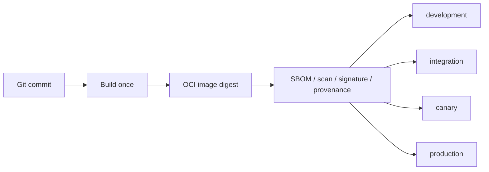

# 不可变制品与多集群交付设计

## 交付模型



构建和晋级是两个独立职责。构建阶段只产生候选制品和证据；部署阶段只接收完整 digest，
通过目标集群隧道把同一 manifest 复制到目标 registry 并应用环境 overlay。

## 仓库结构

```text
deploy/kubernetes/application/
  base/                    # 环境无关应用资源
  overlays/
    development/
    integration/
    canary/
    production/
scripts/
  render-kubernetes-application.sh
  deploy-kubernetes-application.sh
```

base 使用逻辑镜像名 `j-store/application`。渲染脚本在临时 Kustomize 工作区中以经过严格
校验的 `repository@sha256:digest` 替换该名称；不修改已检出的仓库文件。

## 环境策略

| 环境 | 副本与发布 | 配置目的 |
|---|---|---|
| development | 单副本 RollingUpdate | 快速开发验证 |
| integration | 单副本 RollingUpdate | 集成和自动化验收 |
| canary | 至少双副本、PDB、拓扑分散 | production-like 与受控真实流量 |
| production | 至少双副本、PDB、`maxUnavailable: 0` | 正式发布与回滚 |

四个环境使用相同 namespace `jstore`，因为它们位于不同物理集群。环境身份通过稳定标签和
运行时变量表达，不通过分支、镜像 tag 或 namespace 名表达。

## CI/CD 接口

部署 Job 提供：

```text
TARGET_CONTEXT
EXPECTED_CLUSTER_UID
ENVIRONMENT
IMAGE_REF                 # repository@sha256:digest
NAMESPACE                 # 固定为 jstore
```

隧道建立、registry 登录、OCI manifest 复制、签名验证和人工审批属于 CI/CD 配置。仓库脚本
负责输入校验、确定性渲染、目标身份预检、server-side dry-run、apply、rollout 和健康验证。

## 安全边界

- 脚本比较显式 context 与当前 context，并读取 `kube-system` namespace UID 作为 cluster UID。
- 镜像必须使用 digest；tag 可以作为可读前缀，但不能代替 digest。
- `jstore-runtime` Secret 只通过 `envFrom` 引用。部署脚本只验证 Secret 对象存在，不读取数据。
- `jstore` namespace 和入口控制器由平台预置；入口 namespace 通过统一的
  `jstore.network/ingress-access=true` 标签获得应用端口访问权。
- 生产写入和灰度流量切换仍由 CI/CD 环境审批控制，仓库脚本不得绕过。
- registry 镜像复制必须保持 manifest digest；若代理改变 manifest，候选不得晋级。

## 迁移与恢复

现有 PVC/JAR 开发部署不是生产兼容层。新 OCI 路径通过独立 overlay 落地并成为权威入口后，
删除无引用的旧 `j-store-boot/k8s-deployment.yaml` 和 PVC/JAR 通用部署清单。回滚始终使用上一
候选 digest；数据库和 Secret 生命周期不由应用回滚处理。

## 验证

- 治理测试解析四个 overlay，验证镜像、profile、发布策略、安全上下文、PDB 和无 PVC/JAR。
- 脚本测试覆盖 tag-only、错误 context、错误 cluster UID、非法环境和合法 digest 渲染。
- `kubectl kustomize` 对所有环境成功，渲染结果不存在 `latest`、公共代理或 Secret 数据。
- 在具备 registry 与隧道的集成环境中补充 build/copy/signature/rollout/rollback 端到端证据。
