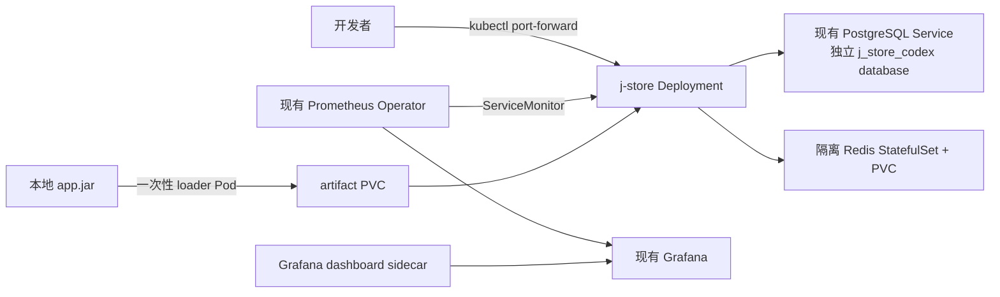

# J-Store Kubernetes 开发部署设计

> 历史说明：本设计记录无 registry 时的开发验证方案。当前权威交付设计见
> [`immutable-multi-cluster-delivery`](../immutable-multi-cluster-delivery/design.md)，正式应用部署
> 不再使用 PVC/JAR。

## 拓扑

## 关键决策

- 当前仓库的 `j-store-boot` 组合所有上下文，因此本次先部署一个单体实例；不伪造尚未完成的多服务镜像与服务发现拓扑。
- 目标集群没有可用 registry，SSH 用户也不能导入 containerd。开发部署使用一次性 loader 将已通过 Gradle 构建的 JAR 流式写入 PVC，应用 Pod 使用固定的 Amazon Corretto 25 基础镜像。生产必须替换为不可变、签名且经过扫描的应用镜像。
- PostgreSQL 使用新 database `j_store_codex` 与 role `jstore_app`。脚本只创建/轮换该 role，不删除或改写已有 `j_store`。
- 共享 Redis Service 当前没有可响应的后端。为避免修改共享 namespace，本部署创建带密码和 AOF 的单副本 Redis；应用通过同 namespace Service 使用它。
- Prometheus CR 的 ServiceMonitor namespace/label selector 均为空选择器，能发现 `jstore` namespace 的 ServiceMonitor。Grafana dashboard sidecar 监听所有 namespace 中 `grafana_dashboard=1` 的 ConfigMap，因此只需新增 dashboard，不修改 Helm 管理对象。
- 应用 Dashboard 直接复用 Micrometer、Tomcat MBean、kubelet/cAdvisor 与 kube-state-metrics 指标。接口查询使用 MVC 模板化 `uri` 与 method，排除 `/actuator.*`；Pod 查询显式限定 application container，避免把 pause container 或 Pod 汇总序列重复计入。
- 默认 ClusterIP 与 port-forward。NetworkPolicy 描述预期最小流量，但远程 Flannel 环境不能提供执行保证。
