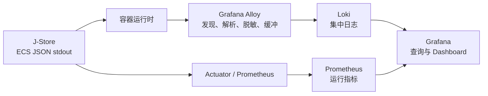

# 可观测性基础建设设计

## 设计原则

1. 应用只负责产生安全、结构化且带上下文的日志；采集、缓冲、路由和后端凭据属于基础设施职责。
2. 先建立日志字段与隐私契约，再扩大采集范围，避免把当前原始载荷风险复制到集中后端。
3. 应用日志契约保持后端中立；本地参考栈选择 Grafana 生态不构成生产后端绑定。
4. Trace、请求关联和业务 Saga 关联是不同维度，必须分别建模并允许联合查询。
5. 第一阶段优先形成可重复验证的纵向闭环，不提前承诺生产容量和高可用拓扑。

## 目标架构

生产部署可将 Alloy 替换为 Fluent Bit 或 OpenTelemetry Collector，将 Loki 替换为 Elastic/OpenSearch 或托管服务；应用侧字段和安全契约不随之变化。

## 决策一：安全且结构化的应用输出

- 使用 Spring Boot 3.5 原生 ECS 控制台 JSON，生产和可观测性 profile 禁用彩色文本输出。
- `service.name`、版本和环境由配置注入，不在业务代码中硬编码。
- 公共稳定字段采用以下语义：

| 字段 | 含义 | 索引建议 |
|---|---|---|
| `service.name`、`service.version`、`service.environment` | 可部署单元及运行环境 | 低基数标签/资源属性 |
| `event.name`、`event.outcome` | 稳定事件类型与结果 | 结构化字段；有界值可成为标签 |
| `trace_id`、`span_id` | 技术调用链 | 结构化字段，不作 Loki 标签 |
| `correlation_id` | 请求或业务流程关联 | 结构化字段，不作 Loki 标签 |
| `message_id`、`causation_id`、`transport_id` | 集成消息边界 | 结构化字段；仅 `transport_id` 可作标签 |
| `order_id`、`job_id` 等业务标识 | 定位受影响对象 | 结构化字段，不作 Loki 标签 |
| `error.type`、`error.code` | 稳定错误分类 | 结构化字段；有界类型可作标签 |

- 保留现有 SLF4J/Logback；公共日志抽象后续演进时应支持类型化键值，但第一迭代不要求一次性迁移全部调用点。
- 死代码审计确认旧 `TimerJob` 垂直切片没有业务调用方后，整体删除其 Controller、handler、调度/JPA/Redis 实现、表定义、Lua 与压测 SQL。当前处于内部开发期且没有需保留的生产数据，基线迁移与初始化快照直接收敛到目标结构，开发环境按需重建。异常日志仍可记录堆栈，但不得附带原始请求体或任务载荷。

## 决策二：关联上下文

### HTTP

- 入口过滤器读取受控请求头；只接受有限长度的可打印安全字符，否则生成新的 UUID。
- `correlation_id` 放入 MDC/观测上下文并写回响应头，通过 `try/finally` 清理。
- 下游异常尚未进入 Servlet 错误分派时，访问日志使用有效 500 状态、`failure` 结果和受控 `error.type`；为避免异常消息携带手机号、凭据或载荷，只记录异常类型与栈帧组成的 `error.stack_trace`，不把原始 Throwable 或消息交给日志编码器，同时保持原异常继续传播。
- Micrometer Tracing/OpenTelemetry 负责 `trace_id`、`span_id` 和 W3C `traceparent`，不手写追踪协议。
- HTTP 客户端注入 Spring 管理的 `RestClient.Builder`、`WebClient.Builder` 或同等自动配置 Builder，禁止在适配器中直接静态创建导致传播失效的客户端。

### 集成消息

- 完整消费边界外围建立消息日志作用域，将 `messageId`、`correlationId`、`causationId` 和 `transportId` 注入上下文；作用域覆盖 handler 数量校验、有序消费检查、幂等 claim 和 handler 执行。
- 作用域关闭必须清理所有字段；测试以同线程连续消费两条不同消息验证无串扰。
- 现有 `correlationId = orderId` 保持业务 Saga 语义。若消息由入口请求触发，Trace Context 通过消息 header/transport metadata 的方案留到 Broker 适配器设计，不把 Trace ID覆盖到业务 correlation ID。

## 决策三：本地参考栈

- 新增独立 Compose 覆盖文件，只在显式启用时启动 Alloy、Loki、Prometheus 和 Grafana；所有发布到主机的本地端口默认只绑定 `127.0.0.1`。
- Alloy 从容器运行时发现并读取应用日志，解析逐行 JSON，补充容器元数据；未来 Kubernetes 部署使用节点级 DaemonSet，而非每个应用 Pod 的采集 Sidecar。
- 采集配置必须启用位置记录和有限文件系统缓冲，并暴露采集成功、重试、解析失败、积压和丢弃信号。
- Loki 只索引低基数字段。高基数字段保留在日志正文或 structured metadata 中。
- Grafana 通过 provisioning 配置 Loki、Prometheus 数据源和最小 Dashboard，不依赖人工点击配置。
- 本地存储使用命名卷并提供明确清理命令；默认保留期应短且可配置，避免开发机磁盘无限增长。
- Smoke test 的端口和 Grafana 凭据按照进程环境变量、仓库 `.env`、默认值的优先级解析，与 Compose 的可配置入口保持一致。

## 决策四：现有 Outbox 可观测性接入

- 根应用引入 Actuator 和 Prometheus registry，使已有 `MicrometerOutboxMonitor` 获得真实 `MeterRegistry`。
- 只暴露 `health`、`prometheus` 等批准端点；管理端口或网络边界、认证策略在实施时按部署环境配置。
- 复用现有 `jstore.outbox.*` 指标和健康阈值，不在日志栈中重新计算另一套 Outbox 真相。
- Dashboard 至少展示 oldest-ready lag、失败/死信、过期锁和 scheduler 连续失败。

## 故障与降级

- Loki 或网络不可用时，采集器在受限磁盘缓冲内重试，应用继续写本地 stdout，不等待远程确认。
- 缓冲达到上限时，采集器必须记录丢弃/暂停信号；不得通过无限磁盘占用换取“不丢日志”的假象。
- 结构化日志编码失败不得使业务请求失败；该场景必须有测试或明确的框架行为证据。
- 可观测性 Compose 未启动时，默认本地业务流程仍可运行。

## 安全边界

- 采集器和 Dashboard 凭据仅通过环境变量或未跟踪的本地配置提供，仓库不提交真实凭据。
- 日志数据源默认不暴露到不受控公网。
- 示例、测试和 Dashboard 截图只使用合成标识与脱敏数据。
- Actuator 暴露范围遵循最小权限；`env`、`heapdump`、`configprops` 等高风险端点不进入默认暴露列表。

## 验证策略

- 使用 Logback 捕获器验证敏感载荷不出现、异常栈仍保留。
- 启动测试解析单行 JSON，断言公共字段和 MDC 键值；并发/异常测试验证上下文清理。
- HTTP 契约测试验证 correlation header 的延续、拒绝非法值、自动生成和响应回传。
- HTTP 异常契约测试验证未处理异常不会被记录为成功，并保留有效状态、错误类型和堆栈。
- 消息测试验证 message/correlation/causation 字段以及连续消费无串扰。
- Spring 装配测试验证真实 `MeterRegistry` 和 Outbox meters 存在。
- Compose smoke test 产生唯一合成日志，在限定时间内通过 Loki 查询命中，并验证 Grafana 数据源健康。
- PowerShell 契约测试使用非默认端口和管理员用户名验证 smoke 配置解析。
- 全量 Flyway 回归测试验证从空库得到当前目标结构，不再创建已删除的任务表。
- 采集器重启测试在缓冲容量内验证续传；超限行为验证存在明确可观测信号。
- 每个迭代先运行最小相关测试，第三迭代完成后运行 `./scripts/quality-gate.sh`。

## 推进与回退

- 三个迭代分别提交，任何一阶段都不得以未完成的后续阶段作为正确性前提。
- 结构化日志可通过 profile/config 回退到默认控制台格式；不得以删除安全修复作为回退手段。
- 可观测性栈通过独立 Compose 覆盖文件移除，不影响数据库、Redis 或业务 schema。
- Actuator/registry 接入若出现资源问题，可以关闭导出或降低采集频率，但保留指标代码与安全日志契约。
