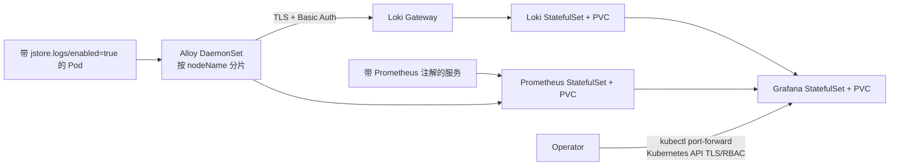

# Kubernetes 可观测性部署设计

## 拓扑



## 关键决策

### 采集方式

使用 `discovery.kubernetes` 与 `loki.source.kubernetes`。每个 DaemonSet 实例通过 `spec.nodeName=$HOSTNAME` 限制到当前节点，并用 `jstore.logs/enabled=true` 限制业务范围。这避免读取容器运行时 socket，也不需要挂载节点日志目录；代价是日志流经过 Kubernetes API/kubelet，因此必须观察 API 流量。

Alloy 使用有 1 GiB `sizeLimit` 的 `emptyDir` 保存发送 WAL，主容器以非 root UID 473、只读根文件系统运行。远程实装证明 hostPath 会被 Pod Security baseline/restricted 拒绝；为了 hostPath 把命名空间降为 privileged 不符合本迭代安全优先级。因此 WAL 能跨同一 Pod 的容器进程重启保留，但 Pod 重建或节点故障会丢失尚未送达的 WAL，生产环境如要求更强保证，应选择支持每节点持久卷的采集拓扑或后端直连方案。

### 元数据与基数

发现阶段生成 `service_name`、`environment`、`namespace`、`container` 低基数标签。`pod`、`node`、`trace_id`、`span_id`、`correlation_id`、`message_id`、`causation_id` 进入 structured metadata，不成为索引标签。工作负载必须提供：

```yaml
metadata:
  labels:
    jstore.logs/enabled: "true"
    jstore.logs/environment: development
    app.kubernetes.io/name: j-store-order
```

### 安全边界

Loki 本体只接受 gateway 与 Grafana 的命名空间内流量。gateway 使用用户提供或部署脚本生成的 TLS Secret 与 htpasswd Secret；Alloy 校验 CA、使用 Secret 密码文件，不允许跳过证书验证。Grafana 管理员凭据来自 Secret。

命名空间默认拒绝 ingress/egress。标准 NetworkPolicy 无法用 Service 名称选择 Kubernetes API，因此 Alloy 仅被允许向 TCP 443 出站，并另外开放 DNS 与 Loki gateway。该规则比任意端口出站更小，但无法把 443 限制到可移植的 API Service IP；生产 overlay 应把它收敛为目标集群 API CIDR，或使用支持 FQDN/API 实体策略的 CNI。

### 后端与存储

Loki、Prometheus、Grafana 使用 StatefulSet 与独立 PVC。基础清单依赖默认 StorageClass，便于在开发集群验证；生产 overlay 必须指定满足 RPO/RTO 的 StorageClass、备份策略和拓扑约束。

Loki/Prometheus 保留 7 天并设置 PVC 容量，提供资源上限与探针。单副本可验证持久化和恢复，但不是高可用。生产 HA 必须在对象存储、复制因子、容量模型和运维责任确定后采用官方 chart/托管服务设计。

Prometheus 加载采集器 target、日志丢弃/重试、Loki 与业务 target 告警规则。参考栈不创建第二套 Alertmanager，也不修改集群现有 monitoring；通知接收方、静默、抑制和升级链路由生产 overlay 与独立运维评审决定。

### 访问模型

基础清单只有 ClusterIP Service，不创建 Ingress、NodePort 或 LoadBalancer。人工访问 Grafana 使用 `kubectl port-forward`，由 Kubernetes API 完成身份认证、授权与 TLS。任何公开入口都是新的安全边界，必须通过单独 overlay 和评审引入。

## 验证策略

1. Python 契约测试解析所有 YAML 与嵌入配置，检查 RBAC、Secret、标签基数、TLS、NetworkPolicy、PVC、资源和探针。
2. `kubectl kustomize` 与 `kubectl apply --dry-run=server` 验证资源组合和目标集群 API 兼容性。
3. Alloy 固定版本执行 `validate --stability.level=experimental`。
4. 隔离命名空间 smoke 创建合成日志 Pod，查询 TLS gateway，并验证两个节点上的 DaemonSet 与关键指标。
5. 精确删除 smoke 命名空间；保留现有 `monitoring` 等基础设施不变。
