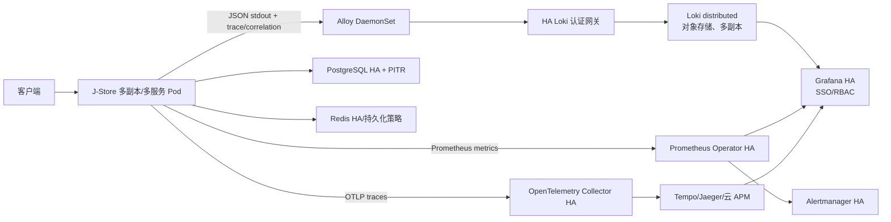

# 生产级分布式部署与可观测性迭代计划

## 1. 文档信息

| 项目 | 内容 |
|---|---|
| 状态 | 拟议计划，尚未进入生产实施 |
| 适用范围 | J-Store 应用遥测、Kubernetes 运行时、日志/指标/Trace 平台、韧性、容量、备份恢复与长期运营 |
| 当前基线 | `observability-foundation`、`observability-kubernetes`、`kubernetes-application-deployment`、`outbox-production-hardening` |
| 目标 | 从“模块化单体开发部署 + 集群采集参考栈”演进为有 SLO、HA、隔离、恢复、容量和独立评审证据的生产级分布式部署候选 |
| 明确非目标 | 不为了“微服务完整度”提前引入 Kafka/CDC、数据库拆分或读写分离；不把开发集群 smoke、PR workflow 或文档复选框当作生产批准 |

J-Store 当前仍由 `j-store-boot` 组合多个有界上下文，业务侧不是已经完成独立部署的微服务群。日志采集模型可以覆盖多个节点和多个微服务 Pod，但当前应用、Redis、Loki、Prometheus 和 Grafana 参考部署均存在单副本或开发交付边界。因此本计划同时治理应用信号、运行时、可观测性后端和外部数据依赖；任何一个子系统完成都不能单独证明整个项目生产就绪。

## 2. 当前状态与审计对账

### 2.1 已交付且应复用的能力

1. 根应用已引入 Actuator、Micrometer OpenTelemetry bridge 和 Prometheus Registry；运行时存在真实 `MeterRegistry`，Outbox 不再必然退化为 Noop monitor。
2. `observability` profile 已使用 Spring Boot 3.5 原生 ECS JSON stdout，包含稳定 service/environment/version、MDC、trace/span 重命名；仓库已有日志字段、脱敏和禁止字段规范。
3. HTTP 请求具备受约束的 `correlation_id`；Micrometer Tracing 已验证 W3C `traceparent` 注入，correlation 与 Trace 语义保持分离。
4. Outbox 已提供积压、最老 READY 延迟、死信、过期锁和 scheduler 连续失败指标；开发 Grafana dashboard 已展示部分 Outbox 信号。
5. 新的 Kubernetes 开发清单已经具备 startup/readiness/liveness 探针、资源 requests/limits、非 root、只读根文件系统、capability drop、seccomp、ClusterIP 和 NetworkPolicy。
6. Alloy 以 DaemonSet 按节点分片采集显式标记的 Pod，使用低基数 Loki 标签和 structured metadata；到 gateway 的链路使用 TLS 与认证。
7. 应用和可观测性清单具有 Kustomize/契约测试、server-side dry-run、配置检查、smoke 与运行手册；应用指标已在开发集群现有 Prometheus/Grafana 中验证。
8. 原 Redis 延迟任务中心经调用链审计确认没有业务调用者后已整体删除，其表、Lua 和测试入口不再是生产能力。

### 2.2 输入 findings 的当前状态

以下表把历史静态审计与当前分支重新对账。`已解决` 表示工程缺口已经关闭，但不等于生产环境已验收；`部分解决` 表示已有基础能力但仍有生产阻断；`不再适用` 表示对应能力已删除。

| ID | 原优先级 | 当前状态 | 当前证据与剩余差距 | 计划归属 |
|---|---|---|---|---|
| OBS-01 | P0 | 部分解决 | `j-store-boot` 已有 Actuator、Prometheus Registry、Micrometer Tracing；ServiceMonitor 和 Outbox dashboard 已存在。仍缺 Outbox `HealthIndicator`、真实可触发告警与生产端点访问边界。 | 迭代 1 |
| LOG-01 | P0 | 工程已解决 | ECS JSON、集中采集参考栈、字段/脱敏规范和 7 天开发保留已存在。生产保留、删除、成本和多租户仍待批准。 | 迭代 0、5、8 |
| TRC-01 | P0 | 部分解决 | 已有 W3C 传播和本地 tracer，但没有 OTLP exporter/Collector/Trace 后端证据，也没有 HTTP→JDBC/Redis→Outbox→异步处理完整链路验证。 | 迭代 2 |
| OPS-01 | P0 | 部分解决 | 旧 `j-store-boot/k8s-deployment.yaml` 仍是单副本、`latest`、`Never` 且无探针；它已无仓库引用，应清理。新开发清单有探针/安全边界，但仍是单副本、`Recreate`、JAR/PVC。 | 迭代 3 |
| CFG-01 | P0 | 部分解决 | `spring.application.name` 已改为 `j-store`，但默认配置仍强制 `local`，Kubernetes 也显式使用 `local,observability`；Hikari pool 仍命名 `j-store-order`。 | 迭代 1、3 |
| REL-01 | P1 | 未解决 | 用户远程查询只有 connect/read timeout；没有总时间预算、Circuit Breaker、Bulkhead、限流、受控重试、降级语义和对应指标。 | 迭代 6 |
| DR-01 | P1 | 证据缺失 | Flyway 测试不能证明生产备份。仓库没有 PostgreSQL/Redis HA、PITR、恢复演练或批准的 RPO/RTO 证据；外部平台已有能力不能在未核验时记为不存在或已完成。 | 迭代 4、7 |
| CAP-01 | P1 | 未解决 | 没有交易链路 SLI/SLO、容量模型、基准压测、HPA/PDB；单实例 Hikari 上限 20，横向扩容可能先耗尽数据库连接。 | 迭代 0、3、6 |
| JOB-01 | P1 | 不再适用 | 原 Redis 延迟任务中心已作为无业务调用死代码删除。若未来重新引入任务平台，必须形成新规格并同时设计队列深度、处理延迟、超时、死信、slot ownership 和线程池指标。 | 不进入当前实现计划 |
| SEC-OPS-01 | P1 | 部分解决 | 新清单已有 ConfigMap、运行时生成 Secret、NetworkPolicy 和 restricted security context；但当前 Flannel 无 NetworkPolicy 执行证据，开发 Secret 流程也不是生产 Secret 管理。 | 迭代 4、5 |
| API-01 | P2 | 未解决 | 多个 Controller 各自定义 `ErrorResponse`；没有统一 Problem Details、全局异常遥测、API 文档和一致请求审计。 | 迭代 8 |

### 2.3 新增或细化的生产阻断

| ID | 优先级 | 差距与影响 | 解除条件 |
|---|---|---|---|
| TRC-02 | P0 | 当前 `micrometer-tracing-bridge-otel` 能建立 Trace，但仓库没有 OTLP exporter 配置和后端，span 无法形成集中链路证据。 | 选定唯一 SDK/Agent owner，接入 OTLP Collector 与 Trace 后端，并通过完整交易链路测试。 |
| OBS-02 | P0 | `OutboxOperationalHealth` 是快照模型，不是 Actuator `HealthIndicator`；积压可能有指标但健康端点不可见。 | 增加独立 health component；不得加入 liveness，是否加入 readiness 由接流语义决定。 |
| DEP-01 | P0 | 新应用清单仍是 `replicas: 1`、`Recreate` 和开发 JAR/PVC，旧清单又保留误导性 `latest` 路径。 | 正式不可变镜像、至少双副本、RollingUpdate、PDB、拓扑分散、优雅终止和旧清单清理。 |
| LOKI-01 | P0 | Loki、gateway、Prometheus、Grafana 单副本，Loki 使用 filesystem/RWO PVC、内存 ring、replication factor 1。 | distributed Loki、对象存储、多副本/故障域、HA 查询与告警路径通过演练。 |
| DR-02 | P0 | “有备份”与“可在目标时间恢复”没有证据，日志对象存储和业务数据库均无恢复演练。 | 用隔离环境执行可校验恢复并达到批准 RPO/RTO。 |
| SLO-01 | P0 | 没有用户可见交易 SLI/SLO，告警阈值和资源规模无法从开发默认值推导。 | 订单、销售授权、库存、支付与 Outbox SLI/SLO 经 owner 批准并有 recording/alert rules。 |

### 2.4 总体判断

- 当前方案已经从“无可观测性”进入“开发/集成环境最小闭环”，原始 `OBS-01` 和 `LOG-01` 不能继续按完全缺失描述。
- Trace 当前只有进程内生成与 W3C 传播能力，没有集中导出和后端查询，仍属于 P0。
- 新 Kubernetes 清单解决了探针与容器安全的基础问题，但它明确是开发方案；旧 `k8s-deployment.yaml` 已无引用，应在生产清单落地时清理，避免两套事实并存。
- 生产阻断不只在日志后端。默认 `local` profile、单副本应用、数据库连接预算、外部依赖韧性、PITR/恢复和业务 SLO 必须沿同一关键路径治理。
- 外部 Grafana、Prometheus、PostgreSQL 或 Redis 可能已有托管 HA/备份能力；在获得配置、SLA 和演练证据前统一标记为“证据缺失”，不推断其不存在。

## 3. 推荐目标架构



### 3.1 应用信号

- 日志保持 Spring Boot ECS JSON stdout → Alloy，不把业务线程改为同步直写远端，也不增加第二条 OTLP 日志管线。
- 指标使用 Actuator + Prometheus Registry；公共 dashboard 至少覆盖 RED、JVM、Hikari、Redis、Outbox、线程池和核心交易漏斗。
- Trace 优先评估 OpenTelemetry Java Agent。OpenTelemetry 官方将 Java Agent 作为 Spring Boot 默认起点，因为它覆盖更多开箱即用的 HTTP、JDBC、Redis 等 instrumentation；业务关键状态转换再增加手工 span。
- 当前 Micrometer bridge 可保留用于 Observation/手工埋点，但 ADR 必须指定唯一 SDK/Exporter owner，并通过测试排除重复 server/client/JDBC span。
- OTLP 只发送到集群内 OpenTelemetry Collector，由 Collector 负责批处理、重试、采样、属性治理和路由到 Tempo、Jaeger 或云 APM。

### 3.2 日志与指标后端

- 保留 Alloy DaemonSet 节点分片和低基数契约。
- 生产日志目标采用 Loki microservices/distributed mode 或经批准的托管服务，不把当前单体 StatefulSet 横向复制后称为分布式。
- 不选择 Simple Scalable Deployment 作为长期目标；Loki 官方已将其列入弃用方向并说明会在 Loki 4.0 前移除。
- chunks/index 使用 S3 兼容或云对象存储；Compactor 管理 retention，对象存储生命周期不得粗暴删除 index 或集群状态对象。
- 生产指标复用并加固集群现有 Prometheus Operator/Alertmanager/Grafana，不长期维护职责重叠的第二套参考栈。

### 3.3 运行时与数据

- 每个生产部署单元拥有稳定 `service.name`、不可变镜像 digest、至少双副本、RollingUpdate、PDB、拓扑分散、资源边界和优雅终止。
- liveness 只反映进程不能自行恢复的内部状态，不依赖共享数据库、Redis、Loki 或远程 API，防止共享故障触发全副本重启。
- readiness 只包含确实决定该实例是否能安全接流的依赖；Outbox 积压通常应作为独立 health/alert 信号，而不是让所有 HTTP Pod 同时摘流。
- PostgreSQL 使用托管 PITR 或 base backup + WAL archive；Redis 根据数据语义确定哨兵/集群、持久化和恢复目标。必须通过恢复演练证明，而不是只检查备份任务成功。
- 副本数、Hikari、Redis、线程池和 HPA 上限由容量证据共同决定。必须满足：`最大应用副本数 × 单实例连接池上限 + 运维/迁移保留连接 ≤ 数据库批准连接预算`。

## 4. 官方依据

- [Spring Boot 3.5 Structured Logging](https://docs.spring.io/spring-boot/3.5/reference/features/logging.html#features.logging.structured)
- [Spring Boot Metrics](https://docs.spring.io/spring-boot/3.5/reference/actuator/metrics.html)
- [Spring Boot Tracing](https://docs.spring.io/spring-boot/3.5/reference/actuator/tracing.html)
- [Spring Boot Actuator Endpoints and Kubernetes probes](https://docs.spring.io/spring-boot/3.5/reference/actuator/endpoints.html#actuator.endpoints.kubernetes-probes)
- [OpenTelemetry Spring Boot instrumentation choice](https://opentelemetry.io/docs/zero-code/java/spring-boot-starter/)
- [OpenTelemetry Java instrumentation ecosystem](https://opentelemetry.io/docs/languages/java/instrumentation/)
- [Kubernetes startup/liveness/readiness probes](https://kubernetes.io/docs/tasks/configure-pod-container/configure-liveness-readiness-probes/)
- [Kubernetes Deployment rolling updates](https://kubernetes.io/docs/concepts/workloads/controllers/deployment/#rolling-update-deployment)
- [Kubernetes Pod disruptions and PDB](https://kubernetes.io/docs/concepts/workloads/pods/disruptions/)
- [Prometheus alerting practices](https://prometheus.io/docs/practices/alerting/)
- [Loki deployment modes](https://grafana.com/docs/loki/latest/get-started/deployment-modes/)
- [Loki Helm 6.x upgrade guidance](https://grafana.com/docs/loki/latest/setup/upgrade/upgrade-to-6x/)
- [Loki retention](https://grafana.com/docs/loki/latest/operations/storage/retention/)
- [Loki authentication](https://grafana.com/docs/loki/latest/operations/authentication/) 与 [multi-tenancy](https://grafana.com/docs/loki/latest/operations/multi-tenancy/)
- [Prometheus Operator high availability](https://prometheus-operator.dev/docs/platform/high-availability/) 与 [Thanos integration](https://prometheus-operator.dev/docs/platform/thanos/)
- [PostgreSQL continuous archiving and PITR](https://www.postgresql.org/docs/current/continuous-archiving.html)

## 5. 生产质量目标与决策门

以下数字是首轮评审候选，不能从开发环境默认值推导。迭代 0 必须由业务、SRE、安全和平台 owner 批准最终阈值。

| 质量目标 | 首轮候选 | 验证方式 |
|---|---:|---|
| 核心交易可用性 | 月度不低于 99.9% | 订单入口和状态结果 SLI |
| 核心交易延迟 | 每阶段分别定义 p95/p99 | 订单、销售授权、库存预留、支付直方图 |
| Outbox 新鲜度 | 正常负载 p99 小于批准阈值 | ready lag、delivery latency 与合成消息 |
| Trace 完整性 | 代表性订单可从 HTTP 入口关联到 JDBC、Outbox 和后续处理 | Trace 查询与日志跳转 |
| 日志新鲜度 | 正常负载 p99 不超过 60 秒 | Loki Canary/合成事件 |
| 典型 15 分钟日志查询 | p95 不超过 5 秒 | 固定 LogQL 查询集 |
| 单 Pod/worker 故障 | 不造成服务或遥测平台整体不可用 | Pod 删除、node drain |
| 日志保留 | 候选 30 天热数据 | Compactor 与对象存储验证 |
| 数据 RPO/RTO | 候选 RPO 5 分钟、RTO 30 分钟 | PostgreSQL/日志平台隔离恢复 |
| 容量余量 | 2 倍预测峰值；存储至少 30% 余量 | 压测和 12 个月增长模型 |
| 告警通知 | P1 用户症状 5 分钟内进入值班链路 | 合成告警端到端演练 |

告警优先针对用户可见错误率、延迟、不可用和数据积压；内部异常用于 dashboard 和诊断，不为每个异常直接呼叫值班。

## 6. 当前最高优先级的三个任务

### P0-1：关闭应用遥测与配置正确性缺口

接入 OTLP Trace 出口、Collector 与 Trace 后端；增加 Outbox HealthIndicator 和可触发告警；取消默认激活 `local`，建立显式 dev/prod 配置和稳定 service identity。该任务最先执行，因为扩容日志后端不能弥补应用不导出 Trace、健康不可见或生产误用 local 配置。

### P0-2：建立生产 SLO、容量与恢复契约

测量核心交易、日志、Trace、Outbox、Hikari 和外部依赖负载，批准 SLI/SLO、RPO/RTO、保留期、租户、敏感数据和成本边界；核验 PostgreSQL/Redis/Object Storage 的 HA、PITR 与恢复责任。没有这些输入，副本数、HPA、连接池、采样和存储规模都是猜测。

### P0-3：完成应用和观测平台的 HA 部署基础

将应用改为不可变镜像、至少双副本、RollingUpdate、PDB 和拓扑分散；补齐执行 NetworkPolicy 的 CNI、PKI/Secret 和 registry；再以 distributed Loki、HA Collector、Prometheus/Alertmanager/Grafana 形成无普通单点的生产候选。

## 7. 迭代总览

| 阶段 | 迭代 | 目标 | 主要产物 | 建议时长 |
|---|---:|---|---|---:|
| 最小闭环 | 0 | 事实、SLO 与容量基线 | findings 对账、SLI/SLO、RPO/RTO、容量/成本模型 | 1 个迭代 |
| 最小闭环 | 1 | 指标、日志、健康与配置闭环 | prod 配置、Outbox HealthIndicator、受控端点、真实告警 | 1 个迭代 |
| 最小闭环 | 2 | 端到端 Trace | Java Agent/SDK ADR、OTLP Collector、Trace 后端、关键 span | 1–2 个迭代 |
| 部署恢复 | 3 | 应用生产部署候选 | 不可变镜像、双副本、RollingUpdate、PDB、探针语义 | 1–2 个迭代 |
| 部署恢复 | 4 | 数据和平台前提 | CNI、对象存储、PKI/Secret、PostgreSQL/Redis HA/PITR | 1–2 个迭代 |
| 部署恢复 | 5 | 分布式日志与监控后端 | Loki distributed、多租户、HA monitoring 集成 | 2 个迭代 |
| 韧性容量 | 6 | 远程调用与交易容量治理 | 时间预算、熔断/隔舱、压测、业务 SLO、连接预算 | 1–2 个迭代 |
| 长期运营 | 7 | 灾备、安全与故障认证 | 恢复、轮换、混沌、72 小时 soak、安全评审 | 1–2 个迭代 |
| 长期运营 | 8 | API/发布与生产评审 | Problem Details、审计、Runbook、GitOps、独立批准 | 1 个迭代 |

建议时长是工作量级别，不包含采购、托管服务开通、CNI 变更和审批等待时间。

## 8. 详细迭代计划

### 迭代 0：事实、SLO、容量和数据治理基线

#### 实施任务

- 盘点所有可部署单元、namespace、service identity、外部依赖、数据 owner 和值班 owner。
- 采集或构造有依据的订单、销售授权、库存预留、支付、Outbox、日志和 Trace 代表性负载。
- 计算平均/峰值 RPS、日志 bytes/s、active streams、Trace spans/s、查询并发、Hikari/Redis/线程池使用和 12 个月增长。
- 批准日志/Trace 敏感字段、采样、保留、删除、租户、SLO、RPO/RTO 和成本边界。
- ADR 决定自建或托管 Loki/Trace/指标长期存储，以及每项平台能力的 owner。

#### 退出门禁

- 所有候选阈值可从原始样本复算，覆盖至少 2 倍峰值。
- 每个 SLI/SLO、备份和恢复目标都有 owner、数据源、计算方式和告警策略。
- 付费、合规、租户或数据删除决策未批准时显式阻断，不用默认值代替。

### 迭代 1：日志、指标、健康和配置闭环

#### 实施任务

- 删除默认 `spring.profiles.active=local`；建立显式 `application-dev`/`application-prod` 或环境等价配置，修正 Hikari pool 和 deployable service naming。
- 保留 ECS JSON stdout 与现有字段安全策略；为 service version/environment 使用不可变发布元数据。
- 将 `OutboxOperationalHealth` 适配为独立 Actuator HealthIndicator，输出无 payload、无敏感信息的状态和阈值摘要。
- 明确 health group：Outbox 不进入 liveness；是否进入 readiness 必须依据“积压时是否还能安全接收新交易”评审，默认以 alert/degraded health 处理。
- `/actuator/health/liveness`、`readiness` 和 `/actuator/prometheus` 只通过集群内 Service/NetworkPolicy 暴露，不开放其它高风险 Actuator 端点。
- 补齐 RED、JVM、Hikari、Redis、Outbox 和核心交易漏斗 dashboard；把 Outbox lag/dead-letter/scheduler failure 接入真实 Alertmanager 路由。

#### 证据与门禁

- prod 启动测试证明不会加载 local 数据库、Redis、采样和开发凭据默认值。
- Prometheus 抓取包含 JVM、HTTP、Hikari、Redis 和 Outbox 指标；Noop monitor 仅允许在明确无 registry 的测试/非观测环境。
- 人为制造 Outbox 积压和 scheduler 连续失败，真实告警进入测试接收链路并可恢复。
- liveness 在数据库/Redis/Loki 故障时保持正确；readiness 行为符合已批准依赖矩阵。

### 迭代 2：端到端 Trace 与关联

#### 实施任务

- 优先用 OpenTelemetry Java Agent 做兼容性 spike，验证 Spring MVC、RestClient、JDBC、Redis 和调度/消息边界覆盖与开销。
- ADR 在 Java Agent、OTel Spring Boot Starter、当前 Micrometer bridge 组合中选择唯一 SDK/Exporter owner，禁止重复 span/export。
- 部署至少两个 OpenTelemetry Collector 副本，配置 OTLP TLS、batch、memory limiter、retry、queue、tail/head sampling 和拒绝/丢弃指标。
- 接入 Tempo、Jaeger 或云 APM；日志仍走 stdout/Alloy，避免重复日志出口。
- 为 Outbox publish、relay、delivery、consume 和订单关键状态转换补手工 span/event；传播 message/correlation/causation，但不把业务 ID 当 Trace ID。
- 统一资源属性：`service.name`、version、environment、namespace、pod、deployment；敏感数据不得成为 span attribute。

#### 证据与门禁

- 一次订单请求可从入口 span 定位到 JDBC、Outbox 入箱、relay 和后续处理；日志可按 trace/correlation 双向跳转。
- 跨线程、异常、重试和重复消费不串上下文；W3C `traceparent` 能跨 HTTP 服务传播。
- Agent/SDK 不产生重复 server/client/JDBC span；采样和导出开销达到迭代 0 预算。
- Collector/后端短时不可用不阻塞业务线程，队列溢出有明确指标和告警。

### 迭代 3：应用生产部署与配置硬化

#### 实施任务

- 构建 Java 25 正式 OCI 镜像，以 digest 部署；生成 SBOM、签名、漏洞/许可证扫描证据，移除 JAR/PVC 生产交付。
- 新建 production overlay：至少双副本、RollingUpdate、`maxUnavailable: 0`、受控 `maxSurge`、拓扑分散/反亲和、优雅终止和资源边界。
- 增加 PDB 保护自愿中断；明确 PDB 不控制 Deployment 自身 rolling update，因此 rollout 参数必须独立验证。
- 探针使用 Actuator liveness/readiness；startup 覆盖 Flyway 与 Spring 启动上界，preStop/terminationGracePeriod 覆盖摘流和在途请求。
- 清理无引用的旧 `j-store-boot/k8s-deployment.yaml`，开发 base 保留开发标识，生产 overlay 不引用 DaoCloud 公共代理和 local profile。
- HPA 只在迭代 0 容量与迭代 6 压测证据允许后启用；先设置 `maxReplicas` 与数据库连接预算硬上限。

#### 证据与门禁

- 未就绪 Pod 不接收 Service 流量；慢启动不会被 liveness 误杀；线程死锁/不可恢复状态能触发重启。
- 单 Pod 删除和滚动升级期间核心 API 保持批准可用性；node drain 尊重 PDB 并能在其它节点调度。
- rollback 使用上一不可变 digest，不依赖重新构建同 tag 镜像。
- `最大副本 × Hikari max + 保留连接` 不超过数据库批准预算。

### 迭代 4：网络、Secret、对象存储与数据恢复前提

#### 实施任务

- 在等价预生产集群确认执行 NetworkPolicy 的 CNI，用真实 TCP allow/deny 测试，而不是只检查 API 对象存在。
- 接入企业 PKI/cert-manager、外部 Secret 管理和无中断轮换；生产凭据不进入 Git、PR、日志或测试证据。
- 验证 HA StorageClass、对象存储加密/版本/审计/配额和跨节点访问；禁止以单节点 `local-path` 作为 HA 证据。
- PostgreSQL 选择托管 PITR 或 base backup + WAL archive；监控归档延迟、失败和存储容量。
- 明确 Redis 中 token/session/幂等数据的耐久性要求，选择 HA/持久化/恢复策略并验证故障语义。
- 盘点现有 Prometheus Operator、Alertmanager、Grafana、SSO、外部数据库及其 SLA/备份；没有证据时保持“证据缺失”。

#### 证据与门禁

- NetworkPolicy 数据面、证书/Secret 轮换、对象存储与 registry 准入均有自动化证据。
- PostgreSQL 和 Redis 能在隔离环境按批准 RPO/RTO 恢复，恢复后运行数据一致性和关键交易 smoke。
- CNI、生产权限、Secret、数据库恢复和不可逆操作已取得独立人工批准。

### 迭代 5：分布式日志和 HA 监控平台

#### 实施任务

- 使用固定 chart/version/digest 的 Loki distributed mode，部署 HA gateway/distributor/ingester/querier/query-frontend/scheduler 和有状态 compactor/index-gateway/ruler。
- 配置对象存储、TSDB schema、replication、zone-aware 调度、PDB、拓扑扩散、租户限额、query fairness、retention 和 cache。
- 认证网关根据已认证身份写入受信 tenant，覆盖外部 `X-Scope-OrgID`；Grafana 不使用跨租户万能凭据。
- 保留 Alloy DaemonSet，按容量配置 queue/WAL；量化 Pod 重建/节点故障丢失窗口，不能以 privileged/宽 hostPath 换取未批准保证。
- 部署 Loki Canary 持续测量日志正确性和新鲜度；标签契约覆盖 `transport_id` 有限枚举与运行时 cardinality。
- 复用现有 Prometheus Operator，至少两个 Prometheus 和 HA Alertmanager；长期指标按需求接入 Thanos/Mimir 等，不重复部署参考 Prometheus。
- Grafana 使用 SSO/RBAC、共享外部数据库和至少两个可替换实例，datasource/dashboard 由 GitOps provisioning。

#### 证据与门禁

- 删除任一普通 Loki/Collector/Prometheus/Grafana Pod或 drain 一个 worker 时，写入、查询和告警仍满足 SLO。
- 至少三个 service identity、两个 namespace、多个节点完成无重复采集、跨服务 correlation 和 tenant 隔离验证。
- 对象存储短时错误、ring 变化、查询积压和 Alloy 丢弃有可行动告警；恢复后无静默损坏。

### 迭代 6：远程调用韧性、交易 SLO 与容量治理

#### 实施任务

- 为远程用户查询建立端到端时间预算，覆盖 DNS/connect/TLS/request/read/反序列化，而不只配置 connect/read timeout。
- 增加 Circuit Breaker、Bulkhead、并发/速率限制和指标；仅对明确幂等 GET、瞬态网络或允许状态码做有界 jitter retry，不重试 4xx。
- 用户/认证依赖的降级语义需要产品与安全批准；默认 fail closed，不用陈旧或缺失身份信息继续高风险交易。
- 为订单创建、销售授权、库存预留、支付、Outbox 投递定义成功率、p95/p99、积压和业务漏斗 SLI/SLO。
- 用 Gatling、k6 或等价工具覆盖正常、峰值、2 倍峰值、慢数据库、慢 Redis、慢远程 API、连接耗尽和重试风暴。
- 基于实测决定 HPA、连接池、线程池、资源限额和扩容阈值；Kafka/CDC、读写分离或数据库拆分必须由证据触发独立规格。

#### 证据与门禁

- 外部依赖变慢/失败时总时间预算、熔断、隔舱和重试次数符合策略，不形成同步重试放大。
- 用户可见错误率和延迟告警先于内部原因告警；每个 page 有 owner、Runbook 和可执行动作。
- 压测报告能解释副本数、Hikari、Redis、线程池和 HPA 上限，且数据库连接预算不被突破。

### 迭代 7：灾备、安全、故障与稳定性认证

#### 实施任务

- 完成 threat model：Kubernetes API 读取、日志/Trace 敏感数据、tenant header、对象存储、Grafana、Actuator、OTLP 和供应链。
- 验证证书、网关、OTLP、对象存储和 Grafana datasource 凭据无中断轮换。
- 恢复 PostgreSQL、Redis、Loki 对象数据、Grafana 数据库和 GitOps 配置，校验恢复点前后的业务与遥测数据。
- 连续运行至少 72 小时 soak，期间执行 Pod 删除、node drain、网络延迟、对象存储限流、Collector/Loki/数据库中断和查询洪峰。
- 记录每 GiB 日志、每百万 span、每 target 指标的资源与成本，回标容量和采样模型。

#### 证据与门禁

- 恢复演练达到批准 RPO/RTO，证据包含时间线、数据校验、未恢复项和责任人。
- 写入可用性、日志/Trace 新鲜度、查询延迟、错误率、资源余量和告警时效达到批准 SLO。
- 独立安全/隐私评审无未接受高危问题；实现者不能批准自己的生产门禁。

### 迭代 8：API 运营契约、发布和生产评审

#### 实施任务

- 统一 RFC 9457 Problem Details、业务 error code、correlation/trace 返回、全局异常遥测和请求审计；禁止把敏感异常消息直接返回客户端。
- 生成并审查 API 文档；为认证、限流、错误协议和兼容性建立契约测试。
- 建立 GitOps 环境层次、制品来源、变更预览、分批发布、观察窗口、自动停止/回滚信号和回滚手册。
- 运维文档覆盖 dashboard、告警、Trace/日志查询、扩容、数据删除、备份恢复、凭据轮换和事故升级。
- 由非实现者执行 SRE、安全、隐私、供应链、数据库和产品目标独立评审。

#### 证据与门禁

- 预生产完成从零部署、升级、回滚、数据恢复和代表性订单全链路演练。
- 所有前序门禁有可追溯证据；未运行检查、外部托管能力和残余风险明确列出。
- PR/check 通过不等于生产批准；上线、密钥、权限、数据库和生产写入由授权人员确认。

## 9. 关键路径与依赖

```text
事实/SLO/容量/数据治理
        |
        +--> 指标/日志/健康/prod 配置 --> OTLP Trace 闭环
        |                                  |
        +--> 正式镜像/双副本/探针/PDB ----+
        |                                  |
        +--> CNI/Secret/对象存储/DB-Redis DR
                                           |
                                           v
                     distributed Loki + HA monitoring
                                           |
                                           v
                    韧性/交易 SLO/容量压测
                                           |
                                           v
                    恢复/安全/soak/发布评审
```

关键路径上的 P0 不能被 dashboard 数量、Pod Ready、单次日志查询或“外部平台可能已有”替代。业务微服务拆分可以并行进行，但可观测性验收至少需要三个独立 service identity、多副本和跨节点工作负载；在真实服务尚未拆出前可用受控合成服务验证平台。

## 10. 最终验收场景

生产候选至少必须证明：

1. 一次订单请求能从 HTTP 入口 Trace 定位到 JDBC、Outbox 入箱、relay 和后续处理，并能用 trace/correlation 跳转相关日志。
2. Outbox 积压、死信或 scheduler 连续失败能触发真实告警，告警进入正确接收、抑制和升级链路。
3. 未就绪 Pod 不接流；数据库等共享依赖故障不会通过 liveness 导致所有 Pod 级联重启。
4. 单 Pod 删除、滚动发布和一个 worker drain 不造成超过 SLO 的业务或遥测平台中断。
5. PostgreSQL、Redis 和日志平台数据能在隔离环境按批准 RPO/RTO 恢复，并通过数据与业务 smoke 校验。
6. 2 倍峰值和至少 72 小时 soak 结果支持副本、连接池、线程池、HPA、资源和存储配置。
7. tenant A 不能读写 tenant B；敏感字段不会进入日志、Trace attribute、指标标签、告警或恢复证据。
8. 生产发布、回滚、凭据轮换和事故处置均有已演练 Runbook、owner 和独立批准。

以下事实不能单独作为完成证据：清单可渲染、Pod 为 Ready、单次 smoke 成功、PR workflow 通过、任务复选框完成或备份任务显示成功。

## 11. 风险与缓解

| 风险 | 影响 | 缓解 |
|---|---|---|
| 原始 findings 过时仍被当成当前事实 | 重复建设或错误排期 | 保留本文件 2.2 对账表，以代码/测试/运行证据更新状态 |
| Java Agent 与 Micrometer/SDK 重复埋点 | 双 span、成本和拓扑错误 | 先做兼容性 spike，ADR 指定唯一 SDK/Exporter owner |
| 把 Outbox degradation 加入 liveness | 积压触发全 Pod 重启，加剧故障 | 独立 health/alert；liveness 不依赖外部状态 |
| default local profile 进入生产 | 错库、错误采样、错误 service identity | 无默认 active profile，生产部署显式声明并做启动契约测试 |
| HPA 未绑定数据库连接预算 | 扩容先耗尽 PostgreSQL | 以 `maxReplicas × pool` 硬约束，容量测试后才启用 |
| Flannel 不执行 NetworkPolicy | 清单看似隔离但数据面开放 | 选定支持策略的 CNI并执行真实 allow/deny 测试 |
| Simple Scalable Loki 后续弃用 | Loki 4.0 前再次迁移 | 直接 distributed mode 或托管服务 |
| 对象存储生命周期误删索引 | 历史日志损坏 | Compactor 管理 retention，生命周期规则按官方安全范围设计并演练 |
| 只看到“备份成功” | 灾难时无法恢复 | 定期隔离恢复，以数据校验和 RPO/RTO 作为门禁 |
| 为微服务完整度提前引入组件 | 复杂度、成本、故障面扩大 | Kafka/CDC/拆库/HPA 由容量和业务证据触发独立规格 |

## 12. 追踪矩阵

| 目标/差距 | 负责迭代 | 主要证据 |
|---|---|---|
| OBS-01、OBS-02、CFG-01 | 1 | prod 启动契约、Prometheus/health、真实 Outbox 告警 |
| TRC-01、TRC-02 | 2 | OTLP、Trace 后端、订单全链路与无重复 span |
| OPS-01、DEP-01 | 3 | 不可变镜像、rollout、PDB、探针与 node drain |
| DR-01、DR-02、SEC-OPS-01 | 4、7 | CNI/Secret/PITR/恢复/安全演练 |
| LOG-01、LOKI-01 | 5 | distributed Loki、多租户、对象存储和故障测试 |
| REL-01、CAP-01、SLO-01 | 0、6 | 时间预算、熔断/隔舱、压测、业务 SLO、连接预算 |
| JOB-01 | 不适用 | 死代码删除事实；未来重新引入必须新建规格 |
| API-01 | 8 | Problem Details、异常遥测、API/审计契约 |

## 13. 下一迭代启动清单

- [ ] 指定业务、SRE、安全、平台、数据库和成本 owner。
- [ ] 获取代表性交易、日志、Trace、Outbox 和连接池负载样本。
- [ ] 批准核心交易 SLI/SLO、数据保留、敏感字段、tenant、RPO/RTO 和成本上限。
- [ ] 设计并评审 prod profile，取消默认激活 local。
- [ ] 完成 Java Agent/当前 Micrometer bridge 的重复埋点 spike，决定 OTLP 出口方案。
- [ ] 决定自建 distributed Loki/Trace 后端或托管服务，并记录 ADR、TCO 和退出条件。
- [ ] 核验生产/预生产 CNI、对象存储、StorageClass、PKI/Secret、registry、PostgreSQL/Redis 与 monitoring 能力。
- [ ] 为 CNI、Secret/权限、数据库恢复和生产发布安排独立人工审批。

上述事项未完成时，可以继续本地契约测试和无状态 spike，但不得开始不可逆生产基础设施变更，也不得把本计划标记为生产完成。
