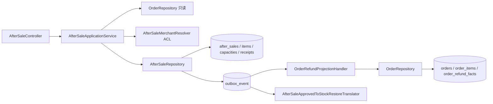
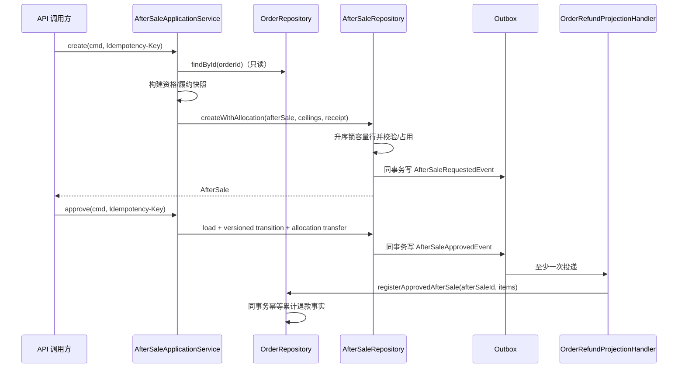

# 设计文档：订单售后聚合拆分

> DDD 基座 API 已由 `docs/spec/changes/ddd-foundation-refactor/` 破坏性替换；下文历史代码片段若仍出现旧类型名，以该规格和当前代码为准。

## 概述

本设计将售后申请、审核、拒绝和撤销从 `Order` 聚合拆成同一订单有界上下文内的独立 `AfterSale` 聚合；订单只保留购买事实、履约事实和经批准的累计退款事实。实现遵循 `docs/steering/ddd-guidelines.md` 的单事务单聚合、领域对象无框架依赖和事件协作约束，以及 `docs/steering/tdd-guidelines.md` 的分层 TDD 约束。

现有项目已提供完整元数据的 `DomainEvent`、Transactional Outbox、`MessageConsumptionRepository` 和同步注册的 `DomainEventListener`。因此售后保存与事件入 Outbox 同事务完成，订单退款投影在后续 Outbox 投递事务中独立修改订单，不引入分布式事务。本特性不迁移旧数据、不保留旧 API/事件兼容层，直接替换开发库结构。DDD 基座名称与事件确认协议以 `docs/spec/changes/ddd-foundation-refactor/` 为准。

### 设计决策

| 决策 | 选择 | 理由 |
| --- | --- | --- |
| 边界 | `AfterSale` 是 `j-store-order` 内独立聚合 | 售后有独立身份和生命周期，但当前不需要新模块或微服务 |
| 一笔申请范围 | 只允许一个订单，可含多个订单行项 | 保持聚合内退款原因、履约快照、审核决定一致 |
| 金额模型 | API 明确提交每行退款金额（分）；订单校验数量、金额分别不超额 | 支持非整行、非单价整数倍的退款，不擅自做优惠重算 |
| 商家归属 | 售后单保存 `merchantId`；创建时由 `AfterSaleMerchantResolver` 根据订单解析，审核时必须等于当前用户 | 当前订单没有商家字段；用 ACL 隔离归属来源，避免信任请求体。MVP 适配器在单店模式返回固定店主标识，后续可替换为店铺上下文查询 |
| 申请人权限 | 当前用户必须等于 `order.buyerInfo.uid` | 防止替他人订单申请；控制器不接收申请人字段 |
| 并发额度 | PostgreSQL `after_sale_capacities` 行按 `order_item_id` 升序悲观锁；额度行保存原始上限、处理中、已批准计数 | JPA 聚合版本只能防同一售后单并发，不能防不同售后单竞争同一订单行项 |
| 聚合并发 | `after_sales.version` 和 `orders.version` 使用 `@Version` | 审核/撤销竞争与订单事件投影均确定性地只成功一次 |
| 命令幂等 | 独立 `after_sale_command_receipts`，唯一键 `(actor_id, command_type, idempotency_key)` | 创建和状态变更均可重放；同键不同请求摘要返回冲突 |
| 事件标识 | 每次状态转换在行为开始时生成 UUID `eventId`，事件对象显式持有 | 当前基于时间推导的稳定 ID 不能作为命令重放身份；显式 ID 可持久化、序列化和消费去重 |
| 跨聚合一致性 | `AfterSaleApprovedEvent` → `OrderRefundProjectionHandler` → `Order.registerApprovedAfterSale` | 售后事务不修改订单；失败由 Outbox 重试，订单按 `afterSaleId` 二次幂等 |
| 已批准额度 | 容量表从处理中转到已批准，永不释放 | 订单投影存在延迟时仍不会超额申请 |
| 退货要求 | `SHIPPED`、`DELIVERED` 为真；`UNFULFILLED`、`PENDING_SHIPMENT` 为假 | 与需求给定“已发出或签收”边界一致，申请后快照不变 |
| 状态终结 | `REQUESTED` 只能转 `APPROVED`、`REJECTED`、`CANCELLED` | 结果可审计，无反向恢复和重复审核 |
| 售后库存恢复 | 新监听器订阅 `AfterSaleApprovedEvent`；仅 `requireReturn=false` 时按事件中的 SKU/数量增加可售库存，不复用整笔预占释放语义 | 避免部分退款误释放整笔订单预占；`requireReturn=true` 等待范围外的退货收货事实 |

## 架构



创建申请时只读取订单，随后在售后事务中锁定容量行、写售后聚合/占用/幂等回执/Outbox。批准事件异步投影订单，订单状态短暂滞后是明确的一致性窗口；售后容量表在窗口内仍保留批准占用，因此不会重复消费额度。



## 组件与接口

### 1. 售后领域模型

位置：`j-store-order/src/main/kotlin/com/jstore/order/domain/aftersale/`。

```kotlin
data class AfterSaleId(val value: Long) : Identify
data class ApplicantActorId(val value: Long) : Identify
data class MerchantActorId(val value: Long) : Identify

enum class AfterSaleStatus { REQUESTED, APPROVED, REJECTED, CANCELLED }

data class RefundReason(val category: RefundCategory, val description: String)
data class FulfillmentSnapshot(
    val status: FulfillmentStatus,
    val requireReturn: Boolean,
)
data class GoodsSnapshot(
    val skuId: Long,
    val spuId: Long,
    val goodsName: String,
    val skuDescription: String,
)
data class RefundEligibilitySnapshot(
    val orderItemId: OrderItemId,
    val refundableQuantity: Int,
    val refundableAmount: Price,
    val currency: String,
    val goods: GoodsSnapshot,
)
interface AfterSaleItem : Entity<AfterSaleItemId> {
    val orderId: OrderId
    val orderItemId: OrderItemId
    val requestedQuantity: Int
    val requestedAmount: Price
    val currency: String
    val eligibilitySnapshot: RefundEligibilitySnapshot
}
data class ReviewDecision(
    val reviewerId: MerchantActorId,
    val reviewedAt: LocalDateTime,
    val rejectionReason: String?,
)
interface AfterSale : AgreeGate<AfterSaleId> {
    override val id: AfterSaleId
    val orderId: OrderId
    val applicantId: ApplicantActorId
    val merchantId: MerchantActorId
    val status: AfterSaleStatus
    val reason: RefundReason
    val fulfillmentSnapshot: FulfillmentSnapshot
    val items: List<AfterSaleItem>
    val reviewDecision: ReviewDecision?
    val cancelledAt: LocalDateTime?
    val createTime: LocalDateTime
    val updateTime: LocalDateTime
    val version: Long
    fun approve(reviewerId: MerchantActorId, occurredAt: Instant): Result<Unit, BusinessError>
    fun reject(reviewerId: MerchantActorId, reason: String, occurredAt: Instant): Result<Unit, BusinessError>
    fun cancel(applicantId: ApplicantActorId, occurredAt: Instant): Result<Unit, BusinessError>
}
```

`AfterSaleImpl` 构造器显式接收以上全部持久化字段以及 `Queue<DomainEvent>`；`items` 对外暴露不可变副本。`AfterSaleItemImpl` 全字段只读。构造时验证：行项非空、订单一致、行项 ID 不重复、数量/金额为正、币种统一、请求不超过各自资格快照、审核/撤销字段与状态一致。

`AfterSaleFactory`：

```kotlin
interface AfterSaleFactory {
    fun create(
        cmd: AfterSaleCreateCMD,
        order: Order,
        merchantId: MerchantActorId,
        now: LocalDateTime,
        occurredAt: Instant,
    ): Result<AfterSale, BusinessError>
}
```

工厂从订单生成快照，不访问仓储；使用 `SnowFlakSequence` 生成聚合及行项 ID。`currency` 当前固定为 `CNY`，但仍持久化并校验，API 非 `CNY` 直接失败。

### 2. 命令与错误

位置：`domain/aftersale/command/`。

```kotlin
data class AfterSaleItemRequestCMD(
    val orderItemId: OrderItemId,
    val quantity: Int,
    val amount: Price,
    val currency: String,
)
data class AfterSaleCreateCMD(
    val orderId: OrderId,
    val applicantId: ApplicantActorId,
    val reason: RefundReason,
    val items: List<AfterSaleItemRequestCMD>,
    val idempotencyKey: String,
)
data class AfterSaleApproveCMD(
    val afterSaleId: AfterSaleId,
    val merchantId: MerchantActorId,
    val idempotencyKey: String,
)
data class AfterSaleRejectCMD(
    val afterSaleId: AfterSaleId,
    val merchantId: MerchantActorId,
    val rejectionReason: String,
    val idempotencyKey: String,
)
data class AfterSaleCancelCMD(
    val afterSaleId: AfterSaleId,
    val applicantId: ApplicantActorId,
    val idempotencyKey: String,
)
```

每个命令提供 `validate(): Result<..., BusinessError>`，幂等键去首尾空格后长度为 1..128；原因说明和拒绝原因长度为 1..500；行项数为 1..100。请求摘要由服务按命令类型和规范化 JSON 的 SHA-256 生成，不包含时间。

`AfterSaleErrors` 定义见错误处理章节。

### 3. 订单退款资格与投影行为

修改 `Order.kt`、`OrderImpl.kt`、`OrderItem.kt`、`OrderItemImpl.kt`：

```kotlin
data class RefundEligibility(
    val orderId: OrderId,
    val buyerId: Long,
    val paymentStatus: PaymentStatus,
    val tradeStatus: TradeStatus,
    val fulfillmentStatus: FulfillmentStatus,
    val paidAmount: Price,
    val totalRefundedAmount: Price,
    val items: List<RefundableOrderItem>,
)
data class RefundableOrderItem(
    val orderItemId: OrderItemId,
    val purchasedQuantity: Int,
    val purchasedAmount: Price,
    val refundedQuantity: Int,
    val refundedAmount: Price,
    val refundableQuantity: Int,
    val refundableAmount: Price,
    val skuId: Long,
    val spuId: Long,
    val goodsName: String,
    val skuDescription: String,
)
data class ApprovedRefundItem(
    val orderItemId: OrderItemId,
    val quantity: Int,
    val amount: Price,
)

interface Order : AgreeGate<OrderId> {
    val totalRefundedAmount: Price
    fun refundEligibility(): Result<RefundEligibility, BusinessError>
    fun registerApprovedAfterSale(
        afterSaleId: AfterSaleId,
        items: List<ApprovedRefundItem>,
        occurredAt: Instant,
    ): Result<RefundProjectionResult, BusinessError>
}
data class RefundProjectionResult(val newlyRegistered: Boolean)
```

`OrderItem` 新增 `purchasedAmount`（等于既有 `subtotal()`）、`refundedQuantity`、`refundedAmount`、派生 `refundableQuantity/refundableAmount`。订单新增 `totalRefundedAmount`。`registerApprovedAfterSale` 先验证订单 ID 由处理器匹配、售后 ID 未登记、集合非空无重复、数量/金额正数、目标存在、逐行不超额、总退款不超 `actualPay`；再一次性累计所有字段并登记售后 ID。重复 `afterSaleId` 返回 `Success(newlyRegistered=false)`，不发事件、不更新时间。

部分退款设置 `PaymentStatus.PARTIALLY_REFUNDED`；累计等于 `actualPay` 设置 `PaymentStatus.REFUNDED` 和 `TradeStatus.CLOSED`。履约状态和订单行项履约 `status` 不改变；不再用 `CANCELED` 表示已退款。

删除 `AfterSaleStatus.kt`、订单的 `_afterSaleStatus/afterSaleStatus`、`requestRefund/approveRefund/rejectRefund`、`deriveAfterSaleStatus`、退款状态不变量；删除 `OrderItemStatus.REFUNDING`、`OrderItem.previousItemStatus`、`enterRefunding/markCanceled/restoreFromRefunding`。`CANCELED` 仅保留给交易取消形成的行项履约事实。

### 4. 仓储与应用服务

`AfterSaleRepository.kt`：

```kotlin
interface AfterSaleRepository : Repository<AfterSaleId, AfterSale> {
    fun createWithAllocation(
        afterSale: AfterSale,
        ceilings: List<RefundCapacityCeiling>,
        receipt: AfterSaleCommandReceipt,
    ): Result<AfterSale, BusinessError>
    override fun findById(id: AfterSaleId): AfterSale?
    fun findByOrderId(orderId: OrderId): List<AfterSale>
    fun saveDecision(
        afterSale: AfterSale,
        allocationAction: AllocationAction,
        receipt: AfterSaleCommandReceipt,
    ): Result<AfterSale, BusinessError>
    fun findReceipt(actorId: Long, type: AfterSaleCommandType, key: String): AfterSaleCommandReceipt?
}
```

`AllocationAction` 为 `APPROVE` 或 `RELEASE`；`RefundCapacityCeiling` 保存订单行项原始购买数量和金额。仓储方法是业务原子操作，不向领域暴露 JPA 锁类型。

`AfterSaleApplicationService.kt`：

```kotlin
class AfterSaleApplicationService(
    private val factory: AfterSaleFactory,
    private val afterSaleRepository: AfterSaleRepository,
    private val orderRepository: OrderRepository,
    private val merchantResolver: AfterSaleMerchantResolver,
) {
    fun create(cmd: AfterSaleCreateCMD): Result<AfterSale, BusinessError>
    fun get(id: AfterSaleId, actorId: Long): Result<AfterSale, BusinessError>
    fun listByOrder(orderId: OrderId, actorId: Long): Result<List<AfterSale>, BusinessError>
    fun approve(cmd: AfterSaleApproveCMD): Result<AfterSale, BusinessError>
    fun reject(cmd: AfterSaleRejectCMD): Result<AfterSale, BusinessError>
    fun cancel(cmd: AfterSaleCancelCMD): Result<AfterSale, BusinessError>
}
interface AfterSaleMerchantResolver {
    fun merchantFor(order: Order): Result<MerchantActorId, BusinessError>
}
```

所有写方法先查回执；同摘要返回回执对应聚合当前结果，同键不同摘要返回冲突。创建顺序为：校验命令 → 加载订单 → 校验申请人为买家 → 获取商家 → 获取资格 → 工厂创建 → `createWithAllocation`。审核/撤销顺序为：校验命令 → 查回执 → 加载售后 → 验证 actor → 执行领域行为 → `saveDecision`。服务不同时保存订单。

### 5. 领域事件和消费者

位置：`domain/aftersale/event/AfterSaleDomainEvent.kt`。

```kotlin
data class AfterSaleEventItem(
    val orderItemId: OrderItemId,
    val skuId: Long,
    val quantity: Int,
    val amount: Price,
    val currency: String,
)
sealed class AfterSaleDomainEvent(/* eventId, afterSaleId, orderId, occurredAt */) : ExplicitDomainEvent

@DomainEventType(name = "after-sale.requested", version = 1)
data class AfterSaleRequestedEvent(/* applicantId, items, reason, requireReturn */) : AfterSaleDomainEvent(...)
@DomainEventType(name = "after-sale.approved", version = 1)
data class AfterSaleApprovedEvent(/* merchantId, items, requireReturn */) : AfterSaleDomainEvent(...)
@DomainEventType(name = "after-sale.rejected", version = 1)
data class AfterSaleRejectedEvent(/* merchantId, rejectionReason */) : AfterSaleDomainEvent(...)
@DomainEventType(name = "after-sale.cancelled", version = 1)
data class AfterSaleCancelledEvent(/* applicantId */) : AfterSaleDomainEvent(...)
```

所有事件 `aggregateType="AfterSale"`、`aggregateId=afterSaleId.value.toString()`，显式 `eventId: String = UUID.randomUUID().toString()`，并携带需求规定字段。事件行项携带 SKU，库存订阅方无需查询订单。

`OrderRefundProjectionHandler : DomainEventListener<AfterSaleApprovedEvent>` 位于 `j-store-order/src/main/.../service/`，`listenerId()` 固定为 `order.after-sale-approved.refund-projection.v1`。处理器调用新增的 `OrderRefundProjectionService.project(event)`；该服务加 `@Transactional` 的适配器放在 infrastructure（领域模块不能引 Spring），锁定订单、调用聚合行为并保存。消费回执 `domain_event_consumption` 与订单写处于 Outbox 投递的同一外层事务；抛出异常即整体回滚并重试。

旧 `OrderRefundRequestedEvent`、`OrderRefundApprovedEvent`、`OrderRefundRejectedEvent` 删除。新增 `AfterSaleApprovedToStockRestoreTranslator` 发布数量感知的 `AfterSaleStockRestoreRequestedEvent`；商品上下文按 SKU/数量增加可售库存，不调用会释放整笔预占的 `StockReleaseRequestedEvent`。

### 6. API 与装配

新增 `j-store-boot/src/main/kotlin/com/jstore/order/controller/AfterSaleController.kt`，类级 `@RestController`、`@RequestMapping("/api/after-sales")`、`@RequireLogin`：

| 方法 | 路由 | 身份与请求 | 成功响应 |
| --- | --- | --- | --- |
| `POST` | `/api/after-sales` | `@CurrentUserId`；请求含 orderId、reason、items；头 `Idempotency-Key` | 200 `AfterSaleResponse` |
| `GET` | `/api/after-sales/{id}` | 当前用户必须为申请人或归属商家 | 200 详情 |
| `GET` | `/api/after-sales?orderId=` | 当前用户必须为买家或归属商家 | 200 列表 |
| `POST` | `/{id}/approve` | 当前用户作为商家；幂等头 | 200 详情 |
| `POST` | `/{id}/reject` | 商家；body `rejectionReason`；幂等头 | 200 详情 |
| `POST` | `/{id}/cancel` | 当前用户作为申请人；幂等头 | 200 详情 |

`AfterSaleResponse` 完整包含：`id/orderId/applicantId/merchantId/status/reason/fulfillmentSnapshot/items/reviewDecision/cancelledAt/createTime/updateTime`；金额输出分值 `Long`，时间沿用 `LocalDateTime`。控制器沿用 `OrderController.toResponse` 的 `ResponseEntity` 与 `{message,errorCode}` 错误体约定，并将共享转换辅助抽到 boot 内部文件。

`OrderController` 删除三个旧退款路由和 DTO，`OrderResponse` 删除 `afterSaleStatus`；新增 `totalRefundedAmount`，行项响应新增 `refundedQuantity/refundedAmount`，不暴露售后审核信息。

`OrderBootConfiguration` 装配工厂、服务、投影服务和 resolver。单店 MVP 的 `AfterSaleMerchantResolver` 必须由配置 `jstore.order.merchant-id` 提供非零值；缺失时启动失败，不能从请求体采信 merchantId。该配置是当前没有店铺上下文时的显式边界，未来替换 ACL 不影响聚合/API。

## 数据模型

### 领域不变量

- 售后至少一项、同订单、订单行项不重复、同币种；快照和值对象不可变。
- `REQUESTED` 无审核/撤销信息；`APPROVED` 有无拒绝原因的审核决定；`REJECTED` 有非空拒绝原因；`CANCELLED` 仅有撤销时间。
- 订单行 `0 <= refundedQuantity <= quantity`、`0 <= refundedAmount <= purchasedAmount`；订单累计退款等于行项累计退款之和且不超过 `actualPay`。
- 容量行满足 `requested + approved <= ceiling`（数量与金额分别成立）。

### JPA 持久化对象

新增目录 `j-store-order-infrastructure/src/main/kotlin/com/jstore/order/domain/aftersale/persistence/`：

- `AfterSalePO`：根字段、`@Version var version: Long`、`@OneToMany` EAGER 行项。
- `AfterSaleItemPO`：申请值、商品快照和资格快照扁平列。
- `AfterSaleCapacityPO`：每个订单行项容量计数。
- `AfterSaleCommandReceiptPO`：命令幂等回执。
- 对应 `*POJpaRepository`；容量仓储提供 `INSERT ... ON CONFLICT DO NOTHING` 与 `@Lock(PESSIMISTIC_WRITE)` 的升序查询。
- `AfterSaleRepositoryImpl` 用 `@Transactional` 包围每个原子仓储方法，保存聚合后逐个调用 `DomainEventPublisher.publishEvent`，成功后清空聚合事件队列（为 `AgreeGate` 增加受控 `clearDomainEvents()`，或按现有接口最小扩展）。

订单 `OrderPO` 新增 `@Version version`、`total_refunded_amount`；`OrderItemPO` 新增 `refunded_quantity/refunded_amount`，删除 `previous_item_status`；新增 `OrderRefundFactPO`，订单以 `@OneToMany` 保存 `(after_sale_id, order_item_id, quantity, amount)`。订单仓储投影路径用 `findByIdForUpdate` 或 `@Version` 重试；设计采用悲观锁读取单个订单，以避免不同批准事件频繁冲突，普通查询不加锁。

### DDL 与索引

新增 `j-store-boot/src/main/resources/db/migration/V20260803__order_after_sale_aggregate.sql`，先清空 `order_items/orders`，删除旧售后相关列/约束/索引后直接创建：

```sql
after_sales(
  id bigint primary key, order_id bigint not null, applicant_id bigint not null,
  merchant_id bigint not null, status varchar(16) not null,
  reason_category varchar(32) not null, reason_description varchar(500) not null,
  fulfillment_status varchar(32) not null, require_return boolean not null,
  reviewer_id bigint null, reviewed_at timestamp null,
  rejection_reason varchar(500) null, cancelled_at timestamp null,
  create_time timestamp not null, update_time timestamp not null, version bigint not null default 0
)
after_sale_items(
  id bigint primary key, after_sale_id bigint not null references after_sales(id) on delete cascade,
  order_id bigint not null, order_item_id bigint not null,
  requested_quantity integer not null, requested_amount numeric(19,0) not null, currency varchar(3) not null,
  eligible_quantity integer not null, eligible_amount numeric(19,0) not null,
  sku_id bigint not null, spu_id bigint not null,
  goods_name varchar(256) not null, sku_description varchar(512) not null,
  unique(after_sale_id, order_item_id)
)
after_sale_capacities(
  order_item_id bigint primary key, order_id bigint not null,
  quantity_ceiling integer not null, amount_ceiling numeric(19,0) not null,
  requested_quantity integer not null default 0, requested_amount numeric(19,0) not null default 0,
  approved_quantity integer not null default 0, approved_amount numeric(19,0) not null default 0,
  version bigint not null default 0
)
after_sale_command_receipts(
  id bigint primary key, actor_id bigint not null, command_type varchar(16) not null,
  idempotency_key varchar(128) not null, request_hash varchar(64) not null,
  after_sale_id bigint not null, result_status varchar(16) not null, created_at timestamp not null,
  unique(actor_id, command_type, idempotency_key)
)
order_refund_facts(
  id bigint primary key, order_id bigint not null references orders(id) on delete cascade,
  after_sale_id bigint not null, order_item_id bigint not null,
  quantity integer not null, amount numeric(19,0) not null, occurred_at timestamp not null,
  unique(order_id, after_sale_id, order_item_id)
)
```

检查约束覆盖所有枚举、正数、非负计数、计数不超 ceiling、状态与审核字段组合。索引：`after_sales(order_id,create_time desc)`、`after_sales(applicant_id,status,create_time desc)`、`after_sales(merchant_id,status,create_time desc)`、`after_sale_items(order_item_id)`、`after_sale_capacities(order_id)`、`order_refund_facts(order_id,after_sale_id)`。`orders` 删除 `after_sale_status`，增加 `total_refunded_amount numeric(19,0) not null default 0` 和 `version bigint not null default 0`；`order_items` 删除 `previous_item_status`，增加两个退款累计列及检查约束。

## 事务与并发边界

1. `createWithAllocation` 单事务：先写/确认全部容量行（上限必须与订单原始购买事实一致），按 `order_item_id` 升序 `FOR UPDATE`，检查额度，批量增加 requested，保存售后和回执，再将事件写 Outbox。任何错误回滚全部。
2. `saveDecision` 单事务：锁售后根并用 version 防陈旧对象；按行项升序锁容量。批准将 requested 原子减、approved 加；拒绝/撤销只减 requested；保存根、回执、Outbox。锁顺序固定避免死锁。
3. 幂等查回执只是快速路径；最终保障依赖数据库唯一键。并发唯一键冲突后事务回滚，服务在新事务重新读取回执；摘要相同返回对应聚合，摘要不同返回 `AfterSale.IdempotencyConflict`。
4. 售后状态并发由 `@Version` 和根行锁保证。批准与撤销竞争时一个提交，另一个返回 `AfterSale.ConcurrentModification` 或读取回执后的既有结果，不产生第二事件。
5. 订单投影在 Outbox relay 的独立事务内锁 `orders` 行，消费表登记、退款事实、订单累计与可能产生的订单状态事件同事务提交。业务不变量失败抛 `NonRetryableRefundProjectionException` 会导致 Outbox 重试；同时记录错误日志和指标。当前 Outbox 只有 DEAD_LETTER 状态，无业务告警界面；依赖既有重试/死信机制，不声称自动补偿。
6. 不允许售后服务在任一写事务调用 `orderRepository.save`。读取订单与写售后之间可能发生订单退款投影，但容量表是所有进行中和已批准申请的串行化权威，故不会超额；订单取消/履约变化不改既有售后快照。
7. 领域预期失败返回 `Result.Failure`；数据库锁、唯一键和乐观锁异常由仓储翻译成业务冲突。Outbox 写失败抛异常并回滚业务写。

## 正确性属性

### Property 1: 售后聚合边界完整
*For any* 可构造或可恢复的售后聚合，其行项非空、仅持有订单/行项 ID 和不可变快照，所有行项属于同一订单且订单行项不重复；订单不含售后流程状态或行为。
**验证需求：1.1, 1.2, 1.3, 1.4, 1.5, 1.6, 10.6**

### Property 2: 申请资格完全来自订单事实
*For any* 创建命令，只有目标订单存在、申请人为买家、全部行项存在且数量金额币种合法、订单已支付且存在退款容量时才能创建；失败时聚合、占用、回执和事件均不存在。
**验证需求：2.1, 2.2, 2.3, 2.4, 2.5, 2.6**

### Property 3: 并发申请永不超额
*For any* 同一订单行项上的任意并发申请提交顺序，成功申请的处理中与批准数量/金额之和均不超过原始购买上限，至少一个会超额的竞争者得到确定冲突。
**验证需求：3.1, 3.2, 3.3**

### Property 4: 占用随终态正确转换
*For any* `REQUESTED` 售后，批准只把 requested 转成 approved；拒绝或撤销只释放 requested；任一操作前后总量守恒且终态操作不再改变占用。
**验证需求：3.4, 3.5, 5.4, 5.5, 6.3**

### Property 5: 相同命令至多产生一次业务效果
*For any* 相同 actor、命令类型、幂等键和请求摘要的重复或并发命令，最多创建一个聚合、一次状态转换、一次额度变化和一个生命周期事件，并返回同一售后标识；同键不同摘要恒冲突。
**验证需求：3.6, 8.6, 9.6**

### Property 6: 履约与资格快照不可变
*For any* 合法申请，`requireReturn` 只由创建时履约状态决定；创建后订单任意履约变化都不改变售后履约快照、资格快照或行项。
**验证需求：4.1, 4.2, 4.3, 4.4**

### Property 7: 审核状态机原子
*For any* `REQUESTED` 聚合，有权商家的一次批准或带非空原因的拒绝完整提交审核信息与单一事件；无权、非法状态或非法原因下全部字段、占用和事件队列不变。
**验证需求：5.1, 5.2, 5.3, 5.4, 5.5**

### Property 8: 撤销状态机原子
*For any* 售后聚合，只有原申请人能在 `REQUESTED` 撤销；其他身份或终态调用不改变任何字段、占用或事件。
**验证需求：6.1, 6.2, 6.3**

### Property 9: 订单退款事实守恒
*For any* 合法批准事件，订单每行累计退款不超购买事实、订单累计等于行累计且不超实付；部分/全部退款状态正确，履约事实不变，非法事件无部分更新。
**验证需求：7.1, 7.2, 7.3, 7.5, 7.6, 7.7, 7.8**

### Property 10: 批准事件投影幂等
*For any* `AfterSaleApprovedEvent` 的任意重复投递次数，订单只登记一次该 `AfterSaleId` 的退款事实，最终状态等价于投递一次。
**验证需求：7.3, 7.4, 8.6**

### Property 11: 跨聚合事务隔离
*For any* 售后创建、批准、拒绝或撤销事务，订单行均不在该事务被修改；只有批准事件消费事务修改订单，投递失败不会回滚已提交售后终态。
**验证需求：7.9, 8.5**

### Property 12: 事件契约完整稳定
*For any* 成功生命周期转换，恰有一个售后语义事件，包含唯一 ID、聚合/订单 ID、actor、规定快照载荷和发生时间，并可被 Outbox 序列化往返。
**验证需求：8.1, 8.2, 8.3, 8.4, 8.5, 8.6, 8.7**

### Property 13: API 与领域边界一致
*For any* 售后详情/列表及订单详情/列表响应，新字段完整、金额单位一致；旧退款 URL、订单级售后状态和退款中行项状态均不存在。
**验证需求：9.1, 9.2, 9.3, 9.4, 9.5, 10.5**

### Property 14: 持久化往返保持聚合语义
*For any* 合法售后状态、快照、行项、审核/撤销信息和版本，领域对象到 PO 再恢复保持值相等；非法数据库组合被约束或构造器拒绝。
**验证需求：10.1, 10.2, 10.3, 10.4**

### Property 15: 分层测试覆盖交付边界
*For any* 本特性行为变更，领域、应用、基础设施、API、迁移和事件消费者均存在对应自动化验证，相关模块与全仓测试全部通过才完成。
**验证需求：11.1, 11.2, 11.3, 11.4, 11.5, 11.6, 11.7, 11.8, 11.9**

## 错误处理

### 错误常量定义

`AfterSaleErrors` 使用现有 `BusinessError(message,errorCode,httpCode)`：

| 常量 | errorCode | HTTP |
| --- | --- | --- |
| `NOT_FOUND` | `AfterSale.NotFound` | 404 |
| `ORDER_NOT_FOUND` | `AfterSale.Order.NotFound` | 404 |
| `ITEMS_EMPTY/ITEM_DUPLICATED/ITEM_NOT_FOUND` | `AfterSale.Items.*` | 400 |
| `QUANTITY_INVALID/AMOUNT_INVALID/CURRENCY_MISMATCH` | `AfterSale.Request.*` | 400 |
| `ORDER_NOT_ELIGIBLE/NO_REFUND_CAPACITY` | `AfterSale.Order.*` | 409 |
| `CAPACITY_EXCEEDED` | `AfterSale.Capacity.Exceeded` | 409 |
| `ILLEGAL_STATE` | `AfterSale.State.Invalid` | 409 |
| `APPLICANT_FORBIDDEN/MERCHANT_FORBIDDEN` | `AfterSale.Actor.*` | 403 |
| `REASON_INVALID/REJECTION_REASON_INVALID` | `AfterSale.Reason.*` | 400 |
| `IDEMPOTENCY_KEY_INVALID` | `AfterSale.IdempotencyKey.Invalid` | 400 |
| `IDEMPOTENCY_CONFLICT` | `AfterSale.Idempotency.Conflict` | 409 |
| `CONCURRENT_MODIFICATION` | `AfterSale.ConcurrentModification` | 409 |
| `REFUND_PROJECTION_INVALID`（订单侧） | `Order.RefundProjection.Invalid` | 409 |

### 错误场景与处理策略

- 命令和值错误在读取/写入前返回 `Failure`。
- 权限错误不泄露其他用户售后详情；查询无权时统一返回 `NOT_FOUND`，写操作返回明确 403。
- 容量竞争、幂等摘要冲突、乐观锁失败映射为 409，不自动在应用服务无限重试。
- JPA/SQL/Outbox 非预期异常不伪装成业务成功，事务回滚并交给统一异常处理；日志记录 eventId/afterSaleId/orderId，不记录原因说明等可能含用户文本的完整内容。
- 订单投影非法载荷视为不可忽略的一致性错误，抛异常触发 Outbox 重试/死信，不写部分退款事实。

### 错误传播策略

领域和应用预期错误以 `Result<T,BusinessError>` 原样传播；仓储捕获可识别的 `DataIntegrityViolationException`、`ObjectOptimisticLockingFailureException` 并映射相应 409。控制器沿用现有 `ResponseEntity` 错误 DTO。领域构造器 `require` 只防止编程/持久化损坏，不用于普通请求校验。

### 错误处理原则

先完整校验候选状态，再修改字段和发布事件；锁定资源顺序固定；事务失败不清空事件队列；不吞掉 Outbox/投影异常；幂等成功与业务冲突必须可区分。

## 测试策略

### 属性测试（Property-Based Testing）

使用项目已有 Kotest property：

- `AfterSaleInvariantsPropertyTest`：1..100 行项、数量/金额边界、重复 ID、快照一致性（Property 1、2、6）。
- `AfterSaleStateMachinePropertyTest`：所有状态与 approve/reject/cancel 笛卡尔积，验证合法边及失败原子性（Property 4、7、8）。
- `OrderRefundProjectionPropertyTest`：随机多行批准集合、排列和重复事件，验证守恒、幂等和履约不变（Property 9、10）。
- `AfterSalePORoundTripPropertyTest`：全部合法状态与可选审核字段往返（Property 14）。

### 单元测试（Example-Based）

| 测试 | 覆盖 |
| --- | --- |
| `AfterSaleFactoryUnitTest` | 创建快照、退货判定、事件载荷、非法申请 |
| `AfterSaleUnitTest` | 批准、拒绝、撤销、权限、终态重复和事件队列原子性 |
| `AfterSaleApplicationServiceTest` | fake 仓储、订单读取、商家解析、幂等快速路径、只保存售后 |
| `OrderApprovedAfterSaleProjectionTest` | 部分/全部退款、超额、错误行项、重复 afterSaleId |
| `AfterSaleDomainEventContractTest` | 四类事件名称、版本、显式 ID、序列化所需载荷 |
| 更新既有订单测试 | 删除售后维度/退款中断言，保留交易支付履约回归 |

### 集成测试

使用现有 JUnit 5、Spring Boot test 和 boot 已引入的 Zonky embedded PostgreSQL：

| 测试 | 验证 |
| --- | --- |
| `AfterSaleRepositoryPostgresTest` | 聚合往返、查询、版本冲突、状态决策与 Outbox 同事务 |
| `AfterSaleAllocationConcurrencyPostgresTest` | 多线程竞争同一/多行项额度、固定锁顺序、无超额 |
| `AfterSaleIdempotencyPostgresTest` | 并发同键同摘要只一次；同键不同摘要冲突 |
| `OrderRefundProjectionPostgresTest` | 消费回执与订单投影同事务、重复投递、投影失败回滚 |
| `OrderAfterSaleSchemaMigrationTest` | 新表/约束/索引、旧列删除、订单退款列 |
| `AfterSaleControllerContractTest` | 六个资源接口、当前用户注入、幂等头、权限与 JSON 契约 |
| `OrderControllerRefundSummaryContractTest` | 新退款累计字段与旧售后字段/旧 URL 删除 |
| `AfterSaleApprovedIntegrationEventTest` | 新批准事件驱动订单及库存翻译器，生产代码无旧事件引用 |

验证顺序：先定向执行 `:j-store-order:test`，再 `:j-store-order-infrastructure:test`、`:j-store-boot:test`，最后 `./gradlew.bat test`。另用 `rg` 审计旧 `AfterSaleStatus`、旧退款命令/行为/事件、`REFUNDING`、`previousItemStatus` 和旧路由均无生产引用。

## 删除与替换清单

- 删除：`domain/order/AfterSaleStatus.kt`、`RefundReason.kt`（迁至 aftersale 包）、三个 `Order*RefundCMD.kt`、订单事件文件中的三个旧退款事件。
- 删除：`OrderService.requestRefund/approveRefund/rejectRefund`、`OrderController` 三个旧退款端点及 DTO、订单响应 `afterSaleStatus`。
- 删除：订单/行项的售后状态、退款中行为、前状态恢复字段及全部仅验证旧流程的测试；新增售后测试替代。
- 替换：旧库存退款批准翻译器改订阅 `AfterSaleApprovedEvent`；订单状态不变量只保留交易/支付/履约和累计退款事实。
- 替换：`V20260731` 建立的 `after_sale_status` 最终由新迁移删除；不改 baseline 和既有迁移，不提供旧数据回填或 API/event adapter。
