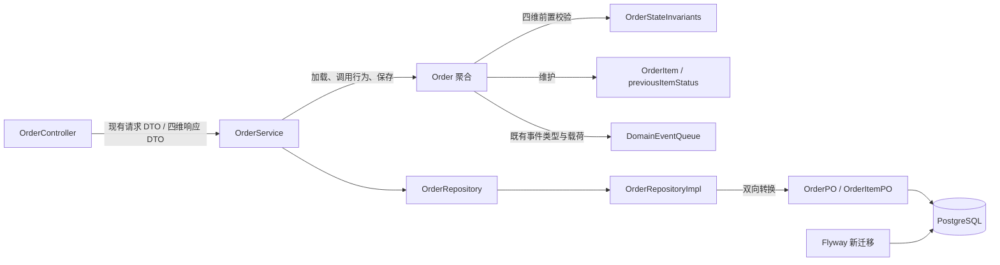
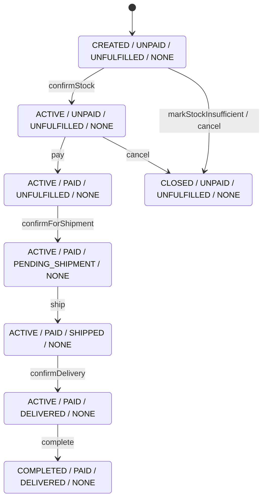

# 设计文档：订单状态多维化

> DDD 基座 API 已由 `docs/spec/changes/ddd-foundation-refactor/` 破坏性替换；下文代码示例中的聚合根、仓储与领域事件类型应以该规格和当前代码为准。

## 概述

本设计在现有订单聚合边界内，以 `TradeStatus`、`PaymentStatus`、`FulfillmentStatus`、`AfterSaleStatus` 直接替换 `OrderStatus`，并由聚合根统一校验四维状态与订单行项状态之间的不变量。方案遵循 `docs/steering/ddd-guidelines.md` 的聚合封装、领域错误、仓储转换及事件约束，以及 `docs/steering/tdd-guidelines.md` 的测试先行和分层验证要求；不拆分新聚合，不改变应用服务用例、URL、请求体或既有领域事件契约。

### 设计决策

| 决策 | 选择 | 理由 |
| --- | --- | --- |
| 状态模型 | 四个独立枚举直接替换 `OrderStatus` | 项目未上线，无需旧状态投影、双写或回填；四维事实可独立演进。 |
| 转换规则位置 | 删除通用 `OrderStatusTransitionRules`，在 `OrderImpl` 的各业务行为中显式校验完整前置组合，并用纯函数统一校验跨维度不变量 | 多维转换不是单一枚举的边，行为级前置条件比通用状态图更清晰；统一不变量校验防止行为和恢复路径产生非法组合。 |
| 售后摘要 | `AfterSaleStatus` 在每次合法退款操作后由“支付状态 + 全部行项状态”确定性重算 | 避免订单级 `previousStatus`；拒绝一个申请后，可根据仍在处理及已批准的行项得到唯一结果。 |
| 行项退款恢复 | 保留 `OrderItem.previousItemStatus` | 本特性只移除订单级前序状态；拒绝退款仍需恢复每个行项进入 `REFUNDING` 前的状态。 |
| 原子更新 | 所有前置条件、目标行项和候选聚合快照先验证，之后一次性提交字段变化并最后入队事件 | `Result` 失败时不允许状态、金额、时间、行项或事件队列发生部分变化。 |
| 聚合恢复 | `OrderImpl` 构造时执行统一不变量校验；非法组合以 `IllegalArgumentException` 拒绝构造/恢复 | 业务操作继续返回 `Result<_, BusinessError>`；持久化脏数据属于系统完整性错误，不能伪装成可恢复业务失败。 |
| 数据迁移 | 新增破坏性 Flyway 迁移，先清空订单行和订单数据，再新增四列、删除旧列及旧索引 | 不做含糊的旧状态推导，符合开发库允许丢弃订单数据的前提。 |
| 索引 | 为四个状态分别建立 `(状态列, create_time DESC)` B-tree 索引，保留买家及收货信息现有索引 | 满足按任一业务维度结合创建时间筛选/排序的要求，并避免建立组合爆炸式索引。 |
| API | `OrderResponse.status` 替换为四个非空字符串字段，值为枚举 `name` | 不保留旧字段或派生投影，列表与详情复用同一 DTO 映射。 |
| 并发与事件 | 保持现有仓储、事务和发布机制，不在本特性引入乐观锁、幂等键或修复漏发事件 | 这些属于已明确排除的范围；本设计只保证单次聚合调用的原子性和事件载荷回归。 |

## 架构



正向转换如下；未列出的组合均不得执行对应行为：



退款不覆盖上图中的交易、支付前事实或履约事实。申请时只把目标行设为 `REFUNDING` 并重算售后状态；批准时目标行转为 `CANCELED`，部分批准得到 `ACTIVE / PARTIALLY_REFUNDED / 原履约状态 / PARTIALLY_COMPLETED`，全量批准得到 `CLOSED / REFUNDED / 原履约状态 / COMPLETED`；拒绝时目标行恢复 `previousItemStatus` 并重算售后状态。

## 组件与接口

### 1. 四维状态枚举

位置：`j-store-order/src/main/kotlin/com/jstore/order/domain/order/`

新增四个文件并删除 `OrderStatus.kt`、`OrderStatusTransitionRules.kt`：

```kotlin
package com.jstore.order.domain.order

enum class TradeStatus { CREATED, ACTIVE, CLOSED, COMPLETED }
enum class PaymentStatus { UNPAID, PAID, PARTIALLY_REFUNDED, REFUNDED }
enum class FulfillmentStatus { UNFULFILLED, PENDING_SHIPMENT, SHIPPED, DELIVERED }
enum class AfterSaleStatus { NONE, PROCESSING, PARTIALLY_COMPLETED, COMPLETED }
```

### 2. `Order` 聚合接口

位置：`j-store-order/src/main/kotlin/com/jstore/order/domain/order/Order.kt`

删除 `val status: OrderStatus` 和 `val previousStatus: OrderStatus?`，其余行为签名保持不变，新增：

```kotlin
interface Order : AgreeGate<OrderId> {
    override val id: OrderId
    val buyerInfo: UserInfo
    val items: List<OrderItem>
    val recipientInfo: RecipientInfo
    val tradeStatus: TradeStatus
    val paymentStatus: PaymentStatus
    val fulfillmentStatus: FulfillmentStatus
    val afterSaleStatus: AfterSaleStatus
    val totalAmount: Price
    val actualPay: Price
    val createTime: LocalDateTime
    val updateTime: LocalDateTime

    fun pay(paidAmount: Price): Result<Unit, BusinessError>
    fun confirmStock(): Result<Unit, BusinessError>
    fun markStockInsufficient(reason: String): Result<Unit, BusinessError>
    fun confirmForShipment(): Result<Unit, BusinessError>
    fun ship(): Result<Unit, BusinessError>
    fun confirmDelivery(): Result<Unit, BusinessError>
    fun complete(): Result<Unit, BusinessError>
    fun cancel(reason: CancellationReason): Result<Unit, BusinessError>
    fun requestRefund(reason: RefundReason, itemIds: List<OrderItemId>): Result<Unit, BusinessError>
    fun approveRefund(itemIds: List<OrderItemId>): Result<Unit, BusinessError>
    fun rejectRefund(rejectReason: String, itemIds: List<OrderItemId>): Result<Unit, BusinessError>
}
```

### 3. `OrderImpl` 与统一不变量

位置：`j-store-order/src/main/kotlin/com/jstore/order/domain/order/OrderImpl.kt`

构造器直接接收四维状态，支持工厂创建和仓储恢复；不提供默认状态，避免恢复方遗漏持久化事实：

```kotlin
class OrderImpl(
    override val id: OrderId,
    override val buyerInfo: UserInfo,
    private val _items: MutableList<OrderItem>,
    override val recipientInfo: RecipientInfo,
    private var _tradeStatus: TradeStatus,
    private var _paymentStatus: PaymentStatus,
    private var _fulfillmentStatus: FulfillmentStatus,
    private var _afterSaleStatus: AfterSaleStatus,
    override val totalAmount: Price,
    private var _actualPay: Price,
    override val createTime: LocalDateTime = LocalDateTime.now(),
    private var _updateTime: LocalDateTime = LocalDateTime.now(),
) : Order
```

`init` 调用纯函数校验当前四维状态和 `_items`。在同文件内定义仅领域层可见的候选快照与校验函数：

```kotlin
internal data class OrderStateSnapshot(
    val tradeStatus: TradeStatus,
    val paymentStatus: PaymentStatus,
    val fulfillmentStatus: FulfillmentStatus,
    val afterSaleStatus: AfterSaleStatus,
    val itemStatuses: List<OrderItemStatus>,
)

internal object OrderStateInvariants {
    fun violations(state: OrderStateSnapshot): List<String>
    fun requireValid(state: OrderStateSnapshot)
}
```

`violations` 一次收集并检查以下规则：

- `CREATED` 必须搭配 `UNPAID / UNFULFILLED / NONE`。
- `UNPAID` 只允许 `UNFULFILLED`；`CLOSED + UNPAID` 必须搭配 `NONE`。
- `PENDING_SHIPMENT`、`SHIPPED`、`DELIVERED` 的支付状态只能是 `PAID`、`PARTIALLY_REFUNDED` 或 `REFUNDED`；退款不得重置已经发生的履约事实。
- `COMPLETED` 必须搭配 `PAID / DELIVERED / NONE`。
- `PARTIALLY_REFUNDED` 必须搭配 `PARTIALLY_COMPLETED`，至少一个行项为 `CANCELED`，且至少一个行项不是 `CANCELED`。
- `REFUNDED` 必须搭配 `CLOSED / COMPLETED`，且全部行项为 `CANCELED`。
- `PROCESSING` 必须至少有一个 `REFUNDING` 行项，且支付状态为 `PAID`。
- `PARTIALLY_COMPLETED` 必须搭配 `PARTIALLY_REFUNDED`，至少一个行项 `CANCELED` 且至少一个未取消；允许同时存在 `REFUNDING`。
- `COMPLETED`（售后）必须搭配 `REFUNDED`，全部行项为 `CANCELED`。
- `NONE` 不得存在 `REFUNDING` 行项；支付状态不得为 `PARTIALLY_REFUNDED` 或 `REFUNDED`。
- 空行项聚合视为非法；该约束与创建命令的现有非空规则一致。

退款摘要通过纯函数计算，不由调用方任意赋值：

```kotlin
private fun deriveAfterSaleStatus(
    paymentStatus: PaymentStatus,
    itemStatuses: List<OrderItemStatus>,
): AfterSaleStatus
```

计算优先级固定为：`REFUNDED -> COMPLETED`；`PARTIALLY_REFUNDED -> PARTIALLY_COMPLETED`；否则存在 `REFUNDING -> PROCESSING`；否则 `NONE`。因此部分退款已批准后，即使另有申请处理中，摘要仍为 `PARTIALLY_COMPLETED`。

各行为使用“验证—候选状态—候选不变量—提交—事件”模板：

1. 验证完整四维前置状态及命令集合，使用 `associateBy` 一次解析全部目标行项；拒绝空集合、非本订单行项、重复 ID（重复 ID 按同一行项被重复操作，返回 `REFUND_ITEM_INVALID_STATE`）及非法行项状态。
2. 在局部变量中计算候选四维状态、候选行项状态、金额、`requireReturn` 和事件参数；`requireReturn = fulfillmentStatus == SHIPPED || fulfillmentStatus == DELIVERED`，必须在提交任何终态前计算。
3. 对候选 `OrderStateSnapshot` 调用 `violations`；如不合法，返回 `OrderErrors.ILLEGAL_STATE.msg(...)`。
4. 仅在全部验证通过后修改状态、行项、`actualPay`（仅支付）、`updateTime`；最后发布原事件。

具体前置与结果：

| 行为 | 合法前置 | 四维结果及既有副作用 |
| --- | --- | --- |
| `confirmStock` | `CREATED / UNPAID / UNFULFILLED / NONE` | 仅 `tradeStatus=ACTIVE`；更新时间。 |
| `markStockInsufficient` | `CREATED / UNPAID / UNFULFILLED / NONE` | `tradeStatus=CLOSED`；保持现有行项行为（即不改行项）；更新时间；`OrderCancelledEvent`。 |
| `pay` | `ACTIVE / UNPAID / UNFULFILLED / NONE` | `paymentStatus=PAID`；更新 `actualPay`、时间；`OrderPaidEvent` 载荷不变。 |
| `confirmForShipment` | `ACTIVE / PAID / UNFULFILLED / NONE` | `fulfillmentStatus=PENDING_SHIPMENT`；更新时间；保持现有不改行项行为。 |
| `ship` | `ACTIVE / PAID / PENDING_SHIPMENT / NONE` | `fulfillmentStatus=SHIPPED`；所有行项设 `SHIPPING`；更新时间；`OrderShippedEvent`。 |
| `confirmDelivery` | `ACTIVE / PAID / SHIPPED / NONE` | `fulfillmentStatus=DELIVERED`；所有行项设 `SHIPPING_FINISHED`；更新时间。 |
| `complete` | `ACTIVE / PAID / DELIVERED / NONE` | `tradeStatus=COMPLETED`；更新时间；`OrderCompletedEvent`。 |
| `cancel` | `tradeStatus` 为 `CREATED` 或 `ACTIVE`，并且 `UNPAID / UNFULFILLED / NONE` | `tradeStatus=CLOSED`；所有行项设 `CANCELED`；更新时间；`OrderCancelledEvent`。 |
| `requestRefund` | `tradeStatus=ACTIVE`，支付为 `PAID` 或 `PARTIALLY_REFUNDED`，履约为 `UNFULFILLED`、`PENDING_SHIPMENT` 或 `DELIVERED`，售后为 `NONE`、`PROCESSING` 或 `PARTIALLY_COMPLETED`；目标行既非 `REFUNDING` 也非 `CANCELED` | 目标行 `enterRefunding()`；支付、交易、履约不变；重算售后；更新时间；`OrderRefundRequestedEvent`。不扩大为 `SHIPPED` 可申请退款。 |
| `approveRefund` | `tradeStatus=ACTIVE`，售后为 `PROCESSING` 或 `PARTIALLY_COMPLETED`，目标行全部为 `REFUNDING` | 目标行 `markCanceled()`；若全部行取消则 `CLOSED / REFUNDED / 原履约 / COMPLETED`，否则 `ACTIVE / PARTIALLY_REFUNDED / 原履约 / PARTIALLY_COMPLETED`；更新时间；`OrderRefundApprovedEvent`。 |
| `rejectRefund` | `tradeStatus=ACTIVE`，售后为 `PROCESSING` 或 `PARTIALLY_COMPLETED`，目标行全部为 `REFUNDING` | 目标行 `restoreFromRefunding()`；交易、支付、履约不变；重算售后；更新时间；`OrderRefundRejectedEvent`。 |

任何 `tradeStatus=CLOSED/COMPLETED` 或 `afterSaleStatus=COMPLETED` 的聚合均拒绝后续正向、取消和退款行为。退款中的订单也拒绝正向行为，因为上述正向前置均要求 `afterSaleStatus=NONE`。

### 4. `OrderFactory`

位置：`j-store-order/src/main/kotlin/com/jstore/order/domain/order/OrderFactory.kt`

`OrderFactory` 接口和 `create(cmd: OrderCreateCMD): Result<Order, BusinessError>` 不变。构造 `OrderImpl` 时显式传入：

```kotlin
_tradeStatus = TradeStatus.CREATED
_paymentStatus = PaymentStatus.UNPAID
_fulfillmentStatus = FulfillmentStatus.UNFULFILLED
_afterSaleStatus = AfterSaleStatus.NONE
```

金额、商品/地址快照和 `OrderCreatedEvent` 均保持现有行为。

### 5. 应用服务与领域事件

`OrderService`、库存事件处理器和所有 command 的公开签名不变。服务仍执行“加载聚合 → 调用行为 → 成功后保存 → 按现有路径发布事件”，不新增状态判断。`OrderDomainEvent.kt` 中全部事件类、`@DomainEventType` 名称、版本和字段保持字节级 API 结构不变；测试只回归类型和关键载荷。

### 6. 仓储与转换器

位置：

- `j-store-order-infrastructure/src/main/kotlin/com/jstore/order/domain/order/persistence/OrderPO.kt`
- `j-store-order-infrastructure/src/main/kotlin/com/jstore/order/domain/order/OrderRepositoryImpl.kt`

`OrderPO` 删除 `status`、`previousStatus`，新增：

```kotlin
@Enumerated(EnumType.STRING)
@Column(name = "trade_status", nullable = false, length = 32)
var tradeStatus: TradeStatus = TradeStatus.CREATED

@Enumerated(EnumType.STRING)
@Column(name = "payment_status", nullable = false, length = 32)
var paymentStatus: PaymentStatus = PaymentStatus.UNPAID

@Enumerated(EnumType.STRING)
@Column(name = "fulfillment_status", nullable = false, length = 32)
var fulfillmentStatus: FulfillmentStatus = FulfillmentStatus.UNFULFILLED

@Enumerated(EnumType.STRING)
@Column(name = "after_sale_status", nullable = false, length = 32)
var afterSaleStatus: AfterSaleStatus = AfterSaleStatus.NONE
```

`Converter.toPO` 逐一映射四维状态；`Converter.toDomain` 将四列原样传给 `OrderImpl`，由构造器统一校验。`OrderItemPO.previousItemStatus` 及所有非状态字段保持不变。

### 7. API 响应

位置：`j-store-boot/src/main/kotlin/com/jstore/order/controller/OrderController.kt`

请求 DTO、URL、HTTP 方法、认证注解及错误响应保持不变。响应 DTO 修改为：

```kotlin
data class OrderResponse(
    val id: Long,
    val buyerUid: Long,
    val tradeStatus: String,
    val paymentStatus: String,
    val fulfillmentStatus: String,
    val afterSaleStatus: String,
    val totalAmount: Long,
    val actualPay: Long,
    val items: List<OrderItemResponse>,
    val createTime: LocalDateTime,
    val updateTime: LocalDateTime,
)
```

`Order.toOrderResponse()` 分别使用四个枚举的 `.name`，彻底删除订单级 `status`；`OrderItemResponse.status` 继续返回行项状态名称。详情、分页及创建响应均复用该转换函数。账号昵称和已验证手机号按 `user-profile-query` 规格仅保留为交易内部快照，不进入公开响应。

## 数据模型

### 领域模型

```text
OrderImpl
├── tradeStatus: TradeStatus
├── paymentStatus: PaymentStatus
├── fulfillmentStatus: FulfillmentStatus
├── afterSaleStatus: AfterSaleStatus
└── items: List<OrderItem>
    ├── status: OrderItemStatus
    └── previousItemStatus: OrderItemStatus?  // 仅行项退款拒绝恢复
```

订单级没有 `status`、`previousStatus` 或旧状态投影。批准退款不会减少 `actualPay`，因为金额模型和真实退款到账不在本特性范围；`PaymentStatus.PARTIALLY_REFUNDED/REFUNDED` 表示退款已批准。

### 持久化模型与 DDL

新增 `j-store-boot/src/main/resources/db/migration/V20260731__order_status_dimensions.sql`。迁移顺序固定如下：

```sql
-- 仅适用于未上线开发环境：放弃现有订单数据，避免错误状态推导。
DELETE FROM order_items;
DELETE FROM orders;

DROP INDEX IF EXISTS idx_orders_status_create_time;

ALTER TABLE orders
    DROP COLUMN IF EXISTS previous_status,
    DROP COLUMN IF EXISTS status,
    ADD COLUMN trade_status VARCHAR(32) NOT NULL DEFAULT 'CREATED',
    ADD COLUMN payment_status VARCHAR(32) NOT NULL DEFAULT 'UNPAID',
    ADD COLUMN fulfillment_status VARCHAR(32) NOT NULL DEFAULT 'UNFULFILLED',
    ADD COLUMN after_sale_status VARCHAR(32) NOT NULL DEFAULT 'NONE';

ALTER TABLE orders
    ADD CONSTRAINT chk_orders_trade_status
        CHECK (trade_status IN ('CREATED', 'ACTIVE', 'CLOSED', 'COMPLETED')),
    ADD CONSTRAINT chk_orders_payment_status
        CHECK (payment_status IN ('UNPAID', 'PAID', 'PARTIALLY_REFUNDED', 'REFUNDED')),
    ADD CONSTRAINT chk_orders_fulfillment_status
        CHECK (fulfillment_status IN ('UNFULFILLED', 'PENDING_SHIPMENT', 'SHIPPED', 'DELIVERED')),
    ADD CONSTRAINT chk_orders_after_sale_status
        CHECK (after_sale_status IN ('NONE', 'PROCESSING', 'PARTIALLY_COMPLETED', 'COMPLETED'));

CREATE INDEX idx_orders_trade_status_create_time
    ON orders(trade_status, create_time DESC);
CREATE INDEX idx_orders_payment_status_create_time
    ON orders(payment_status, create_time DESC);
CREATE INDEX idx_orders_fulfillment_status_create_time
    ON orders(fulfillment_status, create_time DESC);
CREATE INDEX idx_orders_after_sale_status_create_time
    ON orders(after_sale_status, create_time DESC);
```

不修改已存在的 baseline 文件和 `db/init` 快照；Flyway 从 baseline 后顺序执行新迁移。现有 `idx_orders_buyer_uid`、`idx_orders_recipient_info` 和行项索引继续保留。数据库约束保护枚举取值，涉及行项的跨表不变量由聚合恢复校验保护；不引入触发器或重复领域规则。

### API 数据格式示例

```json
{
  "id": 10001,
  "buyerUid": 20001,
  "tradeStatus": "ACTIVE",
  "paymentStatus": "PARTIALLY_REFUNDED",
  "fulfillmentStatus": "DELIVERED",
  "afterSaleStatus": "PARTIALLY_COMPLETED",
  "totalAmount": 3000,
  "actualPay": 3000,
  "items": [
    { "id": 1, "skuId": 11, "spuId": 10, "goodsName": "商品", "skuDescription": "红色", "quantity": 1, "unitPrice": 1000, "status": "CANCELED" }
  ],
  "createTime": "2026-07-31T10:00:00",
  "updateTime": "2026-07-31T11:00:00"
}
```

## 事务与并发边界

- 本特性不改变事务放置：聚合行为自身不启动事务；`OrderRepositoryImpl`/现有应用装配继续承担保存边界，传播级别和回滚行为沿用现状。一次用例只修改一个 `Order` 聚合。
- 预期业务失败使用 `Failure<BusinessError>`，应用服务在失败时不调用 `save`。聚合方法在首次写字段前完成全部校验，因此即使调用方继续持有同一实例，失败后观察到的状态、行项、金额、时间和事件队列均与调用前一致。
- 构造或持久化恢复发现不变量冲突时抛出 `IllegalArgumentException`，阻止非法聚合进入应用服务；不捕获并转换为业务错误，也不保存修复后的猜测状态。
- 不新增 `@Version`、悲观锁或幂等键。两个并发请求仍遵循项目当前的最后写入者行为；并发控制演进属于本需求明确排除的范围。
- 与库存、支付、仓储及会计上下文的边界继续使用现有领域事件。事件名称、版本、载荷和现有发布时机不变；本特性不修复当前应用服务中与状态拆分无关的事件发布遗漏。
- 迁移本身在 Flyway 管理的单个迁移事务中执行；若 DDL 或数据清理失败则整次迁移回滚。迁移前提是开发环境允许订单数据丢失，不提供回滚数据或恢复脚本。

## 正确性属性

### Property 1: 新订单状态唯一且合法
*For any* 合法创建命令及其商品、地址查询结果，工厂产生的订单必须为 `CREATED / UNPAID / UNFULFILLED / NONE`，不包含订单级前序状态，并满足全部不变量。
**验证需求：1.1, 1.2, 1.3, 1.4, 1.5, 1.6, 1.7, 1.8**

### Property 2: 正向流程逐维推进
*For any* 合法初始订单，按 `confirmStock → pay → confirmForShipment → ship → confirmDelivery → complete` 执行时，每步只改变规定的状态维度，并保持既有金额、行项、时间和事件副作用。
**验证需求：2.1, 2.2, 2.3, 2.4, 2.5, 2.6, 2.8**

### Property 3: 非法正向操作完全原子
*For any* 不满足某一正向操作完整前置组合的聚合，该操作返回 `Order.State.Invalid`，且四维状态、行项、金额、更新时间及领域事件队列与调用前相等。
**验证需求：2.7, 3.4, 5.8, 8.1, 8.3**

### Property 4: 未支付取消保持售后清洁
*For any* `CREATED` 或 `ACTIVE` 且 `UNPAID / UNFULFILLED / NONE` 的订单，合法取消后必须为 `CLOSED / UNPAID / UNFULFILLED / NONE`；买家取消将全部行项置为 `CANCELED`，库存不足取消保持既有行项行为，两者事件契约不变。
**验证需求：3.1, 3.2, 3.3, 3.5**

### Property 5: 退款申请不覆盖正向事实
*For any* 允许退款的 `PAID` 或 `PARTIALLY_REFUNDED` 订单及合法目标行项集合，首次或后续申请后交易、支付和履约状态不变，目标行项进入 `REFUNDING`，售后摘要按批准历史得到 `PROCESSING` 或 `PARTIALLY_COMPLETED`，且 `requireReturn` 仅由履约状态决定。
**验证需求：4.1, 4.2, 4.9, 4.10**

### Property 6: 部分与全部退款批准确定性收敛
*For any* 含一个或多个 `REFUNDING` 行项的合法订单，批准任意合法子集后，若仍有未取消行项则为 `ACTIVE / PARTIALLY_REFUNDED / 原履约 / PARTIALLY_COMPLETED`；若全部取消则为 `CLOSED / REFUNDED / 原履约 / COMPLETED`，其中 `UNFULFILLED`、`PENDING_SHIPMENT`、`SHIPPED` 或 `DELIVERED` 均保持原值，并且批准事件的 `requireReturn` 不受提交顺序影响。
**验证需求：4.3, 4.4, 4.9, 5.3, 5.5, 5.6, 8.9**

### Property 7: 退款拒绝只恢复目标行项
*For any* 合法退款处理中订单及合法拒绝子集，拒绝后目标行项恢复其 `previousItemStatus`，其他行项不变；仍有处理中行项时保留相应摘要，无处理中行项时根据是否已有批准退款收敛为 `NONE` 或 `PARTIALLY_COMPLETED`，三个正向维度不被恢复或覆盖。
**验证需求：4.5, 4.6, 4.7, 4.9**

### Property 8: 非法退款集合完全原子
*For any* 空、重复、包含外部行项或包含非法行项状态的退款目标集合，请求、批准或拒绝均返回既有对应业务错误，且聚合全部可观察状态和事件队列不变。
**验证需求：4.8, 8.3**

### Property 9: 所有公开行为与恢复结果满足跨维度不变量
*For any* 可由公开领域行为到达或由 PO 转换恢复的订单，必须满足 `OrderStateInvariants` 的全部规则；任一违反规则的构造或恢复输入必须被拒绝。
**验证需求：5.1, 5.2, 5.3, 5.4, 5.5, 5.6, 5.7, 5.8, 5.9, 8.2**

### Property 10: 四维状态持久化往返等价
*For any* 合法订单状态组合及合法金额、时间、收货信息、行项状态和行项前序状态，`Order → OrderPO → Order` 后所有这些字段保持等价，且转换路径不读写旧状态字段。
**验证需求：7.5, 7.7, 8.5**

### Property 11: API 仅暴露四维订单状态
*For any* 详情、创建或分页响应及业务操作后的查询响应，JSON 包含四个枚举名称字段，不包含订单级 `status`，同时保留行项 `status` 和其他既有契约。
**验证需求：6.1, 6.2, 6.3, 6.4, 6.5, 8.6**

### Property 12: 迁移建立唯一新结构
*For any* 从当前 baseline 启动的空开发数据库，执行全部 Flyway 迁移后，四列具有正确类型、默认值、非空和枚举约束，旧两列及旧索引不存在，四个状态时间索引存在。
**验证需求：7.1, 7.2, 7.3, 7.4, 7.6, 8.4**

### Property 13: 领域事件契约保持不变
*For any* 合法创建、支付、取消、发货、完成、退款申请、批准或拒绝操作，产生的事件类型、事件名、版本及原有关键载荷与拆分前契约一致。
**验证需求：2.8, 3.2, 3.3, 4.9, 8.7**

## 错误处理

### 错误常量定义

本特性不新增错误码，继续使用 `OrderErrors`：

| 常量 | 错误码 | 使用场景 |
| --- | --- | --- |
| `ILLEGAL_STATE` | `Order.State.Invalid` | 四维前置不满足、候选状态违反不变量、终态继续操作。 |
| `REFUND_ITEMS_EMPTY` | `Order.Refund.ItemsEmpty` | 退款行项集合为空。 |
| `REFUND_ITEM_NOT_FOUND` | `Order.Refund.ItemNotFound` | 目标行项不属于当前订单。 |
| `REFUND_ITEM_INVALID_STATE` | `Order.Refund.ItemInvalidState` | 行项状态不允许当前退款行为，或目标 ID 重复。 |

既有 command 校验错误、`ORDER_NOT_FOUND` 和其他错误不变。

### 错误场景与处理策略

| 场景 | 处理 |
| --- | --- |
| 业务操作前置组合非法 | 在任何写入前返回 `Failure(OrderErrors.ILLEGAL_STATE.msg(...))`。消息同时列出当前四维枚举名称与操作名。 |
| 退款集合非法 | 按“空集合 → 重复 ID → 非本订单 → 行项状态”顺序确定唯一错误；不写入任何字段。 |
| 候选快照违反不变量 | 返回 `ILLEGAL_STATE`；此分支代表行为实现与模型约束冲突，仍不提交候选变化。 |
| 构造/PO 恢复违反不变量 | `requireValid` 抛出 `IllegalArgumentException`，消息包含全部 violation；阻止脏数据继续流转。 |
| 数据库枚举约束失败 | 由 JPA/数据库异常按现有基础设施异常机制向上抛出并回滚，不转换为业务错误。 |

### 错误传播策略

领域行为继续返回 `Result<Unit, BusinessError>`；`OrderService` 使用现有 `onFailure { return Failure(it) }` 原样传播并跳过保存及事件发布；Controller 继续把 `BusinessError.httpCode/message/errorCode` 映射为现有 `ErrorResponse`。构造恢复异常属于不可恢复的数据完整性故障，不通过 Controller 的业务错误格式隐藏。

### 错误处理原则

- 先完整验证、后修改、最后发事件。
- 对相同输入保持确定性的错误优先级。
- 不通过默认值、旧状态推导或静默修复掩盖非法持久化数据。
- 不为状态拆分之外的问题新增错误码或改变 HTTP 响应格式。

## 测试策略

严格按 TDD：先新增失败测试，再实现最小变更，最后重构。领域测试使用 Kotest `FunSpec`、matchers 和 Kotest property；基础设施转换测试沿用直接调用 `OrderRepositoryImpl.Converter` 的方式。若 Boot 模块当前缺少 Web 测试依赖，则在其既有 Spring Boot/JUnit Platform 测试栈内增加最窄的 Jackson DTO 序列化或 MockMvc 契约测试，不引入新的测试框架。

### 属性测试（Property-Based Testing）

| 测试主题 | 生成范围 | 验证属性 | 需求 |
| --- | --- | --- | --- |
| 非法四维组合 | 四个枚举笛卡尔积 + 有意义的非空行项状态集合 | 非法组合构造失败，合法组合通过统一校验 | 5.1-5.9, 8.2 |
| 非法转换原子性 | 合法聚合状态生成器 × 不适用操作 | 返回 `ILLEGAL_STATE`，完整快照及事件队列不变 | 2.7, 3.4, 8.3 |
| 退款子集批准/拒绝 | 2-8 个行项、合法非空子集、批准/处理中组合 | 摘要推导、部分/全部收敛、非目标行不变 | 4.3-4.8, 5.5-5.7 |
| PO 往返 | 所有可持久化合法四维组合、行项恢复状态、金额和时间 | `toPO/toDomain` 字段等价 | 7.5, 7.7, 8.5 |

生成器不得产生空订单或与测试目的无关的随机字符串；对枚举组合使用穷举或受控 `Arb`，固定迭代次数并在失败时保留 Kotest shrink 结果。

### 单元测试（Example-Based）

建议新增 `OrderStatusDimensionsUnitTest.kt`、`OrderRefundStatusUnitTest.kt`，并更新现有订单工厂/收货信息测试中的构造参数。

| 场景 | 核心断言 | 需求 |
| --- | --- | --- |
| 工厂创建 | 四维初始值及创建事件 | 1.7, 8.7 |
| 每一步正向流程 | 前后四维、行项、金额、时间、事件 | 2.1-2.8 |
| CREATED/ACTIVE 未支付取消与库存不足 | 终态、行项差异、取消事件 | 3.1-3.5 |
| 已支付未发货申请退款 | `PROCESSING`、`requireReturn=false`、正向维度不变 | 4.1, 4.2 |
| 已签收申请退款 | `requireReturn=true`、履约仍为 `DELIVERED` | 4.1, 4.2 |
| 多行项部分批准 | `PARTIALLY_REFUNDED/PARTIALLY_COMPLETED` | 4.3 |
| 部分批准后的后续申请 | 接受剩余合法行项，保持 `PARTIALLY_REFUNDED/PARTIALLY_COMPLETED` | 4.10, 8.1 |
| 最后一项批准 | `CLOSED/REFUNDED/COMPLETED` 且 `requireReturn` 正确 | 4.4 |
| 各履约阶段全额退款 | `UNFULFILLED/PENDING_SHIPMENT/SHIPPED/DELIVERED` 分别保持原值 | 4.4, 5.3, 8.9 |
| 部分拒绝及全部拒绝 | 剩余处理中、无批准回到 `NONE`、有批准保持部分完成 | 4.5-4.7 |
| 空、重复、外部、错误状态行项 | 指定错误且完整快照不变 | 4.8, 8.3 |
| 终态操作 | 所有正向、取消、退款均失败 | 3.4, 5.8 |
| 事件回归 | 类型、`eventName`、版本、金额、原因、ID、`requireReturn` | 8.7 |

### 集成测试

| 层次 | 测试方式 | 验证内容 | 需求 |
| --- | --- | --- | --- |
| Flyway/PostgreSQL | 受影响 Boot/基础设施模块的真实 PostgreSQL 测试（沿用项目可用容器或测试库配置） | `information_schema.columns`、`column_default`、nullable、check constraints、`pg_indexes`；旧列/索引不存在 | 7.1-7.4, 7.6, 8.4 |
| JPA/Converter | `j-store-order-infrastructure` 窄集成测试及转换属性测试 | 四维枚举持久化、行项 `previousItemStatus`、金额/时间/JSON 收货信息往返；非法恢复失败 | 7.5, 7.7, 8.5 |
| Controller 契约 | Boot 层 JSON/MockMvc 测试 | 创建、详情、分页和操作后查询含四字段、不含订单级 `status`，行项 `status` 仍存在，错误 DTO 不变 | 6.1-6.5, 8.6 |
| 模块回归 | Gradle | `:j-store-order:test`、`:j-store-order-infrastructure:test`、`:j-store-boot:test`，最后执行受影响的全量 `test` | 8.8 |

## 文件影响清单

| 动作 | 文件 |
| --- | --- |
| 新增 | `TradeStatus.kt`、`PaymentStatus.kt`、`FulfillmentStatus.kt`、`AfterSaleStatus.kt` |
| 删除 | `OrderStatus.kt`、`OrderStatusTransitionRules.kt` |
| 修改 | `Order.kt`、`OrderImpl.kt`、`OrderFactory.kt` |
| 修改 | `OrderPO.kt`、`OrderRepositoryImpl.kt` |
| 修改 | `OrderController.kt` |
| 新增 | `j-store-boot/src/main/resources/db/migration/V20260731__order_status_dimensions.sql` |
| 修改/新增测试 | `j-store-order/src/test/.../order/`、`j-store-order-infrastructure/src/test/.../order/`、`j-store-boot/src/test/.../order/` 中与状态、转换、迁移和响应契约相关的测试 |

## 风险与缓解

| 风险 | 缓解 |
| --- | --- |
| 四维组合增加，某行为漏验一个维度 | 每个行为使用完整前置组合，并对所有公开行为的候选快照执行同一不变量函数；用组合属性测试覆盖。 |
| 退款批准时先改终态导致 `requireReturn` 丢失 | 在任何提交前从当前 `fulfillmentStatus` 计算并保存局部 `requireReturn`。 |
| 行项 `CANCELED` 同时表达未支付取消和退款批准 | 订单级 `PaymentStatus` 区分来源；售后摘要只在已支付退款路径按支付状态和行项重算。 |
| 迁移清空开发订单数据 | SQL 明确标注破坏性前提，只删除 `order_items`/`orders`；部署前由开发环境接受该前提，不用于生产升级。 |
| Hibernate 枚举字符串与数据库约束漂移 | 枚举、DDL CHECK 和迁移元数据测试保持一一对应。 |
| API 破坏性变化影响本地调用方 | 已由“未上线、无兼容”决策接受；Controller 契约测试明确禁止旧 `status`。 |
| 当前并发写入可能覆盖 | 本特性不扩大范围；在设计中显式记录不引入锁或幂等，后续单独演进。 |
