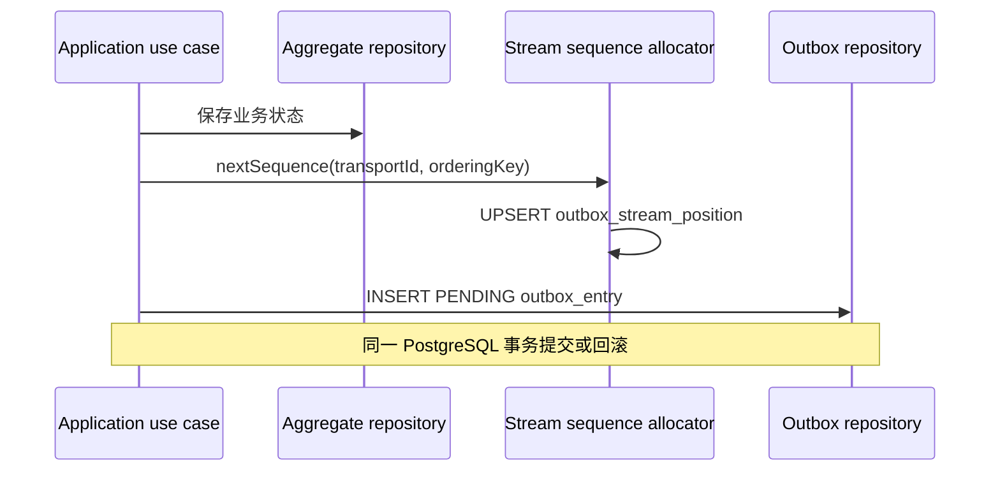
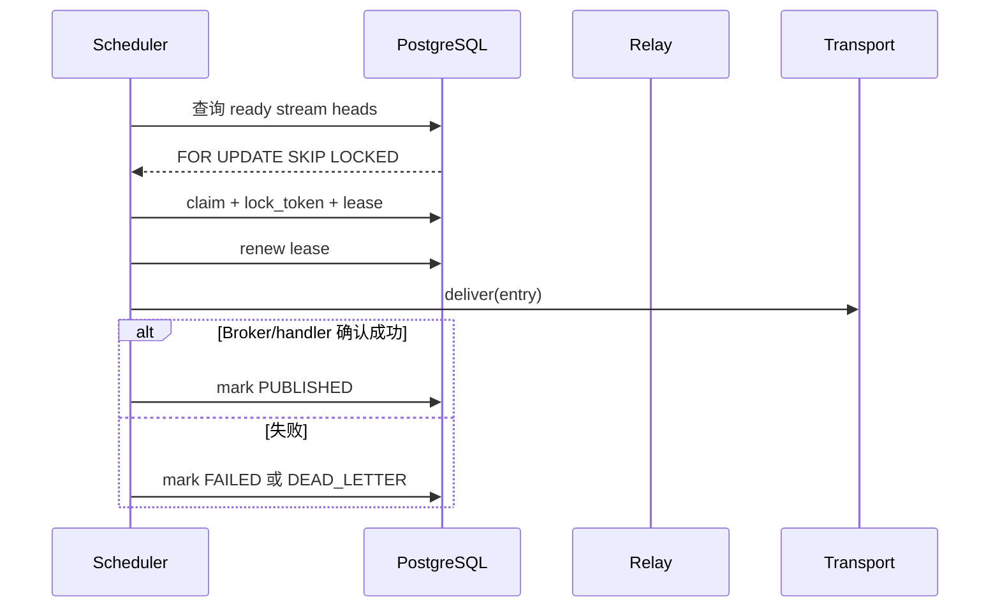
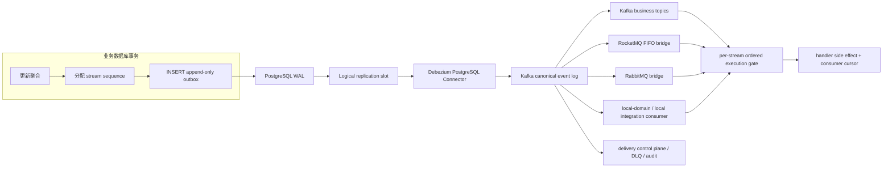

# Transactional Outbox 与 CDC 扩展性研究报告

## 文档定位

- 文档性质：候选架构研究，不描述已经落地的运行时事实。
- 研究日期：2026-08-10。
- 适用范围：j-store 的领域事件、集成消息、Transactional Outbox、可插拔 transport 和未来微服务部署。
- 当前实现基线：数据库 polling relay、按 `(transportId, orderingKey)` 分流、数据库原子分配 `sequenceNo`、至少一次投递、租约、fencing、重试、死信和审计。
- 决策状态：推荐方向，尚未批准为实现规格；实施前应为 CDC 演进建立独立 requirement、design、tasks 和验证证据。

## 执行摘要

j-store 当前 Transactional Outbox 的一致性设计是正确的：业务状态、顺序号推进和 Outbox 记录处于同一 PostgreSQL 事务，relay 只领取每个 ordering stream 的头部消息，重试或死信不能被后继消息越过。该实现适合模块化单体和中等吞吐阶段，并且是后续演进的重要可靠性基线。

随着业务量和 transport 数量增长，当前实现可能产生明显的数据库写放大。每条、每个 transport 的消息除业务写入外，通常还包含顺序号 UPSERT、Outbox INSERT、claim UPDATE、续租 UPDATE、成功或失败 UPDATE，以及最终清理 DELETE；调度器还需要持续扫描候选记录、前驱记录、过期锁和状态指标。数据库因此同时承担业务事实存储、消息队列调度和投递控制面三种职责。

本报告推荐的目标方向是：

> 保留事务内的 append-only Outbox，通过 PostgreSQL WAL/Logical Decoding 和 Debezium 捕获已提交记录，写入 canonical event log；将投递重试、多 transport 扇出、死信和运维状态迁移到 Broker 与独立控制面。

这个方向不会取消 Transactional Outbox。它只改变 Outbox 记录提交之后的提取方式：由应用定时查询表，变为 CDC 顺序读取数据库事务日志。业务事务与消息意图仍然原子提交，故障恢复仍然是至少一次，消费端仍然依赖稳定 message ID 幂等。

在超大流量场景下，还应把业务数据与 Outbox 按订单、租户或商户键共同分片，每个业务分片拥有独立 CDC 管道，避免所有写流量集中在一个 PostgreSQL primary。公开的阿里巴巴材料支持“日志订阅、细粒度有序队列、分布式数据库、单元化和流量整形”这一组合方向，但没有公开证据可以证明淘宝内部采用了某一张特定结构的 Outbox 表。因此，本报告只从公开一手材料提取可验证的架构原则，不推断未公开实现细节。

## 研究问题

本报告回答以下问题：

1. 当前 polling Outbox 的数据库压力来自哪里？
2. CDC 是否能够保留当前 Transactional Outbox 的核心语义？
3. 怎样保证同订单或同领域流的严格顺序不会被重试破坏？
4. 怎样只阻塞失败流而不阻塞整个 transport？
5. 引入 CDC 需要哪些基础设施和运维能力？
6. Kafka、RocketMQ 事务消息、RocketMQ FIFO、数据库分片和 Event Sourcing 各自适合什么边界？
7. j-store 应采用什么渐进式迁移路线？

## 术语

### Transactional Outbox

业务事务在修改聚合状态的同时，将待发布消息作为 Outbox 记录写入同一数据库事务。事务提交则两者同时存在，事务回滚则两者同时不存在。它解决的是“业务数据库提交成功但消息没有发送”或“消息发送成功但业务事务回滚”的双写不一致问题。

Transactional Outbox 不等于数据库 polling。Outbox 定义原子记录消息意图的方式；polling 和 CDC 是提取已提交 Outbox 记录的两种不同机制。

### Polling

后台任务周期性查询 Outbox 表，领取可投递记录并更新状态。多实例通常需要：

- `FOR UPDATE SKIP LOCKED`；
- worker identity；
- lease；
- fencing token；
- `PENDING/IN_PROGRESS/FAILED/PUBLISHED/DEAD_LETTER` 状态机；
- 指数退避；
- 已发布记录清理。

### CDC

CDC 是 Change Data Capture，即变更数据捕获。PostgreSQL 会把事务变更写入 WAL；Logical Decoding 可以将已提交的行变更输出给外部消费者。Debezium 使用 replication slot 记录读取位置，并把变更转换为 Kafka 等消息系统可以消费的记录。

### Canonical event log

数据库变更被 CDC 捕获后首先进入的统一、持久化消息日志。它不是某个具体下游 transport 的瞬时发送队列，而是后续本地消费、Kafka 业务 Topic、RocketMQ、RabbitMQ 或其它目标的共同上游。

### Ordering stream

j-store 的顺序边界是 `(transportId, orderingKey)`：

- 领域事件通常按 `<aggregateType, aggregateId>` 生成 ordering key；
- 集成消息通常按 `<destination, partitionKey>` 生成 ordering key；
- 不同 ordering stream 可以并行；
- 同一 stream 内前序消息未完成时，后继消息不得执行。

## 当前架构基线

### 发布路径

当前领域事件或集成消息发布发生在业务事务内：



`outbox_stream_position` 使用 `(transport_id, ordering_key)` 作为主键。它不是所有消息共享的全局序列，因此不同订单不会争抢同一行；同一订单流的串行化是严格顺序的必要成本。

### Polling relay 路径



claim 查询中的前驱屏障检查同一 `transport_id + ordering_key` 下是否存在序号更小且非 `PUBLISHED` 的记录。该机制保证重试和死信不会被后继消息越过，同时不会阻塞其它 ordering stream。

### 当前语义资产

以下能力属于必须保护的架构资产，而不是迁移时可以顺便删除的实现细节：

- 业务状态和消息意图原子提交；
- at-least-once，不承诺端到端 exactly-once；
- 稳定 message/event ID；
- 稳定 transport 目标，不因后续配置变化重新解释历史消息；
- `(transportId, orderingKey)` 内严格顺序；
- 重试或死信阻塞本流后继；
- 不同 ordering stream 并行和故障隔离；
- 消费端幂等；
- sequence gap 检测；
- 死信重入队需要操作者、原因和审计；
- 不允许静默跳过消息，除非未来引入显式 skip-marker/tombstone 协议。

## 当前数据库压力模型

### 单消息写放大

当前成功投递一条消息时，Outbox 子系统通常至少包含：

1. 一次 `outbox_stream_position` UPSERT；
2. 一次 `outbox_entry` INSERT；
3. 一次 claim UPDATE；
4. 一次投递前 lease renewal UPDATE；
5. 一次 `PUBLISHED` UPDATE；
6. 一次延后的 DELETE。

失败消息还会产生额外的 `FAILED/DEAD_LETTER` 更新和多轮 claim/renew。配置多个 transport 时，当前设计为每个目标分别创建 Outbox 记录和独立顺序号，因此成本基本随目标数量线性增长。

这不是精确容量预测。实际 WAL 字节、索引放大、缓存命中、HOT update、autovacuum 和磁盘延迟必须通过 PostgreSQL 压测获得。但从结构上可以判断，当前成功消息至少经历多次数据库变更，而 append-only CDC 路径只需要事务内持久化消息意图。

### 查询与索引压力

数据库还需要承担：

- 周期性空轮询；
- ready candidate 扫描；
- predecessor `NOT EXISTS` 判断；
- `SKIP LOCKED` 并发领取；
- 过期 lease 扫描；
- 状态数量和 oldest-ready lag 查询；
- published history 清理；
- UPDATE/DELETE 产生的 dead tuple 与 autovacuum。

当 Broker 故障时，业务写入可能仍然持续，而 relay 会反复领取和失败。此时数据库既保存不断增长的积压，又承担重试调度，是最容易出现正反馈压力的阶段。

### 顺序号表是否是热点

当前 allocator 不是全局单行计数器。正常情况下，每个订单或聚合拥有自己的 position row，所以主要成本是额外写入和索引空间，而不是跨订单锁争用。

如果某一个 ordering key 极热，该行必然串行。但在要求该 stream 严格顺序的前提下，这种串行化不能被完全消除，只能：

- 缩小 ordering key 的业务边界；
- 确保不存在不必要的全局 key；
- 将排队从 OLTP 锁竞争迁移到顺序日志或 Broker message group；
- 在业务允许时重新定义可以并行的子流。

### 单 PostgreSQL primary 的长期上限

CDC 可以显著减少 Outbox 调度写放大，但不能消除业务数据库本身的写入上限。以下条件同时出现时，数据库仍可能成为主要承压节点：

- 所有有界上下文共享一个 primary；
- 订单、库存、支付、履约和会计写流量共同增长；
- 大量索引和外键增加每次写入成本；
- 热门 SKU、账户或库存行形成真实业务热点；
- replication slot 落后导致 WAL 长期保留；
- OLTP、报表、搜索和运营查询未隔离。

因此 CDC 是降低消息基础设施对数据库压力的方法，不是替代业务分片、缓存、查询分离、限流和容量治理的方法。

## 业界主要实现方式

### 数据库 polling Outbox

特点：

- 使用业务数据库本身保存投递状态；
- 实现和故障模型直观；
- 不要求数据库逻辑复制和 Kafka Connect；
- 适合中小规模、低运维复杂度环境；
- 高吞吐或多 transport 下存在明显写放大。

适合 j-store 当前阶段作为可靠基线和回退实现。

### Append-only Outbox + CDC

特点：

- 业务事务只追加 Outbox；
- CDC 从 WAL/binlog 捕获已提交记录；
- 不需要 claim、lease、fencing 和 `PUBLISHED` 热更新；
- Broker 或 canonical log 承担积压和重放；
- replication slot、Connector offset 和 Broker offset 成为新的恢复边界；
- 运维复杂度高于 polling，但源数据库压力更低。

这是本报告推荐的主要方向。

### Broker 事务消息

RocketMQ 事务消息采用 half message、本地事务、二阶段确认和 Broker 回查。它可以在特定 Broker 内保证本地事务与消息生产结果的最终一致性，减少 Outbox 表和 polling relay。

但是它不能直接替代当前顺序协议：

- RocketMQ 5 的 Transaction 和 FIFO 是不同且互斥的消息类型；
- 事务消息不提供同一订单 FIFO；
- 一次事务只允许一个 SendReceipt；
- producer 必须长期提供可恢复的事务状态查询；
- 回查超时和达到最大次数后，half message 可能被默认回滚；
- 核心业务与 RocketMQ 协议耦合。

因此它适合“事务一致性优先、严格顺序不是要求”的场景，不适合直接承载 j-store 当前既要求事务原子性又要求同流严格顺序的协议。

### 直接捕获业务表

CDC 可以直接订阅 `orders`、`payments` 等业务表而不写 Outbox。这样会减少一条 Outbox INSERT，但存在严重边界问题：

- 一次行变更不一定等于一个业务事件；
- 无法稳定冻结事件 payload；
- 很难表达 destination、message version、correlation 和 causation；
- schema 变更直接污染外部事件契约；
- 更新前后值不能可靠表达业务意图。

除纯数据同步、缓存刷新和搜索索引外，不建议用业务表 CDC 替代集成事件 Outbox。

### Event Sourcing

Event Sourcing 以领域事件日志作为聚合事实来源，业务状态由事件重放或投影得到。从理论上可以避免“业务表 + Outbox”双份事实，并天然提供聚合顺序。

它要求重新设计聚合存储、快照、投影、查询、版本升级、事件修复和运维模型。对当前 j-store 而言属于全局性架构迁移，成本显著高于 Outbox CDC，现阶段不建议仅为降低数据库压力而采用。

### Sharded Outbox

业务聚合和它产生的 Outbox 以同一个 shard key 共置：

```text
hash(orderId / merchantScopeId / deploymentScopeId)
    -> business database shard
    -> local outbox table
    -> shard-local CDC connector
    -> canonical event log
```

它保持单分片本地事务，不引入跨库两阶段提交，并把数据库写吞吐水平分散。该方案适合未来真正达到单 PostgreSQL primary 容量上限之后实施。

## 阿里巴巴与双十一公开实践的启示

### 日志订阅取代业务触发器

Alibaba Canal 官方说明，阿里早期跨机房同步依赖业务 trigger；从 2010 年起逐步使用数据库日志解析获取增量变更，并将其用于数据库镜像、备份、索引、缓存刷新和增量业务处理。Canal 也支持将数据投递到 Kafka/RocketMQ。

对 j-store 的启示是：高吞吐传播链路应复用数据库本来就会产生的提交日志，避免让业务表同时承担任务扫描和状态机更新。但 Canal 主要面向 MySQL binlog；当前 PostgreSQL 项目更适合使用 PostgreSQL Logical Decoding 与 Debezium。

### 热点竞争转化为有序队列

阿里公开的数据库演进材料指出，库存热点行在多个线程无序竞争下会显著降低数据库性能；把无序竞争转成有序队列后，热点库存扣减性能得到改善。

这并不意味着所有业务都使用全局单线程。可迁移的原则是：

- 只在真正需要一致性的业务 key 内串行；
- 不同订单、商品、账户或商户并行；
- 将排队位置放在最适合承压的日志、队列或数据库内核层；
- 对超热点 key 承认其业务吞吐上限，配合库存分桶、资格令牌、预约和限流等领域设计。

### 分布式数据库与单元化

阿里公开材料描述了 TDDL、AliSQL、PolarDB-X、cell-based architecture、分布式线性扩展、计算存储分离和跨地域高可用。公开数字带有厂商案例属性，不应直接作为 j-store 容量承诺，但架构方向明确：超大峰值不能依靠单库无限纵向扩容。

对 j-store 的长期启示是：

- 有界上下文先逻辑隔离，再物理隔离；
- 业务数据与 Outbox 共分片；
- 跨分片协作通过消息和补偿收敛；
- 查询、搜索、监控和分析流量迁出核心 OLTP；
- 单元内保持本地一致，单元之间避免同步分布式事务。

### 流量整形与削峰

阿里 Sentinel 的公开材料把流量控制、流量整形、消息负载转移、集群限流和熔断列为双十一保障手段。CDC 与 MQ 能吸收短期写入和消费速率差，但不能无限吸收持续过载。因此入口容量保护仍然必需。

## 推荐目标架构

### 总体结构



### 为什么引入 canonical log

不建议为 `local`、`kafka`、`rabbitmq`、`rocketmq` 分别创建一个直接读取 PostgreSQL 的 CDC connector：

- 每个 connector 通常需要独立 replication slot；
- 每个 slot 都可能因为下游故障保留 WAL；
- transport 数量会扩大数据库复制连接和故障面；
- 一个缓慢目标可能直接增加 PostgreSQL 磁盘压力。

推荐只捕获一次 PostgreSQL Outbox，写入 canonical Kafka log。各目标通过独立 consumer group 或 bridge 扇出，独立保存 offset、重试和 DLQ。这样 transport 故障不会要求重新读取业务数据库。

### 保守数据模型

第一阶段可以继续为每个 transport 写一条 Outbox 记录，以最大程度保持现有模型：

```text
id
message_id
transport_id
ordering_key
sequence_no
message_name
message_version
payload
occurred_at
created_at
```

变化仅限于：

- 记录 append-only；
- CDC 提取 INSERT；
- delivery status 不再回写业务主库；
- 每个 transport 的状态由 canonical log 下游控制面维护。

该方案已经能删除 claim、renew、mark published/failed 等热路径更新。

### 完整数据模型

在完成语义迁移和运维工具建设后，可以把多 transport 的多条数据库记录合并为一条逻辑消息：

```text
id
message_id
message_name
message_version
ordering_key
sequence_no
immutable_targets
payload
correlation_id
causation_id
merchant_scope_id
deployment_scope_id
occurred_at
created_at
```

`immutable_targets` 必须在业务事务内冻结。各 target 的独立 offset、重试预算、blocked stream 和 DLQ 位于外部控制面。这样可以把源数据库写入从“每个 transport 一条”进一步降低到“每个逻辑消息一条”。

这是一项规格语义调整：当前“每个目标有独立 Outbox 行和数据库状态”将变为“每个目标有独立外部投递状态”。对外可靠性可以保持，但数据库可见的运维模型会改变，实施前必须更新相关 requirement 和运维 API。

## 顺序与重试设计

### 生产顺序

同一 ordering stream 的生产顺序继续由事务内 `sequenceNo` 定义，不使用墙钟时间、Snowflake ID、Kafka offset 或 WAL LSN 推断业务顺序。

原因包括：

- Kafka offset 只在 partition 内有意义，不是每个业务 stream 连续序号；
- WAL LSN 是数据库日志位置，同一 stream 之间允许夹杂其它事务；
- 时钟可能漂移或相同；
- 分布式 ID 只保证唯一，不保证业务事务提交顺序。

Debezium 必须把 `orderingKey` 设置为 Kafka record key，并把 `sequenceNo`、`transportId/targets` 和 message ID 放入 envelope/header。

### 是否保留 outbox_stream_position

建议分两步处理：

1. CDC 初期保留现有 allocator，优先降低 relay 状态写放大，不同时改变顺序协议。
2. 压测证明 allocator 成本显著后，再评估把 event sequence 合并进聚合持久化行。

可以合并的前提是：

- ordering stream 明确属于一个聚合；
- 所有消息都在保存该聚合时产生；
- 一次事务产生多条消息时能够分配稳定 ordinal；
- 不存在多个独立生产者共同写同一个 ordering stream。

若这些前提不成立，应继续使用独立 stream position。不要为了减少一次 UPSERT 而破坏连续序号和 gap 检测。

### Kafka 顺序限制

Kafka 保证一个 partition 内的日志顺序，使用相同 key 可以把同一 ordering stream 路由到同一 partition。启用 producer idempotence、`acks=all` 和兼容的 in-flight 配置可以避免 Broker 重试造成分区内重排。

但是一个 partition 会承载多个 ordering key。如果一个毒消息导致整个 partition pause，就会错误阻塞无关订单；如果把毒消息送入 DLQ 后直接提交 offset，又会违反当前“死信持续阻塞本流”的规则。

因此 Kafka 消费端需要 stream-aware ordered execution gate：

```text
sequenceNo == cursor + 1  -> 执行业务 handler
sequenceNo <= cursor      -> 幂等忽略
sequenceNo > cursor + 1   -> 持久暂存，标记 gap
handler 失败              -> 冻结本 orderingKey
其它 orderingKey          -> 继续执行
```

执行门的状态可采用：

- Kafka Streams state store + changelog；
- 专用 ordered-dispatcher 的 RocksDB + replicated changelog；
- 消费服务本地 Inbox 表；
- 支持 message group 隔离的 Broker 原生能力。

### RocketMQ FIFO

若一个下游使用 RocketMQ，应从 canonical log bridge 到 FIFO topic，并以 `orderingKey` 作为 message group。RocketMQ FIFO 规定同组消息按发送顺序消费，前序消息重试时后继消息等待；不同 message group 可以并行。这与当前“只阻塞本流”的需求更接近。

不得把 RocketMQ Transaction topic 当作 FIFO topic 使用。二者消息类型互斥。

### 死信和跳过协议

CDC 后，Broker DLQ 不能简单意味着允许 stream 后继继续执行。控制面至少需要维护：

```text
consumer_id
transport_id
ordering_key
blocked_sequence_no
message_id
failure_reason
retry_count
blocked_at
operator
resolution
resolved_at
```

允许的恢复动作：

- 修复根因后重新执行原消息；
- 修复 payload 后产生带关联关系的新修复消息；
- 在业务批准的情况下发布显式 skip-marker/tombstone。

skip-marker 本身必须被所有消费者识别、审计和顺序处理。直接修改 offset、删除 DLQ 或强制推进 cursor 都属于静默制造消息缺口，不应允许。

## 语义映射

| 当前语义 | CDC 架构中的承载位置 |
|---|---|
| 业务状态与消息原子提交 | 业务事务中的 append-only Outbox INSERT |
| 已提交消息不丢失 | PostgreSQL WAL、replication slot、canonical log retention |
| at-least-once | Debezium/Kafka 故障恢复允许重复，message ID 幂等 |
| 稳定 transport | Outbox 的 immutable targets 或 transport ID |
| 同流顺序 | ordering key、sequence number、Broker partition/group |
| gap 检测 | 消费 cursor 与 ordered execution gate |
| 本流失败阻塞 | blocked-stream state，而非源库 predecessor query |
| 其它流继续 | per-key state machine，不暂停整个 transport |
| fencing | Connector ownership、consumer group generation、state-store fencing |
| retry | Broker/consumer retry scheduler |
| dead letter | 独立控制面和 DLQ topic |
| 人工重入队审计 | 控制面审计记录和 replay command |
| PUBLISHED | canonical log 已接受/目标 consumer offset，而非业务库状态 |
| 监控 | replication slot、connector、Broker、consumer 和 stream 指标 |

## 所需基础设施

### PostgreSQL

必须启用或配置：

```properties
wal_level=logical
max_wal_senders=<按 HA 和 connector 数量容量规划>
max_replication_slots=<按 connector 和运维余量规划>
```

还需要：

- 专用 replication user，遵循最小权限；
- 只包含 Outbox 表的 publication；
- logical replication slot；
- `pgoutput`；
- WAL 磁盘容量与保留上限；
- replication slot lag 监控；
- 数据库主从切换时的 slot 恢复方案。

示意 SQL：

```sql
CREATE PUBLICATION jstore_outbox_publication
FOR TABLE develop.outbox_entry;

SELECT pg_create_logical_replication_slot(
    'jstore_outbox_slot',
    'pgoutput'
);
```

具体创建方式应由部署自动化和数据库权限策略决定，不应在应用启动时以高权限账户隐式创建生产资源。

### Debezium PostgreSQL Connector

职责包括：

- 从 replication slot 读取已提交变更；
- 保存和恢复 LSN offset；
- 只过滤 Outbox 表；
- 使用 Outbox Event Router 转换消息；
- 将 ordering key 映射为 Kafka key；
- 把 message ID、sequence、transport 和追踪元数据放入 header/envelope；
- 在 Kafka 故障恢复后继续发送。

关键配置示意：

```properties
connector.class=io.debezium.connector.postgresql.PostgresConnector
plugin.name=pgoutput
slot.name=jstore_outbox_slot
publication.name=jstore_outbox_publication
table.include.list=develop.outbox_entry

transforms=outbox
transforms.outbox.type=io.debezium.transforms.outbox.EventRouter
transforms.outbox.table.field.event.id=id
transforms.outbox.table.field.event.key=ordering_key
transforms.outbox.table.field.event.payload=payload
```

实际字段配置必须与最终表结构、Topic 路由和 envelope 契约共同验证，不能直接复制示例上线。

### Kafka Connect

生产环境建议使用 distributed mode，并部署至少两个 worker。需要：

- connector config internal topic；
- connector offset internal topic；
- connector status internal topic；
- 内部 Topic 的副本和 ISR 配置；
- worker rolling restart 和 rebalance 验证；
- connector 配置版本管理；
- secrets 外部化。

### Kafka

Kafka 承担 canonical durable log、削峰、重放和多目标扇出。生产环境通常需要：

- 至少三个 Broker；
- replication factor 3；
- 合理的 `min.insync.replicas`；
- producer `acks=all` 和 idempotence；
- 基于 ordering key 的分区策略；
- Topic retention 和磁盘容量规划；
- consumer group lag 监控；
- ACL、TLS 和凭据轮换。

Topic 可以按业务契约或路由域拆分，例如：

```text
jstore.canonical.outbox
jstore.order.events
jstore.inventory.commands
jstore.payment.commands
jstore.fulfillment.commands
jstore.delivery.control
jstore.delivery.dead-letter
```

是否保留单一 canonical Topic 或按有界上下文拆分，应通过容量、权限隔离、schema 演进和重放边界决定，不应只按代码包名决定。

### 消费与 transport bridge

需要新增或演进的运行组件：

- Kafka 入站 adapter；
- ordered execution gate；
- Kafka 到 RocketMQ FIFO bridge；
- Kafka 到 RabbitMQ bridge；
- local-domain/local-integration consumer；
- message ID 幂等仓储；
- sequence cursor 和 gap buffer；
- delivery control plane；
- DLQ 与人工 replay API。

### Schema Registry

Schema Registry 不是 CDC 最小闭环的必需组件。若继续使用 JSON，可先依靠现有 message name/version 和契约测试。采用 Avro 或 Protobuf 后，建议引入 Apicurio Registry 或 Confluent Schema Registry，以执行兼容性检查并管理 schema 生命周期。

### 监控与告警

至少需要 Prometheus、Grafana 和 Alertmanager，或者等价平台。日志系统必须能够按 message ID、correlation ID、ordering key、connector 和 consumer group 检索完整投递链路。

## 故障模型

| 故障 | 预期行为 | 主要风险 | 必需保护 |
|---|---|---|---|
| 业务事务回滚 | 业务状态和 Outbox 都不可见 | 无消息产生 | 同库本地事务 |
| 应用提交后立即崩溃 | CDC 后续仍读取消息 | 延迟 | WAL + slot |
| Debezium 停止 | PostgreSQL 保留未读取 WAL | 磁盘耗尽 | retained WAL 告警和容量上限 |
| Kafka 暂时不可用 | Connector 暂停并恢复 | slot lag 增长 | Kafka HA、Connector retry |
| Connector 发送后 offset 未提交 | 可能重复发送 | 重复消费 | message ID 幂等 |
| Consumer 处理后 ACK/offset 失败 | 消息重新投递 | 重复副作用 | handler side effect + cursor 同事务 |
| 同流消息 N 失败 | N+1 不得执行 | stream 长期阻塞 | per-key blocked state、告警和审计恢复 |
| 一个 stream 阻塞 | 其它 stream 继续 | partition 级误阻塞 | stream-aware dispatcher |
| replication slot 丢失 | 可能无法从旧 LSN 恢复 | 数据缺口 | slot 备份/同步、快照和恢复 runbook |
| PostgreSQL primary 切换 | Connector 连接新 primary | slot 未同步 | failover slot 或受控恢复 |
| bridge 失败 | canonical log 保留记录 | 目标积压 | 独立 consumer group 和 lag 告警 |
| 运维误推进 offset | 静默消息缺口 | 一致性破坏 | 权限隔离、审计、禁止裸 offset 操作 |

### PostgreSQL replication slot 风险

Replication slot 会让 PostgreSQL 保留 Debezium 尚未确认的 WAL。它是“不丢变更”的基础，也是 CDC 最重要的数据库风险。必须设置：

- retained WAL 预警阈值；
- retained WAL 紧急阈值；
- connector 最长允许中断时间；
- 磁盘扩容和限流预案；
- slot 丢失后的数据修复流程；
- 不能以“释放磁盘”为理由直接删除生产 slot。

PostgreSQL 17 及以后可以使用 failover replication slot 并同步到 standby。较老版本通常需要受控同步或在故障切换 runbook 中重建 slot，并证明没有变更缺口。

## 安全设计

- Debezium 用户只拥有复制所需权限和 Outbox 表读取权限。
- 不授予 Connector 修改业务表的权限。
- PostgreSQL、Kafka Connect、Kafka Broker 和消费者之间启用 TLS。
- Kafka Topic 按生产者、消费者组和运维角色配置 ACL。
- 数据库密码、Kafka 凭据和证书放入 Secret 管理系统，不写入仓库或普通配置文件。
- Outbox payload 可能包含用户、订单、地址或支付关联数据，必须执行数据分类、最小化和保留期管理。
- DLQ 和运维查询不得默认暴露完整 payload。
- replay、skip-marker、offset reset 和 slot 管理属于高风险运维操作，必须认证、授权和审计。
- 非生产压测消息必须带明确 tenant/traffic marker，不能污染生产业务统计和下游真实副作用。

## 可观测性

### PostgreSQL 指标

- Outbox INSERT TPS；
- Outbox 表和索引大小；
- WAL bytes/second；
- replication slot active 状态；
- `restart_lsn`；
- `confirmed_flush_lsn`；
- retained WAL bytes；
- 长事务数量和最老事务年龄；
- commit latency；
- autovacuum lag。

### Debezium/Kafka Connect 指标

- connector/task running state；
- source LSN 与 processed LSN 差距；
- captured records rate；
- failed records rate；
- batch processing time；
- offset commit latency/failure；
- restart/rebalance 次数；
- snapshot state；
- heartbeat delay。

### Kafka 指标

- produce latency/error；
- under-replicated partitions；
- offline partitions；
- Broker 磁盘使用；
- partition bytes in/out；
- consumer group lag；
- oldest unconsumed record age；
- hot partition 分布。

### 业务顺序指标

- active ordering streams；
- blocked streams；
- oldest blocked stream age；
- sequence gaps；
- duplicate messages；
- handler retry count；
- DLQ count/rate；
- requeue/skip-marker 操作数量；
- 从业务事务提交到目标处理完成的端到端延迟。

### 建议初始 SLO

以下只作为压测前的讨论起点，不是当前承诺：

- 正常负载下 99% 消息在目标时间窗口内进入 canonical log；
- 不允许已提交消息静默丢失；
- 重复允许但必须被幂等处理；
- sequence gap 必须产生告警；
- connector failure 必须在短时间内被监控发现；
- retained WAL 必须在耗尽磁盘之前提供足够人工响应窗口；
- blocked stream 必须可定位到 message ID、ordering key、消费者和失败原因。

具体数字必须由业务延迟目标、峰值模型和灾备能力批准。

## 容量规划方法

### 基础变量

建议至少定义：

```text
B = 峰值业务事务数/秒
M = 每个业务事务平均产生的逻辑消息数
T = 每个逻辑消息平均 transport 目标数
S = Outbox 行及相关 WAL 的平均字节数
R = Broker/消费者可持续处理消息数/秒
D = 允许的最长下游中断秒数
```

当前多目标 polling 模型的 Outbox 记录产生率近似：

```text
records_per_second = B * M * T
```

完整 CDC 单逻辑记录模型近似：

```text
records_per_second = B * M
```

最少 WAL/积压容量估算应包含：

```text
outbox_wal_rate ~= B * M * S
outage_backlog  ~= B * M * D
```

实际容量还需要乘以索引、WAL full-page image、复制、副本、压缩和安全余量，不能把上述公式直接作为生产磁盘配置。

### 必须执行的压测场景

1. 正常稳定负载；
2. 短时双十一式突发流量；
3. 单个 ordering key 极热；
4. 大量均匀 ordering key；
5. Kafka 故障但 PostgreSQL 持续写入；
6. Debezium 停止并在大量积压后恢复；
7. Consumer 大面积失败；
8. 单一毒消息阻塞一个 stream；
9. PostgreSQL primary failover；
10. Kafka Connect worker rolling restart；
11. schema 演进和 connector 重启；
12. replay 历史消息时在线业务继续写入。

对比指标应至少覆盖：业务事务 p95/p99、数据库 CPU、WAL bytes/s、磁盘 IOPS、锁等待、Outbox DB mutations/message、CDC lag、Broker lag、端到端延迟和恢复时间。

## 分阶段迁移路线

### 阶段 0：建立基线

- 为当前 polling 增加可复现的容量压测；
- 记录每条消息数据库 mutation 数量和 WAL 字节；
- 测量不同 transport 数量下的线性成本；
- 测量 Broker 故障时的重试压力；
- 确认当前 sequence、gap、dead-letter 和 requeue 测试作为兼容基线。

完成标准：能够用数据判断是否值得引入 CDC，而不是仅依据架构偏好迁移。

### 阶段 1：CDC 技术验证

- 在开发环境启用 PostgreSQL logical replication；
- 部署 Kafka、Kafka Connect 和 Debezium；
- 建立只捕获测试 Outbox 表的 publication 和 slot；
- 验证事务回滚不产生消息；
- 验证提交后应用崩溃仍能捕获；
- 验证 Connector 重启、Kafka 故障和重复投递；
- 验证 ordering key 和 sequence envelope。

此阶段不替换现有生产路径。

### 阶段 2：双读影子验证

- polling 继续作为权威投递路径；
- CDC 把消息写入 shadow Topic；
- shadow consumer 只校验数量、顺序、payload hash 和延迟，不执行业务副作用；
- 比较 polling 与 CDC 的 message ID 集合；
- 对丢失、重复、乱序和 gap 建立自动差异报告。

禁止 polling 与 CDC 同时执行真实业务 handler，否则会造成重复副作用。

### 阶段 3：单 transport 受控切换

- 优先选择非核心、可幂等的集成事件；
- transport 配置明确声明 delivery owner 为 polling 或 CDC；
- 切换前记录准确 handoff watermark；
- 确认旧 relay 不再领取该 transport；
- CDC consumer 从约定 offset 开始执行；
- 保留快速切回机制，但不能形成双 owner。

### 阶段 4：Append-only Outbox

- 停止 claim、renew、published/failed 状态回写；
- 将投递状态迁移到控制面；
- 保留 message ID、ordering key、sequence 和 immutable target；
- 建立 Outbox retention 和归档策略；
- 重新实现运维 API，使其读取控制面而非业务主库。

### 阶段 5：单逻辑消息、多目标扇出

- 将 per-transport Outbox rows 合并为一条逻辑记录；
- 在 canonical log 后按 immutable targets 独立扇出；
- 验证每个目标拥有独立 offset、retry、DLQ 和审计；
- 更新 transport requirement 和运维契约。

### 阶段 6：按需分片

只有容量证据表明单 primary 达到边界时再实施：

- 选择稳定业务 shard key；
- 业务数据与 Outbox 共置；
- 每个 shard 独立 publication/slot/connector；
- canonical log 汇聚各 shard；
- sequence 只在 shard-local ordering stream 内定义；
- 制定 reshard 和双写禁止规则。

## 回滚策略

CDC 切换不能依靠简单关闭 Connector 回滚。必须定义 delivery ownership 和 watermark：

1. 任一 transport 在任一时刻只有一个真实投递 owner；
2. 切换前记录最后由旧 owner 完成的 stream/offset 边界；
3. 新 owner 从不早于安全边界的位置开始，允许重复但不允许缺口；
4. 消费者使用 message ID 幂等吸收切换重复；
5. 回切时重复同样的受控交接；
6. 不删除 replication slot、canonical Topic 或旧 Outbox 数据，直到验证窗口结束；
7. 任何无法证明完整性的切换都必须停止真实副作用并进入人工核对。

## 不推荐的做法

- 业务事务提交后使用 `afterCommit` 直接异步发送 Broker；进程崩溃仍可能丢消息。
- 先发送 Broker 再提交数据库；业务回滚后外部仍可能看到消息。
- 把 Outbox 写入另一套独立数据库；没有分布式事务时失去原子性。
- 用 Redis 分配 sequence 并在 PostgreSQL 写 Outbox；Redis 与业务事务不能原子回滚。
- 使用时间戳、Snowflake ID、Kafka offset 或 WAL LSN 替代每流业务序号。
- 为每个 transport 建立独立 PostgreSQL replication slot 并直接扇出。
- Consumer 失败后送 DLQ并直接继续同流后继消息。
- 为释放磁盘直接删除落后的 production replication slot。
- 把搜索、报表和监控继续压在核心交易 PostgreSQL 上，再期待 CDC 单独解决容量问题。
- 在没有基线压测和影子对账的情况下直接替换 polling。

## 推荐决策

### 近期

- 保持当前 polling 实现为生产可靠性基线。
- 补齐容量指标和故障压测。
- 建立 Debezium + Kafka 的开发环境 PoC。
- 不删除 `outbox_stream_position`，不同时改变顺序协议。

### 中期

- 引入 CDC relay SPI 和单一 delivery ownership 配置。
- 对一类非核心集成事件进行 shadow 和受控切换。
- 建立 stream-aware ordered execution gate 和独立 delivery control plane。
- 将高流量 Broker transport 迁移为 append-only Outbox + CDC。

### 长期

- canonical log 后多 transport 扇出；
- 单逻辑 Outbox 记录替代 per-transport 数据库记录；
- 按业务容量证据拆分 PostgreSQL 和 shard-local CDC；
- 通过单元化、限流、削峰、查询隔离和冷热数据治理共同应对大促峰值。

## 建议验收标准

未来建立 CDC 实现规格时，至少应包含以下可验证结果：

1. 同一事务中的业务状态与 Outbox 同提交、同回滚。
2. 事务提交后应用立即崩溃，消息最终仍进入 canonical log。
3. Connector 或 Kafka 故障恢复后无消息缺失，重复可被识别。
4. 同一 ordering stream 的消息按 sequence 执行。
5. 前序失败时后继消息不能执行。
6. 一个 blocked stream 不阻塞其它 stream。
7. 多 transport 具有独立 offset、retry、DLQ 和恢复能力。
8. 人工 requeue/skip-marker 需要认证、授权、原因和审计。
9. replication slot 落后触发 WAL 容量告警。
10. PostgreSQL failover 后能够证明 CDC 不缺失变更。
11. polling 与 CDC 切换不会形成双 delivery owner。
12. 影子对账在规定窗口内证明 message ID、payload 和顺序一致。
13. 压测证明源数据库 Outbox mutation、锁等待或 CPU/IO 相较基线显著下降。
14. 所有未达到的容量、恢复和延迟目标作为显式风险报告，不以功能测试通过替代。

## 待决问题

以下问题需要在实施规格阶段根据部署目标决定：

- canonical log 使用单 Topic 还是按有界上下文拆分？
- 生产环境目标 Kafka 版本和托管方式是什么？
- PostgreSQL 版本是否支持 failover replication slot？
- ordered execution gate 使用 Kafka Streams、Inbox DB 还是独立 dispatcher？
- local-domain 事件是否继续 polling，还是也通过 canonical log 异步化？
- 是否允许把 per-transport Outbox rows 合并为 immutable targets？
- 运维控制面使用 PostgreSQL、compacted Topic，还是两者组合？
- payload 中哪些字段属于个人信息或需要缩短保留期？
- 允许的最大 CDC lag、WAL retention、Broker lag 和 blocked-stream 时长是多少？
- 未来业务分片的稳定 shard key 是 order ID、tenant ID、merchant ID，还是上下文各自选择？

## 资料来源

以下资料均为项目代码/规格或技术提供方的官方材料。阿里云社区案例包含厂商叙述，应作为架构实践参考，而不是未经独立验证的容量承诺。

### 项目资料

- [Outbox transport modularization requirement](../spec/changes/outbox-transport-modularization/requirement.md)
- [Outbox transport modularization design](../spec/changes/outbox-transport-modularization/design.md)
- [Outbox production hardening requirement](../spec/outbox-production-hardening/requirement.md)
- [Outbox production hardening design](../spec/outbox-production-hardening/design.md)
- [事件投递基础设施架构](领域事件基础设施架构.md)

### PostgreSQL 与 Debezium

- [PostgreSQL Logical Decoding](https://www.postgresql.org/docs/current/logicaldecoding.html)
- [Debezium PostgreSQL Connector](https://debezium.io/documentation/reference/stable/connectors/postgresql.html)
- [Debezium Outbox Event Router](https://debezium.io/documentation/reference/stable/transformations/outbox-event-router.html)
- [Debezium Outbox Quarkus Extension](https://debezium.io/documentation/reference/stable/integrations/outbox.html)

### Kafka 与 RocketMQ

- [Apache Kafka Producer Configuration](https://kafka.apache.org/42/configuration/producer-configs/)
- [Apache RocketMQ Transaction Message](https://rocketmq.apache.org/docs/featureBehavior/04transactionmessage/)
- [Apache RocketMQ FIFO Message](https://rocketmq.apache.org/docs/featureBehavior/03fifomessage/)
- [ApsaraMQ for RocketMQ Ordered Messages](https://www.alibabacloud.com/help/en/apsaramq-for-rocketmq/cloud-message-queue-rocketmq-4-x-series/developer-reference/ordered-messages)
- [ApsaraMQ for RocketMQ Transactional Messages](https://www.alibabacloud.com/help/en/apsaramq-for-rocketmq/cloud-message-queue-rocketmq-5-x-series/developer-reference/transactional-messages)

### 阿里巴巴公开实践

- [Alibaba Canal](https://github.com/alibaba/canal)
- [A Decade of Evolution of Alibaba's Databases - Part 1](https://www.alibabacloud.com/blog/594444)
- [A Close-Up Look into Alibaba's New Generation of Database Technologies](https://www.alibabacloud.com/blog/a-close-up-look-into-alibabas-new-generation-of-database-technologies_595626)
- [The Alibaba Cloud Database Technologies behind Double 11 in 2022](https://www.alibabacloud.com/blog/599535)
- [Sentinel and Double 11 Traffic Protection](https://www.alibabacloud.com/blog/learn-how-an-open-source-microservice-component-has-supported-double-11-for-the-past-10-years_596094)
