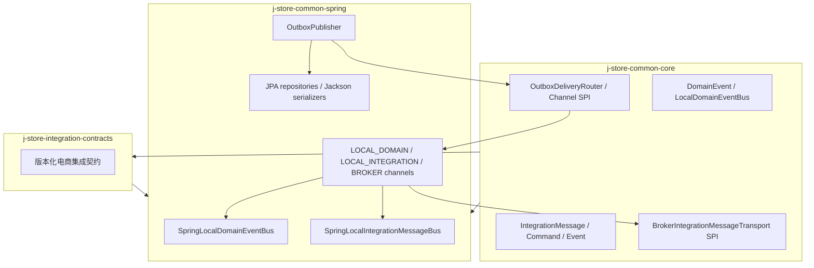
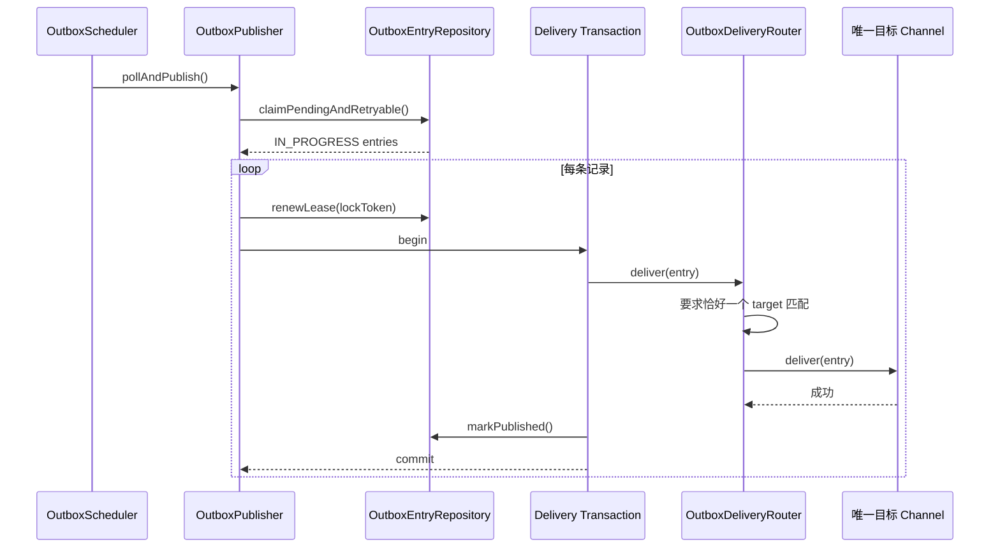
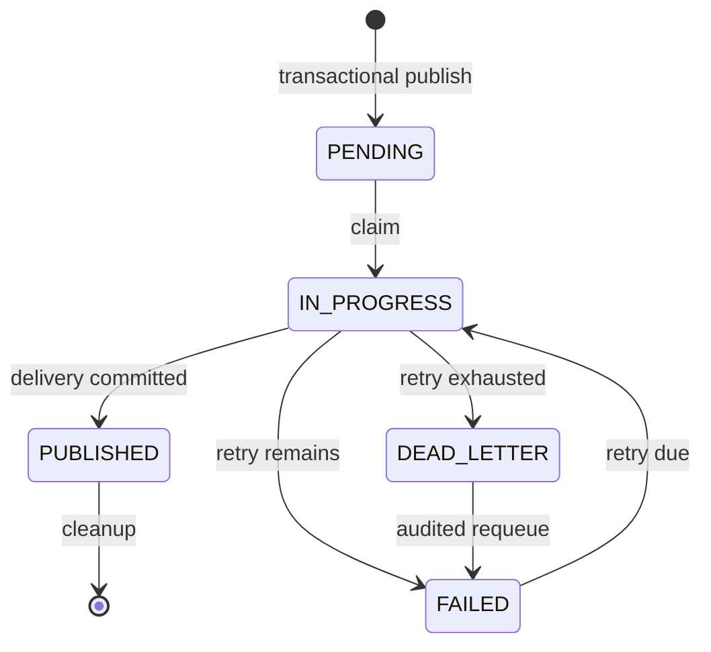

# 事件投递基础设施架构

本文说明 `com.jstore.common.framework.event`、`com.jstore.common.framework.messaging` 及其 Spring/Outbox 适配层的设计边界。

## 设计目标

基础设施将两类语义明确分开：

- `DomainEvent` 是上下文内部事实，只能通过 `LocalDomainEventBus` 在本进程同步分发。
- `IntegrationCommand` / `IntegrationEvent` 是跨有界上下文的稳定契约，可根据部署模式投递到本地 handler、Broker，或同时投递到二者。

两类消息都先在调用方事务内写入 Transactional Outbox。relay 保留至少一次、同聚合顺序、租约、fencing token、指数退避、死信、审计和监控能力。

## 模块与依赖边界



`j-store-integration-contracts` 只依赖 `common-core`，契约 payload 只使用标量、集合和专用 DTO，不依赖任一业务上下文的聚合、实体、值对象或基础设施类。

## 事务性发布

### 领域事件

应用服务通过 `DomainEventPublisher` 发布带 `@DomainEventType` 的 `ExplicitDomainEvent`。`OutboxEventPublisher` 要求调用方已有事务，并写入：

- `messageKind=DOMAIN_EVENT`
- `deliveryTarget=LOCAL_DOMAIN`
- 稳定的事件名称、版本、事件 ID 和聚合键

领域事件不会因部署模式变化而发送到 Broker。跨上下文传播必须先由 translator 显式映射为集成消息。

### 集成消息

translator 或应用服务通过 `IntegrationMessagePublisher` 发布带 `@IntegrationMessageType` 的消息。`OutboxIntegrationMessagePublisher` 同样使用 `Propagation.MANDATORY`，并按 `jstore.messaging.mode` 创建目标记录：

| 模式 | Outbox 目标 | 用途 |
| --- | --- | --- |
| `local` | `LOCAL_INTEGRATION` | 模块化单体，同进程跨上下文 handler |
| `broker` | `BROKER` | 独立服务部署，由 Broker Transport 发送 |
| `hybrid` | 两条独立记录 | 拆分迁移期，本地与 Broker 可独立重试 |

hybrid 的两条记录共享业务 `messageId`，但具有不同 Outbox ID 和状态，避免一次 relay 调用同时提交两个不可原子完成的目标。

## 集成消息信封

`IntegrationMessageEnvelope` 包含：

- `messageId`：稳定幂等键。
- `messageName + messageVersion`：稳定契约标识。
- `messageKind`：区分单接收方命令与可多订阅事件。
- `destination`：逻辑目的地，由具体 Broker adapter 映射到 topic/exchange/queue。
- `partitionKey`：有序分区依据。
- `correlationId` / `causationId`：业务流程和因果链。
- `tenantId`：可选租户或商户隔离标识。
- `occurredAt` 与 JSON `payload`。

Broker adapter 只在 Broker 确认接收后返回。若 Broker 已接收而数据库提交 `PUBLISHED` 失败，relay 会重发；消费者必须使用 `handlerId + messageId` 幂等。

## Relay 与目标路由



目标通道语义：

- `LOCAL_DOMAIN`：反序列化领域事件并同步调用 `LocalDomainEventBus`。
- `LOCAL_INTEGRATION`：反序列化集成消息并同步调用 `LocalIntegrationMessageBus`。
- `BROKER`：不加载业务类型，直接把持久化 envelope 交给 `BrokerIntegrationMessageTransport`。

没有匹配通道或存在重复通道都属于配置错误，进入既有 FAILED/DEAD_LETTER 流程，不能静默丢弃。

## 本地消费与幂等

`DomainEventListener` 和 `IntegrationMessageHandler` 均提供稳定 consumer ID。本地消费先向 `domain_event_consumption` 插入 `(listener_id, event_id)`：

```text
首次插入 -> 执行业务处理
唯一键冲突 -> 跳过重复消费
处理失败 -> delivery transaction 回滚，幂等记录同时回滚
```

本地集成命令要求恰好一个 handler；集成事件允许零到多个 handler。handler 副作用、级联 Outbox 写入、消费记录和当前记录的 `markPublished` 位于同一 delivery transaction。

`DomainListenerSpringWrapper.supportsAsyncExecution()` 固定返回 `false`。可靠本地投递不得通过异步 Spring multicaster 脱离 relay 事务。

## 失败、顺序与死信



- 过期 `IN_PROGRESS` 记录可被重新领取。
- `lockToken` 防止旧 worker 覆盖新 worker 的结果。
- 同一 `aggregateType + aggregateId` 按 `(createdAt, id)` 保序，不同聚合可并行。
- `OutboxDeadLetterService` 支持查询、计数和受审计 requeue。
- `OutboxMonitor` 暴露积压、失败、死信和调度健康指标。

## 配置与启动保护

```properties
jstore.outbox.enabled=true
jstore.messaging.mode=local
```

`local` 是默认值。选择 `broker` 或 `hybrid` 时，Spring 容器必须存在且只能存在一个 `BrokerIntegrationMessageTransport`；否则启动失败。核心模块不绑定 Kafka、RabbitMQ、Pulsar 或云厂商 SDK，具体 adapter 位于独立 infrastructure 模块。

当前 SPI 覆盖可靠出站。Broker 入站 adapter 应完成 envelope 校验、反序列化并调用本地 handler bus，同时复用消息 ID 幂等；它随具体消息中间件实现，不属于公共核心。

## 核心抽象职责

| 抽象 | 职责 | 不负责 |
| --- | --- | --- |
| `LocalDomainEventBus` | 本进程同步领域事件分发 | Broker、远程订阅、可靠存储 |
| `IntegrationMessagePublisher` | 在业务事务中规划目标并写 Outbox | 直接发送 Broker |
| `LocalIntegrationMessageBus` | 本地 handler 选择与幂等调用 | 远程路由 |
| `OutboxDeliveryRouter` | 为记录选择唯一通道 | 推断或修改持久化目标 |
| `BrokerIntegrationMessageTransport` | 等待 Broker 接收确认 | exactly-once、远端业务完成 |
| `OutboxPublisher` | claim、租约、路由、状态和重试 | 业务补偿 |
| `IntegrationMessageTypeRegistry` | `messageName + version` 到本地类型映射 | Broker 目的地映射 |

## 当前边界

- 保证至少一次，不承诺跨数据库 exactly-once。
- 不包含具体 Broker adapter；切换到 `broker`/`hybrid` 前必须提供实现。
- 不包含完整 Saga/Process Manager；相关 ID 和因果 ID 为后续持久化流程管理提供契约基础。
- 当前库存应用服务的生产仓储与锁装配仍未完成，因此单体库存命令会按“缺失 handler/依赖”显式失败并进入重试，而不会被当作成功吞掉。
