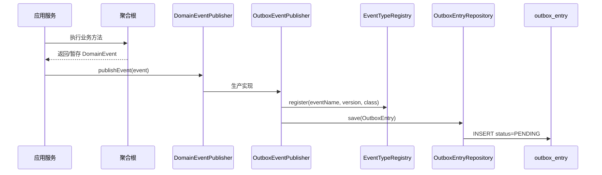
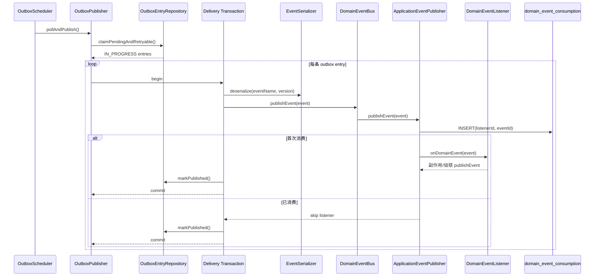
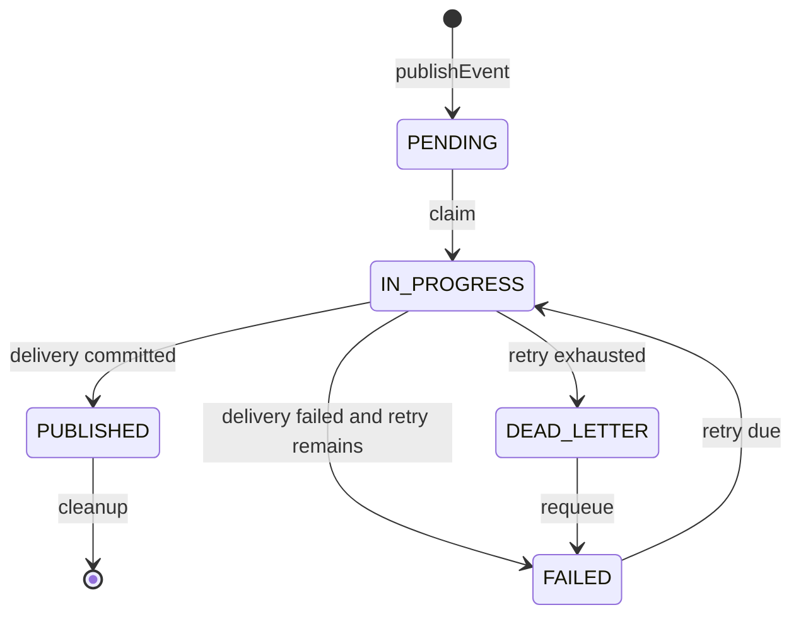
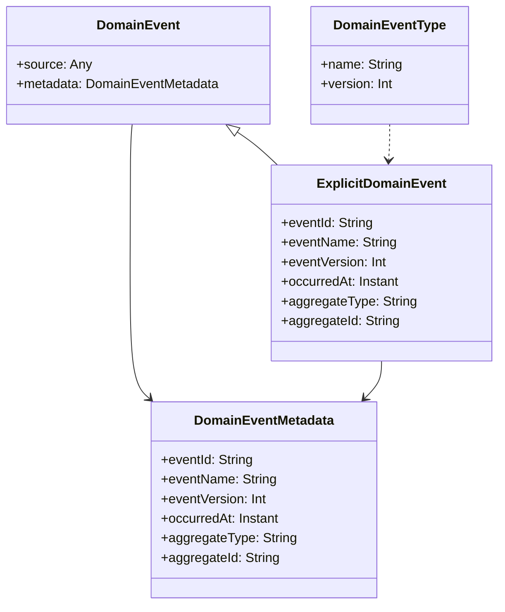
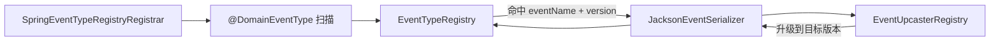
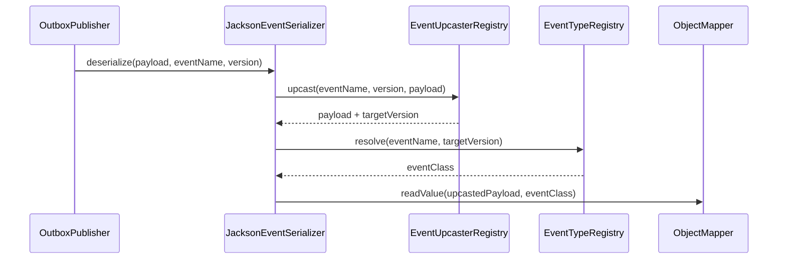
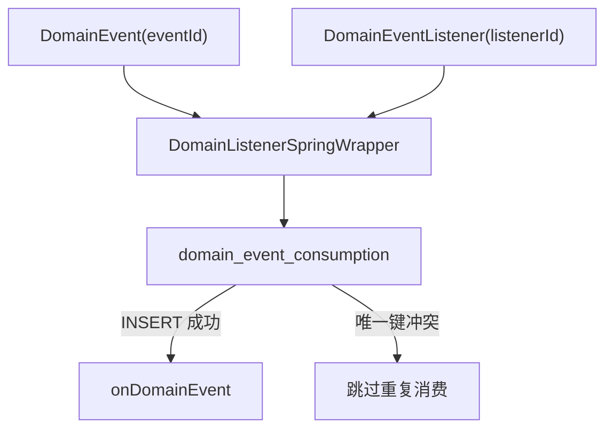

# 领域事件基础设施架构

本文说明 `com.jstore.common.framework.event` 及其 Spring/outbox 适配层的设计边界、核心抽象和运行链路。

## 设计目标

领域事件基础设施用于在本地事务内可靠记录领域事件，并通过 outbox relay 在进程内同步分发给监听器。它的目标不是提供事件溯源，也不是直接替代 Kafka/RabbitMQ，而是提供单体/模块化单体内的可靠事件管道。

核心约束：

- 业务代码通过 `DomainEventPublisher` 发布事件，生产实现写入 outbox。
- `DomainEventBus` 只做本进程分发，不提供可靠投递。
- relay 投递单条事件时，监听器副作用、级联 outbox 写入和 `markPublished` 在同一个事务中完成。
- 监听器必须同步执行，不能通过 Spring 异步 multicaster 脱离 relay 事务。
- 消费幂等以 `listenerId + eventId` 为键，由数据库唯一约束保证。

## 模块分层

```mermaid
flowchart TB
    subgraph Core["j-store-common-core"]
        DomainEvent["DomainEvent / ExplicitDomainEvent"]
        DomainEventMetadata["DomainEventMetadata"]
        DomainEventPublisher["DomainEventPublisher"]
        DomainEventBus["DomainEventBus"]
        DomainEventListener["DomainEventListener"]
        ConsumptionRepo["DomainEventConsumptionRepository"]
        EventSerializer["EventSerializer"]
        EventTypeRegistry["EventTypeRegistry / @DomainEventType"]
        OutboxEntry["OutboxEntry / OutboxEntryRepository"]
    end

    subgraph Spring["j-store-common-spring"]
        SpringBus["SpringDomainEventBus"]
        Wrapper["DomainListenerSpringWrapper"]
        OutboxEventPublisher["OutboxEventPublisher"]
        OutboxPublisher["OutboxPublisher"]
        TxOps["OutboxRelayTransactionOperations"]
        JpaOutboxRepo["OutboxEntryRepositoryImpl"]
        JpaConsumptionRepo["DomainEventConsumptionRepositoryImpl"]
        JacksonSerializer["JacksonEventSerializer"]
        Registrar["SpringEventTypeRegistryRegistrar"]
        Monitor["OutboxMonitor / OutboxDeadLetterService"]
    end

    DomainEventPublisher --> OutboxEventPublisher
    DomainEventBus --> SpringBus
    DomainEventListener --> Wrapper
    ConsumptionRepo --> JpaConsumptionRepo
    EventSerializer --> JacksonSerializer
    EventTypeRegistry --> Registrar
    OutboxEntry --> JpaOutboxRepo
```



`j-store-common-core` 只定义领域事件和 outbox 的抽象，不依赖 Spring。`j-store-common-spring` 负责把这些抽象落到 Spring 事件机制、JPA、Jackson、Micrometer 和事务管理上。

## 发布链路



发布事件要求调用方已处于业务事务内。`OutboxEventPublisher` 使用 `Propagation.MANDATORY`，因此如果业务代码在无事务上下文中发布事件，会快速失败，避免产生“业务数据未提交但事件已写入”或“业务提交但事件丢失”的不一致。

`OutboxEntry` 中的关键字段：

- `eventId`：事件幂等 ID。
- `eventType`：稳定事件名，即 `eventName`。
- `eventVersion`：事件版本。
- `eventClassName`：历史冗余字段，仅保留兼容旧表结构；新 relay 反序列化不再读取它。
- `aggregateType` / `aggregateId`：聚合维度排查和幂等协作。
- `status`：`PENDING`、`IN_PROGRESS`、`FAILED`、`PUBLISHED`、`DEAD_LETTER`。

## Relay 投递链路



`claimPendingAndRetryable()` 只负责领取事件并设置 `IN_PROGRESS`、锁持有者和锁超时时间。单条事件的实际投递由 `OutboxRelayTransactionOperations` 开启 delivery transaction。

delivery transaction 中包含：

- 反序列化事件。
- `DomainEventBus.publishEvent()` 本进程分发。
- listener 的业务副作用。
- listener 中级联调用 `DomainEventPublisher` 写入新的 outbox。
- 当前 entry 的 `markPublished()`。

如果任意步骤失败，delivery transaction 回滚，随后 relay 使用独立 failure transaction 执行 `markFailed()` 或转入 `DEAD_LETTER`。

## 失败与死信



失败处理由 `OutboxPublisher` 统一执行：

- relay 崩溃或超时后，过期的 `IN_PROGRESS` 会被下一轮 claim 恢复。
- 未达到重试上限时，状态改为 `FAILED` 并设置 `nextAttemptAt`。
- 达到重试上限时，状态改为 `DEAD_LETTER`。
- `OutboxDeadLetterService` 提供死信查询、计数和 requeue。
- `OutboxMonitor` 提供基础 Micrometer 指标。

## 事件契约



所有可进入 outbox 的事件必须实现 `ExplicitDomainEvent` 并标注 `@DomainEventType`：

```kotlin
@DomainEventType(name = "order.paid", version = 1)
data class OrderPaidEvent(
    val orderId: OrderId,
    val paidAmount: Price,
    override val occurredAt: Instant = Instant.now(),
) : ExplicitDomainEvent {
    override val source: Any get() = orderId
    override val eventName: String get() = "order.paid"
    override val eventVersion: Int get() = 1
    override val aggregateType: String get() = "Order"
    override val aggregateId: String get() = orderId.value.toString()
    override val eventId: String
        get() = stableDomainEventId(eventName, eventVersion, aggregateType, aggregateId, occurredAt)
}
```

`DomainEventMetadata.from()` 不再提供属性反射兜底。只实现 `DomainEvent` 的事件无法提供稳定 envelope，进入 outbox 时会失败。这样可以在开发期尽早暴露事件契约缺失，而不是把类名、默认版本或 `source.toString()` 写入持久化数据。

## 事件类型注册与反序列化



启动时 `SpringEventTypeRegistryRegistrar` 扫描配置包下所有带 `@DomainEventType` 的事件类，并注册到 `EventTypeRegistry`。同一个 `eventName + eventVersion` 只能绑定一个事件类；重复标注会在启动期 fail fast。`JacksonEventSerializer` 反序列化时只使用 `eventName + eventVersion`，不再使用 `eventClassName` 加载 Java 类。`eventClassName` 字段目前仅作为历史冗余字段保留在 outbox 记录中，不参与新 relay 解析。

默认扫描包由 `jstore.outbox.event-type-scan-packages` 配置，默认值为 `["com.jstore"]`。

## 事件版本升级

事件版本升级由 `EventUpcaster` 链式完成：



每个 `EventUpcaster` 负责同一事件名下一个源版本到目标版本的 JSON payload 转换。`InMemoryEventUpcasterRegistry` 要求 `targetVersion > sourceVersion`，并且同一个 `eventName + sourceVersion` 只能注册一个 upcaster；重复注册会在启动期 fail fast。新增事件版本时，需要同时注册新版本 `@DomainEventType` 和必要的旧版本 upcaster。

## Listener 幂等



`DomainEventListener` 必须显式提供稳定 `listenerId()`，接口不再提供类名默认值。新增 listener 如果没有业务 ID 会直接编译失败。listener 注册时还会解析泛型事件类型；如果不能解析到具体 `DomainEvent` 类，会启动失败，避免监听器静默收不到事件。

```kotlin
class OrderPaidAccountingEventHandler(
    private val accountingApplicationService: AccountingApplicationService,
) : DomainEventListener<OrderPaidEvent> {
    override fun listenerId(): String = "accounting.record-order-paid"

    override fun onDomainEvent(event: OrderPaidEvent) {
        // 业务副作用
    }
}
```

幂等表主键：

```text
(listener_id, event_id)
```

这保证同一个 listener 对同一个事件最多执行一次。幂等记录和 listener 副作用处于 relay delivery transaction 内；如果 listener 失败，幂等记录会一起回滚，后续可以重试。

## 同步执行约束

`DomainListenerSpringWrapper` 实现了 Spring `GenericApplicationListener.supportsAsyncExecution()`，固定返回 `false`。

原因是可靠 relay 要求 listener 副作用与 `markPublished()` 同事务。如果 listener 通过异步 multicaster 进入另一个线程执行，relay 线程可能提前 `markPublished()`，导致 outbox 显示已发布但真实消费失败。

如需异步处理，应通过以下方式之一显式建模：

- listener 中发布新的 outbox 事件，由后续 relay/worker 处理；
- 接入外部消息中间件，将 outbox relay 扩展为消息投递器；
- 独立任务表/作业系统处理长耗时逻辑。

不要在 `DomainEventListener` 本地消费链路中启用异步执行。`SpringDomainEventMulticasterGuard` 默认记录告警；如需把异步 multicaster 视为启动错误，可配置 `jstore.outbox.async-multicaster-fail-fast=true`。

## 核心抽象职责

| 抽象 | 所在模块 | 职责 | 不负责 |
| --- | --- | --- | --- |
| `DomainEvent` | common-core | 领域事件最小接口 | 可靠投递、存储 |
| `ExplicitDomainEvent` | common-core | 显式稳定事件契约 | 事件溯源 |
| `DomainEventPublisher` | common-core | 事务性发布入口 | 本进程监听器分发 |
| `DomainEventBus` | common-core | 本进程分发入口 | outbox 可靠性 |
| `DomainEventListener` | common-core | 事件消费处理器 | 异步调度 |
| `DomainEventConsumptionRepository` | common-core | listener 幂等记录抽象 | 业务幂等逻辑 |
| `EventTypeRegistry` | common-core | `eventName + version` 到事件类的映射 | 事件版本升级策略 |
| `EventUpcasterRegistry` | common-core | 旧事件 payload 升级到目标版本 | 事件类解析 |
| `EventSerializer` | common-core | 事件序列化/反序列化抽象 | 类型注册 |
| `OutboxEntryRepository` | common-core | outbox 状态存取抽象 | listener 执行 |
| `OutboxEventPublisher` | common-spring | 写 outbox 的发布实现 | 本地分发 |
| `OutboxPublisher` | common-spring | relay 投递、重试、死信 | 业务补偿 |
| `SpringDomainEventBus` | common-spring | 通过 Spring 发布本地事件 | 可靠投递 |
| `DomainListenerSpringWrapper` | common-spring | Spring listener 适配、幂等、同步约束 | 外部消息投递 |
| `OutboxDeadLetterService` | common-spring | 死信查询和 requeue | 管理 UI |

## 当前边界与后续演进

当前基础设施提供的是“至少一次投递 + listener 幂等”的可靠事件管道。它不保证跨服务强一致，也不提供事件溯源。

后续可演进方向：

- 增加死信管理端和告警规则。
- 增加 outbox relay 到 Kafka/RabbitMQ 的投递器。
- 增加架构测试，禁止生产代码使用 `@EventListener` 处理领域事件。
