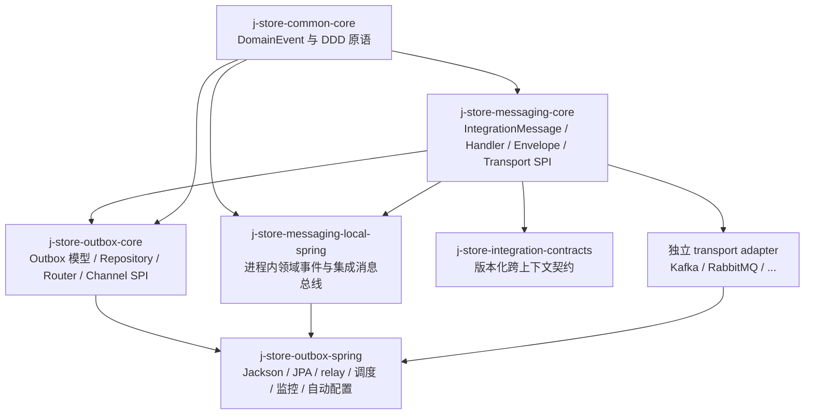
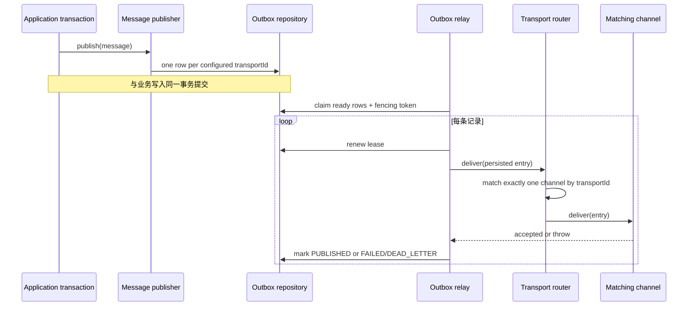
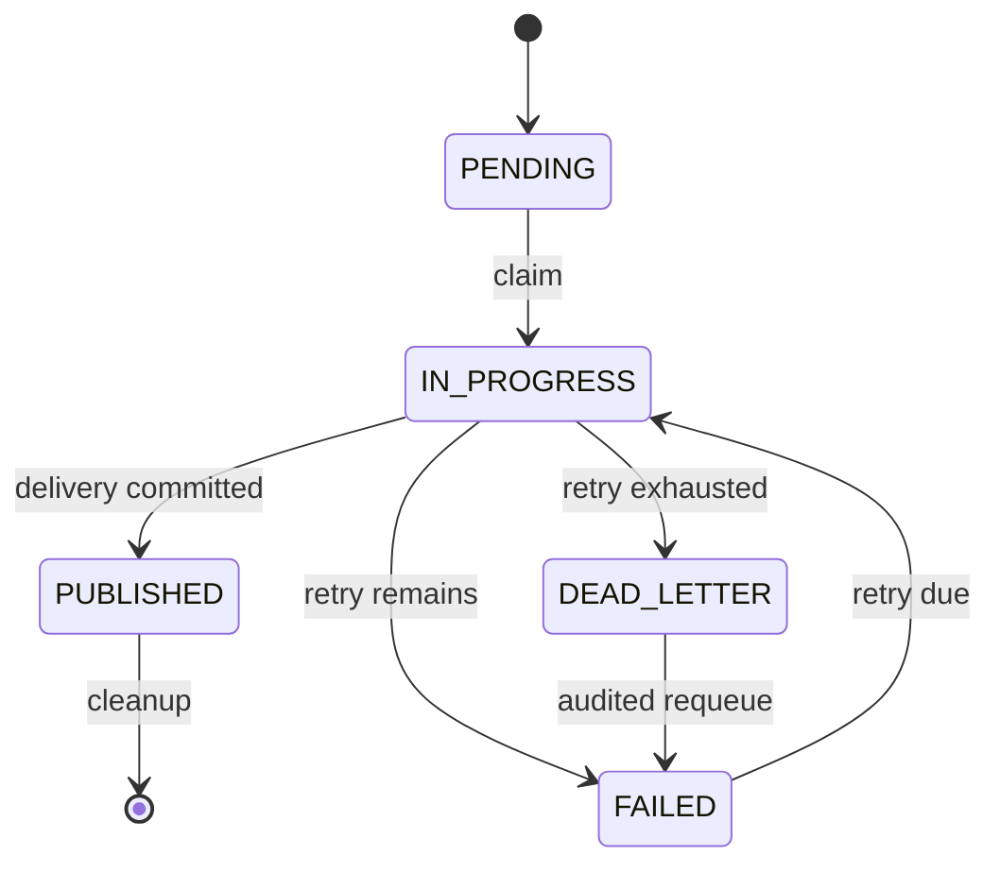

# 事件投递基础设施架构

本文说明领域事件、集成消息、Transactional Outbox 与可插拔消息传输的当前边界。

## 语义边界

- `DomainEvent` 是上下文内部事实，固定写入 `transportId=local-domain`，通过进程内 `LocalDomainEventBus` 同步分发。
- `IntegrationCommand` / `IntegrationEvent` 是跨有界上下文的稳定契约，可按部署配置写入一个或多个 transport 目标。
- 两类消息都先在调用方事务中写入 Outbox。relay 保留至少一次、同聚合顺序、租约、fencing token、指数退避、死信、审计和监控语义。

## 模块与依赖



业务 domain 不依赖消息或 Outbox 基础设施。需要发布或处理集成消息的 application 只依赖 `messaging-core` 和发布语言契约；Spring、JPA、relay 与具体中间件只出现在组合/基础设施边界。

## Transport 模型

`transportId` 是持久化在每条 Outbox 记录上的稳定非空字符串。内建 ID：

- `local-domain`：领域事件的进程内投递。
- `local`：集成消息的进程内 handler 投递。
- 其它 ID（如 `kafka`、`rabbitmq`）：由独立 adapter 实现 `IntegrationMessageTransport`。

集成消息发布者按 `jstore.messaging.targets` 为每个目标创建一条独立记录。多目标记录共享业务 `messageId`，但拥有不同 Outbox ID、`transportId`、状态和重试生命周期。配置之后发生变化时，历史记录仍按其持久化目标投递。

```properties
jstore.outbox.enabled=true
jstore.messaging.targets=local
```

多目标示例：

```properties
jstore.messaging.targets=local,kafka
```

启动时，每个已配置目标必须恰好对应一个本地 channel 或 `IntegrationMessageTransport`；缺失或重复都会显式失败。默认值为 `local`。旧的 `jstore.messaging.mode=local|broker|hybrid` 已删除。

## 发布与投递



`OutboxDeliveryRouter` 不读取当前发布配置，也不根据 `deliveryTarget` 猜测中间件。零个或多个 `transportId` 匹配都是确定性错误，沿既有失败/死信状态机处理。

外部 adapter 收到 `IntegrationMessageEnvelope`，其中包括稳定消息 ID、名称和版本、消息种类、逻辑 destination、partition key、correlation/causation ID、tenant ID、发生时间和 JSON payload。`publish` 只可在中间件确认接收后返回；数据库提交失败仍可能导致重发，因此消费者必须按稳定 message ID 幂等。

## 本地消费与事务

`DomainEventListener` 和 `IntegrationMessageHandler` 均提供稳定 consumer ID。本地消费先写入 `(listener_id, event_id)` 幂等记录：

```text
首次插入 -> 执行业务处理
唯一键冲突 -> 跳过重复消费
处理失败 -> delivery transaction 回滚，幂等记录同时回滚
```

本地集成命令要求恰好一个 handler；集成事件允许零到多个 handler。handler 副作用、级联 Outbox 写入、消费记录和当前记录的 `markPublished` 位于同一 delivery transaction。可靠本地投递不使用异步 Spring multicaster。

## 状态、监控与迁移



- 过期租约可重新领取，`lockToken` 防止旧 worker 覆盖新 worker 的结果。
- 同一 `aggregateType + aggregateId` 按 `(createdAt, id)` 保序。
- 投递成功、失败和死信指标包含 `transportId`，便于区分本地、Kafka、RabbitMQ 等目标。
- migration `V20260810__outbox_transport_id.sql` 为历史记录回填 `local-domain`、`local` 或兼容 ID `broker`，之后字段为非空。

## 扩展一个消息中间件

新增 adapter 只需：

1. 依赖 `j-store-messaging-core`，实现 `IntegrationMessageTransport` 并提供稳定且唯一的 `transportId`。
2. 将逻辑 destination 和 partition key 映射到中间件概念，并等待中间件接收确认。
3. 在部署模块注册 adapter Bean，并将其 ID 加入 `jstore.messaging.targets`。
4. 入站 adapter 校验 envelope、调用本地 handler，并复用 `handlerId + messageId` 幂等；入站实现不属于 Outbox 核心。

业务模块、Outbox 模型和路由器无需随 Kafka、RabbitMQ 或其它实现变化。

## 保证边界

- 保证至少一次，不承诺跨数据库 exactly-once。
- 不提供跨中间件原子投递；每个目标独立记录和重试。
- 当前核心不绑定 Kafka、RabbitMQ、Pulsar 或云厂商客户端。
- 领域事件不会因部署配置自动升级成外部事件；跨上下文传播必须显式翻译为集成消息。

## 演进研究

当前 polling relay 向 append-only Outbox、PostgreSQL CDC、canonical event log 和分片架构演进的候选方案，见
[Transactional Outbox 与 CDC 扩展性研究报告](Transactional%20Outbox%20与%20CDC%20扩展性研究报告.md)。该报告是研究材料，尚不表示 CDC 已经实现或成为当前运行时默认路径。
